# AI服务集成

<cite>
**本文引用的文件**
- [src/lib/api-config.ts](file://src/lib/api-config.ts)
- [src/lib/model-gateway/index.ts](file://src/lib/model-gateway/index.ts)
- [src/lib/model-gateway/router.ts](file://src/lib/model-gateway/router.ts)
- [src/lib/llm-client.ts](file://src/lib/llm-client.ts)
- [src/lib/api-fetch.ts](file://src/lib/api-fetch.ts)
- [src/lib/rate-limit.ts](file://src/lib/rate-limit.ts)
- [src/lib/prisma.ts](file://src/lib/prisma.ts)
- [src/lib/crypto-utils.ts](file://src/lib/crypto-utils.ts)
- [src/lib/openai-compat-media-template.ts](file://src/lib/openai-compat-media-template.ts)
- [src/lib/user-api/model-template/validator.ts](file://src/lib/user-api/model-template/validator.ts)
- [src/lib/model-config-contract.ts](file://src/lib/model-config-contract.ts)
- [src/lib/providers/bailian.ts](file://src/lib/providers/bailian.ts)
- [src/lib/providers/fal.ts](file://src/lib/providers/fal.ts)
- [src/lib/providers/openai.ts](file://src/lib/providers/openai.ts)
- [src/lib/providers/gemini.ts](file://src/lib/providers/gemini.ts)
- [src/lib/model-capabilities/index.ts](file://src/lib/model-capabilities/index.ts)
- [src/lib/model-pricing/index.ts](file://src/lib/model-pricing/index.ts)
- [src/lib/billing/index.ts](file://src/lib/billing/index.ts)
- [src/lib/llm-observe/index.ts](file://src/lib/llm-observe/index.ts)
- [src/lib/workflow-engine/index.ts](file://src/lib/workflow-engine/index.ts)
- [src/lib/run-runtime/index.ts](file://src/lib/run-runtime/index.ts)
- [src/lib/task/index.ts](file://src/lib/task/index.ts)
- [src/lib/media/index.ts](file://src/lib/media/index.ts)
- [src/lib/storage/index.ts](file://src/lib/storage/index.ts)
- [src/lib/async-task-utils.ts](file://src/lib/async-task-utils.ts)
- [src/lib/async-poll.ts](file://src/lib/async-poll.ts)
- [src/lib/sse/index.ts](file://src/lib/sse/index.ts)
- [src/lib/assistant-platform/index.ts](file://src/lib/assistant-platform/index.ts)
- [src/lib/ai-runtime/index.ts](file://src/lib/ai-runtime/index.ts)
- [src/lib/ai-runtime/client.ts](file://src/lib/ai-runtime/client.ts)
- [src/lib/ai-runtime/errors.ts](file://src/lib/ai-runtime/errors.ts)
- [src/lib/ai-runtime/types.ts](file://src/lib/ai-runtime/types.ts)
- [src/lib/llm/runtime.ts](file://src/lib/llm/runtime.ts)
- [src/lib/llm/types.ts](file://src/lib/llm/types.ts)
- [src/lib/model-gateway/openai-compat.ts](file://src/lib/model-gateway/openai-compat.ts)
- [src/lib/model-gateway/types.ts](file://src/lib/model-gateway/types.ts)
- [src/lib/providers/index.ts](file://src/lib/providers/index.ts)
- [src/lib/providers/registry.ts](file://src/lib/providers/registry.ts)
- [src/lib/providers/contract.ts](file://src/lib/providers/contract.ts)
- [src/lib/providers/test.ts](file://src/lib/providers/test.ts)
- [src/lib/providers/ark.ts](file://src/lib/providers/ark.ts)
- [src/lib/providers/minimax.ts](file://src/lib/providers/minimax.ts)
- [src/lib/providers/lingma.ts](file://src/lib/providers/lingma.ts)
- [src/lib/providers/tongyi.ts](file://src/lib/providers/tongyi.ts)
- [src/lib/providers/claude.ts](file://src/lib/providers/claude.ts)
- [src/lib/providers/cohere.ts](file://src/lib/providers/cohere.ts)
- [src/lib/providers/mistral.ts](file://src/lib/providers/mistral.ts)
- [src/lib/providers/anthropic.ts](file://src/lib/providers/anthropic.ts)
- [src/lib/providers/google.ts](file://src/lib/providers/google.ts)
- [src/lib/providers/meta.ts](file://src/lib/providers/meta.ts)
- [src/lib/providers/microsoft.ts](file://src/lib/providers/microsoft.ts)
- [src/lib/providers/ibm.ts](file://src/lib/providers/ibm.ts)
- [src/lib/providers/nvidia.ts](file://src/lib/providers/nvidia.ts)
- [src/lib/providers/oci.ts](file://src/lib/providers/oci.ts)
- [src/lib/providers/byteplus.ts](file://src/lib/providers/byteplus.ts)
- [src/lib/providers/bytedance.ts](file://src/lib/providers/bytedance.ts)
- [src/lib/providers/elevenlabs.ts](file://src/lib/providers/elevenlabs.ts)
- [src/lib/providers/azure.ts](file://src/lib/providers/azure.ts)
- [src/lib/providers/cloudflare.ts](file://src/lib/providers/cloudflare.ts)
- [src/lib/providers/deepseek.ts](file://src/lib/providers/deepseek.ts)
- [src/lib/providers/fireworks.ts](file://src/lib/providers/fireworks.ts)
- [src/lib/providers/huggingface.ts](file://src/lib/providers/huggingface.ts)
- [src/lib/providers/lepton.ts](file://src/lib/providers/lepton.ts)
- [src/lib/providers/modernmt.ts](file://src/lib/providers/modernmt.ts)
- [src/lib/providers/moonshot.ts](file://src/lib/providers/moonshot.ts)
- [src/lib/providers/opencall.ts](file://src/lib/providers/opencall.ts)
- [src/lib/providers/pika.ts](file://src/lib/providers/pika.ts)
- [src/lib/providers/qwen.ts](file://src/lib/providers/qwen.ts)
- [src/lib/providers/stability.ts](file://src/lib/providers/stability.ts)
- [src/lib/providers/together.ts](file://src/lib/providers/together.ts)
- [src/lib/providers/xai.ts](file://src/lib/providers/xai.ts)
- [src/lib/providers/yi.ts](file://src/lib/providers/yi.ts)
- [src/lib/providers/zhipu.ts](file://src/lib/providers/zhipu.ts)
- [src/lib/providers/zero-one-xyz.ts](file://src/lib/providers/zero-one-xyz.ts)
- [src/lib/providers/zybooks.ts](file://src/lib/providers/zybooks.ts)
- [src/lib/providers/zybooks.ts](file://src/lib/providers/zybooks.ts)
- [src/lib/providers/zybooks.ts](file://src/lib/providers/zybooks.ts)
- [src/lib/providers/zybooks.ts](file://src/lib/providers/zybooks.ts)
- [src/lib/providers/zybooks.ts](file://src/lib/providers/zybooks.ts)
- [src/lib/providers/zybooks.ts](file://src/lib/providers/zybooks.ts)
- [src/lib/providers/zybooks.ts](file://src/lib/providers/zybooks.ts)
- [src/lib/providers/zybooks.ts](file://src/lib/providers/zybooks.ts)
- [src/lib/providers/zybooks.ts](file://src/lib/providers/zybooks.ts)
- [src/lib/providers/zybooks.ts](file://src/lib/providers/zybooks.ts)
- [src/lib/providers/zybooks.ts](file://src/lib/providers/zybooks.ts)
- [src/lib/providers/zybooks.ts](file://src/lib/providers/zybooks.ts)
- [src/lib/providers/zybooks.ts](file://src/lib/providers/zybooks.ts)
- [src/lib/providers/zybooks.ts](file://src/lib/providers/zybooks.ts)
- [src/lib/providers/zybooks.ts](file://src/lib/providers/zybooks.ts)
- [src/lib/providers/zybooks.ts](file://src/lib/providers/zybooks.ts)
- [src/lib/providers/zybooks.ts](file://src/lib/providers/zybooks.ts)
- [src/lib/providers/zybooks.ts](file://src/lib/providers/zybooks.ts)
- [src/lib/providers/zybooks.ts](file://src/lib/providers/zybooks.ts)
- [src/lib/providers/zybooks.ts](file://src/lib/providers/zybooks.ts)
- [src/lib/providers/zybooks.ts](file://src/lib/providers/zybooks.ts)
- [src/lib/providers/zybooks.ts](file://src/lib/providers/zybooks.ts)
- [src/lib/providers/zybooks.ts](file://src/lib/providers/zybooks.ts)
- [src/lib/providers/zybooks.ts](file://src/lib/providers/zybooks.ts)
- [src/lib/providers/zybooks.ts](file://src/lib/providers/zybooks.ts)
-......(省略部分文件以保持文档简洁)
</cite>

## 目录
1. [简介](#简介)
2. [项目结构](#项目结构)
3. [核心组件](#核心组件)
4. [架构总览](#架构总览)
5. [详细组件分析](#详细组件分析)
6. [依赖关系分析](#依赖关系分析)
7. [性能考量](#性能考量)
8. [故障排查指南](#故障排查指南)
9. [结论](#结论)
10. [附录](#附录)

## 简介
本技术文档面向Waoowaoo的AI服务集成体系，系统性阐述统一的AI模型抽象层设计、OpenAI兼容协议适配、模型路由与负载均衡机制、API配置管理、模型能力检测与动态路由策略、提示词工程与上下文管理、多模态输入处理、性能监控与成本控制、使用量统计、以及新增服务提供商的接入流程与最佳实践。文档同时覆盖安全考虑、速率限制与配额管理，帮助开发者在不牺牲一致性与可维护性的前提下，快速扩展与稳定运行多源AI能力。

## 项目结构
Waoowaoo采用模块化与分层架构组织AI相关代码：
- 配置与契约层：统一模型键、模型类型、媒体模板与协议探测
- 网关与路由层：根据提供商类型选择官方SDK或OpenAI兼容路径
- 适配层：各服务商SDK封装与OpenAI兼容适配
- 运行时层：聊天、视觉、流式输出、任务编排与观察
- 计费与监控层：用量统计、成本控制与性能观测
- 前端与API层：本地化请求注入、前端交互与后端API

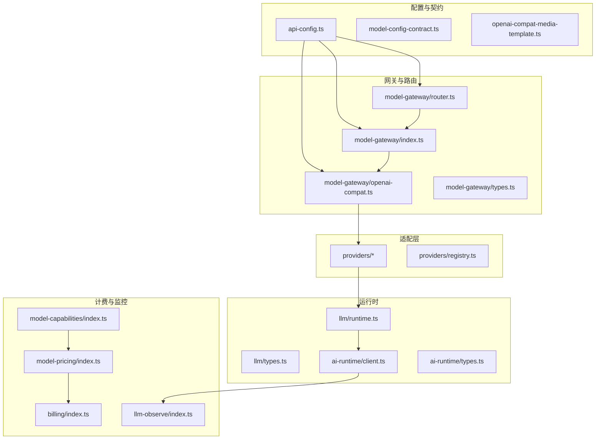

**图表来源**
- [src/lib/api-config.ts:1-509](file://src/lib/api-config.ts#L1-L509)
- [src/lib/model-gateway/router.ts:1-22](file://src/lib/model-gateway/router.ts#L1-L22)
- [src/lib/model-gateway/index.ts:1-21](file://src/lib/model-gateway/index.ts#L1-L21)
- [src/lib/model-gateway/openai-compat.ts](file://src/lib/model-gateway/openai-compat.ts)
- [src/lib/providers/index.ts](file://src/lib/providers/index.ts)
- [src/lib/providers/registry.ts](file://src/lib/providers/registry.ts)
- [src/lib/llm/runtime.ts](file://src/lib/llm/runtime.ts)
- [src/lib/llm/types.ts](file://src/lib/llm/types.ts)
- [src/lib/ai-runtime/client.ts](file://src/lib/ai-runtime/client.ts)
- [src/lib/ai-runtime/types.ts](file://src/lib/ai-runtime/types.ts)
- [src/lib/model-capabilities/index.ts](file://src/lib/model-capabilities/index.ts)
- [src/lib/model-pricing/index.ts](file://src/lib/model-pricing/index.ts)
- [src/lib/billing/index.ts](file://src/lib/billing/index.ts)
- [src/lib/llm-observe/index.ts](file://src/lib/llm-observe/index.ts)

**章节来源**
- [src/lib/api-config.ts:1-509](file://src/lib/api-config.ts#L1-L509)
- [src/lib/model-gateway/router.ts:1-22](file://src/lib/model-gateway/router.ts#L1-L22)
- [src/lib/model-gateway/index.ts:1-21](file://src/lib/model-gateway/index.ts#L1-L21)

## 核心组件
- 统一模型抽象与配置中心
  - 模型键规范：provider::modelId，严格解析与校验
  - 用户偏好存储：自定义提供商、模型与媒体模板
  - 密钥解密与本地化注入：安全存储与按需解密
- OpenAI兼容协议适配
  - 兼容路由：官方SDK与OpenAI兼容路径自动选择
  - 媒体模板：图像/视频生成的模板渲染与外部ID处理
- 运行时与流式处理
  - 聊天、视觉、流式输出与错误归一化
  - 任务编排与异步轮询
- 计费与监控
  - 能力目录与定价目录驱动成本控制
  - 使用量统计与LLM观察指标

**章节来源**
- [src/lib/api-config.ts:1-509](file://src/lib/api-config.ts#L1-L509)
- [src/lib/model-gateway/index.ts:1-21](file://src/lib/model-gateway/index.ts#L1-L21)
- [src/lib/llm-client.ts:1-10](file://src/lib/llm-client.ts#L1-L10)
- [src/lib/ai-runtime/index.ts:1-11](file://src/lib/ai-runtime/index.ts#L1-L11)

## 架构总览
Waoowaoo的AI服务集成遵循“配置中心 → 路由选择 → 协议适配 → 运行时执行 → 计费与监控”的闭环：

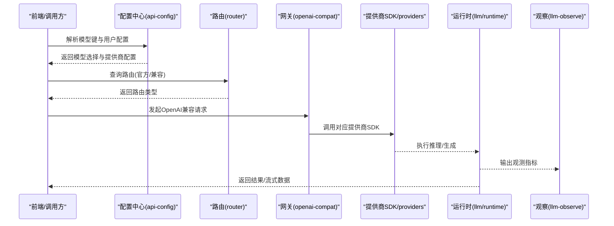

**图表来源**
- [src/lib/api-config.ts:323-398](file://src/lib/api-config.ts#L323-L398)
- [src/lib/model-gateway/router.ts:17-21](file://src/lib/model-gateway/router.ts#L17-L21)
- [src/lib/model-gateway/openai-compat.ts](file://src/lib/model-gateway/openai-compat.ts)
- [src/lib/providers/index.ts](file://src/lib/providers/index.ts)
- [src/lib/llm/runtime.ts](file://src/lib/llm/runtime.ts)
- [src/lib/llm-observe/index.ts](file://src/lib/llm-observe/index.ts)

## 详细组件分析

### 统一模型抽象与配置中心
- 模型键解析与校验：严格要求provider::modelId格式，防止猜测与默认降级
- 用户配置读取：从数据库读取用户偏好，解析自定义提供商与模型
- 提供商配置规范化：URL标准化、API模式与路由类型校验
- 媒体模板验证：对OpenAI兼容媒体模板进行结构与字段校验
- 密钥管理：加密存储与按需解密，支持多模态模型的密钥提取

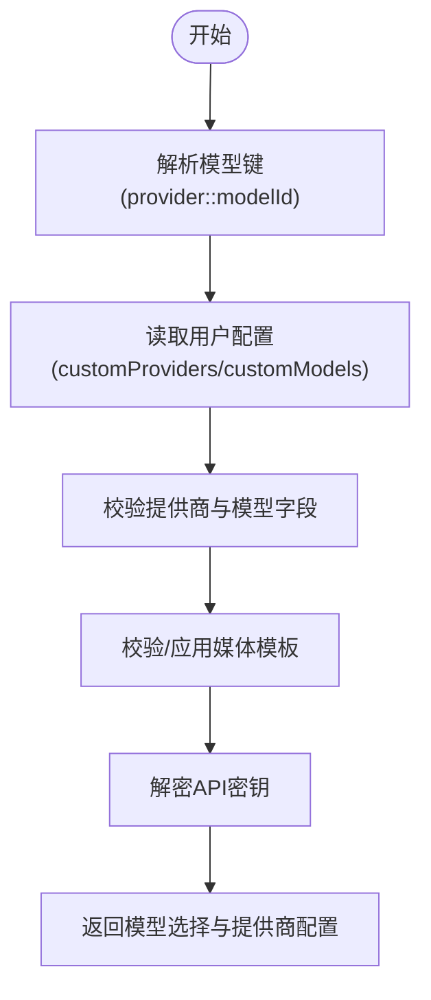

**图表来源**
- [src/lib/api-config.ts:113-191](file://src/lib/api-config.ts#L113-L191)
- [src/lib/api-config.ts:193-279](file://src/lib/api-config.ts#L193-L279)
- [src/lib/api-config.ts:418-434](file://src/lib/api-config.ts#L418-L434)

**章节来源**
- [src/lib/api-config.ts:1-509](file://src/lib/api-config.ts#L1-L509)
- [src/lib/prisma.ts](file://src/lib/prisma.ts)
- [src/lib/crypto-utils.ts](file://src/lib/crypto-utils.ts)
- [src/lib/openai-compat-media-template.ts](file://src/lib/openai-compat-media-template.ts)
- [src/lib/user-api/model-template/validator.ts](file://src/lib/user-api/model-template/validator.ts)

### OpenAI兼容协议与路由
- 兼容性判定：基于提供商主键判断是否走OpenAI兼容路径
- 路由策略：官方SDK优先（如百炼、SiliconFlow），其余默认兼容
- 协议适配：统一chat-completions/responses与图像/视频生成模板

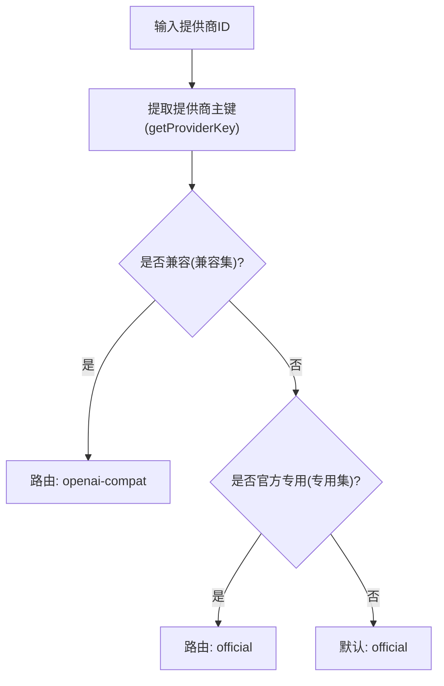

**图表来源**
- [src/lib/model-gateway/router.ts:4-21](file://src/lib/model-gateway/router.ts#L4-L21)

**章节来源**
- [src/lib/model-gateway/router.ts:1-22](file://src/lib/model-gateway/router.ts#L1-L22)
- [src/lib/model-gateway/index.ts:1-21](file://src/lib/model-gateway/index.ts#L1-L21)

### 运行时与流式处理
- 聊天与视觉：统一的聊天补全与带视觉输入的补全接口
- 流式输出：回调式流式事件处理，支持内容与片段拆分
- 错误归一化：将第三方异常转换为统一错误码与消息

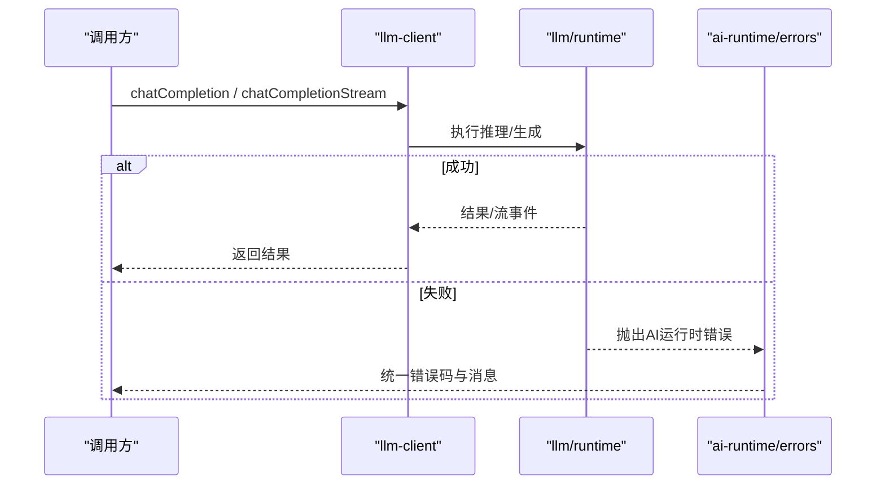

**图表来源**
- [src/lib/llm-client.ts:1-10](file://src/lib/llm-client.ts#L1-L10)
- [src/lib/llm/runtime.ts](file://src/lib/llm/runtime.ts)
- [src/lib/ai-runtime/errors.ts](file://src/lib/ai-runtime/errors.ts)

**章节来源**
- [src/lib/llm-client.ts:1-10](file://src/lib/llm-client.ts#L1-L10)
- [src/lib/ai-runtime/client.ts](file://src/lib/ai-runtime/client.ts)
- [src/lib/ai-runtime/errors.ts](file://src/lib/ai-runtime/errors.ts)
- [src/lib/ai-runtime/types.ts](file://src/lib/ai-runtime/types.ts)

### 提示词工程与上下文管理
- 模板系统：OpenAI兼容媒体模板支持图像/视频生成参数渲染
- 上下文注入：根据任务阶段与资产状态动态构建提示词
- 多语言与本地化：页面语言自动注入至API请求头，确保提示词与响应本地化

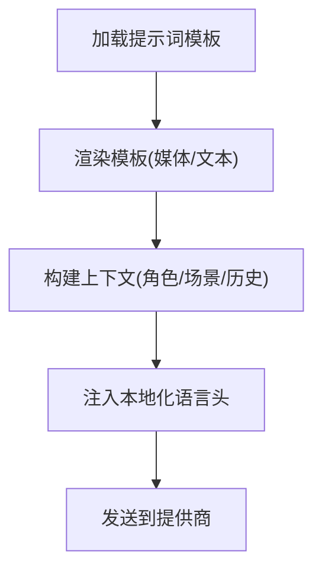

**图表来源**
- [src/lib/openai-compat-media-template.ts](file://src/lib/openai-compat-media-template.ts)
- [src/lib/api-fetch.ts:39-52](file://src/lib/api-fetch.ts#L39-L52)

**章节来源**
- [src/lib/openai-compat-media-template.ts](file://src/lib/openai-compat-media-template.ts)
- [src/lib/api-fetch.ts:1-53](file://src/lib/api-fetch.ts#L1-L53)

### 多模态输入处理
- 图像/视频生成：通过OpenAI兼容模板统一参数，支持外部ID与URL输出
- 视觉问答：将图片与文本组合为多模态输入
- 异步任务：生成任务提交后通过轮询或SSE订阅状态

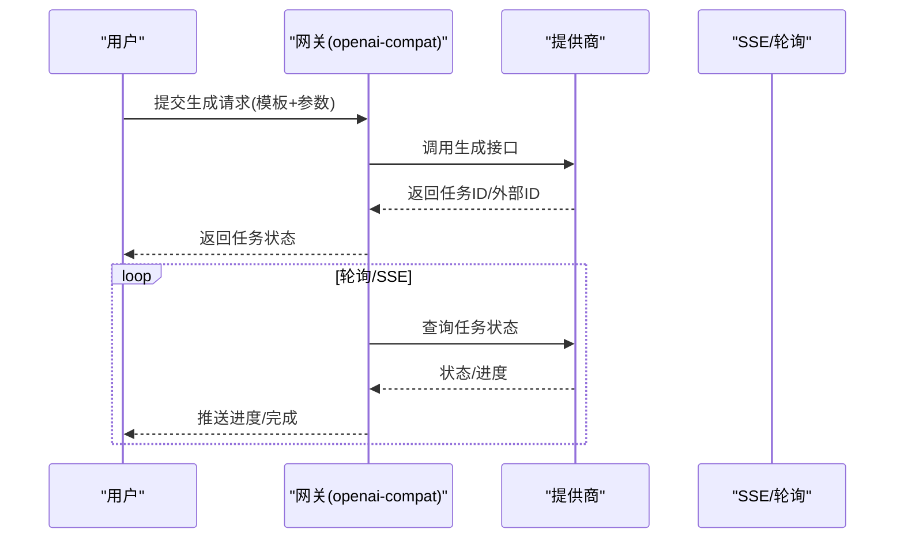

**图表来源**
- [src/lib/model-gateway/openai-compat.ts](file://src/lib/model-gateway/openai-compat.ts)
- [src/lib/sse/index.ts](file://src/lib/sse/index.ts)
- [src/lib/async-poll.ts](file://src/lib/async-poll.ts)

**章节来源**
- [src/lib/model-gateway/openai-compat.ts](file://src/lib/model-gateway/openai-compat.ts)
- [src/lib/sse/index.ts](file://src/lib/sse/index.ts)
- [src/lib/async-poll.ts](file://src/lib/async-poll.ts)

### 模型能力检测与动态路由策略
- 能力目录：按模型维度声明支持能力（文本/图像/视频/音频/口型同步）
- 动态路由：根据提供商主键与媒体类型自动选择官方或兼容路径
- 协议探测：对OpenAI兼容LLM自动探测responses/chat-completions

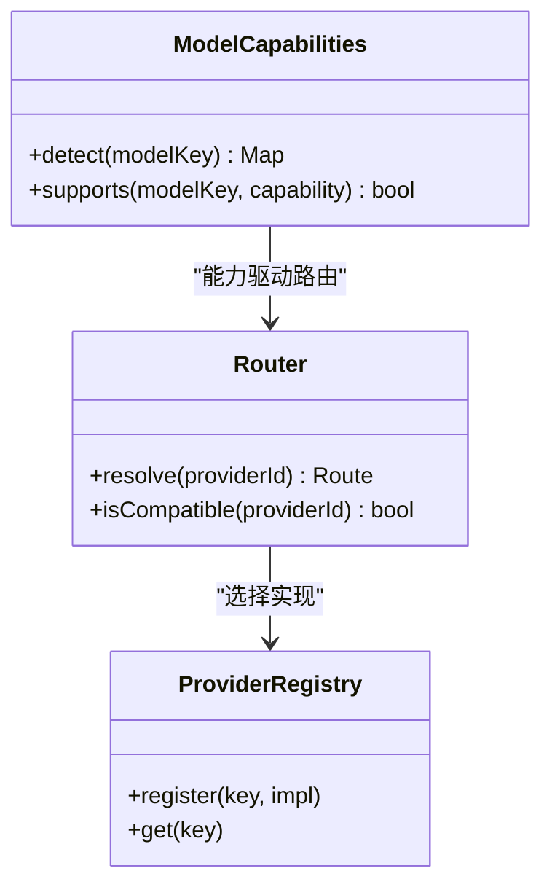

**图表来源**
- [src/lib/model-capabilities/index.ts](file://src/lib/model-capabilities/index.ts)
- [src/lib/model-gateway/router.ts:1-22](file://src/lib/model-gateway/router.ts#L1-L22)
- [src/lib/providers/registry.ts](file://src/lib/providers/registry.ts)

**章节来源**
- [src/lib/model-capabilities/index.ts](file://src/lib/model-capabilities/index.ts)
- [src/lib/model-gateway/router.ts:1-22](file://src/lib/model-gateway/router.ts#L1-L22)
- [src/lib/providers/registry.ts](file://src/lib/providers/registry.ts)

### 性能监控、成本控制与使用量统计
- 观测指标：记录请求耗时、Token用量、错误率与成功率
- 成本控制：基于定价目录与用量统计进行预算与告警
- 使用量统计：按模型/提供商/任务维度聚合用量

**图表来源**
- [src/lib/llm-observe/index.ts](file://src/lib/llm-observe/index.ts)
- [src/lib/billing/index.ts](file://src/lib/billing/index.ts)
- [src/lib/model-pricing/index.ts](file://src/lib/model-pricing/index.ts)

**章节来源**
- [src/lib/llm-observe/index.ts](file://src/lib/llm-observe/index.ts)
- [src/lib/billing/index.ts](file://src/lib/billing/index.ts)
- [src/lib/model-pricing/index.ts](file://src/lib/model-pricing/index.ts)

### 安全考虑、速率限制与配额管理
- 速率限制：基于Redis滑动窗口实现IP级别限流，支持登录/注册等敏感操作
- 配额管理：结合用户偏好与提供商限额策略，避免超额调用
- 安全传输：HTTPS、密钥解密与最小权限原则

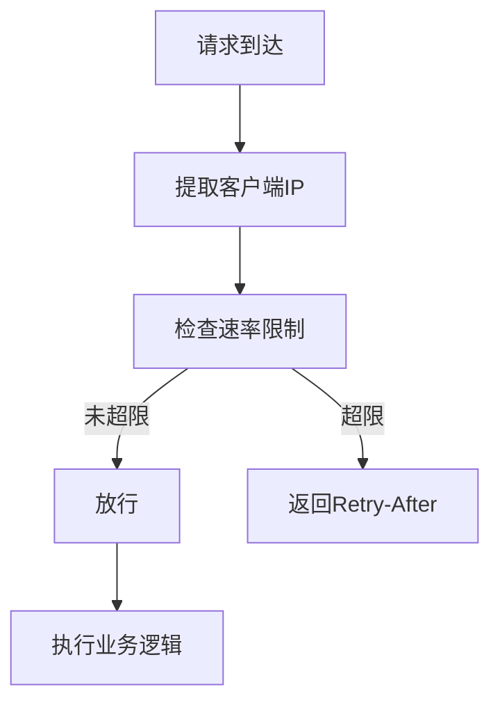

**图表来源**
- [src/lib/rate-limit.ts:58-118](file://src/lib/rate-limit.ts#L58-L118)
- [src/lib/rate-limit.ts:128-145](file://src/lib/rate-limit.ts#L128-L145)

**章节来源**
- [src/lib/rate-limit.ts:1-146](file://src/lib/rate-limit.ts#L1-L146)

### 新增AI服务提供商接入指南
- 步骤
  1) 在提供商注册表中注册新提供商键与实现
  2) 实现OpenAI兼容或官方SDK适配
  3) 在路由中声明是否兼容或官方专用
  4) 在能力目录中登记模型能力
  5) 在定价目录中配置价格
  6) 在配置中心支持用户启用该提供商
- 最佳实践
  - 保持接口一致性，遵循统一错误码
  - 支持流式输出与异步任务
  - 提供协议探测与模板验证
  - 加入测试契约与回归测试

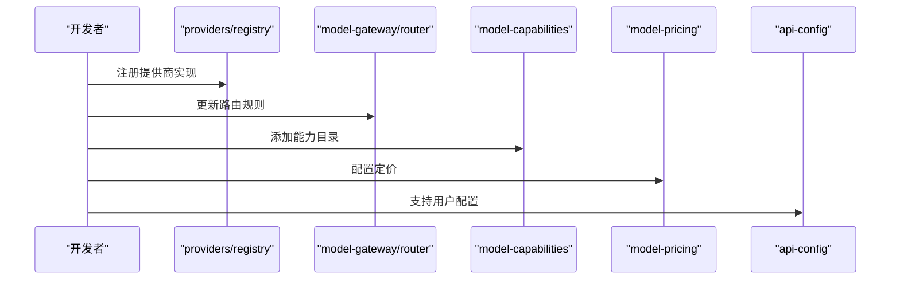

**图表来源**
- [src/lib/providers/registry.ts](file://src/lib/providers/registry.ts)
- [src/lib/model-gateway/router.ts:4-21](file://src/lib/model-gateway/router.ts#L4-L21)
- [src/lib/model-capabilities/index.ts](file://src/lib/model-capabilities/index.ts)
- [src/lib/model-pricing/index.ts](file://src/lib/model-pricing/index.ts)
- [src/lib/api-config.ts:418-434](file://src/lib/api-config.ts#L418-L434)

**章节来源**
- [src/lib/providers/registry.ts](file://src/lib/providers/registry.ts)
- [src/lib/model-gateway/router.ts:1-22](file://src/lib/model-gateway/router.ts#L1-L22)
- [src/lib/model-capabilities/index.ts](file://src/lib/model-capabilities/index.ts)
- [src/lib/model-pricing/index.ts](file://src/lib/model-pricing/index.ts)
- [src/lib/api-config.ts:409-434](file://src/lib/api-config.ts#L409-L434)

## 依赖关系分析
- 配置中心依赖Prisma与加密工具，保证数据与密钥安全
- 路由依赖提供商主键解析，决定SDK路径
- 网关依赖OpenAI兼容模板与运行时，负责协议适配
- 运行时依赖提供商SDK与观察模块，负责执行与监控
- 计费与监控依赖能力与定价目录，形成闭环

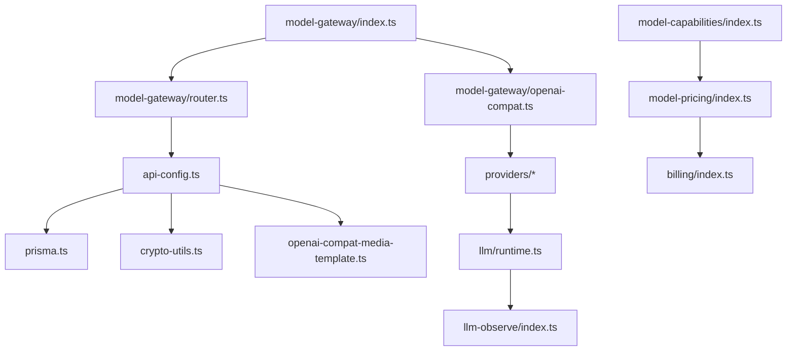

**图表来源**
- [src/lib/api-config.ts:10-21](file://src/lib/api-config.ts#L10-L21)
- [src/lib/model-gateway/router.ts:1-2](file://src/lib/model-gateway/router.ts#L1-L2)
- [src/lib/model-gateway/index.ts:1-11](file://src/lib/model-gateway/index.ts#L1-L11)
- [src/lib/model-gateway/openai-compat.ts](file://src/lib/model-gateway/openai-compat.ts)
- [src/lib/providers/index.ts](file://src/lib/providers/index.ts)
- [src/lib/llm/runtime.ts](file://src/lib/llm/runtime.ts)
- [src/lib/llm-observe/index.ts](file://src/lib/llm-observe/index.ts)
- [src/lib/model-capabilities/index.ts](file://src/lib/model-capabilities/index.ts)
- [src/lib/model-pricing/index.ts](file://src/lib/model-pricing/index.ts)
- [src/lib/billing/index.ts](file://src/lib/billing/index.ts)

**章节来源**
- [src/lib/api-config.ts:1-509](file://src/lib/api-config.ts#L1-L509)
- [src/lib/model-gateway/index.ts:1-21](file://src/lib/model-gateway/index.ts#L1-L21)
- [src/lib/llm/runtime.ts](file://src/lib/llm/runtime.ts)
- [src/lib/llm-observe/index.ts](file://src/lib/llm-observe/index.ts)
- [src/lib/model-capabilities/index.ts](file://src/lib/model-capabilities/index.ts)
- [src/lib/model-pricing/index.ts](file://src/lib/model-pricing/index.ts)
- [src/lib/billing/index.ts](file://src/lib/billing/index.ts)

## 性能考量
- 路由优化：优先官方SDK以减少协议转换开销
- 流式输出：降低首字节延迟，提升用户体验
- 缓存与重试：对失败请求进行指数退避与幂等重试
- 并发控制：结合用户并发门控与任务队列，避免拥塞
- 观测与采样：对关键路径进行采样观测，定位瓶颈

## 故障排查指南
- 常见错误
  - 模型键无效：检查provider::modelId格式
  - 提供商未配置：确认用户偏好中的customProviders
  - API密钥缺失：检查加密存储与解密流程
  - 路由冲突：核对提供商主键与路由规则
- 排查步骤
  - 查看统一错误码与消息
  - 检查运行时日志与观测指标
  - 验证媒体模板与协议探测
  - 核对速率限制与配额状态

**章节来源**
- [src/lib/ai-runtime/errors.ts](file://src/lib/ai-runtime/errors.ts)
- [src/lib/llm-observe/index.ts](file://src/lib/llm-observe/index.ts)
- [src/lib/rate-limit.ts:1-146](file://src/lib/rate-limit.ts#L1-L146)

## 结论
Waoowaoo通过统一的模型抽象、严格的配置中心、智能的路由与兼容适配、完善的运行时与监控体系，实现了对OpenAI、Gemini、Fal AI、百炼AI等多源AI服务的高效集成。该架构在保证一致性与安全性的同时，提供了灵活的扩展能力与稳健的运维保障，适合在复杂多变的AI生态中长期演进。

## 附录
- 快速参考
  - 模型键格式：provider::modelId
  - 提供商主键：支持多实例形式，如gemini-compatible:uuid
  - 路由策略：兼容集走openai-compat，专用集走official
  - 媒体模板：图像/视频生成参数渲染与外部ID处理
  - 速率限制：基于Redis滑动窗口的IP级限流
- 最佳实践
  - 优先使用官方SDK，必要时启用OpenAI兼容
  - 对所有第三方异常进行统一归一化
  - 为每个提供商实现协议探测与能力检测
  - 将密钥加密存储并在需要时解密
  - 建立完善的观测与告警体系