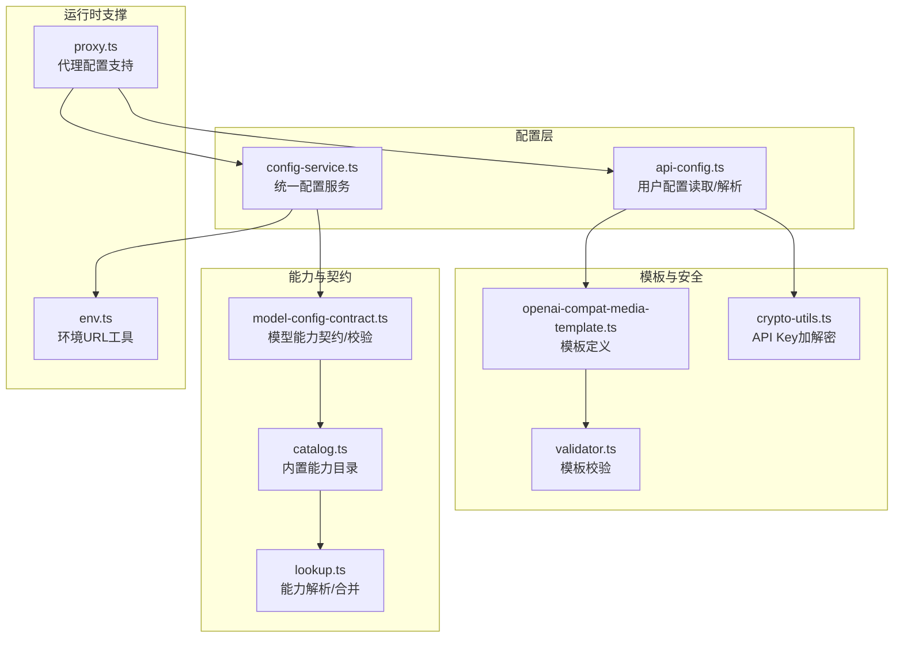
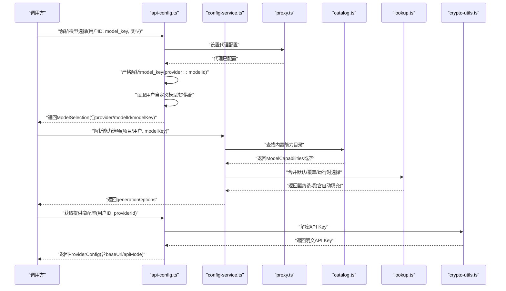
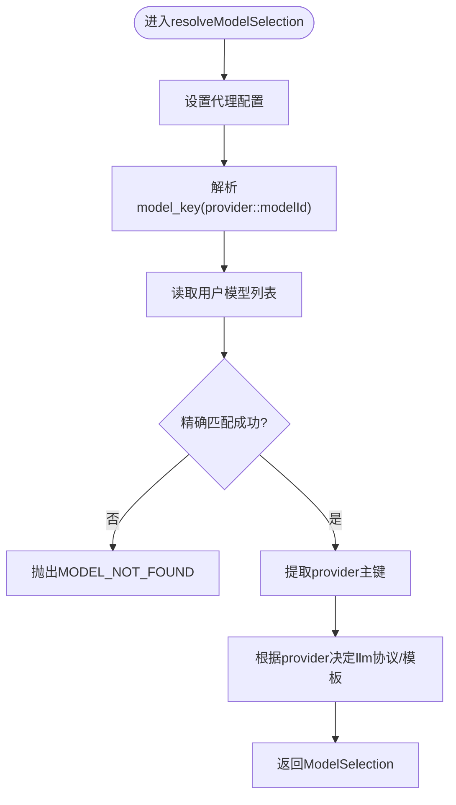
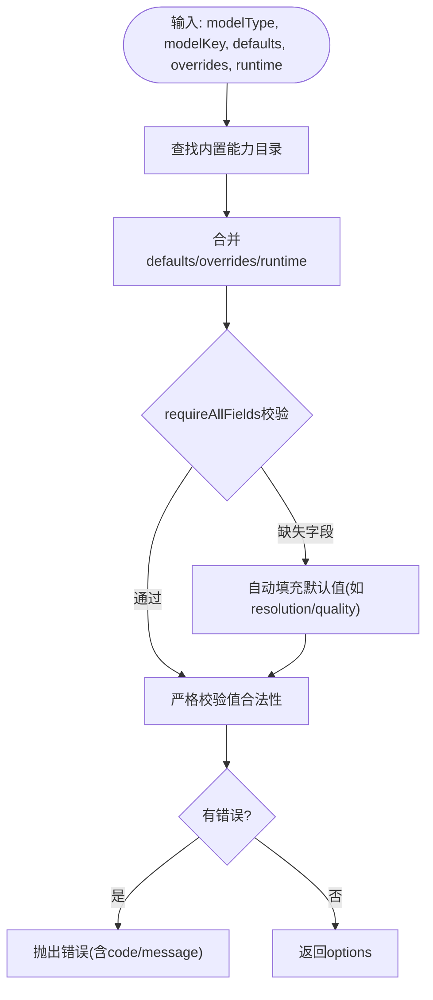
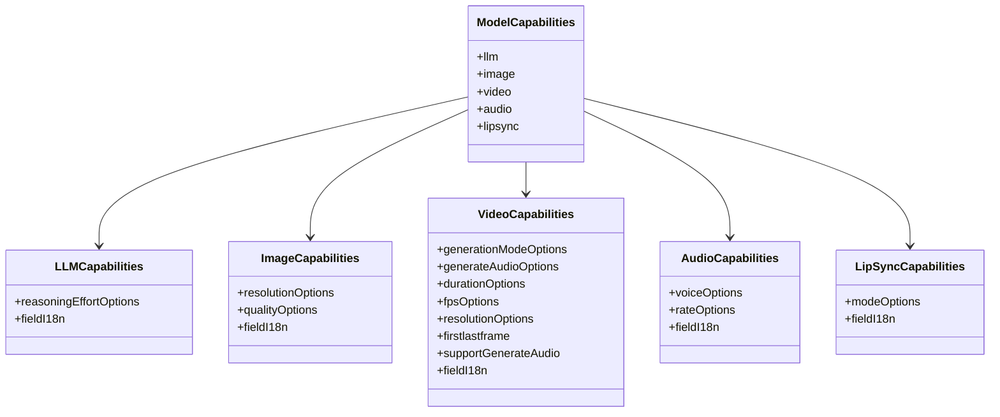
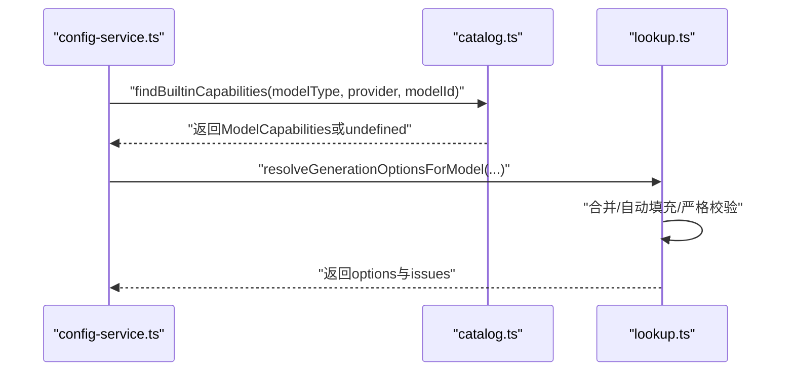
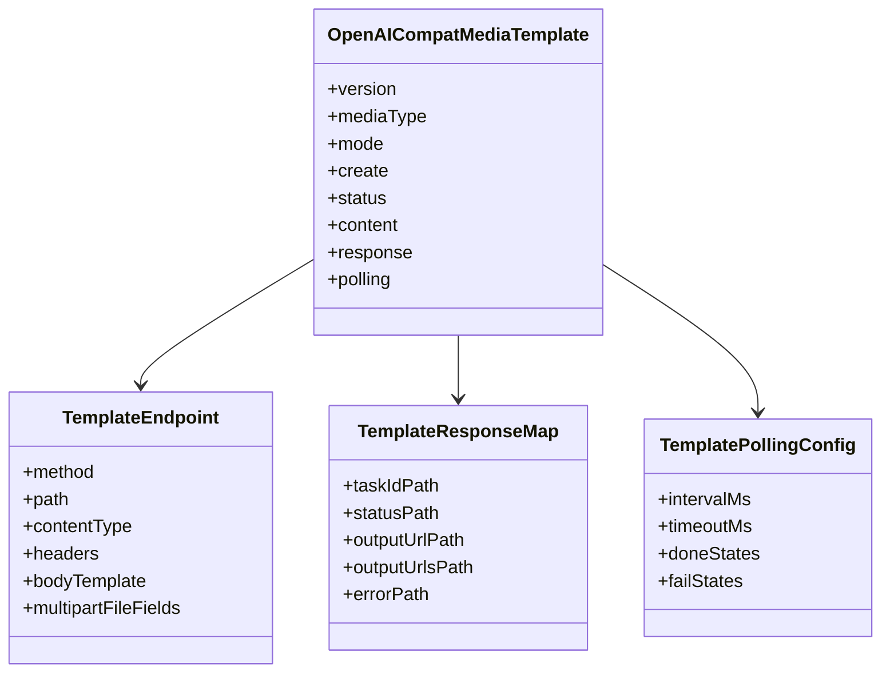
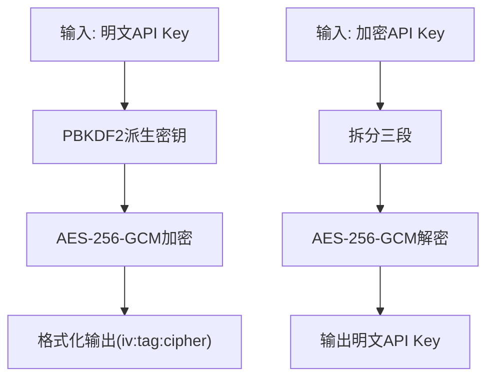
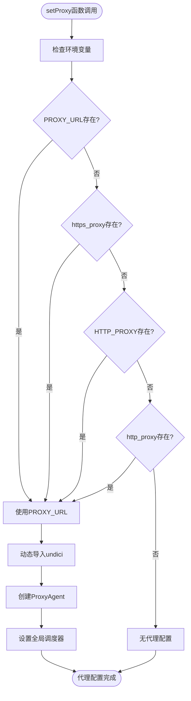
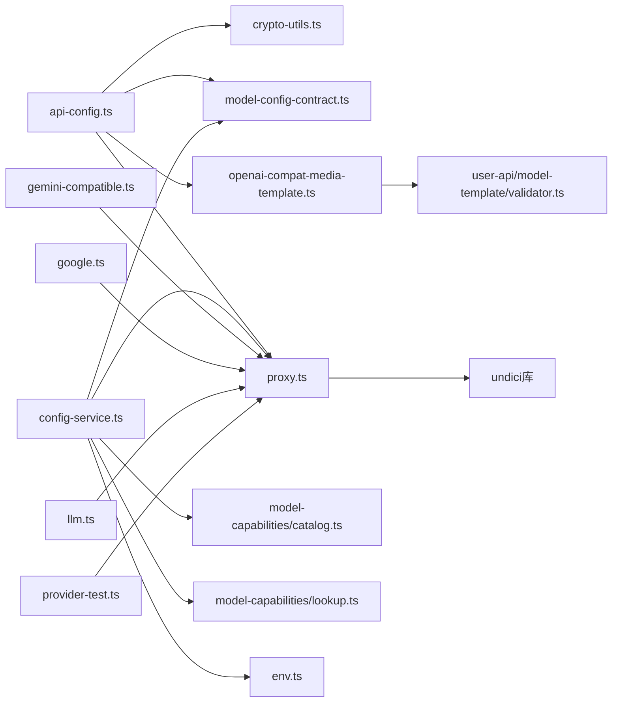

# API配置管理

<cite>
**本文引用的文件**
- [src/lib/api-config.ts](file://src/lib/api-config.ts)
- [src/lib/config-service.ts](file://src/lib/config-service.ts)
- [src/lib/model-config-contract.ts](file://src/lib/model-config-contract.ts)
- [src/lib/crypto-utils.ts](file://src/lib/crypto-utils.ts)
- [src/lib/model-capabilities/catalog.ts](file://src/lib/model-capabilities/catalog.ts)
- [src/lib/model-capabilities/lookup.ts](file://src/lib/model-capabilities/lookup.ts)
- [src/lib/openai-compat-media-template.ts](file://src/lib/openai-compat-media-template.ts)
- [src/lib/user-api/model-template/validator.ts](file://src/lib/user-api/model-template/validator.ts)
- [src/lib/env.ts](file://src/lib/env.ts)
- [lib/prompts/proxy.ts](file://lib/prompts/proxy.ts)
- [src/lib/generators/image/gemini-compatible.ts](file://src/lib/generators/image/gemini-compatible.ts)
- [src/lib/generators/image/google.ts](file://src/lib/generators/image/google.ts)
- [src/lib/model-gateway/llm.ts](file://src/lib/model-gateway/llm.ts)
- [src/lib/user-api/provider-test.ts](file://src/lib/user-api/provider-test.ts)
</cite>

## 更新摘要
**所做更改**
- 新增代理配置支持多种环境变量格式的章节
- 更新网络兼容性相关的内容
- 增强代理配置在不同组件中的应用说明
- 补充环境变量兼容性的最佳实践

## 目录
1. [简介](#简介)
2. [项目结构](#项目结构)
3. [核心组件](#核心组件)
4. [架构总览](#架构总览)
5. [详细组件分析](#详细组件分析)
6. [依赖关系分析](#依赖关系分析)
7. [性能考量](#性能考量)
8. [故障排查指南](#故障排查指南)
9. [结论](#结论)
10. [附录](#附录)

## 简介
本技术文档面向Waoowaoo的API配置管理系统，系统性阐述API密钥管理、模型配置与提供商设置的实现机制，覆盖配置验证、合同检查、动态加载、模板系统、默认值管理与继承、配置更新与热重载、版本控制、安全与权限控制、审计日志、多租户与环境隔离、A/B测试支持，以及最佳实践、故障排查与性能优化建议。

**更新** 新增代理配置支持多种环境变量格式的功能，显著提升网络兼容性和部署灵活性。

## 项目结构
围绕配置管理的关键模块分布如下：
- 配置读取与解析：api-config.ts
- 统一配置服务：config-service.ts
- 模型能力契约与校验：model-config-contract.ts
- 能力目录与查找：model-capabilities/catalog.ts、model-capabilities/lookup.ts
- 开放接口兼容媒体模板：openai-compat-media-template.ts、user-api/model-template/validator.ts
- 安全与加密：crypto-utils.ts
- 环境配置工具：env.ts
- **新增** 代理配置支持：lib/prompts/proxy.ts

**图表来源**
- [src/lib/api-config.ts:1-509](file://src/lib/api-config.ts#L1-L509)
- [src/lib/config-service.ts:1-346](file://src/lib/config-service.ts#L1-L346)
- [src/lib/model-config-contract.ts:1-528](file://src/lib/model-config-contract.ts#L1-L528)
- [src/lib/model-capabilities/catalog.ts:1-224](file://src/lib/model-capabilities/catalog.ts#L1-L224)
- [src/lib/model-capabilities/lookup.ts:1-374](file://src/lib/model-capabilities/lookup.ts#L1-L374)
- [src/lib/openai-compat-media-template.ts:1-66](file://src/lib/openai-compat-media-template.ts#L1-L66)
- [src/lib/user-api/model-template/validator.ts:1-70](file://src/lib/user-api/model-template/validator.ts#L1-L70)
- [src/lib/crypto-utils.ts:1-195](file://src/lib/crypto-utils.ts#L1-L195)
- [src/lib/env.ts:1-38](file://src/lib/env.ts#L1-L38)
- [lib/prompts/proxy.ts:1-12](file://lib/prompts/proxy.ts#L1-L12)

**章节来源**
- [src/lib/api-config.ts:1-509](file://src/lib/api-config.ts#L1-L509)
- [src/lib/config-service.ts:1-346](file://src/lib/config-service.ts#L1-L346)
- [src/lib/model-config-contract.ts:1-528](file://src/lib/model-config-contract.ts#L1-L528)
- [src/lib/model-capabilities/catalog.ts:1-224](file://src/lib/model-capabilities/catalog.ts#L1-L224)
- [src/lib/model-capabilities/lookup.ts:1-374](file://src/lib/model-capabilities/lookup.ts#L1-L374)
- [src/lib/openai-compat-media-template.ts:1-66](file://src/lib/openai-compat-media-template.ts#L1-L66)
- [src/lib/user-api/model-template/validator.ts:1-70](file://src/lib/user-api/model-template/validator.ts#L1-L70)
- [src/lib/crypto-utils.ts:1-195](file://src/lib/crypto-utils.ts#L1-L195)
- [src/lib/env.ts:1-38](file://src/lib/env.ts#L1-L38)
- [lib/prompts/proxy.ts:1-12](file://lib/prompts/proxy.ts#L1-L12)

## 核心组件
- API配置读取器（严格模式）：负责从用户偏好中读取自定义模型与提供商配置，执行严格解析与校验，保证provider::modelId复合键规范，禁止猜测与默认降级。
- 统一配置服务：提供项目级与用户级配置聚合，解析模型能力选项，构建计费与任务负载，支持能力默认值与覆盖项的合并策略。
- 模型能力契约与校验：定义统一模型类型、能力命名空间、字段与值的合法性约束，提供严格的校验与错误码。
- 能力目录与解析：内置能力目录按文件加载，支持别名映射与缓存签名，查找模型能力并进行默认值自动填充。
- 开放接口兼容媒体模板：定义图像/视频生成的请求/响应模板，配合校验器保障路径与内容合法。
- 安全与加密：基于PBKDF2派生密钥，AES-256-GCM加密存储API Key，支持批量加解密与容错处理。
- 环境配置工具：集中管理应用内外部访问基础URL，便于内部服务间调用与API拼接。
- **新增** 代理配置支持：统一管理HTTP/HTTPS代理配置，支持多种环境变量格式，提升网络兼容性。

**章节来源**
- [src/lib/api-config.ts:1-509](file://src/lib/api-config.ts#L1-L509)
- [src/lib/config-service.ts:1-346](file://src/lib/config-service.ts#L1-L346)
- [src/lib/model-config-contract.ts:1-528](file://src/lib/model-config-contract.ts#L1-L528)
- [src/lib/model-capabilities/catalog.ts:1-224](file://src/lib/model-capabilities/catalog.ts#L1-L224)
- [src/lib/model-capabilities/lookup.ts:1-374](file://src/lib/model-capabilities/lookup.ts#L1-L374)
- [src/lib/openai-compat-media-template.ts:1-66](file://src/lib/openai-compat-media-template.ts#L1-L66)
- [src/lib/user-api/model-template/validator.ts:1-70](file://src/lib/user-api/model-template/validator.ts#L1-L70)
- [src/lib/crypto-utils.ts:1-195](file://src/lib/crypto-utils.ts#L1-L195)
- [src/lib/env.ts:1-38](file://src/lib/env.ts#L1-L38)
- [lib/prompts/proxy.ts:1-12](file://lib/prompts/proxy.ts#L1-L12)

## 架构总览
系统采用"严格配置读取 + 统一服务聚合 + 契约驱动能力 + 模板化媒体接口 + 加密存储 + 代理配置"的架构，确保：
- 数据来源一致、配置不可猜测、默认降级被禁用；
- 能力选项可验证、可继承、可覆盖；
- 模板路径与响应映射可校验、可扩展；
- 密钥安全存储与解密，支持批量处理；
- 项目级与用户级配置优先级明确，便于多租户与环境隔离；
- **新增** 代理配置支持多种环境变量格式，提升网络兼容性。

**图表来源**
- [src/lib/api-config.ts:281-434](file://src/lib/api-config.ts#L281-L434)
- [src/lib/config-service.ts:147-189](file://src/lib/config-service.ts#L147-L189)
- [src/lib/model-capabilities/catalog.ts:169-219](file://src/lib/model-capabilities/catalog.ts#L169-L219)
- [src/lib/model-capabilities/lookup.ts:249-353](file://src/lib/model-capabilities/lookup.ts#L249-L353)
- [src/lib/crypto-utils.ts:85-111](file://src/lib/crypto-utils.ts#L85-L111)
- [lib/prompts/proxy.ts:2-12](file://lib/prompts/proxy.ts#L2-L12)

## 详细组件分析

### API配置读取器（严格模式）
职责与特性：
- 严格解析model_key为provider::modelId，禁止猜测与默认降级；
- 从用户偏好读取customModels/customProviders，执行结构与字段校验；
- 提供模型选择解析（精确匹配与单模型回退）、提供商配置读取（含baseUrl归一化与API Key解密）；
- 支持按媒体类型过滤模型、提取模型ID、查询价格、按音频/口型同步模型键获取API Key；
- 提供hasApiConfig判断用户是否配置过密钥。

**图表来源**
- [src/lib/api-config.ts:323-352](file://src/lib/api-config.ts#L323-L352)
- [lib/prompts/proxy.ts:2-12](file://lib/prompts/proxy.ts#L2-L12)

**章节来源**
- [src/lib/api-config.ts:113-191](file://src/lib/api-config.ts#L113-L191)
- [src/lib/api-config.ts:281-352](file://src/lib/api-config.ts#L281-L352)
- [src/lib/api-config.ts:418-434](file://src/lib/api-config.ts#L418-L434)
- [src/lib/api-config.ts:497-509](file://src/lib/api-config.ts#L497-L509)

### 统一配置服务
职责与特性：
- 项目级与用户级配置聚合：analysisModel/characterModel/locationModel/storyboardModel/editModel/videoModel/audioModel、videoRatio、artStyle、能力默认与覆盖；
- 能力选项解析：合并默认值、覆盖项与运行时选择，支持自动填充（如image/video的resolution/quality），严格校验不允许非法值；
- 计费负载构建：为图片类任务统一注入generationOptions与imageModel，便于计费与Worker参数传递；
- 必需模型检查与错误消息生成，便于前端提示。

**图表来源**
- [src/lib/config-service.ts:191-220](file://src/lib/config-service.ts#L191-L220)
- [src/lib/model-capabilities/lookup.ts:249-353](file://src/lib/model-capabilities/lookup.ts#L249-L353)

**章节来源**
- [src/lib/config-service.ts:147-189](file://src/lib/config-service.ts#L147-L189)
- [src/lib/config-service.ts:222-237](file://src/lib/config-service.ts#L222-L237)
- [src/lib/config-service.ts:286-345](file://src/lib/config-service.ts#L286-L345)

### 模型能力契约与校验
职责与特性：
- 统一模型类型与能力命名空间（llm/image/video/audio/lipsync）；
- 能力字段白名单与类型约束（数组/布尔/数值/字符串），i18n字段校验；
- 能力值合法性校验（不允许的值返回错误码与允许值列表）；
- 提供composeModelKey/parseModelKeyStrict等工具方法，保证model_key格式统一。

**图表来源**
- [src/lib/model-config-contract.ts:60-66](file://src/lib/model-config-contract.ts#L60-L66)

**章节来源**
- [src/lib/model-config-contract.ts:471-527](file://src/lib/model-config-contract.ts#L471-L527)

### 能力目录与解析
职责与特性：
- 内置能力目录按文件加载，构建精确匹配与按provider主键的回退索引，支持别名映射（如gemini-compatible→google）；
- 缓存签名机制避免重复加载，提供clone避免外部修改；
- 解析阶段支持自动填充默认值（如最高分辨率/质量），并在二次严格校验后输出最终选项。

**图表来源**
- [src/lib/model-capabilities/catalog.ts:169-219](file://src/lib/model-capabilities/catalog.ts#L169-L219)
- [src/lib/model-capabilities/lookup.ts:249-353](file://src/lib/model-capabilities/lookup.ts#L249-L353)

**章节来源**
- [src/lib/model-capabilities/catalog.ts:129-152](file://src/lib/model-capabilities/catalog.ts#L129-L152)
- [src/lib/model-capabilities/catalog.ts:165-219](file://src/lib/model-capabilities/catalog.ts#L165-L219)
- [src/lib/model-capabilities/lookup.ts:249-353](file://src/lib/model-capabilities/lookup.ts#L249-L353)

### 开放接口兼容媒体模板
职责与特性：
- 定义媒体模板结构（版本、媒体类型、同步/异步、创建/状态/内容端点、响应映射、轮询配置）；
- 模板路径校验（绝对URL或相对路径），防止危险路径；
- 占位符白名单限制，避免任意字段注入。

**图表来源**
- [src/lib/openai-compat-media-template.ts:42-51](file://src/lib/openai-compat-media-template.ts#L42-L51)

**章节来源**
- [src/lib/openai-compat-media-template.ts:1-66](file://src/lib/openai-compat-media-template.ts#L1-L66)
- [src/lib/user-api/model-template/validator.ts:15-48](file://src/lib/user-api/model-template/validator.ts#L15-L48)

### 安全与加密
职责与特性：
- API Key加密：PBKDF2派生32字节密钥（迭代10万次），AES-256-GCM加密，格式iv:authTag:encrypted；
- 批量加解密：遍历对象中包含key/secret的字段进行加解密；
- 容错解密：解密失败时保留原文并记录错误，避免中断流程；
- 密钥来源：优先API_ENCRYPTION_KEY，后备NEXTAUTH_SECRET。

**图表来源**
- [src/lib/crypto-utils.ts:27-111](file://src/lib/crypto-utils.ts#L27-L111)

**章节来源**
- [src/lib/crypto-utils.ts:1-195](file://src/lib/crypto-utils.ts#L1-L195)

### 环境配置工具
职责与特性：
- 统一获取公共/内部基础URL，支持容器内自调用与API拼接；
- 默认回退策略，避免未配置导致的异常。

**章节来源**
- [src/lib/env.ts:1-38](file://src/lib/env.ts#L1-L38)

### **新增** 代理配置支持
职责与特性：
- **多环境变量格式支持**：支持PROXY_URL、https_proxy、HTTP_PROXY、http_proxy等多种环境变量格式，提升部署兼容性；
- **动态代理配置**：在运行时根据环境变量动态设置全局代理，适用于企业网络环境；
- **统一代理入口**：通过setProxy函数集中管理代理配置，所有网络请求前调用；
- **条件性代理设置**：仅当检测到代理配置时才启用代理，避免不必要的性能开销；
- **广泛适用性**：在LLM网关、图像生成器、提供商测试等多个组件中统一使用。

**图表来源**
- [lib/prompts/proxy.ts:2-12](file://lib/prompts/proxy.ts#L2-L12)

**章节来源**
- [lib/prompts/proxy.ts:1-12](file://lib/prompts/proxy.ts#L1-L12)
- [src/lib/generators/image/gemini-compatible.ts:80-90](file://src/lib/generators/image/gemini-compatible.ts#L80-L90)
- [src/lib/generators/image/google.ts:190-200](file://src/lib/generators/image/google.ts#L190-L200)
- [src/lib/model-gateway/llm.ts:1-40](file://src/lib/model-gateway/llm.ts#L1-L40)
- [src/lib/user-api/provider-test.ts:425-435](file://src/lib/user-api/provider-test.ts#L425-L435)

## 依赖关系分析
- api-config.ts依赖crypto-utils进行API Key解密，并依赖model-config-contract进行model_key解析与模板校验；
- config-service.ts依赖model-config-contract进行model_key解析，依赖catalog与lookup进行能力解析与合并；
- openai-compat-media-template与validator共同保障模板合法性；
- env.ts为统一URL工具，服务于内部服务调用；
- **新增** proxy.ts为代理配置中心，被多个网络组件依赖。

**图表来源**
- [src/lib/api-config.ts:10-21](file://src/lib/api-config.ts#L10-L21)
- [src/lib/config-service.ts:9-21](file://src/lib/config-service.ts#L9-L21)
- [src/lib/model-capabilities/catalog.ts:1-8](file://src/lib/model-capabilities/catalog.ts#L1-L8)
- [src/lib/model-capabilities/lookup.ts:1-8](file://src/lib/model-capabilities/lookup.ts#L1-L8)
- [src/lib/openai-compat-media-template.ts:1-6](file://src/lib/openai-compat-media-template.ts#L1-L6)
- [src/lib/user-api/model-template/validator.ts:1-5](file://src/lib/user-api/model-template/validator.ts#L1-L5)
- [src/lib/env.ts:1-38](file://src/lib/env.ts#L1-L38)
- [lib/prompts/proxy.ts:1-12](file://lib/prompts/proxy.ts#L1-L12)

**章节来源**
- [src/lib/api-config.ts:10-21](file://src/lib/api-config.ts#L10-L21)
- [src/lib/config-service.ts:9-21](file://src/lib/config-service.ts#L9-L21)
- [src/lib/model-capabilities/catalog.ts:1-8](file://src/lib/model-capabilities/catalog.ts#L1-L8)
- [src/lib/model-capabilities/lookup.ts:1-8](file://src/lib/model-capabilities/lookup.ts#L1-L8)
- [src/lib/openai-compat-media-template.ts:1-6](file://src/lib/openai-compat-media-template.ts#L1-L6)
- [src/lib/user-api/model-template/validator.ts:1-5](file://src/lib/user-api/model-template/validator.ts#L1-L5)
- [src/lib/env.ts:1-38](file://src/lib/env.ts#L1-L38)
- [lib/prompts/proxy.ts:1-12](file://lib/prompts/proxy.ts#L1-L12)

## 性能考量
- 能力目录缓存：catalog使用签名与内存缓存避免重复解析，建议在变更目录文件时触发缓存失效；
- 解析链路短路：api-config的严格解析与快速失败减少无效调用；
- 自动填充策略：仅在必要字段缺失且catalog声明存在时自动填充，降低运行时开销；
- 批量加解密：对包含敏感字段的对象进行批量处理，避免逐字段操作带来的重复成本；
- **新增** 代理配置优化：setProxy函数采用条件性代理设置，仅在检测到代理配置时才创建代理Agent，避免不必要的性能开销。

[本节为通用指导，无需特定文件来源]

## 故障排查指南
常见问题与定位思路：
- MODEL_KEY_INVALID/MODEL_KEY_MISMATCH：检查model_key格式与provider/modelId一致性；
- MODEL_NOT_FOUND：确认用户启用的模型列表中是否存在目标模型；
- PROVIDER_NOT_FOUND/PROVIDER_API_KEY_MISSING：确认提供商ID正确且已配置API Key；
- MODEL_LLM_PROTOCOL_INVALID/MODEL_COMPAT_MEDIA_TEMPLATE_INVALID：检查llm协议与模板字段合法性；
- CAPABILITY_*系列错误：核对能力字段与值是否在catalog允许范围内；
- IMAGE_MODEL_CAPABILITY_NOT_CONFIGURED：检查项目/用户能力默认与覆盖配置；
- 解密失败：检查API_ENCRYPTION_KEY/NEXTAUTH_SECRET配置与格式；
- **新增** 代理连接失败：检查PROXY_URL环境变量格式是否正确，确认代理服务器可达性。

**章节来源**
- [src/lib/api-config.ts:113-191](file://src/lib/api-config.ts#L113-L191)
- [src/lib/api-config.ts:219-242](file://src/lib/api-config.ts#L219-L242)
- [src/lib/config-service.ts:222-237](file://src/lib/config-service.ts#L222-L237)
- [src/lib/user-api/model-template/validator.ts:50-68](file://src/lib/user-api/model-template/validator.ts#L50-L68)
- [lib/prompts/proxy.ts:2-12](file://lib/prompts/proxy.ts#L2-L12)

## 结论
Waoowaoo的API配置管理系统通过"严格配置读取 + 契约驱动能力 + 模板化接口 + 加密存储 + 代理配置"的设计，实现了高一致性、强校验与可扩展的配置管理。结合项目级与用户级配置聚合、能力默认/覆盖/运行时选择的合并策略，以及完善的错误码与自动填充机制，满足多租户、环境隔离与A/B测试等复杂场景需求。

**更新** 新增的代理配置支持显著提升了系统的网络兼容性，通过支持多种环境变量格式，使得系统能够在各种网络环境下稳定运行，包括企业防火墙、代理服务器等复杂网络环境。

[本节为总结，无需特定文件来源]

## 附录

### 配置模板系统与默认值管理
- 模板系统：通过openai-compat-media-template定义请求/响应模板，validator确保路径与内容合法；
- 默认值管理：lookup在image/video场景下自动填充resolution/quality，默认选择最高值；
- 继承机制：catalog支持精确匹配与provider主键回退，gemini-compatible别名映射至google。

**章节来源**
- [src/lib/openai-compat-media-template.ts:1-66](file://src/lib/openai-compat-media-template.ts#L1-L66)
- [src/lib/user-api/model-template/validator.ts:1-70](file://src/lib/user-api/model-template/validator.ts#L1-L70)
- [src/lib/model-capabilities/lookup.ts:284-328](file://src/lib/model-capabilities/lookup.ts#L284-L328)
- [src/lib/model-capabilities/catalog.ts:165-208](file://src/lib/model-capabilities/catalog.ts#L165-L208)

### 安全、权限与审计
- 密钥安全：API Key加密存储，解密失败容错处理，避免中断；
- 权限控制：严格禁止provider猜测与默认降级，调用方需先解析模型再获取提供商配置；
- 审计日志：解密失败与异常解析记录错误日志，便于审计与排障。

**章节来源**
- [src/lib/crypto-utils.ts:85-111](file://src/lib/crypto-utils.ts#L85-L111)
- [src/lib/crypto-utils.ts:175-181](file://src/lib/crypto-utils.ts#L175-L181)
- [src/lib/api-config.ts:406-408](file://src/lib/api-config.ts#L406-L408)

### 多租户、环境隔离与A/B测试
- 多租户：用户偏好独立存储，每个用户拥有独立的customModels/customProviders；
- 环境隔离：env工具提供内部/外部URL，便于容器内自调用与跨环境切换；
- A/B测试：通过项目级与用户级配置差异实现能力选项与模型选择的A/B分流。

**章节来源**
- [src/lib/env.ts:1-38](file://src/lib/env.ts#L1-L38)
- [src/lib/config-service.ts:147-189](file://src/lib/config-service.ts#L147-L189)

### 配置更新、热重载与版本控制
- 配置更新：用户偏好变更后，api-config与config-service即时生效；
- 热重载：catalog使用签名缓存，文件变更触发缓存重建；
- 版本控制：模板版本号与能力契约版本号明确，升级时需遵循兼容规则。

**章节来源**
- [src/lib/model-capabilities/catalog.ts:120-137](file://src/lib/model-capabilities/catalog.ts#L120-L137)
- [src/lib/openai-compat-media-template.ts:42-44](file://src/lib/openai-compat-media-template.ts#L42-L44)

### **新增** 代理配置最佳实践
- **环境变量设置**：优先使用PROXY_URL，其次尝试https_proxy、HTTP_PROXY、http_proxy，确保兼容不同系统；
- **代理格式要求**：支持http://、https://、socks://等协议格式，确保代理服务器地址正确；
- **性能优化**：代理配置仅在需要时启用，避免不必要的网络开销；
- **故障排查**：检查代理服务器连通性、认证信息、防火墙设置；
- **安全考虑**：确保代理服务器可信，避免敏感数据泄露。

**章节来源**
- [lib/prompts/proxy.ts:1-12](file://lib/prompts/proxy.ts#L1-L12)
- [src/lib/generators/image/gemini-compatible.ts:80-90](file://src/lib/generators/image/gemini-compatible.ts#L80-L90)
- [src/lib/generators/image/google.ts:190-200](file://src/lib/generators/image/google.ts#L190-L200)
- [src/lib/model-gateway/llm.ts:1-40](file://src/lib/model-gateway/llm.ts#L1-L40)
- [src/lib/user-api/provider-test.ts:425-435](file://src/lib/user-api/provider-test.ts#L425-L435)

### 最佳实践
- 始终使用provider::modelId复合键；
- 项目级配置优先于用户级配置；
- 能力选项尽量使用默认值与覆盖项，避免运行时频繁校验；
- 模板路径必须为绝对URL或相对路径，避免注入风险；
- API Key必须加密存储，定期轮换密钥并备份；
- **新增** 代理配置应根据部署环境合理设置，确保网络连接稳定性。

**章节来源**
- [src/lib/api-config.ts:4-8](file://src/lib/api-config.ts#L4-L8)
- [src/lib/config-service.ts:6-7](file://src/lib/config-service.ts#L6-L7)
- [src/lib/user-api/model-template/validator.ts:15-33](file://src/lib/user-api/model-template/validator.ts#L15-L33)
- [src/lib/crypto-utils.ts:27-38](file://src/lib/crypto-utils.ts#L27-L38)
- [lib/prompts/proxy.ts:1-12](file://lib/prompts/proxy.ts#L1-L12)