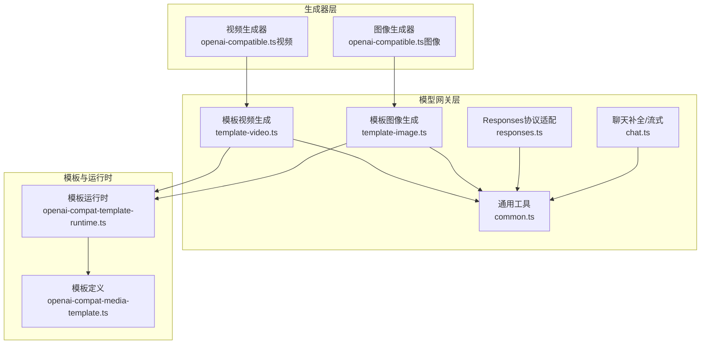
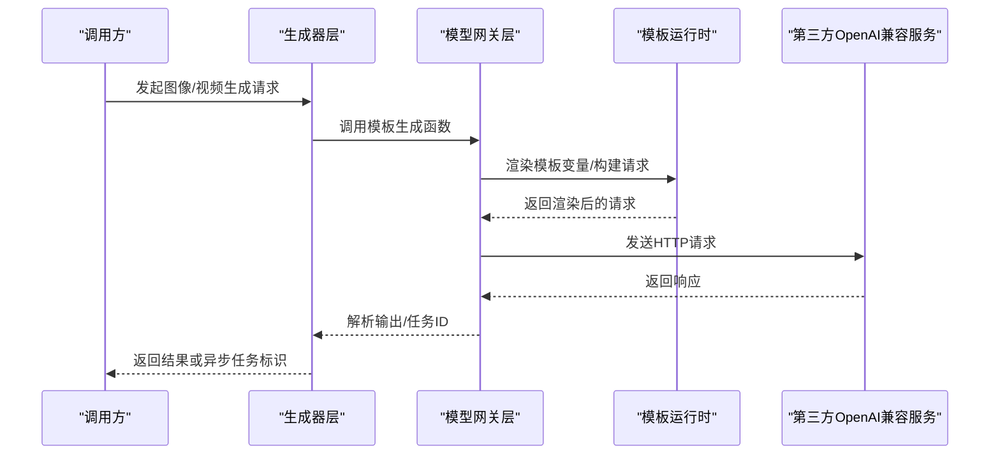
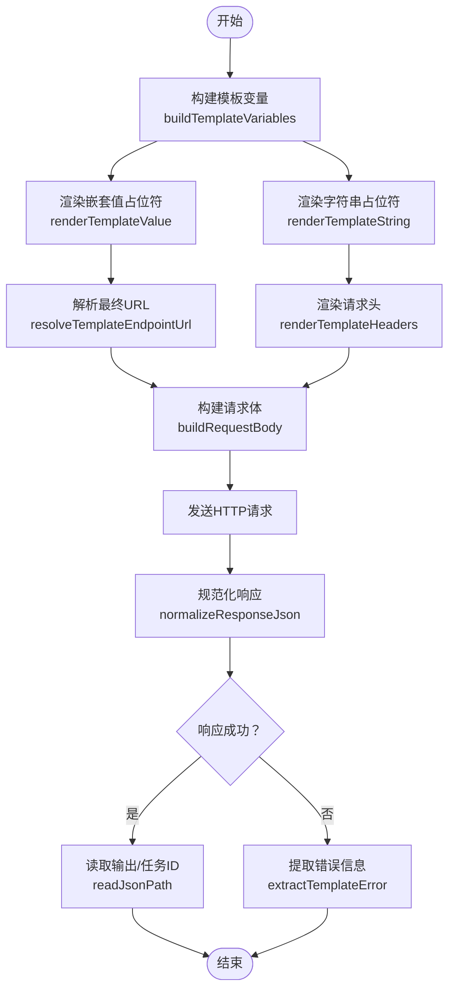
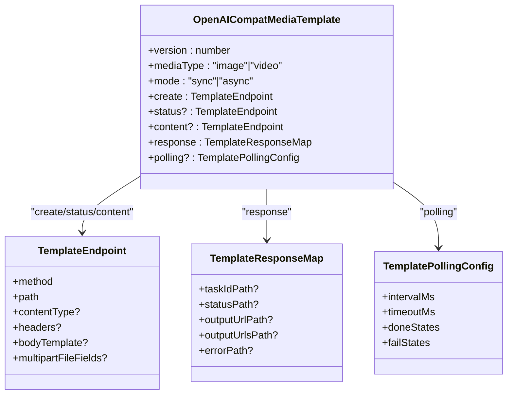
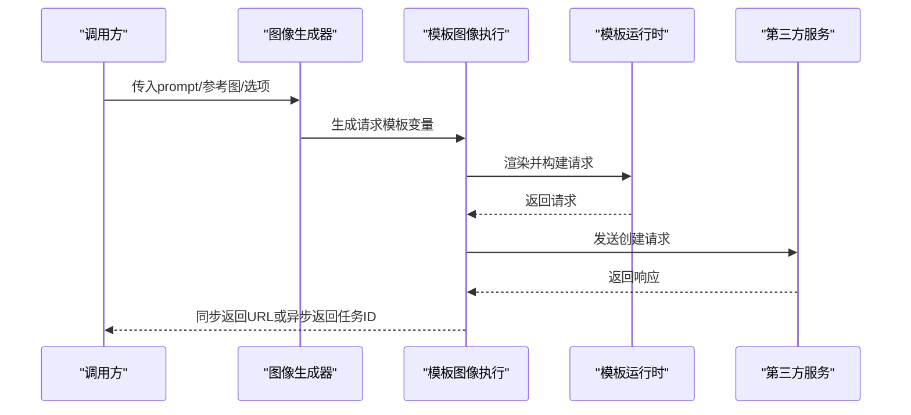
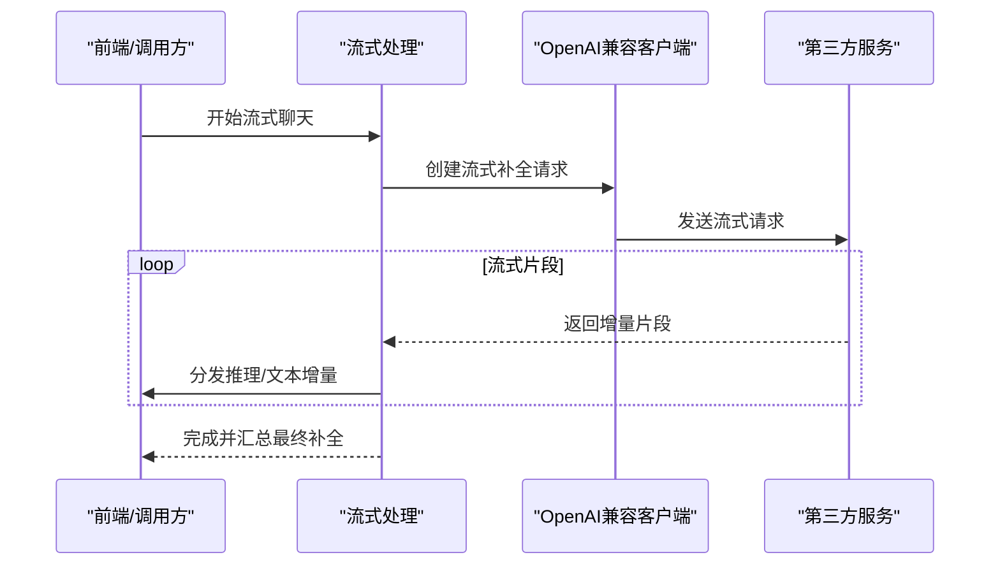
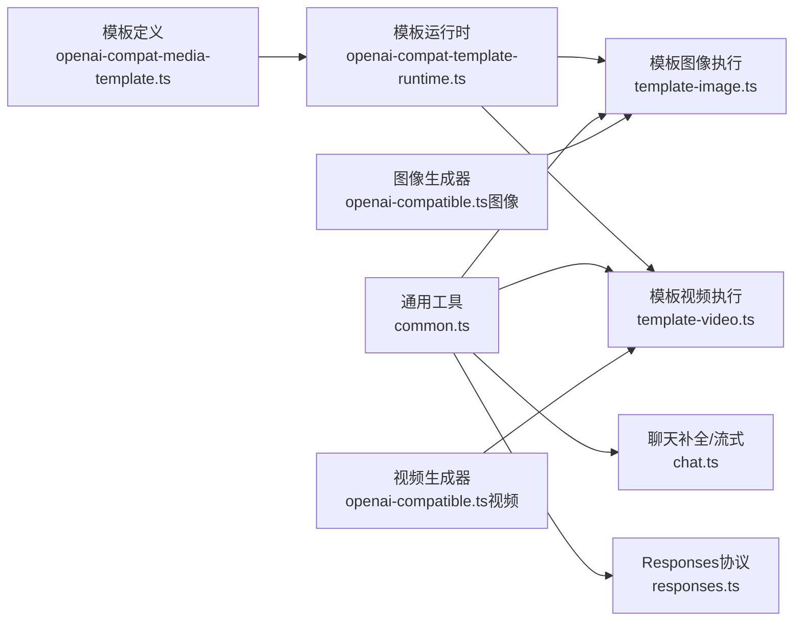

# OpenAI兼容协议

<cite>
**本文引用的文件**
- [openai-compat-template-runtime.ts](file://src/lib/openai-compat-template-runtime.ts)
- [openai-compat-media-template.ts](file://src/lib/openai-compat-media-template.ts)
- [common.ts](file://src/lib/model-gateway/openai-compat/common.ts)
- [chat.ts](file://src/lib/model-gateway/openai-compat/chat.ts)
- [responses.ts](file://src/lib/model-gateway/openai-compat/responses.ts)
- [template-image.ts](file://src/lib/model-gateway/openai-compat/template-image.ts)
- [template-video.ts](file://src/lib/model-gateway/openai-compat/template-video.ts)
- [openai-compatible.ts（图像）](file://src/lib/generators/image/openai-compatible.ts)
- [openai-compatible.ts（视频）](file://src/lib/generators/video/openai-compatible.ts)
- [openai-compat.ts（LLM提供者）](file://src/lib/llm/providers/openai-compat.ts)
- [chat-stream.ts](file://src/lib/llm/chat-stream.ts)
- [openai-compat-template-renderer.test.ts](file://tests/unit/model-gateway/openai-compat-template-renderer.test.ts)
- [openai-compat-responses.test.ts](file://tests/unit/model-gateway/openai-compat-responses.test.ts)
- [openai-compat-provider.contract.test.ts](file://tests/integration/provider/openai-compat-provider.contract.test.ts)
- [openai-compat-provider.contract.test.ts（视频）](file://tests/integration/provider/openai-compat-provider.contract.test.ts)
- [llm-test-connection.ts](file://src/lib/user-api/llm-test-connection.ts)
- [shared.ts（队列重试）](file://src/lib/workers/shared.ts)
- [ark-api.ts（重试与超时）](file://src/lib/ark-api.ts)
</cite>

## 目录
1. [简介](#简介)
2. [项目结构](#项目结构)
3. [核心组件](#核心组件)
4. [架构总览](#架构总览)
5. [详细组件分析](#详细组件分析)
6. [依赖关系分析](#依赖关系分析)
7. [性能考虑](#性能考虑)
8. [故障排查指南](#故障排查指南)
9. [结论](#结论)
10. [附录：集成示例与最佳实践](#附录集成示例与最佳实践)

## 简介
本文件面向Waoowaoo的OpenAI兼容协议实现，系统性阐述其设计与实现要点，覆盖以下主题：
- 聊天补全与流式响应的适配
- 视觉理解能力的适配路径
- 模板渲染系统、媒体模板处理与参数映射机制
- 支持第三方OpenAI兼容服务提供商的扩展方法，包括自定义头部、认证方式与响应格式转换
- 错误处理、重试机制与超时控制
- 性能优化策略与最佳实践

## 项目结构
围绕OpenAI兼容协议的关键代码分布在如下模块：
- 模型网关层：负责与第三方OpenAI兼容服务交互，封装通用配置解析、客户端创建与文件上传等
- 模板运行时：负责模板变量渲染、请求体构建、URL拼接、响应解析与错误提取
- 生成器层：面向图像/视频的生成器，统一调用模型网关接口
- LLM层：对聊天补全与流式响应进行适配，支持多种协议模式
- 测试与契约：通过单元与集成测试验证模板渲染、响应格式与端到端行为

图表来源
- [openai-compatible.ts（图像）:1-27](file://src/lib/generators/image/openai-compatible.ts#L1-L27)
- [openai-compatible.ts（视频）:1-49](file://src/lib/generators/video/openai-compatible.ts#L1-L49)
- [template-image.ts:1-138](file://src/lib/model-gateway/openai-compat/template-image.ts#L1-L138)
- [template-video.ts:1-125](file://src/lib/model-gateway/openai-compat/template-video.ts#L1-L125)
- [chat.ts:1-87](file://src/lib/model-gateway/openai-compat/chat.ts#L1-L87)
- [responses.ts:78-114](file://src/lib/model-gateway/openai-compat/responses.ts#L78-L114)
- [common.ts:1-74](file://src/lib/model-gateway/openai-compat/common.ts#L1-L74)
- [openai-compat-template-runtime.ts:1-485](file://src/lib/openai-compat-template-runtime.ts#L1-L485)
- [openai-compat-media-template.ts:1-66](file://src/lib/openai-compat-media-template.ts#L1-L66)

章节来源
- [openai-compatible.ts（图像）:1-27](file://src/lib/generators/image/openai-compatible.ts#L1-L27)
- [openai-compatible.ts（视频）:1-49](file://src/lib/generators/video/openai-compatible.ts#L1-L49)
- [template-image.ts:1-138](file://src/lib/model-gateway/openai-compat/template-image.ts#L1-L138)
- [template-video.ts:1-125](file://src/lib/model-gateway/openai-compat/template-video.ts#L1-L125)
- [chat.ts:1-87](file://src/lib/model-gateway/openai-compat/chat.ts#L1-L87)
- [responses.ts:78-114](file://src/lib/model-gateway/openai-compat/responses.ts#L78-L114)
- [common.ts:1-74](file://src/lib/model-gateway/openai-compat/common.ts#L1-L74)
- [openai-compat-template-runtime.ts:1-485](file://src/lib/openai-compat-template-runtime.ts#L1-L485)
- [openai-compat-media-template.ts:1-66](file://src/lib/openai-compat-media-template.ts#L1-L66)

## 核心组件
- 模板定义与类型
  - 定义了模板端点、响应映射、轮询配置以及占位符白名单，确保模板可描述不同媒体类型的同步/异步生成流程
- 模板运行时
  - 提供字符串与嵌套值的占位符渲染、URL拼接、请求头与请求体构建（含multipart/form-data与application/x-www-form-urlencoded）、JSON路径读取、错误提取与响应规范化
- 模型网关通用工具
  - 解析与校验提供者配置、构造OpenAI客户端、将图片数据源转换为可上传文件
- 图像/视频模板生成器
  - 基于模板执行创建请求、解析输出或任务ID，支持同步直返与异步轮询两种模式
- LLM聊天补全与流式适配
  - 统一调用OpenAI兼容客户端，支持标准聊天补全与Responses协议，流式场景下拆分推理与文本增量并注入阶段事件
- 生成器包装
  - 将具体模型网关调用封装为图像/视频生成器，便于上层业务直接使用

章节来源
- [openai-compat-media-template.ts:1-66](file://src/lib/openai-compat-media-template.ts#L1-L66)
- [openai-compat-template-runtime.ts:1-485](file://src/lib/openai-compat-template-runtime.ts#L1-L485)
- [common.ts:1-74](file://src/lib/model-gateway/openai-compat/common.ts#L1-L74)
- [template-image.ts:1-138](file://src/lib/model-gateway/openai-compat/template-image.ts#L1-L138)
- [template-video.ts:1-125](file://src/lib/model-gateway/openai-compat/template-video.ts#L1-L125)
- [chat.ts:1-87](file://src/lib/model-gateway/openai-compat/chat.ts#L1-L87)
- [responses.ts:78-114](file://src/lib/model-gateway/openai-compat/responses.ts#L78-L114)
- [openai-compatible.ts（图像）:1-27](file://src/lib/generators/image/openai-compatible.ts#L1-L27)
- [openai-compatible.ts（视频）:1-49](file://src/lib/generators/video/openai-compatible.ts#L1-L49)

## 架构总览
OpenAI兼容协议在系统中的位置与交互如下：

图表来源
- [template-image.ts:56-137](file://src/lib/model-gateway/openai-compat/template-image.ts#L56-L137)
- [template-video.ts:43-124](file://src/lib/model-gateway/openai-compat/template-video.ts#L43-L124)
- [openai-compat-template-runtime.ts:388-413](file://src/lib/openai-compat-template-runtime.ts#L388-L413)

章节来源
- [template-image.ts:56-137](file://src/lib/model-gateway/openai-compat/template-image.ts#L56-L137)
- [template-video.ts:43-124](file://src/lib/model-gateway/openai-compat/template-video.ts#L43-L124)
- [openai-compat-template-runtime.ts:388-413](file://src/lib/openai-compat-template-runtime.ts#L388-L413)

## 详细组件分析

### 模板渲染与请求构建
- 占位符渲染
  - 字符串与嵌套值均支持占位符替换；当字符串为仅占位符时可直接替换为对应值
- 变量映射与键名归一化
  - 将输入选项映射为模板变量，并同时生成蛇形键以提升兼容性
- URL与头部处理
  - 自动去除重复的/v1前缀，避免OpenAI风格URL重复；默认注入Authorization头
- 请求体构建
  - 支持application/json、multipart/form-data与application/x-www-form-urlencoded三种内容类型；multipart中对文件字段进行特殊处理
- 响应解析与错误提取
  - 规范化响应文本为JSON或回退为字符串；按模板配置从JSON路径读取任务ID、状态、输出URL等

图表来源
- [openai-compat-template-runtime.ts:425-484](file://src/lib/openai-compat-template-runtime.ts#L425-L484)
- [openai-compat-template-runtime.ts:255-276](file://src/lib/openai-compat-template-runtime.ts#L255-L276)
- [openai-compat-template-runtime.ts:310-333](file://src/lib/openai-compat-template-runtime.ts#L310-L333)
- [openai-compat-template-runtime.ts:335-345](file://src/lib/openai-compat-template-runtime.ts#L335-L345)

章节来源
- [openai-compat-template-runtime.ts:278-308](file://src/lib/openai-compat-template-runtime.ts#L278-L308)
- [openai-compat-template-runtime.ts:310-345](file://src/lib/openai-compat-template-runtime.ts#L310-L345)
- [openai-compat-template-runtime.ts:354-379](file://src/lib/openai-compat-template-runtime.ts#L354-L379)
- [openai-compat-template-runtime.ts:415-423](file://src/lib/openai-compat-template-runtime.ts#L415-L423)
- [openai-compat-template-runtime.ts:452-484](file://src/lib/openai-compat-template-runtime.ts#L452-L484)

### 模板定义与媒体类型
- 模板端点
  - 描述HTTP方法、路径、内容类型、请求头模板、请求体模板与文件字段集合
- 响应映射
  - 映射任务ID、状态、单/多输出URL等字段路径
- 轮询配置
  - 定义轮询间隔、超时与完成/失败状态集合
- 占位符白名单
  - 限定可用的内置模板变量，避免任意注入

图表来源
- [openai-compat-media-template.ts:18-51](file://src/lib/openai-compat-media-template.ts#L18-L51)

章节来源
- [openai-compat-media-template.ts:1-66](file://src/lib/openai-compat-media-template.ts#L1-L66)

### 图像生成模板执行
- 同步模式
  - 从响应中读取单/多输出URL并返回首张图
- 异步模式
  - 读取任务ID，编码提供者与模型引用，返回外部任务标识用于后续轮询
- 文件上传
  - 对图片数据源进行解析与转换，支持dataURL、远程URL与本地base64

图表来源
- [template-image.ts:56-137](file://src/lib/model-gateway/openai-compat/template-image.ts#L56-L137)
- [openai-compat-template-runtime.ts:388-413](file://src/lib/openai-compat-template-runtime.ts#L388-L413)

章节来源
- [template-image.ts:56-137](file://src/lib/model-gateway/openai-compat/template-image.ts#L56-L137)
- [common.ts:54-73](file://src/lib/model-gateway/openai-compat/common.ts#L54-L73)

### 视频生成模板执行
- 与图像类似，但针对视频输出路径与错误码做差异化处理
- 对特定HTTP状态（如404/405/415）识别为“格式不支持”，便于上层提示用户调整模型或参数

章节来源
- [template-video.ts:43-124](file://src/lib/model-gateway/openai-compat/template-video.ts#L43-L124)

### LLM聊天补全与流式响应
- 标准聊天补全
  - 通过OpenAI兼容客户端创建非流式补全
- 流式响应
  - 通过OpenAI兼容客户端创建流式补全，逐段提取推理与文本增量，注入阶段与片段事件
- Responses协议
  - 通过POST /responses将消息转换为包含reasoning与output_text的混合输出，再标准化为OpenAI兼容的聊天完成对象

图表来源
- [chat.ts:24-86](file://src/lib/model-gateway/openai-compat/chat.ts#L24-L86)
- [responses.ts:97-114](file://src/lib/model-gateway/openai-compat/responses.ts#L97-L114)

章节来源
- [chat.ts:1-87](file://src/lib/model-gateway/openai-compat/chat.ts#L1-L87)
- [responses.ts:78-114](file://src/lib/model-gateway/openai-compat/responses.ts#L78-L114)
- [openai-compat.ts（LLM提供者）:1-33](file://src/lib/llm/providers/openai-compat.ts#L1-L33)
- [chat-stream.ts:108-136](file://src/lib/llm/chat-stream.ts#L108-L136)

### 生成器包装
- 图像生成器
  - 将具体模型网关调用封装为图像生成器，支持指定providerId与modelId
- 视频生成器
  - 针对特定代理（如bltcy中转）走专用逻辑，其余走OpenAI兼容模板流程

章节来源
- [openai-compatible.ts（图像）:1-27](file://src/lib/generators/image/openai-compatible.ts#L1-L27)
- [openai-compatible.ts（视频）:1-49](file://src/lib/generators/video/openai-compatible.ts#L1-L49)

## 依赖关系分析
- 组件内聚与耦合
  - 模板运行时与模板定义高度内聚，形成稳定的渲染与解析管线
  - 模型网关层通过通用工具解耦提供者配置与文件上传细节
  - 生成器层仅依赖网关接口，便于扩展新模板或协议
- 外部依赖
  - 使用OpenAI SDK作为兼容客户端，简化认证与URL管理
  - 测试覆盖模板渲染、Responses协议与端到端契约

图表来源
- [openai-compat-media-template.ts:1-66](file://src/lib/openai-compat-media-template.ts#L1-L66)
- [openai-compat-template-runtime.ts:1-485](file://src/lib/openai-compat-template-runtime.ts#L1-L485)
- [template-image.ts:1-138](file://src/lib/model-gateway/openai-compat/template-image.ts#L1-L138)
- [template-video.ts:1-125](file://src/lib/model-gateway/openai-compat/template-video.ts#L1-L125)
- [common.ts:1-74](file://src/lib/model-gateway/openai-compat/common.ts#L1-L74)
- [chat.ts:1-87](file://src/lib/model-gateway/openai-compat/chat.ts#L1-L87)
- [responses.ts:78-114](file://src/lib/model-gateway/openai-compat/responses.ts#L78-L114)
- [openai-compatible.ts（图像）:1-27](file://src/lib/generators/image/openai-compatible.ts#L1-L27)
- [openai-compatible.ts（视频）:1-49](file://src/lib/generators/video/openai-compatible.ts#L1-L49)

章节来源
- [openai-compat-template-runtime.ts:1-485](file://src/lib/openai-compat-template-runtime.ts#L1-L485)
- [openai-compat-media-template.ts:1-66](file://src/lib/openai-compat-media-template.ts#L1-L66)
- [common.ts:1-74](file://src/lib/model-gateway/openai-compat/common.ts#L1-L74)
- [template-image.ts:1-138](file://src/lib/model-gateway/openai-compat/template-image.ts#L1-L138)
- [template-video.ts:1-125](file://src/lib/model-gateway/openai-compat/template-video.ts#L1-L125)
- [chat.ts:1-87](file://src/lib/model-gateway/openai-compat/chat.ts#L1-L87)
- [responses.ts:78-114](file://src/lib/model-gateway/openai-compat/responses.ts#L78-L114)
- [openai-compatible.ts（图像）:1-27](file://src/lib/generators/image/openai-compatible.ts#L1-L27)
- [openai-compatible.ts（视频）:1-49](file://src/lib/generators/video/openai-compatible.ts#L1-L49)

## 性能考虑
- 减少不必要的字符串拼接与深拷贝
  - 在模板渲染与请求体构建中，优先使用原生类型与扁平结构，避免深层嵌套导致的高开销
- 合理选择内容类型
  - 对大文件上传优先使用multipart/form-data，避免过大的JSON体积
- 流式处理
  - 在LLM流式场景中，尽早分发增量，减少累积延迟
- 缓存与复用
  - 对图片数据源进行缓存解析，避免重复下载与解码
- 轮询节流
  - 根据模板配置合理设置轮询间隔与超时，避免过度请求

## 故障排查指南
- 常见错误与定位
  - 模板变量缺失：检查占位符是否在变量映射中存在
  - 请求体为空：当HTTP方法要求请求体时需确保模板体已渲染
  - 输出未找到：确认响应映射路径与实际响应结构一致
  - 视频格式不支持：当出现404/405/415时，提示用户调整模型或参数
- 错误提取与日志
  - 模板运行时会从常见错误字段中提取信息，若无明确错误则返回状态码与响应片段
- 重试与超时
  - 队列作业采用指数退避与最大重试次数控制；网络/超时类错误可重试，4xx类错误通常不重试
  - Ark API层对4xx错误进行分类，避免对不可重试错误进行无意义重试

章节来源
- [openai-compat-template-runtime.ts:452-484](file://src/lib/openai-compat-template-runtime.ts#L452-L484)
- [template-image.ts:87-121](file://src/lib/model-gateway/openai-compat/template-image.ts#L87-L121)
- [template-video.ts:72-106](file://src/lib/model-gateway/openai-compat/template-video.ts#L72-L106)
- [shared.ts（队列重试）:240-279](file://src/lib/workers/shared.ts#L240-L279)
- [ark-api.ts（重试与超时）:371-399](file://src/lib/ark-api.ts#L371-L399)

## 结论
Waoowaoo的OpenAI兼容协议通过“模板+运行时”的架构，实现了对第三方OpenAI兼容服务的统一接入与扩展。该方案在保持与OpenAI生态一致的调用体验的同时，提供了灵活的模板化配置、完善的错误处理与重试机制，并通过生成器层屏蔽底层差异，便于快速集成新的服务提供商。

## 附录：集成示例与最佳实践

### 快速接入新的OpenAI兼容服务
- 步骤概览
  - 在提供者配置中填写baseUrl与apiKey
  - 定义媒体模板（图像/视频），设置端点、响应映射与轮询配置
  - 在生成器层调用模板执行函数，或在LLM层选择合适的协议模式
- 关键点
  - 正确设置multipartFileFields以启用文件上传
  - 使用模板占位符白名单内的变量，避免意外注入
  - 对于Responses协议，确保消息结构与输出路径匹配

章节来源
- [llm-test-connection.ts:1-226](file://src/lib/user-api/llm-test-connection.ts#L1-L226)
- [openai-compat-template-renderer.test.ts:1-190](file://tests/unit/model-gateway/openai-compat-template-renderer.test.ts#L1-L190)
- [openai-compat-responses.test.ts:1-68](file://tests/unit/model-gateway/openai-compat-responses.test.ts#L1-L68)
- [openai-compat-provider.contract.test.ts](file://tests/integration/provider/openai-compat-provider.contract.test.ts)
- [openai-compat-provider.contract.test.ts（视频）](file://tests/integration/provider/openai-compat-provider.contract.test.ts)

### 参数映射与头部定制
- 内置变量
  - 包括model、prompt、image、images、aspect_ratio、duration、resolution、size、task_id等
- 自定义选项
  - 通过extra传入的键值会被映射为模板变量，并同时生成蛇形变体以增强兼容性
- 认证与头部
  - 默认注入Authorization头；可通过模板headers覆盖或追加其他头部

章节来源
- [openai-compat-media-template.ts:55-65](file://src/lib/openai-compat-media-template.ts#L55-L65)
- [openai-compat-template-runtime.ts:90-106](file://src/lib/openai-compat-template-runtime.ts#L90-L106)
- [openai-compat-template-runtime.ts:335-345](file://src/lib/openai-compat-template-runtime.ts#L335-L345)

### 错误处理、重试与超时
- 错误提取
  - 优先从模板配置的errorPath读取错误信息，其次回退到常见字段
- 重试策略
  - 队列作业根据退避策略与最大重试次数进行重试；网络/超时类错误可重试
  - Ark API层对4xx错误进行分类，避免对不可重试错误重试
- 超时控制
  - 流式场景对单片段超时进行保护，防止长时间阻塞

章节来源
- [openai-compat-template-runtime.ts:452-484](file://src/lib/openai-compat-template-runtime.ts#L452-L484)
- [shared.ts（队列重试）:240-279](file://src/lib/workers/shared.ts#L240-L279)
- [ark-api.ts（重试与超时）:371-399](file://src/lib/ark-api.ts#L371-L399)