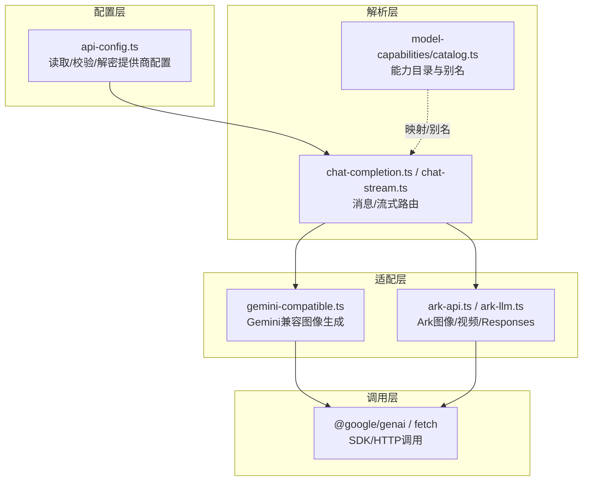
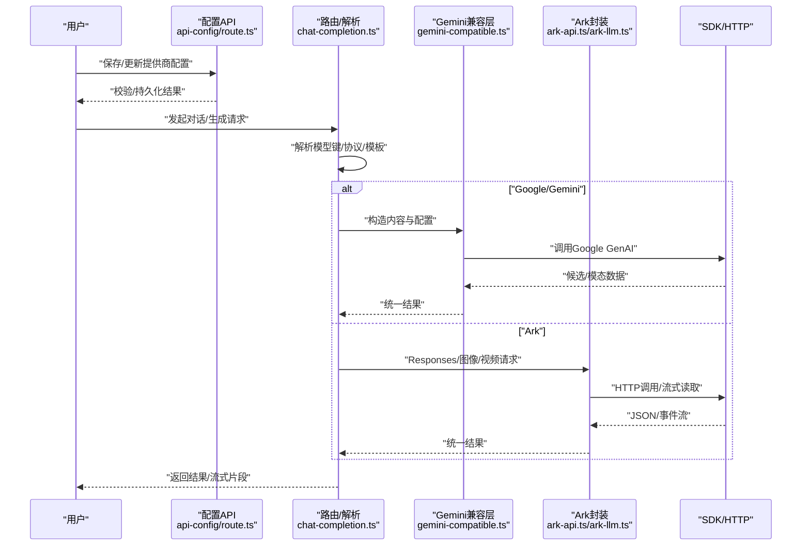
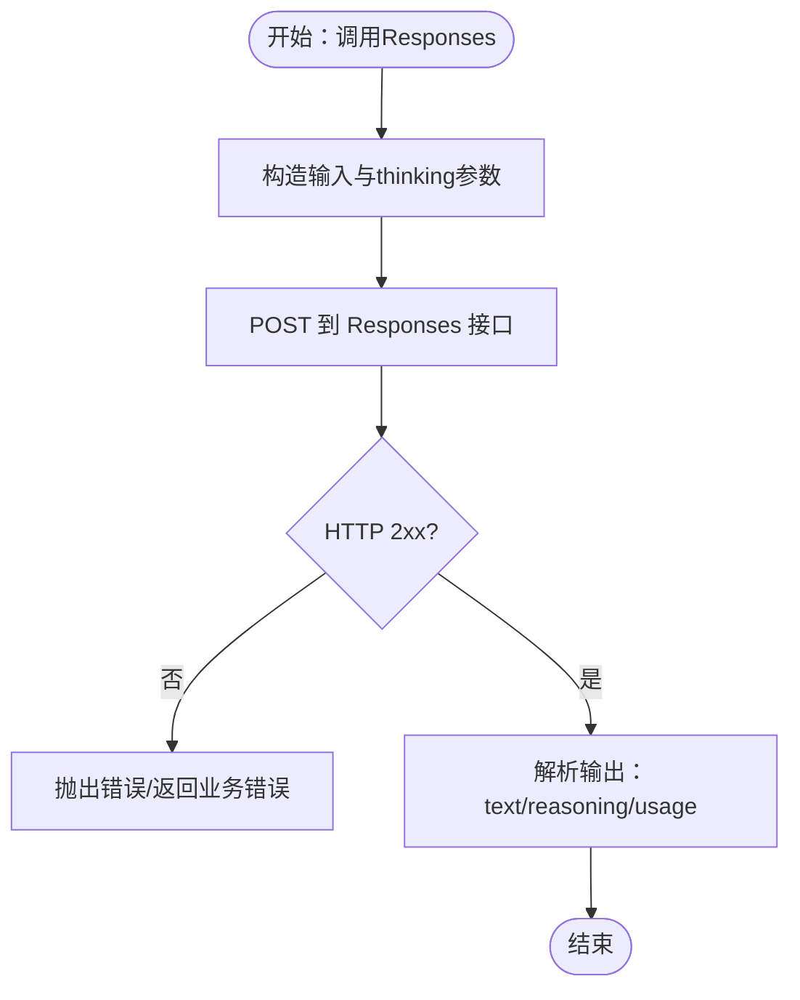
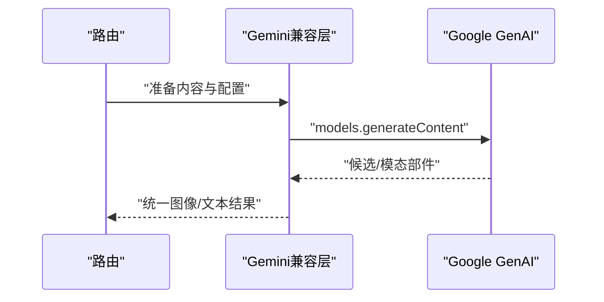
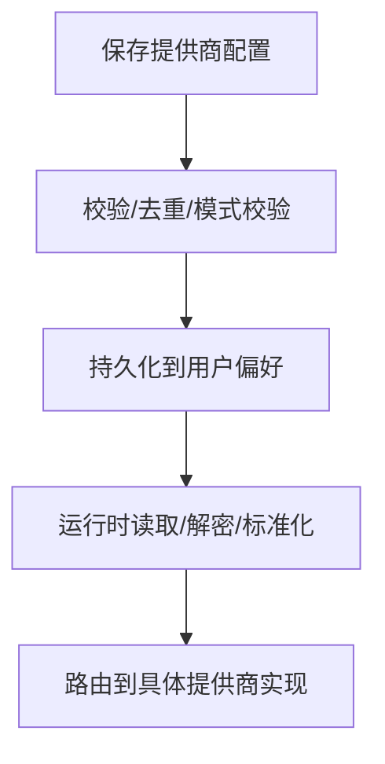
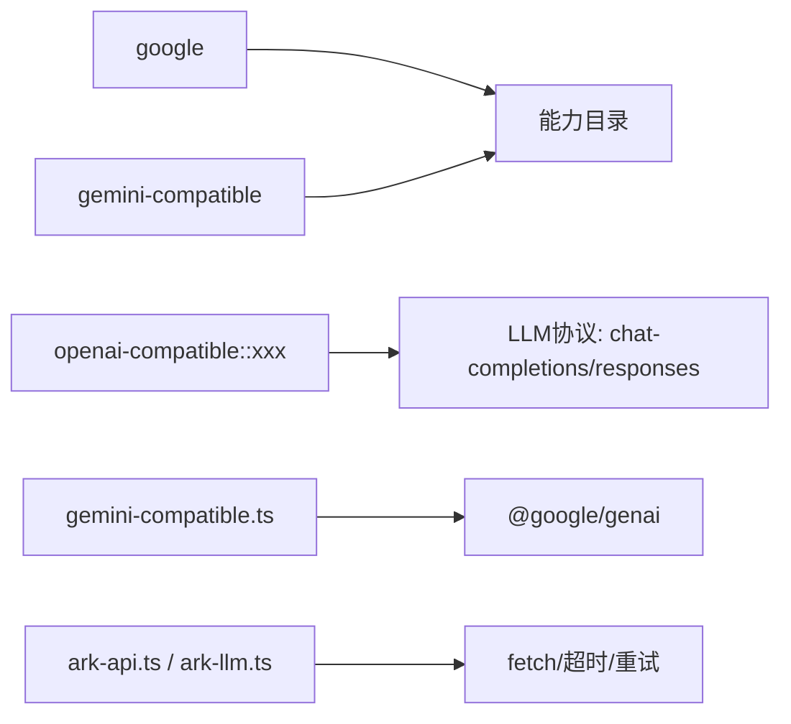

# 具体服务提供商

<cite>
**本文引用的文件**
- [ark-api.ts](file://src/lib/ark-api.ts)
- [ark-llm.ts](file://src/lib/ark-llm.ts)
- [api-config.ts](file://src/lib/api-config.ts)
- [gemini-compatible.ts](file://src/lib/generators/image/gemini-compatible.ts)
- [chat-completion.ts](file://src/lib/llm/chat-completion.ts)
- [chat-stream.ts](file://src/lib/llm/chat-stream.ts)
- [route.ts](file://src/app/api/user/api-config/route.ts)
- [test-provider/route.ts](file://src/app/api/user/api-config/test-provider/route.ts)
- [catalog.ts](file://src/lib/model-capabilities/catalog.ts)
- [user-api-config-put.test.ts](file://tests/integration/api/specific/user-api-config-put.test.ts)
- [image-provider-smoke.test.ts](file://tests/unit/generators/image-provider-smoke.test.ts)
</cite>

## 目录
1. [简介](#简介)
2. [项目结构](#项目结构)
3. [核心组件](#核心组件)
4. [架构总览](#架构总览)
5. [详细组件分析](#详细组件分析)
6. [依赖关系分析](#依赖关系分析)
7. [性能考虑](#性能考虑)
8. [故障排查指南](#故障排查指南)
9. [结论](#结论)
10. [附录](#附录)

## 简介
本文件面向Waoowaoo中具体AI服务提供商的集成实现，重点覆盖以下方面：
- Ark（火山引擎）与Google（Gemini）两类提供商的API适配、认证方式与功能特性
- 模型能力差异、参数配置与响应格式处理
- 提供商选择策略、路由与兼容层设计
- 配置示例、使用限制与成本考量
- 性能对比、稳定性评估与监控指标建议
- 场景化选型与迁移切换最佳实践

## 项目结构
围绕“提供商配置—模型解析—协议适配—SDK/HTTP调用”的分层组织：
- 配置层：用户偏好与提供商配置读取、校验与标准化
- 解析层：模型键解析、媒体模板与协议选择
- 适配层：OpenAI兼容层、Gemini兼容层、Ark官方协议封装
- 调用层：SDK直连或HTTP直调，含超时、重试与错误归一化

图表来源
- [api-config.ts:409-434](file://src/lib/api-config.ts#L409-L434)
- [chat-completion.ts:173-196](file://src/lib/llm/chat-completion.ts#L173-L196)
- [chat-stream.ts:174-200](file://src/lib/llm/chat-stream.ts#L174-L200)
- [gemini-compatible.ts:80-90](file://src/lib/generators/image/gemini-compatible.ts#L80-L90)
- [ark-api.ts:416-471](file://src/lib/ark-api.ts#L416-L471)
- [ark-llm.ts:104-140](file://src/lib/ark-llm.ts#L104-L140)
- [catalog.ts:164-167](file://src/lib/model-capabilities/catalog.ts#L164-L167)

章节来源
- [api-config.ts:1-509](file://src/lib/api-config.ts#L1-L509)
- [chat-completion.ts:173-196](file://src/lib/llm/chat-completion.ts#L173-L196)
- [chat-stream.ts:174-200](file://src/lib/llm/chat-stream.ts#L174-L200)
- [gemini-compatible.ts:1-147](file://src/lib/generators/image/gemini-compatible.ts#L1-L147)
- [ark-api.ts:1-598](file://src/lib/ark-api.ts#L1-L598)
- [ark-llm.ts:1-340](file://src/lib/ark-llm.ts#L1-L340)
- [catalog.ts:129-167](file://src/lib/model-capabilities/catalog.ts#L129-L167)

## 核心组件
- Ark集成
  - 图像生成：统一请求/响应结构，支持尺寸、比例、水印、参考图等参数，并内置超时与指数退避重试
  - 视频任务：任务创建、轮询查询，支持分辨率、帧率、种子、工具（搜索）、草稿模式等
  - LLM Responses：非流式与流式接口，支持thinking开关与usage提取
- Google/Gemini集成
  - 文本/图像生成：通过Gemini兼容层，统一以TEXT+IMAGE模态输出，支持宽高比/分辨率配置
  - 流式对话：基于SDK的generateContentStream，支持思维级别与思考输出
  - 能力目录：与google共享能力目录，便于跨提供商能力对齐
- 配置与路由
  - 用户API配置持久化与校验，支持自定义提供商、网关路由、API模式
  - 测试接口：一键探测提供商连通性与延迟
  - 模型解析：严格模型键解析，LLM协议与媒体模板选择

章节来源
- [ark-api.ts:51-123](file://src/lib/ark-api.ts#L51-L123)
- [ark-llm.ts:5-22](file://src/lib/ark-llm.ts#L5-L22)
- [gemini-compatible.ts:66-147](file://src/lib/generators/image/gemini-compatible.ts#L66-L147)
- [chat-completion.ts:173-196](file://src/lib/llm/chat-completion.ts#L173-L196)
- [chat-stream.ts:174-200](file://src/lib/llm/chat-stream.ts#L174-L200)
- [api-config.ts:409-434](file://src/lib/api-config.ts#L409-L434)
- [route.ts:843-1426](file://src/app/api/user/api-config/route.ts#L843-L1426)
- [test-provider/route.ts:1-18](file://src/app/api/user/api-config/test-provider/route.ts#L1-L18)
- [catalog.ts:164-167](file://src/lib/model-capabilities/catalog.ts#L164-L167)

## 架构总览
下图展示从用户配置到具体提供商调用的关键流程与职责边界。

图表来源
- [route.ts:843-1426](file://src/app/api/user/api-config/route.ts#L843-L1426)
- [chat-completion.ts:173-196](file://src/lib/llm/chat-completion.ts#L173-L196)
- [gemini-compatible.ts:80-123](file://src/lib/generators/image/gemini-compatible.ts#L80-L123)
- [ark-api.ts:416-571](file://src/lib/ark-api.ts#L416-L571)
- [ark-llm.ts:104-140](file://src/lib/ark-llm.ts#L104-L140)

## 详细组件分析

### Ark（火山引擎）集成
- 认证与超时重试
  - 使用Bearer Token认证，统一超时与指数退避重试策略，支持业务错误与网络错误区分
- 图像生成
  - 支持尺寸、比例、水印、参考图、顺序生成等参数；返回URL或Base64二选一
- 视频任务
  - 任务创建支持分辨率、比例、时长/帧数、种子、相机固定、水印、最后帧、服务等级、执行过期时间、音轨生成、草稿模式与工具（网络搜索）
  - 任务轮询返回状态、资源URL或数组形式的多模态内容，包含用量统计
- LLM Responses
  - 非流式与流式两种调用；流式事件包含推理摘要与输出文本增量；统一抽取text、reasoning与usage
- 参数校验
  - 对视频任务请求进行字段白名单与取值范围校验，确保与Ark约束一致

图表来源
- [ark-llm.ts:104-140](file://src/lib/ark-llm.ts#L104-L140)
- [ark-llm.ts:224-340](file://src/lib/ark-llm.ts#L224-L340)

章节来源
- [ark-api.ts:416-571](file://src/lib/ark-api.ts#L416-L571)
- [ark-llm.ts:104-340](file://src/lib/ark-llm.ts#L104-L340)

### Google（Gemini）集成
- 文本/图像生成（兼容层）
  - 通过Gemini兼容层统一调用，支持TEXT+IMAGE模态；可设置宽高比/分辨率；内置安全阈值配置
  - 支持参考图像（最多14张），自动解析dataURL/HTTP/本地路径
- 流式对话
  - 基于SDK generateContentStream，支持思维级别与includeThoughts
- 能力目录
  - 与google共享能力目录，便于跨提供商能力对齐与展示

图表来源
- [gemini-compatible.ts:80-123](file://src/lib/generators/image/gemini-compatible.ts#L80-L123)
- [chat-stream.ts:174-200](file://src/lib/llm/chat-stream.ts#L174-L200)
- [catalog.ts:164-167](file://src/lib/model-capabilities/catalog.ts#L164-L167)

章节来源
- [gemini-compatible.ts:66-147](file://src/lib/generators/image/gemini-compatible.ts#L66-L147)
- [chat-completion.ts:173-196](file://src/lib/llm/chat-completion.ts#L173-L196)
- [chat-stream.ts:174-200](file://src/lib/llm/chat-stream.ts#L174-L200)
- [catalog.ts:164-167](file://src/lib/model-capabilities/catalog.ts#L164-L167)

### 配置与路由
- 用户API配置
  - 支持提供商ID、名称、可选baseUrl/apiMode/gatewayRoute；严格去重与重复ID校验
  - 解密存储的API Key，按提供商键规范化baseUrl
- 测试接口
  - POST /api/user/api-config/test-provider，返回连通性步骤与延迟
- 模型解析
  - 严格模型键解析，LLM协议与媒体模板选择；仅允许单模型场景时省略model_key

图表来源
- [route.ts:843-1426](file://src/app/api/user/api-config/route.ts#L843-L1426)
- [api-config.ts:409-434](file://src/lib/api-config.ts#L409-L434)
- [test-provider/route.ts:1-18](file://src/app/api/user/api-config/test-provider/route.ts#L1-L18)

章节来源
- [route.ts:843-1426](file://src/app/api/user/api-config/route.ts#L843-L1426)
- [api-config.ts:121-191](file://src/lib/api-config.ts#L121-L191)
- [api-config.ts:409-434](file://src/lib/api-config.ts#L409-L434)
- [test-provider/route.ts:1-18](file://src/app/api/user/api-config/test-provider/route.ts#L1-L18)

## 依赖关系分析
- Provider键与能力映射
  - gemini-compatible与google共享能力目录，便于跨提供商能力一致性
- 模型键与协议
  - LLM在openai-compatible场景下可选择chat-completions或responses协议
- 适配层耦合
  - Gemini兼容层依赖Google GenAI SDK；Ark封装依赖fetch与内部日志/超时/重试工具

图表来源
- [catalog.ts:164-167](file://src/lib/model-capabilities/catalog.ts#L164-L167)
- [api-config.ts:337-352](file://src/lib/api-config.ts#L337-L352)
- [gemini-compatible.ts:80-90](file://src/lib/generators/image/gemini-compatible.ts#L80-L90)
- [ark-api.ts:344-411](file://src/lib/ark-api.ts#L344-L411)

章节来源
- [catalog.ts:164-167](file://src/lib/model-capabilities/catalog.ts#L164-L167)
- [api-config.ts:337-352](file://src/lib/api-config.ts#L337-L352)
- [gemini-compatible.ts:80-90](file://src/lib/generators/image/gemini-compatible.ts#L80-L90)
- [ark-api.ts:344-411](file://src/lib/ark-api.ts#L344-L411)

## 性能考虑
- 超时与重试
  - Ark封装默认90秒超时与最多3次指数退避重试，适用于跨境网络波动
- 流式输出
  - Gemini流式与Ark Responses流式均支持增量输出，降低首字延迟
- 成本与用量
  - Ark Responses返回usage，便于计费与成本追踪；Gemini兼容层通过SDK候选输出可结合外部计费系统
- 并发与队列
  - 建议在上层引入并发门控与任务队列，避免提供商限流触发

章节来源
- [ark-api.ts:16-20](file://src/lib/ark-api.ts#L16-L20)
- [ark-api.ts:344-411](file://src/lib/ark-api.ts#L344-L411)
- [ark-llm.ts:224-340](file://src/lib/ark-llm.ts#L224-L340)
- [chat-stream.ts:174-200](file://src/lib/llm/chat-stream.ts#L174-L200)

## 故障排查指南
- 常见错误与定位
  - Ark：HTTP 4xx（参数/权限）不重试；超时/网络错误按指数退避重试；可通过日志定位第N次尝试
  - Gemini兼容层：缺少baseUrl、参考图解析失败、安全策略拦截（IMAGE_SAFETY/SAFETY）
  - 配置：重复ID、无效JSON、API模式与网关路由冲突
- 测试与诊断
  - 使用测试接口快速探测连通性与延迟
  - 结合单元/集成测试验证图像生成与提供商配置行为

章节来源
- [ark-api.ts:367-411](file://src/lib/ark-api.ts#L367-L411)
- [gemini-compatible.ts:80-90](file://src/lib/generators/image/gemini-compatible.ts#L80-L90)
- [gemini-compatible.ts:140-145](file://src/lib/generators/image/gemini-compatible.ts#L140-L145)
- [route.ts:843-880](file://src/app/api/user/api-config/route.ts#L843-L880)
- [test-provider/route.ts:1-18](file://src/app/api/user/api-config/test-provider/route.ts#L1-L18)
- [user-api-config-put.test.ts:150-218](file://tests/integration/api/specific/user-api-config-put.test.ts#L150-L218)
- [image-provider-smoke.test.ts:166-211](file://tests/unit/generators/image-provider-smoke.test.ts#L166-L211)

## 结论
- Ark适合需要视频任务编排、Responses推理输出与较强可控性的场景；Gemini兼容层提供统一图像生成体验与流式对话能力
- 通过严格的模型键解析与提供商配置校验，系统实现了“零猜测、零降级”的稳定路由
- 建议在生产中结合超时/重试、并发门控与用量统计，持续优化稳定性与成本

## 附录

### 配置示例与限制
- Ark
  - 必填：API Key；可选：超时、重试次数、日志前缀
  - 图像：支持尺寸/比例/水印/参考图；视频：分辨率/比例/时长/帧数/种子/工具/草稿
- Google（Gemini）
  - 必填：API Key与baseUrl；可选：思维级别、宽高比/分辨率
  - 参考图：最多14张，支持dataURL/HTTP/本地路径
- 配置限制
  - Provider ID重复检测、API模式与网关路由合法性校验、最小化payload字段集

章节来源
- [ark-api.ts:416-571](file://src/lib/ark-api.ts#L416-L571)
- [ark-llm.ts:104-140](file://src/lib/ark-llm.ts#L104-L140)
- [gemini-compatible.ts:66-123](file://src/lib/generators/image/gemini-compatible.ts#L66-L123)
- [api-config.ts:121-191](file://src/lib/api-config.ts#L121-L191)
- [route.ts:843-880](file://src/app/api/user/api-config/route.ts#L843-L880)

### 监控指标建议
- 延迟：请求到首字/完成的耗时
- 成功率：HTTP 2xx/4xx/5xx分布
- 重试次数：平均/最大重试轮次
- 用量：prompt/completion tokens（Ark Responses）
- 错误分类：参数错误、权限错误、网络错误、业务错误

章节来源
- [ark-api.ts:344-411](file://src/lib/ark-api.ts#L344-L411)
- [ark-llm.ts:224-340](file://src/lib/ark-llm.ts#L224-L340)

### 场景选型与迁移
- 选型策略
  - 需要视频任务与推理输出：优先Ark
  - 需要统一图像生成与流式对话：优先Gemini兼容层
- 迁移与切换
  - 保持模型键不变，仅替换providerId与baseUrl/apiKey
  - 使用测试接口验证连通性与延迟，逐步切流
  - 保留历史用量与错误日志，便于回滚与对比

章节来源
- [catalog.ts:164-167](file://src/lib/model-capabilities/catalog.ts#L164-L167)
- [test-provider/route.ts:1-18](file://src/app/api/user/api-config/test-provider/route.ts#L1-L18)
- [user-api-config-put.test.ts:150-218](file://tests/integration/api/specific/user-api-config-put.test.ts#L150-L218)