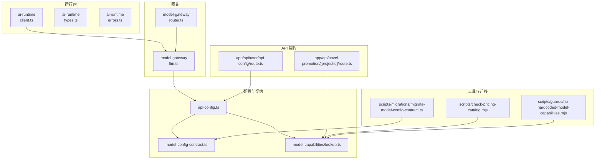
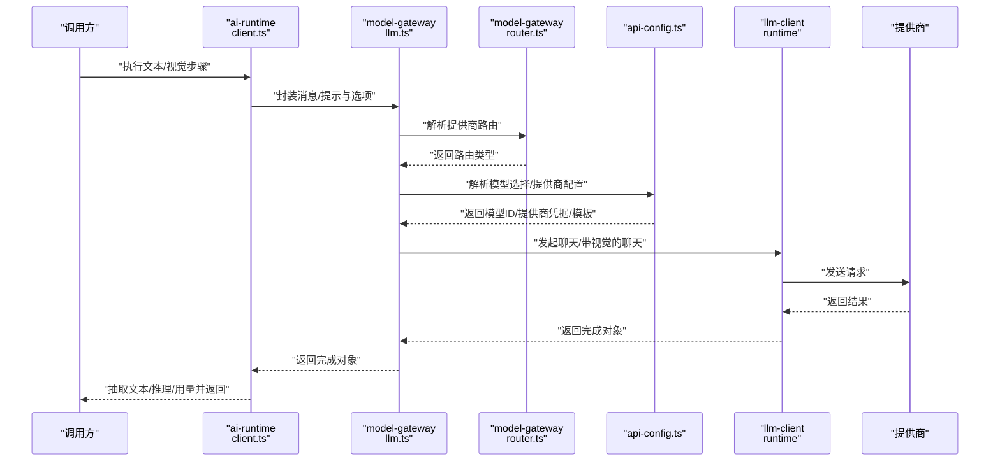
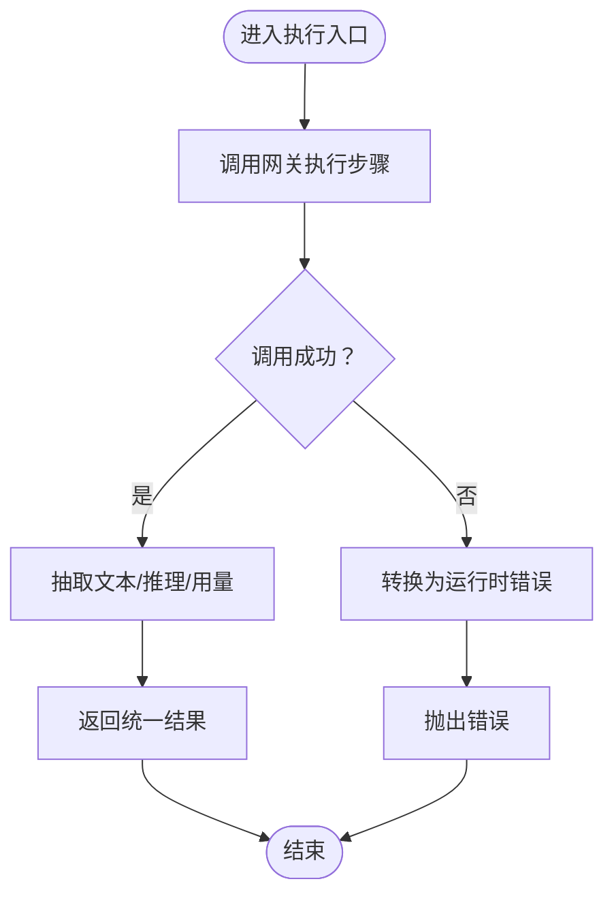
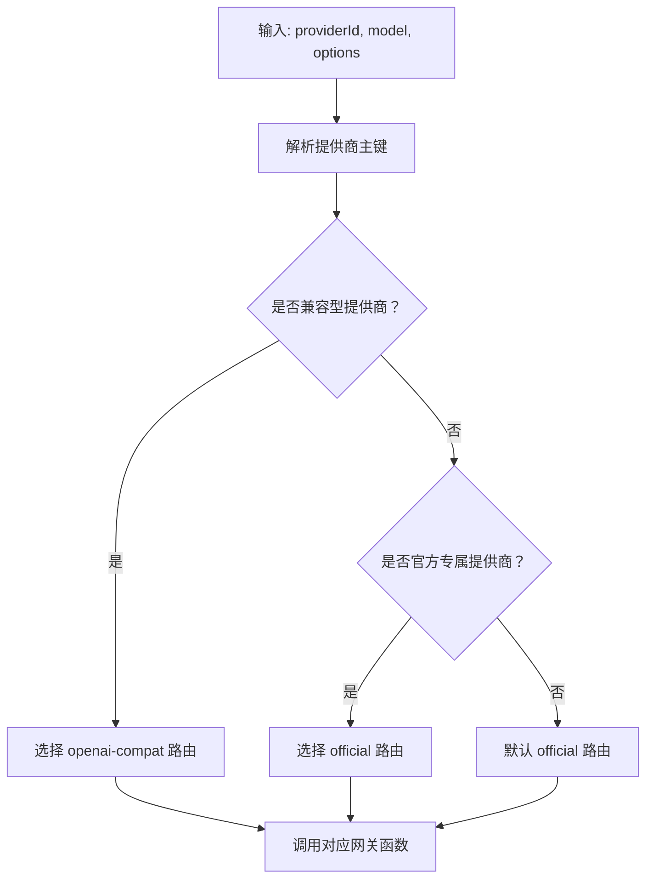
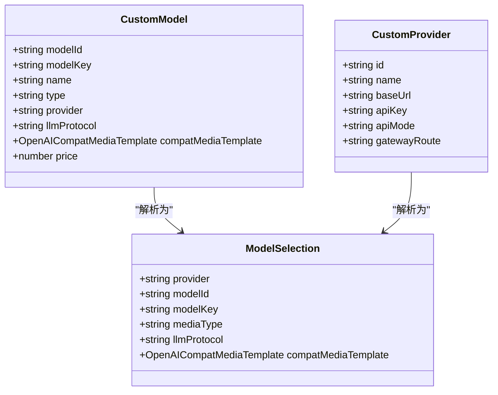
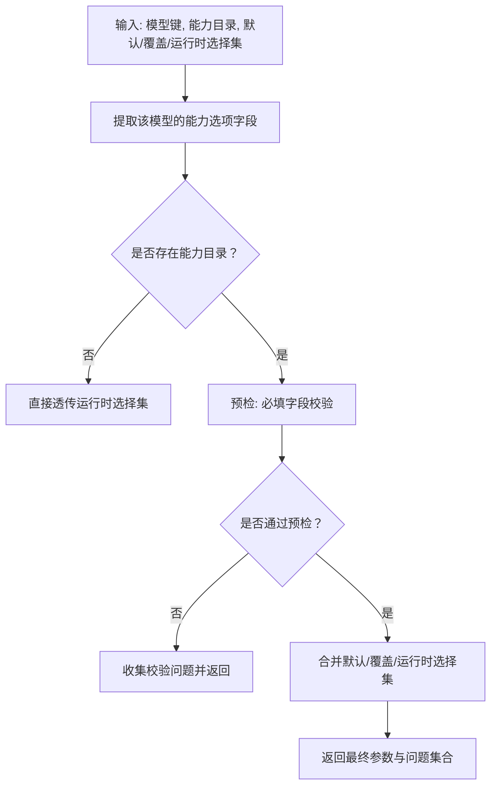
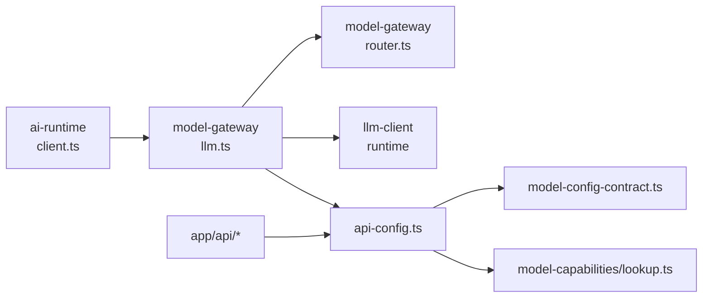

# 模型抽象层

<cite>
**本文引用的文件**   
- [src/lib/ai-runtime/index.ts](file://src/lib/ai-runtime/index.ts)
- [src/lib/ai-runtime/client.ts](file://src/lib/ai-runtime/client.ts)
- [src/lib/ai-runtime/types.ts](file://src/lib/ai-runtime/types.ts)
- [src/lib/ai-runtime/errors.ts](file://src/lib/ai-runtime/errors.ts)
- [src/lib/model-gateway/router.ts](file://src/lib/model-gateway/router.ts)
- [src/lib/model-gateway/llm.ts](file://src/lib/model-gateway/llm.ts)
- [src/lib/llm-client.ts](file://src/lib/llm-client.ts)
- [src/lib/api-config.ts](file://src/lib/api-config.ts)
- [src/lib/model-config-contract.ts](file://src/lib/model-config-contract.ts)
- [src/lib/model-capabilities/lookup.ts](file://src/lib/model-capabilities/lookup.ts)
- [src/app/api/user/api-config/route.ts](file://src/app/api/user/api-config/route.ts)
- [src/app/api/novel-promotion/[projectId]/route.ts](file://src/app/api/novel-promotion/[projectId]/route.ts)
- [scripts/check-pricing-catalog.mjs](file://scripts/check-pricing-catalog.mjs)
- [scripts/migrations/migrate-model-config-contract.ts](file://scripts/migrations/migrate-model-config-contract.ts)
- [scripts/guards/no-hardcoded-model-capabilities.mjs](file://scripts/guards/no-hardcoded-model-capabilities.mjs)
</cite>

## 目录
1. [引言](#引言)
2. [项目结构](#项目结构)
3. [核心组件](#核心组件)
4. [架构总览](#架构总览)
5. [详细组件分析](#详细组件分析)
6. [依赖关系分析](#依赖关系分析)
7. [性能考量](#性能考量)
8. [故障排查指南](#故障排查指南)
9. [结论](#结论)
10. [附录](#附录)

## 引言
本文件系统性梳理 Waoowaoo 的“模型抽象层”，围绕统一 AI 模型接口的设计理念与实现架构展开，重点覆盖以下方面：
- 统一接口与运行时：如何以一致的输入输出封装文本与视觉类 AI 步骤，屏蔽不同提供商差异
- 请求路由策略：如何根据提供商类型与协议兼容性选择官方或 OpenAI 兼容网关路径
- 响应处理流程：如何抽取文本与推理内容、统计用量并进行错误归一化
- 能力检测与参数适配：如何基于模型能力目录与选择集进行参数校验与自动填充
- 错误处理机制：如何将底层异常映射为可重试/不可重试的统一错误码
- 注册与配置管理：如何在用户偏好中注册模型与提供商，如何解析与校验模型键与能力
- 生命周期控制：如何在运行期解析模型选择、提取提供商凭据并按需注入模板
- 性能优化与并发：如何通过统一网关与能力选择减少无效调用，避免硬编码能力常量
- 扩展新模型与提供商：如何遵循契约与迁移脚本，安全地接入新模型与能力

## 项目结构
模型抽象层主要分布在如下模块：
- 运行时与类型：ai-runtime（对外暴露统一执行入口、类型与错误）
- 网关路由与 LLM 路由：model-gateway（根据提供商类型决定官方或兼容路径）
- 配置中心与模型契约：api-config、model-config-contract（模型与提供商的注册、解析与校验）
- 能力目录与参数适配：model-capabilities/lookup（能力选项、默认值与运行时合并）
- API 层契约与校验：app/api 下的路由（对模型键、能力选择等进行约束）
- 迁移与守卫：scripts 下的迁移与检查脚本（保证配置一致性与能力规范）

图表来源
- [src/lib/ai-runtime/client.ts:1-113](file://src/lib/ai-runtime/client.ts#L1-L113)
- [src/lib/model-gateway/router.ts:1-22](file://src/lib/model-gateway/router.ts#L1-L22)
- [src/lib/model-gateway/llm.ts:1-40](file://src/lib/model-gateway/llm.ts#L1-L40)
- [src/lib/api-config.ts:1-509](file://src/lib/api-config.ts#L1-L509)
- [src/lib/model-config-contract.ts:1-528](file://src/lib/model-config-contract.ts#L1-L528)
- [src/lib/model-capabilities/lookup.ts:91-279](file://src/lib/model-capabilities/lookup.ts#L91-L279)
- [src/app/api/user/api-config/route.ts:843-880](file://src/app/api/user/api-config/route.ts#L843-L880)
- [src/app/api/novel-promotion/[projectId]/route.ts:79-114](file://src/app/api/novel-promotion/[projectId]/route.ts#L79-L114)
- [scripts/check-pricing-catalog.mjs:35-77](file://scripts/check-pricing-catalog.mjs#L35-L77)
- [scripts/migrations/migrate-model-config-contract.ts:213-261](file://scripts/migrations/migrate-model-config-contract.ts#L213-L261)
- [scripts/guards/no-hardcoded-model-capabilities.mjs:53-73](file://scripts/guards/no-hardcoded-model-capabilities.mjs#L53-L73)

章节来源
- [src/lib/ai-runtime/index.ts:1-10](file://src/lib/ai-runtime/index.ts#L1-L10)
- [src/lib/ai-runtime/client.ts:1-113](file://src/lib/ai-runtime/client.ts#L1-L113)
- [src/lib/model-gateway/router.ts:1-22](file://src/lib/model-gateway/router.ts#L1-L22)
- [src/lib/model-gateway/llm.ts:1-40](file://src/lib/model-gateway/llm.ts#L1-L40)
- [src/lib/api-config.ts:1-509](file://src/lib/api-config.ts#L1-L509)
- [src/lib/model-config-contract.ts:1-528](file://src/lib/model-config-contract.ts#L1-L528)
- [src/lib/model-capabilities/lookup.ts:91-279](file://src/lib/model-capabilities/lookup.ts#L91-L279)
- [src/app/api/user/api-config/route.ts:843-880](file://src/app/api/user/api-config/route.ts#L843-L880)
- [src/app/api/novel-promotion/[projectId]/route.ts:79-114](file://src/app/api/novel-promotion/[projectId]/route.ts#L79-L114)
- [scripts/check-pricing-catalog.mjs:35-77](file://scripts/check-pricing-catalog.mjs#L35-L77)
- [scripts/migrations/migrate-model-config-contract.ts:213-261](file://scripts/migrations/migrate-model-config-contract.ts#L213-L261)
- [scripts/guards/no-hardcoded-model-capabilities.mjs:53-73](file://scripts/guards/no-hardcoded-model-capabilities.mjs#L53-L73)

## 核心组件
- 统一执行入口与类型
  - 对外导出文本与视觉步骤执行函数，统一输入输出结构与元数据传递
  - 定义统一的运行时错误码与结构，便于上层统一处理
- 网关路由与 LLM 路由
  - 根据提供商类型判定走官方还是 OpenAI 兼容路径
  - 将用户侧请求转发到统一的 LLM 客户端
- 配置中心与模型契约
  - 用户偏好中注册模型与提供商，严格解析与校验模型键
  - 提供模型能力目录与参数校验、默认值与运行时合并逻辑
- 能力目录与参数适配
  - 基于模型能力目录进行参数合法性校验与自动填充
  - 支持运行时选择集与默认/覆盖选择集的合并
- API 契约与守卫
  - 在 API 层对模型键格式、能力选择进行强约束
  - 通过迁移脚本与守卫确保配置一致性与能力规范

章节来源
- [src/lib/ai-runtime/index.ts:1-10](file://src/lib/ai-runtime/index.ts#L1-L10)
- [src/lib/ai-runtime/types.ts:1-78](file://src/lib/ai-runtime/types.ts#L1-L78)
- [src/lib/ai-runtime/errors.ts:1-87](file://src/lib/ai-runtime/errors.ts#L1-L87)
- [src/lib/model-gateway/router.ts:1-22](file://src/lib/model-gateway/router.ts#L1-L22)
- [src/lib/model-gateway/llm.ts:1-40](file://src/lib/model-gateway/llm.ts#L1-L40)
- [src/lib/api-config.ts:1-509](file://src/lib/api-config.ts#L1-L509)
- [src/lib/model-capabilities/lookup.ts:91-279](file://src/lib/model-capabilities/lookup.ts#L91-L279)

## 架构总览
下图展示了从应用层到提供商的调用链路，以及能力与配置如何贯穿其中。

图表来源
- [src/lib/ai-runtime/client.ts:49-112](file://src/lib/ai-runtime/client.ts#L49-L112)
- [src/lib/model-gateway/llm.ts:8-39](file://src/lib/model-gateway/llm.ts#L8-L39)
- [src/lib/model-gateway/router.ts:17-21](file://src/lib/model-gateway/router.ts#L17-L21)
- [src/lib/api-config.ts:323-352](file://src/lib/api-config.ts#L323-L352)
- [src/lib/llm-client.ts:1-10](file://src/lib/llm-client.ts#L1-L10)

## 详细组件分析

### 统一运行时与错误处理
- 统一执行入口
  - 文本步骤与视觉步骤分别封装为独立函数，统一透传用户ID、模型键、消息/提示、图像URL、温度、推理开关与推理强度等
  - 将步骤元数据（步骤ID、尝试次数、标题、索引、总数）透传给网关层，便于流式输出与可观测性
- 响应处理
  - 从完成对象中抽取文本与推理内容，若无法解析则回退到内容提取
  - 统计 prompt、completion、total tokens，形成统一用量结构
- 错误处理
  - 将底层异常标准化为统一的运行时错误对象，包含错误码、是否可重试、提供商标识与原始原因
  - 特殊处理空响应信号，将其标记为可重试的 EMPTY_RESPONSE

图表来源
- [src/lib/ai-runtime/client.ts:49-112](file://src/lib/ai-runtime/client.ts#L49-L112)
- [src/lib/ai-runtime/errors.ts:72-86](file://src/lib/ai-runtime/errors.ts#L72-L86)

章节来源
- [src/lib/ai-runtime/client.ts:1-113](file://src/lib/ai-runtime/client.ts#L1-L113)
- [src/lib/ai-runtime/types.ts:1-78](file://src/lib/ai-runtime/types.ts#L1-L78)
- [src/lib/ai-runtime/errors.ts:1-87](file://src/lib/ai-runtime/errors.ts#L1-L87)

### 请求路由策略与网关
- 路由判定
  - 通过提供商主键判断是否为兼容型、官方型，从而决定走 official 或 openai-compat 路径
- 网关执行
  - 文本与视觉两类步骤均通过统一的网关函数发起调用
  - 网关内部会设置代理、拼装消息/提示与图像URL，并调用底层 LLM 客户端

图表来源
- [src/lib/model-gateway/router.ts:17-21](file://src/lib/model-gateway/router.ts#L17-L21)
- [src/lib/model-gateway/llm.ts:8-39](file://src/lib/model-gateway/llm.ts#L8-L39)

章节来源
- [src/lib/model-gateway/router.ts:1-22](file://src/lib/model-gateway/router.ts#L1-L22)
- [src/lib/model-gateway/llm.ts:1-40](file://src/lib/model-gateway/llm.ts#L1-L40)

### 配置中心与模型契约
- 模型与提供商注册
  - 用户偏好中存储自定义模型与提供商数组，严格校验 JSON 结构、重复与字段合法性
  - 提供商支持自定义基础地址、API 模式与网关路由
- 模型键解析与校验
  - 严格要求模型键格式为 provider::modelId，不支持猜测或默认降级
  - 支持从模型键中解析 provider 与 modelId，并进行一致性校验
- 协议与模板
  - 对 OpenAI 兼容提供商支持 LLM 协议（responses/chat-completions）与媒体模板
  - 提供商主键用于区分多实例场景（如兼容型带后缀）

图表来源
- [src/lib/api-config.ts:23-47](file://src/lib/api-config.ts#L23-L47)
- [src/lib/api-config.ts:121-191](file://src/lib/api-config.ts#L121-L191)
- [src/lib/api-config.ts:193-279](file://src/lib/api-config.ts#L193-L279)
- [src/lib/api-config.ts:323-352](file://src/lib/api-config.ts#L323-L352)

章节来源
- [src/lib/api-config.ts:1-509](file://src/lib/api-config.ts#L1-L509)
- [src/lib/model-config-contract.ts:444-469](file://src/lib/model-config-contract.ts#L444-L469)

### 能力检测、参数适配与错误处理
- 能力目录与校验
  - 按模型类型（llm/image/video/audio/lipsync）定义能力命名空间与允许字段
  - 对每个字段进行类型与取值范围校验，支持国际化标签映射
- 参数适配
  - 合并默认选择集、覆盖选择集与运行时选择集，生成最终运行参数
  - 对无内置能力目录的自定义模型，跳过校验直接透传
- 错误处理
  - 将底层异常映射为统一错误码，特殊处理空响应场景为可重试

图表来源
- [src/lib/model-capabilities/lookup.ts:106-127](file://src/lib/model-capabilities/lookup.ts#L106-L127)
- [src/lib/model-capabilities/lookup.ts:249-279](file://src/lib/model-capabilities/lookup.ts#L249-L279)
- [src/lib/ai-runtime/errors.ts:72-86](file://src/lib/ai-runtime/errors.ts#L72-L86)

章节来源
- [src/lib/model-capabilities/lookup.ts:91-279](file://src/lib/model-capabilities/lookup.ts#L91-L279)
- [src/lib/ai-runtime/errors.ts:1-87](file://src/lib/ai-runtime/errors.ts#L1-L87)

### 生命周期控制与运行期解析
- 生命周期阶段
  - 注册阶段：用户在偏好中注册模型与提供商，写入数据库
  - 解析阶段：运行期根据模型键解析提供商、协议与模板
  - 执行阶段：网关根据路由选择官方或兼容路径，调用底层客户端
  - 清理阶段：错误归一化与用量统计，便于计费与可观测性
- 关键点
  - 严格禁止猜测提供商、静态映射与默认降级
  - 运行时只从配置中心读取提供商与密钥

章节来源
- [src/lib/api-config.ts:1-8](file://src/lib/api-config.ts#L1-L8)
- [src/lib/api-config.ts:323-352](file://src/lib/api-config.ts#L323-L352)
- [src/lib/model-gateway/router.ts:17-21](file://src/lib/model-gateway/router.ts#L17-L21)

### 扩展新模型与提供商的最佳实践
- 新增模型
  - 在用户偏好中添加自定义模型条目，确保模型键格式正确
  - 如需能力目录，参考模型契约中的命名空间与字段定义
- 新增提供商
  - 在用户偏好中添加提供商条目，设置基础地址、API 模式与网关路由
  - 若为兼容型提供商，注意路由限制与协议选择
- 迁移与守卫
  - 使用迁移脚本规范化配置结构与能力
  - 通过守卫脚本避免硬编码能力常量

章节来源
- [src/lib/api-config.ts:121-191](file://src/lib/api-config.ts#L121-L191)
- [src/lib/api-config.ts:193-279](file://src/lib/api-config.ts#L193-L279)
- [scripts/migrations/migrate-model-config-contract.ts:213-261](file://scripts/migrations/migrate-model-config-contract.ts#L213-L261)
- [scripts/guards/no-hardcoded-model-capabilities.mjs:53-73](file://scripts/guards/no-hardcoded-model-capabilities.mjs#L53-L73)

## 依赖关系分析
- 组件耦合
  - ai-runtime 依赖 model-gateway 与 api-config，负责统一执行与错误归一化
  - model-gateway 依赖 api-config 与 llm-client，负责路由与调用
  - api-config 依赖 model-config-contract 与 model-capabilities/lookup，负责模型与能力解析
- 外部依赖
  - LLM 客户端提供聊天与流式能力
  - 数据库与用户偏好表存储配置

图表来源
- [src/lib/ai-runtime/client.ts:1-113](file://src/lib/ai-runtime/client.ts#L1-L113)
- [src/lib/model-gateway/llm.ts:1-40](file://src/lib/model-gateway/llm.ts#L1-L40)
- [src/lib/model-gateway/router.ts:1-22](file://src/lib/model-gateway/router.ts#L1-L22)
- [src/lib/api-config.ts:1-509](file://src/lib/api-config.ts#L1-L509)
- [src/lib/model-config-contract.ts:1-528](file://src/lib/model-config-contract.ts#L1-L528)
- [src/lib/model-capabilities/lookup.ts:91-279](file://src/lib/model-capabilities/lookup.ts#L91-L279)

章节来源
- [src/lib/ai-runtime/client.ts:1-113](file://src/lib/ai-runtime/client.ts#L1-L113)
- [src/lib/model-gateway/llm.ts:1-40](file://src/lib/model-gateway/llm.ts#L1-L40)
- [src/lib/model-gateway/router.ts:1-22](file://src/lib/model-gateway/router.ts#L1-L22)
- [src/lib/api-config.ts:1-509](file://src/lib/api-config.ts#L1-L509)
- [src/lib/model-config-contract.ts:1-528](file://src/lib/model-config-contract.ts#L1-L528)
- [src/lib/model-capabilities/lookup.ts:91-279](file://src/lib/model-capabilities/lookup.ts#L91-L279)

## 性能考量
- 统一网关减少分支判断与重复解析
- 能力选择预检与自动填充降低无效调用
- 用量统计在运行时一次性计算，避免多次遍历
- 通过守卫与迁移脚本保持配置一致性，减少运行期异常与重试成本

## 故障排查指南
- 常见错误与定位
  - 模型键格式错误：检查 provider::modelId 是否正确
  - 模型未启用：确认用户偏好中已注册且匹配媒体类型
  - 提供商未配置或密钥缺失：检查 customProviders 中的 apiKey
  - 能力选择非法：核对能力目录字段与取值范围
- 排查步骤
  - 在 API 层验证模型键与能力选择
  - 查看运行时错误码与是否可重试
  - 检查迁移与守卫脚本是否通过

章节来源
- [src/app/api/user/api-config/route.ts:843-880](file://src/app/api/user/api-config/route.ts#L843-L880)
- [src/app/api/novel-promotion/[projectId]/route.ts:79-114](file://src/app/api/novel-promotion/[projectId]/route.ts#L79-L114)
- [src/lib/ai-runtime/errors.ts:72-86](file://src/lib/ai-runtime/errors.ts#L72-L86)

## 结论
Waoowaoo 的模型抽象层通过“统一运行时 + 网关路由 + 配置中心 + 能力目录”的组合，实现了对多提供商、多协议的统一抽象。其设计强调：
- 严格的模型键与配置契约，杜绝猜测与降级
- 明确的路由策略与参数适配，提升稳定性与可维护性
- 统一的错误归一化与用量统计，便于可观测与计费
- 可扩展的迁移与守卫机制，保障演进过程中的配置一致性

## 附录
- 术语
  - 模型键：provider::modelId 的统一标识
  - 能力目录：描述模型可配置选项与取值范围的结构
  - 网关路由：官方或 OpenAI 兼容路径的选择策略
- 相关脚本
  - 迁移：规范化模型配置与能力
  - 守卫：禁止硬编码能力常量
  - 价格目录：校验定价与能力选项一致性

章节来源
- [scripts/check-pricing-catalog.mjs:35-77](file://scripts/check-pricing-catalog.mjs#L35-L77)
- [scripts/migrations/migrate-model-config-contract.ts:213-261](file://scripts/migrations/migrate-model-config-contract.ts#L213-L261)
- [scripts/guards/no-hardcoded-model-capabilities.mjs:53-73](file://scripts/guards/no-hardcoded-model-capabilities.mjs#L53-L73)