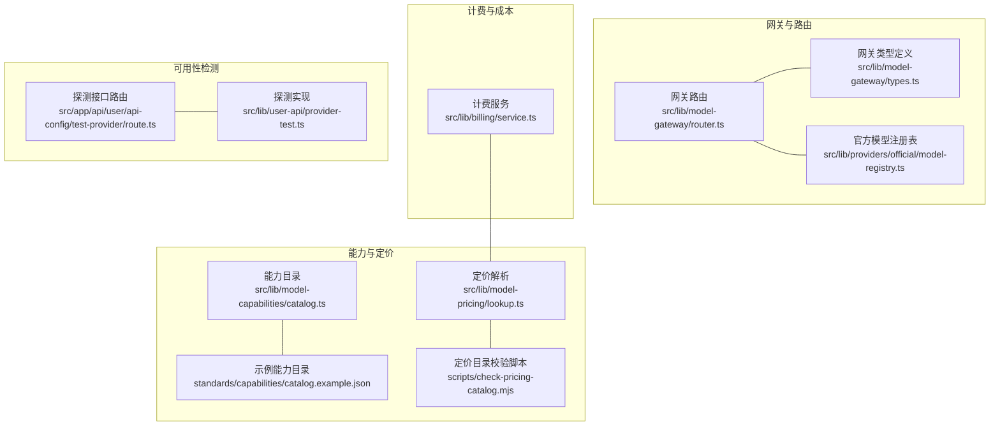
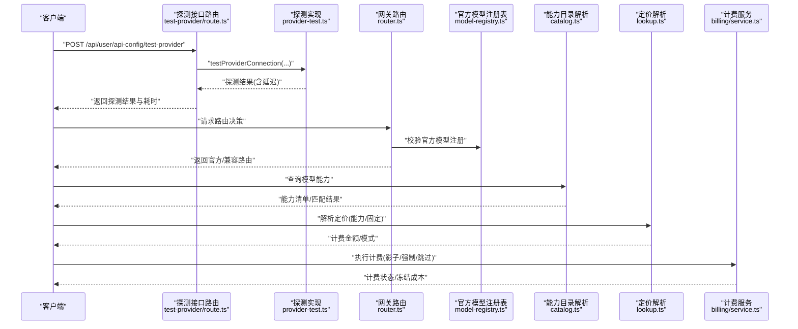
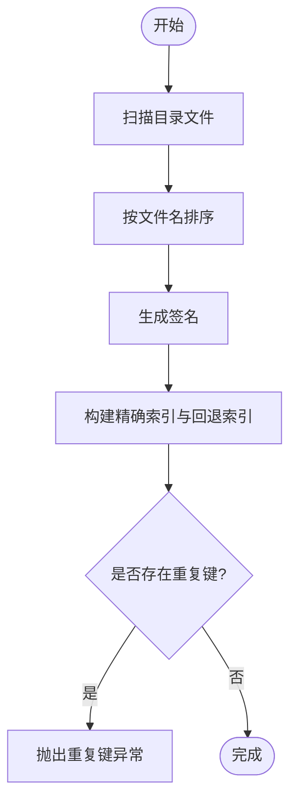
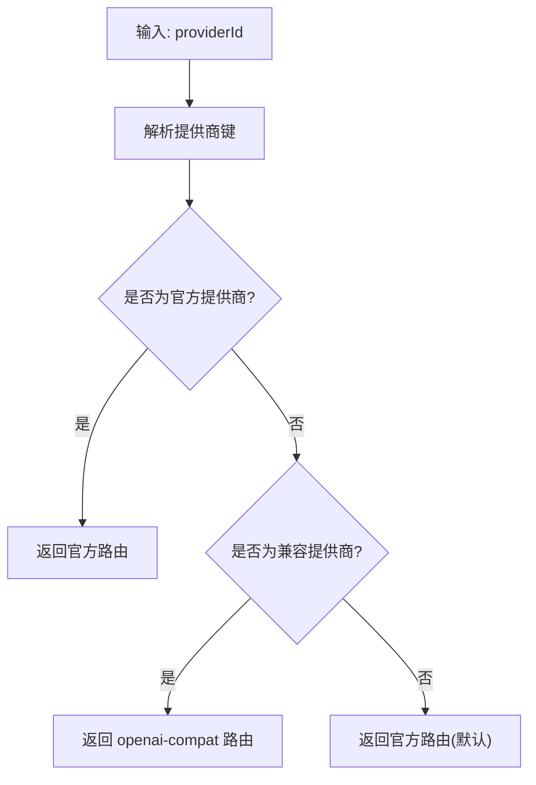
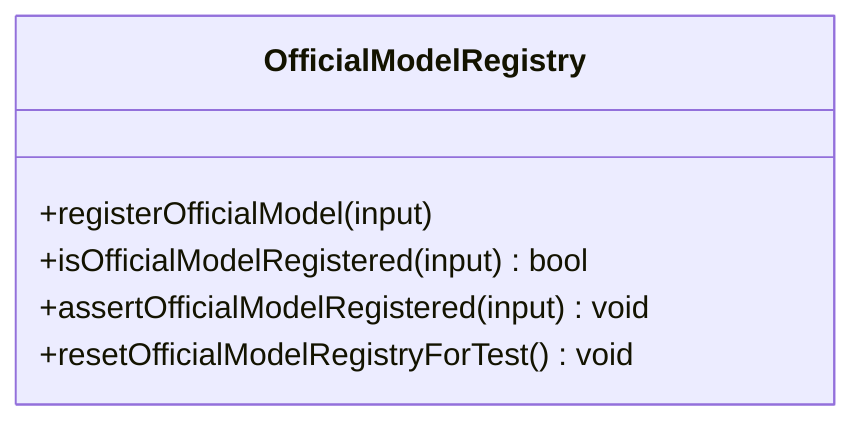
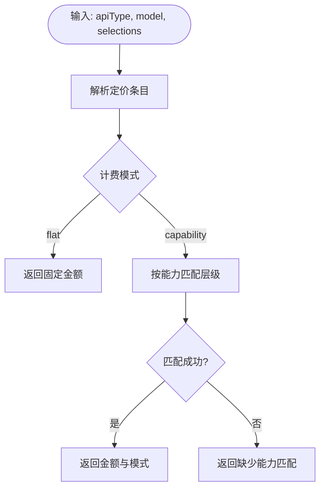
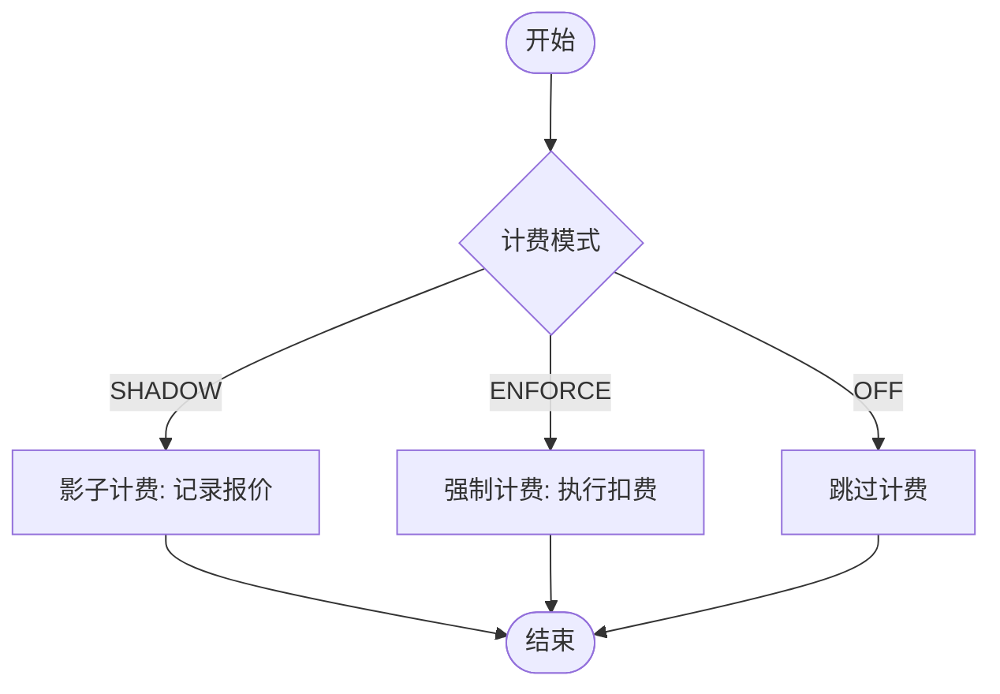
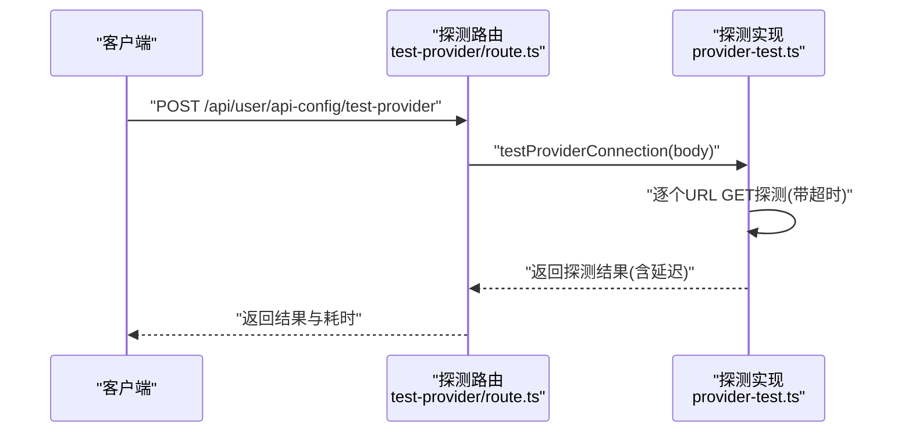
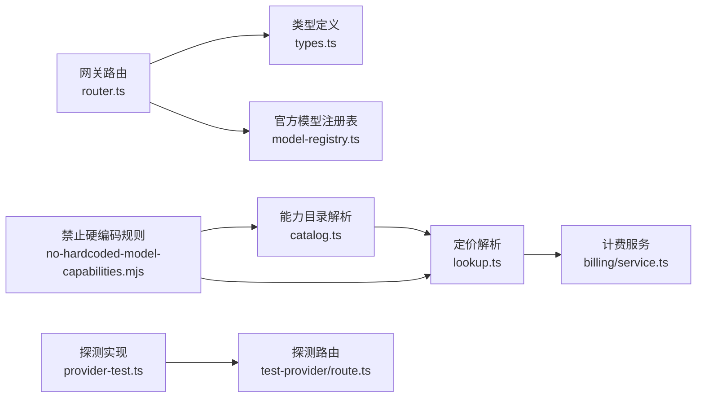

# 模型能力检测

<cite>
**本文引用的文件**
- [src/lib/model-capabilities/catalog.ts](file://src/lib/model-capabilities/catalog.ts)
- [standards/capabilities/catalog.example.json](file://standards/capabilities/catalog.example.json)
- [src/lib/model-gateway/router.ts](file://src/lib/model-gateway/router.ts)
- [src/lib/model-gateway/types.ts](file://src/lib/model-gateway/types.ts)
- [src/lib/providers/official/model-registry.ts](file://src/lib/providers/official/model-registry.ts)
- [src/lib/model-pricing/lookup.ts](file://src/lib/model-pricing/lookup.ts)
- [src/lib/billing/service.ts](file://src/lib/billing/service.ts)
- [scripts/check-pricing-catalog.mjs](file://scripts/check-pricing-catalog.mjs)
- [scripts/guards/no-hardcoded-model-capabilities.mjs](file://scripts/guards/no-hardcoded-model-capabilities.mjs)
- [src/app/api/user/api-config/test-provider/route.ts](file://src/app/api/user/api-config/test-provider/route.ts)
- [src/lib/user-api/provider-test.ts](file://src/lib/user-api/provider-test.ts)
- [tests/unit/model-capabilities/image-resolution-default.test.ts](file://tests/unit/model-capabilities/image-resolution-default.test.ts)
- [tests/unit/model-capabilities/video-effective.test.ts](file://tests/unit/model-capabilities/video-effective.test.ts)
- [tests/unit/model-gateway/router.test.ts](file://tests/unit/model-gateway/router.test.ts)
- [tests/unit/providers/model-registry.test.ts](file://tests/unit/providers/model-registry.test.ts)
- [tests/unit/billing/cost.test.ts](file://tests/unit/billing/cost.test.ts)
- [tests/unit/billing/service.test.ts](file://tests/unit/billing/service.test.ts)
</cite>

## 目录
1. [简介](#简介)
2. [项目结构](#项目结构)
3. [核心组件](#核心组件)
4. [架构总览](#架构总览)
5. [详细组件分析](#详细组件分析)
6. [依赖关系分析](#依赖关系分析)
7. [性能考虑](#性能考虑)
8. [故障排查指南](#故障排查指南)
9. [结论](#结论)
10. [附录](#附录)

## 简介
本技术文档围绕 Waoowaoo 的“模型能力检测系统”展开，系统目标包括：
- 模型能力识别与功能检测：通过标准化的能力目录与内置校验规则，确保模型能力声明与实际行为一致。
- 兼容性验证与路由：基于提供商类型与协议兼容性，自动选择官方或 OpenAI 兼容路径。
- 能力清单管理、动态发现与实时更新：以文件目录扫描与缓存签名机制实现能力目录的动态加载与变更感知。
- 定价策略、成本计算与预算控制：内置定价目录解析、能力匹配与费用上限策略，支持影子计费与强制计费模式。
- 负载均衡与性能监控：通过网关路由与探测接口，结合延迟统计与错误回退，保障请求稳定性与可观测性。
- 可用性检测、健康检查与故障预警：提供统一的探测流程与失败归因，便于快速定位问题并触发告警。
- 自动最优模型选择：结合任务需求、能力匹配与成本策略，实现智能路由与成本控制。
- 扩展与自定义：通过标准目录与规则校验，支持新增提供商与能力项的快速接入。

## 项目结构
模型能力检测相关代码主要分布在以下模块：
- 能力目录与解析：src/lib/model-capabilities/catalog.ts、standards/capabilities/catalog.example.json
- 网关路由与类型：src/lib/model-gateway/router.ts、src/lib/model-gateway/types.ts
- 官方模型注册表：src/lib/providers/official/model-registry.ts
- 定价解析与目录校验：src/lib/model-pricing/lookup.ts、scripts/check-pricing-catalog.mjs
- 计费服务与成本控制：src/lib/billing/service.ts
- 探测与可用性检测：src/app/api/user/api-config/test-provider/route.ts、src/lib/user-api/provider-test.ts
- 规则与约束：scripts/guards/no-hardcoded-model-capabilities.mjs
- 单元测试覆盖：tests/unit 下对应模块的测试文件

图表来源
- [src/lib/model-capabilities/catalog.ts](file://src/lib/model-capabilities/catalog.ts)
- [standards/capabilities/catalog.example.json](file://standards/capabilities/catalog.example.json)
- [src/lib/model-pricing/lookup.ts](file://src/lib/model-pricing/lookup.ts)
- [scripts/check-pricing-catalog.mjs](file://scripts/check-pricing-catalog.mjs)
- [src/lib/model-gateway/router.ts](file://src/lib/model-gateway/router.ts)
- [src/lib/model-gateway/types.ts](file://src/lib/model-gateway/types.ts)
- [src/lib/providers/official/model-registry.ts](file://src/lib/providers/official/model-registry.ts)
- [src/lib/billing/service.ts](file://src/lib/billing/service.ts)
- [src/app/api/user/api-config/test-provider/route.ts](file://src/app/api/user/api-config/test-provider/route.ts)
- [src/lib/user-api/provider-test.ts](file://src/lib/user-api/provider-test.ts)

章节来源
- [src/lib/model-capabilities/catalog.ts](file://src/lib/model-capabilities/catalog.ts)
- [standards/capabilities/catalog.example.json](file://standards/capabilities/catalog.example.json)
- [src/lib/model-gateway/router.ts](file://src/lib/model-gateway/router.ts)
- [src/lib/model-gateway/types.ts](file://src/lib/model-gateway/types.ts)
- [src/lib/providers/official/model-registry.ts](file://src/lib/providers/official/model-registry.ts)
- [src/lib/model-pricing/lookup.ts](file://src/lib/model-pricing/lookup.ts)
- [scripts/check-pricing-catalog.mjs](file://scripts/check-pricing-catalog.mjs)
- [src/lib/billing/service.ts](file://src/lib/billing/service.ts)
- [src/app/api/user/api-config/test-provider/route.ts](file://src/app/api/user/api-config/test-provider/route.ts)
- [src/lib/user-api/provider-test.ts](file://src/lib/user-api/provider-test.ts)

## 核心组件
- 能力目录与解析器
  - 从标准目录读取能力条目，构建精确匹配与按提供商键回退的索引，并通过文件签名实现缓存与变更感知。
  - 示例目录格式参考 standards/capabilities/catalog.example.json，涵盖视频、图像、LLM 等模态的能力字段与本地化标签。
- 网关路由与类型
  - 基于提供商键判断是否为兼容型（如 openai-compatible），并据此选择官方或 OpenAI 兼容路径；官方提供商集合在路由中显式维护。
  - 类型定义明确兼容请求体结构（图像/视频/聊天）与客户端配置。
- 官方模型注册表
  - 维护官方提供商的模型注册集合，提供注册、断言与测试重置能力，避免未注册模型被误用。
- 定价解析与目录校验
  - 解析内置定价目录，支持 flat 与 capability 两种计费模式；当能力选择缺失时返回“缺少能力匹配”的解析结果。
  - 校验脚本对定价目录进行一致性检查，提取能力选项字段并生成报告。
- 计费服务与成本控制
  - 支持报价、最大冻结成本与影子计费/强制计费模式；未知模型时可按策略降级处理。
- 探测与可用性检测
  - 提供统一的探测接口与实现，支持多地址轮询、超时控制与延迟统计，输出探测步骤与尝试详情。

章节来源
- [src/lib/model-capabilities/catalog.ts](file://src/lib/model-capabilities/catalog.ts)
- [standards/capabilities/catalog.example.json](file://standards/capabilities/catalog.example.json)
- [src/lib/model-gateway/router.ts](file://src/lib/model-gateway/router.ts)
- [src/lib/model-gateway/types.ts](file://src/lib/model-gateway/types.ts)
- [src/lib/providers/official/model-registry.ts](file://src/lib/providers/official/model-registry.ts)
- [src/lib/model-pricing/lookup.ts](file://src/lib/model-pricing/lookup.ts)
- [scripts/check-pricing-catalog.mjs](file://scripts/check-pricing-catalog.mjs)
- [src/lib/billing/service.ts](file://src/lib/billing/service.ts)
- [src/app/api/user/api-config/test-provider/route.ts](file://src/app/api/user/api-config/test-provider/route.ts)
- [src/lib/user-api/provider-test.ts](file://src/lib/user-api/provider-test.ts)

## 架构总览
下图展示了从任务需求到模型选择、能力匹配、定价解析与计费执行的整体流程。

图表来源
- [src/app/api/user/api-config/test-provider/route.ts](file://src/app/api/user/api-config/test-provider/route.ts)
- [src/lib/user-api/provider-test.ts](file://src/lib/user-api/provider-test.ts)
- [src/lib/model-gateway/router.ts](file://src/lib/model-gateway/router.ts)
- [src/lib/providers/official/model-registry.ts](file://src/lib/providers/official/model-registry.ts)
- [src/lib/model-capabilities/catalog.ts](file://src/lib/model-capabilities/catalog.ts)
- [src/lib/model-pricing/lookup.ts](file://src/lib/model-pricing/lookup.ts)
- [src/lib/billing/service.ts](file://src/lib/billing/service.ts)

## 详细组件分析

### 能力目录与动态发现
- 文件扫描与签名
  - 动态扫描标准目录下的 JSON 文件，按文件名排序生成签名，用于缓存失效与变更感知。
- 缓存索引
  - 构建精确匹配键与按提供商键回退的索引，避免重复与提升查找效率。
- 错误与重复检测
  - 对重复键抛出异常，保证目录一致性。

图表来源
- [src/lib/model-capabilities/catalog.ts](file://src/lib/model-capabilities/catalog.ts)

章节来源
- [src/lib/model-capabilities/catalog.ts](file://src/lib/model-capabilities/catalog.ts)
- [standards/capabilities/catalog.example.json](file://standards/capabilities/catalog.example.json)

### 网关路由与负载均衡
- 路由决策
  - 官方提供商集合直接返回官方路径；兼容型提供商返回 OpenAI 兼容路径；其他默认官方路径。
- 类型与请求体
  - 明确定义兼容请求体（图像/视频/聊天）与客户端配置，便于统一处理与扩展。

图表来源
- [src/lib/model-gateway/router.ts](file://src/lib/model-gateway/router.ts)
- [src/lib/model-gateway/types.ts](file://src/lib/model-gateway/types.ts)

章节来源
- [src/lib/model-gateway/router.ts](file://src/lib/model-gateway/router.ts)
- [src/lib/model-gateway/types.ts](file://src/lib/model-gateway/types.ts)

### 官方模型注册表与断言
- 注册与断言
  - 提供注册、断言与测试重置能力，确保仅使用已登记的官方模型，防止未授权调用。
- 错误处理
  - 未注册模型抛出明确错误信息，便于定位与修复。

图表来源
- [src/lib/providers/official/model-registry.ts](file://src/lib/providers/official/model-registry.ts)

章节来源
- [src/lib/providers/official/model-registry.ts](file://src/lib/providers/official/model-registry.ts)

### 定价解析与目录校验
- 解析策略
  - 支持固定金额与按能力分层两种模式；当能力选择不满足时返回“缺少能力匹配”，便于前端引导用户完善选择。
- 目录校验
  - 校验脚本读取定价目录，提取能力选项字段并生成报告，确保目录结构与语义正确。

图表来源
- [src/lib/model-pricing/lookup.ts](file://src/lib/model-pricing/lookup.ts)
- [scripts/check-pricing-catalog.mjs](file://scripts/check-pricing-catalog.mjs)

章节来源
- [src/lib/model-pricing/lookup.ts](file://src/lib/model-pricing/lookup.ts)
- [scripts/check-pricing-catalog.mjs](file://scripts/check-pricing-catalog.mjs)

### 计费服务与预算控制
- 成本计算
  - 支持报价、最大冻结成本与影子计费/强制计费模式；未知模型时按策略降级处理。
- 预算控制
  - 通过最大成本与冻结成本实现预算上限控制，避免超支。

图表来源
- [src/lib/billing/service.ts](file://src/lib/billing/service.ts)

章节来源
- [src/lib/billing/service.ts](file://src/lib/billing/service.ts)

### 可用性检测与健康检查
- 探测流程
  - 多地址轮询、超时控制、延迟统计与尝试详情记录，支持“models/credits”两类探测步骤。
- 接口集成
  - 探测接口路由聚合探测结果并返回延迟指标，便于前端展示与监控。

图表来源
- [src/app/api/user/api-config/test-provider/route.ts](file://src/app/api/user/api-config/test-provider/route.ts)
- [src/lib/user-api/provider-test.ts](file://src/lib/user-api/provider-test.ts)

章节来源
- [src/app/api/user/api-config/test-provider/route.ts](file://src/app/api/user/api-config/test-provider/route.ts)
- [src/lib/user-api/provider-test.ts](file://src/lib/user-api/provider-test.ts)

### 能力路由算法与自动选择
- 能力匹配
  - 结合任务需求与能力目录，优先选择满足条件的模型；若能力选择缺失，返回“缺少能力匹配”提示用户完善。
- 路由选择
  - 在满足能力前提下，依据提供商类型与协议兼容性选择官方或兼容路径，确保稳定与性能。

章节来源
- [src/lib/model-capabilities/catalog.ts](file://src/lib/model-capabilities/catalog.ts)
- [src/lib/model-gateway/router.ts](file://src/lib/model-gateway/router.ts)

### 能力扩展与自定义检测
- 扩展能力
  - 新增提供商与能力项时，遵循标准目录格式并在目录校验脚本通过后上线。
- 自定义检测
  - 探测接口支持自定义 URL 列表与步骤名称，便于对接第三方服务。

章节来源
- [standards/capabilities/catalog.example.json](file://standards/capabilities/catalog.example.json)
- [scripts/check-pricing-catalog.mjs](file://scripts/check-pricing-catalog.mjs)
- [src/lib/user-api/provider-test.ts](file://src/lib/user-api/provider-test.ts)

## 依赖关系分析
- 组件耦合
  - 能力目录解析器与定价解析器相互独立但共同服务于模型选择；网关路由依赖官方模型注册表与提供商键；计费服务依赖定价解析与任务信息。
- 外部依赖
  - 探测实现依赖网络请求与超时控制；计费服务依赖用户自定义定价与任务元数据。
- 规则约束
  - 禁止硬编码模型能力常量，确保所有能力来源于目录与解析器，避免配置漂移。

图表来源
- [src/lib/model-capabilities/catalog.ts](file://src/lib/model-capabilities/catalog.ts)
- [src/lib/model-pricing/lookup.ts](file://src/lib/model-pricing/lookup.ts)
- [src/lib/model-gateway/router.ts](file://src/lib/model-gateway/router.ts)
- [src/lib/model-gateway/types.ts](file://src/lib/model-gateway/types.ts)
- [src/lib/providers/official/model-registry.ts](file://src/lib/providers/official/model-registry.ts)
- [src/lib/billing/service.ts](file://src/lib/billing/service.ts)
- [src/lib/user-api/provider-test.ts](file://src/lib/user-api/provider-test.ts)
- [src/app/api/user/api-config/test-provider/route.ts](file://src/app/api/user/api-config/test-provider/route.ts)
- [scripts/guards/no-hardcoded-model-capabilities.mjs](file://scripts/guards/no-hardcoded-model-capabilities.mjs)

章节来源
- [src/lib/model-capabilities/catalog.ts](file://src/lib/model-capabilities/catalog.ts)
- [src/lib/model-pricing/lookup.ts](file://src/lib/model-pricing/lookup.ts)
- [src/lib/model-gateway/router.ts](file://src/lib/model-gateway/router.ts)
- [src/lib/model-gateway/types.ts](file://src/lib/model-gateway/types.ts)
- [src/lib/providers/official/model-registry.ts](file://src/lib/providers/official/model-registry.ts)
- [src/lib/billing/service.ts](file://src/lib/billing/service.ts)
- [src/lib/user-api/provider-test.ts](file://src/lib/user-api/provider-test.ts)
- [src/app/api/user/api-config/test-provider/route.ts](file://src/app/api/user/api-config/test-provider/route.ts)
- [scripts/guards/no-hardcoded-model-capabilities.mjs](file://scripts/guards/no-hardcoded-model-capabilities.mjs)

## 性能考虑
- 能力目录缓存
  - 通过文件签名与索引缓存减少重复解析开销，目录变更时自动失效重建。
- 探测延迟统计
  - 探测接口返回延迟指标，便于前端展示与性能监控；多地址轮询降低单点故障影响。
- 计费模式选择
  - 影子计费用于预估成本，强制计费用于真实扣费；OFF 模式用于关闭计费，适合测试环境。
- 负载均衡
  - 网关路由根据提供商类型与协议兼容性选择最优路径，兼顾稳定性与性能。

## 故障排查指南
- 能力目录重复键
  - 若出现重复键异常，检查目录文件与模型键组合，确保唯一性。
- 定价解析失败
  - 当返回“缺少能力匹配”时，确认任务选择的能力项是否完整；当返回“未配置”时，检查定价目录是否存在对应条目。
- 探测失败
  - 查看探测步骤与尝试详情，确认 URL 可达性、鉴权头与超时设置；关注延迟与状态码。
- 官方模型未注册
  - 使用断言函数检查模型是否已注册，避免未授权调用导致的错误。
- 计费异常
  - 检查计费模式与最大冻结成本设置；未知模型时按策略降级处理，必要时调整策略或补充配置。

章节来源
- [src/lib/model-capabilities/catalog.ts](file://src/lib/model-capabilities/catalog.ts)
- [src/lib/model-pricing/lookup.ts](file://src/lib/model-pricing/lookup.ts)
- [src/lib/user-api/provider-test.ts](file://src/lib/user-api/provider-test.ts)
- [src/lib/providers/official/model-registry.ts](file://src/lib/providers/official/model-registry.ts)
- [src/lib/billing/service.ts](file://src/lib/billing/service.ts)

## 结论
Waoowaoo 的模型能力检测系统通过标准化的能力目录、严格的定价解析与计费策略、可靠的网关路由与探测机制，实现了从能力识别、功能检测到成本控制与健康监控的全链路闭环。系统具备良好的扩展性与自定义能力，能够随着新提供商与能力项的加入持续演进，同时通过规则约束与目录校验确保配置的一致性与可维护性。

## 附录
- 测试覆盖
  - 能力目录与定价解析：单元测试覆盖了默认分辨率、视频有效性、路由选择与模型注册等场景。
  - 计费服务：单元测试覆盖成本计算、模式切换与运行时用量等场景。
  - 探测接口：单元测试覆盖兼容探测与连接测试等场景。

章节来源
- [tests/unit/model-capabilities/image-resolution-default.test.ts](file://tests/unit/model-capabilities/image-resolution-default.test.ts)
- [tests/unit/model-capabilities/video-effective.test.ts](file://tests/unit/model-capabilities/video-effective.test.ts)
- [tests/unit/model-gateway/router.test.ts](file://tests/unit/model-gateway/router.test.ts)
- [tests/unit/providers/model-registry.test.ts](file://tests/unit/providers/model-registry.test.ts)
- [tests/unit/billing/cost.test.ts](file://tests/unit/billing/cost.test.ts)
- [tests/unit/billing/service.test.ts](file://tests/unit/billing/service.test.ts)