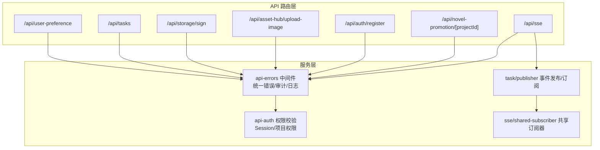
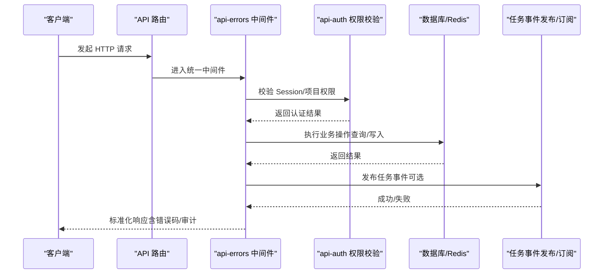
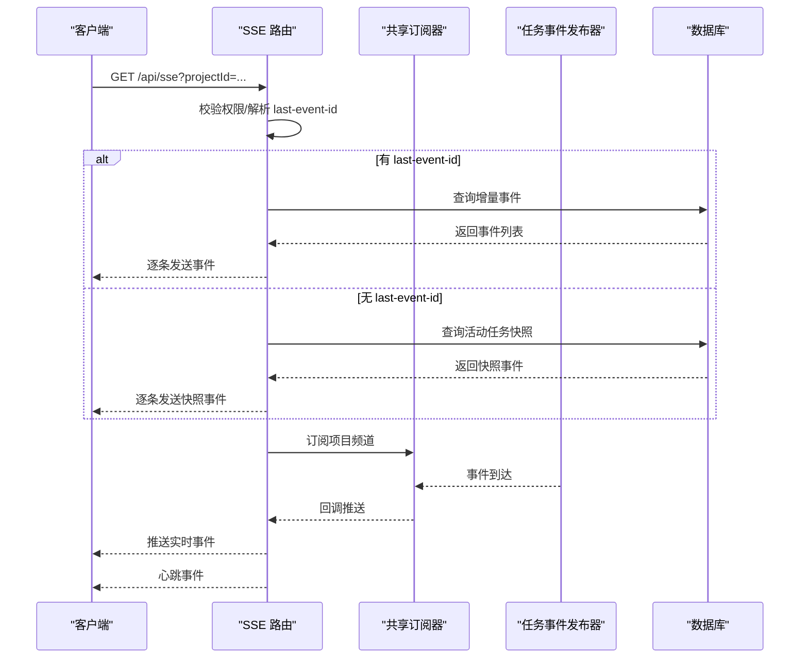
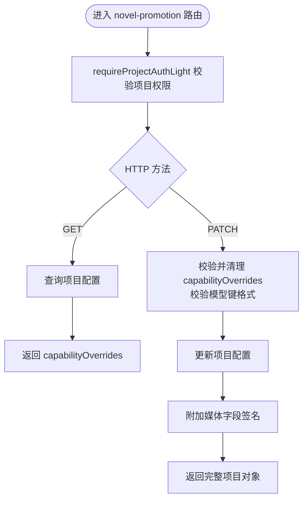
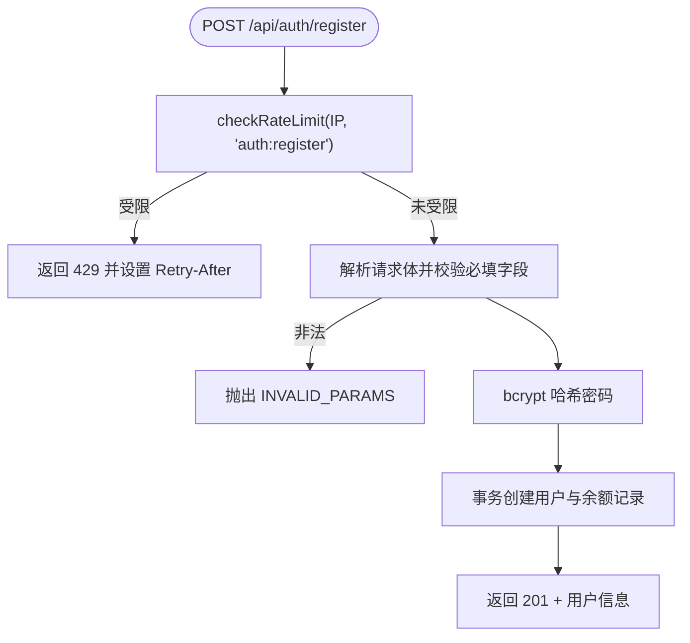
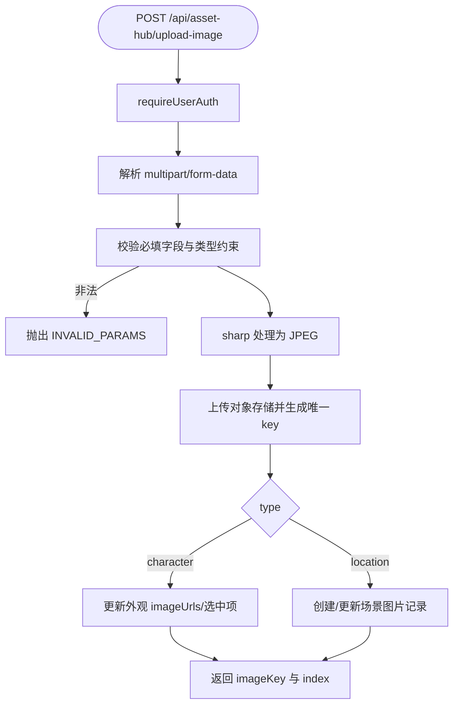
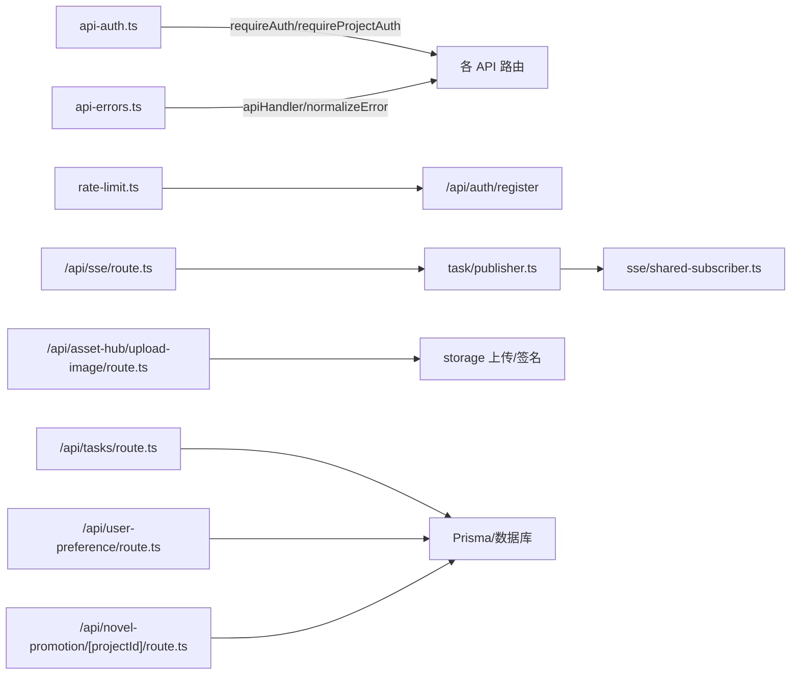

# API参考文档

<cite>
**本文档引用的文件**
- [src/lib/api-auth.ts](file://src/lib/api-auth.ts)
- [src/lib/api-errors.ts](file://src/lib/api-errors.ts)
- [src/lib/rate-limit.ts](file://src/lib/rate-limit.ts)
- [src/app/api/sse/route.ts](file://src/app/api/sse/route.ts)
- [src/app/api/novel-promotion/[projectId]/route.ts](file://src/app/api/novel-promotion/[projectId]/route.ts)
- [src/app/api/auth/register/route.ts](file://src/app/api/auth/register/route.ts)
- [src/app/api/asset-hub/upload-image/route.ts](file://src/app/api/asset-hub/upload-image/route.ts)
- [src/app/api/storage/sign/route.ts](file://src/app/api/storage/sign/route.ts)
- [src/app/api/tasks/route.ts](file://src/app/api/tasks/route.ts)
- [src/app/api/user-preference/route.ts](file://src/app/api/user-preference/route.ts)
- [src/lib/sse/shared-subscriber.ts](file://src/lib/sse/shared-subscriber.ts)
- [src/lib/task/publisher.ts](file://src/lib/task/publisher.ts)
</cite>

## 目录
1. [简介](#简介)
2. [项目结构](#项目结构)
3. [核心组件](#核心组件)
4. [架构总览](#架构总览)
5. [详细组件分析](#详细组件分析)
6. [依赖关系分析](#依赖关系分析)
7. [性能与速率限制](#性能与速率限制)
8. [故障排除指南](#故障排除指南)
9. [结论](#结论)
10. [附录](#附录)

## 简介
本文件为 Waoowaoo 的 API 接口参考文档，覆盖以下内容：
- RESTful API 端点清单与规范（HTTP 方法、URL 模式、请求/响应结构、认证方式）
- Server-Sent Events (SSE) 实时流接口的连接、事件格式与交互模式
- 文件上传接口的数据帧格式、二进制传输与状态管理
- 认证与授权（NextAuth 集成、会话管理、令牌刷新、安全策略）
- 错误码体系、状态码含义与错误处理策略
- API 版本控制、向后兼容性与迁移指南
- 速率限制、请求频率与性能优化建议
- 客户端集成示例与最佳实践

## 项目结构
Waoowaoo 使用 Next.js App Router，API 路由集中位于 src/app/api 下，采用“按功能域”组织的目录结构。核心模块包括：
- 认证与授权：统一的会话验证、项目权限校验与错误响应构建
- SSE 实时事件：基于 Redis 的共享订阅器与事件发布/订阅
- 任务系统：任务查询、生命周期事件与运行事件镜像
- 存储与签名：对象存储签名直链生成
- 业务域 API：资产库、项目配置、用户偏好、鉴权注册等

**图表来源**
- [src/app/api/sse/route.ts:92-206](file://src/app/api/sse/route.ts#L92-L206)
- [src/app/api/novel-promotion/[projectId]/route.ts](file://src/app/api/novel-promotion/[projectId]/route.ts#L225-L345)
- [src/app/api/auth/register/route.ts:8-87](file://src/app/api/auth/register/route.ts#L8-L87)
- [src/app/api/asset-hub/upload-image/route.ts:46-189](file://src/app/api/asset-hub/upload-image/route.ts#L46-L189)
- [src/app/api/storage/sign/route.ts:7-21](file://src/app/api/storage/sign/route.ts#L7-L21)
- [src/app/api/tasks/route.ts:16-42](file://src/app/api/tasks/route.ts#L16-L42)
- [src/app/api/user-preference/route.ts:27-93](file://src/app/api/user-preference/route.ts#L27-L93)
- [src/lib/api-errors.ts:440-562](file://src/lib/api-errors.ts#L440-L562)
- [src/lib/api-auth.ts:173-313](file://src/lib/api-auth.ts#L173-L313)
- [src/lib/task/publisher.ts:224-357](file://src/lib/task/publisher.ts#L224-L357)
- [src/lib/sse/shared-subscriber.ts:7-81](file://src/lib/sse/shared-subscriber.ts#L7-L81)

**章节来源**
- [src/app/api/sse/route.ts:92-206](file://src/app/api/sse/route.ts#L92-L206)
- [src/app/api/novel-promotion/[projectId]/route.ts](file://src/app/api/novel-promotion/[projectId]/route.ts#L225-L345)
- [src/app/api/auth/register/route.ts:8-87](file://src/app/api/auth/register/route.ts#L8-L87)
- [src/app/api/asset-hub/upload-image/route.ts:46-189](file://src/app/api/asset-hub/upload-image/route.ts#L46-L189)
- [src/app/api/storage/sign/route.ts:7-21](file://src/app/api/storage/sign/route.ts#L7-L21)
- [src/app/api/tasks/route.ts:16-42](file://src/app/api/tasks/route.ts#L16-L42)
- [src/app/api/user-preference/route.ts:27-93](file://src/app/api/user-preference/route.ts#L27-L93)
- [src/lib/api-errors.ts:440-562](file://src/lib/api-errors.ts#L440-L562)
- [src/lib/api-auth.ts:173-313](file://src/lib/api-auth.ts#L173-L313)
- [src/lib/task/publisher.ts:224-357](file://src/lib/task/publisher.ts#L224-L357)
- [src/lib/sse/shared-subscriber.ts:7-81](file://src/lib/sse/shared-subscriber.ts#L7-L81)

## 核心组件
- 统一错误处理与审计中间件：封装请求生命周期、日志、审计、错误标准化与响应格式化
- 权限校验工具：统一的 Session 校验、项目权限校验、资源存在性与所有权校验
- 速率限制：基于 Redis 的滑动窗口实现，支持不同动作维度的限流
- SSE 实时事件：基于 Redis 的共享订阅器，支持事件重放、心跳与生命周期事件
- 任务事件发布：生命周期事件与流式事件的持久化与发布，支持运行事件镜像

**章节来源**
- [src/lib/api-errors.ts:440-562](file://src/lib/api-errors.ts#L440-L562)
- [src/lib/api-auth.ts:173-313](file://src/lib/api-auth.ts#L173-L313)
- [src/lib/rate-limit.ts:58-145](file://src/lib/rate-limit.ts#L58-L145)
- [src/lib/sse/shared-subscriber.ts:7-81](file://src/lib/sse/shared-subscriber.ts#L7-L81)
- [src/lib/task/publisher.ts:224-357](file://src/lib/task/publisher.ts#L224-L357)

## 架构总览
下图展示了 API 请求在系统中的流转路径，以及与认证、事件系统、存储与任务系统的交互。

**图表来源**
- [src/lib/api-errors.ts:440-562](file://src/lib/api-errors.ts#L440-L562)
- [src/lib/api-auth.ts:173-313](file://src/lib/api-auth.ts#L173-L313)
- [src/lib/task/publisher.ts:239-357](file://src/lib/task/publisher.ts#L239-L357)

## 详细组件分析

### SSE 实时事件接口
- 端点：GET /api/sse
- 功能：建立与项目相关的 Server-Sent Events 流，支持事件重放与心跳
- 认证：需要项目权限或全局资产库的用户权限
- 查询参数：
  - projectId：必需，目标项目 ID；特殊值 global-asset-hub 表示全局资产库
  - episodeId：可选，剧集 ID
- 请求头：
  - last-event-id：可选，上次事件 ID，用于重放
- 响应：
  - Content-Type: text/event-stream; charset=utf-8
  - 支持事件类型：heartbeat、LIFECYCLE、STREAM
  - 心跳间隔：约 15 秒
- 事件格式（SSEEvent）：
  - id：事件 ID（数字字符串）
  - type：事件类型（heartbeat/LIFECYCLE/STREAM）
  - taskId/projectId/userId/ts/taskType/targetType/targetId/episodeId/payload
- 重放机制：根据 last-event-id 从数据库拉取增量事件

**图表来源**
- [src/app/api/sse/route.ts:92-206](file://src/app/api/sse/route.ts#L92-L206)
- [src/lib/sse/shared-subscriber.ts:7-81](file://src/lib/sse/shared-subscriber.ts#L7-L81)
- [src/lib/task/publisher.ts:224-357](file://src/lib/task/publisher.ts#L224-L357)

**章节来源**
- [src/app/api/sse/route.ts:92-206](file://src/app/api/sse/route.ts#L92-L206)
- [src/lib/sse/shared-subscriber.ts:7-81](file://src/lib/sse/shared-subscriber.ts#L7-L81)
- [src/lib/task/publisher.ts:224-357](file://src/lib/task/publisher.ts#L224-L357)

### 小说推广项目配置接口
- 端点：GET /api/novel-promotion/[projectId]
- 功能：获取项目配置（模型键、艺术风格、能力覆盖等）
- 端点：PATCH /api/novel-promotion/[projectId]
- 功能：更新项目配置（模型键、视频比例、艺术风格、能力覆盖等）
- 认证：requireProjectAuthLight（项目存在且归属当前用户）
- 请求体字段（PATCH）：
  - analysisModel/characterModel/locationModel/storyboardModel/editModel/videoModel/audioModel：严格模型键格式
  - videoRatio/artStyle/ttsRate/lipSyncEnabled/lipSyncMode/capabilityOverrides：受控字段
- 响应：
  - GET：返回 capabilityOverrides 清理后的结果
  - PATCH：返回包含媒体字段签名的完整项目对象

**图表来源**
- [src/app/api/novel-promotion/[projectId]/route.ts](file://src/app/api/novel-promotion/[projectId]/route.ts#L225-L345)

**章节来源**
- [src/app/api/novel-promotion/[projectId]/route.ts](file://src/app/api/novel-promotion/[projectId]/route.ts#L225-L345)

### 用户注册接口
- 端点：POST /api/auth/register
- 功能：手机号/用户名注册，密码哈希存储，初始化余额记录
- 认证：无需登录
- 速率限制：IP 级别，60 秒内最多 3 次
- 请求体字段：
  - name/password：必填，密码长度至少 6
- 响应：
  - 成功：201，返回用户基本信息
  - 失败：400/429，返回错误码与提示

**图表来源**
- [src/app/api/auth/register/route.ts:8-87](file://src/app/api/auth/register/route.ts#L8-L87)
- [src/lib/rate-limit.ts:58-145](file://src/lib/rate-limit.ts#L58-L145)

**章节来源**
- [src/app/api/auth/register/route.ts:8-87](file://src/app/api/auth/register/route.ts#L8-L87)
- [src/lib/rate-limit.ts:58-145](file://src/lib/rate-limit.ts#L58-L145)

### 全局资产库图片上传接口
- 端点：POST /api/asset-hub/upload-image
- 功能：上传图片作为角色外观或场景资产，并维护历史版本与选中索引
- 认证：requireUserAuth（用户级 API）
- 请求体（multipart/form-data）：
  - file：必填，二进制图片
  - type：必填，字符(character)/场景(location)
  - id：必填，角色或场景 ID
  - appearanceIndex：可选，角色外观索引（type=character）
  - imageIndex：可选，场景图片索引（type=location）
  - labelText：可选，场景图片描述（type=location）
- 响应：
  - 返回 imageKey 与 imageIndex
  - 二进制处理：JPEG，质量 90，启用 mozjpeg

**图表来源**
- [src/app/api/asset-hub/upload-image/route.ts:46-189](file://src/app/api/asset-hub/upload-image/route.ts#L46-L189)

**章节来源**
- [src/app/api/asset-hub/upload-image/route.ts:46-189](file://src/app/api/asset-hub/upload-image/route.ts#L46-L189)

### 存储签名直链接口
- 端点：GET /api/storage/sign
- 功能：生成对象存储的带签名临时 URL
- 查询参数：
  - key：必填，对象键
  - expires：可选，过期秒数，默认 3600
- 响应：302 重定向至带签名的 URL

**章节来源**
- [src/app/api/storage/sign/route.ts:7-21](file://src/app/api/storage/sign/route.ts#L7-L21)

### 任务查询接口
- 端点：GET /api/tasks
- 功能：查询当前用户的任务列表，支持多条件过滤与分页
- 认证：requireUserAuth
- 查询参数：
  - projectId/targetType/targetId：可选
  - status/type：可多选
  - limit：默认 50，范围 1..200
- 响应：返回任务数组（含标准化错误信息）

**章节来源**
- [src/app/api/tasks/route.ts:16-42](file://src/app/api/tasks/route.ts#L16-L42)

### 用户偏好接口
- 端点：GET /api/user-preference
- 功能：获取或创建用户偏好配置
- 端点：PATCH /api/user-preference
- 功能：更新用户偏好配置（受控字段）
- 认证：requireUserAuth
- 可更新字段（PATCH）：analysisModel 到 audioModel、lipSyncModel、videoRatio、artStyle、ttsRate
- 响应：返回更新后的偏好对象

**章节来源**
- [src/app/api/user-preference/route.ts:27-93](file://src/app/api/user-preference/route.ts#L27-L93)

## 依赖关系分析

**图表来源**
- [src/lib/api-auth.ts:173-313](file://src/lib/api-auth.ts#L173-L313)
- [src/lib/api-errors.ts:440-562](file://src/lib/api-errors.ts#L440-L562)
- [src/lib/rate-limit.ts:58-145](file://src/lib/rate-limit.ts#L58-L145)
- [src/app/api/sse/route.ts:92-206](file://src/app/api/sse/route.ts#L92-L206)
- [src/lib/task/publisher.ts:224-357](file://src/lib/task/publisher.ts#L224-L357)
- [src/lib/sse/shared-subscriber.ts:7-81](file://src/lib/sse/shared-subscriber.ts#L7-L81)
- [src/app/api/asset-hub/upload-image/route.ts:46-189](file://src/app/api/asset-hub/upload-image/route.ts#L46-L189)
- [src/app/api/tasks/route.ts:16-42](file://src/app/api/tasks/route.ts#L16-L42)
- [src/app/api/user-preference/route.ts:27-93](file://src/app/api/user-preference/route.ts#L27-L93)
- [src/app/api/novel-promotion/[projectId]/route.ts](file://src/app/api/novel-promotion/[projectId]/route.ts#L225-L345)

**章节来源**
- [src/lib/api-auth.ts:173-313](file://src/lib/api-auth.ts#L173-L313)
- [src/lib/api-errors.ts:440-562](file://src/lib/api-errors.ts#L440-L562)
- [src/lib/rate-limit.ts:58-145](file://src/lib/rate-limit.ts#L58-L145)
- [src/app/api/sse/route.ts:92-206](file://src/app/api/sse/route.ts#L92-L206)
- [src/lib/task/publisher.ts:224-357](file://src/lib/task/publisher.ts#L224-L357)
- [src/lib/sse/shared-subscriber.ts:7-81](file://src/lib/sse/shared-subscriber.ts#L7-L81)
- [src/app/api/asset-hub/upload-image/route.ts:46-189](file://src/app/api/asset-hub/upload-image/route.ts#L46-L189)
- [src/app/api/tasks/route.ts:16-42](file://src/app/api/tasks/route.ts#L16-L42)
- [src/app/api/user-preference/route.ts:27-93](file://src/app/api/user-preference/route.ts#L27-L93)
- [src/app/api/novel-promotion/[projectId]/route.ts](file://src/app/api/novel-promotion/[projectId]/route.ts#L225-L345)

## 性能与速率限制
- 速率限制
  - 登录：60 秒内最多 5 次
  - 注册：60 秒内最多 3 次
  - 实现：基于 Redis 的 Lua 滑动窗口，原子清理过期条目与计数
  - 异常回退：Redis 不可用时放行，避免阻塞
- SSE 心跳：每 15 秒发送一次 heartbeat 事件，保持连接活跃
- 任务事件重放：支持按事件 ID 重放，限制最大扫描行数与返回条数
- 图片上传：JPEG 压缩（质量 90，mozjpeg），减少带宽与存储占用

**章节来源**
- [src/lib/rate-limit.ts:58-145](file://src/lib/rate-limit.ts#L58-L145)
- [src/app/api/sse/route.ts:27-29](file://src/app/api/sse/route.ts#L27-L29)
- [src/lib/task/publisher.ts:359-390](file://src/lib/task/publisher.ts#L359-L390)
- [src/app/api/asset-hub/upload-image/route.ts:71-73](file://src/app/api/asset-hub/upload-image/route.ts#L71-L73)

## 故障排除指南
- 常见错误码与含义
  - UNAUTHORIZED/FORBIDDEN/NOT_FOUND：认证/授权/资源不存在
  - INVALID_PARAMS：请求参数无效（如模型键格式、艺术风格值）
  - RATE_LIMIT：请求过于频繁
  - INTERNAL_ERROR：内部服务器错误
  - EXTERNAL_ERROR/NETWORK_ERROR：外部服务异常
- 错误响应结构
  - success=false
  - error: { code, message, retryable, category, userMessageKey, details }
  - 兼容字段：code/message/...details
  - 响应头：x-request-id
- 日志与审计
  - 统一日志上下文（requestId、projectId、taskId）
  - 审计日志：对特定生成类操作进行审计记录
- SSE 连接问题
  - 检查 last-event-id 是否为正整数
  - 确认项目权限与频道订阅状态
  - 关注 Redis 订阅器错误回调

**章节来源**
- [src/lib/api-errors.ts:372-438](file://src/lib/api-errors.ts#L372-L438)
- [src/lib/api-errors.ts:440-562](file://src/lib/api-errors.ts#L440-L562)
- [src/app/api/sse/route.ts:11-25](file://src/app/api/sse/route.ts#L11-L25)

## 结论
本参考文档系统性梳理了 Waoowaoo 的 API 接口与实时事件机制，提供了统一的认证、错误处理与审计框架。通过 SSE 实时事件与任务事件发布/订阅，实现了高效的异步工作流与前端交互体验。建议在生产环境中结合速率限制、缓存与监控，持续优化性能与稳定性。

## 附录

### API 端点一览（摘要）
- SSE 实时事件
  - 方法：GET
  - 路径：/api/sse
  - 参数：projectId（必需）、episodeId（可选）、last-event-id（可选）
  - 响应：text/event-stream
- 小说推广项目配置
  - 方法：GET/PATCH
  - 路径：/api/novel-promotion/[projectId]
  - 认证：项目权限
  - PATCH 字段：模型键、视频比例、艺术风格、能力覆盖等
- 用户注册
  - 方法：POST
  - 路径：/api/auth/register
  - 速率限制：IP 级别
- 全局资产库图片上传
  - 方法：POST
  - 路径：/api/asset-hub/upload-image
  - 认证：用户级
  - 上传格式：JPEG（质量 90，mozjpeg）
- 存储签名直链
  - 方法：GET
  - 路径：/api/storage/sign
  - 参数：key（必需）、expires（可选）
- 任务查询
  - 方法：GET
  - 路径：/api/tasks
  - 认证：用户级
  - 参数：projectId/targetType/targetId/status/type/limit
- 用户偏好
  - 方法：GET/PATCH
  - 路径：/api/user-preference
  - 认证：用户级
  - PATCH 字段：受控模型与风格参数

**章节来源**
- [src/app/api/sse/route.ts:92-206](file://src/app/api/sse/route.ts#L92-L206)
- [src/app/api/novel-promotion/[projectId]/route.ts](file://src/app/api/novel-promotion/[projectId]/route.ts#L225-L345)
- [src/app/api/auth/register/route.ts:8-87](file://src/app/api/auth/register/route.ts#L8-L87)
- [src/app/api/asset-hub/upload-image/route.ts:46-189](file://src/app/api/asset-hub/upload-image/route.ts#L46-L189)
- [src/app/api/storage/sign/route.ts:7-21](file://src/app/api/storage/sign/route.ts#L7-L21)
- [src/app/api/tasks/route.ts:16-42](file://src/app/api/tasks/route.ts#L16-L42)
- [src/app/api/user-preference/route.ts:27-93](file://src/app/api/user-preference/route.ts#L27-L93)