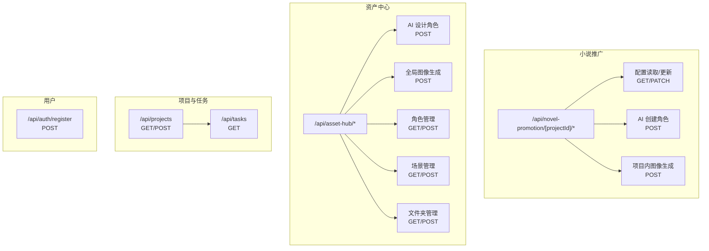
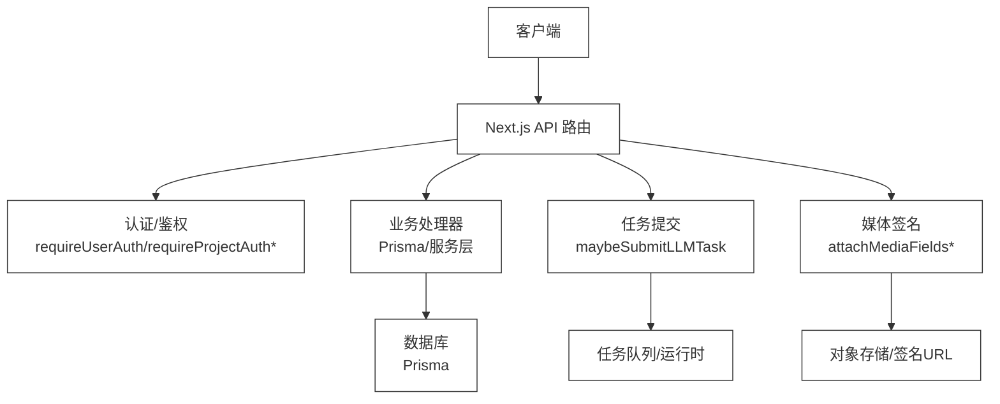
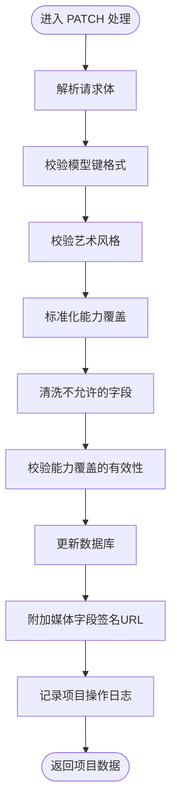
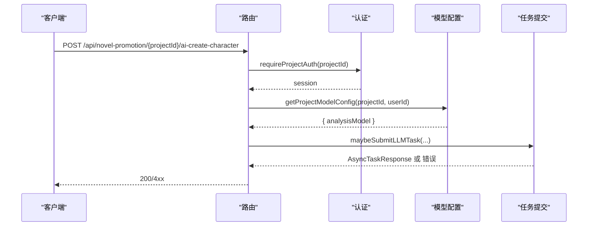
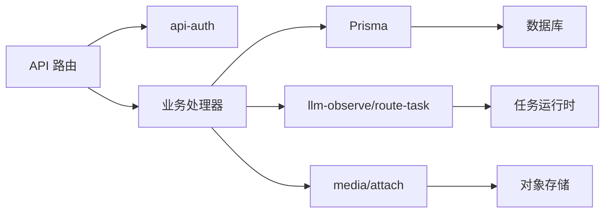

# REST API接口

<cite>
**本文引用的文件**
- [src/app/api/novel-promotion/[projectId]/route.ts](file://src/app/api/novel-promotion/[projectId]/route.ts)
- [src/app/api/novel-promotion/[projectId]/ai-create-character/route.ts](file://src/app/api/novel-promotion/[projectId]/ai-create-character/route.ts)
- [src/app/api/novel-promotion/[projectId]/generate-image/route.ts](file://src/app/api/novel-promotion/[projectId]/generate-image/route.ts)
- [src/app/api/asset-hub/ai-design-character/route.ts](file://src/app/api/asset-hub/ai-design-character/route.ts)
- [src/app/api/asset-hub/generate-image/route.ts](file://src/app/api/asset-hub/generate-image/route.ts)
- [src/app/api/asset-hub/characters/route.ts](file://src/app/api/asset-hub/characters/route.ts)
- [src/app/api/asset-hub/locations/route.ts](file://src/app/api/asset-hub/locations/route.ts)
- [src/app/api/asset-hub/folders/route.ts](file://src/app/api/asset-hub/folders/route.ts)
- [src/app/api/projects/route.ts](file://src/app/api/projects/route.ts)
- [src/app/api/tasks/route.ts](file://src/app/api/tasks/route.ts)
- [src/app/api/auth/register/route.ts](file://src/app/api/auth/register/route.ts)
- [src/lib/api-auth.ts](file://src/lib/api-auth.ts)
- [src/lib/api-errors.ts](file://src/lib/api-errors.ts)
- [src/lib/config-service.ts](file://src/lib/config-service.ts)
- [src/lib/task/types.ts](file://src/lib/task/types.ts)
- [src/lib/llm-observe/route-task.ts](file://src/lib/llm-observe/route-task.ts)
- [src/lib/assets/services/asset-actions.ts](file://src/lib/assets/services/asset-actions.ts)
- [src/lib/media/attach.ts](file://src/lib/media/attach.ts)
- [src/lib/constants.ts](file://src/lib/constants.ts)
- [src/lib/model-capabilities/lookup.ts](file://src/lib/model-capabilities/lookup.ts)
- [src/lib/model-config-contract.ts](file://src/lib/model-config-contract.ts)
- [prisma/schema.prisma](file://prisma/schema.prisma)
</cite>

## 目录
1. [简介](#简介)
2. [项目结构](#项目结构)
3. [核心组件](#核心组件)
4. [架构总览](#架构总览)
5. [详细组件分析](#详细组件分析)
6. [依赖关系分析](#依赖关系分析)
7. [性能考量](#性能考量)
8. [故障排查指南](#故障排查指南)
9. [结论](#结论)
10. [附录](#附录)

## 简介
本文件为 Waoowaoo 的 REST API 接口文档，覆盖以下领域：
- 小说推广相关接口：项目配置、AI 角色/场景创建、图像生成等
- 资产中心接口：全局角色/场景/文件夹管理、AI 设计与图像生成
- 项目管理接口：项目列表、创建；任务查询
- 用户管理接口：注册
- 错误码与状态码、认证方式、请求/响应模式、curl 与 JavaScript 示例、版本与兼容性说明

## 项目结构
API 路由采用 Next.js App Router 的约定式路由组织，位于 src/app/api 下，按功能域划分目录，便于扩展与维护。

图表来源
- [src/app/api/novel-promotion/[projectId]/route.ts](file://src/app/api/novel-promotion/[projectId]/route.ts#L225-L345)
- [src/app/api/novel-promotion/[projectId]/ai-create-character/route.ts](file://src/app/api/novel-promotion/[projectId]/ai-create-character/route.ts#L9-L52)
- [src/app/api/novel-promotion/[projectId]/generate-image/route.ts](file://src/app/api/novel-promotion/[projectId]/generate-image/route.ts#L11-L37)
- [src/app/api/asset-hub/ai-design-character/route.ts:12-51](file://src/app/api/asset-hub/ai-design-character/route.ts#L12-L51)
- [src/app/api/asset-hub/generate-image/route.ts:11-32](file://src/app/api/asset-hub/generate-image/route.ts#L11-L32)
- [src/app/api/asset-hub/characters/route.ts:18-164](file://src/app/api/asset-hub/characters/route.ts#L18-L164)
- [src/app/api/asset-hub/locations/route.ts:13-106](file://src/app/api/asset-hub/locations/route.ts#L13-L106)
- [src/app/api/asset-hub/folders/route.ts:6-43](file://src/app/api/asset-hub/folders/route.ts#L6-L43)
- [src/app/api/projects/route.ts:27-244](file://src/app/api/projects/route.ts#L27-L244)
- [src/app/api/tasks/route.ts:16-42](file://src/app/api/tasks/route.ts#L16-L42)
- [src/app/api/auth/register/route.ts:8-87](file://src/app/api/auth/register/route.ts#L8-L87)

章节来源
- [src/app/api/novel-promotion/[projectId]/route.ts](file://src/app/api/novel-promotion/[projectId]/route.ts#L1-L346)
- [src/app/api/projects/route.ts:1-245](file://src/app/api/projects/route.ts#L1-L245)
- [src/app/api/tasks/route.ts:1-43](file://src/app/api/tasks/route.ts#L1-L43)
- [src/app/api/asset-hub/characters/route.ts:1-165](file://src/app/api/asset-hub/characters/route.ts#L1-L165)
- [src/app/api/asset-hub/locations/route.ts:1-107](file://src/app/api/asset-hub/locations/route.ts#L1-L107)
- [src/app/api/asset-hub/folders/route.ts:1-44](file://src/app/api/asset-hub/folders/route.ts#L1-L44)
- [src/app/api/asset-hub/ai-design-character/route.ts:1-52](file://src/app/api/asset-hub/ai-design-character/route.ts#L1-L52)
- [src/app/api/asset-hub/generate-image/route.ts:1-33](file://src/app/api/asset-hub/generate-image/route.ts#L1-L33)
- [src/app/api/novel-promotion/[projectId]/ai-create-character/route.ts](file://src/app/api/novel-promotion/[projectId]/ai-create-character/route.ts#L1-L53)
- [src/app/api/novel-promotion/[projectId]/generate-image/route.ts](file://src/app/api/novel-promotion/[projectId]/generate-image/route.ts#L1-L38)
- [src/app/api/auth/register/route.ts:1-88](file://src/app/api/auth/register/route.ts#L1-L88)

## 核心组件
- 认证与授权
  - 用户认证：统一使用 requireUserAuth，返回 session 以识别当前用户
  - 项目级认证：requireProjectAuth(requireProjectAuthLight) 用于需要严格项目归属的端点
  - 错误处理：统一包装在 apiHandler 中，异常转为标准错误响应
- 任务系统
  - 通过 maybeSubmitLLMTask 提交异步任务，支持去重键、目标类型与目标 ID
  - 任务类型常量定义于 task/types.ts
- 资源访问控制
  - 资产生成提交时区分作用域：全局或项目级，确保最小权限
- 媒体字段签名
  - attachMediaFieldsToProject/attachMediaFieldsToGlobalCharacter 等负责生成带签名的媒体访问链接

章节来源
- [src/lib/api-auth.ts](file://src/lib/api-auth.ts)
- [src/lib/api-errors.ts](file://src/lib/api-errors.ts)
- [src/lib/task/types.ts](file://src/lib/task/types.ts)
- [src/lib/llm-observe/route-task.ts](file://src/lib/llm-observe/route-task.ts)
- [src/lib/assets/services/asset-actions.ts](file://src/lib/assets/services/asset-actions.ts)
- [src/lib/media/attach.ts](file://src/lib/media/attach.ts)

## 架构总览
下图展示了 API 层、认证/任务/资源服务之间的交互关系。

图表来源
- [src/app/api/novel-promotion/[projectId]/route.ts](file://src/app/api/novel-promotion/[projectId]/route.ts#L225-L345)
- [src/app/api/asset-hub/ai-design-character/route.ts:12-51](file://src/app/api/asset-hub/ai-design-character/route.ts#L12-L51)
- [src/app/api/asset-hub/generate-image/route.ts:11-32](file://src/app/api/asset-hub/generate-image/route.ts#L11-L32)
- [src/lib/api-auth.ts](file://src/lib/api-auth.ts)
- [src/lib/api-errors.ts](file://src/lib/api-errors.ts)
- [src/lib/media/attach.ts](file://src/lib/media/attach.ts)
- [prisma/schema.prisma](file://prisma/schema.prisma)

## 详细组件分析

### 小说推广：项目配置与AI能力
- 端点：/api/novel-promotion/[projectId]
  - 方法：GET、PATCH
  - 认证：requireProjectAuthLight（读取/更新）
  - 功能要点：
    - GET 返回 capabilityOverrides（清理无效字段后输出）
    - PATCH 支持更新模型键、艺术风格、视频比例、TTS速率、唇同步开关/模式、能力覆盖等
    - 对 capabilityOverrides 进行解析、清洗、校验，确保仅保留允许的选项
  - 请求参数（PATCH）
    - analysisModel、characterModel、locationModel、storyboardModel、editModel、videoModel、audioModel：字符串，格式为 provider::modelId
    - artStyle：字符串，必须为受支持的艺术风格值
    - videoRatio、ttsRate、lipSyncEnabled、lipSyncMode：可选
    - capabilityOverrides：对象，键为模型标识，值为允许的选项键值对
  - 响应
    - GET：{ capabilityOverrides: Record<string, Record<string, string|number|boolean>> }
    - PATCH：{ project: ProjectWithNovelPromotionData }

图表来源
- [src/app/api/novel-promotion/[projectId]/route.ts](file://src/app/api/novel-promotion/[projectId]/route.ts#L265-L345)

章节来源
- [src/app/api/novel-promotion/[projectId]/route.ts](file://src/app/api/novel-promotion/[projectId]/route.ts#L18-L345)
- [src/lib/constants.ts](file://src/lib/constants.ts)
- [src/lib/model-capabilities/lookup.ts](file://src/lib/model-capabilities/lookup.ts)
- [src/lib/model-config-contract.ts](file://src/lib/model-config-contract.ts)

### 小说推广：AI 创建角色
- 端点：/api/novel-promotion/[projectId]/ai-create-character
  - 方法：POST
  - 认证：requireProjectAuth
  - 请求体
    - userInstruction：字符串，必填
  - 行为
    - 读取项目模型配置（analysisModel 必填）
    - 基于用户指令与模型配置提交 LLM 任务，支持去重
  - 响应
    - 异步任务响应或错误

图表来源
- [src/app/api/novel-promotion/[projectId]/ai-create-character/route.ts](file://src/app/api/novel-promotion/[projectId]/ai-create-character/route.ts#L9-L52)
- [src/lib/config-service.ts](file://src/lib/config-service.ts)
- [src/lib/llm-observe/route-task.ts](file://src/lib/llm-observe/route-task.ts)
- [src/lib/task/types.ts](file://src/lib/task/types.ts)

章节来源
- [src/app/api/novel-promotion/[projectId]/ai-create-character/route.ts](file://src/app/api/novel-promotion/[projectId]/ai-create-character/route.ts#L1-L53)

### 小说推广：项目内图像生成
- 端点：/api/novel-promotion/[projectId]/generate-image
  - 方法：POST
  - 认证：requireProjectAuthLight
  - 请求体
    - type：'character'|'location'
    - id：字符串，资产 ID
  - 行为
    - 校验参数合法性
    - 以项目级作用域提交资产生成任务
  - 响应
    - 生成结果（含任务/资源信息）

章节来源
- [src/app/api/novel-promotion/[projectId]/generate-image/route.ts](file://src/app/api/novel-promotion/[projectId]/generate-image/route.ts#L1-L38)
- [src/lib/assets/services/asset-actions.ts](file://src/lib/assets/services/asset-actions.ts)

### 资产中心：AI 设计角色
- 端点：/api/asset-hub/ai-design-character
  - 方法：POST
  - 认证：requireUserAuth
  - 请求体
    - userInstruction：字符串，必填
  - 行为
    - 读取用户分析模型配置
    - 提交全局资产中心的角色设计任务，支持去重
  - 响应
    - 异步任务响应

章节来源
- [src/app/api/asset-hub/ai-design-character/route.ts:1-52](file://src/app/api/asset-hub/ai-design-character/route.ts#L1-L52)
- [src/lib/config-service.ts](file://src/lib/config-service.ts)
- [src/lib/llm-observe/route-task.ts](file://src/lib/llm-observe/route-task.ts)

### 资产中心：全局图像生成
- 端点：/api/asset-hub/generate-image
  - 方法：POST
  - 认证：requireUserAuth
  - 请求体
    - type：'character'|'location'
    - id：字符串，资产 ID
  - 行为
    - 校验参数合法性
    - 以全局作用域提交资产生成任务
  - 响应
    - 生成结果

章节来源
- [src/app/api/asset-hub/generate-image/route.ts:1-33](file://src/app/api/asset-hub/generate-image/route.ts#L1-L33)
- [src/lib/assets/services/asset-actions.ts](file://src/lib/assets/services/asset-actions.ts)

### 资产中心：角色管理
- 端点：/api/asset-hub/characters
  - 方法：GET、POST
  - 认证：requireUserAuth
  - GET 参数
    - folderId：可选，筛选指定文件夹或未分组（'null'）
  - POST 请求体
    - name、description、folderId、initialImageUrl、referenceImageUrl、referenceImageUrls、generateFromReference、artStyle、customDescription、count、meta、locale 等
  - 行为
    - GET：返回当前用户角色列表（含外观与签名媒体）
    - POST：创建角色、初始化外观、可选触发从参考图生成描述的任务
  - 响应
    - GET：{ characters: GlobalCharacterWithMedia[] }
    - POST：{ success: true, character: GlobalCharacterWithMedia }

章节来源
- [src/app/api/asset-hub/characters/route.ts:1-165](file://src/app/api/asset-hub/characters/route.ts#L1-L165)
- [src/lib/media/attach.ts](file://src/lib/media/attach.ts)
- [src/lib/constants.ts](file://src/lib/constants.ts)

### 资产中心：场景管理
- 端点：/api/asset-hub/locations
  - 方法：GET、POST
  - 认证：requireUserAuth
  - GET 参数
    - folderId：可选，筛选指定文件夹或未分组（'null'）
  - POST 请求体
    - name、summary、folderId、artStyle、availableSlots、count 等
  - 行为
    - GET：返回当前用户场景列表（含签名媒体）
    - POST：创建场景并批量生成场景图像槽位
  - 响应
    - GET：{ locations: GlobalLocationWithMedia[] }
    - POST：{ success: true, location: GlobalLocationWithMedia }

章节来源
- [src/app/api/asset-hub/locations/route.ts:1-107](file://src/app/api/asset-hub/locations/route.ts#L1-L107)
- [src/lib/media/attach.ts](file://src/lib/media/attach.ts)
- [src/lib/constants.ts](file://src/lib/constants.ts)

### 资产中心：文件夹管理
- 端点：/api/asset-hub/folders
  - 方法：GET、POST
  - 认证：requireUserAuth
  - GET：返回当前用户全部文件夹
  - POST：创建文件夹
  - 响应
    - GET：{ folders: Folder[] }
    - POST：{ success: true, folder: Folder }

章节来源
- [src/app/api/asset-hub/folders/route.ts:1-44](file://src/app/api/asset-hub/folders/route.ts#L1-L44)

### 项目管理：项目列表与创建
- 端点：/api/projects
  - 方法：GET、POST
  - 认证：requireUserAuth
  - GET 查询参数
    - page、pageSize、search
  - POST 请求体
    - name、description
  - 行为
    - GET：分页返回项目，合并费用与统计（章节数、图片/视频/面板数量、首集预览）
    - POST：校验草稿、创建项目并初始化小说推广配置（继承用户偏好）
  - 响应
    - GET：{ projects: ProjectWithStats[], pagination }
    - POST：{ project }（201）

章节来源
- [src/app/api/projects/route.ts:1-245](file://src/app/api/projects/route.ts#L1-L245)
- [prisma/schema.prisma](file://prisma/schema.prisma)

### 任务查询
- 端点：/api/tasks
  - 方法：GET
  - 认证：requireUserAuth
  - 查询参数
    - projectId、targetType、targetId、status[]、type[]、limit
  - 行为
    - 查询当前用户的任务，过滤并标准化错误信息
  - 响应
    - { tasks: TaskWithError[] }

章节来源
- [src/app/api/tasks/route.ts:1-43](file://src/app/api/tasks/route.ts#L1-L43)

### 用户注册
- 端点：/api/auth/register
  - 方法：POST
  - 行为
    - IP 限流、输入校验、密码哈希、事务创建用户与余额记录
  - 请求体
    - name、password
  - 响应
    - 成功：{ message: "注册成功", user: { id, name } }（201）
    - 限流：429 + Retry-After

章节来源
- [src/app/api/auth/register/route.ts:1-88](file://src/app/api/auth/register/route.ts#L1-L88)

## 依赖关系分析
- 认证链路
  - 路由层调用 requireUserAuth/requireProjectAuth*，失败时统一由 apiHandler 包装错误
- 任务链路
  - maybeSubmitLLMTask 提交任务，结合去重键与目标类型/ID，确保幂等与追踪
- 数据访问
  - Prisma 作为 ORM，配合 schema.prisma 定义实体关系
- 媒体链路
  - attachMediaFields* 为项目/资产附加签名 URL，便于前端安全访问

图表来源
- [src/lib/api-auth.ts](file://src/lib/api-auth.ts)
- [src/lib/api-errors.ts](file://src/lib/api-errors.ts)
- [src/lib/llm-observe/route-task.ts](file://src/lib/llm-observe/route-task.ts)
- [src/lib/media/attach.ts](file://src/lib/media/attach.ts)
- [prisma/schema.prisma](file://prisma/schema.prisma)

章节来源
- [src/lib/api-auth.ts](file://src/lib/api-auth.ts)
- [src/lib/api-errors.ts](file://src/lib/api-errors.ts)
- [src/lib/llm-observe/route-task.ts](file://src/lib/llm-observe/route-task.ts)
- [src/lib/media/attach.ts](file://src/lib/media/attach.ts)
- [prisma/schema.prisma](file://prisma/schema.prisma)

## 性能考量
- 并行查询
  - 项目列表中对总数与分页数据并行查询，减少往返延迟
- 应用层排序
  - 对新创建且未访问的项目优先展示，优化用户体验
- 媒体字段延迟签名
  - 仅在需要时附加签名 URL，避免不必要的网络开销
- 任务化处理
  - 图像生成与 AI 设计通过任务提交，避免长耗时阻塞请求

章节来源
- [src/app/api/projects/route.ts:52-81](file://src/app/api/projects/route.ts#L52-L81)
- [src/app/api/asset-hub/characters/route.ts:41-43](file://src/app/api/asset-hub/characters/route.ts#L41-L43)
- [src/app/api/asset-hub/locations/route.ts:36-38](file://src/app/api/asset-hub/locations/route.ts#L36-L38)

## 故障排查指南
- 常见错误码与含义
  - INVALID_PARAMS：请求参数非法（如缺少必填字段、格式不正确、值不在允许集合内）
  - MISSING_CONFIG：缺少必要的模型配置（如 analysisModel）
  - NOT_FOUND：资源不存在
  - RATE_LIMITED：请求过于频繁（注册接口）
- 错误响应结构
  - { success: false, code?, field?, message?, allowedValues? }
- 排查步骤
  - 确认认证头/会话有效
  - 检查请求体字段类型与范围（如 artStyle、模型键格式）
  - 查看任务状态与错误归一化后的 message
  - 关注限流策略与重试等待时间

章节来源
- [src/lib/api-errors.ts](file://src/lib/api-errors.ts)
- [src/app/api/auth/register/route.ts:10-21](file://src/app/api/auth/register/route.ts#L10-L21)
- [src/app/api/novel-promotion/[projectId]/route.ts](file://src/app/api/novel-promotion/[projectId]/route.ts#L101-L133)

## 结论
本文档梳理了 Waoowaoo 的 REST API 接口边界与行为，涵盖小说推广、资产中心、项目与任务、用户管理等模块。通过统一的认证、错误处理与任务化机制，API 在易用性与可扩展性之间取得平衡。建议在集成时遵循参数校验与限流策略，并利用任务查询接口跟踪异步工作流。

## 附录

### 认证方式
- 用户认证：requireUserAuth（所有需要登录的端点）
- 项目认证：requireProjectAuth(requireProjectAuthLight)（需要严格项目归属的端点）
- 会话来源：NextAuth（在路由中通过 session.user.id 识别用户）

章节来源
- [src/lib/api-auth.ts](file://src/lib/api-auth.ts)

### 错误码与状态码
- 200：成功
- 201：创建成功
- 400：INVALID_PARAMS（参数非法）
- 401：未认证（会话缺失或无效）
- 403：权限不足（项目归属不符）
- 404：NOT_FOUND（资源不存在）
- 412：MISSING_CONFIG（缺少必要配置）
- 429：RATE_LIMITED（请求过于频繁）

章节来源
- [src/lib/api-errors.ts](file://src/lib/api-errors.ts)
- [src/app/api/auth/register/route.ts:14-20](file://src/app/api/auth/register/route.ts#L14-L20)

### curl 示例
- 获取项目配置（需携带会话 Cookie）
  - curl -i -X GET "https://example.com/api/novel-promotion/{projectId}" -H "Cookie: __session=..."
- 更新项目配置（PATCH）
  - curl -i -X PATCH "https://example.com/api/novel-promotion/{projectId}" -H "Cookie: __session=..." -H "Content-Type: application/json" -d '{"artStyle":"american-comic","videoRatio":16/9}'
- 注册（POST）
  - curl -i -X POST "https://example.com/api/auth/register" -H "Content-Type: application/json" -d '{"name":"alice","password":"securepwd"}'

### JavaScript/TypeScript 调用示例
- 使用 fetch 调用注册
  - fetch('/api/auth/register', { method: 'POST', headers: { 'Content-Type': 'application/json' }, body: JSON.stringify({ name, password }) })
- 使用自定义封装（示意）
  - const res = await apiFetch('/api/novel-promotion/{projectId}', { method: 'PATCH', body: { artStyle, capabilityOverrides } })

### API 版本控制、向后兼容与迁移
- 版本控制
  - 当前路由未体现显式的 API 版本路径（如 /v1/），建议后续引入版本前缀以保障演进
- 向后兼容
  - novel-promotion 项目配置中的 capabilityOverrides 支持清洗与校验，避免历史遗留字段影响
  - generate-image 路由保留 legacy 类型与 ID 字段，保证旧客户端可用
- 迁移建议
  - 逐步将 legacy 字段迁移到新字段（如 aspectRatio 的清理）
  - 为新增字段提供默认值与兼容解析逻辑
  - 在变更前提供 deprecation notice 与迁移脚本

章节来源
- [src/app/api/novel-promotion/[projectId]/route.ts](file://src/app/api/novel-promotion/[projectId]/route.ts#L44-L99)
- [src/app/api/novel-promotion/[projectId]/generate-image/route.ts](file://src/app/api/novel-promotion/[projectId]/generate-image/route.ts#L6-L9)
- [src/app/api/asset-hub/generate-image/route.ts:6-9](file://src/app/api/asset-hub/generate-image/route.ts#L6-L9)