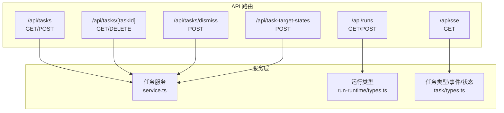
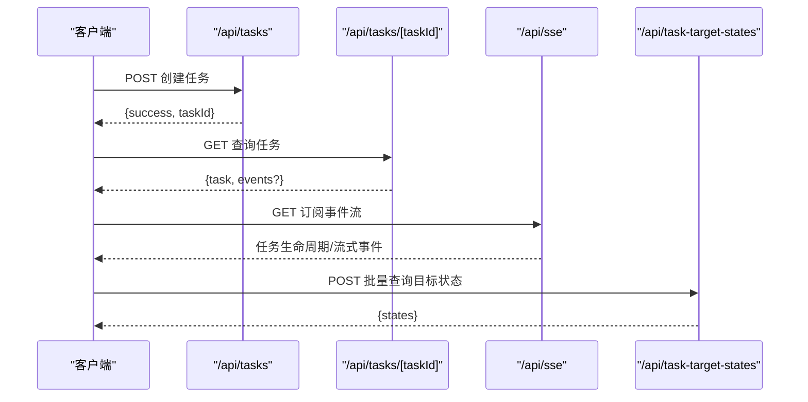
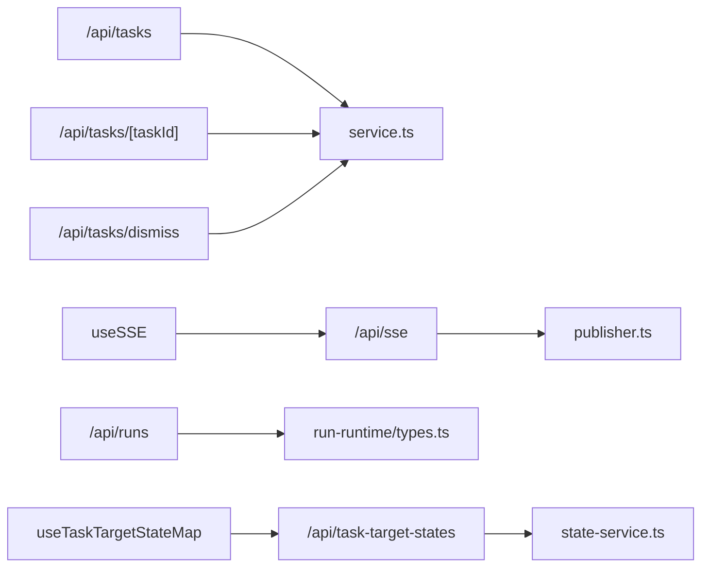
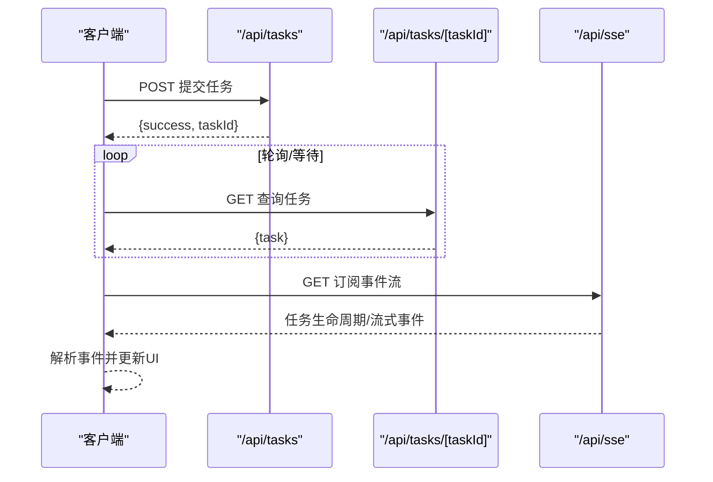

# 任务运行API

<cite>
**本文档引用的文件**
- [src/app/api/tasks/route.ts](file://src/app/api/tasks/route.ts)
- [src/app/api/tasks/[taskId]/route.ts](file://src/app/api/tasks/[taskId]/route.ts)
- [src/app/api/tasks/dismiss/route.ts](file://src/app/api/tasks/dismiss/route.ts)
- [src/app/api/task-target-states/route.ts](file://src/app/api/task-target-states/route.ts)
- [src/app/api/runs/route.ts](file://src/app/api/runs/route.ts)
- [src/app/api/sse/route.ts](file://src/app/api/sse/route.ts)
- [src/lib/task/service.ts](file://src/lib/task/service.ts)
- [src/lib/task/types.ts](file://src/lib/task/types.ts)
- [src/lib/run-runtime/types.ts](file://src/lib/run-runtime/types.ts)
- [src/lib/task/client.ts](file://src/lib/task/client.ts)
- [src/lib/task/error-message.ts](file://src/lib/task/error-message.ts)
- [src/lib/api-errors.ts](file://src/lib/api-errors.ts)
- [src/lib/task/state-service.ts](file://src/lib/task/state-service.ts)
- [src/lib/query/hooks/useSSE.ts](file://src/lib/query/hooks/useSSE.ts)
- [src/lib/query/hooks/useTaskTargetStateMap.ts](file://src/lib/query/hooks/useTaskTargetStateMap.ts)
- [src/lib/query/hooks/useTaskPresentation.ts](file://src/lib/query/hooks/useTaskPresentation.ts)
- [src/lib/task/presentation.ts](file://src/lib/task/presentation.ts)
- [src/lib/task/publisher.ts](file://src/lib/task/publisher.ts)
</cite>

## 目录
1. [简介](#简介)
2. [项目结构](#项目结构)
3. [核心组件](#核心组件)
4. [架构总览](#架构总览)
5. [详细组件分析](#详细组件分析)
6. [依赖关系分析](#依赖关系分析)
7. [性能考量](#性能考量)
8. [故障排查指南](#故障排查指南)
9. [结论](#结论)
10. [附录：端到端调用流程与示例](#附录端到端调用流程与示例)

## 简介
本文件面向任务运行与任务管理的RESTful API，覆盖以下能力：
- 任务创建与查询
- 任务状态查询与事件流订阅
- 任务取消与失败任务批量忽略
- 目标状态聚合查询（按目标类型/目标ID聚合）
- 运行（Run）创建与查询（工作流级）
- 任务执行全生命周期的端到端调用流程说明

文档同时提供 curl 示例与 JavaScript/TypeScript 调用参考路径，解释运行 ID 与任务 ID 的使用方式、状态机转换接口与错误处理机制。

## 项目结构
与任务运行API直接相关的后端路由集中在 src/app/api 下：
- 任务相关：/api/tasks、/api/tasks/[taskId]、/api/tasks/dismiss、/api/task-target-states
- 运行相关：/api/runs
- 事件流：/api/sse
- 前端集成：/src/lib/query/hooks 中的 useSSE、useTaskTargetStateMap、useTaskPresentation 等

图表来源
- [src/app/api/tasks/route.ts:16-42](file://src/app/api/tasks/route.ts#L16-L42)
- [src/app/api/tasks/[taskId]/route.ts](file://src/app/api/tasks/[taskId]/route.ts#L15-L40)
- [src/app/api/tasks/dismiss/route.ts:6-25](file://src/app/api/tasks/dismiss/route.ts#L6-L25)
- [src/app/api/task-target-states/route.ts:28-71](file://src/app/api/task-target-states/route.ts#L28-L71)
- [src/app/api/runs/route.ts:46-78](file://src/app/api/runs/route.ts#L46-L78)
- [src/app/api/sse/route.ts:92-156](file://src/app/api/sse/route.ts#L92-L156)
- [src/lib/task/service.ts:164-541](file://src/lib/task/service.ts#L164-L541)
- [src/lib/run-runtime/types.ts:1-101](file://src/lib/run-runtime/types.ts#L1-L101)
- [src/lib/task/types.ts:1-159](file://src/lib/task/types.ts#L1-L159)

章节来源
- [src/app/api/tasks/route.ts:1-43](file://src/app/api/tasks/route.ts#L1-L43)
- [src/app/api/tasks/[taskId]/route.ts](file://src/app/api/tasks/[taskId]/route.ts#L1-L89)
- [src/app/api/tasks/dismiss/route.ts:1-26](file://src/app/api/tasks/dismiss/route.ts#L1-L26)
- [src/app/api/task-target-states/route.ts:1-72](file://src/app/api/task-target-states/route.ts#L1-L72)
- [src/app/api/runs/route.ts:1-123](file://src/app/api/runs/route.ts#L1-L123)
- [src/app/api/sse/route.ts:92-206](file://src/app/api/sse/route.ts#L92-L206)

## 核心组件
- 任务服务（service.ts）：封装任务的创建、更新进度、完成/失败/取消标记、取消任务、清理过期任务、批量忽略失败任务等。
- 任务类型与事件（types.ts）：定义任务状态、事件类型、SSE事件类型、任务类型枚举、任务作业数据结构等。
- 运行类型（run-runtime/types.ts）：定义运行状态、步骤状态、运行事件类型、运行输入等。
- 任务客户端工具（client.ts）：提供异步等待任务结果、解析响应等辅助函数。
- 错误消息与统一错误码（error-message.ts、api-errors.ts）：规范化错误消息与HTTP状态映射。
- SSE 事件发布（publisher.ts、sse/route.ts）：构建生命周期/流式事件并推送至客户端。
- 目标状态聚合（state-service.ts、useTaskTargetStateMap.ts）：按目标聚合任务状态，支持批量化查询。

章节来源
- [src/lib/task/service.ts:164-541](file://src/lib/task/service.ts#L164-L541)
- [src/lib/task/types.ts:1-159](file://src/lib/task/types.ts#L1-L159)
- [src/lib/run-runtime/types.ts:1-101](file://src/lib/run-runtime/types.ts#L1-L101)
- [src/lib/task/client.ts:41-86](file://src/lib/task/client.ts#L41-L86)
- [src/lib/task/error-message.ts:78-106](file://src/lib/task/error-message.ts#L78-L106)
- [src/lib/api-errors.ts:372-394](file://src/lib/api-errors.ts#L372-L394)
- [src/lib/task/publisher.ts:96-159](file://src/lib/task/publisher.ts#L96-L159)
- [src/app/api/sse/route.ts:92-206](file://src/app/api/sse/route.ts#L92-L206)
- [src/lib/task/state-service.ts:89-169](file://src/lib/task/state-service.ts#L89-L169)
- [src/lib/query/hooks/useTaskTargetStateMap.ts:182-272](file://src/lib/query/hooks/useTaskTargetStateMap.ts#L182-L272)

## 架构总览
任务运行API围绕“任务”和“运行”两条主线：
- 任务（Task）：最小执行单元，有明确的状态机（排队/处理/完成/失败/取消/忽略）。
- 运行（Run）：工作流级的编排实体，可包含多个步骤或任务，支持创建、查询与状态管理。

图表来源
- [src/app/api/tasks/route.ts:16-42](file://src/app/api/tasks/route.ts#L16-L42)
- [src/app/api/tasks/[taskId]/route.ts](file://src/app/api/tasks/[taskId]/route.ts#L15-L40)
- [src/app/api/sse/route.ts:92-206](file://src/app/api/sse/route.ts#L92-L206)
- [src/app/api/task-target-states/route.ts:28-71](file://src/app/api/task-target-states/route.ts#L28-L71)

## 详细组件分析

### 任务查询与创建
- 端点：/api/tasks
  - 方法：GET
  - 查询参数：
    - projectId（可选）
    - targetType/targetId（可选）
    - status（可选，可多值）
    - type（可选，可多值）
    - limit（默认50，范围1..200）
  - 响应：返回当前用户可见的任务列表（已归一化错误字段）

- 端点：/api/tasks/[taskId]
  - 方法：GET
  - 查询参数：
    - includeEvents（1表示包含事件）
    - eventsLimit（默认500，最大5000）
  - 响应：任务快照及可选事件列表

- 端点：/api/tasks
  - 方法：POST
  - 请求体：任务创建输入（见任务类型定义）
  - 响应：成功标志与任务ID

章节来源
- [src/app/api/tasks/route.ts:16-42](file://src/app/api/tasks/route.ts#L16-L42)
- [src/app/api/tasks/[taskId]/route.ts](file://src/app/api/tasks/[taskId]/route.ts#L15-L40)
- [src/lib/task/types.ts:146-159](file://src/lib/task/types.ts#L146-L159)

### 任务取消与失败任务忽略
- 端点：/api/tasks/[taskId]
  - 方法：DELETE
  - 行为：取消任务并尝试移除队列任务；若成功取消，发布失败事件；返回取消结果与任务快照

- 端点：/api/tasks/dismiss
  - 方法：POST
  - 请求体：{ taskIds: string[] }（长度1..200）
  - 响应：成功标志与忽略数量

章节来源
- [src/app/api/tasks/[taskId]/route.ts](file://src/app/api/tasks/[taskId]/route.ts#L42-L88)
- [src/app/api/tasks/dismiss/route.ts:6-25](file://src/app/api/tasks/dismiss/route.ts#L6-L25)
- [src/lib/task/service.ts:506-541](file://src/lib/task/service.ts#L506-L541)
- [src/lib/task/service.ts:623-636](file://src/lib/task/service.ts#L623-L636)

### 目标状态聚合查询
- 端点：/api/task-target-states
  - 方法：POST
  - 请求体：
    - projectId（必填）
    - targets: 数组，每项包含 targetType、targetId（必填），可选 types（过滤任务类型）
  - 响应：states 数组，每个元素代表目标的聚合状态（phase、progress、stage、lastError 等）

- 前端批量化与分片策略：
  - useTaskTargetStateMap 支持批量合并、定时窗口合并、分片并发请求，提升性能与稳定性

章节来源
- [src/app/api/task-target-states/route.ts:28-71](file://src/app/api/task-target-states/route.ts#L28-L71)
- [src/lib/task/state-service.ts:89-169](file://src/lib/task/state-service.ts#L89-L169)
- [src/lib/query/hooks/useTaskTargetStateMap.ts:182-272](file://src/lib/query/hooks/useTaskTargetStateMap.ts#L182-L272)

### 运行（Run）创建与查询
- 端点：/api/runs
  - GET：查询运行列表
    - 查询参数：projectId、workflowType、targetType、targetId、episodeId、status（可多值）、limit（默认50，范围1..200）
    - 当仅传入活跃状态且提供 workflowType、targetType、targetId 时，启用“最新且可恢复”的限定查询
  - POST：创建工作流运行
    - 请求体：projectId、workflowType、targetType、targetId、episodeId（可选）、taskType（可选）、taskId（可选）、input（可选）
    - 响应：成功标志与运行ID/运行对象

- 运行状态机（RUN_STATUS）：queued、running、completed、failed、canceling、canceled

章节来源
- [src/app/api/runs/route.ts:46-78](file://src/app/api/runs/route.ts#L46-L78)
- [src/app/api/runs/route.ts:80-122](file://src/app/api/runs/route.ts#L80-L122)
- [src/lib/run-runtime/types.ts:1-101](file://src/lib/run-runtime/types.ts#L1-L101)

### 事件流（SSE）与前端订阅
- 端点：/api/sse
  - 方法：GET
  - 查询参数：projectId（必填，或 global-asset-hub）、episodeId（可选）
  - 行为：建立长连接，按 last-event-id 回放或发送活动快照，持续推送 task.lifecycle 与 task.stream 事件
  - 前端钩子：useSSE 自动处理连接、重连、事件解析、查询失效等

- 事件类型：
  - 生命周期事件：task.lifecycle（包含 CREATED、PROCESSING、COMPLETED、FAILED 等）
  - 流式事件：task.stream（携带意图/阶段信息）

章节来源
- [src/app/api/sse/route.ts:92-206](file://src/app/api/sse/route.ts#L92-L206)
- [src/lib/query/hooks/useSSE.ts:198-232](file://src/lib/query/hooks/useSSE.ts#L198-L232)
- [src/lib/task/types.ts:24-38](file://src/lib/task/types.ts#L24-L38)
- [src/lib/task/publisher.ts:96-159](file://src/lib/task/publisher.ts#L96-L159)

### 任务状态机与错误处理
- 任务状态机（TASK_STATUS）：queued、processing、completed、failed、canceled、dismissed
- 生命周期事件（TASK_EVENT_TYPE）：created、processing、progress、completed、failed
- 错误消息规范化：根据错误码与用户友好映射生成统一错误描述；支持取消标记

章节来源
- [src/lib/task/types.ts:3-12](file://src/lib/task/types.ts#L3-L12)
- [src/lib/task/types.ts:14-22](file://src/lib/task/types.ts#L14-L22)
- [src/lib/task/error-message.ts:78-106](file://src/lib/task/error-message.ts#L78-L106)
- [src/lib/api-errors.ts:372-394](file://src/lib/api-errors.ts#L372-L394)

## 依赖关系分析
- 路由层依赖认证与错误处理（requireUserAuth/requireProjectAuthLight、apiHandler、ApiError）
- 任务路由依赖任务服务（service.ts）进行数据库操作与业务逻辑
- SSE 路由依赖任务事件发布器（publisher.ts）与共享订阅器
- 目标状态路由依赖状态服务（state-service.ts）进行聚合计算
- 前端通过 useSSE/useTaskTargetStateMap/useTaskPresentation 组合使用上述API

图表来源
- [src/app/api/tasks/route.ts:1-43](file://src/app/api/tasks/route.ts#L1-L43)
- [src/app/api/tasks/[taskId]/route.ts](file://src/app/api/tasks/[taskId]/route.ts#L1-L89)
- [src/app/api/tasks/dismiss/route.ts:1-26](file://src/app/api/tasks/dismiss/route.ts#L1-L26)
- [src/app/api/task-target-states/route.ts:1-72](file://src/app/api/task-target-states/route.ts#L1-L72)
- [src/app/api/runs/route.ts:1-123](file://src/app/api/runs/route.ts#L1-L123)
- [src/app/api/sse/route.ts:92-206](file://src/app/api/sse/route.ts#L92-L206)
- [src/lib/task/service.ts:164-541](file://src/lib/task/service.ts#L164-L541)
- [src/lib/task/state-service.ts:89-169](file://src/lib/task/state-service.ts#L89-L169)
- [src/lib/run-runtime/types.ts:1-101](file://src/lib/run-runtime/types.ts#L1-L101)
- [src/lib/task/publisher.ts:96-159](file://src/lib/task/publisher.ts#L96-L159)
- [src/lib/query/hooks/useSSE.ts:198-232](file://src/lib/query/hooks/useSSE.ts#L198-L232)
- [src/lib/query/hooks/useTaskTargetStateMap.ts:182-272](file://src/lib/query/hooks/useTaskTargetStateMap.ts#L182-L272)

## 性能考量
- 目标状态查询批量化：前端对 targets 进行去重、定时合并、分片并发请求，避免单次请求过大与频繁抖动
- SSE 连接复用：useSSE 自动管理连接生命周期与重连，减少重复握手开销
- 任务事件回放：SSE 支持基于 last-event-id 的增量回放，降低首次连接压力
- 任务查询限制：任务列表与事件列表均有限制参数，防止过度拉取

章节来源
- [src/lib/query/hooks/useTaskTargetStateMap.ts:182-272](file://src/lib/query/hooks/useTaskTargetStateMap.ts#L182-L272)
- [src/app/api/sse/route.ts:158-183](file://src/app/api/sse/route.ts#L158-L183)

## 故障排查指南
- 常见错误码（节选）：UNAUTHORIZED、FORBIDDEN、NOT_FOUND、INVALID_PARAMS、TASK_NOT_READY、NO_RESULT、EXTERNAL_ERROR、CONFLICT、INTERNAL_ERROR、NETWORK_ERROR、EMPTY_RESPONSE、MODEL_NOT_OPEN、QUOTA_EXCEEDED、GENERATION_FAILED、GENERATION_TIMEOUT、SENSITIVE_CONTENT
- 错误消息优先级：根据错误码与用户友好映射决定最终提示文本；取消场景下会标注取消状态
- 任务等待超时：客户端等待任务结果时，若超过设定超时将抛出异常；建议结合事件流与轮询策略

章节来源
- [src/lib/api-errors.ts:372-394](file://src/lib/api-errors.ts#L372-L394)
- [src/lib/task/error-message.ts:78-106](file://src/lib/task/error-message.ts#L78-L106)
- [src/lib/task/client.ts:41-86](file://src/lib/task/client.ts#L41-L86)

## 结论
本文档系统梳理了任务运行与任务管理的REST API，覆盖任务创建、查询、取消、忽略、事件流订阅、目标状态聚合以及运行（Run）的创建与查询。配合前端钩子与批量化策略，可在保证性能的同时获得一致的用户体验。建议在生产环境中结合 SSE 事件流与任务状态聚合接口，实现低延迟、高可用的任务可视化与控制。

## 附录：端到端调用流程与示例

### 端到端流程：从任务提交到结果获取

图表来源
- [src/app/api/tasks/route.ts:16-42](file://src/app/api/tasks/route.ts#L16-L42)
- [src/app/api/tasks/[taskId]/route.ts](file://src/app/api/tasks/[taskId]/route.ts#L15-L40)
- [src/app/api/sse/route.ts:92-206](file://src/app/api/sse/route.ts#L92-L206)

### curl 示例（请替换为实际服务器地址与令牌）
- 创建任务
  - curl -X POST "$BASE_URL/api/tasks" -H "Authorization: Bearer $TOKEN" -H "Content-Type: application/json" -d '{"projectId":"proj-xxx","type":"image_panel","targetType":"Panel","targetId":"panel-1","payload":{...}}'

- 查询任务详情与事件
  - curl -X GET "$BASE_URL/api/tasks/$TASK_ID?includeEvents=1&eventsLimit=500" -H "Authorization: Bearer $TOKEN"

- 取消任务
  - curl -X DELETE "$BASE_URL/api/tasks/$TASK_ID" -H "Authorization: Bearer $TOKEN"

- 批量忽略失败任务
  - curl -X POST "$BASE_URL/api/tasks/dismiss" -H "Authorization: Bearer $TOKEN" -H "Content-Type: application/json" -d '{"taskIds":["task-1","task-2"]}'

- 目标状态聚合查询
  - curl -X POST "$BASE_URL/api/task-target-states" -H "Authorization: Bearer $TOKEN" -H "Content-Type: application/json" -d '{"projectId":"proj-xxx","targets":[{"targetType":"Panel","targetId":"panel-1"}]}'

- 订阅事件流
  - curl -N -H "Authorization: Bearer $TOKEN" "$BASE_URL/api/sse?projectId=proj-xxx"

### JavaScript/TypeScript 调用参考路径
- 使用任务客户端等待结果
  - 参考：[src/lib/task/client.ts:41-86](file://src/lib/task/client.ts#L41-L86)
- 获取任务详情
  - 参考：[src/app/api/tasks/[taskId]/route.ts](file://src/app/api/tasks/[taskId]/route.ts#L15-L40)
- 订阅事件流
  - 参考：[src/app/api/sse/route.ts:92-206](file://src/app/api/sse/route.ts#L92-L206)，[src/lib/query/hooks/useSSE.ts:198-232](file://src/lib/query/hooks/useSSE.ts#L198-L232)
- 目标状态聚合
  - 参考：[src/app/api/task-target-states/route.ts:28-71](file://src/app/api/task-target-states/route.ts#L28-L71)，[src/lib/query/hooks/useTaskTargetStateMap.ts:182-272](file://src/lib/query/hooks/useTaskTargetStateMap.ts#L182-L272)

### 关键参数说明
- 运行 ID（runId）：用于运行（Run）层面的查询与控制，通常由 /api/runs POST 返回
- 任务 ID（taskId）：用于任务（Task）层面的查询与控制，通常由 /api/tasks POST 返回
- 目标状态（targetState）：以 targetType + targetId 作为唯一键，聚合该目标下的任务状态与进度
- 事件流（SSE）：通过 last-event-id 实现断点续播，支持生命周期与流式事件