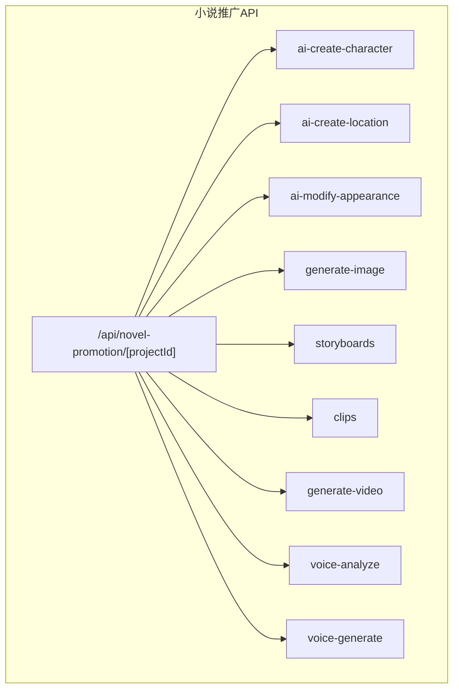
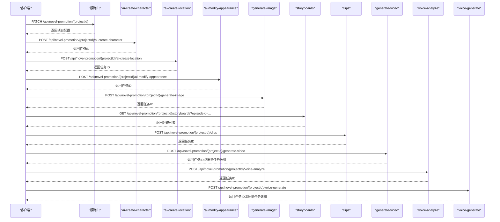
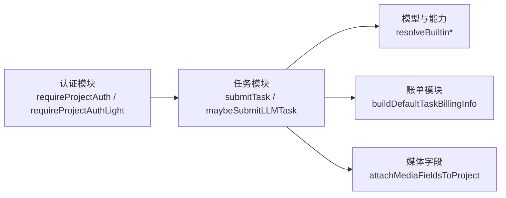
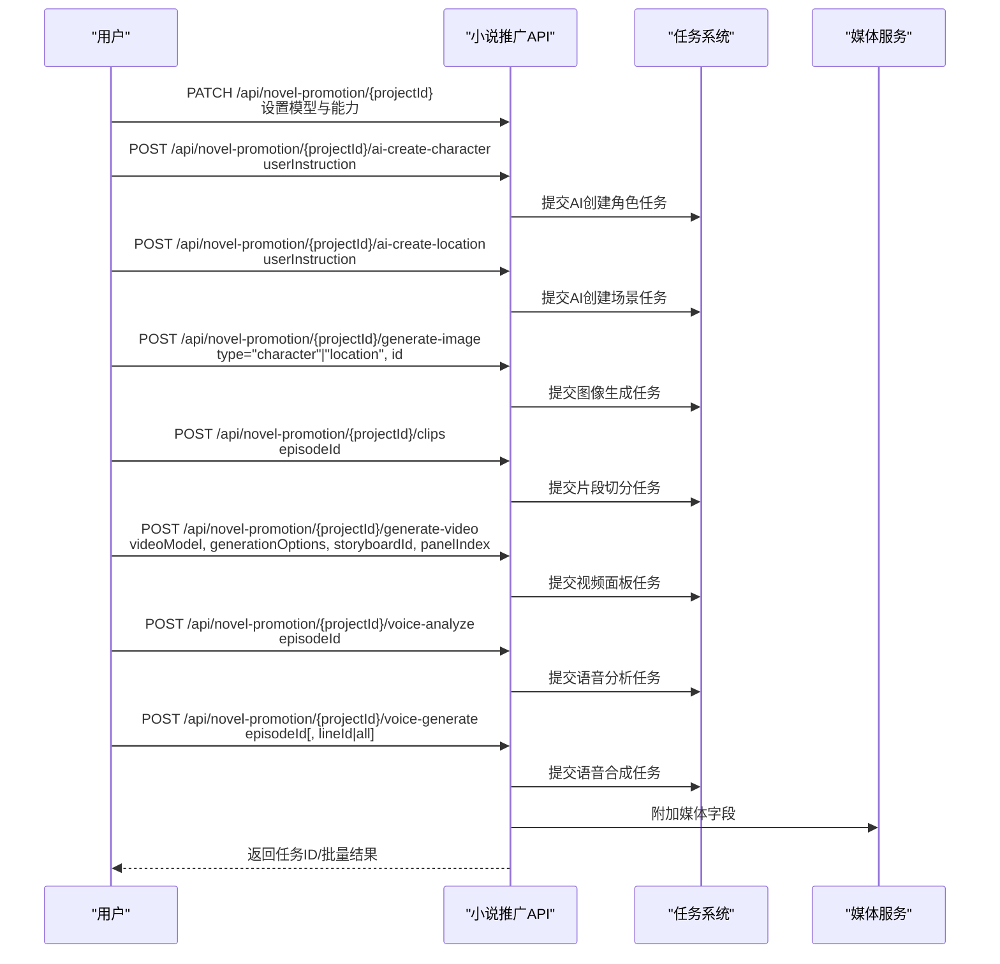

# 小说推广API

<cite>
**本文引用的文件**
- [src/app/api/novel-promotion/[projectId]/route.ts](file://src/app/api/novel-promotion/[projectId]/route.ts)
- [src/app/api/novel-promotion/[projectId]/ai-create-character/route.ts](file://src/app/api/novel-promotion/[projectId]/ai-create-character/route.ts)
- [src/app/api/novel-promotion/[projectId]/ai-create-location/route.ts](file://src/app/api/novel-promotion/[projectId]/ai-create-location/route.ts)
- [src/app/api/novel-promotion/[projectId]/ai-modify-appearance/route.ts](file://src/app/api/novel-promotion/[projectId]/ai-modify-appearance/route.ts)
- [src/app/api/novel-promotion/[projectId]/generate-image/route.ts](file://src/app/api/novel-promotion/[projectId]/generate-image/route.ts)
- [src/app/api/novel-promotion/[projectId]/generate-video/route.ts](file://src/app/api/novel-promotion/[projectId]/generate-video/route.ts)
- [src/app/api/novel-promotion/[projectId]/voice-analyze/route.ts](file://src/app/api/novel-promotion/[projectId]/voice-analyze/route.ts)
- [src/app/api/novel-promotion/[projectId]/voice-generate/route.ts](file://src/app/api/novel-promotion/[projectId]/voice-generate/route.ts)
- [src/app/api/novel-promotion/[projectId]/storyboards/route.ts](file://src/app/api/novel-promotion/[projectId]/storyboards/route.ts)
- [src/app/api/novel-promotion/[projectId]/clips/route.ts](file://src/app/api/novel-promotion/[projectId]/clips/route.ts)
</cite>

## 目录
1. [简介](#简介)
2. [项目结构](#项目结构)
3. [核心组件](#核心组件)
4. [架构总览](#架构总览)
5. [详细组件分析](#详细组件分析)
6. [依赖关系分析](#依赖关系分析)
7. [性能与并发特性](#性能与并发特性)
8. [故障排查指南](#故障排查指南)
9. [结论](#结论)
10. [附录：端到端调用序列与示例](#附录端到端调用序列与示例)

## 简介
本文件为“小说推广”工作流的RESTful API文档，覆盖从文本输入到最终视频输出的完整链路。重点接口包括：
- AI创建角色与场景：ai-create-character、ai-create-location
- 外观修改：ai-modify-appearance
- 图像生成：generate-image
- 分镜与剪辑：storyboards、clips
- 视频生成：generate-video
- 语音分析与合成：voice-analyze、voice-generate

所有接口均以项目ID作为路径参数，支持批量操作与状态查询。本文提供各端点的HTTP方法、URL模式、请求参数、响应格式与错误处理说明，并给出端到端调用序列、curl示例与JavaScript/TypeScript调用要点。

## 项目结构
小说推广API位于Next.js App Router的约定式路由中，根路径为 /api/novel-promotion/[projectId]，其中 [projectId] 为项目标识符。主要模块按功能划分如下：
- 配置与模型选择：根路由（读取/更新项目级模型与能力选项）
- AI创作与修改：ai-create-character、ai-create-location、ai-modify-appearance
- 资源生成：generate-image、generate-video、voice-generate、voice-analyze
- 剧本与分镜：storyboards、clips
- 其他辅助：批量下载、状态清理等（在根路由与子路由中体现）

图表来源
- [src/app/api/novel-promotion/[projectId]/route.ts](file://src/app/api/novel-promotion/[projectId]/route.ts)
- [src/app/api/novel-promotion/[projectId]/ai-create-character/route.ts](file://src/app/api/novel-promotion/[projectId]/ai-create-character/route.ts)
- [src/app/api/novel-promotion/[projectId]/ai-create-location/route.ts](file://src/app/api/novel-promotion/[projectId]/ai-create-location/route.ts)
- [src/app/api/novel-promotion/[projectId]/ai-modify-appearance/route.ts](file://src/app/api/novel-promotion/[projectId]/ai-modify-appearance/route.ts)
- [src/app/api/novel-promotion/[projectId]/generate-image/route.ts](file://src/app/api/novel-promotion/[projectId]/generate-image/route.ts)
- [src/app/api/novel-promotion/[projectId]/storyboards/route.ts](file://src/app/api/novel-promotion/[projectId]/storyboards/route.ts)
- [src/app/api/novel-promotion/[projectId]/clips/route.ts](file://src/app/api/novel-promotion/[projectId]/clips/route.ts)
- [src/app/api/novel-promotion/[projectId]/generate-video/route.ts](file://src/app/api/novel-promotion/[projectId]/generate-video/route.ts)
- [src/app/api/novel-promotion/[projectId]/voice-analyze/route.ts](file://src/app/api/novel-promotion/[projectId]/voice-analyze/route.ts)
- [src/app/api/novel-promotion/[projectId]/voice-generate/route.ts](file://src/app/api/novel-promotion/[projectId]/voice-generate/route.ts)

章节来源
- [src/app/api/novel-promotion/[projectId]/route.ts](file://src/app/api/novel-promotion/[projectId]/route.ts)
- [src/app/api/novel-promotion/[projectId]/ai-create-character/route.ts](file://src/app/api/novel-promotion/[projectId]/ai-create-character/route.ts)
- [src/app/api/novel-promotion/[projectId]/ai-create-location/route.ts](file://src/app/api/novel-promotion/[projectId]/ai-create-location/route.ts)
- [src/app/api/novel-promotion/[projectId]/ai-modify-appearance/route.ts](file://src/app/api/novel-promotion/[projectId]/ai-modify-appearance/route.ts)
- [src/app/api/novel-promotion/[projectId]/generate-image/route.ts](file://src/app/api/novel-promotion/[projectId]/generate-image/route.ts)
- [src/app/api/novel-promotion/[projectId]/generate-video/route.ts](file://src/app/api/novel-promotion/[projectId]/generate-video/route.ts)
- [src/app/api/novel-promotion/[projectId]/voice-analyze/route.ts](file://src/app/api/novel-promotion/[projectId]/voice-analyze/route.ts)
- [src/app/api/novel-promotion/[projectId]/voice-generate/route.ts](file://src/app/api/novel-promotion/[projectId]/voice-generate/route.ts)
- [src/app/api/novel-promotion/[projectId]/storyboards/route.ts](file://src/app/api/novel-promotion/[projectId]/storyboards/route.ts)
- [src/app/api/novel-promotion/[projectId]/clips/route.ts](file://src/app/api/novel-promotion/[projectId]/clips/route.ts)

## 核心组件
- 项目配置与能力选择
  - GET /api/novel-promotion/[projectId]：返回当前项目的模型配置与清洗后的 capabilityOverrides
  - PATCH /api/novel-promotion/[projectId]：更新项目模型与能力选择，支持 capabilityOverrides 的校验与序列化
- AI创作与修改
  - POST /api/novel-promotion/[projectId]/ai-create-character：提交AI创建角色任务
  - POST /api/novel-promotion/[projectId]/ai-create-location：提交AI创建场景任务
  - POST /api/novel-promotion/[projectId]/ai-modify-appearance：提交AI修改外观任务
- 资源生成
  - POST /api/novel-promotion/[projectId]/generate-image：根据类型与资产ID提交图像生成任务
  - POST /api/novel-promotion/[projectId]/generate-video：提交视频面板或批量视频生成任务
  - POST /api/novel-promotion/[projectId]/voice-analyze：提交语音分析任务
  - POST /api/novel-promotion/[projectId]/voice-generate：提交单条或批量语音合成任务
- 剧本与分镜
  - GET /api/novel-promotion/[projectId]/storyboards：按剧集ID查询分镜列表
  - PATCH /api/novel-promotion/[projectId]/storyboards：清除指定分镜的 lastError
  - POST /api/novel-promotion/[projectId]/clips：提交片段切分任务

章节来源
- [src/app/api/novel-promotion/[projectId]/route.ts](file://src/app/api/novel-promotion/[projectId]/route.ts)
- [src/app/api/novel-promotion/[projectId]/ai-create-character/route.ts](file://src/app/api/novel-promotion/[projectId]/ai-create-character/route.ts)
- [src/app/api/novel-promotion/[projectId]/ai-create-location/route.ts](file://src/app/api/novel-promotion/[projectId]/ai-create-location/route.ts)
- [src/app/api/novel-promotion/[projectId]/ai-modify-appearance/route.ts](file://src/app/api/novel-promotion/[projectId]/ai-modify-appearance/route.ts)
- [src/app/api/novel-promotion/[projectId]/generate-image/route.ts](file://src/app/api/novel-promotion/[projectId]/generate-image/route.ts)
- [src/app/api/novel-promotion/[projectId]/generate-video/route.ts](file://src/app/api/novel-promotion/[projectId]/generate-video/route.ts)
- [src/app/api/novel-promotion/[projectId]/voice-analyze/route.ts](file://src/app/api/novel-promotion/[projectId]/voice-analyze/route.ts)
- [src/app/api/novel-promotion/[projectId]/voice-generate/route.ts](file://src/app/api/novel-promotion/[projectId]/voice-generate/route.ts)
- [src/app/api/novel-promotion/[projectId]/storyboards/route.ts](file://src/app/api/novel-promotion/[projectId]/storyboards/route.ts)
- [src/app/api/novel-promotion/[projectId]/clips/route.ts](file://src/app/api/novel-promotion/[projectId]/clips/route.ts)

## 架构总览
小说推广API采用“任务化”与“能力选择”相结合的架构：
- 权限控制：统一通过 requireProjectAuth(requireProjectAuthLight) 进行项目访问校验
- 模型与能力：通过项目配置与 capabilityOverrides 决定具体模型与能力组合
- 任务提交：大量接口通过 submitTask 或 maybeSubmitLLMTask 提交异步任务，返回任务ID供后续轮询
- 媒体字段：attachMediaFieldsToProject 为资源附加可访问的媒体字段

图表来源
- [src/app/api/novel-promotion/[projectId]/route.ts](file://src/app/api/novel-promotion/[projectId]/route.ts)
- [src/app/api/novel-promotion/[projectId]/ai-create-character/route.ts](file://src/app/api/novel-promotion/[projectId]/ai-create-character/route.ts)
- [src/app/api/novel-promotion/[projectId]/ai-create-location/route.ts](file://src/app/api/novel-promotion/[projectId]/ai-create-location/route.ts)
- [src/app/api/novel-promotion/[projectId]/ai-modify-appearance/route.ts](file://src/app/api/novel-promotion/[projectId]/ai-modify-appearance/route.ts)
- [src/app/api/novel-promotion/[projectId]/generate-image/route.ts](file://src/app/api/novel-promotion/[projectId]/generate-image/route.ts)
- [src/app/api/novel-promotion/[projectId]/storyboards/route.ts](file://src/app/api/novel-promotion/[projectId]/storyboards/route.ts)
- [src/app/api/novel-promotion/[projectId]/clips/route.ts](file://src/app/api/novel-promotion/[projectId]/clips/route.ts)
- [src/app/api/novel-promotion/[projectId]/generate-video/route.ts](file://src/app/api/novel-promotion/[projectId]/generate-video/route.ts)
- [src/app/api/novel-promotion/[projectId]/voice-analyze/route.ts](file://src/app/api/novel-promotion/[projectId]/voice-analyze/route.ts)
- [src/app/api/novel-promotion/[projectId]/voice-generate/route.ts](file://src/app/api/novel-promotion/[projectId]/voice-generate/route.ts)

## 详细组件分析

### 项目配置与能力选择
- GET /api/novel-promotion/[projectId]
  - 功能：读取项目配置，返回 capabilityOverrides（已清洗）
  - 认证：requireProjectAuthLight
  - 响应：包含 capabilityOverrides 的对象
- PATCH /api/novel-promotion/[projectId]
  - 功能：更新项目模型与能力选择；支持 capabilityOverrides 的规范化、清洗与校验
  - 认证：requireProjectAuth
  - 请求体字段（允许部分更新）：
    - analysisModel、characterModel、locationModel、storyboardModel、editModel、videoModel、audioModel
    - videoRatio、artStyle、ttsRate、lipSyncEnabled、lipSyncMode
    - capabilityOverrides（对象，键为模型key，值为能力字段映射）
  - 响应：返回合并后的项目对象（含媒体字段签名）

章节来源
- [src/app/api/novel-promotion/[projectId]/route.ts](file://src/app/api/novel-promotion/[projectId]/route.ts)

### AI创建角色
- POST /api/novel-promotion/[projectId]/ai-create-character
  - 功能：提交AI创建角色任务
  - 认证：requireProjectAuth
  - 请求体：
    - userInstruction：字符串，必填
  - 行为：解析用户指令，校验项目分析模型，去重后提交LLM任务，返回任务响应或错误

章节来源
- [src/app/api/novel-promotion/[projectId]/ai-create-character/route.ts](file://src/app/api/novel-promotion/[projectId]/ai-create-character/route.ts)

### AI创建场景
- POST /api/novel-promotion/[projectId]/ai-create-location
  - 功能：提交AI创建场景任务
  - 认证：requireProjectAuth
  - 请求体：
    - userInstruction：字符串，必填
  - 行为：与创建角色类似，但目标为场景设计

章节来源
- [src/app/api/novel-promotion/[projectId]/ai-create-location/route.ts](file://src/app/api/novel-promotion/[projectId]/ai-create-location/route.ts)

### AI修改外观
- POST /api/novel-promotion/[projectId]/ai-modify-appearance
  - 功能：提交AI修改外观任务
  - 认证：requireProjectAuth
  - 请求体：
    - characterId：字符串，必填
    - appearanceId：字符串，必填
    - currentDescription：字符串，必填
    - modifyInstruction：字符串，必填
  - 行为：校验参数完整性，提交LLM任务，返回任务响应或错误

章节来源
- [src/app/api/novel-promotion/[projectId]/ai-modify-appearance/route.ts](file://src/app/api/novel-promotion/[projectId]/ai-modify-appearance/route.ts)

### 图像生成
- POST /api/novel-promotion/[projectId]/generate-image
  - 功能：根据类型与资产ID提交图像生成任务
  - 认证：requireProjectAuthLight
  - 请求体：
    - type：'character' | 'location'，必填
    - id：字符串，必填（资产ID）
  - 行为：校验参数，提交资产生成任务，返回结果（包含任务或资源信息）

章节来源
- [src/app/api/novel-promotion/[projectId]/generate-image/route.ts](file://src/app/api/novel-promotion/[projectId]/generate-image/route.ts)

### 分镜与剪辑
- GET /api/novel-promotion/[projectId]/storyboards
  - 功能：按剧集ID查询分镜列表
  - 认证：requireProjectAuthLight
  - 查询参数：
    - episodeId：字符串，必填
  - 行为：返回带媒体字段的分镜列表
- PATCH /api/novel-promotion/[projectId]/storyboards
  - 功能：清除指定分镜的 lastError
  - 认证：requireProjectAuthLight
  - 请求体：
    - storyboardId：字符串，必填
  - 行为：更新成功
- POST /api/novel-promotion/[projectId]/clips
  - 功能：提交片段切分任务
  - 认证：requireProjectAuth（包含角色与场景）
  - 请求体：
    - episodeId：字符串，必填
  - 行为：提交LLM任务，返回任务响应或错误

章节来源
- [src/app/api/novel-promotion/[projectId]/storyboards/route.ts](file://src/app/api/novel-promotion/[projectId]/storyboards/route.ts)
- [src/app/api/novel-promotion/[projectId]/clips/route.ts](file://src/app/api/novel-promotion/[projectId]/clips/route.ts)

### 视频生成
- POST /api/novel-promotion/[projectId]/generate-video
  - 功能：提交视频面板或批量视频生成任务
  - 认证：requireProjectAuthLight
  - 请求体（至少满足其一）：
    - videoModel：字符串，必填（视频模型key）
    - generationOptions：对象（能力选择，如分辨率、帧率等）
    - firstLastFrame：对象（首尾帧模型flModel，且需支持firstlastframe）
    - all：布尔，true时按剧集批量生成
    - episodeId：当 all=true 时必填
    - storyboardId、panelIndex：当 all=false 时必填
  - 行为：
    - 校验视频模型与能力组合
    - 批量模式：查询未生成视频的面板并并行提交任务
    - 单个模式：定位面板并提交任务
  - 响应：单个或批量任务结果

章节来源
- [src/app/api/novel-promotion/[projectId]/generate-video/route.ts](file://src/app/api/novel-promotion/[projectId]/generate-video/route.ts)

### 语音分析
- POST /api/novel-promotion/[projectId]/voice-analyze
  - 功能：提交语音分析任务
  - 认证：requireProjectAuthLight
  - 请求体：
    - episodeId：字符串，必填
  - 行为：提交LLM任务，返回任务响应或错误

章节来源
- [src/app/api/novel-promotion/[projectId]/voice-analyze/route.ts](file://src/app/api/novel-promotion/[projectId]/voice-analyze/route.ts)

### 语音生成
- POST /api/novel-promotion/[projectId]/voice-generate
  - 功能：提交单条或批量语音合成任务
  - 认证：requireProjectAuthLight
  - 请求体：
    - episodeId：字符串，必填
    - lineId：当 all=false 时必填
    - audioModel：字符串（可选，覆盖项目/用户偏好）
    - all：布尔，true时批量生成
  - 行为：
    - 解析用户/项目/默认模型，校验模型key合法性
    - 校验说话人与音色绑定（不同供应商策略不同）
    - 批量：过滤未生成且有绑定的台词并行提交
    - 单条：校验绑定后提交
  - 响应：单个或批量任务结果

章节来源
- [src/app/api/novel-promotion/[projectId]/voice-generate/route.ts](file://src/app/api/novel-promotion/[projectId]/voice-generate/route.ts)

## 依赖关系分析
- 权限与认证
  - requireProjectAuthLight：轻量认证，适用于读取与非敏感写入
  - requireProjectAuth：强认证，适用于需要项目上下文与资源访问的任务
- 任务系统
  - submitTask：通用任务提交入口，支持去重、账单信息与UI负载
  - maybeSubmitLLMTask：LLM类任务的便捷提交封装
- 能力与模型
  - resolveBuiltinModelContext / resolveBuiltinCapabilitiesByModelKey / resolveBuiltinPricing：能力与定价解析
  - capabilityOverrides：项目级能力选择的序列化/反序列化与校验
- 媒体字段
  - attachMediaFieldsToProject：为资源附加可访问字段

图表来源
- [src/app/api/novel-promotion/[projectId]/generate-video/route.ts](file://src/app/api/novel-promotion/[projectId]/generate-video/route.ts)
- [src/app/api/novel-promotion/[projectId]/voice-generate/route.ts](file://src/app/api/novel-promotion/[projectId]/voice-generate/route.ts)
- [src/app/api/novel-promotion/[projectId]/route.ts](file://src/app/api/novel-promotion/[projectId]/route.ts)

章节来源
- [src/app/api/novel-promotion/[projectId]/generate-video/route.ts](file://src/app/api/novel-promotion/[projectId]/generate-video/route.ts)
- [src/app/api/novel-promotion/[projectId]/voice-generate/route.ts](file://src/app/api/novel-promotion/[projectId]/voice-generate/route.ts)
- [src/app/api/novel-promotion/[projectId]/route.ts](file://src/app/api/novel-promotion/[projectId]/route.ts)

## 性能与并发特性
- 并发与批处理
  - generate-video 在 all=true 时对多个面板并行提交任务，提升吞吐
  - voice-generate 在 all=true 时对多条台词并行提交任务
- 去重与幂等
  - 各AI任务通过哈希生成去重键，避免重复提交
- 账单与能力校验前置
  - 视频与语音生成在提交前进行能力组合与定价校验，减少无效任务
- 媒体字段延迟注入
  - attachMediaFieldsToProject 在返回前附加媒体字段，避免阻塞任务提交

[本节为通用性能讨论，不直接分析具体文件]

## 故障排查指南
- 常见错误码与含义
  - INVALID_PARAMS：请求参数非法（如缺少必要字段、模型key格式错误、能力组合不支持）
  - MISSING_CONFIG：项目缺少必要的模型配置（如分析模型）
  - NOT_FOUND：目标不存在（如面板、台词、剧集）
  - BILLING_UNKNOWN_*：未知的视频能力组合或分辨率
- 定位建议
  - 检查请求体字段是否符合接口定义
  - 对于视频/语音生成，确认 videoModel/audioModel 与 generationOptions 的组合是否在能力目录中
  - 使用 storyboards 接口确认面板是否存在且已具备图像
  - 使用 PATCH /api/novel-promotion/[projectId]/storyboards 清理 lastError 后重试

章节来源
- [src/app/api/novel-promotion/[projectId]/generate-video/route.ts](file://src/app/api/novel-promotion/[projectId]/generate-video/route.ts)
- [src/app/api/novel-promotion/[projectId]/voice-generate/route.ts](file://src/app/api/novel-promotion/[projectId]/voice-generate/route.ts)
- [src/app/api/novel-promotion/[projectId]/storyboards/route.ts](file://src/app/api/novel-promotion/[projectId]/storyboards/route.ts)

## 结论
小说推广API围绕“项目配置—AI创作—资源生成—分镜剪辑—视频与语音”的完整工作流构建，通过统一的权限与任务系统保障稳定性与可扩展性。建议在生产环境中：
- 严格遵循参数校验与能力组合约束
- 使用批量接口提升效率
- 利用去重机制避免重复提交
- 通过状态查询与错误清理维持流程连续性

[本节为总结性内容，不直接分析具体文件]

## 附录：端到端调用序列与示例

### 端到端工作流（从文本到视频）

图表来源
- [src/app/api/novel-promotion/[projectId]/route.ts](file://src/app/api/novel-promotion/[projectId]/route.ts)
- [src/app/api/novel-promotion/[projectId]/ai-create-character/route.ts](file://src/app/api/novel-promotion/[projectId]/ai-create-character/route.ts)
- [src/app/api/novel-promotion/[projectId]/ai-create-location/route.ts](file://src/app/api/novel-promotion/[projectId]/ai-create-location/route.ts)
- [src/app/api/novel-promotion/[projectId]/generate-image/route.ts](file://src/app/api/novel-promotion/[projectId]/generate-image/route.ts)
- [src/app/api/novel-promotion/[projectId]/clips/route.ts](file://src/app/api/novel-promotion/[projectId]/clips/route.ts)
- [src/app/api/novel-promotion/[projectId]/generate-video/route.ts](file://src/app/api/novel-promotion/[projectId]/generate-video/route.ts)
- [src/app/api/novel-promotion/[projectId]/voice-analyze/route.ts](file://src/app/api/novel-promotion/[projectId]/voice-analyze/route.ts)
- [src/app/api/novel-promotion/[projectId]/voice-generate/route.ts](file://src/app/api/novel-promotion/[projectId]/voice-generate/route.ts)

### curl 示例
- 设置项目模型与能力
  - curl -X PATCH "https://your-domain/api/novel-promotion/{projectId}" -H "Content-Type: application/json" -d '{"videoModel":"provider::model","capabilityOverrides":{"provider::model":{"resolution":"1080p","fps":24}}}'
- 创建角色
  - curl -X POST "https://your-domain/api/novel-promotion/{projectId}/ai-create-character" -H "Content-Type: application/json" -d '{"userInstruction":"描述角色特征"}'
- 创建场景
  - curl -X POST "https://your-domain/api/novel-promotion/{projectId}/ai-create-location" -H "Content-Type: application/json" -d '{"userInstruction":"描述场景细节"}'
- 修改外观
  - curl -X POST "https://your-domain/api/novel-promotion/{projectId}/ai-modify-appearance" -H "Content-Type: application/json" -d '{"characterId":"char-1","appearanceId":"app-1","currentDescription":"当前描述","modifyInstruction":"修改指令"}'
- 生成图像
  - curl -X POST "https://your-domain/api/novel-promotion/{projectId}/generate-image" -H "Content-Type: application/json" -d '{"type":"character","id":"char-1"}'
- 查询分镜
  - curl "https://your-domain/api/novel-promotion/{projectId}/storyboards?episodeId=ep-1"
- 清除分镜错误
  - curl -X PATCH "https://your-domain/api/novel-promotion/{projectId}/storyboards" -H "Content-Type: application/json" -d '{"storyboardId":"sb-1"}'
- 片段切分
  - curl -X POST "https://your-domain/api/novel-promotion/{projectId}/clips" -H "Content-Type: application/json" -d '{"episodeId":"ep-1"}'
- 生成视频（单面板）
  - curl -X POST "https://your-domain/api/novel-promotion/{projectId}/generate-video" -H "Content-Type: application/json" -d '{"videoModel":"provider::model","storyboardId":"sb-1","panelIndex":0,"generationOptions":{"resolution":"1080p"}}'
- 生成视频（批量）
  - curl -X POST "https://your-domain/api/novel-promotion/{projectId}/generate-video" -H "Content-Type: application/json" -d '{"videoModel":"provider::model","all":true,"episodeId":"ep-1","generationOptions":{"resolution":"1080p"}}'
- 语音分析
  - curl -X POST "https://your-domain/api/novel-promotion/{projectId}/voice-analyze" -H "Content-Type: application/json" -d '{"episodeId":"ep-1"}'
- 语音生成（单条）
  - curl -X POST "https://your-domain/api/novel-promotion/{projectId}/voice-generate" -H "Content-Type: application/json" -d '{"episodeId":"ep-1","lineId":"line-1"}'
- 语音生成（批量）
  - curl -X POST "https://your-domain/api/novel-promotion/{projectId}/voice-generate" -H "Content-Type: application/json" -d '{"episodeId":"ep-1","all":true}'

### JavaScript/TypeScript 调用要点
- 使用 fetch 发送请求，注意设置正确的 Content-Type
- 对于 PATCH /api/novel-promotion/[projectId]，仅传入需要更新的字段
- 对于 generate-video 与 voice-generate：
  - 若 all=true，确保提供 episodeId
  - 若 all=false，确保提供 storyboardId 与 panelIndex（视频）或 lineId（语音）
- 对于 capabilityOverrides，请确保提供的能力字段与模型能力目录匹配
- 对于批量接口，建议在前端维护任务ID列表，结合轮询或SSE订阅任务状态

[本节为通用调用指导，不直接分析具体文件]