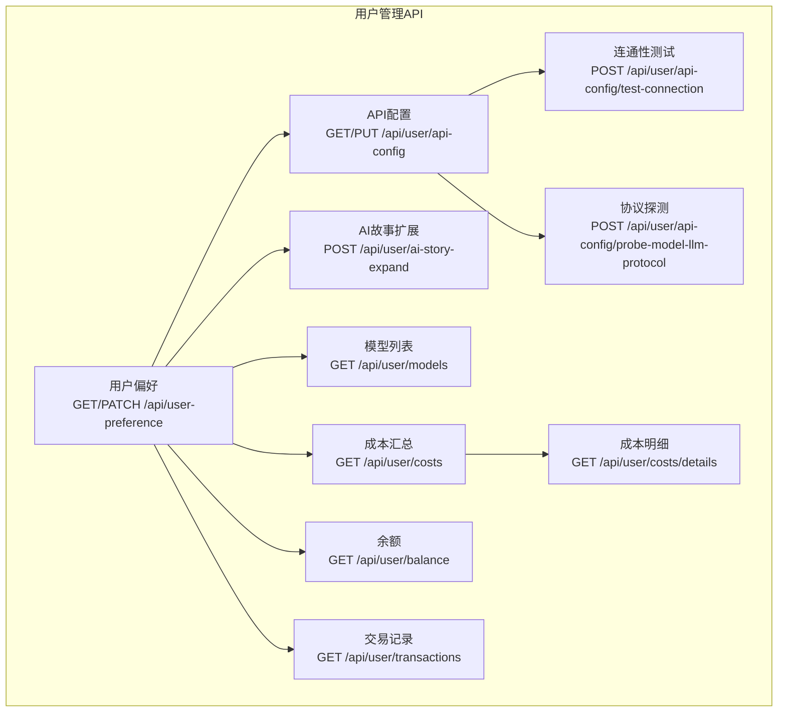
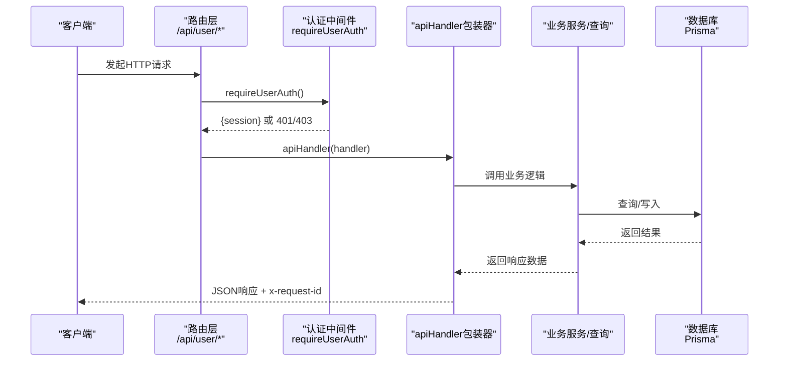
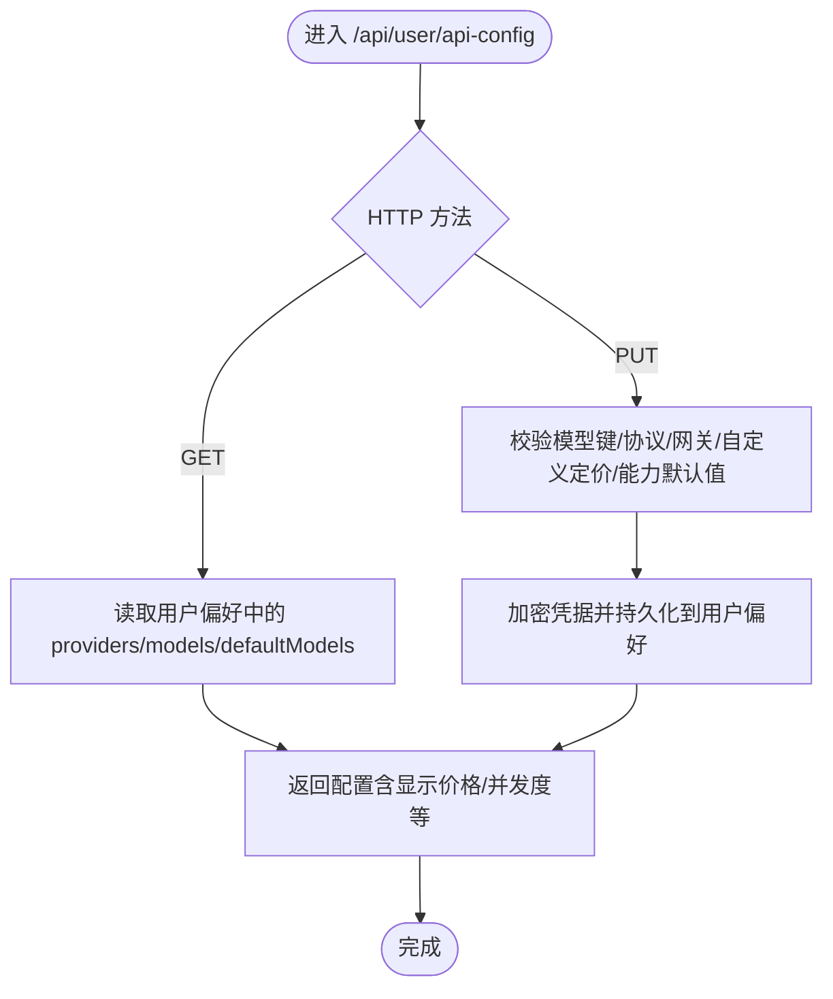
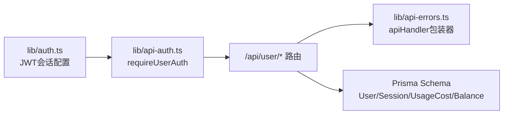

# 用户管理API

<cite>
**本文引用的文件**
- [src/app/api/user-preference/route.ts](file://src/app/api/user-preference/route.ts)
- [src/app/api/user/api-config/route.ts](file://src/app/api/user/api-config/route.ts)
- [src/app/api/user/api-config/test-connection/route.ts](file://src/app/api/user/api-config/test-connection/route.ts)
- [src/app/api/user/api-config/probe-model-llm-protocol/route.ts](file://src/app/api/user/api-config/probe-model-llm-protocol/route.ts)
- [src/app/api/user/ai-story-expand/route.ts](file://src/app/api/user/ai-story-expand/route.ts)
- [src/app/api/user/balance/route.ts](file://src/app/api/user/balance/route.ts)
- [src/app/api/user/costs/route.ts](file://src/app/api/user/costs/route.ts)
- [src/app/api/user/costs/details/route.ts](file://src/app/api/user/costs/details/route.ts)
- [src/app/api/user/models/route.ts](file://src/app/api/user/models/route.ts)
- [src/app/api/user/transactions/route.ts](file://src/app/api/user/transactions/route.ts)
- [src/lib/api-auth.ts](file://src/lib/api-auth.ts)
- [src/lib/api-errors.ts](file://src/lib/api-errors.ts)
- [src/lib/auth.ts](file://src/lib/auth.ts)
- [prisma/schema.sqlit.prisma](file://prisma/schema.sqlit.prisma)
- [tests/integration/api/specific/user-api-config-put.test.ts](file://tests/integration/api/specific/user-api-config-put.test.ts)
</cite>

## 目录
1. [简介](#简介)
2. [项目结构](#项目结构)
3. [核心组件](#核心组件)
4. [架构总览](#架构总览)
5. [详细组件分析](#详细组件分析)
6. [依赖关系分析](#依赖关系分析)
7. [性能考量](#性能考量)
8. [故障排查指南](#故障排查指南)
9. [结论](#结论)
10. [附录](#附录)

## 简介
本文件面向“用户管理”相关RESTful API，覆盖以下能力：
- 用户偏好设置：读取与更新个人偏好（如默认模型、画风、语音速率等）
- AI故事扩展：基于用户配置提交异步任务生成内容
- API配置管理：保存/更新第三方服务凭据、模型与默认模型、工作流并发度、协议探测与连通性测试
- 余额查询：查询账户余额、冻结金额与累计消费
- 成本明细与汇总：按项目维度统计与分页查看使用成本
- 模型列表：返回用户已启用的模型供项目配置下拉选择
- 交易记录：查询余额流水（充值/消费），支持时间范围与类型过滤

同时提供统一的认证与错误处理机制、端到端调用流程说明、curl与JavaScript/TypeScript示例路径，以及权限与数据访问限制说明。

## 项目结构
用户管理API位于Next.js App Router的路由约定目录中，按功能模块划分：
- 用户偏好：/api/user-preference
- 用户API配置：/api/user/api-config
- AI故事扩展：/api/user/ai-story-expand
- 余额：/api/user/balance
- 成本：/api/user/costs
- 模型列表：/api/user/models
- 交易记录：/api/user/transactions

图表来源
- [src/app/api/user-preference/route.ts:26-94](file://src/app/api/user-preference/route.ts#L26-L94)
- [src/app/api/user/api-config/route.ts:1-800](file://src/app/api/user/api-config/route.ts#L1-L800)
- [src/app/api/user/api-config/test-connection/route.ts:1-19](file://src/app/api/user/api-config/test-connection/route.ts#L1-L19)
- [src/app/api/user/api-config/probe-model-llm-protocol/route.ts:1-54](file://src/app/api/user/api-config/probe-model-llm-protocol/route.ts#L1-L54)
- [src/app/api/user/ai-story-expand/route.ts:1-49](file://src/app/api/user/ai-story-expand/route.ts#L1-L49)
- [src/app/api/user/balance/route.ts:1-26](file://src/app/api/user/balance/route.ts#L1-L26)
- [src/app/api/user/costs/route.ts:1-47](file://src/app/api/user/costs/route.ts#L1-L47)
- [src/app/api/user/costs/details/route.ts:1-28](file://src/app/api/user/costs/details/route.ts#L1-L28)
- [src/app/api/user/models/route.ts:1-243](file://src/app/api/user/models/route.ts#L1-L243)
- [src/app/api/user/transactions/route.ts:1-132](file://src/app/api/user/transactions/route.ts#L1-L132)

章节来源
- [src/app/api/user-preference/route.ts:1-94](file://src/app/api/user-preference/route.ts#L1-L94)
- [src/app/api/user/api-config/route.ts:1-800](file://src/app/api/user/api-config/route.ts#L1-L800)
- [src/app/api/user/ai-story-expand/route.ts:1-49](file://src/app/api/user/ai-story-expand/route.ts#L1-L49)
- [src/app/api/user/balance/route.ts:1-26](file://src/app/api/user/balance/route.ts#L1-L26)
- [src/app/api/user/costs/route.ts:1-47](file://src/app/api/user/costs/route.ts#L1-L47)
- [src/app/api/user/costs/details/route.ts:1-28](file://src/app/api/user/costs/details/route.ts#L1-L28)
- [src/app/api/user/models/route.ts:1-243](file://src/app/api/user/models/route.ts#L1-L243)
- [src/app/api/user/transactions/route.ts:1-132](file://src/app/api/user/transactions/route.ts#L1-L132)

## 核心组件
- 认证与权限
  - 统一通过requireUserAuth进行用户会话校验，返回NextResponse错误或{ session }上下文
  - 内部任务可通过专用头部进行内部令牌校验
- 错误处理
  - apiHandler包装器自动记录日志、注入x-request-id、规范化错误码与消息
  - 提供ApiError类与常用错误类型（如UNAUTHORIZED、INVALID_PARAMS、MISSING_CONFIG等）

章节来源
- [src/lib/api-auth.ts:306-313](file://src/lib/api-auth.ts#L306-L313)
- [src/lib/api-errors.ts:440-562](file://src/lib/api-errors.ts#L440-L562)

## 架构总览
用户管理API遵循“路由层（Next.js）—业务处理（lib）—数据库（Prisma）”的分层设计，统一通过api-handler进行错误与审计处理，并以JWT会话作为鉴权基础。

图表来源
- [src/lib/api-auth.ts:306-313](file://src/lib/api-auth.ts#L306-L313)
- [src/lib/api-errors.ts:440-562](file://src/lib/api-errors.ts#L440-L562)
- [src/lib/auth.ts:39-78](file://src/lib/auth.ts#L39-L78)

## 详细组件分析

### 用户偏好设置
- 端点
  - GET /api/user-preference
    - 功能：读取用户偏好；若不存在则创建默认偏好
    - 认证：requireUserAuth
    - 响应：包含偏好对象
  - PATCH /api/user-preference
    - 功能：更新用户偏好（允许字段：analysisModel、characterModel、locationModel、storyboardModel、editModel、videoModel、audioModel、lipSyncModel、videoRatio、artStyle、ttsRate）
    - 认证：requireUserAuth
    - 校验：artStyle必须为受支持值
    - 响应：更新后的偏好对象
- 请求与响应要点
  - 请求体字段白名单，未指定字段将被忽略
  - 若无有效字段更新，返回INVALID_PARAMS
- 示例
  - curl示例路径：[用户偏好设置示例:26-94](file://src/app/api/user-preference/route.ts#L26-L94)
  - JavaScript/TypeScript示例路径：[用户偏好设置示例:26-94](file://src/app/api/user-preference/route.ts#L26-L94)

章节来源
- [src/app/api/user-preference/route.ts:26-94](file://src/app/api/user-preference/route.ts#L26-L94)

### API配置管理
- 端点
  - GET /api/user/api-config
    - 功能：读取用户API配置（解密凭据），返回模型、提供商、默认模型、工作流并发度、显示价格等
    - 认证：requireUserAuth
    - 响应：包含providers、models、defaultModels、workflowConcurrency、pricing display等
  - PUT /api/user/api-config
    - 功能：保存/更新配置（加密凭据），支持自定义定价、媒体模板、协议探测标记等
    - 认证：requireUserAuth
    - 校验：模型键合法性、协议/网关路由约束、自定义定价格式、能力默认值等
    - 响应：保存成功
- 关联端点
  - POST /api/user/api-config/test-connection
    - 功能：测试LLM连通性，返回延迟与结果
    - 认证：requireUserAuth
  - POST /api/user/api-config/probe-model-llm-protocol
    - 功能：探测openai-compatible模型的协议类型
    - 认证：requireUserAuth
- 示例
  - curl示例路径：[API配置PUT测试:114-143](file://tests/integration/api/specific/user-api-config-put.test.ts#L114-L143)
  - JavaScript/TypeScript示例路径：[API配置PUT测试:114-143](file://tests/integration/api/specific/user-api-config-put.test.ts#L114-L143)

图表来源
- [src/app/api/user/api-config/route.ts:1-800](file://src/app/api/user/api-config/route.ts#L1-L800)
- [tests/integration/api/specific/user-api-config-put.test.ts:114-143](file://tests/integration/api/specific/user-api-config-put.test.ts#L114-L143)

章节来源
- [src/app/api/user/api-config/route.ts:1-800](file://src/app/api/user/api-config/route.ts#L1-L800)
- [src/app/api/user/api-config/test-connection/route.ts:1-19](file://src/app/api/user/api-config/test-connection/route.ts#L1-L19)
- [src/app/api/user/api-config/probe-model-llm-protocol/route.ts:1-54](file://src/app/api/user/api-config/probe-model-llm-protocol/route.ts#L1-L54)
- [tests/integration/api/specific/user-api-config-put.test.ts:114-143](file://tests/integration/api/specific/user-api-config-put.test.ts#L114-L143)

### AI故事扩展
- 端点
  - POST /api/user/ai-story-expand
    - 功能：提交AI故事扩展任务，基于用户分析模型与去重摘要
    - 认证：requireUserAuth
    - 校验：请求体需包含非空prompt；用户需配置analysisModel
    - 响应：异步任务提交结果或错误
- 示例
  - curl示例路径：[AI故事扩展示例:9-49](file://src/app/api/user/ai-story-expand/route.ts#L9-L49)
  - JavaScript/TypeScript示例路径：[AI故事扩展示例:9-49](file://src/app/api/user/ai-story-expand/route.ts#L9-L49)

章节来源
- [src/app/api/user/ai-story-expand/route.ts:1-49](file://src/app/api/user/ai-story-expand/route.ts#L1-L49)

### 余额查询
- 端点
  - GET /api/user/balance
    - 功能：查询账户余额、冻结金额与累计消费
    - 认证：requireUserAuth
    - 响应：包含currency、balance、frozenAmount、totalSpent
- 示例
  - curl示例路径：[余额查询示例:1-26](file://src/app/api/user/balance/route.ts#L1-L26)
  - JavaScript/TypeScript示例路径：[余额查询示例:1-26](file://src/app/api/user/balance/route.ts#L1-L26)

章节来源
- [src/app/api/user/balance/route.ts:1-26](file://src/app/api/user/balance/route.ts#L1-L26)

### 成本汇总与明细
- 端点
  - GET /api/user/costs
    - 功能：按项目维度统计用户总消费与各项目消费
    - 认证：requireUserAuth
    - 响应：包含currency、total、byProject（含项目名、总成本、记录数）
  - GET /api/user/costs/details
    - 功能：分页获取费用明细（按时间倒序）
    - 认证：requireUserAuth
    - 参数：page、pageSize
    - 响应：包含currency、分页信息与明细列表
- 示例
  - curl示例路径：[成本汇总示例:1-47](file://src/app/api/user/costs/route.ts#L1-L47)
  - curl示例路径：[成本明细示例:1-28](file://src/app/api/user/costs/details/route.ts#L1-L28)
  - JavaScript/TypeScript示例路径：[成本汇总示例:1-47](file://src/app/api/user/costs/route.ts#L1-L47)
  - JavaScript/TypeScript示例路径：[成本明细示例:1-28](file://src/app/api/user/costs/details/route.ts#L1-L28)

章节来源
- [src/app/api/user/costs/route.ts:1-47](file://src/app/api/user/costs/route.ts#L1-L47)
- [src/app/api/user/costs/details/route.ts:1-28](file://src/app/api/user/costs/details/route.ts#L1-L28)

### 模型列表
- 端点
  - GET /api/user/models
    - 功能：返回用户启用的模型（按类型分组），用于项目配置下拉
    - 认证：requireUserAuth
    - 过滤：仅返回具备有效API Key的提供商下的模型
    - 响应：llm/image/video/audio/lipsync五类模型选项（含能力与视频定价层级）
- 示例
  - curl示例路径：[模型列表示例:166-243](file://src/app/api/user/models/route.ts#L166-L243)
  - JavaScript/TypeScript示例路径：[模型列表示例:166-243](file://src/app/api/user/models/route.ts#L166-L243)

章节来源
- [src/app/api/user/models/route.ts:1-243](file://src/app/api/user/models/route.ts#L1-L243)

### 交易记录
- 端点
  - GET /api/user/transactions
    - 功能：查询余额流水（充值/消费），支持类型与日期范围过滤
    - 认证：requireUserAuth
    - 参数：page、pageSize、type（recharge/consume/all）、startDate、endDate
    - 响应：包含currency、transactions（含action解析、项目/集数信息、结构化计费元数据）与分页信息
- 示例
  - curl示例路径：[交易记录示例:31-132](file://src/app/api/user/transactions/route.ts#L31-L132)
  - JavaScript/TypeScript示例路径：[交易记录示例:31-132](file://src/app/api/user/transactions/route.ts#L31-L132)

章节来源
- [src/app/api/user/transactions/route.ts:1-132](file://src/app/api/user/transactions/route.ts#L1-L132)

## 依赖关系分析
- 认证与会话
  - JWT策略由lib/auth.ts配置，回调中注入用户ID到session与token
  - API层通过requireUserAuth获取session，绑定日志上下文
- 数据模型
  - 用户、会话、使用成本、余额等模型定义于Prisma schema
- 错误与审计
  - apiHandler统一捕获异常、标准化错误码、注入请求ID与审计事件

图表来源
- [src/lib/auth.ts:39-78](file://src/lib/auth.ts#L39-L78)
- [src/lib/api-auth.ts:306-313](file://src/lib/api-auth.ts#L306-L313)
- [src/lib/api-errors.ts:440-562](file://src/lib/api-errors.ts#L440-L562)
- [prisma/schema.sqlit.prisma:396-410](file://prisma/schema.sqlit.prisma#L396-L410)

章节来源
- [src/lib/auth.ts:39-78](file://src/lib/auth.ts#L39-L78)
- [src/lib/api-auth.ts:306-313](file://src/lib/api-auth.ts#L306-L313)
- [src/lib/api-errors.ts:440-562](file://src/lib/api-errors.ts#L440-L562)
- [prisma/schema.sqlit.prisma:396-410](file://prisma/schema.sqlit.prisma#L396-L410)

## 性能考量
- 分页与批量查询
  - 成本明细与交易记录均采用分页与批量关联查询，避免N+1问题
- 并发与去重
  - AI故事扩展使用去重摘要，避免重复提交相同任务
- 日志与审计
  - apiHandler自动注入请求ID与审计事件，便于追踪与性能分析

## 故障排查指南
- 常见错误码
  - UNAUTHORIZED/FORBIDDEN：未登录或权限不足
  - INVALID_PARAMS：请求参数非法（如模型键、协议、自定义定价格式）
  - MISSING_CONFIG：缺少必要配置（如analysisModel）
  - INSUFFICIENT_BALANCE：余额不足（在相关业务逻辑中可能触发）
- 排查步骤
  - 确认已通过JWT会话访问API（参考认证流程）
  - 使用x-request-id定位日志
  - 对配置类接口，先执行test-connection与protocol probe辅助定位问题
  - 对AI生成类接口，确认analysisModel已配置且可用

章节来源
- [src/lib/api-errors.ts:372-392](file://src/lib/api-errors.ts#L372-L392)
- [src/lib/api-auth.ts:145-163](file://src/lib/api-auth.ts#L145-L163)

## 结论
本文档梳理了用户管理相关API的端点、认证与错误处理机制、典型调用流程与示例路径，并提供了依赖关系与性能建议。建议在生产环境中：
- 严格使用requireUserAuth进行鉴权
- 通过test-connection与protocol probe确保配置正确
- 利用分页与批量查询优化大列表场景
- 借助x-request-id与审计事件进行问题定位

## 附录
- 统一认证与会话
  - JWT会话策略与回调逻辑参见：[lib/auth.ts:39-78](file://src/lib/auth.ts#L39-L78)
  - 用户级权限验证参见：[lib/api-auth.ts:306-313](file://src/lib/api-auth.ts#L306-L313)
- 错误处理与审计
  - apiHandler包装器与错误规范参见：[lib/api-errors.ts:440-562](file://src/lib/api-errors.ts#L440-L562)
- 数据模型
  - 用户、会话、使用成本、余额等模型定义参见：[prisma/schema.sqlit.prisma:396-410](file://prisma/schema.sqlit.prisma#L396-L410)
- 测试用例（示例）
  - API配置PUT测试用例参见：[tests/integration/api/specific/user-api-config-put.test.ts:114-143](file://tests/integration/api/specific/user-api-config-put.test.ts#L114-L143)