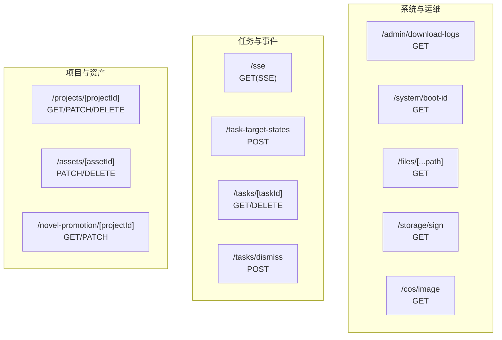
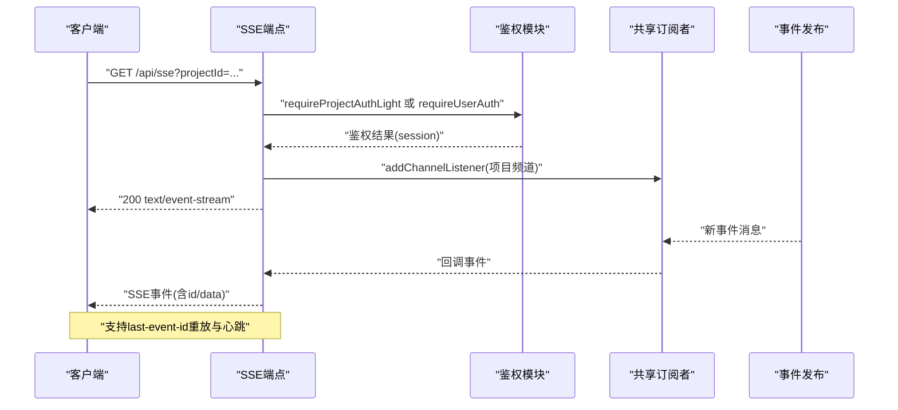
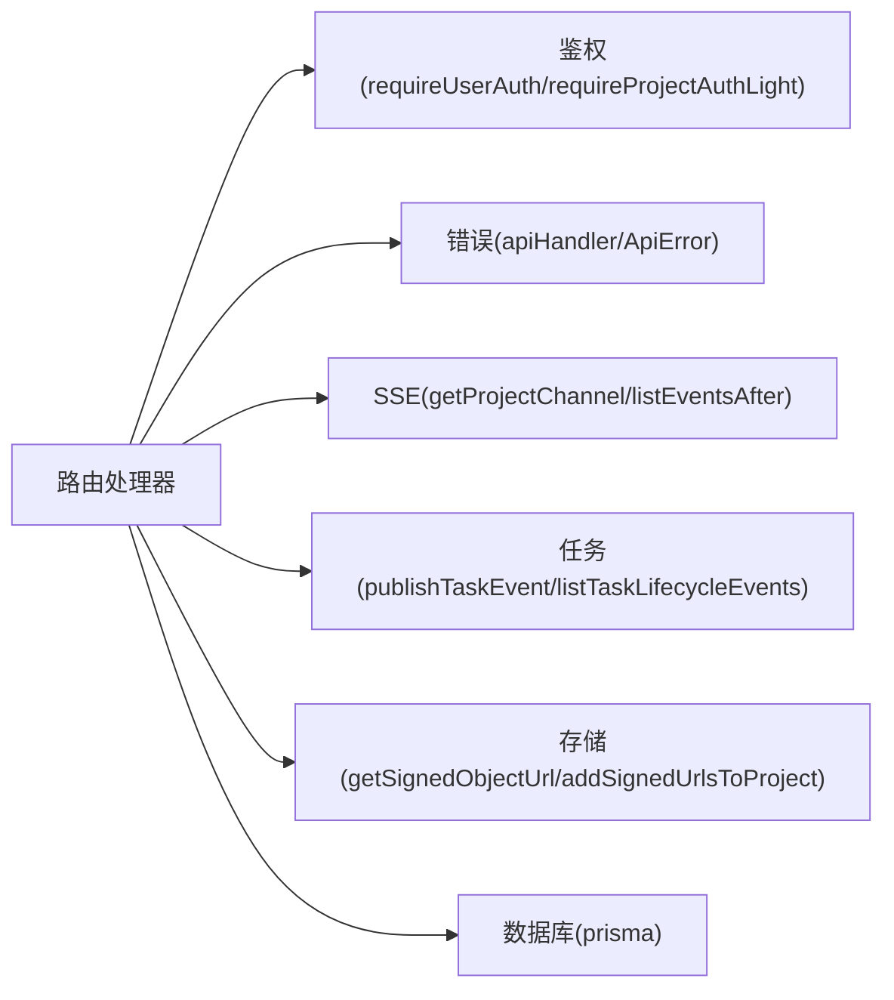

# 系统服务API

<cite>
**本文档引用的文件**
- [src/app/api/admin/download-logs/route.ts](file://src/app/api/admin/download-logs/route.ts)
- [src/app/api/sse/route.ts](file://src/app/api/sse/route.ts)
- [src/app/api/storage/sign/route.ts](file://src/app/api/storage/sign/route.ts)
- [src/app/api/system/boot-id/route.ts](file://src/app/api/system/boot-id/route.ts)
- [src/app/api/task-target-states/route.ts](file://src/app/api/task-target-states/route.ts)
- [src/app/api/cos/image/route.ts](file://src/app/api/cos/image/route.ts)
- [src/app/api/files/[...path]/route.ts](file://src/app/api/files/[...path]/route.ts)
- [src/app/api/assets/[assetId]/route.ts](file://src/app/api/assets/[assetId]/route.ts)
- [src/app/api/novel-promotion/[projectId]/route.ts](file://src/app/api/novel-promotion/[projectId]/route.ts)
- [src/app/api/tasks/[taskId]/route.ts](file://src/app/api/tasks/[taskId]/route.ts)
- [src/app/api/tasks/dismiss/route.ts](file://src/app/api/tasks/dismiss/route.ts)
- [src/app/api/projects/[projectId]/route.ts](file://src/app/api/projects/[projectId]/route.ts)
</cite>

## 目录
1. [简介](#简介)
2. [项目结构](#项目结构)
3. [核心组件](#核心组件)
4. [架构总览](#架构总览)
5. [详细组件分析](#详细组件分析)
6. [依赖关系分析](#依赖关系分析)
7. [性能与可扩展性](#性能与可扩展性)
8. [故障排查指南](#故障排查指南)
9. [结论](#结论)
10. [附录](#附录)

## 简介
本文件面向系统运维与基础设施服务，系统性梳理后端提供的RESTful API，覆盖以下能力域：
- 日志下载：管理员下载全量运行日志
- 服务器发送事件（SSE）：实时推送任务生命周期事件
- 存储签名与COS图片服务：生成对象存储临时访问链接
- 系统引导ID：检测服务器重启
- 任务目标状态查询：批量查询任务目标当前状态
- 文件上传下载：本地文件服务（STORAGE_TYPE=local）
- 项目与资产：项目信息、资产更新/删除、小说推广项目配置
- 任务管理：任务详情、取消、批量忽略失败任务
- 权限与安全：统一鉴权策略与错误处理

本文件提供每个端点的HTTP方法、URL模式、请求参数、响应格式、错误码与典型调用示例（含curl与JavaScript/TypeScript），并给出运维与安全建议。

## 项目结构
系统API主要位于Next.js App Router的约定式路由中，按功能域组织在src/app/api下，例如：
- 系统与运维：/admin、/system、/files、/storage/sign、/cos/image
- 任务与事件：/tasks、/task-target-states、/sse
- 项目与资产：/projects、/assets、/novel-promotion
- 用户与会话：/user（未在本文件中展开）

图表来源
- [src/app/api/admin/download-logs/route.ts:1-29](file://src/app/api/admin/download-logs/route.ts#L1-L29)
- [src/app/api/system/boot-id/route.ts:1-11](file://src/app/api/system/boot-id/route.ts#L1-L11)
- [src/app/api/files/[...path]/route.ts](file://src/app/api/files/[...path]/route.ts#L1-L83)
- [src/app/api/storage/sign/route.ts:1-22](file://src/app/api/storage/sign/route.ts#L1-L22)
- [src/app/api/cos/image/route.ts:1-16](file://src/app/api/cos/image/route.ts#L1-L16)
- [src/app/api/sse/route.ts:1-207](file://src/app/api/sse/route.ts#L1-L207)
- [src/app/api/task-target-states/route.ts:1-72](file://src/app/api/task-target-states/route.ts#L1-L72)
- [src/app/api/tasks/[taskId]/route.ts](file://src/app/api/tasks/[taskId]/route.ts#L1-L89)
- [src/app/api/tasks/dismiss/route.ts:1-26](file://src/app/api/tasks/dismiss/route.ts#L1-L26)
- [src/app/api/projects/[projectId]/route.ts](file://src/app/api/projects/[projectId]/route.ts#L1-L263)
- [src/app/api/assets/[assetId]/route.ts](file://src/app/api/assets/[assetId]/route.ts#L1-L110)
- [src/app/api/novel-promotion/[projectId]/route.ts](file://src/app/api/novel-promotion/[projectId]/route.ts#L1-L346)

章节来源
- [src/app/api/admin/download-logs/route.ts:1-29](file://src/app/api/admin/download-logs/route.ts#L1-L29)
- [src/app/api/sse/route.ts:1-207](file://src/app/api/sse/route.ts#L1-L207)
- [src/app/api/storage/sign/route.ts:1-22](file://src/app/api/storage/sign/route.ts#L1-L22)
- [src/app/api/system/boot-id/route.ts:1-11](file://src/app/api/system/boot-id/route.ts#L1-L11)
- [src/app/api/task-target-states/route.ts:1-72](file://src/app/api/task-target-states/route.ts#L1-L72)
- [src/app/api/cos/image/route.ts:1-16](file://src/app/api/cos/image/route.ts#L1-L16)
- [src/app/api/files/[...path]/route.ts](file://src/app/api/files/[...path]/route.ts#L1-L83)
- [src/app/api/assets/[assetId]/route.ts](file://src/app/api/assets/[assetId]/route.ts#L1-L110)
- [src/app/api/novel-promotion/[projectId]/route.ts](file://src/app/api/novel-promotion/[projectId]/route.ts#L1-L346)
- [src/app/api/tasks/[taskId]/route.ts](file://src/app/api/tasks/[taskId]/route.ts#L1-L89)
- [src/app/api/tasks/dismiss/route.ts:1-26](file://src/app/api/tasks/dismiss/route.ts#L1-L26)
- [src/app/api/projects/[projectId]/route.ts](file://src/app/api/projects/[projectId]/route.ts#L1-L263)

## 核心组件
- 统一鉴权与错误处理
  - 鉴权：requireUserAuth、requireProjectAuthLight、isErrorResponse
  - 错误：ApiError、apiHandler包装器
- 任务与事件
  - 任务生命周期事件发布与订阅、SSE事件格式化
- 存储与COS
  - 对象存储签名URL生成、COS图片服务代理
- 项目与资产
  - 项目信息、资产更新/删除、小说推广项目配置

章节来源
- [src/app/api/sse/route.ts:1-207](file://src/app/api/sse/route.ts#L1-L207)
- [src/app/api/storage/sign/route.ts:1-22](file://src/app/api/storage/sign/route.ts#L1-L22)
- [src/app/api/projects/[projectId]/route.ts](file://src/app/api/projects/[projectId]/route.ts#L1-L263)
- [src/app/api/assets/[assetId]/route.ts](file://src/app/api/assets/[assetId]/route.ts#L1-L110)
- [src/app/api/novel-promotion/[projectId]/route.ts](file://src/app/api/novel-promotion/[projectId]/route.ts#L1-L346)

## 架构总览
系统API采用Next.js App Router约定式路由，结合中间件与服务层实现鉴权、事件流与存储签名。SSE通道基于共享订阅者向客户端推送任务事件；存储签名通过统一服务生成临时URL；项目与资产操作受统一鉴权保护。

图表来源
- [src/app/api/sse/route.ts:92-206](file://src/app/api/sse/route.ts#L92-L206)

## 详细组件分析

### 日志下载（/admin/download-logs）
- 方法与路径
  - GET /api/admin/download-logs
- 权限
  - 需要用户认证
- 请求参数
  - 无
- 响应
  - 200 text/plain; 以附件形式下载日志文本
  - 404 当无可下载日志
- 错误
  - 认证失败或内部错误由apiHandler统一处理
- curl示例
  - curl -H "Cookie: session=..." https://host/api/admin/download-logs -o logs.txt
- JavaScript/TypeScript示例
  - fetch("/api/admin/download-logs").then(r => r.blob()).then(b => saveAs(new Blob([b]), "logs.txt"))

章节来源
- [src/app/api/admin/download-logs/route.ts:1-29](file://src/app/api/admin/download-logs/route.ts#L1-L29)

### 服务器引导ID（/system/boot-id）
- 方法与路径
  - GET /api/system/boot-id
- 权限
  - 无需认证
- 请求参数
  - 无
- 响应
  - 200 JSON { bootId: string }
- curl示例
  - curl https://host/api/system/boot-id
- JavaScript/TypeScript示例
  - const r = await fetch("/api/system/boot-id"); const { bootId } = await r.json();

章节来源
- [src/app/api/system/boot-id/route.ts:1-11](file://src/app/api/system/boot-id/route.ts#L1-L11)

### 存储签名（/storage/sign）
- 方法与路径
  - GET /api/storage/sign?key=...&expires=...
- 权限
  - 无需认证
- 请求参数
  - key: 必填，对象键
  - expires: 可选，过期秒数，默认3600
- 响应
  - 302 Found，Location为带签名的URL
  - 400 当缺少key
- curl示例
  - curl -L "https://host/api/storage/sign?key=xxx&expires=1800"
- JavaScript/TypeScript示例
  - window.location.href = "/api/storage/sign?key=...&expires=...";

章节来源
- [src/app/api/storage/sign/route.ts:1-22](file://src/app/api/storage/sign/route.ts#L1-L22)

### COS图片服务（/cos/image）
- 方法与路径
  - GET /api/cos/image?key=...&expires=...
- 权限
  - 无需认证
- 请求参数
  - key: 必填，对象键
  - expires: 可选，过期秒数，默认3600
- 响应
  - 302 Found，内部重定向至/storage/sign
- curl示例
  - curl -L "https://host/api/cos/image?key=xxx&expires=1800"
- JavaScript/TypeScript示例
  - window.location.href = "/api/cos/image?key=...&expires=...";

章节来源
- [src/app/api/cos/image/route.ts:1-16](file://src/app/api/cos/image/route.ts#L1-L16)

### 本地文件服务（/files/[...path]）
- 方法与路径
  - GET /api/files/{path}
- 权限
  - 无需认证
- 请求参数
  - 路径参数：[...path]，解码后拼接至UPLOAD_DIR
- 安全
  - 路径逃逸防护：限制在UPLOAD_DIR内
- 响应
  - 200 + Content-Type + 缓存头
  - 403 路径逃逸
  - 404 文件不存在
  - 500 内部错误
- curl示例
  - curl -O "https://host/api/files/path/to/file.png"
- JavaScript/TypeScript示例
  - fetch("/api/files/media/xxx.jpg").then(r => r.arrayBuffer());

章节来源
- [src/app/api/files/[...path]/route.ts](file://src/app/api/files/[...path]/route.ts#L1-L83)

### 任务目标状态（/task-target-states）
- 方法与路径
  - POST /api/task-target-states
- 权限
  - 项目轻量鉴权或用户认证（当projectId为global-asset-hub时）
- 请求体
  - projectId: string
  - targets: 数组，每项包含
    - targetType: string
    - targetId: string
    - types?: string[]
- 限制
  - targets最多500项
- 响应
  - 200 JSON { states: [...] }
- 错误
  - 400 INVALID_PARAMS
- curl示例
  - curl -X POST https://host/api/task-target-states -H "Content-Type: application/json" -d '{"projectId":"proj-1","targets":[{"targetType":"character","targetId":"char-1","types":["appearance"]}]}'
- JavaScript/TypeScript示例
  - const r = await fetch("/api/task-target-states", { method: "POST", body: JSON.stringify({ projectId, targets }) });

章节来源
- [src/app/api/task-target-states/route.ts:1-72](file://src/app/api/task-target-states/route.ts#L1-L72)

### 实时事件推送（/sse）
- 方法与路径
  - GET /api/sse?projectId=...&episodeId=...
- 权限
  - 项目轻量鉴权；当projectId为global-asset-hub时需要用户认证
- 请求参数
  - projectId: 必填
  - episodeId: 可选
  - last-event-id: 可选，用于重放
- 响应
  - 200 text/event-stream
  - 心跳：event=heartbeat, data={"ts": "..."}
  - 事件：标准SSE事件，包含id与data
- 重放与快照
  - 若提供last-event-id，则回放缺失事件
  - 否则返回当前活跃任务快照
- curl示例
  - curl -N "https://host/api/sse?projectId=p1" --header "Accept: text/event-stream"
- JavaScript/TypeScript示例
  - const es = new EventSource("/api/sse?projectId=p1"); es.onmessage = e => console.log(e.data);

章节来源
- [src/app/api/sse/route.ts:1-207](file://src/app/api/sse/route.ts#L1-L207)

### 任务管理（/tasks/[taskId] 与 /tasks/dismiss）
- /tasks/[taskId]
  - GET：返回任务详情，可选includeEvents与eventsLimit
  - DELETE：取消任务并发布失败事件
- /tasks/dismiss
  - POST：批量忽略失败任务
- 权限
  - 均需用户认证
- curl示例
  - 取消任务：curl -X DELETE https://host/api/tasks/task-1
  - 忽略失败：curl -X POST https://host/api/tasks/dismiss -H "Content-Type: application/json" -d '{"taskIds":["task-1","task-2"]}'
- JavaScript/TypeScript示例
  - fetch("/api/tasks/" + taskId, { method: "DELETE" })

章节来源
- [src/app/api/tasks/[taskId]/route.ts](file://src/app/api/tasks/[taskId]/route.ts#L1-L89)
- [src/app/api/tasks/dismiss/route.ts:1-26](file://src/app/api/tasks/dismiss/route.ts#L1-L26)

### 项目与资产（/projects/[projectId] 与 /assets/[assetId]）
- /projects/[projectId]
  - GET：返回项目基础信息（含签名URL）
  - PATCH：更新项目元数据
  - DELETE：删除项目并清理COS与音色资源
- /assets/[assetId]
  - PATCH：更新资产scope/kind/projectId等
  - DELETE：删除资产（支持全局/项目范围）
- 权限
  - GET/PATCH/DELETE：用户认证
  - PATCH/DELETE：scope为project时需项目轻量鉴权
- curl示例
  - 更新项目：curl -X PATCH https://host/api/projects/proj-1 -H "Content-Type: application/json" -d '{"name":"New Name"}'
  - 删除资产：curl -X DELETE https://host/api/assets/asset-1 -H "Content-Type: application/json" -d '{"scope":"global","kind":"character"}'
- JavaScript/TypeScript示例
  - fetch("/api/projects/" + pid, { method: "PATCH", body: JSON.stringify({ name }) })

章节来源
- [src/app/api/projects/[projectId]/route.ts](file://src/app/api/projects/[projectId]/route.ts#L1-L263)
- [src/app/api/assets/[assetId]/route.ts](file://src/app/api/assets/[assetId]/route.ts#L1-L110)

### 小说推广项目配置（/novel-promotion/[projectId]）
- 方法与路径
  - GET /api/novel-promotion/[projectId]：读取项目配置（含capabilityOverrides）
  - PATCH /api/novel-promotion/[projectId]：更新模型与风格等配置
- 权限
  - 项目轻量鉴权
- 请求体字段
  - analysisModel/characterModel/locationModel/storyboardModel/editModel/videoModel/audioModel
  - videoRatio/artStyle/ttsRate/lipSyncEnabled/lipSyncMode
  - capabilityOverrides：能力选择覆盖（严格校验）
- 响应
  - GET：返回cleaned capabilityOverrides
  - PATCH：返回包含媒体签名URL的完整项目对象
- curl示例
  - curl -X PATCH https://host/api/novel-promotion/proj-1 -H "Content-Type: application/json" -d '{"artStyle":"realistic","videoModel":"provider::model"}'

章节来源
- [src/app/api/novel-promotion/[projectId]/route.ts](file://src/app/api/novel-promotion/[projectId]/route.ts#L1-L346)

## 依赖关系分析
- 鉴权与错误
  - requireUserAuth / requireProjectAuthLight / isErrorResponse
  - apiHandler包裹所有处理器，统一抛出ApiError
- 任务与事件
  - getProjectChannel / listEventsAfter / getSharedSubscriber
  - listActiveLifecycleSnapshot / publishTaskEvent
- 存储
  - getSignedObjectUrl / addSignedUrlsToProject / deleteObjects
- 数据访问
  - prisma（项目、任务、novelPromotionProject等）

图表来源
- [src/app/api/sse/route.ts:1-207](file://src/app/api/sse/route.ts#L1-L207)
- [src/app/api/storage/sign/route.ts:1-22](file://src/app/api/storage/sign/route.ts#L1-L22)
- [src/app/api/projects/[projectId]/route.ts](file://src/app/api/projects/[projectId]/route.ts#L1-L263)

## 性能与可扩展性
- SSE
  - 心跳每15秒一次，避免代理超时
  - 支持last-event-id重放，减少重复推送
  - 回放上限5000条，快照默认500条
- 存储签名
  - 默认过期1小时，可根据场景调整expires
- 任务状态查询
  - targets数量限制500，避免单次请求过大
- 本地文件服务
  - 1年缓存，减少重复读取
- 建议
  - 在高并发SSE场景下，合理设置代理缓冲与超时
  - 对大文件签名URL设置更短过期时间
  - 对批量任务状态查询进行分批处理

[本节为通用指导，无需列出章节来源]

## 故障排查指南
- 400 INVALID_PARAMS
  - 检查必填参数（如key、projectId、targets）
  - 检查参数类型与长度限制
- 401/403
  - 确认登录态与项目权限
  - global-asset-hub需要用户认证
- 404
  - 日志为空、文件不存在、任务不存在
- 5xx
  - 查看服务端日志与堆栈
  - 检查存储服务连通性与签名密钥
- SSE断连
  - 检查代理配置与last-event-id
  - 确认项目频道订阅正常

章节来源
- [src/app/api/admin/download-logs/route.ts:1-29](file://src/app/api/admin/download-logs/route.ts#L1-L29)
- [src/app/api/files/[...path]/route.ts](file://src/app/api/files/[...path]/route.ts#L1-L83)
- [src/app/api/tasks/[taskId]/route.ts](file://src/app/api/tasks/[taskId]/route.ts#L1-L89)
- [src/app/api/sse/route.ts:1-207](file://src/app/api/sse/route.ts#L1-L207)

## 结论
本文档系统梳理了系统服务相关的RESTful API，覆盖日志、SSE、存储签名、系统引导ID、任务目标状态、文件服务、项目与资产、任务管理与小说推广配置等。通过统一鉴权与错误处理机制，配合SSE事件流与存储签名，形成完整的运维与基础设施服务能力。建议在生产环境中结合代理配置、缓存策略与安全策略，确保稳定性与安全性。

[本节为总结，无需列出章节来源]

## 附录

### API一览表
- /api/admin/download-logs
  - GET：下载日志
- /api/system/boot-id
  - GET：获取引导ID
- /api/storage/sign
  - GET：生成对象存储签名URL
- /api/cos/image
  - GET：COS图片服务代理
- /api/files/[...path]
  - GET：本地文件服务
- /api/task-target-states
  - POST：批量查询任务目标状态
- /api/sse
  - GET：SSE事件流
- /api/tasks/[taskId]
  - GET/DELETE：任务详情与取消
- /api/tasks/dismiss
  - POST：批量忽略失败任务
- /api/projects/[projectId]
  - GET/PATCH/DELETE：项目信息与删除
- /api/assets/[assetId]
  - PATCH/DELETE：资产更新与删除
- /api/novel-promotion/[projectId]
  - GET/PATCH：小说推广项目配置

[本节为概览，无需列出章节来源]