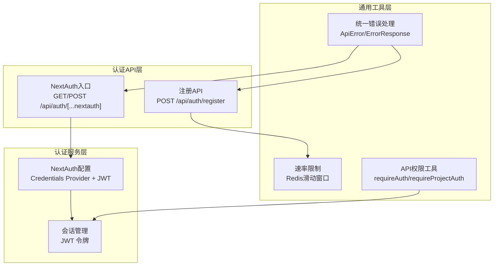
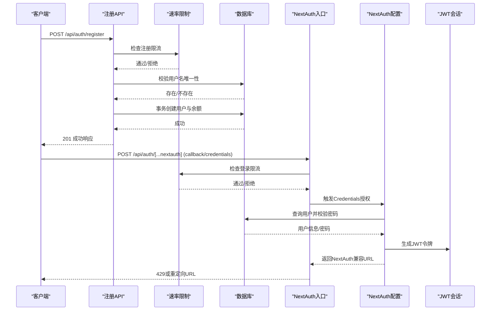
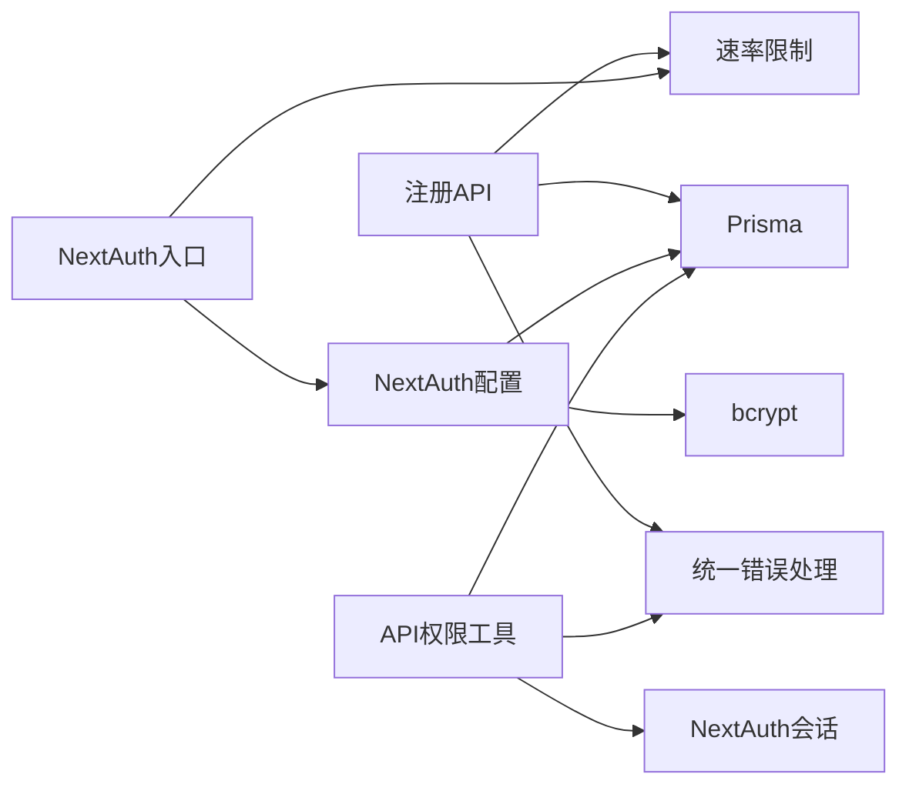

# 认证授权API

<cite>
**本文引用的文件**
- [src/app/api/auth/register/route.ts](file://src/app/api/auth/register/route.ts)
- [src/app/api/auth/[...nextauth]/route.ts](file://src/app/api/auth/[...nextauth]/route.ts)
- [src/lib/auth.ts](file://src/lib/auth.ts)
- [src/lib/api-auth.ts](file://src/lib/api-auth.ts)
- [src/lib/api-errors.ts](file://src/lib/api-errors.ts)
- [src/lib/rate-limit.ts](file://src/lib/rate-limit.ts)
- [src/middleware.ts](file://src/middleware.ts)
</cite>

## 目录
1. [简介](#简介)
2. [项目结构](#项目结构)
3. [核心组件](#核心组件)
4. [架构总览](#架构总览)
5. [详细组件分析](#详细组件分析)
6. [依赖关系分析](#依赖关系分析)
7. [性能考量](#性能考量)
8. [故障排查指南](#故障排查指南)
9. [结论](#结论)
10. [附录](#附录)

## 简介
本文件为认证授权相关API的权威文档，覆盖以下能力：
- 用户注册与登录（用户名/密码）
- 第三方认证（NextAuth）与会话管理
- 会话令牌与权限校验
- 速率限制与安全防护
- 端到端认证流程（注册 → 登录 → 会话维护）

文档同时提供各端点的HTTP方法、URL模式、请求参数、响应格式、错误码与示例调用方式（curl与JavaScript/TypeScript），帮助开发者快速集成。

## 项目结构
认证授权相关的核心文件分布如下：
- 注册API：src/app/api/auth/register/route.ts
- NextAuth入口：src/app/api/auth/[...nextauth]/route.ts
- NextAuth配置：src/lib/auth.ts
- API权限工具：src/lib/api-auth.ts
- API统一错误处理：src/lib/api-errors.ts
- 速率限制：src/lib/rate-limit.ts
- 国际化中间件：src/middleware.ts

图表来源
- [src/app/api/auth/register/route.ts:1-88](file://src/app/api/auth/register/route.ts#L1-L88)
- [src/app/api/auth/[...nextauth]/route.ts:1-51](file://src/app/api/auth/[...nextauth]/route.ts#L1-L51)
- [src/lib/auth.ts:1-79](file://src/lib/auth.ts#L1-L79)
- [src/lib/api-auth.ts:1-355](file://src/lib/api-auth.ts#L1-L355)
- [src/lib/api-errors.ts:1-571](file://src/lib/api-errors.ts#L1-L571)
- [src/lib/rate-limit.ts:1-146](file://src/lib/rate-limit.ts#L1-L146)

章节来源
- [src/app/api/auth/register/route.ts:1-88](file://src/app/api/auth/register/route.ts#L1-L88)
- [src/app/api/auth/[...nextauth]/route.ts:1-51](file://src/app/api/auth/[...nextauth]/route.ts#L1-L51)
- [src/lib/auth.ts:1-79](file://src/lib/auth.ts#L1-L79)
- [src/lib/api-auth.ts:1-355](file://src/lib/api-auth.ts#L1-L355)
- [src/lib/api-errors.ts:1-571](file://src/lib/api-errors.ts#L1-L571)
- [src/lib/rate-limit.ts:1-146](file://src/lib/rate-limit.ts#L1-L146)
- [src/middleware.ts:1-28](file://src/middleware.ts#L1-L28)

## 核心组件
- 注册API：接收用户名与密码，进行输入校验、去重、密码哈希与事务创建用户及余额记录。
- NextAuth入口：对登录回调进行IP限流保护，兼容NextAuth客户端响应格式；其余NextAuth内部路由透传。
- NextAuth配置：基于Prisma Adapter与Credentials Provider，使用JWT策略管理会话。
- API权限工具：提供会话获取、用户级与项目级权限校验、错误响应构建。
- 统一错误处理：封装ApiError与ErrorResponse，标准化错误响应结构。
- 速率限制：基于Redis的滑动窗口实现，针对登录/注册提供不同阈值。

章节来源
- [src/app/api/auth/register/route.ts:8-87](file://src/app/api/auth/register/route.ts#L8-L87)
- [src/app/api/auth/[...nextauth]/route.ts:19-44](file://src/app/api/auth/[...nextauth]/route.ts#L19-L44)
- [src/lib/auth.ts:8-79](file://src/lib/auth.ts#L8-L79)
- [src/lib/api-auth.ts:173-292](file://src/lib/api-auth.ts#L173-L292)
- [src/lib/api-errors.ts:396-438](file://src/lib/api-errors.ts#L396-L438)
- [src/lib/rate-limit.ts:58-118](file://src/lib/rate-limit.ts#L58-L118)

## 架构总览
认证授权的整体交互流程如下：

图表来源
- [src/app/api/auth/register/route.ts:8-87](file://src/app/api/auth/register/route.ts#L8-L87)
- [src/app/api/auth/[...nextauth]/route.ts:19-44](file://src/app/api/auth/[...nextauth]/route.ts#L19-L44)
- [src/lib/auth.ts:22-54](file://src/lib/auth.ts#L22-L54)
- [src/lib/rate-limit.ts:58-118](file://src/lib/rate-limit.ts#L58-L118)

## 详细组件分析

### 注册API（POST /api/auth/register）
- 功能：创建新用户，校验用户名与密码长度，防重复，密码哈希，事务创建用户与初始余额。
- 输入参数（JSON）：
  - name（必填，字符串）
  - password（必填，字符串，长度≥6）
- 成功响应（201 Created）：
  - message（字符串）
  - user.id（字符串）
  - user.name（字符串）
- 错误响应（400/429）：
  - INVALID_PARAMS：缺少参数或密码过短、用户名已存在
  - RATE_LIMIT：请求过于频繁
- 速率限制：每IP 60秒最多3次
- 安全要点：密码使用高成本哈希；事务保证用户与余额记录一致性

章节来源
- [src/app/api/auth/register/route.ts:8-87](file://src/app/api/auth/register/route.ts#L8-L87)
- [src/lib/rate-limit.ts:41-45](file://src/lib/rate-limit.ts#L41-L45)
- [src/lib/api-errors.ts:396-438](file://src/lib/api-errors.ts#L396-L438)

### 登录API（POST /api/auth/[...nextauth]）
- 功能：NextAuth登录回调，对用户名/密码认证进行IP限流保护，返回NextAuth兼容的URL。
- 限流范围：仅对callback/credentials路径生效，其他NextAuth内部路由不限流。
- 成功响应：NextResponse.json({ url: "...?callbackUrl..." })
- 错误响应（429）：返回NextAuth兼容的错误URL（包含error=RateLimited），包含Retry-After头
- 安全要点：限流防止暴力破解；兼容NextAuth客户端解析

章节来源
- [src/app/api/auth/[...nextauth]/route.ts:19-44](file://src/app/api/auth/[...nextauth]/route.ts#L19-L44)
- [src/lib/rate-limit.ts:35-45](file://src/lib/rate-limit.ts#L35-L45)
- [src/lib/auth.ts:15-55](file://src/lib/auth.ts#L15-L55)

### NextAuth配置（Credentials Provider + JWT）
- 提供商：Credentials Provider，字段为username/password
- 授权流程：查询用户、校验密码、记录日志、返回用户信息
- 会话策略：JWT，回调注入用户ID到token与session
- Cookie策略：根据环境自动选择是否使用Secure Cookie

章节来源
- [src/lib/auth.ts:15-79](file://src/lib/auth.ts#L15-L79)

### API权限工具（会话与权限）
- 会话获取：优先内部任务令牌，其次NextAuth服务器会话
- 用户级权限：requireUserAuth，返回会话或401
- 项目级权限：requireProjectAuth，校验所有权与必要数据存在
- 错误响应：统一构建，包含code/message/details等

章节来源
- [src/lib/api-auth.ts:173-355](file://src/lib/api-auth.ts#L173-L355)

### 统一错误处理（ApiError/ErrorResponse）
- ApiError：封装错误码、HTTP状态、可重试标记、用户消息键
- apiHandler：包裹路由，统一日志、审计、错误归一化与响应头注入
- 错误码映射：包含UNAUTHORIZED/FORBIDDEN/INVALID_PARAMS/RATE_LIMIT等

章节来源
- [src/lib/api-errors.ts:396-562](file://src/lib/api-errors.ts#L396-L562)

### 速率限制（Redis滑动窗口）
- 配置：登录（60s内5次）、注册（60s内3次）
- 实现：Lua脚本原子清理过期、计数与TTL，Redis不可用时降级放行
- IP提取：优先x-forwarded-for/x-real-ip，回退到本地地址

章节来源
- [src/lib/rate-limit.ts:35-146](file://src/lib/rate-limit.ts#L35-L146)

## 依赖关系分析
- 注册API依赖速率限制与统一错误处理，使用Prisma进行事务写入。
- NextAuth入口依赖速率限制与NextAuth配置，NextAuth配置依赖Prisma Adapter与bcrypt。
- API权限工具依赖NextAuth会话、Prisma与错误规范，提供多层级权限校验。
- 统一错误处理贯穿所有API，提供一致的错误语义与审计。

图表来源
- [src/app/api/auth/register/route.ts:1-88](file://src/app/api/auth/register/route.ts#L1-L88)
- [src/app/api/auth/[...nextauth]/route.ts:1-51](file://src/app/api/auth/[...nextauth]/route.ts#L1-L51)
- [src/lib/auth.ts:1-79](file://src/lib/auth.ts#L1-L79)
- [src/lib/api-auth.ts:1-355](file://src/lib/api-auth.ts#L1-L355)
- [src/lib/api-errors.ts:1-571](file://src/lib/api-errors.ts#L1-L571)
- [src/lib/rate-limit.ts:1-146](file://src/lib/rate-limit.ts#L1-L146)

## 性能考量
- Redis限流：滑动窗口原子操作，低延迟；Redis不可用时降级放行，保障系统可用性。
- 密码哈希：使用高成本参数，提升抗暴力破解能力，但增加CPU开销。
- 事务写入：注册同时创建用户与余额，减少往返，降低并发冲突概率。
- 日志与审计：统一请求ID与审计开关，便于追踪与性能分析。

## 故障排查指南
- 登录429错误：检查x-forwarded-for/x-real-ip是否正确传递；确认Redis可用性；查看Retry-After头。
- 注册400错误：确认name与password参数齐全且满足长度要求；检查用户名是否已存在。
- 会话无效：确认Cookie是否随请求发送；检查NextAUTH_URL协议与Secure Cookie策略。
- 权限401/403：确认请求头携带正确的会话令牌；检查项目ID归属与必要数据是否存在。

章节来源
- [src/lib/rate-limit.ts:98-118](file://src/lib/rate-limit.ts#L98-L118)
- [src/lib/api-errors.ts:504-558](file://src/lib/api-errors.ts#L504-L558)
- [src/lib/api-auth.ts:184-191](file://src/lib/api-auth.ts#L184-L191)

## 结论
本认证授权体系以NextAuth为核心，结合自研速率限制与统一错误处理，提供了安全、可观测、易扩展的认证授权能力。注册与登录流程清晰，权限校验覆盖用户级与项目级场景，适合在生产环境中稳定运行。

## 附录

### API端点一览与调用示例

- 注册
  - 方法：POST
  - 路径：/api/auth/register
  - 请求体（JSON）：{ name, password }
  - 成功响应（201）：{ message, user: { id, name } }
  - 错误响应（400/429）：统一错误结构
  - 示例（curl）：curl -X POST https://your-host/api/auth/register -H "Content-Type: application/json" -d '{"name":"alice","password":"securepwd"}'

- 登录（NextAuth）
  - 方法：POST
  - 路径：/api/auth/[...nextauth]（回调：callback/credentials）
  - 请求体（表单）：username, password
  - 成功响应：{ url }（包含callbackUrl）
  - 错误响应（429）：{ url }（包含error=RateLimited），带Retry-After头
  - 示例（curl）：curl -X POST https://your-host/api/auth/[...nextauth] -d 'username=alice&password=securepwd'

- JavaScript/TypeScript（NextAuth客户端）
  - 使用NextAuth提供的signIn方法，确保客户端能解析返回的URL中的error参数
  - 参考：NextAuth入口对登录回调的限流与兼容处理

章节来源
- [src/app/api/auth/register/route.ts:8-87](file://src/app/api/auth/register/route.ts#L8-L87)
- [src/app/api/auth/[...nextauth]/route.ts:19-44](file://src/app/api/auth/[...nextauth]/route.ts#L19-L44)

### 会话令牌与权限控制

- 会话策略：JWT
- 令牌位置：由NextAuth管理（浏览器Cookie或自定义存储，取决于部署）
- 权限控制：
  - requireAuth：要求登录
  - requireUserAuth：用户级API权限
  - requireProjectAuth：项目级API权限（含关联数据按需加载）
- 错误码：UNAUTHORIZED/FORBIDDEN/NOT_FOUND等

章节来源
- [src/lib/auth.ts:56-79](file://src/lib/auth.ts#L56-L79)
- [src/lib/api-auth.ts:184-292](file://src/lib/api-auth.ts#L184-L292)
- [src/lib/api-errors.ts:372-392](file://src/lib/api-errors.ts#L372-L392)

### 速率限制配置

- 登录：60秒内最多5次
- 注册：60秒内最多3次
- IP提取：x-forwarded-for → x-real-ip → 本地回环

章节来源
- [src/lib/rate-limit.ts:35-45](file://src/lib/rate-limit.ts#L35-L45)
- [src/lib/rate-limit.ts:128-145](file://src/lib/rate-limit.ts#L128-L145)