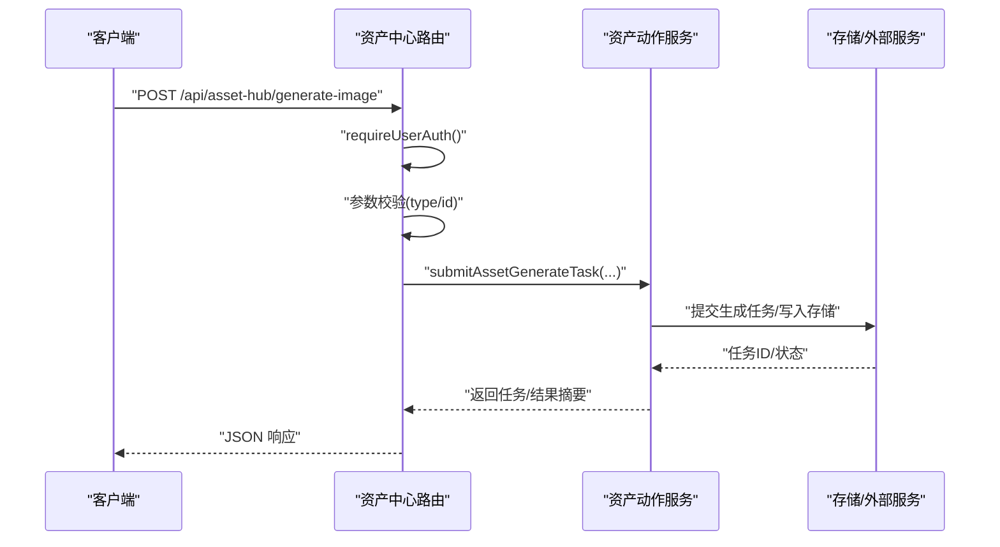
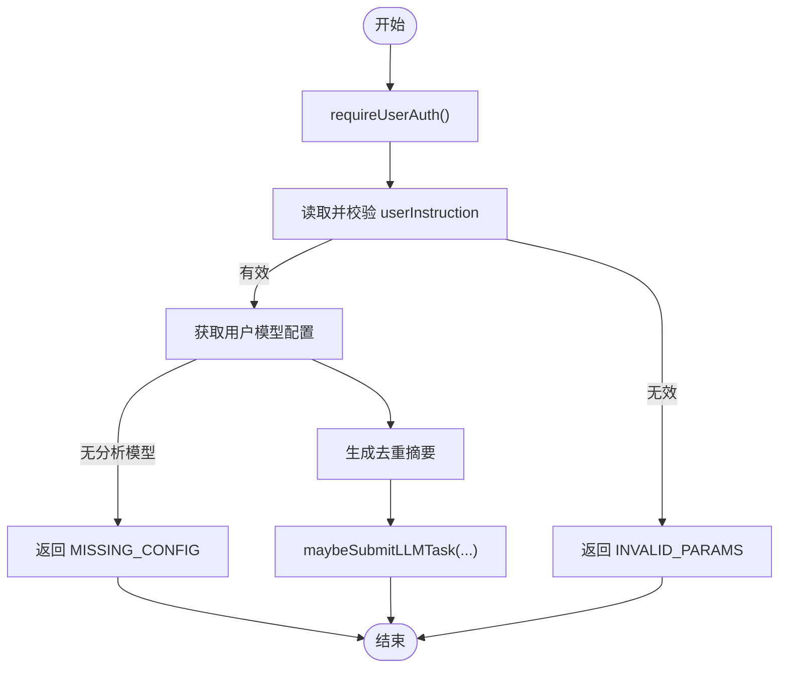
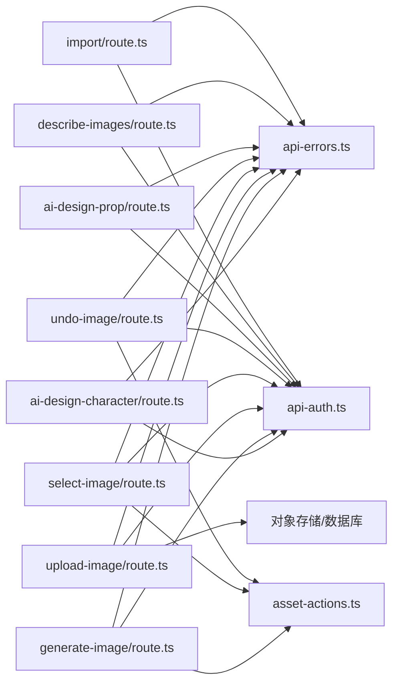
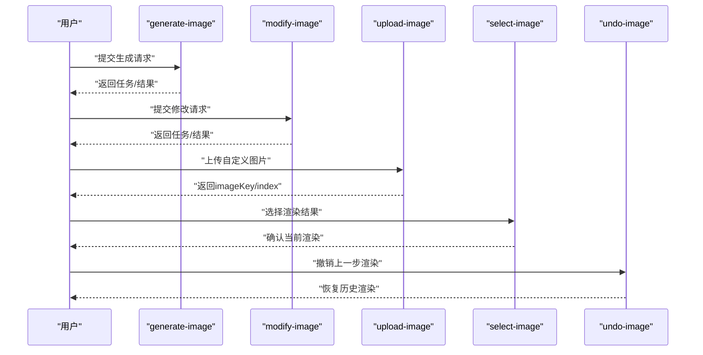

# 资产中心API

<cite>
**本文引用的文件**
- [src/app/api/asset-hub/ai-design-character/route.ts](file://src/app/api/asset-hub/ai-design-character/route.ts)
- [src/app/api/asset-hub/ai-design-location/route.ts](file://src/app/api/asset-hub/ai-design-location/route.ts)
- [src/app/api/asset-hub/ai-design-prop/route.ts](file://src/app/api/asset-hub/ai-design-prop/route.ts)
- [src/app/api/asset-hub/ai-modify-character/route.ts](file://src/app/api/asset-hub/ai-modify-character/route.ts)
- [src/app/api/asset-hub/ai-modify-location/route.ts](file://src/app/api/asset-hub/ai-modify-location/route.ts)
- [src/app/api/asset-hub/ai-modify-prop/route.ts](file://src/app/api/asset-hub/ai-modify-prop/route.ts)
- [src/app/api/asset-hub/describe-images/route.ts](file://src/app/api/asset-hub/describe-images/route.ts)
- [src/app/api/asset-hub/generate-image/route.ts](file://src/app/api/asset-hub/generate-image/route.ts)
- [src/app/api/asset-hub/import/route.ts](file://src/app/api/asset-hub/import/route.ts)
- [src/app/api/asset-hub/modify-image/route.ts](file://src/app/api/asset-hub/modify-image/route.ts)
- [src/app/api/asset-hub/upload-image/route.ts](file://src/app/api/asset-hub/upload-image/route.ts)
- [src/app/api/asset-hub/select-image/route.ts](file://src/app/api/asset-hub/select-image/route.ts)
- [src/app/api/asset-hub/undo-image/route.ts](file://src/app/api/asset-hub/undo-image/route.ts)
- [src/lib/api-errors.ts](file://src/lib/api-errors.ts)
- [src/lib/api-auth.ts](file://src/lib/api-auth.ts)
- [src/lib/assets/services/asset-actions.ts](file://src/lib/assets/services/asset-actions.ts)
- [tests/contracts/route-catalog.ts](file://tests/contracts/route-catalog.ts)
</cite>

## 更新摘要
**变更内容**
- 新增AI设计道具端点(ai-design-prop)，完善AI设计功能覆盖角色、场景和道具
- 新增图像描述端点(describe-images)，支持视觉模型分析图片并返回文字描述
- 新增导入端点(import)，提供批量资产导入和冲突检测功能
- 更新项目结构图表，反映新增的三个端点
- 增强详细组件分析，包含三个新端点的完整说明

## 目录
1. [简介](#简介)
2. [项目结构](#项目结构)
3. [核心组件](#核心组件)
4. [架构总览](#架构总览)
5. [详细组件分析](#详细组件分析)
6. [依赖关系分析](#依赖关系分析)
7. [性能与并发特性](#性能与并发特性)
8. [故障排查指南](#故障排查指南)
9. [结论](#结论)
10. [附录](#附录)

## 简介
本文件为"资产中心"相关RESTful API的权威文档，覆盖以下功能域：
- AI设计角色、场景与道具：ai-design-character、ai-design-location、ai-design-prop
- AI修改角色、场景与道具：ai-modify-character、ai-modify-location、ai-modify-prop
- 图像生成与修改：generate-image、modify-image
- 图像上传、选择与撤销：upload-image、select-image、undo-image
- 图像描述分析：describe-images
- 资产导入与管理：import
- 全局资产共享与同步：assets/sync-to-global（见附录）

文档逐项说明每个端点的HTTP方法、URL模式、请求参数、响应格式、错误码与典型调用流程，并提供curl与JavaScript/TypeScript调用示例路径，帮助开发者快速集成。

## 项目结构
资产中心API位于Next.js App Router的路由约定下，采用"按功能分层"的组织方式：
- 路由入口集中在 src/app/api/asset-hub 下，每个子目录对应一个端点
- 通用鉴权与错误处理封装在 src/lib/api-auth.ts 与 src/lib/api-errors.ts
- 图像生成/修改/选择/撤销的核心业务逻辑委托给 src/lib/assets/services/asset-actions.ts
- 测试契约中包含资产中心路由清单，便于一致性校验

```mermaid
graph TB
subgraph "资产中心API"
A1["ai-design-character<br/>POST /api/asset-hub/ai-design-character"]
A2["ai-design-location<br/>POST /api/asset-hub/ai-design-location"]
A3["ai-design-prop<br/>POST /api/asset-hub/ai-design-prop"]
A4["ai-modify-character<br/>POST /api/asset-hub/ai-modify-character"]
A5["ai-modify-location<br/>POST /api/asset-hub/ai-modify-location"]
A6["ai-modify-prop<br/>POST /api/asset-hub/ai-modify-prop"]
A7["describe-images<br/>POST /api/asset-hub/describe-images"]
A8["generate-image<br/>POST /api/asset-hub/generate-image"]
A9["modify-image<br/>POST /api/asset-hub/modify-image"]
A10["import<br/>POST /api/asset-hub/import"]
A11["upload-image<br/>POST /api/asset-hub/upload-image"]
A12["select-image<br/>POST /api/asset-hub/select-image"]
A13["undo-image<br/>POST /api/asset-hub/undo-image"]
end
subgraph "通用层"
U1["鉴权 requireUserAuth"]
U2["错误处理 apiErrors"]
end
A1 --> U1
A2 --> U1
A3 --> U1
A4 --> U1
A5 --> U1
A6 --> U1
A7 --> U1
A8 --> U1
A9 --> U1
A10 --> U1
A11 --> U1
A12 --> U1
A13 --> U1
A8 --> S1["资产动作服务 asset-actions"]
A9 --> S1
A12 --> S1
A13 --> S1
```

**图表来源**
- [src/app/api/asset-hub/ai-design-character/route.ts:12-51](file://src/app/api/asset-hub/ai-design-character/route.ts#L12-L51)
- [src/app/api/asset-hub/ai-design-location/route.ts:12-51](file://src/app/api/asset-hub/ai-design-location/route.ts#L12-L51)
- [src/app/api/asset-hub/ai-design-prop/route.ts:12-51](file://src/app/api/asset-hub/ai-design-prop/route.ts#L12-L51)
- [src/app/api/asset-hub/ai-modify-character/route.ts:13-45](file://src/app/api/asset-hub/ai-modify-character/route.ts#L13-L45)
- [src/app/api/asset-hub/ai-modify-location/route.ts:13-50](file://src/app/api/asset-hub/ai-modify-location/route.ts#L13-L50)
- [src/app/api/asset-hub/ai-modify-prop/route.ts:8-58](file://src/app/api/asset-hub/ai-modify-prop/route.ts#L8-L58)
- [src/app/api/asset-hub/describe-images/route.ts:11-44](file://src/app/api/asset-hub/describe-images/route.ts#L11-L44)
- [src/app/api/asset-hub/generate-image/route.ts:11-32](file://src/app/api/asset-hub/generate-image/route.ts#L11-L32)
- [src/app/api/asset-hub/import/route.ts:264-309](file://src/app/api/asset-hub/import/route.ts#L264-L309)
- [src/app/api/asset-hub/modify-image/route.ts:11-32](file://src/app/api/asset-hub/modify-image/route.ts#L11-L32)
- [src/app/api/asset-hub/upload-image/route.ts:46-189](file://src/app/api/asset-hub/upload-image/route.ts#L46-L189)
- [src/app/api/asset-hub/select-image/route.ts:11-31](file://src/app/api/asset-hub/select-image/route.ts#L11-L31)
- [src/app/api/asset-hub/undo-image/route.ts:11-31](file://src/app/api/asset-hub/undo-image/route.ts#L11-L31)
- [src/lib/api-auth.ts:306-313](file://src/lib/api-auth.ts#L306-L313)
- [src/lib/api-errors.ts:440-562](file://src/lib/api-errors.ts#L440-L562)
- [src/lib/assets/services/asset-actions.ts](file://src/lib/assets/services/asset-actions.ts)

**章节来源**
- [tests/contracts/route-catalog.ts:29-55](file://tests/contracts/route-catalog.ts#L29-L55)

## 核心组件
- 鉴权中间件
  - requireUserAuth：用于用户级资产中心API的会话校验，返回会话或错误响应
  - isErrorResponse：类型守卫，用于判断鉴权结果是否为错误响应
- 错误处理
  - apiHandler：统一包装器，负责请求ID、审计日志、流式进度事件、错误归一化与响应格式化
  - ApiError/throwApiError：统一错误对象与抛出机制
  - API_ERROR_CODES：标准错误码映射（如 INVALID_PARAMS、NOT_FOUND、MISSING_CONFIG 等）
- 资产动作服务
  - submitAssetGenerateTask / submitAssetModifyTask / selectAssetRender / revertAssetRender：图像类操作的业务编排入口

**章节来源**
- [src/lib/api-auth.ts:306-313](file://src/lib/api-auth.ts#L306-L313)
- [src/lib/api-errors.ts:372-420](file://src/lib/api-errors.ts#L372-L420)
- [src/lib/api-errors.ts:440-562](file://src/lib/api-errors.ts#L440-L562)
- [src/lib/assets/services/asset-actions.ts](file://src/lib/assets/services/asset-actions.ts)

## 架构总览
资产中心API遵循"路由层-服务层-存储/外部服务"的分层架构：
- 路由层：各端点解析请求、进行参数校验与鉴权
- 服务层：调用资产动作服务提交任务或执行图像选择/撤销
- 存储/外部服务：图像上传写入对象存储；AI任务通过任务系统异步执行

**图表来源**
- [src/app/api/asset-hub/generate-image/route.ts:11-32](file://src/app/api/asset-hub/generate-image/route.ts#L11-L32)
- [src/lib/assets/services/asset-actions.ts](file://src/lib/assets/services/asset-actions.ts)

## 详细组件分析

### AI设计角色：ai-design-character
- 方法与路径
  - POST /api/asset-hub/ai-design-character
- 请求体
  - userInstruction: string（必填，将被清理前后空白）
- 成功响应
  - 通常返回任务提交结果（具体字段以任务系统为准）
- 错误码
  - INVALID_PARAMS：缺少userInstruction
  - MISSING_CONFIG：用户未配置分析模型
  - 其他：ApiError统一错误包装
- 鉴权与幂等
  - 使用 requireUserAuth；基于用户+指令生成去重摘要
- 调用流程图

**图表来源**
- [src/app/api/asset-hub/ai-design-character/route.ts:12-51](file://src/app/api/asset-hub/ai-design-character/route.ts#L12-L51)
- [src/lib/api-auth.ts:306-313](file://src/lib/api-auth.ts#L306-L313)

**章节来源**
- [src/app/api/asset-hub/ai-design-character/route.ts:12-51](file://src/app/api/asset-hub/ai-design-character/route.ts#L12-L51)

### AI设计场景：ai-design-location
- 方法与路径
  - POST /api/asset-hub/ai-design-location
- 请求体
  - userInstruction: string（必填）
- 成功响应
  - 任务提交结果
- 错误码
  - INVALID_PARAMS、MISSING_CONFIG、ApiError
- 鉴权与幂等
  - requireUserAuth；基于用户+指令生成去重摘要

**章节来源**
- [src/app/api/asset-hub/ai-design-location/route.ts:12-51](file://src/app/api/asset-hub/ai-design-location/route.ts#L12-L51)

### AI设计道具：ai-design-prop
- 方法与路径
  - POST /api/asset-hub/ai-design-prop
- 请求体
  - userInstruction: string（必填，将被清理前后空白）
- 成功响应
  - 任务提交结果
- 错误码
  - INVALID_PARAMS：缺少userInstruction
  - MISSING_CONFIG：用户未配置分析模型
  - 其他：ApiError统一错误包装
- 鉴权与幂等
  - 使用 requireUserAuth；基于用户+指令生成去重摘要
- 功能特点
  - 完善AI设计功能覆盖角色、场景和道具三个维度
  - 支持通过视觉模型分析道具外观并生成详细描述
- 调用流程图

**图表来源**
- [src/app/api/asset-hub/ai-design-prop/route.ts:12-51](file://src/app/api/asset-hub/ai-design-prop/route.ts#L12-L51)
- [src/lib/api-auth.ts:306-313](file://src/lib/api-auth.ts#L306-L313)

**章节来源**
- [src/app/api/asset-hub/ai-design-prop/route.ts:12-51](file://src/app/api/asset-hub/ai-design-prop/route.ts#L12-L51)

### AI修改角色：ai-modify-character
- 方法与路径
  - POST /api/asset-hub/ai-modify-character
- 请求体
  - characterId: string（必填）
  - appearanceIndex: number（必填，非负整数）
  - currentDescription: string（必填）
  - modifyInstruction: string（必填）
- 成功响应
  - 任务提交结果
- 错误码
  - INVALID_PARAMS：参数缺失或非法
  - NOT_FOUND：角色不存在或不属于当前用户
- 鉴权与幂等
  - requireUserAuth；校验角色归属；基于角色与外观索引生成去重键

**章节来源**
- [src/app/api/asset-hub/ai-modify-character/route.ts:13-45](file://src/app/api/asset-hub/ai-modify-character/route.ts#L13-L45)

### AI修改场景：ai-modify-location
- 方法与路径
  - POST /api/asset-hub/ai-modify-location
- 请求体
  - locationId: string（必填）
  - imageIndex: number（必填）
  - currentDescription: string（必填）
  - modifyInstruction: string（必填）
- 成功响应
  - 任务提交结果
- 错误码
  - INVALID_PARAMS、NOT_FOUND
- 鉴权与幂等
  - requireUserAuth；校验场景归属；基于场景与图像索引生成去重键

**章节来源**
- [src/app/api/asset-hub/ai-modify-location/route.ts:13-50](file://src/app/api/asset-hub/ai-modify-location/route.ts#L13-L50)

### AI修改道具：ai-modify-prop
- 方法与路径
  - POST /api/asset-hub/ai-modify-prop
- 请求体
  - propId: string（必填）
  - variantId: string（可选，变体ID）
  - currentDescription: string（必填）
  - modifyInstruction: string（必填）
- 成功响应
  - 任务提交结果
- 错误码
  - INVALID_PARAMS、NOT_FOUND
- 鉴权与幂等
  - requireUserAuth；校验道具归属（按用户+道具类型过滤）；基于propId/variantId生成去重键

**章节来源**
- [src/app/api/asset-hub/ai-modify-prop/route.ts:8-58](file://src/app/api/asset-hub/ai-modify-prop/route.ts#L8-L58)

### 图像描述：describe-images
- 方法与路径
  - POST /api/asset-hub/describe-images
- 请求体
  - imageUrls: string[]（必填，至少一个）
  - type: 'prop' | 'location' | 'character'（可选，默认为prop）
- 成功响应
  - JSON：{ description: string }
- 错误码
  - INVALID_PARAMS：缺少imageUrls或为空数组
  - MISSING_CONFIG：用户未配置分析模型
- 功能特点
  - 使用视觉模型分析参考图，返回详细文字描述
  - 支持道具(prop)和场景(location)两种描述模式
  - 自动限制最多3张图片进行分析
- 鉴权与作用域
  - requireUserAuth；scope='global'

**章节来源**
- [src/app/api/asset-hub/describe-images/route.ts:11-44](file://src/app/api/asset-hub/describe-images/route.ts#L11-L44)

### 图像生成：generate-image
- 方法与路径
  - POST /api/asset-hub/generate-image
- 请求体
  - type: 'character' | 'location'（必填）
  - id: string（必填，非空）
  - 其他字段透传至资产动作服务
- 成功响应
  - JSON：包含任务/生成结果摘要
- 错误码
  - INVALID_PARAMS：type/id非法
- 鉴权与作用域
  - requireUserAuth；访问范围scope='global'，绑定当前用户ID

**章节来源**
- [src/app/api/asset-hub/generate-image/route.ts:11-32](file://src/app/api/asset-hub/generate-image/route.ts#L11-L32)

### 图像修改：modify-image
- 方法与路径
  - POST /api/asset-hub/modify-image
- 请求体
  - type: 'character' | 'location'（必填）
  - id: string（必填，非空）
  - 其他字段透传至资产动作服务
- 成功响应
  - JSON：包含任务/修改结果摘要
- 错误码
  - INVALID_PARAMS：type/id非法
- 鉴权与作用域
  - requireUserAuth；scope='global'

**章节来源**
- [src/app/api/asset-hub/modify-image/route.ts:11-32](file://src/app/api/asset-hub/modify-image/route.ts#L11-L32)

### 导入：import
- 方法与路径
  - POST /api/asset-hub/import
- 请求体
  - mode: 'detect' | 'execute'（必填）
  - assets: ImportAsset[]（必填，至少一个）
  - resolutions: Record<number, 'skip' | 'overwrite'>（可选）
- ImportAsset结构
  - kind: 'character' | 'location' | 'prop' | 'voice'（必填）
  - name: string（必填）
  - folderName: string（可选）
  - profileData: string（可选，角色专用）
  - summary: string（可选，场景/道具专用）
  - description: string（可选，语音专用）
  - artStyle: string（可选，场景/道具专用）
  - appearances: Array<{ description: string, artStyle?: string }>（可选，角色专用）
  - voiceType: string（可选，语音专用）
  - voiceId: string（可选，语音专用）
  - gender: string（可选，语音专用）
  - language: string（可选，默认'zh'）
- 成功响应
  - 检测模式：{ mode: 'detect', total: number, conflictCount: number, conflicts: Record<number, ConflictInfo> }
  - 执行模式：{ mode: 'execute', total: number, created: number, updated: number, skipped: number }
- 错误码
  - INVALID_PARAMS：请求体格式错误或资产验证失败
  - 其他：ApiError统一错误包装
- 功能特点
  - 支持批量资产导入和冲突检测
  - 自动检测同名资产冲突
  - 支持跳过或覆盖现有资产
  - 自动创建文件夹和默认数据
- 鉴权与作用域
  - requireUserAuth；scope='global'

**章节来源**
- [src/app/api/asset-hub/import/route.ts:264-309](file://src/app/api/asset-hub/import/route.ts#L264-L309)

### 图像上传：upload-image
- 方法与路径
  - POST /api/asset-hub/upload-image
- 表单字段
  - file: File（必填）
  - type: 'character' | 'location'（必填）
  - id: string（必填）
  - appearanceIndex: string | null（当type=character时必填）
  - imageIndex: string | null（当type=location时可选）
  - labelText: string（当type=location时必填）
- 成功响应
  - JSON：{ success: true, imageKey: string, imageIndex: number }
- 错误码
  - INVALID_PARAMS：缺少必要字段
  - NOT_FOUND：目标资源不存在或无权限
- 处理逻辑
  - 读取文件并压缩为JPEG
  - 写入对象存储，生成唯一key
  - 角色：更新外观记录的imageUrls/selectedIndex，并保留历史版本
  - 场景：根据imageIndex更新或新增场景图像记录，设置isSelected

**章节来源**
- [src/app/api/asset-hub/upload-image/route.ts:46-189](file://src/app/api/asset-hub/upload-image/route.ts#L46-L189)

### 图像选择：select-image
- 方法与路径
  - POST /api/asset-hub/select-image
- 请求体
  - type: 'character' | 'location'（必填）
  - id: string（必填，非空）
  - 其他字段透传至资产动作服务
- 成功响应
  - JSON：包含渲染选择结果摘要
- 错误码
  - INVALID_PARAMS：type/id非法
- 鉴权与作用域
  - requireUserAuth；scope='global'

**章节来源**
- [src/app/api/asset-hub/select-image/route.ts:11-31](file://src/app/api/asset-hub/select-image/route.ts#L11-L31)

### 图像撤销：undo-image
- 方法与路径
  - POST /api/asset-hub/undo-image
- 请求体
  - type: 'character' | 'location'（必填）
  - id: string（必填，非空）
  - 其他字段透传至资产动作服务
- 成功响应
  - JSON：包含撤销结果摘要
- 错误码
  - INVALID_PARAMS：type/id非法
- 鉴权与作用域
  - requireUserAuth；scope='global'

**章节来源**
- [src/app/api/asset-hub/undo-image/route.ts:11-31](file://src/app/api/asset-hub/undo-image/route.ts#L11-L31)

### 全局资产共享：assets/sync-to-global
- 方法与路径
  - POST /api/assets/sync-to-global
- 功能概述
  - 将项目内资产同步至全局资产库，供资产中心跨项目使用
- 鉴权与作用域
  - requireUserAuth；scope='global'
- 注意
  - 该端点不在本次文档逐一展开的资产中心子路由清单中，但属于资产中心生态的一部分

**章节来源**
- [tests/contracts/route-catalog.ts:29-55](file://tests/contracts/route-catalog.ts#L29-L55)

## 依赖关系分析
- 路由层对通用层的依赖
  - requireUserAuth：统一鉴权
  - apiHandler：统一错误处理与审计
- 路由层对服务层的依赖
  - submitAssetGenerateTask / submitAssetModifyTask / selectAssetRender / revertAssetRender：图像类操作
- 服务层对存储/外部服务的依赖
  - 对象存储上传、任务系统提交

**图表来源**
- [src/app/api/asset-hub/ai-design-character/route.ts:12-51](file://src/app/api/asset-hub/ai-design-character/route.ts#L12-L51)
- [src/app/api/asset-hub/ai-design-prop/route.ts:12-51](file://src/app/api/asset-hub/ai-design-prop/route.ts#L12-L51)
- [src/app/api/asset-hub/describe-images/route.ts:11-44](file://src/app/api/asset-hub/describe-images/route.ts#L11-L44)
- [src/app/api/asset-hub/import/route.ts:264-309](file://src/app/api/asset-hub/import/route.ts#L264-L309)
- [src/app/api/asset-hub/generate-image/route.ts:11-32](file://src/app/api/asset-hub/generate-image/route.ts#L11-L32)
- [src/app/api/asset-hub/upload-image/route.ts:46-189](file://src/app/api/asset-hub/upload-image/route.ts#L46-L189)
- [src/app/api/asset-hub/select-image/route.ts:11-31](file://src/app/api/asset-hub/select-image/route.ts#L11-L31)
- [src/app/api/asset-hub/undo-image/route.ts:11-31](file://src/app/api/asset-hub/undo-image/route.ts#L11-L31)
- [src/lib/api-errors.ts:440-562](file://src/lib/api-errors.ts#L440-L562)
- [src/lib/api-auth.ts:306-313](file://src/lib/api-auth.ts#L306-L313)
- [src/lib/assets/services/asset-actions.ts](file://src/lib/assets/services/asset-actions.ts)

## 性能与并发特性
- 异步任务化
  - AI设计/修改类端点通过任务系统提交，避免长连接阻塞，适合大模型推理
- 幂等与去重
  - 基于用户ID+输入特征生成去重摘要，降低重复任务提交
- 图像上传优化
  - 上传前压缩为JPEG，减少存储与传输成本
- 错误与审计
  - 统一日志与审计标记，便于定位慢请求与失败重试
- 批量处理
  - 导入端点支持批量资产处理，提高导入效率

## 故障排查指南
- 常见错误码
  - INVALID_PARAMS：请求体字段缺失或非法
  - NOT_FOUND：目标资源不存在或无权限
  - MISSING_CONFIG：用户未配置所需模型
  - UNAUTHORIZED/FORBIDDEN：未登录或越权
- 排查步骤
  - 确认鉴权头与Cookie有效
  - 检查请求体字段类型与长度
  - 查看响应中的错误码与retryable标志
  - 关注x-request-id，结合服务端日志定位
- 任务类问题
  - 若返回任务ID，请通过任务系统查询状态与错误详情
- 导入问题
  - 使用detect模式先检测冲突，再决定执行策略
  - 检查资产名称和类型的有效性

**章节来源**
- [src/lib/api-errors.ts:372-420](file://src/lib/api-errors.ts#L372-L420)
- [src/lib/api-auth.ts:145-163](file://src/lib/api-auth.ts#L145-L163)

## 结论
资产中心API以"任务化+服务化"为核心设计，既保证了AI生成/修改的异步能力，又通过统一鉴权与错误处理提升了稳定性与可观测性。新增的AI设计道具、图像描述和导入功能进一步完善了资产中心的能力体系，形成了从AI创意到人工微调再到最终确认的完整工作流。图像类操作（生成、修改、上传、选择、撤销）与新增功能相互配合，满足现代创作项目的多样化需求。

## 附录

### API调用流程（端到端：从AI生成到手动编辑再到确认）

**图表来源**
- [src/app/api/asset-hub/generate-image/route.ts:11-32](file://src/app/api/asset-hub/generate-image/route.ts#L11-L32)
- [src/app/api/asset-hub/modify-image/route.ts:11-32](file://src/app/api/asset-hub/modify-image/route.ts#L11-L32)
- [src/app/api/asset-hub/upload-image/route.ts:46-189](file://src/app/api/asset-hub/upload-image/route.ts#L46-L189)
- [src/app/api/asset-hub/select-image/route.ts:11-31](file://src/app/api/asset-hub/select-image/route.ts#L11-L31)
- [src/app/api/asset-hub/undo-image/route.ts:11-31](file://src/app/api/asset-hub/undo-image/route.ts#L11-L31)

### curl 示例（示例路径）
- AI设计角色
  - curl -X POST "$BASE_URL/api/asset-hub/ai-design-character" -H "Authorization: Bearer $TOKEN" -H "Content-Type: application/json" -d '{"userInstruction":"..."}'
- AI设计场景
  - curl -X POST "$BASE_URL/api/asset-hub/ai-design-location" -H "Authorization: Bearer $TOKEN" -H "Content-Type: application/json" -d '{"userInstruction":"..."}'
- AI设计道具
  - curl -X POST "$BASE_URL/api/asset-hub/ai-design-prop" -H "Authorization: Bearer $TOKEN" -H "Content-Type: application/json" -d '{"userInstruction":"..."}'
- AI修改角色
  - curl -X POST "$BASE_URL/api/asset-hub/ai-modify-character" -H "Authorization: Bearer $TOKEN" -H "Content-Type: application/json" -d '{"characterId":"...","appearanceIndex":0,"currentDescription":"...","modifyInstruction":"..."}'
- AI修改场景
  - curl -X POST "$BASE_URL/api/asset-hub/ai-modify-location" -H "Authorization: Bearer $TOKEN" -H "Content-Type: application/json" -d '{"locationId":"...","imageIndex":0,"currentDescription":"...","modifyInstruction":"..."}'
- AI修改道具
  - curl -X POST "$BASE_URL/api/asset-hub/ai-modify-prop" -H "Authorization: Bearer $TOKEN" -H "Content-Type: application/json" -d '{"propId":"...","currentDescription":"...","modifyInstruction":"..."}'
- 图像描述
  - curl -X POST "$BASE_URL/api/asset-hub/describe-images" -H "Authorization: Bearer $TOKEN" -H "Content-Type: application/json" -d '{"imageUrls":["https://example.com/image1.jpg"],"type":"prop"}'
- 图像生成
  - curl -X POST "$BASE_URL/api/asset-hub/generate-image" -H "Authorization: Bearer $TOKEN" -H "Content-Type: application/json" -d '{"type":"character","id":"..."}'
- 图像修改
  - curl -X POST "$BASE_URL/api/asset-hub/modify-image" -H "Authorization: Bearer $TOKEN" -H "Content-Type: application/json" -d '{"type":"location","id":"..."}'
- 导入
  - curl -X POST "$BASE_URL/api/asset-hub/import" -H "Authorization: Bearer $TOKEN" -H "Content-Type: application/json" -d '{"mode":"detect","assets":[{"kind":"character","name":"Test Character"}]}'
- 图像上传
  - curl -F "file=@./image.jpg" -F "type=character" -F "id=CHAR_123" -F "appearanceIndex=0" -F "imageIndex=0" "$BASE_URL/api/asset-hub/upload-image" -H "Authorization: Bearer $TOKEN"
- 图像选择
  - curl -X POST "$BASE_URL/api/asset-hub/select-image" -H "Authorization: Bearer $TOKEN" -H "Content-Type: application/json" -d '{"type":"character","id":"..."}'
- 图像撤销
  - curl -X POST "$BASE_URL/api/asset-hub/undo-image" -H "Authorization: Bearer $TOKEN" -H "Content-Type: application/json" -d '{"type":"location","id":"..."}'

### JavaScript/TypeScript 调用示例（示例路径）
- 通用fetch封装与鉴权
  - 参考：[src/lib/api-auth.ts:306-313](file://src/lib/api-auth.ts#L306-L313)
- 统一错误处理
  - 参考：[src/lib/api-errors.ts:440-562](file://src/lib/api-errors.ts#L440-L562)
- 图像生成/修改/选择/撤销
  - 参考：[src/app/api/asset-hub/generate-image/route.ts:11-32](file://src/app/api/asset-hub/generate-image/route.ts#L11-L32)
  - 参考：[src/app/api/asset-hub/modify-image/route.ts:11-32](file://src/app/api/asset-hub/modify-image/route.ts#L11-L32)
  - 参考：[src/app/api/asset-hub/select-image/route.ts:11-31](file://src/app/api/asset-hub/select-image/route.ts#L11-L31)
  - 参考：[src/app/api/asset-hub/undo-image/route.ts:11-31](file://src/app/api/asset-hub/undo-image/route.ts#L11-L31)

### 资产ID参数使用说明
- 角色/场景/道具ID
  - 在AI修改与图像类操作中，均以 id/characterId/locationId/propId 作为目标标识
  - 上传图像时，角色需提供appearanceIndex，场景可提供imageIndex或自动追加
- 作用域
  - 所有资产中心API默认作用域为全局（scope='global'），绑定当前用户ID
- 导入功能
  - 支持批量导入多种类型的资产（角色、场景、道具、语音）
  - 自动检测同名冲突并提供解决策略

**章节来源**
- [src/app/api/asset-hub/ai-modify-character/route.ts:18-30](file://src/app/api/asset-hub/ai-modify-character/route.ts#L18-L30)
- [src/app/api/asset-hub/ai-modify-location/route.ts:18-30](file://src/app/api/asset-hub/ai-modify-location/route.ts#L18-L30)
- [src/app/api/asset-hub/ai-modify-prop/route.ts:13-36](file://src/app/api/asset-hub/ai-modify-prop/route.ts#L13-L36)
- [src/app/api/asset-hub/generate-image/route.ts:20-29](file://src/app/api/asset-hub/generate-image/route.ts#L20-L29)
- [src/app/api/asset-hub/modify-image/route.ts:20-29](file://src/app/api/asset-hub/modify-image/route.ts#L20-L29)
- [src/app/api/asset-hub/select-image/route.ts:20-28](file://src/app/api/asset-hub/select-image/route.ts#L20-L28)
- [src/app/api/asset-hub/undo-image/route.ts:20-28](file://src/app/api/asset-hub/undo-image/route.ts#L20-L28)
- [src/app/api/asset-hub/import/route.ts:264-309](file://src/app/api/asset-hub/import/route.ts#L264-L309)