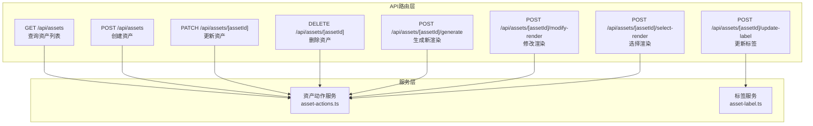
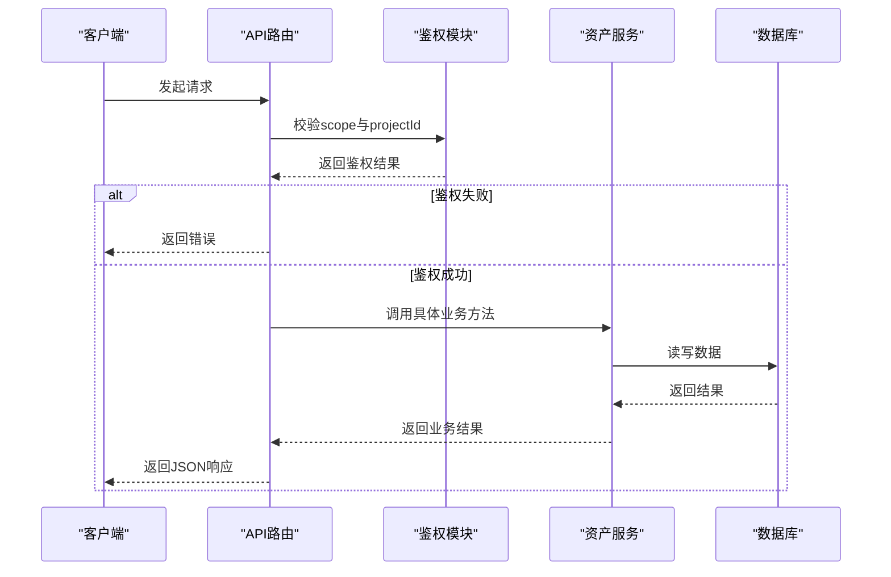
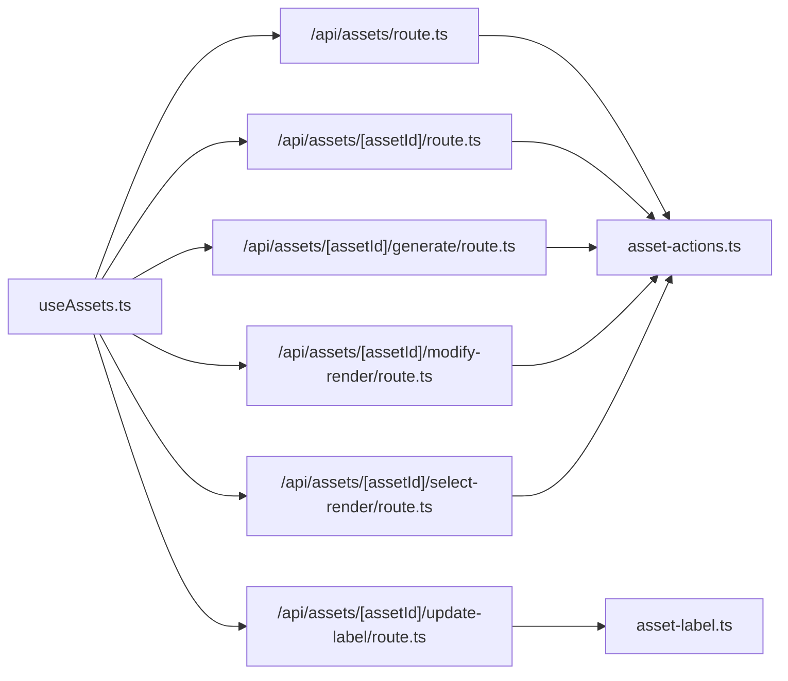
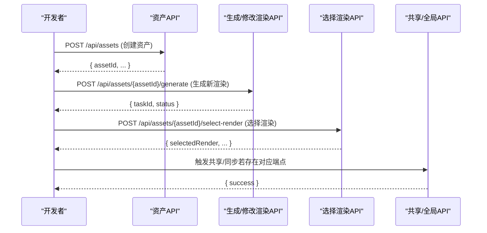

# 资产管理系统API

<cite>
**本文引用的文件**
- [src/app/api/assets/route.ts](file://src/app/api/assets/route.ts)
- [src/app/api/assets/[assetId]/route.ts](file://src/app/api/assets/[assetId]/route.ts)
- [src/app/api/assets/[assetId]/generate/route.ts](file://src/app/api/assets/[assetId]/generate/route.ts)
- [src/app/api/assets/[assetId]/modify-render/route.ts](file://src/app/api/assets/[assetId]/modify-render/route.ts)
- [src/app/api/assets/[assetId]/select-render/route.ts](file://src/app/api/assets/[assetId]/select-render/route.ts)
- [src/app/api/assets/[assetId]/update-label/route.ts](file://src/app/api/assets/[assetId]/update-label/route.ts)
- [src/lib/query/hooks/useAssets.ts](file://src/lib/query/hooks/useAssets.ts)
- [src/lib/assets/services/asset-actions.ts](file://src/lib/assets/services/asset-actions.ts)
</cite>

## 目录
1. [简介](#简介)
2. [项目结构](#项目结构)
3. [核心组件](#核心组件)
4. [架构总览](#架构总览)
5. [详细组件分析](#详细组件分析)
6. [依赖关系分析](#依赖关系分析)
7. [性能考虑](#性能考虑)
8. [故障排查指南](#故障排查指南)
9. [结论](#结论)
10. [附录](#附录)

## 简介
本文件为资产管理系统相关API的权威文档，覆盖资产的增删改查、生成新版本（渲染）、修改渲染、选择渲染、更新标签、同步到全局等能力。文档逐项说明HTTP方法、URL模式、请求参数、响应格式与错误处理，并给出端到端的资产生命周期管理流程（从创建到版本管理再到共享使用）。同时提供curl示例与JavaScript/TypeScript调用参考路径，帮助开发者快速集成。

## 项目结构
资产管理系统API主要位于Next.js App Router的路由层，按资源域划分：
- 资产聚合与基础操作：/api/assets
- 单个资产操作：/api/assets/[assetId]/*
- 前端调用封装：React Query Hooks与服务层

图表来源
- [src/app/api/assets/route.ts:16-53](file://src/app/api/assets/route.ts#L16-L53)
- [src/app/api/assets/[assetId]/route.ts](file://src/app/api/assets/[assetId]/route.ts#L21-L60)
- [src/app/api/assets/[assetId]/generate/route.ts](file://src/app/api/assets/[assetId]/generate/route.ts#L13-L52)
- [src/app/api/assets/[assetId]/modify-render/route.ts](file://src/app/api/assets/[assetId]/modify-render/route.ts#L13-L52)
- [src/app/api/assets/[assetId]/select-render/route.ts](file://src/app/api/assets/[assetId]/select-render/route.ts#L13-L50)
- [src/app/api/assets/[assetId]/update-label/route.ts](file://src/app/api/assets/[assetId]/update-label/route.ts#L18-L49)
- [src/lib/assets/services/asset-actions.ts:369-373](file://src/lib/assets/services/asset-actions.ts#L369-L373)

章节来源
- [src/app/api/assets/route.ts:1-101](file://src/app/api/assets/route.ts#L1-L101)
- [src/app/api/assets/[assetId]/route.ts](file://src/app/api/assets/[assetId]/route.ts#L1-L110)
- [src/app/api/assets/[assetId]/generate/route.ts](file://src/app/api/assets/[assetId]/generate/route.ts#L1-L53)
- [src/app/api/assets/[assetId]/modify-render/route.ts](file://src/app/api/assets/[assetId]/modify-render/route.ts#L1-L53)
- [src/app/api/assets/[assetId]/select-render/route.ts](file://src/app/api/assets/[assetId]/select-render/route.ts#L1-L51)
- [src/app/api/assets/[assetId]/update-label/route.ts](file://src/app/api/assets/[assetId]/update-label/route.ts#L1-L50)

## 核心组件
- 资产聚合API：支持按作用域（全局/项目）与类型过滤查询资产列表；支持在项目作用域下进行鉴权。
- 单资产API：支持更新与删除；支持在项目作用域下进行鉴权。
- 渲染管线API：生成新渲染、修改渲染、选择渲染，均支持全局/项目作用域与鉴权。
- 标签API：更新资产渲染标签，支持全局/项目作用域与鉴权。
- 前端调用封装：通过React Query Hooks统一发起请求、处理鉴权与缓存失效。

章节来源
- [src/app/api/assets/route.ts:16-53](file://src/app/api/assets/route.ts#L16-L53)
- [src/app/api/assets/[assetId]/route.ts](file://src/app/api/assets/[assetId]/route.ts#L21-L60)
- [src/app/api/assets/[assetId]/generate/route.ts](file://src/app/api/assets/[assetId]/generate/route.ts#L13-L52)
- [src/app/api/assets/[assetId]/modify-render/route.ts](file://src/app/api/assets/[assetId]/modify-render/route.ts#L13-L52)
- [src/app/api/assets/[assetId]/select-render/route.ts](file://src/app/api/assets/[assetId]/select-render/route.ts#L13-L50)
- [src/app/api/assets/[assetId]/update-label/route.ts](file://src/app/api/assets/[assetId]/update-label/route.ts#L18-L49)
- [src/lib/query/hooks/useAssets.ts:139-326](file://src/lib/query/hooks/useAssets.ts#L139-L326)

## 架构总览
资产API采用“路由层-服务层”分层设计，路由层负责参数校验、作用域与鉴权，服务层实现业务逻辑与数据持久化。

图表来源
- [src/app/api/assets/route.ts:23-52](file://src/app/api/assets/route.ts#L23-L52)
- [src/app/api/assets/[assetId]/route.ts](file://src/app/api/assets/[assetId]/route.ts#L31-L59)
- [src/app/api/assets/[assetId]/generate/route.ts](file://src/app/api/assets/[assetId]/generate/route.ts#L22-L51)
- [src/app/api/assets/[assetId]/modify-render/route.ts](file://src/app/api/assets/[assetId]/modify-render/route.ts#L22-L50)
- [src/app/api/assets/[assetId]/select-render/route.ts](file://src/app/api/assets/[assetId]/select-render/route.ts#L22-L49)
- [src/app/api/assets/[assetId]/update-label/route.ts](file://src/app/api/assets/[assetId]/update-label/route.ts#L29-L48)
- [src/lib/assets/services/asset-actions.ts:369-373](file://src/lib/assets/services/asset-actions.ts#L369-L373)

## 详细组件分析

### 资产查询与创建（聚合）
- 端点
  - GET /api/assets
  - POST /api/assets
- 请求参数
  - GET 查询参数
    - scope: 全局(global)或项目(project)
    - projectId: 当scope=project时必填
    - folderId: 可选，按文件夹过滤
    - kind: 可选，资产类型（character/location/prop/voice）
  - POST 请求体
    - scope: 必填，global或project
    - kind: 必填，当前可创建类型为location或prop
    - projectId: 当scope=project时必填
    - 其他字段由具体kind决定
- 响应
  - GET: { assets: Asset[] }
  - POST: 创建结果对象（包含新建资产标识与状态）
- 错误
  - INVALID_PARAMS: 参数不合法（如scope或kind非法、project作用域缺少projectId）
  - 认证失败时返回相应错误
- curl示例
  - 查询
    - curl -s "https://your-domain/api/assets?scope=project&projectId=YOUR_PROJECT_ID&kind=location"
  - 创建
    - curl -s -X POST "https://your-domain/api/assets" -H "Content-Type: application/json" -d '{"scope":"project","kind":"location","projectId":"YOUR_PROJECT_ID","name":"示例地点"}'

章节来源
- [src/app/api/assets/route.ts:16-53](file://src/app/api/assets/route.ts#L16-L53)
- [src/app/api/assets/route.ts:65-100](file://src/app/api/assets/route.ts#L65-L100)

### 单资产更新与删除
- 端点
  - PATCH /api/assets/[assetId]
  - DELETE /api/assets/[assetId]
- 请求参数
  - 路径参数
    - assetId: 资产唯一标识
  - 请求体
    - scope: 必填，global或project
    - kind: 必填，资产类型
    - projectId: 当scope=project时必填
    - 其他字段由具体kind决定（更新内容）
- 响应
  - PATCH: 更新结果对象
  - DELETE: 删除结果对象（含success标志）
- 错误
  - INVALID_PARAMS: 参数不合法（scope/kind非法、project作用域缺少projectId）
  - 认证失败时返回相应错误
- curl示例
  - 更新
    - curl -s -X PATCH "https://your-domain/api/assets/YOUR_ASSET_ID" -H "Content-Type: application/json" -d '{"scope":"project","kind":"location","projectId":"YOUR_PROJECT_ID","description":"更新描述"}'
  - 删除
    - curl -s -X DELETE "https://your-domain/api/assets/YOUR_ASSET_ID" -H "Content-Type: application/json" -d '{"scope":"project","kind":"location","projectId":"YOUR_PROJECT_ID"}'

章节来源
- [src/app/api/assets/[assetId]/route.ts](file://src/app/api/assets/[assetId]/route.ts#L21-L60)
- [src/app/api/assets/[assetId]/route.ts](file://src/app/api/assets/[assetId]/route.ts#L72-L109)

### 生成新渲染（版本管理）
- 端点
  - POST /api/assets/[assetId]/generate
- 请求参数
  - 路径参数
    - assetId: 资产唯一标识
  - 请求体
    - scope: 必填，global或project
    - kind: 必填，仅支持character/location/prop
    - projectId: 当scope=project时必填
    - 其他字段由具体kind决定（生成条件）
- 响应
  - 提交任务后的结果对象（包含任务标识与状态）
- 错误
  - INVALID_PARAMS: 参数不合法（scope/kind非法、project作用域缺少projectId）
  - 认证失败时返回相应错误
- curl示例
  - curl -s -X POST "https://your-domain/api/assets/YOUR_ASSET_ID/generate" -H "Content-Type: application/json" -d '{"scope":"project","kind":"character","projectId":"YOUR_PROJECT_ID","prompt":"生成新风格"}'

章节来源
- [src/app/api/assets/[assetId]/generate/route.ts](file://src/app/api/assets/[assetId]/generate/route.ts#L13-L52)
- [src/lib/assets/services/asset-actions.ts:369-373](file://src/lib/assets/services/asset-actions.ts#L369-L373)

### 修改渲染
- 端点
  - POST /api/assets/[assetId]/modify-render
- 请求参数
  - 路径参数
    - assetId: 资产唯一标识
  - 请求体
    - scope: 必填，global或project
    - kind: 必填，仅支持character/location/prop
    - projectId: 当scope=project时必填
    - 其他字段由具体kind决定（修改条件）
- 响应
  - 提交任务后的结果对象（包含任务标识与状态）
- 错误
  - INVALID_PARAMS: 参数不合法（scope/kind非法、project作用域缺少projectId）
  - 认证失败时返回相应错误
- curl示例
  - curl -s -X POST "https://your-domain/api/assets/YOUR_ASSET_ID/modify-render" -H "Content-Type: application/json" -d '{"scope":"project","kind":"location","projectId":"YOUR_PROJECT_ID","style":"写实风格"}'

章节来源
- [src/app/api/assets/[assetId]/modify-render/route.ts](file://src/app/api/assets/[assetId]/modify-render/route.ts#L13-L52)
- [src/lib/assets/services/asset-actions.ts:369-373](file://src/lib/assets/services/asset-actions.ts#L369-L373)

### 选择渲染（版本管理）
- 端点
  - POST /api/assets/[assetId]/select-render
- 请求参数
  - 路径参数
    - assetId: 资产唯一标识
  - 请求体
    - scope: 必填，global或project
    - kind: 必填，仅支持character/location/prop
    - projectId: 当scope=project时必填
    - 其他字段由具体kind决定（选择条件）
- 响应
  - 选择结果对象（包含被选中的渲染信息）
- 错误
  - INVALID_PARAMS: 参数不合法（scope/kind非法、project作用域缺少projectId）
  - 认证失败时返回相应错误
- curl示例
  - curl -s -X POST "https://your-domain/api/assets/YOUR_ASSET_ID/select-render" -H "Content-Type: application/json" -d '{"scope":"project","kind":"prop","projectId":"YOUR_PROJECT_ID","renderIndex":0}'

章节来源
- [src/app/api/assets/[assetId]/select-render/route.ts](file://src/app/api/assets/[assetId]/select-render/route.ts#L13-L50)
- [src/lib/assets/services/asset-actions.ts:369-373](file://src/lib/assets/services/asset-actions.ts#L369-L373)

### 更新标签
- 端点
  - POST /api/assets/[assetId]/update-label
- 请求参数
  - 路径参数
    - assetId: 资产唯一标识
  - 请求体
    - scope: 必填，global或project
    - kind: 必填，仅支持character/location/prop
    - projectId: 当scope=project时必填
    - newName: 必填，新的标签名称
- 响应
  - { success: true }
- 错误
  - INVALID_PARAMS: 参数不合法（scope/kind缺失、project作用域缺少projectId、newName缺失）
  - 认证失败时返回相应错误
- curl示例
  - curl -s -X POST "https://your-domain/api/assets/YOUR_ASSET_ID/update-label" -H "Content-Type: application/json" -d '{"scope":"project","kind":"character","projectId":"YOUR_PROJECT_ID","newName":"新角色名"}'

章节来源
- [src/app/api/assets/[assetId]/update-label/route.ts](file://src/app/api/assets/[assetId]/update-label/route.ts#L18-L49)

### 同步到全局（概念性说明）
- 说明
  - 在当前仓库中未发现直接暴露的“同步到全局”API端点。该能力通常通过前端交互或内部流程触发，不在公开路由层直接暴露。
- 建议
  - 如需实现，请在后端新增对应路由与鉴权逻辑，并遵循现有作用域与权限模型。

[本节为概念性说明，不直接分析具体文件]

## 依赖关系分析
- 路由层依赖鉴权模块与服务层
- 服务层依赖数据库访问与任务提交
- 前端通过React Query Hooks统一发起请求并处理缓存失效

图表来源
- [src/app/api/assets/route.ts:1-101](file://src/app/api/assets/route.ts#L1-L101)
- [src/app/api/assets/[assetId]/route.ts](file://src/app/api/assets/[assetId]/route.ts#L1-L110)
- [src/app/api/assets/[assetId]/generate/route.ts](file://src/app/api/assets/[assetId]/generate/route.ts#L1-L53)
- [src/app/api/assets/[assetId]/modify-render/route.ts](file://src/app/api/assets/[assetId]/modify-render/route.ts#L1-L53)
- [src/app/api/assets/[assetId]/select-render/route.ts](file://src/app/api/assets/[assetId]/select-render/route.ts#L1-L51)
- [src/app/api/assets/[assetId]/update-label/route.ts](file://src/app/api/assets/[assetId]/update-label/route.ts#L1-L50)
- [src/lib/query/hooks/useAssets.ts:139-326](file://src/lib/query/hooks/useAssets.ts#L139-L326)
- [src/lib/assets/services/asset-actions.ts:369-373](file://src/lib/assets/services/asset-actions.ts#L369-L373)

## 性能考虑
- 查询缓存：前端使用React Query进行缓存与失效，建议合理设置staleTime以平衡实时性与性能。
- 批量操作：当前路由层未提供专门的批量API，建议在前端聚合多次单次调用或在后端扩展批量接口。
- 任务异步：生成/修改渲染等操作通过任务系统异步执行，注意处理任务状态轮询与错误重试。

[本节提供通用指导，不直接分析具体文件]

## 故障排查指南
- 常见错误码
  - INVALID_PARAMS: 参数校验失败（scope/kind/projectId/newName缺失或非法）
  - 认证失败：未登录或无权限访问目标作用域
- 排查步骤
  - 检查scope与projectId是否匹配（project作用域必须提供projectId）
  - 确认kind是否在允许范围内（创建/删除限定为location/prop；其他端点支持character/location/prop/voice）
  - 查看响应体中的details字段获取更详细错误信息
- 前端调用
  - 使用React Query Hooks时，确保传入正确的scope与projectId，并在失败时捕获异常

章节来源
- [src/app/api/assets/route.ts:23-25](file://src/app/api/assets/route.ts#L23-L25)
- [src/app/api/assets/[assetId]/route.ts](file://src/app/api/assets/[assetId]/route.ts#L27-L29)
- [src/app/api/assets/[assetId]/generate/route.ts](file://src/app/api/assets/[assetId]/generate/route.ts#L19-L21)
- [src/app/api/assets/[assetId]/update-label/route.ts](file://src/app/api/assets/[assetId]/update-label/route.ts#L25-L27)
- [src/lib/query/hooks/useAssets.ts:139-152](file://src/lib/query/hooks/useAssets.ts#L139-L152)

## 结论
本文档系统梳理了资产管理系统的核心API，覆盖资产全生命周期的关键操作，并提供了端到端的调用流程与错误处理建议。对于未在公开路由层暴露的能力（如“同步到全局”），建议在后端补充相应端点并遵循现有鉴权与作用域模型。

## 附录

### 端到端调用流程（创建-生成-选择-共享）

图表来源
- [src/app/api/assets/route.ts:65-100](file://src/app/api/assets/route.ts#L65-L100)
- [src/app/api/assets/[assetId]/generate/route.ts](file://src/app/api/assets/[assetId]/generate/route.ts#L13-L52)
- [src/app/api/assets/[assetId]/select-render/route.ts](file://src/app/api/assets/[assetId]/select-render/route.ts#L13-L50)

### JavaScript/TypeScript调用参考路径
- 查询资产列表
  - [useAssets.ts:139-152](file://src/lib/query/hooks/useAssets.ts#L139-L152)
- 创建资产
  - [useAssets.ts:265-281](file://src/lib/query/hooks/useAssets.ts#L265-L281)
- 更新资产
  - [useAssets.ts:300-316](file://src/lib/query/hooks/useAssets.ts#L300-L316)
- 删除资产
  - [useAssets.ts:283-298](file://src/lib/query/hooks/useAssets.ts#L283-L298)
- 生成新渲染
  - [useAssets.ts:318-326](file://src/lib/query/hooks/useAssets.ts#L318-L326)
- 修改渲染
  - [useAssets.ts:318-326](file://src/lib/query/hooks/useAssets.ts#L318-L326)
- 选择渲染
  - [useAssets.ts:318-326](file://src/lib/query/hooks/useAssets.ts#L318-L326)
- 更新标签
  - [useAssets.ts:300-316](file://src/lib/query/hooks/useAssets.ts#L300-L316)