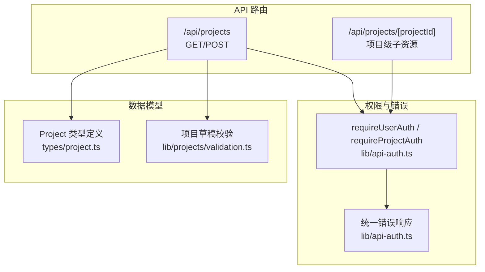
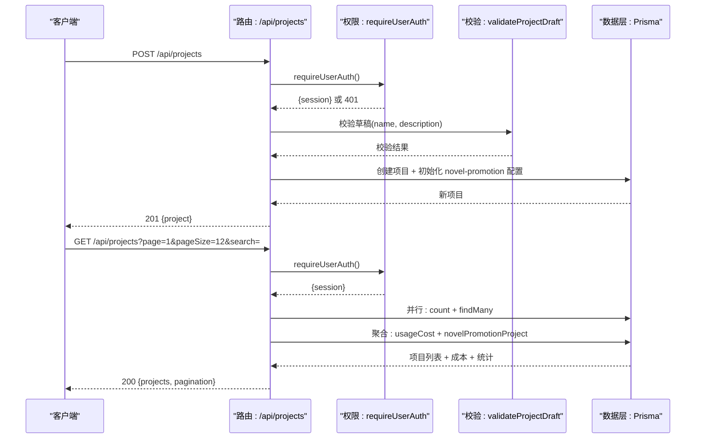
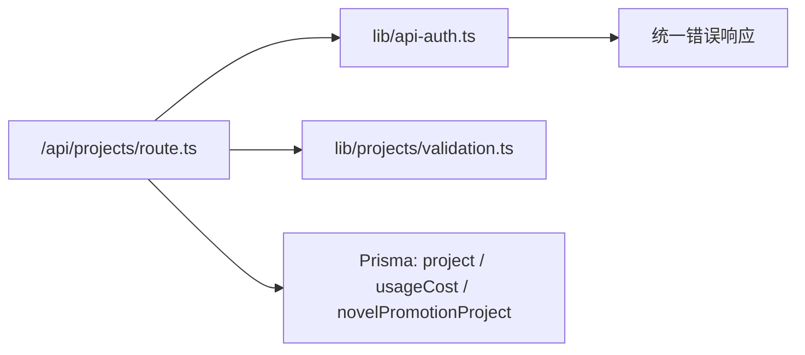
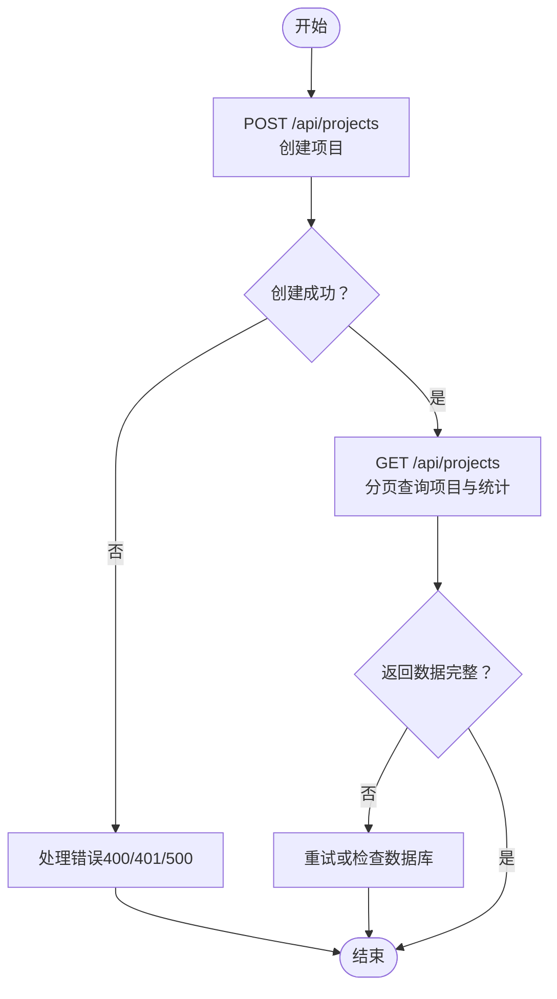

# 项目管理API

<cite>
**本文引用的文件**
- [src/app/api/projects/route.ts](file://src/app/api/projects/route.ts)
- [src/lib/api-auth.ts](file://src/lib/api-auth.ts)
- [src/lib/projects/validation.ts](file://src/lib/projects/validation.ts)
- [src/types/project.ts](file://src/types/project.ts)
</cite>

## 目录
1. [简介](#简介)
2. [项目结构](#项目结构)
3. [核心组件](#核心组件)
4. [架构总览](#架构总览)
5. [详细组件分析](#详细组件分析)
6. [依赖关系分析](#依赖关系分析)
7. [性能考量](#性能考量)
8. [故障排查指南](#故障排查指南)
9. [结论](#结论)
10. [附录](#附录)

## 简介
本文件面向项目管理相关的RESTful API，聚焦以下能力：
- 项目创建：POST /api/projects
- 项目列表与统计：GET /api/projects
- 项目权限控制与鉴权：requireUserAuth、requireProjectAuth 等
- 项目状态与成本统计：结合 novel-promotion 项目数据与计费用量进行聚合统计

文档将逐项说明HTTP方法、URL模式、请求参数、响应格式、错误处理，并提供端到端调用流程、curl示例与JavaScript/TypeScript调用要点。

## 项目结构
项目管理API位于Next.js App Router约定式路由目录下，采用“按功能分组”的组织方式：
- 顶层项目路由：/api/projects
- 项目级子资源路由：/api/projects/[projectId] 下挂载多条子接口（例如 novel-promotion 子模块下的分析、剪辑、下载等）
- 权限与错误处理：统一在 lib 层实现，供各API端点复用

**图表来源**
- [src/app/api/projects/route.ts:1-245](file://src/app/api/projects/route.ts#L1-L245)
- [src/lib/api-auth.ts:1-355](file://src/lib/api-auth.ts#L1-L355)
- [src/lib/projects/validation.ts:1-83](file://src/lib/projects/validation.ts#L1-L83)
- [src/types/project.ts:1-288](file://src/types/project.ts#L1-L288)

**章节来源**
- [src/app/api/projects/route.ts:1-245](file://src/app/api/projects/route.ts#L1-L245)
- [src/lib/api-auth.ts:1-355](file://src/lib/api-auth.ts#L1-L355)
- [src/lib/projects/validation.ts:1-83](file://src/lib/projects/validation.ts#L1-L83)
- [src/types/project.ts:1-288](file://src/types/project.ts#L1-L288)

## 核心组件
- 项目列表与统计接口（GET /api/projects）
  - 功能：分页获取当前用户项目列表，同时返回项目总成本与统计信息（章节数、图片数、视频数、面板数、首集文本预览）
  - 关键特性：并发查询总数量与分页数据；按最近访问时间与创建时间综合排序；一次性聚合费用与统计
- 项目创建接口（POST /api/projects）
  - 功能：基于草稿创建新项目，并初始化 novel-promotion 项目配置（继承用户偏好）
  - 关键特性：输入校验、规范化、统一错误响应

**章节来源**
- [src/app/api/projects/route.ts:27-182](file://src/app/api/projects/route.ts#L27-L182)
- [src/app/api/projects/route.ts:184-244](file://src/app/api/projects/route.ts#L184-L244)
- [src/lib/projects/validation.ts:33-67](file://src/lib/projects/validation.ts#L33-L67)

## 架构总览
项目管理API遵循“路由层（Next.js）—服务层（权限/校验）—数据层（Prisma）”的分层设计。权限控制集中在 lib/api-auth.ts，统一返回标准化错误响应；数据模型与业务类型集中在 types/project.ts 与 lib/projects/validation.ts。

**图表来源**
- [src/app/api/projects/route.ts:27-182](file://src/app/api/projects/route.ts#L27-L182)
- [src/app/api/projects/route.ts:184-244](file://src/app/api/projects/route.ts#L184-L244)
- [src/lib/api-auth.ts:306-313](file://src/lib/api-auth.ts#L306-L313)
- [src/lib/projects/validation.ts:40-67](file://src/lib/projects/validation.ts#L40-L67)

## 详细组件分析

### 项目创建 API（POST /api/projects）
- 方法与路径
  - 方法：POST
  - 路径：/api/projects
- 请求头
  - Content-Type: application/json
  - 需携带会话（Cookie 或 Authorization，取决于认证策略）
- 请求体
  - name: string（必填，最大长度限制见校验）
  - description: string | null（可选，最大长度限制见校验）
- 成功响应
  - 状态码：201
  - 响应体：包含新建项目对象
- 失败响应
  - 401 未授权：requireUserAuth 失败
  - 400 参数无效：validateProjectDraft 校验失败
  - 500 内部错误：其他异常
- 错误码与语义
  - UNAUTHORIZED：未登录或会话无效
  - INVALID_PARAMS：name为空、name过长、description过长
  - INTERNAL_ERROR：服务器内部错误
- curl 示例
  - curl -X POST http://localhost:3000/api/projects -H "Content-Type: application/json" -d '{"name":"我的项目","description":"项目描述"}'
- JavaScript/TypeScript 调用要点
  - 使用 fetch 或 axios 发送 POST 请求
  - 捕获 400/401/500 并提示用户或重试
  - 成功后使用返回的 project.id 进入后续流程

**章节来源**
- [src/app/api/projects/route.ts:184-244](file://src/app/api/projects/route.ts#L184-L244)
- [src/lib/projects/validation.ts:33-67](file://src/lib/projects/validation.ts#L33-L67)
- [src/lib/api-auth.ts:145-163](file://src/lib/api-auth.ts#L145-L163)

### 项目列表与统计 API（GET /api/projects）
- 方法与路径
  - 方法：GET
  - 路径：/api/projects
- 查询参数
  - page: number，默认 1
  - pageSize: number，默认 12
  - search: string（可选，支持名称/描述模糊匹配）
- 成功响应
  - 状态码：200
  - 响应体字段
    - projects: 数组，每项包含：
      - 基础项目字段（id、name、description、userId、createdAt、updatedAt）
      - totalCost: number（该项目累计消费，单位为元的小数）
      - stats: 对象，包含
        - episodes: number（剧集数）
        - images: number（图片产出数）
        - videos: number（视频产出数）
        - panels: number（面板数）
        - firstEpisodePreview: string | null（首集文本前100字符预览）
    - pagination: 分页信息（page、pageSize、total、totalPages）
- 失败响应
  - 401 未授权：requireUserAuth 失败
  - 500 内部错误：数据库或聚合逻辑异常
- curl 示例
  - curl "http://localhost:3000/api/projects?page=1&pageSize=12&search=我的"
- JavaScript/TypeScript 调用要点
  - 使用分页参数构建请求
  - 解析 projects 中的 totalCost 与 stats，渲染项目卡片
  - 注意排序逻辑：未访问项目优先于已访问项目，且未访问项目按创建时间倒序

**章节来源**
- [src/app/api/projects/route.ts:27-182](file://src/app/api/projects/route.ts#L27-L182)
- [src/lib/api-auth.ts:306-313](file://src/lib/api-auth.ts#L306-L313)

### 项目权限控制与鉴权
- requireUserAuth
  - 作用：要求用户登录，返回 session 或 401
  - 适用：用户级 API（如项目列表）
- requireProjectAuth
  - 作用：验证项目存在性、所有权与 novel-promotion 数据完整性，返回 session、project、novelData
  - 适用：项目级 API（如 novel-promotion 子资源）
- requireProjectAuthLight
  - 作用：仅验证项目存在性与所有权，不强制 novel-promotion 数据
  - 适用：不需要 novel-promotion 数据的项目级接口
- 错误响应
  - UNAUTHORIZED：未登录
  - FORBIDDEN：非项目所有者
  - NOT_FOUND：项目不存在或 novel-promotion 数据缺失
  - INVALID_PARAMS：请求参数非法
  - INTERNAL_ERROR：服务器内部错误

**章节来源**
- [src/lib/api-auth.ts:306-343](file://src/lib/api-auth.ts#L306-L343)

### 项目草稿校验与规范化
- 校验规则
  - name 必填，最大长度 100
  - description 可选，最大长度 500
- 规范化
  - 去除前后空格；空字符串视为 null
- 国际化错误消息
  - 根据请求语言返回中文或英文错误提示

**章节来源**
- [src/lib/projects/validation.ts:3-83](file://src/lib/projects/validation.ts#L3-L83)

### 项目类型与数据模型
- 基础项目类型 BaseProject
  - 字段：id、name、description、userId、createdAt、updatedAt
- 完整项目类型 Project
  - 在 BaseProject 基础上扩展 novelPromotionData
- novel-promotion 项目数据结构（节选）
  - 包含工作流模式、模型配置、视频比例、风格、TTS速率、全局文本、章节、剪辑板、故事板、镜头等
- 用途
  - 作为前端渲染与后续接口（如 novel-promotion 分析、生成）的数据基础

**章节来源**
- [src/types/project.ts:7-14](file://src/types/project.ts#L7-L14)
- [src/types/project.ts:285-287](file://src/types/project.ts#L285-L287)
- [src/types/project.ts:240-280](file://src/types/project.ts#L240-L280)

## 依赖关系分析
- 路由层依赖
  - requireUserAuth：统一鉴权入口
  - validateProjectDraft：输入校验
  - prisma：数据访问（项目、用量成本、novel-promotion 项目）
- 错误处理
  - 统一错误响应：buildErrorResponse 提供标准错误结构与HTTP状态码
- 性能优化
  - 并行查询：count + findMany 并行执行
  - 聚合统计：groupBy usageCost + 一次性查询 novel-promotion 项目统计
  - 排序：应用层二次排序，兼顾“未访问项目优先”与“访问时间倒序”

**图表来源**
- [src/app/api/projects/route.ts:1-245](file://src/app/api/projects/route.ts#L1-L245)
- [src/lib/api-auth.ts:123-163](file://src/lib/api-auth.ts#L123-L163)
- [src/lib/projects/validation.ts:1-83](file://src/lib/projects/validation.ts#L1-L83)

**章节来源**
- [src/app/api/projects/route.ts:52-131](file://src/app/api/projects/route.ts#L52-L131)
- [src/lib/api-auth.ts:123-163](file://src/lib/api-auth.ts#L123-L163)

## 性能考量
- 并发查询
  - 使用 Promise.all 并行执行 count 与分页查询，减少往返延迟
- 聚合统计
  - 使用 groupBy 聚合计费，避免 N+1 查询
  - 一次性拉取 novel-promotion 项目统计，计算图片/视频/面板数量
- 排序策略
  - 应用层二次排序，确保“未访问项目优先、访问时间倒序”，提升用户体验
- 数据库索引建议
  - 建议对 project(userId, createdAt)、usageCost(projectId) 等建立合适索引以优化查询

[本节为通用性能建议，无需具体文件分析]

## 故障排查指南
- 401 未授权
  - 检查会话是否有效（Cookie/Authorization）
  - 确认已登录且会话未过期
- 403 禁止访问
  - 确认请求的项目属于当前用户
- 404 资源不存在
  - novel-promotion 数据缺失时会触发 NOT_FOUND
- 400 参数无效
  - 校验 name/description 长度与必填性
- 500 内部错误
  - 检查数据库连接与 Prisma 查询日志
  - 关注并行查询与聚合逻辑的异常分支

**章节来源**
- [src/lib/api-auth.ts:145-163](file://src/lib/api-auth.ts#L145-L163)
- [src/lib/projects/validation.ts:40-67](file://src/lib/projects/validation.ts#L40-L67)

## 结论
项目管理API围绕“创建—查询—统计—权限控制”形成闭环，具备良好的扩展性与性能表现。通过统一鉴权与错误响应机制，保障了接口的一致性与可靠性。后续可在项目级子资源（如 novel-promotion 分析、生成、下载）上沿用相同的设计模式，进一步完善项目全生命周期管理的端到端体验。

[本节为总结性内容，无需具体文件分析]

## 附录

### 端到端调用流程（从创建到统计）

**图表来源**
- [src/app/api/projects/route.ts:27-182](file://src/app/api/projects/route.ts#L27-L182)
- [src/app/api/projects/route.ts:184-244](file://src/app/api/projects/route.ts#L184-L244)
- [src/lib/api-auth.ts:306-313](file://src/lib/api-auth.ts#L306-L313)

### curl 与 JavaScript/TypeScript 调用示例（路径指引）
- 创建项目
  - curl: [curl -X POST http://localhost:3000/api/projects -H "Content-Type: application/json" -d '{"name":"我的项目","description":"项目描述"}':184-244](file://src/app/api/projects/route.ts#L184-L244)
  - TypeScript: [fetch('/api/projects', { method: 'POST', headers: {'Content-Type': 'application/json'}, body: JSON.stringify({name, description}) }):184-244](file://src/app/api/projects/route.ts#L184-L244)
- 获取项目列表
  - curl: [curl "http://localhost:3000/api/projects?page=1&pageSize=12&search=我的":27-182](file://src/app/api/projects/route.ts#L27-L182)
  - TypeScript: [fetch('/api/projects?page=1&pageSize=12&search=我的'):27-182](file://src/app/api/projects/route.ts#L27-L182)

[本节为示例路径指引，不包含具体代码内容]