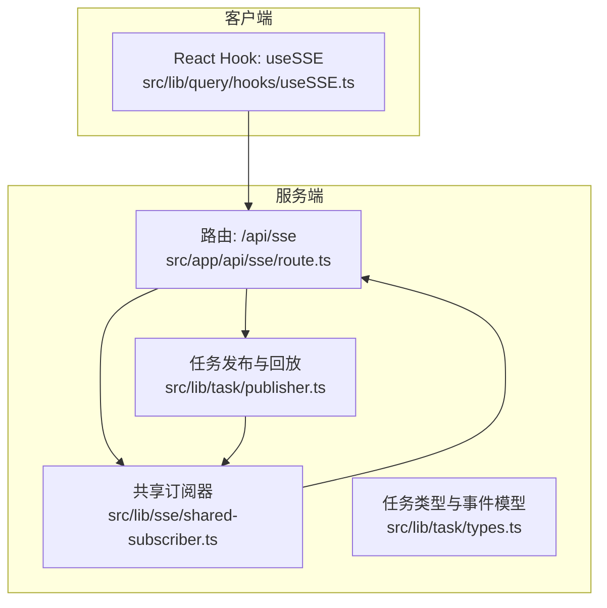
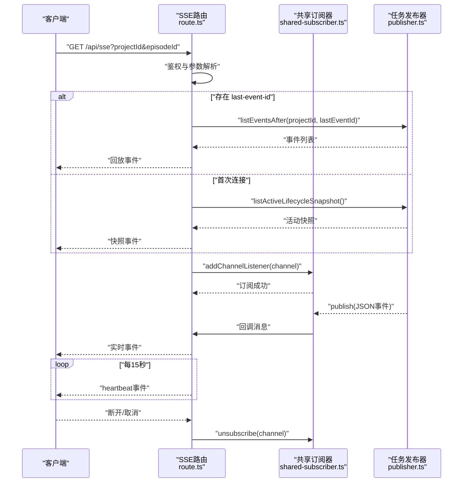
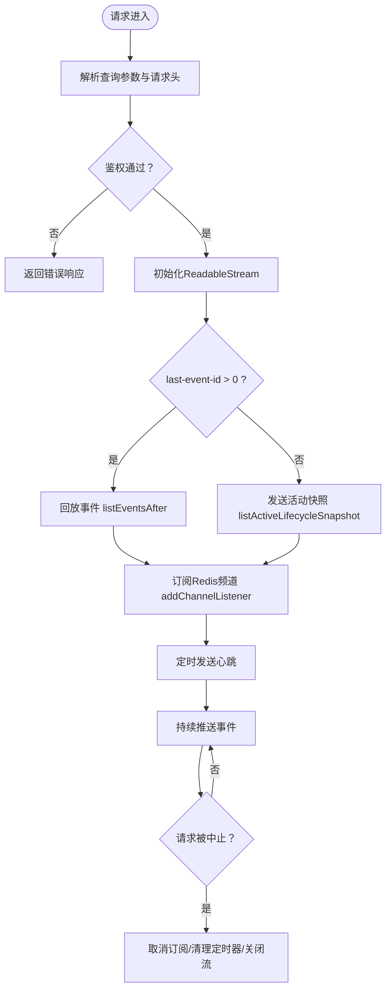
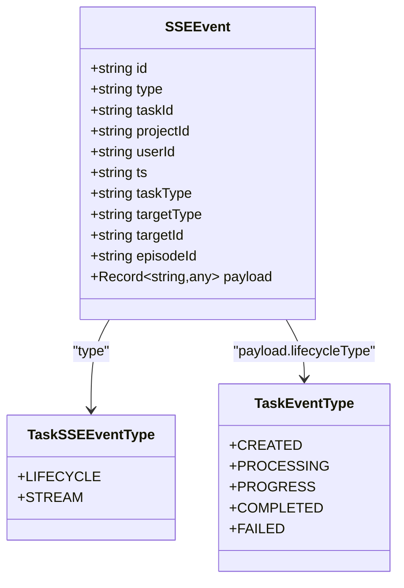
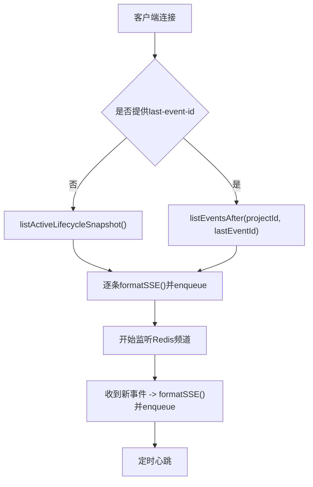
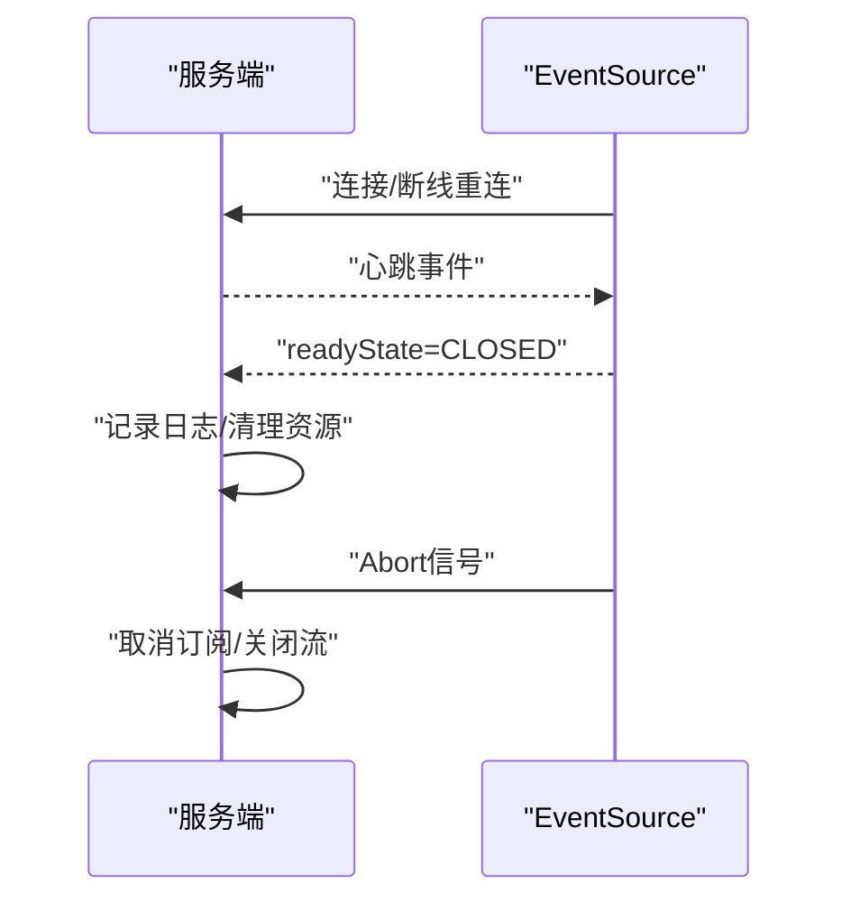
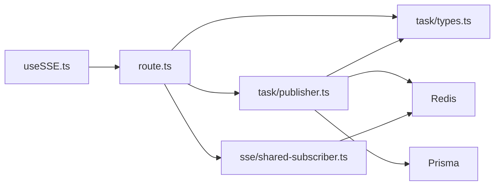

# SSE流接口

<cite>
**本文档引用的文件**
- [src/app/api/sse/route.ts](file://src/app/api/sse/route.ts)
- [src/lib/sse/shared-subscriber.ts](file://src/lib/sse/shared-subscriber.ts)
- [src/lib/task/types.ts](file://src/lib/task/types.ts)
- [src/lib/task/publisher.ts](file://src/lib/task/publisher.ts)
- [src/lib/query/hooks/useSSE.ts](file://src/lib/query/hooks/useSSE.ts)
</cite>

## 目录
1. [简介](#简介)
2. [项目结构](#项目结构)
3. [核心组件](#核心组件)
4. [架构总览](#架构总览)
5. [详细组件分析](#详细组件分析)
6. [依赖关系分析](#依赖关系分析)
7. [性能考虑](#性能考虑)
8. [故障排查指南](#故障排查指南)
9. [结论](#结论)
10. [附录](#附录)

## 简介
本文件系统性阐述 Waoowaoo 的 Server-Sent Events（SSE）实时流接口，覆盖连接建立流程、握手与参数、消息格式与事件类型、数据传输机制、心跳与超时、错误恢复策略，以及面向前端的 JavaScript EventSource 使用示例与最佳实践。该接口用于向客户端推送任务生命周期与流式输出事件，支持断线重连与事件回放。

## 项目结构
SSE 接口由以下关键模块组成：
- 路由层：负责鉴权、参数解析、连接初始化与流构建
- 订阅层：基于 Redis 的共享订阅器，统一管理频道监听
- 类型与发布：定义事件类型、构建 SSE 事件并发布到 Redis 频道
- 客户端钩子：封装 EventSource，解析事件并驱动前端状态更新

图表来源
- [src/app/api/sse/route.ts:92-206](file://src/app/api/sse/route.ts#L92-L206)
- [src/lib/sse/shared-subscriber.ts:1-82](file://src/lib/sse/shared-subscriber.ts#L1-L82)
- [src/lib/task/publisher.ts:224-284](file://src/lib/task/publisher.ts#L224-L284)
- [src/lib/query/hooks/useSSE.ts:18-232](file://src/lib/query/hooks/useSSE.ts#L18-L232)

章节来源
- [src/app/api/sse/route.ts:92-206](file://src/app/api/sse/route.ts#L92-L206)
- [src/lib/sse/shared-subscriber.ts:1-82](file://src/lib/sse/shared-subscriber.ts#L1-L82)
- [src/lib/task/publisher.ts:224-284](file://src/lib/task/publisher.ts#L224-L284)
- [src/lib/query/hooks/useSSE.ts:18-232](file://src/lib/query/hooks/useSSE.ts#L18-L232)

## 核心组件
- 路由处理器：解析查询参数与请求头，鉴权后建立 ReadableStream，发送快照或回放事件，持续推送实时事件，并定时发送心跳
- 共享订阅器：单例 Redis 订阅器，按频道分发消息给多个监听者，自动处理首次订阅与最后一位监听移除后的退订
- 事件类型与发布：定义任务生命周期与流式事件类型，构建 SSEEvent 并通过 Redis 发布到项目频道
- 客户端 Hook：封装 EventSource，注册命名事件监听，解析事件并触发 React Query 无效化与 UI 叠加层更新

章节来源
- [src/app/api/sse/route.ts:19-29](file://src/app/api/sse/route.ts#L19-L29)
- [src/lib/sse/shared-subscriber.ts:33-67](file://src/lib/sse/shared-subscriber.ts#L33-L67)
- [src/lib/task/types.ts:14-38](file://src/lib/task/types.ts#L14-L38)
- [src/lib/query/hooks/useSSE.ts:94-227](file://src/lib/query/hooks/useSSE.ts#L94-L227)

## 架构总览
SSE 连接从客户端发起，服务端进行鉴权与参数校验，随后根据 last-event-id 决定回放策略：无游标则发送“活动快照”，否则回放指定 ID 后的事件。同时，服务端通过共享订阅器监听 Redis 频道，将新事件以 Server-Sent Events 形式推送给客户端。为保证连接存活，服务端每 15 秒发送一次心跳事件。

图表来源
- [src/app/api/sse/route.ts:92-206](file://src/app/api/sse/route.ts#L92-L206)
- [src/lib/sse/shared-subscriber.ts:33-67](file://src/lib/sse/shared-subscriber.ts#L33-L67)
- [src/lib/task/publisher.ts:359-390](file://src/lib/task/publisher.ts#L359-L390)

## 详细组件分析

### 路由与握手协议
- 查询参数
  - 必填：projectId（全局资产库场景可为特定值）
  - 可选：episodeId（限定剧集范围）
- 请求头
  - last-event-id：客户端上次接收的事件 ID，用于回放缺失事件
- 鉴权
  - 普通项目：requireProjectAuthLight
  - 全局资产库：requireUserAuth
- 响应头
  - Content-Type: text/event-stream; charset=utf-8
  - Cache-Control: no-cache, no-transform
  - Connection: keep-alive
  - X-Accel-Buffering: no（Nginx 等反向代理禁用缓冲）

图表来源
- [src/app/api/sse/route.ts:92-206](file://src/app/api/sse/route.ts#L92-L206)
- [src/lib/task/publisher.ts:359-390](file://src/lib/task/publisher.ts#L359-L390)

章节来源
- [src/app/api/sse/route.ts:92-206](file://src/app/api/sse/route.ts#L92-L206)

### 消息格式与事件类型
- 事件格式
  - 默认：event: 事件类型；data: JSON 字符串；双换行结尾
  - 若事件 id 为纯数字字符串，则附加 id: 行
- 心跳事件
  - event: heartbeat；data: 包含服务器时间戳的对象
- 事件类型
  - 生命周期事件：task.lifecycle
  - 流式事件：task.stream
- 事件载荷
  - 通用字段：taskId、projectId、userId、ts、taskType、targetType、targetId、episodeId
  - 生命周期事件额外携带 payload.lifecycleType 与 intent、progress 等
  - 流式事件额外携带 intent 等运行期信息

图表来源
- [src/lib/task/types.ts:130-144](file://src/lib/task/types.ts#L130-L144)
- [src/lib/task/types.ts:14-29](file://src/lib/task/types.ts#L14-L29)

章节来源
- [src/app/api/sse/route.ts:19-29](file://src/app/api/sse/route.ts#L19-L29)
- [src/lib/task/types.ts:130-144](file://src/lib/task/types.ts#L130-L144)

### 数据传输机制与回放
- 首次连接
  - 服务端查询当前用户在项目/剧集下的“活动任务”（排队/处理中），生成快照事件一次性发送
- 断线重连
  - 客户端通过 last-event-id 指定起始位置，服务端调用 listEventsAfter 回放缺失事件
  - 回放限制：最大扫描行数与收集数量上限，避免过量回放
- 实时推送
  - 任务生命周期与流式事件均通过 Redis 频道广播，客户端即时接收

图表来源
- [src/app/api/sse/route.ts:158-183](file://src/app/api/sse/route.ts#L158-L183)
- [src/lib/task/publisher.ts:359-390](file://src/lib/task/publisher.ts#L359-L390)

章节来源
- [src/app/api/sse/route.ts:158-183](file://src/app/api/sse/route.ts#L158-L183)
- [src/lib/task/publisher.ts:359-390](file://src/lib/task/publisher.ts#L359-L390)

### 心跳机制、超时与错误恢复
- 心跳
  - 服务端每 15 秒发送一次 heartbeat 事件，保持连接活跃
- 超时与断线
  - 客户端 EventSource 自动重连；仅当 readyState 变为 CLOSED 时视为永久关闭
  - 服务端监听请求 abort 信号，及时释放资源
- 错误恢复
  - Redis 订阅异常与监听器内部异常会被记录但不中断整体流
  - 服务端在关闭时确保取消订阅、清理定时器与关闭流

图表来源
- [src/app/api/sse/route.ts:194-196](file://src/app/api/sse/route.ts#L194-L196)
- [src/lib/sse/shared-subscriber.ts:28-31](file://src/lib/sse/shared-subscriber.ts#L28-L31)
- [src/lib/query/hooks/useSSE.ts:209-214](file://src/lib/query/hooks/useSSE.ts#L209-L214)

章节来源
- [src/app/api/sse/route.ts:194-196](file://src/app/api/sse/route.ts#L194-L196)
- [src/lib/sse/shared-subscriber.ts:28-31](file://src/lib/sse/shared-subscriber.ts#L28-L31)
- [src/lib/query/hooks/useSSE.ts:209-214](file://src/lib/query/hooks/useSSE.ts#L209-L214)

### 客户端连接示例（JavaScript EventSource）
- 基本用法
  - 构造 URL：/api/sse?projectId=xxx&episodeId=yyy（可选）
  - 创建 EventSource 实例，注册 onmessage 或 addEventListener 监听命名事件
- 事件处理
  - 解析 data 为 JSON，区分事件类型
  - 根据 payload.lifecycleType 更新任务列表与目标态
  - 对完成/失败事件触发目标资源的查询无效化
- 断线重连
  - EventSource 自动重连；若需手动控制，可在 onerror 中判断 readyState 并执行重连逻辑

章节来源
- [src/lib/query/hooks/useSSE.ts:34-227](file://src/lib/query/hooks/useSSE.ts#L34-L227)

## 依赖关系分析
- 路由依赖
  - 鉴权工具：requireProjectAuthLight / requireUserAuth
  - 通道与回放：getProjectChannel / listEventsAfter / listActiveLifecycleSnapshot
  - 日志：createScopedLogger
- 订阅器依赖
  - Redis 客户端：createSubscriber
  - 异常与错误日志：logError
- 发布器依赖
  - Redis 发布：redis.publish
  - 数据库：Prisma 模型 taskEvent / task
  - 运行时镜像：mapTaskSSEEventToRunEvents / publishRunEvent

图表来源
- [src/app/api/sse/route.ts:1-10](file://src/app/api/sse/route.ts#L1-L10)
- [src/lib/task/publisher.ts:1-16](file://src/lib/task/publisher.ts#L1-L16)
- [src/lib/sse/shared-subscriber.ts:1-3](file://src/lib/sse/shared-subscriber.ts#L1-L3)
- [src/lib/query/hooks/useSSE.ts:1-10](file://src/lib/query/hooks/useSSE.ts#L1-L10)

章节来源
- [src/app/api/sse/route.ts:1-10](file://src/app/api/sse/route.ts#L1-L10)
- [src/lib/task/publisher.ts:1-16](file://src/lib/task/publisher.ts#L1-L16)
- [src/lib/sse/shared-subscriber.ts:1-3](file://src/lib/sse/shared-subscriber.ts#L1-L3)
- [src/lib/query/hooks/useSSE.ts:1-10](file://src/lib/query/hooks/useSSE.ts#L1-L10)

## 性能考虑
- 回放限制
  - 回放扫描上限与收集上限，避免大规模回放导致延迟与资源占用
- 快照大小
  - 活动快照默认限制数量，防止首次连接时一次性推送过多数据
- 心跳频率
  - 15 秒心跳频率适中，兼顾保活与网络负载
- 订阅去重
  - 共享订阅器对同一频道的多个监听者复用底层订阅，减少 Redis 连接与带宽消耗
- 前端无效化节流
  - 目标态无效化采用定时器合并，降低频繁刷新带来的抖动

章节来源
- [src/lib/task/publisher.ts:359-390](file://src/lib/task/publisher.ts#L359-L390)
- [src/app/api/sse/route.ts:170-174](file://src/app/api/sse/route.ts#L170-L174)
- [src/lib/sse/shared-subscriber.ts:44-46](file://src/lib/sse/shared-subscriber.ts#L44-L46)
- [src/lib/query/hooks/useSSE.ts:145-150](file://src/lib/query/hooks/useSSE.ts#L145-L150)

## 故障排查指南
- 常见问题
  - 无法连接：检查鉴权是否通过、projectId 是否有效、请求头 last-event-id 格式是否正确
  - 无事件：确认 Redis 订阅是否正常、频道名称是否匹配、任务事件是否已发布
  - 心跳丢失：检查服务端定时器是否被清理、客户端网络环境是否稳定
- 日志定位
  - 服务端：连接建立、断开、回放数量、活动快照数量
  - 订阅器：Redis 错误与监听器内部异常
- 建议步骤
  - 在本地或测试环境开启更详细日志
  - 使用最小化事件集验证回放与订阅链路
  - 检查 EventSource readyState 与 onerror 回调

章节来源
- [src/app/api/sse/route.ts:124-143](file://src/app/api/sse/route.ts#L124-L143)
- [src/lib/sse/shared-subscriber.ts:28-31](file://src/lib/sse/shared-subscriber.ts#L28-L31)
- [src/lib/query/hooks/useSSE.ts:209-214](file://src/lib/query/hooks/useSSE.ts#L209-L214)

## 结论
Waoowaoo 的 SSE 接口通过清晰的事件类型、可靠的回放机制与心跳保活，实现了高效稳定的实时任务状态推送。结合共享订阅器与前端 Hook，开发者可以快速集成断线重连、事件解析与 UI 无效化，构建流畅的实时交互体验。

## 附录

### 事件流与典型场景
- 任务创建
  - 服务端发布 task.lifecycle（lifecycleType=created），客户端更新任务列表与目标态
- 处理中
  - 服务端发布 task.lifecycle（lifecycleType=processing），可携带 progress；客户端更新进度与阶段
- 完成/失败
  - 服务端发布 task.lifecycle（lifecycleType=completed/failed），客户端触发目标资源无效化与后续处理

章节来源
- [src/lib/task/types.ts:14-29](file://src/lib/task/types.ts#L14-L29)
- [src/lib/query/hooks/useSSE.ts:131-139](file://src/lib/query/hooks/useSSE.ts#L131-L139)