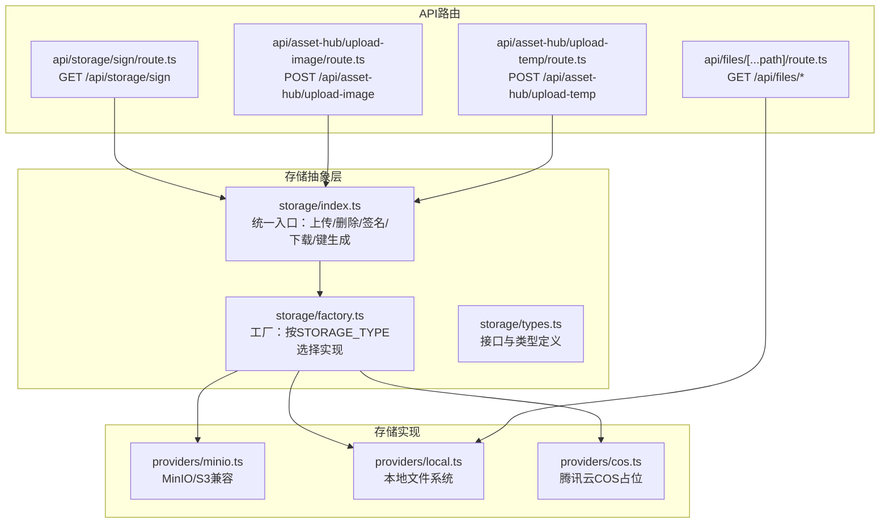
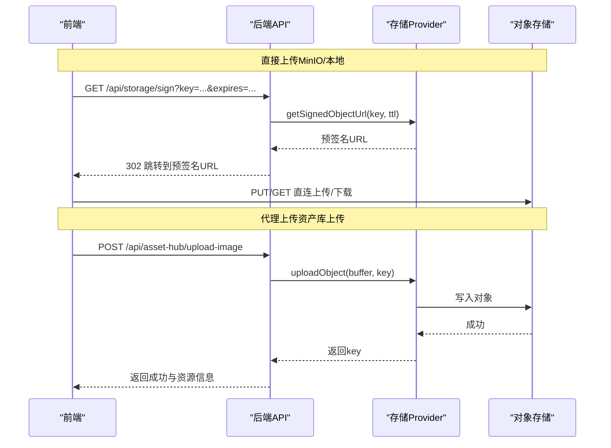
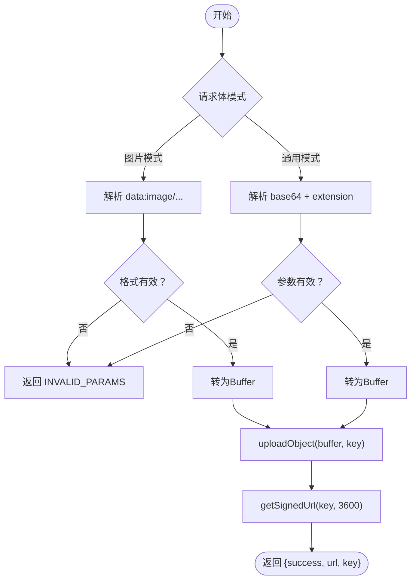
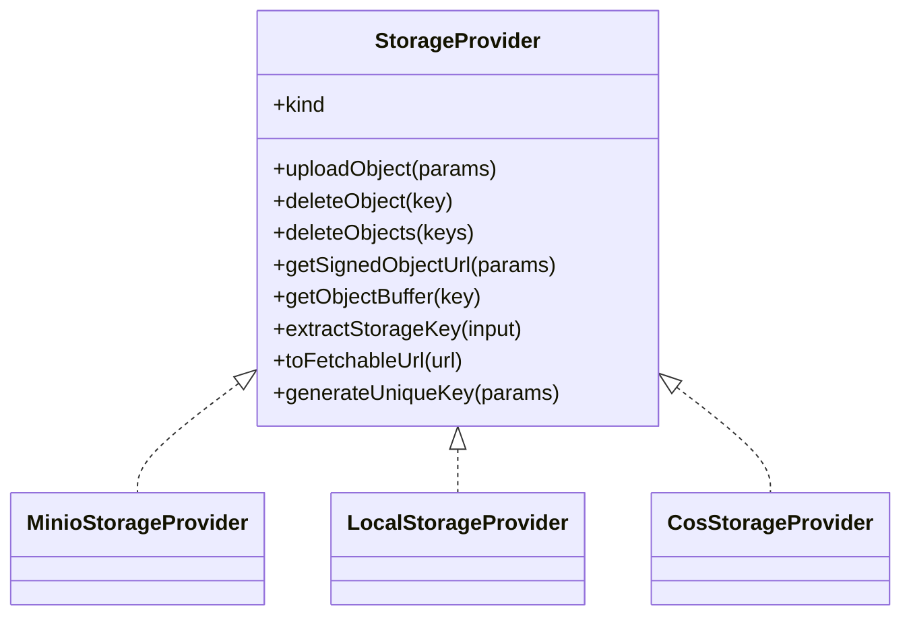

# 文件上传接口

<cite>
**本文引用的文件**
- [src/lib/storage/index.ts](file://src/lib/storage/index.ts)
- [src/lib/storage/signed-urls.ts](file://src/lib/storage/signed-urls.ts)
- [src/lib/storage/factory.ts](file://src/lib/storage/factory.ts)
- [src/lib/storage/types.ts](file://src/lib/storage/types.ts)
- [src/lib/storage/providers/cos.ts](file://src/lib/storage/providers/cos.ts)
- [src/lib/storage/providers/minio.ts](file://src/lib/storage/providers/minio.ts)
- [src/lib/storage/providers/local.ts](file://src/lib/storage/providers/local.ts)
- [src/app/api/files/[...path]/route.ts](file://src/app/api/files/[...path]/route.ts)
- [src/app/api/storage/sign/route.ts](file://src/app/api/storage/sign/route.ts)
- [src/app/api/asset-hub/upload-image/route.ts](file://src/app/api/asset-hub/upload-image/route.ts)
- [src/app/api/asset-hub/upload-temp/route.ts](file://src/app/api/asset-hub/upload-temp/route.ts)
</cite>

## 目录
1. [简介](#简介)
2. [项目结构](#项目结构)
3. [核心组件](#核心组件)
4. [架构总览](#架构总览)
5. [详细组件分析](#详细组件分析)
6. [依赖关系分析](#依赖关系分析)
7. [性能考量](#性能考量)
8. [故障排查指南](#故障排查指南)
9. [结论](#结论)
10. [附录](#附录)

## 简介
本文件面向Waoowaoo的文件上传能力，系统性梳理从“前端选择文件”到“后端签名与存储”的完整流程，覆盖以下关键主题：
- 预签名URL生成与COS对象存储配置
- 直接上传机制与本地文件服务
- HTTP方法、URL模式与请求格式
- 支持的文件类型、大小限制与格式要求
- 临时文件上传与永久文件存储的区别与使用场景
- 完整上传示例（前端文件选择、后端签名生成、文件传输）
- 错误处理、断点续传与并发上传支持现状
- 安全考虑、文件验证与存储优化最佳实践

## 项目结构
围绕文件上传的关键代码分布在以下模块：
- 存储抽象与工厂：统一上传、删除、签名、下载等操作，并根据环境选择具体实现（MinIO、本地、COS）
- API路由：提供签名URL跳转、本地文件服务、资产库上传与临时文件上传
- 工具与类型：定义存储Provider接口、参数与结果类型，以及工具函数

图表来源
- [src/lib/storage/index.ts:1-142](file://src/lib/storage/index.ts#L1-L142)
- [src/lib/storage/factory.ts:1-27](file://src/lib/storage/factory.ts#L1-L27)
- [src/lib/storage/types.ts:1-38](file://src/lib/storage/types.ts#L1-L38)
- [src/lib/storage/providers/minio.ts:1-171](file://src/lib/storage/providers/minio.ts#L1-L171)
- [src/lib/storage/providers/local.ts:1-87](file://src/lib/storage/providers/local.ts#L1-L87)
- [src/lib/storage/providers/cos.ts:1-43](file://src/lib/storage/providers/cos.ts#L1-L43)
- [src/app/api/storage/sign/route.ts:1-22](file://src/app/api/storage/sign/route.ts#L1-L22)
- [src/app/api/files/[...path]/route.ts:1-83](file://src/app/api/files/[...path]/route.ts#L1-L83)
- [src/app/api/asset-hub/upload-image/route.ts:1-190](file://src/app/api/asset-hub/upload-image/route.ts#L1-L190)
- [src/app/api/asset-hub/upload-temp/route.ts:1-56](file://src/app/api/asset-hub/upload-temp/route.ts#L1-L56)

章节来源
- [src/lib/storage/index.ts:1-142](file://src/lib/storage/index.ts#L1-L142)
- [src/lib/storage/factory.ts:1-27](file://src/lib/storage/factory.ts#L1-L27)
- [src/lib/storage/types.ts:1-38](file://src/lib/storage/types.ts#L1-L38)
- [src/lib/storage/providers/minio.ts:1-171](file://src/lib/storage/providers/minio.ts#L1-L171)
- [src/lib/storage/providers/local.ts:1-87](file://src/lib/storage/providers/local.ts#L1-L87)
- [src/lib/storage/providers/cos.ts:1-43](file://src/lib/storage/providers/cos.ts#L1-L43)
- [src/app/api/storage/sign/route.ts:1-22](file://src/app/api/storage/sign/route.ts#L1-L22)
- [src/app/api/files/[...path]/route.ts:1-83](file://src/app/api/files/[...path]/route.ts#L1-L83)
- [src/app/api/asset-hub/upload-image/route.ts:1-190](file://src/app/api/asset-hub/upload-image/route.ts#L1-L190)
- [src/app/api/asset-hub/upload-temp/route.ts:1-56](file://src/app/api/asset-hub/upload-temp/route.ts#L1-L56)

## 核心组件
- 存储抽象与统一入口
  - 提供上传、删除、批量删除、获取可访问URL、生成唯一键、下载缓冲区、签名URL等能力
  - 默认重试策略与默认签名过期时间常量
- 存储工厂
  - 根据环境变量STORAGE_TYPE选择MinIO、本地或COS实现；不支持的类型会抛出配置错误
- Provider接口
  - 统一的上传、删除、签名、下载、键提取、可访问URL转换、唯一键生成等方法
- 具体实现
  - MinIO：基于AWS SDK的S3客户端与预签名器，支持Put/Delete/Get与批量删除
  - 本地：基于Node FS，提供本地文件读写与签名URL生成
  - COS：当前为占位实现，抛出未实现异常（需后续完善）

章节来源
- [src/lib/storage/index.ts:1-142](file://src/lib/storage/index.ts#L1-L142)
- [src/lib/storage/factory.ts:1-27](file://src/lib/storage/factory.ts#L1-L27)
- [src/lib/storage/types.ts:1-38](file://src/lib/storage/types.ts#L1-L38)
- [src/lib/storage/providers/minio.ts:1-171](file://src/lib/storage/providers/minio.ts#L1-L171)
- [src/lib/storage/providers/local.ts:1-87](file://src/lib/storage/providers/local.ts#L1-L87)
- [src/lib/storage/providers/cos.ts:1-43](file://src/lib/storage/providers/cos.ts#L1-L43)

## 架构总览
文件上传涉及两条主要路径：
- 直接上传（推荐）：前端通过后端签发的预签名URL直连存储（MinIO/本地），绕过应用服务器
- 代理上传：前端将文件发送给后端，后端再写入存储（当前资产库上传接口采用此方式）

图表来源
- [src/app/api/storage/sign/route.ts:1-22](file://src/app/api/storage/sign/route.ts#L1-L22)
- [src/lib/storage/index.ts:70-84](file://src/lib/storage/index.ts#L70-L84)
- [src/lib/storage/providers/minio.ts:111-126](file://src/lib/storage/providers/minio.ts#L111-L126)
- [src/app/api/asset-hub/upload-image/route.ts:46-190](file://src/app/api/asset-hub/upload-image/route.ts#L46-L190)

## 详细组件分析

### 预签名URL生成与COS对象存储配置
- 签名接口
  - 方法：GET
  - URL：/api/storage/sign?key={对象键}&expires={秒数}
  - 行为：校验参数，计算TTL，调用存储Provider生成预签名URL并302跳转
- 存储Provider差异
  - MinIO：使用S3预签名器生成带过期时间的URL
  - 本地：生成指向本地文件服务的URL（/api/files/{key}）
  - COS：当前未实现（抛出未实现异常）
- 环境变量
  - STORAGE_TYPE：minio | local | cos
  - MinIO相关：MINIO_ENDPOINT、MINIO_ACCESS_KEY、MINIO_SECRET_KEY、MINIO_BUCKET、MINIO_REGION、MINIO_FORCE_PATH_STYLE
  - 本地：UPLOAD_DIR（默认 ./data/uploads）

章节来源
- [src/app/api/storage/sign/route.ts:1-22](file://src/app/api/storage/sign/route.ts#L1-L22)
- [src/lib/storage/index.ts:70-84](file://src/lib/storage/index.ts#L70-L84)
- [src/lib/storage/providers/minio.ts:111-126](file://src/lib/storage/providers/minio.ts#L111-L126)
- [src/lib/storage/providers/local.ts:51-54](file://src/lib/storage/providers/local.ts#L51-L54)
- [src/lib/storage/providers/cos.ts:1-43](file://src/lib/storage/providers/cos.ts#L1-L43)

### 直接上传机制（MinIO/本地）
- MinIO直连
  - 前端先向后端申请签名URL，然后直接PUT到对象存储
  - 后端通过S3预签名器生成URL，支持自定义过期时间
- 本地直连
  - 前端通过本地文件服务访问已上传文件（/api/files/{key}）
  - 该模式仅在STORAGE_TYPE=local时启用

章节来源
- [src/lib/storage/providers/minio.ts:111-126](file://src/lib/storage/providers/minio.ts#L111-L126)
- [src/app/api/files/[...path]/route.ts:1-83](file://src/app/api/files/[...path]/route.ts#L1-L83)

### 临时文件上传与永久文件存储
- 临时文件上传
  - 接口：POST /api/asset-hub/upload-temp
  - 请求体支持两种模式：
    - 图片模式：imageBase64（data:image/...）
    - 通用模式：base64 + extension
  - 行为：解码Base64为Buffer，生成唯一键并上传，返回签名URL（默认1小时有效期）
- 永久文件存储
  - 资产库上传：POST /api/asset-hub/upload-image
  - 行为：读取表单文件，Sharp压缩为JPEG，生成唯一键并上传，更新数据库中角色/场景的历史与当前图片字段

图表来源
- [src/app/api/asset-hub/upload-temp/route.ts:11-56](file://src/app/api/asset-hub/upload-temp/route.ts#L11-L56)
- [src/lib/storage/index.ts:35-52](file://src/lib/storage/index.ts#L35-L52)
- [src/lib/storage/index.ts:77-84](file://src/lib/storage/index.ts#L77-L84)

章节来源
- [src/app/api/asset-hub/upload-temp/route.ts:1-56](file://src/app/api/asset-hub/upload-temp/route.ts#L1-L56)
- [src/app/api/asset-hub/upload-image/route.ts:1-190](file://src/app/api/asset-hub/upload-image/route.ts#L1-L190)
- [src/lib/storage/index.ts:35-52](file://src/lib/storage/index.ts#L35-L52)
- [src/lib/storage/index.ts:77-84](file://src/lib/storage/index.ts#L77-L84)

### HTTP方法、URL模式与请求格式
- 签名URL
  - GET /api/storage/sign?key={key}&expires={seconds}
- 本地文件服务
  - GET /api/files/{key}
  - 自动识别扩展名并设置Content-Type
- 资产库上传（图片）
  - POST /api/asset-hub/upload-image
  - 表单字段：file、type、id、appearanceIndex、imageIndex、labelText
- 临时文件上传
  - POST /api/asset-hub/upload-temp
  - JSON字段：imageBase64 或 { base64, extension }

章节来源
- [src/app/api/storage/sign/route.ts:1-22](file://src/app/api/storage/sign/route.ts#L1-L22)
- [src/app/api/files/[...path]/route.ts:1-83](file://src/app/api/files/[...path]/route.ts#L1-L83)
- [src/app/api/asset-hub/upload-image/route.ts:1-190](file://src/app/api/asset-hub/upload-image/route.ts#L1-L190)
- [src/app/api/asset-hub/upload-temp/route.ts:1-56](file://src/app/api/asset-hub/upload-temp/route.ts#L1-L56)

### 支持的文件类型、大小限制与格式要求
- 支持的媒体类型（本地文件服务自动识别）
  - 图片：png、jpg/jpeg、gif、webp
  - 视频：mp4、webm、mov
  - 音频：mp3、wav、ogg
  - 文本/JSON：txt、json
- 资产库上传（图片）的格式要求
  - 使用Sharp进行JPEG压缩（质量约90），最终以.jpg存储
- 大小限制
  - 本地文件服务未对文件大小做显式限制（由运行环境与磁盘容量决定）
  - MinIO直连上传受对象存储配额与网络限制影响
  - COS当前未实现，无法确定限制
- 断点续传与并发上传
  - 当前未发现断点续传实现
  - 并发上传可通过多文件同时直连MinIO实现，但需自行管理分片与合并逻辑

章节来源
- [src/app/api/files/[...path]/route.ts:15-30](file://src/app/api/files/[...path]/route.ts#L15-L30)
- [src/app/api/asset-hub/upload-image/route.ts:67-78](file://src/app/api/asset-hub/upload-image/route.ts#L67-L78)
- [src/lib/storage/providers/cos.ts:1-43](file://src/lib/storage/providers/cos.ts#L1-L43)

### 完整上传示例（前端到后端）
- 场景A：直接上传（MinIO）
  1) 前端请求后端签名：GET /api/storage/sign?key={key}&expires=3600
  2) 后端返回302跳转至预签名URL
  3) 前端直接PUT到对象存储完成上传
- 场景B：代理上传（资产库图片）
  1) 前端构造FormData，包含file、type、id等字段
  2) 发送POST /api/asset-hub/upload-image
  3) 后端压缩为JPEG并上传，返回成功与资源信息
- 场景C：临时文件上传
  1) 前端发送POST /api/asset-hub/upload-temp，携带imageBase64或{base64, extension}
  2) 后端上传并返回签名URL（默认1小时）

章节来源
- [src/app/api/storage/sign/route.ts:1-22](file://src/app/api/storage/sign/route.ts#L1-L22)
- [src/app/api/asset-hub/upload-image/route.ts:46-190](file://src/app/api/asset-hub/upload-image/route.ts#L46-L190)
- [src/app/api/asset-hub/upload-temp/route.ts:11-56](file://src/app/api/asset-hub/upload-temp/route.ts#L11-L56)

### 错误处理
- 参数校验
  - 缺少必要参数（如key、file、type等）时抛出INVALID_PARAMS
- 文件不存在
  - 本地文件服务遇到ENOENT返回404
- 权限与认证
  - 资产库上传接口统一进行用户认证，未通过则返回相应错误响应
- Provider未实现
  - COS Provider当前抛出未实现异常；MinIO/本地正常工作

章节来源
- [src/app/api/storage/sign/route.ts:12-14](file://src/app/api/storage/sign/route.ts#L12-L14)
- [src/app/api/asset-hub/upload-image/route.ts:63-65](file://src/app/api/asset-hub/upload-image/route.ts#L63-L65)
- [src/app/api/files/[...path]/route.ts:75-77](file://src/app/api/files/[...path]/route.ts#L75-L77)
- [src/lib/storage/providers/cos.ts:8-9](file://src/lib/storage/providers/cos.ts#L8-L9)

## 依赖关系分析
- 存储Provider选择
  - 工厂根据STORAGE_TYPE实例化对应Provider
  - MinIO/本地提供完整实现；COS为占位
- API到Provider的依赖
  - 签名接口依赖统一入口的getSignedObjectUrl
  - 本地文件服务依赖LocalStorageProvider的getSignedObjectUrl与文件读取
  - 资产库上传依赖统一入口的uploadObject与generateUniqueKey

图表来源
- [src/lib/storage/types.ts:23-33](file://src/lib/storage/types.ts#L23-L33)
- [src/lib/storage/providers/minio.ts:22-43](file://src/lib/storage/providers/minio.ts#L22-L43)
- [src/lib/storage/providers/local.ts:12-21](file://src/lib/storage/providers/local.ts#L12-L21)
- [src/lib/storage/providers/cos.ts:4-9](file://src/lib/storage/providers/cos.ts#L4-L9)

章节来源
- [src/lib/storage/factory.ts:15-26](file://src/lib/storage/factory.ts#L15-L26)
- [src/lib/storage/types.ts:1-38](file://src/lib/storage/types.ts#L1-L38)

## 性能考量
- 直连MinIO上传
  - 减少应用服务器带宽占用，提升吞吐
  - 建议合理设置expires，避免频繁签名
- 本地文件服务
  - 适合开发与小规模部署；生产建议使用MinIO
- 图像处理
  - 资产库上传使用Sharp进行JPEG压缩，建议控制质量与尺寸以平衡体积与清晰度
- 重试策略
  - 统一入口提供上传重试（默认最多3次，基础延迟2秒）

章节来源
- [src/lib/storage/index.ts:10-11](file://src/lib/storage/index.ts#L10-L11)
- [src/lib/storage/index.ts:35-52](file://src/lib/storage/index.ts#L35-L52)
- [src/app/api/asset-hub/upload-image/route.ts:71-73](file://src/app/api/asset-hub/upload-image/route.ts#L71-L73)

## 故障排查指南
- 症状：COS相关接口报错
  - 原因：CosStorageProvider为占位实现
  - 处理：切换STORAGE_TYPE为minio或local，或完善COS Provider实现
- 症状：签名URL无效或403
  - 原因：MinIO配置错误或桶策略限制
  - 处理：核对MINIO_*环境变量与桶权限
- 症状：本地文件无法访问
  - 原因：路径逃逸保护触发或文件不存在
  - 处理：确认key与UPLOAD_DIR配置，检查文件是否在允许范围内
- 症状：资产库上传失败
  - 原因：缺少认证、参数缺失、Sharp处理失败
  - 处理：确认登录状态与表单字段，检查输入文件格式

章节来源
- [src/lib/storage/providers/cos.ts:8-9](file://src/lib/storage/providers/cos.ts#L8-L9)
- [src/lib/storage/providers/minio.ts:34-40](file://src/lib/storage/providers/minio.ts#L34-L40)
- [src/app/api/files/[...path]/route.ts:48-55](file://src/app/api/files/[...path]/route.ts#L48-L55)
- [src/app/api/asset-hub/upload-image/route.ts:50-65](file://src/app/api/asset-hub/upload-image/route.ts#L50-L65)

## 结论
- Waoowaoo提供了灵活的存储抽象与多Provider支持，推荐在生产环境使用MinIO直连上传以获得最佳性能
- 本地文件服务适用于开发与测试场景
- COS Provider当前未实现，如需使用请完善其实现
- 临时文件上传与永久文件存储分别满足不同业务场景，前者适合快速分享，后者适合长期归档与管理

## 附录

### 环境变量与配置要点
- STORAGE_TYPE：minio | local | cos
- MinIO相关：MINIO_ENDPOINT、MINIO_ACCESS_KEY、MINIO_SECRET_KEY、MINIO_BUCKET、MINIO_REGION、MINIO_FORCE_PATH_STYLE
- 本地：UPLOAD_DIR（默认 ./data/uploads）

章节来源
- [src/lib/storage/factory.ts:7-13](file://src/lib/storage/factory.ts#L7-L13)
- [src/lib/storage/providers/minio.ts:34-39](file://src/lib/storage/providers/minio.ts#L34-L39)
- [src/lib/storage/providers/local.ts:6](file://src/lib/storage/providers/local.ts#L6)