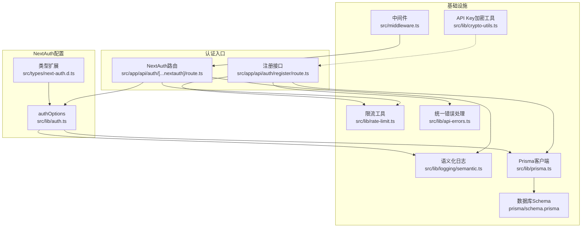
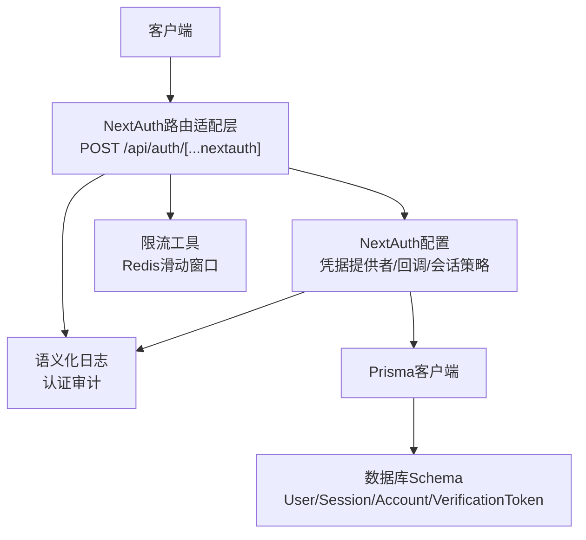
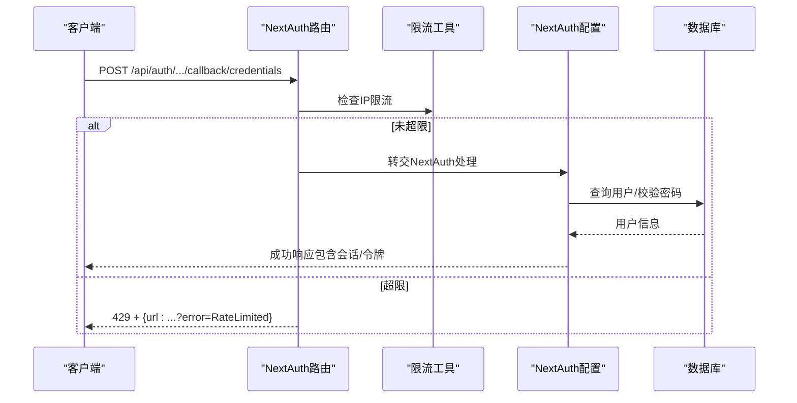
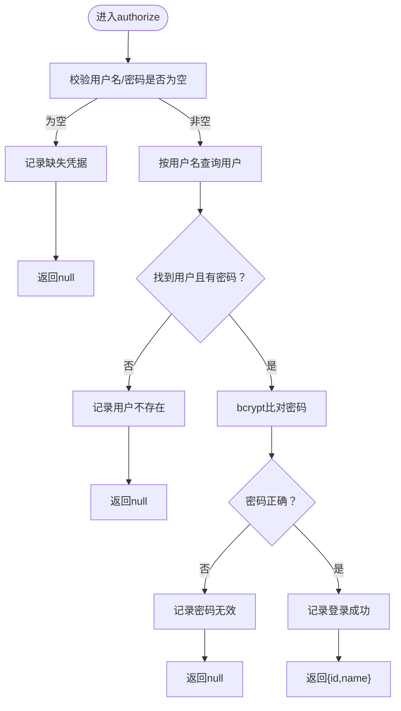
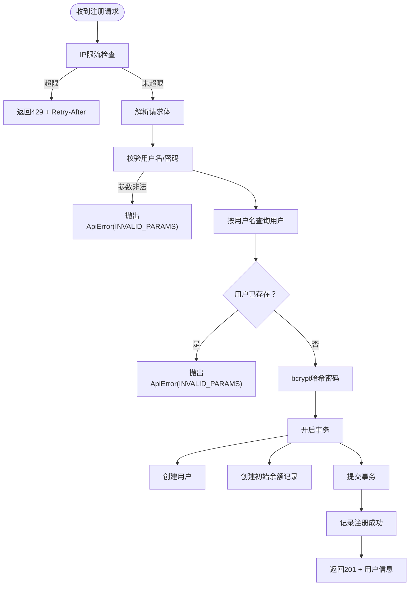
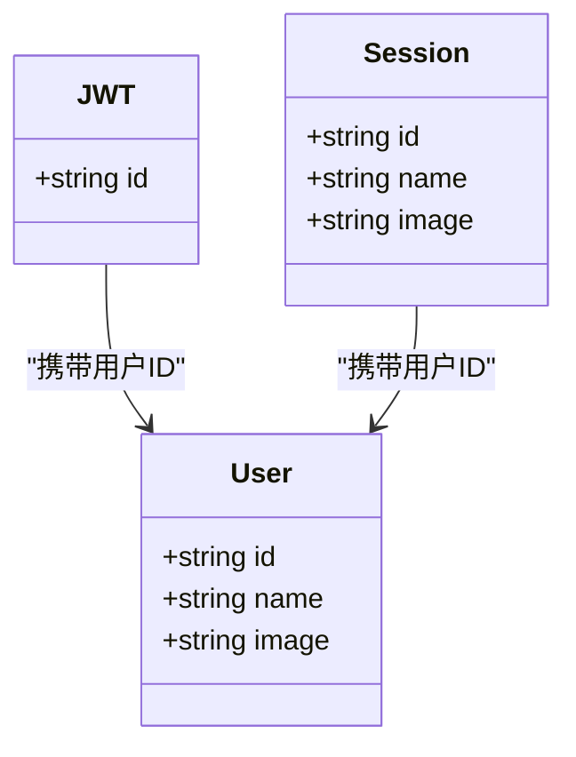
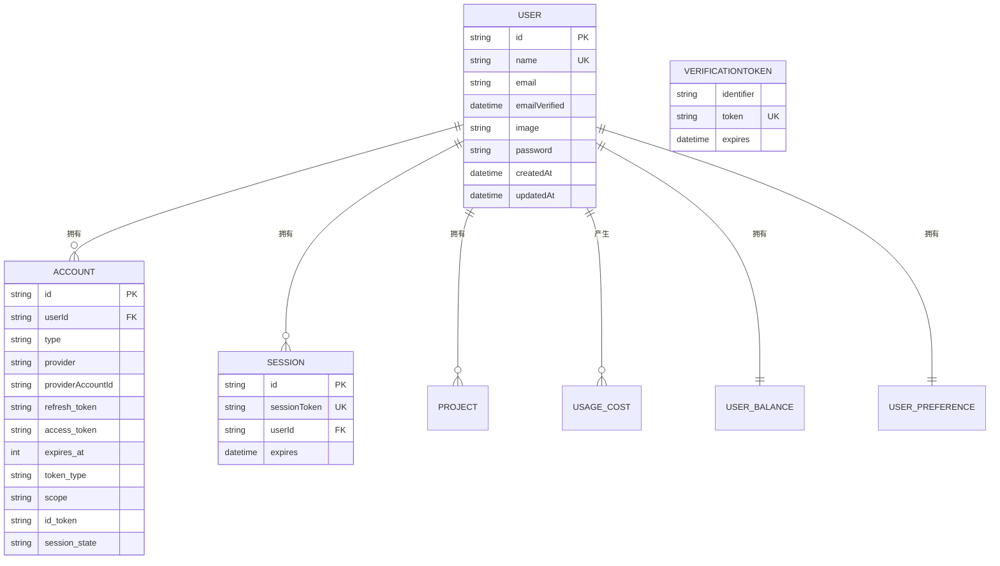
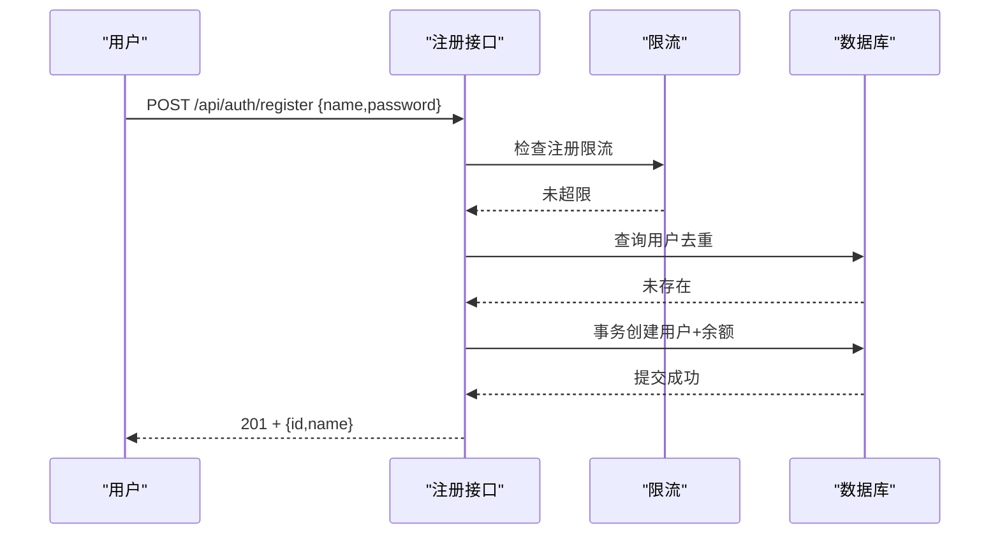
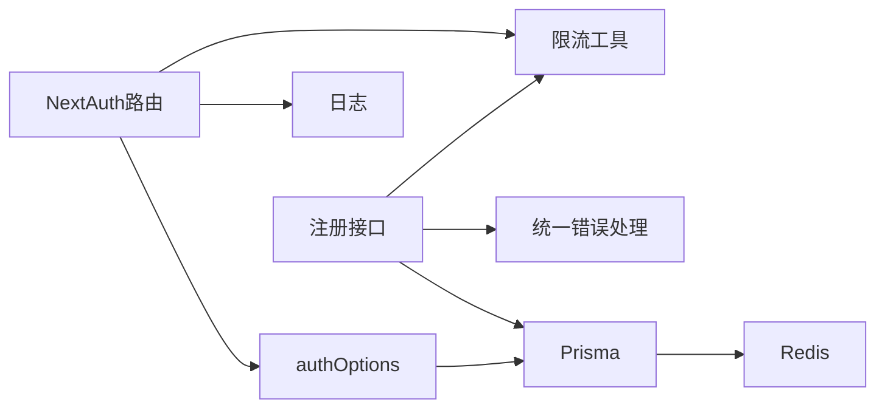

# 认证接口

<cite>
**本文档引用的文件**
- [src/app/api/auth/[...nextauth]/route.ts](file://src/app/api/auth/[...nextauth]/route.ts)
- [src/lib/auth.ts](file://src/lib/auth.ts)
- [src/app/api/auth/register/route.ts](file://src/app/api/auth/register/route.ts)
- [src/lib/rate-limit.ts](file://src/lib/rate-limit.ts)
- [src/lib/logging/semantic.ts](file://src/lib/logging/semantic.ts)
- [src/lib/api-errors.ts](file://src/lib/api-errors.ts)
- [src/lib/prisma.ts](file://src/lib/prisma.ts)
- [src/types/next-auth.d.ts](file://src/types/next-auth.d.ts)
- [prisma/schema.prisma](file://prisma/schema.prisma)
- [src/middleware.ts](file://src/middleware.ts)
- [src/lib/crypto-utils.ts](file://src/lib/crypto-utils.ts)
</cite>

## 目录
1. [简介](#简介)
2. [项目结构](#项目结构)
3. [核心组件](#核心组件)
4. [架构总览](#架构总览)
5. [详细组件分析](#详细组件分析)
6. [依赖分析](#依赖分析)
7. [性能考量](#性能考量)
8. [故障排查指南](#故障排查指南)
9. [结论](#结论)
10. [附录](#附录)

## 简介
本文件面向Waoowaoo的认证接口，系统性梳理基于NextAuth的认证流程（含OAuth登录、JWT令牌管理与会话维护）、注册接口的用户创建流程与密码策略、登录接口的认证方式与限流策略、API认证的头部格式与权限校验机制，并提供完整的认证流程示例（注册、登录、令牌获取与刷新）。同时总结安全考虑（CSRF保护、XSS防护、会话劫持防范）、错误处理、账户锁定与安全审计要点。

## 项目结构
认证相关的核心代码分布如下：
- NextAuth路由适配层：负责拦截NextAuth回调并注入限流与日志
- NextAuth配置：定义凭据提供者、会话策略、回调与页面重定向
- 注册接口：用户名+密码注册，密码哈希与事务创建用户及余额
- 限流工具：基于Redis滑动窗口的IP级速率限制
- 日志与审计：统一语义化日志，包含认证事件审计
- 错误处理：统一ApiError封装与标准化响应
- 数据库Schema：用户、会话、账户、验证码等模型
- 中间件：国际化与路径匹配（与认证间接相关）

**图表来源**
- [src/app/api/auth/[...nextauth]/route.ts:1-51](file://src/app/api/auth/[...nextauth]/route.ts#L1-L51)
- [src/lib/auth.ts:1-79](file://src/lib/auth.ts#L1-L79)
- [src/app/api/auth/register/route.ts:1-88](file://src/app/api/auth/register/route.ts#L1-L88)
- [src/lib/rate-limit.ts:1-146](file://src/lib/rate-limit.ts#L1-L146)
- [src/lib/logging/semantic.ts:1-237](file://src/lib/logging/semantic.ts#L1-L237)
- [src/lib/api-errors.ts:1-571](file://src/lib/api-errors.ts#L1-L571)
- [src/lib/prisma.ts:1-9](file://src/lib/prisma.ts#L1-L9)
- [prisma/schema.prisma:1-800](file://prisma/schema.prisma#L1-L800)
- [src/middleware.ts:1-28](file://src/middleware.ts#L1-L28)
- [src/lib/crypto-utils.ts:1-195](file://src/lib/crypto-utils.ts#L1-L195)

**章节来源**
- [src/app/api/auth/[...nextauth]/route.ts:1-51](file://src/app/api/auth/[...nextauth]/route.ts#L1-L51)
- [src/lib/auth.ts:1-79](file://src/lib/auth.ts#L1-L79)
- [src/app/api/auth/register/route.ts:1-88](file://src/app/api/auth/register/route.ts#L1-L88)
- [src/lib/rate-limit.ts:1-146](file://src/lib/rate-limit.ts#L1-L146)
- [src/lib/logging/semantic.ts:1-237](file://src/lib/logging/semantic.ts#L1-L237)
- [src/lib/api-errors.ts:1-571](file://src/lib/api-errors.ts#L1-L571)
- [src/lib/prisma.ts:1-9](file://src/lib/prisma.ts#L1-L9)
- [prisma/schema.prisma:1-800](file://prisma/schema.prisma#L1-L800)
- [src/middleware.ts:1-28](file://src/middleware.ts#L1-L28)
- [src/lib/crypto-utils.ts:1-195](file://src/lib/crypto-utils.ts#L1-L195)

## 核心组件
- NextAuth路由适配层
  - 作用：拦截NextAuth回调，对“凭据登录”进行IP限流；其他内部路由（如session/csrf）透传
  - 关键点：兼容NextAuth客户端signIn()返回格式，限流时返回包含错误参数的URL
- NextAuth配置
  - 凭据提供者：用户名/密码校验，bcrypt比对
  - 会话策略：JWT策略，回调注入用户ID到token与session
  - 页面重定向：登录页
- 注册接口
  - 输入校验：用户名、密码长度
  - 密码策略：bcrypt哈希，成本因子
  - 幂等与一致性：事务创建用户与初始余额
  - 限流：注册接口IP限流
- 限流工具
  - 滑动窗口：基于Redis ZSET原子操作，Lua脚本清理过期与计数
  - 配置：登录/注册不同阈值
- 日志与审计
  - 统一语义化日志模块，认证事件标记为审计事件
- 错误处理
  - 统一ApiError封装，标准化响应结构，包含错误码、可重试标识、用户消息键
- 数据模型
  - 用户、会话、账户、验证码等，支撑NextAuth与业务用户体系

**章节来源**
- [src/app/api/auth/[...nextauth]/route.ts:10-44](file://src/app/api/auth/[...nextauth]/route.ts#L10-L44)
- [src/lib/auth.ts:15-78](file://src/lib/auth.ts#L15-L78)
- [src/app/api/auth/register/route.ts:8-88](file://src/app/api/auth/register/route.ts#L8-L88)
- [src/lib/rate-limit.ts:58-118](file://src/lib/rate-limit.ts#L58-L118)
- [src/lib/logging/semantic.ts:218-236](file://src/lib/logging/semantic.ts#L218-L236)
- [src/lib/api-errors.ts:396-420](file://src/lib/api-errors.ts#L396-L420)
- [prisma/schema.prisma:402-429](file://prisma/schema.prisma#L402-L429)

## 架构总览
下图展示了认证子系统的交互关系与数据流向：

**图表来源**
- [src/app/api/auth/[...nextauth]/route.ts:1-51](file://src/app/api/auth/[...nextauth]/route.ts#L1-L51)
- [src/lib/auth.ts:1-79](file://src/lib/auth.ts#L1-L79)
- [src/lib/rate-limit.ts:1-146](file://src/lib/rate-limit.ts#L1-L146)
- [src/lib/logging/semantic.ts:1-237](file://src/lib/logging/semantic.ts#L1-L237)
- [src/lib/prisma.ts:1-9](file://src/lib/prisma.ts#L1-L9)
- [prisma/schema.prisma:1-800](file://prisma/schema.prisma#L1-L800)

## 详细组件分析

### NextAuth路由适配层
- 功能
  - 识别“凭据登录”回调路径，对该路径进行IP限流
  - 保持NextAuth客户端兼容的响应格式（包含url字段）
  - 其他NextAuth内部路由（如session/csrf）直接透传
- 限流策略
  - 登录：60秒内最多5次
  - 限流触发时返回429与Retry-After头，响应体仍满足NextAuth客户端解析要求
- 日志
  - 认证事件统一记录，便于审计

**图表来源**
- [src/app/api/auth/[...nextauth]/route.ts:19-44](file://src/app/api/auth/[...nextauth]/route.ts#L19-L44)
- [src/lib/rate-limit.ts:58-118](file://src/lib/rate-limit.ts#L58-L118)
- [src/lib/auth.ts:22-54](file://src/lib/auth.ts#L22-L54)
- [src/lib/logging/semantic.ts:218-236](file://src/lib/logging/semantic.ts#L218-L236)

**章节来源**
- [src/app/api/auth/[...nextauth]/route.ts:10-44](file://src/app/api/auth/[...nextauth]/route.ts#L10-L44)
- [src/lib/rate-limit.ts:35-45](file://src/lib/rate-limit.ts#L35-L45)

### NextAuth配置（凭据登录与JWT）
- 凭据提供者
  - 字段：用户名、密码
  - 校验：查询用户是否存在且密码有效（bcrypt）
  - 成功：返回最小用户信息（id/name）
- 会话策略
  - 使用JWT策略
  - 回调：将用户ID写入token；在session回调中将ID注入session.user
- 页面
  - 登录页重定向至“/auth/signin”
- Cookie与协议
  - 根据NEXTAUTH_URL协议动态决定是否使用Secure Cookie，支持局域网HTTP场景

**图表来源**
- [src/lib/auth.ts:22-54](file://src/lib/auth.ts#L22-L54)
- [src/lib/logging/semantic.ts:218-236](file://src/lib/logging/semantic.ts#L218-L236)

**章节来源**
- [src/lib/auth.ts:15-78](file://src/lib/auth.ts#L15-L78)
- [src/types/next-auth.d.ts:1-22](file://src/types/next-auth.d.ts#L1-L22)

### 注册接口（用户创建、密码策略与邮箱验证）
- 接口路径：POST /api/auth/register
- 输入校验
  - 必填：用户名、密码
  - 密码长度：至少6位
- 去重
  - 按用户名唯一性检查
- 密码策略
  - bcrypt哈希，成本因子12
- 幂等与一致性
  - 事务创建用户与初始余额记录（余额为0）
- 限流
  - 注册：60秒内最多3次
- 响应
  - 成功：201，返回用户基本信息
  - 失败：统一ApiError，包含错误码与用户消息键

**图表来源**
- [src/app/api/auth/register/route.ts:8-88](file://src/app/api/auth/register/route.ts#L8-L88)
- [src/lib/rate-limit.ts:41-45](file://src/lib/rate-limit.ts#L41-L45)
- [src/lib/api-errors.ts:396-420](file://src/lib/api-errors.ts#L396-L420)
- [src/lib/logging/semantic.ts:218-236](file://src/lib/logging/semantic.ts#L218-L236)

**章节来源**
- [src/app/api/auth/register/route.ts:8-88](file://src/app/api/auth/register/route.ts#L8-L88)
- [src/lib/rate-limit.ts:35-45](file://src/lib/rate-limit.ts#L35-L45)
- [src/lib/api-errors.ts:372-392](file://src/lib/api-errors.ts#L372-L392)

### 会话与JWT管理
- 会话策略：JWT
- 回调
  - jwt回调：首次登录时将用户ID写入token
  - session回调：将token中的ID注入session.user
- 类型扩展：明确Session与JWT的字段结构

**图表来源**
- [src/types/next-auth.d.ts:1-22](file://src/types/next-auth.d.ts#L1-L22)
- [src/lib/auth.ts:62-77](file://src/lib/auth.ts#L62-L77)

**章节来源**
- [src/lib/auth.ts:56-78](file://src/lib/auth.ts#L56-L78)
- [src/types/next-auth.d.ts:1-22](file://src/types/next-auth.d.ts#L1-L22)

### 数据模型与关系
- 用户模型：包含用户名、邮箱、密码等字段，关联账户、会话、项目、余额等
- 会话模型：存储会话令牌与过期时间
- 账户模型：支持第三方账户绑定
- 验证令牌：用于邮箱验证等场景

**图表来源**
- [prisma/schema.prisma:402-429](file://prisma/schema.prisma#L402-L429)
- [prisma/schema.prisma:10-28](file://prisma/schema.prisma#L10-L28)
- [prisma/schema.prisma:369-378](file://prisma/schema.prisma#L369-L378)
- [prisma/schema.prisma:474-481](file://prisma/schema.prisma#L474-L481)

**章节来源**
- [prisma/schema.prisma:402-429](file://prisma/schema.prisma#L402-L429)
- [prisma/schema.prisma:10-28](file://prisma/schema.prisma#L10-L28)
- [prisma/schema.prisma:369-378](file://prisma/schema.prisma#L369-L378)
- [prisma/schema.prisma:474-481](file://prisma/schema.prisma#L474-L481)

### API认证头部格式与权限检查
- 头部格式
  - NextAuth/JWT：通过Cookie或Authorization头传递令牌（具体取决于部署与客户端配置）
  - 统一日志：请求携带x-request-id便于追踪
- 权限检查
  - 本仓库未提供通用API鉴权中间件，认证主要由NextAuth与会话/令牌管理承担
  - 若需在后续扩展API鉴权，建议复用现有apiHandler与ApiError体系

**章节来源**
- [src/lib/api-errors.ts:440-562](file://src/lib/api-errors.ts#L440-L562)
- [src/lib/auth.ts:56-78](file://src/lib/auth.ts#L56-L78)

### 完整认证流程示例
- 注册
  - 客户端发送POST /api/auth/register，包含用户名与密码
  - 服务器执行限流、参数校验、去重、密码哈希与事务创建
  - 成功返回201与用户信息
- 登录
  - 客户端发起NextAuth登录（凭据方式）
  - 服务器对“凭据回调”路径进行限流
  - 校验用户名/密码，成功后返回NextAuth兼容响应（包含会话/令牌）
- 令牌获取与刷新
  - 采用JWT策略，令牌有效期由NextAuth配置控制
  - 刷新通常在令牌过期后重新登录获取新JWT

**图表来源**
- [src/app/api/auth/register/route.ts:8-88](file://src/app/api/auth/register/route.ts#L8-L88)
- [src/lib/rate-limit.ts:41-45](file://src/lib/rate-limit.ts#L41-L45)

**章节来源**
- [src/app/api/auth/register/route.ts:8-88](file://src/app/api/auth/register/route.ts#L8-L88)
- [src/app/api/auth/[...nextauth]/route.ts:19-44](file://src/app/api/auth/[...nextauth]/route.ts#L19-L44)

## 依赖分析
- 组件耦合
  - NextAuth路由依赖authOptions与限流工具
  - 注册接口依赖限流、统一错误处理与Prisma
  - 日志模块贯穿认证与注册流程
- 外部依赖
  - Redis：限流工具依赖
  - Prisma：用户与会话数据访问
  - bcrypt：密码哈希
- 潜在循环依赖
  - 未发现直接循环；各模块职责清晰

**图表来源**
- [src/app/api/auth/[...nextauth]/route.ts:1-51](file://src/app/api/auth/[...nextauth]/route.ts#L1-L51)
- [src/lib/auth.ts:1-79](file://src/lib/auth.ts#L1-L79)
- [src/app/api/auth/register/route.ts:1-88](file://src/app/api/auth/register/route.ts#L1-L88)
- [src/lib/rate-limit.ts:1-146](file://src/lib/rate-limit.ts#L1-L146)
- [src/lib/api-errors.ts:1-571](file://src/lib/api-errors.ts#L1-L571)
- [src/lib/prisma.ts:1-9](file://src/lib/prisma.ts#L1-L9)

**章节来源**
- [src/app/api/auth/[...nextauth]/route.ts:1-51](file://src/app/api/auth/[...nextauth]/route.ts#L1-L51)
- [src/lib/auth.ts:1-79](file://src/lib/auth.ts#L1-L79)
- [src/app/api/auth/register/route.ts:1-88](file://src/app/api/auth/register/route.ts#L1-L88)
- [src/lib/rate-limit.ts:1-146](file://src/lib/rate-limit.ts#L1-L146)
- [src/lib/api-errors.ts:1-571](file://src/lib/api-errors.ts#L1-L571)
- [src/lib/prisma.ts:1-9](file://src/lib/prisma.ts#L1-L9)

## 性能考量
- 限流策略
  - 登录/注册分别配置不同阈值，避免暴力破解与滥用
  - Redis滑动窗口原子计数，Lua脚本减少往返开销
- 密码哈希
  - bcrypt成本因子12，在安全性与性能间取得平衡
- 事务一致性
  - 注册流程在单事务中完成，降低不一致风险
- 日志与审计
  - 语义化日志模块支持审计事件，便于追踪与排障

**章节来源**
- [src/lib/rate-limit.ts:58-118](file://src/lib/rate-limit.ts#L58-L118)
- [src/app/api/auth/register/route.ts:49-73](file://src/app/api/auth/register/route.ts#L49-L73)
- [src/lib/logging/semantic.ts:218-236](file://src/lib/logging/semantic.ts#L218-L236)

## 故障排查指南
- 登录被限流
  - 现象：返回429，响应体包含NextAuth兼容的错误URL
  - 处理：等待Retry-After秒数后重试
- 注册频繁
  - 现象：返回429，提示请求过于频繁
  - 处理：遵守限流规则，稍后再试
- 参数错误
  - 现象：INVALID_PARAMS错误码
  - 处理：检查用户名与密码格式与长度
- 密码错误
  - 现象：登录失败，日志记录“Invalid password”
  - 处理：确认密码正确性
- 安全审计
  - 使用语义化日志模块记录认证事件，便于审计与追踪

**章节来源**
- [src/app/api/auth/[...nextauth]/route.ts:29-40](file://src/app/api/auth/[...nextauth]/route.ts#L29-L40)
- [src/app/api/auth/register/route.ts:13-21](file://src/app/api/auth/register/route.ts#L13-L21)
- [src/lib/api-errors.ts:372-392](file://src/lib/api-errors.ts#L372-L392)
- [src/lib/logging/semantic.ts:218-236](file://src/lib/logging/semantic.ts#L218-L236)

## 结论
本认证体系以NextAuth为核心，结合JWT会话策略、严格的凭据校验与Redis限流，提供了安全可靠的登录体验。注册接口具备完善的输入校验、密码策略与事务一致性保障。日志与审计模块贯穿关键流程，便于运维与安全审计。后续如需扩展API鉴权，可复用现有统一错误处理与日志框架。

## 附录
- CSRF保护
  - NextAuth默认提供CSRF保护，确保登录表单与回调的安全性
- XSS防护
  - 建议在应用层对输入进行严格校验与输出编码，避免XSS
- 会话劫持防范
  - 使用HTTPS与Secure Cookie（根据协议自动切换），合理设置SameSite与过期时间
- 账户锁定与安全审计
  - 可基于限流与日志进一步扩展账户锁定策略与更细粒度的审计事件

[本节为通用安全建议，无需特定文件引用]