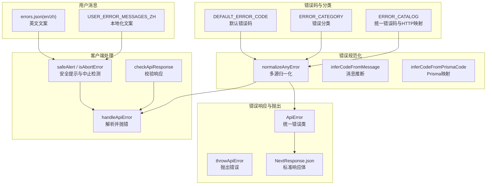
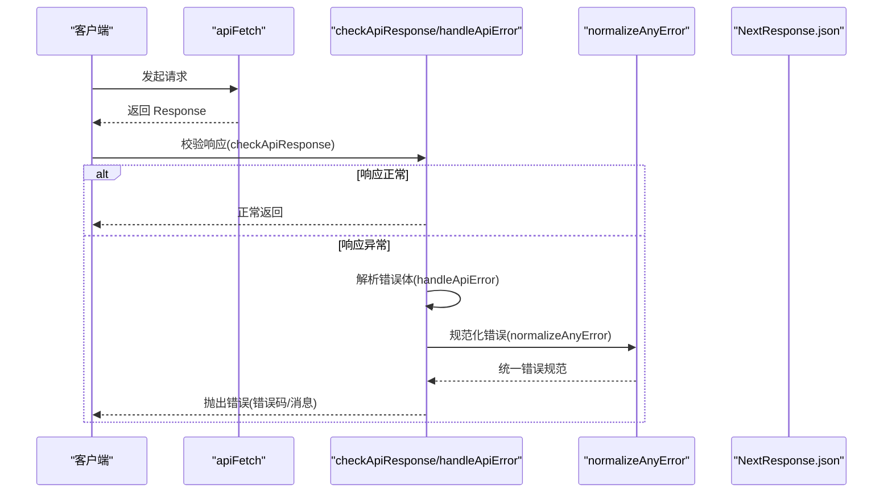
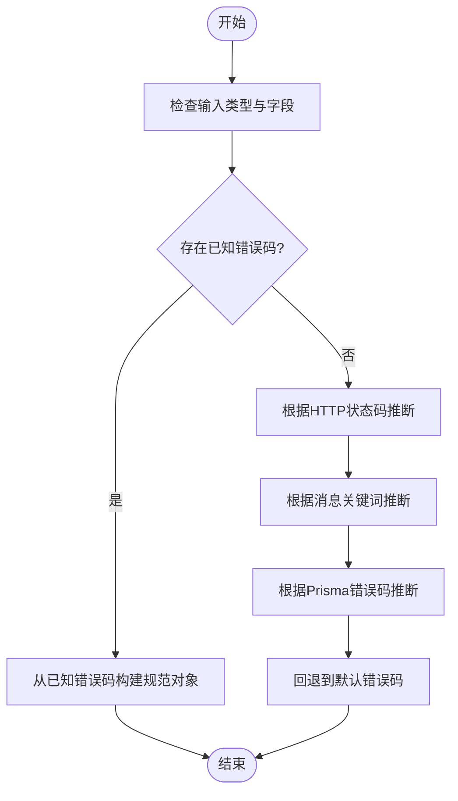
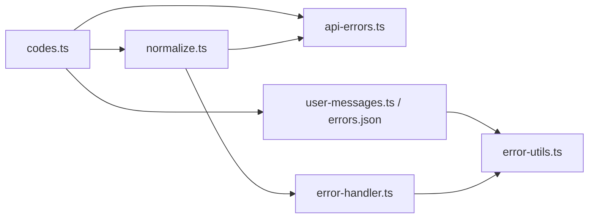
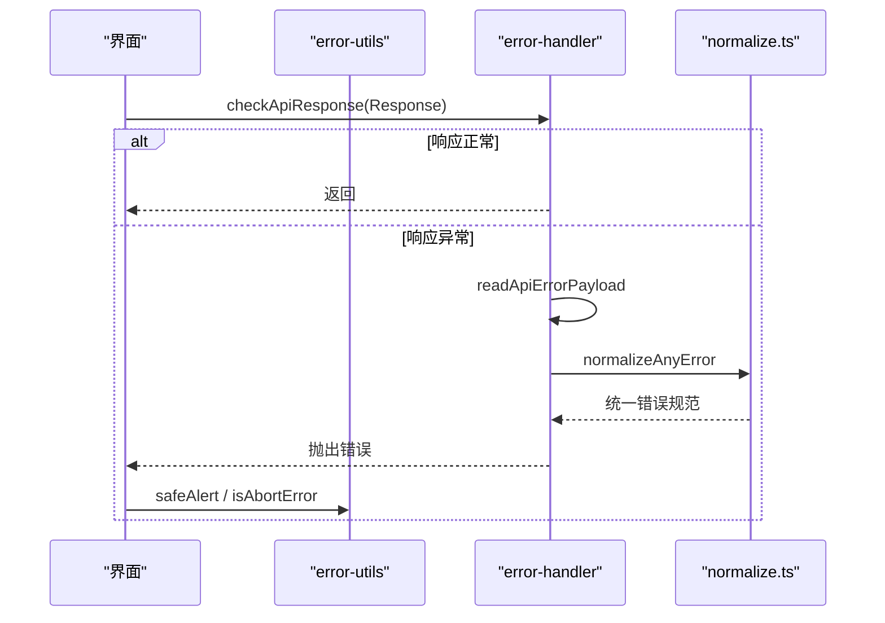

# 错误码说明

<cite>
**本文引用的文件**
- [src/lib/errors/codes.ts](file://src/lib/errors/codes.ts)
- [src/lib/errors/normalize.ts](file://src/lib/errors/normalize.ts)
- [src/lib/errors/types.ts](file://src/lib/errors/types.ts)
- [src/lib/errors/user-messages.ts](file://src/lib/errors/user-messages.ts)
- [messages/en/errors.json](file://messages/en/errors.json)
- [src/lib/error-handler.ts](file://src/lib/error-handler.ts)
- [src/lib/error-utils.ts](file://src/lib/error-utils.ts)
- [src/lib/api-errors.ts](file://src/lib/api-errors.ts)
- [src/lib/api-fetch.ts](file://src/lib/api-fetch.ts)
- [tests/unit/task/error-catalog.contract.test.ts](file://tests/unit/task/error-catalog.contract.test.ts)
- [tests/unit/helpers/read-error-message.test.ts](file://tests/unit/helpers/read-error-message.test.ts)
</cite>

## 目录
1. [简介](#简介)
2. [项目结构](#项目结构)
3. [核心组件](#核心组件)
4. [架构总览](#架构总览)
5. [详细组件分析](#详细组件分析)
6. [依赖关系分析](#依赖关系分析)
7. [性能考量](#性能考量)
8. [故障排除指南](#故障排除指南)
9. [结论](#结论)
10. [附录](#附录)

## 简介
本文件为 Waoowaoo 的 API 错误码与错误处理体系提供系统化说明，覆盖以下要点：
- 统一错误码与分类体系
- HTTP 状态码与错误码映射规则
- 标准错误响应格式与字段说明
- 客户端错误（4xx）与服务器错误（5xx）的差异与处理方式
- 常见错误场景的诊断与解决路径
- 错误日志格式、调试信息与故障排除技巧
- 错误恢复策略与重试机制最佳实践

## 项目结构
围绕错误码与错误处理的关键模块如下：
- 错误码与分类：统一错误码常量、HTTP 映射、分类与默认值
- 错误规范化：从多种来源（HTTP 状态、消息文本、Prisma 错误、Provider 错误等）推断统一错误码
- 错误响应与抛出：标准化 API 响应体、ApiError 类型与错误抛出
- 客户端错误处理：统一读取与解析错误响应、安全提示与中止检测
- 用户消息映射：按错误码输出本地化提示文案
- 测试契约：确保错误目录一致性与行为约束

图表来源
- [src/lib/errors/codes.ts:12-181](file://src/lib/errors/codes.ts#L12-L181)
- [src/lib/errors/normalize.ts:195-291](file://src/lib/errors/normalize.ts#L195-L291)
- [src/lib/api-errors.ts:396-570](file://src/lib/api-errors.ts#L396-L570)
- [src/lib/error-handler.ts:60-97](file://src/lib/error-handler.ts#L60-L97)
- [src/lib/error-utils.ts:10-85](file://src/lib/error-utils.ts#L10-L85)
- [src/lib/errors/user-messages.ts:30-32](file://src/lib/errors/user-messages.ts#L30-L32)
- [messages/en/errors.json:1-23](file://messages/en/errors.json#L1-L23)

章节来源
- [src/lib/errors/codes.ts:1-205](file://src/lib/errors/codes.ts#L1-L205)
- [src/lib/errors/normalize.ts:1-340](file://src/lib/errors/normalize.ts#L1-L340)
- [src/lib/api-errors.ts:396-570](file://src/lib/api-errors.ts#L396-L570)
- [src/lib/error-handler.ts:1-98](file://src/lib/error-handler.ts#L1-L98)
- [src/lib/error-utils.ts:1-86](file://src/lib/error-utils.ts#L1-L86)
- [src/lib/errors/user-messages.ts:1-33](file://src/lib/errors/user-messages.ts#L1-L33)
- [messages/en/errors.json:1-23](file://messages/en/errors.json#L1-L23)

## 核心组件
- 统一错误码与分类
  - 错误码集合：包含鉴权、计费、内容、Provider、系统、校验等类别下的具体错误码
  - HTTP 映射：每个错误码绑定一个 HTTP 状态码（2xx/4xx/5xx）
  - 默认错误码：未知或无法归一化的错误回退到默认错误码
- 错误规范化器
  - 输入来源：错误对象、HTTP 状态码、消息文本、Prisma 错误、Provider 错误、任务错误
  - 输出：统一错误规范对象，包含 code、message、httpStatus、retryable、category、userMessageKey、details、provider
- API 错误类与响应
  - ApiError：携带 code、status、details、retryable、category、userMessageKey
  - 标准响应体：success=false、error 对象（含 code、message、retryable、category、userMessageKey、details）、兼容字段（code、message）
- 客户端错误处理
  - checkApiResponse / handleApiError：读取响应体、解析错误、抛出统一错误
  - safeAlert / isAbortError：对页面刷新/中止等场景进行安全提示与静默处理
- 用户消息映射
  - USER_ERROR_MESSAGES_ZH：按错误码映射中文提示
  - messages/en/errors.json：英文提示文案

章节来源
- [src/lib/errors/codes.ts:12-181](file://src/lib/errors/codes.ts#L12-L181)
- [src/lib/errors/normalize.ts:195-291](file://src/lib/errors/normalize.ts#L195-L291)
- [src/lib/api-errors.ts:396-570](file://src/lib/api-errors.ts#L396-L570)
- [src/lib/error-handler.ts:60-97](file://src/lib/error-handler.ts#L60-L97)
- [src/lib/error-utils.ts:10-85](file://src/lib/error-utils.ts#L10-L85)
- [src/lib/errors/user-messages.ts:30-32](file://src/lib/errors/user-messages.ts#L30-L32)
- [messages/en/errors.json:1-23](file://messages/en/errors.json#L1-L23)

## 架构总览
下图展示从“调用 API”到“客户端接收并处理错误”的完整流程，以及错误码如何在各层之间传递与转换。

图表来源
- [src/lib/api-fetch.ts:47-52](file://src/lib/api-fetch.ts#L47-L52)
- [src/lib/error-handler.ts:87-93](file://src/lib/error-handler.ts#L87-L93)
- [src/lib/error-handler.ts:60-84](file://src/lib/error-handler.ts#L60-L84)
- [src/lib/errors/normalize.ts:195-291](file://src/lib/errors/normalize.ts#L195-L291)

## 详细组件分析

### 统一错误码与分类
- 错误码清单与映射
  - 鉴权相关：UNAUTHORIZED、FORBIDDEN
  - 资源与校验：NOT_FOUND、INVALID_PARAMS、MISSING_CONFIG、CONFLICT
  - 计费相关：INSUFFICIENT_BALANCE
  - Provider 相关：RATE_LIMIT、QUOTA_EXCEEDED、MODEL_NOT_OPEN、MODEL_NOT_REGISTERED、MODEL_NOT_CONFIGURED、EXTERNAL_ERROR、NETWORK_ERROR、EMPTY_RESPONSE、SENSITIVE_CONTENT、GENERATION_TIMEOUT、VIDEO_API_FORMAT_UNSUPPORTED、GENERATION_FAILED
  - 系统相关：TASK_NOT_READY、NO_RESULT、WATCHDOG_TIMEOUT、WORKER_EXECUTION_ERROR、INTERNAL_ERROR
- 分类与可重试性
  - 分类：AUTH、BILLING、CONTENT、PROVIDER、SYSTEM、VALIDATION
  - 可重试性：部分错误码标记 retryable=true，通常对应 202、429、5xx；非 4xx 的 retryable 错误仅限 202、429
- 默认错误码
  - DEFAULT_ERROR_CODE：当无法归一化时回退到 INTERNAL_ERROR

章节来源
- [src/lib/errors/codes.ts:12-181](file://src/lib/errors/codes.ts#L12-L181)
- [src/lib/errors/codes.ts:185-205](file://src/lib/errors/codes.ts#L185-L205)
- [tests/unit/task/error-catalog.contract.test.ts:20-26](file://tests/unit/task/error-catalog.contract.test.ts#L20-L26)

### 错误规范化流程
- 输入来源
  - 错误对象（含 code、status、message、details、provider）
  - Prisma 错误（通过错误码映射）
  - Provider/外部服务错误（通过消息关键词与状态码推断）
  - 任务错误（特殊处理 TASK_CANCELLED 等）
- 推断逻辑
  - 先尝试解析已知错误码（大小写不敏感、别名映射）
  - 再根据 HTTP 状态码与消息关键词匹配
  - 最后基于 Prisma 错误码映射
- 输出结构
  - code、message、httpStatus、retryable、category、userMessageKey、details、provider

图表来源
- [src/lib/errors/normalize.ts:195-291](file://src/lib/errors/normalize.ts#L195-L291)

章节来源
- [src/lib/errors/normalize.ts:195-291](file://src/lib/errors/normalize.ts#L195-L291)

### API 错误类与标准响应
- ApiError
  - 字段：code、status、details、retryable、category、userMessageKey
  - 构造：从错误码获取默认消息，允许传入自定义 message 覆盖
- 标准响应体
  - 成功：success=true
  - 失败：success=false，error 对象包含 code、message、retryable、category、userMessageKey、details；同时保留兼容字段 code、message
  - 请求 ID：响应头 x-request-id
- 抛出与捕获
  - throwApiError：直接抛出 ApiError
  - normalizeError：将任意错误规范化为 ApiError

章节来源
- [src/lib/api-errors.ts:396-570](file://src/lib/api-errors.ts#L396-L570)

### 客户端错误处理与安全提示
- 校验与解析
  - checkApiResponse：若响应非 ok，调用 handleApiError
  - handleApiError：读取 JSON 错误体，解析 code/message/details，使用 normalizeAnyError 归一化，抛出统一错误
- 安全提示
  - safeAlert：对页面刷新/中止导致的错误静默处理，避免误导提示
  - isAbortError：识别 AbortError、网络中止、取消等场景
- 语言注入
  - apiFetch：对 /api 路径自动注入 Accept-Language 头部

章节来源
- [src/lib/error-handler.ts:60-97](file://src/lib/error-handler.ts#L60-L97)
- [src/lib/error-utils.ts:10-85](file://src/lib/error-utils.ts#L10-L85)
- [src/lib/api-fetch.ts:39-52](file://src/lib/api-fetch.ts#L39-L52)

### 用户消息与本地化
- 中文映射：USER_ERROR_MESSAGES_ZH
- 英文映射：messages/en/errors.json
- 使用方式：resolveClientError 获取 code/message/rawMessage，结合用户消息键生成提示

章节来源
- [src/lib/errors/user-messages.ts:30-32](file://src/lib/errors/user-messages.ts#L30-L32)
- [messages/en/errors.json:1-23](file://messages/en/errors.json#L1-L23)

## 依赖关系分析
- 组件耦合
  - 错误码与分类（codes.ts）是规范化与响应的基础
  - 规范化器（normalize.ts）依赖错误码与分类，并向 API 层与客户端层提供统一错误
  - API 层（api-errors.ts）依赖规范化器与错误码
  - 客户端层（error-handler.ts、error-utils.ts）依赖规范化器与用户消息
- 关键依赖链
  - codes.ts → normalize.ts → api-errors.ts → error-handler.ts
  - codes.ts → user-messages.ts / messages/en/errors.json → error-utils.ts

图表来源
- [src/lib/errors/codes.ts:12-181](file://src/lib/errors/codes.ts#L12-L181)
- [src/lib/errors/normalize.ts:195-291](file://src/lib/errors/normalize.ts#L195-L291)
- [src/lib/api-errors.ts:396-570](file://src/lib/api-errors.ts#L396-L570)
- [src/lib/error-handler.ts:60-97](file://src/lib/error-handler.ts#L60-L97)
- [src/lib/error-utils.ts:42-57](file://src/lib/error-utils.ts#L42-L57)
- [src/lib/errors/user-messages.ts:30-32](file://src/lib/errors/user-messages.ts#L30-L32)
- [messages/en/errors.json:1-23](file://messages/en/errors.json#L1-L23)

章节来源
- [src/lib/errors/codes.ts:12-181](file://src/lib/errors/codes.ts#L12-L181)
- [src/lib/errors/normalize.ts:195-291](file://src/lib/errors/normalize.ts#L195-L291)
- [src/lib/api-errors.ts:396-570](file://src/lib/api-errors.ts#L396-L570)
- [src/lib/error-handler.ts:60-97](file://src/lib/error-handler.ts#L60-L97)
- [src/lib/error-utils.ts:42-57](file://src/lib/error-utils.ts#L42-L57)
- [src/lib/errors/user-messages.ts:30-32](file://src/lib/errors/user-messages.ts#L30-L32)
- [messages/en/errors.json:1-23](file://messages/en/errors.json#L1-L23)

## 性能考量
- 错误规范化复杂度
  - 主要为字符串匹配与状态码判断，整体为线性复杂度 O(n)，其中 n 为关键词数量
- 建议
  - 尽量减少重复规范化调用，缓存已知错误码
  - 在前端聚合错误提示，避免频繁弹窗影响用户体验

## 故障排除指南
- 常见错误场景与诊断
  - 401 未授权：检查鉴权令牌与登录状态
  - 403 权限/欠费：检查账户余额与模型权限是否激活
  - 404 资源不存在：确认资源 ID 与路径
  - 409 冲突：检查并发状态与幂等性
  - 422 敏感内容：调整输入内容或策略
  - 429 速率限制：遵循重试时间与降频策略
  - 502/503 外部错误：检查上游服务可用性
  - 504 生成超时：检查模型负载与超时阈值
  - 500 内部错误：查看服务日志与堆栈
- 客户端处理要点
  - 使用 checkApiResponse 自动抛错，避免遗漏
  - 使用 safeAlert 避免页面刷新导致的误报
  - 使用 isAbortError 判断网络中止场景
- 日志与追踪
  - 服务端响应头 x-request-id 便于跨服务追踪
  - 客户端错误详情包含 details 与 provider 字段，有助于定位 Provider 侧问题

章节来源
- [src/lib/error-handler.ts:60-97](file://src/lib/error-handler.ts#L60-L97)
- [src/lib/error-utils.ts:10-85](file://src/lib/error-utils.ts#L10-L85)
- [src/lib/api-errors.ts:534-557](file://src/lib/api-errors.ts#L534-L557)

## 结论
Waoowaoo 的错误处理体系以统一错误码为核心，通过规范化器实现多源错误的统一表达，并在 API 层与客户端层提供一致的错误响应与处理流程。借助明确的分类、可重试性标记与本地化消息映射，开发者可以快速定位问题并采取合适的恢复与重试策略。

## 附录

### API 错误响应标准格式
- 响应体字段
  - success：布尔，失败时为 false
  - code：字符串，错误码
  - message：字符串，错误消息
  - error：对象，包含
    - code：字符串，错误码
    - message：字符串，错误消息
    - retryable：布尔，是否可重试
    - category：字符串，错误分类
    - userMessageKey：字符串，用户提示键
    - details：对象，附加细节（如 requestId、prismaCode、provider 等）
  - 兼容字段：code、message（与 error 同级）
- 响应头
  - x-request-id：请求 ID，便于追踪

章节来源
- [src/lib/api-errors.ts:534-557](file://src/lib/api-errors.ts#L534-L557)

### 客户端错误处理流程

图表来源
- [src/lib/error-handler.ts:87-93](file://src/lib/error-handler.ts#L87-L93)
- [src/lib/error-handler.ts:60-84](file://src/lib/error-handler.ts#L60-L84)
- [src/lib/errors/normalize.ts:195-291](file://src/lib/errors/normalize.ts#L195-L291)
- [src/lib/error-utils.ts:63-85](file://src/lib/error-utils.ts#L63-L85)

### 错误码对照表（节选）
- 鉴权与权限
  - UNAUTHORIZED（401）、FORBIDDEN（403）
- 资源与校验
  - NOT_FOUND（404）、INVALID_PARAMS（400）、MISSING_CONFIG（400）、CONFLICT（409）
- 计费
  - INSUFFICIENT_BALANCE（402）
- Provider 与生成
  - RATE_LIMIT（429）、QUOTA_EXCEEDED（429）、MODEL_NOT_OPEN（403）、MODEL_NOT_REGISTERED（400）、MODEL_NOT_CONFIGURED（400）、EXTERNAL_ERROR（502/503）、NETWORK_ERROR（502）、EMPTY_RESPONSE（502）、SENSITIVE_CONTENT（422）、GENERATION_TIMEOUT（504）、VIDEO_API_FORMAT_UNSUPPORTED（400）、GENERATION_FAILED（500）
- 系统
  - TASK_NOT_READY（202）、NO_RESULT（404）、WATCHDOG_TIMEOUT（500）、WORKER_EXECUTION_ERROR（500）、INTERNAL_ERROR（500）

章节来源
- [src/lib/errors/codes.ts:12-181](file://src/lib/errors/codes.ts#L12-L181)

### 客户端错误（4xx）与服务器错误（5xx）区别与处理
- 区分
  - 4xx：客户端参数、权限、资源等问题，通常不可重试
  - 5xx：服务端或外部服务异常，可能可重试
- 处理
  - 4xx：修正请求参数、权限或资源状态
  - 5xx：指数退避重试、熔断保护、降级策略

章节来源
- [src/lib/errors/codes.ts:12-181](file://src/lib/errors/codes.ts#L12-L181)
- [tests/unit/task/error-catalog.contract.test.ts:20-26](file://tests/unit/task/error-catalog.contract.test.ts#L20-L26)

### 错误日志格式与调试信息
- 服务端
  - 响应头：x-request-id
  - 响应体：error.details 中包含 requestId、provider、prismaCode 等
- 客户端
  - isAbortError：识别网络中止场景，避免误报
  - safeAlert：对中止错误静默处理，记录日志

章节来源
- [src/lib/api-errors.ts:534-557](file://src/lib/api-errors.ts#L534-L557)
- [src/lib/error-utils.ts:10-40](file://src/lib/error-utils.ts#L10-L40)

### 常见错误场景诊断清单
- 401/403：核对鉴权与权限；欠费场景优先于普通 403
- 404：核对资源是否存在与路径是否正确
- 429：检查速率限制与配额；遵循重试时间
- 502/503：检查上游服务健康状况
- 504：检查生成超时阈值与模型负载
- 500：查看服务日志与堆栈，必要时降级或熔断

章节来源
- [src/lib/errors/normalize.ts:264-279](file://src/lib/errors/normalize.ts#L264-L279)
- [src/lib/errors/normalize.ts:166-184](file://src/lib/errors/normalize.ts#L166-L184)

### 错误恢复策略与重试机制最佳实践
- 可重试错误
  - 202（任务未就绪）、429（限流）、5xx（外部/内部错误）可采用指数退避重试
- 不可重试错误
  - 4xx（除 429、202）与部分 5xx（如内部错误）需人工干预
- 重试建议
  - 设置最大重试次数与上限时间
  - 对不同错误码采用差异化退避策略
  - 在客户端区分中止与可重试错误，避免无效重试

章节来源
- [src/lib/errors/codes.ts:12-181](file://src/lib/errors/codes.ts#L12-L181)
- [tests/unit/task/error-catalog.contract.test.ts:20-26](file://tests/unit/task/error-catalog.contract.test.ts#L20-L26)