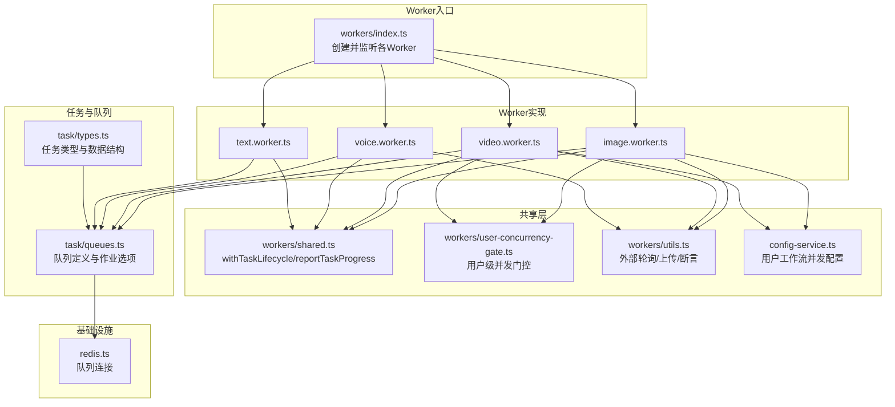
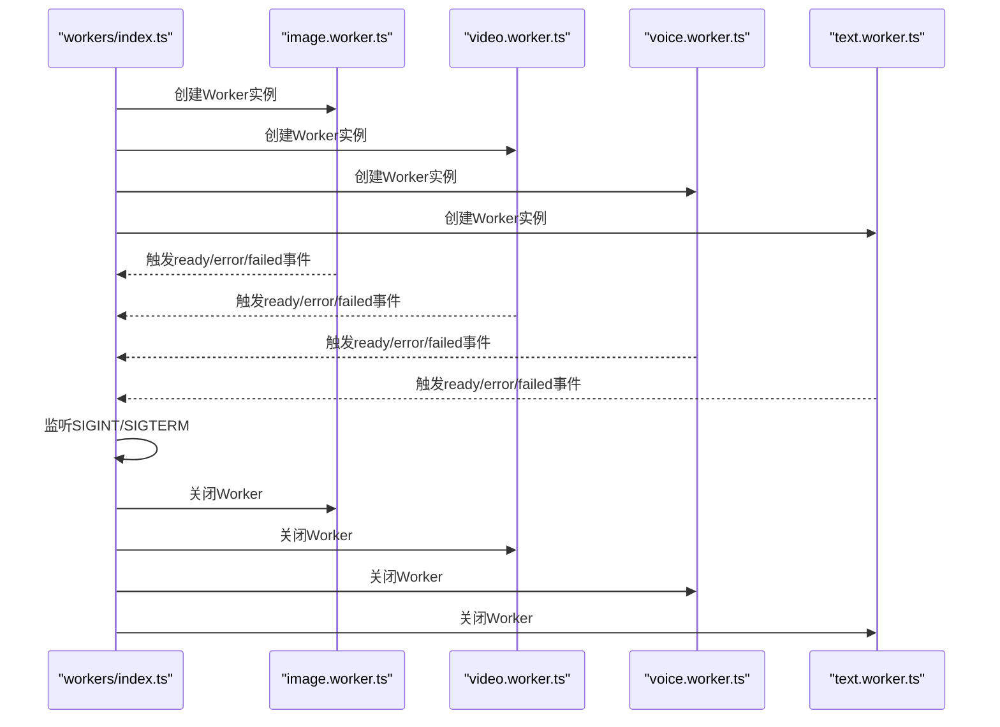
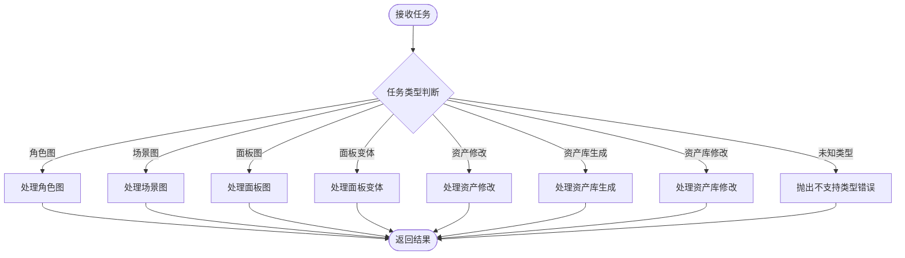
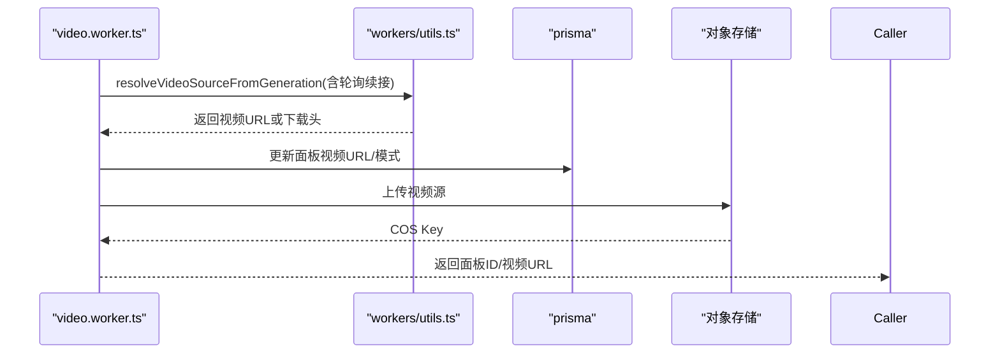
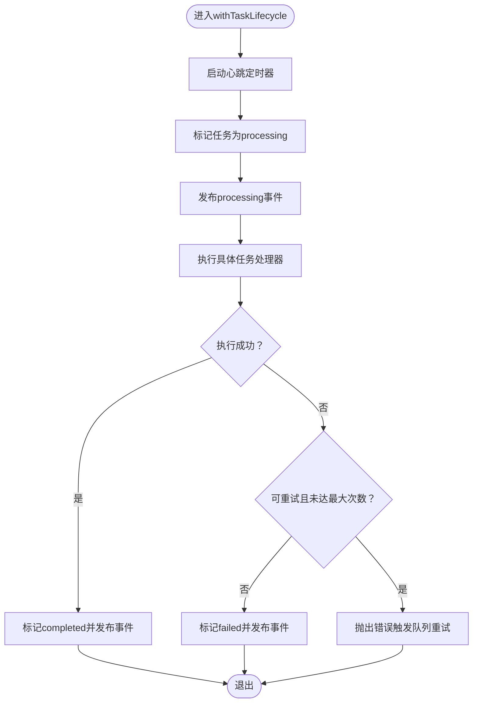
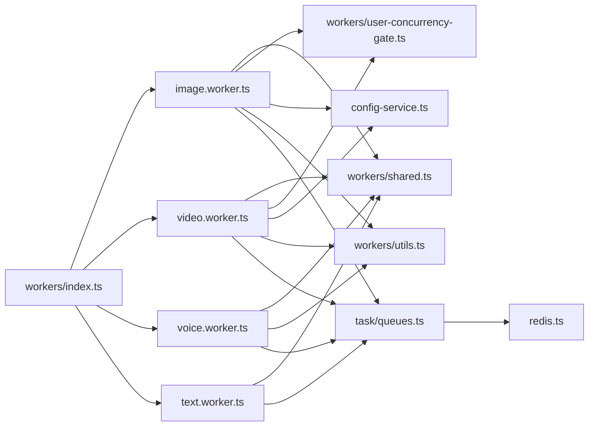

# Worker初始化与配置

<cite>
**本文档引用的文件**
- [src/lib/workers/index.ts](file://src/lib/workers/index.ts)
- [src/lib/workers/image.worker.ts](file://src/lib/workers/image.worker.ts)
- [src/lib/workers/video.worker.ts](file://src/lib/workers/video.worker.ts)
- [src/lib/workers/voice.worker.ts](file://src/lib/workers/voice.worker.ts)
- [src/lib/workers/text.worker.ts](file://src/lib/workers/text.worker.ts)
- [src/lib/workers/shared.ts](file://src/lib/workers/shared.ts)
- [src/lib/workers/user-concurrency-gate.ts](file://src/lib/workers/user-concurrency-gate.ts)
- [src/lib/workers/utils.ts](file://src/lib/workers/utils.ts)
- [src/lib/workers/handlers/image-task-handlers.ts](file://src/lib/workers/handlers/image-task-handlers.ts)
- [src/lib/workers/handlers/voice-design.ts](file://src/lib/workers/handlers/voice-design.ts)
- [src/lib/config-service.ts](file://src/lib/config-service.ts)
- [src/lib/task/queues.ts](file://src/lib/task/queues.ts)
- [src/lib/task/types.ts](file://src/lib/task/types.ts)
- [src/lib/redis.ts](file://src/lib/redis.ts)
</cite>

## 目录
1. [简介](#简介)
2. [项目结构](#项目结构)
3. [核心组件](#核心组件)
4. [架构总览](#架构总览)
5. [详细组件分析](#详细组件分析)
6. [依赖关系分析](#依赖关系分析)
7. [性能考量](#性能考量)
8. [故障排查指南](#故障排查指南)
9. [结论](#结论)
10. [附录](#附录)

## 简介
本文件面向Waoowaoo的Worker初始化与配置模块，系统性阐述Worker启动流程、生命周期管理、优雅关闭、配置参数（并发、重试、超时）、错误处理与日志记录，并提供最佳实践示例路径与参考。

## 项目结构
Worker相关代码集中于src/lib/workers目录，按功能拆分为四大类型Worker（图像、视频、语音、文本），并共享通用的生命周期包装、并发门控、工具函数与配置服务。

图表来源
- [src/lib/workers/index.ts:1-39](file://src/lib/workers/index.ts#L1-L39)
- [src/lib/workers/image.worker.ts:1-68](file://src/lib/workers/image.worker.ts#L1-L68)
- [src/lib/workers/video.worker.ts:1-324](file://src/lib/workers/video.worker.ts#L1-L324)
- [src/lib/workers/voice.worker.ts:1-64](file://src/lib/workers/voice.worker.ts#L1-L64)
- [src/lib/workers/text.worker.ts:1-715](file://src/lib/workers/text.worker.ts#L1-L715)
- [src/lib/workers/shared.ts:1-731](file://src/lib/workers/shared.ts#L1-L731)
- [src/lib/workers/user-concurrency-gate.ts:1-70](file://src/lib/workers/user-concurrency-gate.ts#L1-L70)
- [src/lib/workers/utils.ts:1-708](file://src/lib/workers/utils.ts#L1-L708)
- [src/lib/config-service.ts:1-346](file://src/lib/config-service.ts#L1-L346)
- [src/lib/task/queues.ts:1-112](file://src/lib/task/queues.ts#L1-L112)
- [src/lib/task/types.ts:1-159](file://src/lib/task/types.ts#L1-L159)
- [src/lib/redis.ts:50-75](file://src/lib/redis.ts#L50-L75)

章节来源
- [src/lib/workers/index.ts:1-39](file://src/lib/workers/index.ts#L1-L39)
- [src/lib/workers/image.worker.ts:1-68](file://src/lib/workers/image.worker.ts#L1-L68)
- [src/lib/workers/video.worker.ts:1-324](file://src/lib/workers/video.worker.ts#L1-L324)
- [src/lib/workers/voice.worker.ts:1-64](file://src/lib/workers/voice.worker.ts#L1-L64)
- [src/lib/workers/text.worker.ts:1-715](file://src/lib/workers/text.worker.ts#L1-L715)

## 核心组件
- Worker工厂函数：分别在四个文件中导出createImageWorker、createVideoWorker、createVoiceWorker、createTextWorker，负责创建对应队列的Worker实例。
- 生命周期包装：withTaskLifecycle统一处理任务开始、心跳、进度上报、完成/失败标记、账单结算与重试决策。
- 并发门控：withUserConcurrencyGate基于用户维度限制同一scope内的并发，避免资源争用。
- 配置服务：getUserWorkflowConcurrencyConfig从数据库读取用户工作流并发配置，支持按用户覆盖默认值。
- 队列与任务类型：task/queues.ts定义四类队列名称与默认作业选项；task/types.ts定义任务类型与数据结构。
- 基础设施：redis.ts提供队列专用连接；各Worker通过queueRedis连接Redis。

章节来源
- [src/lib/workers/image.worker.ts:50-67](file://src/lib/workers/image.worker.ts#L50-L67)
- [src/lib/workers/video.worker.ts:306-323](file://src/lib/workers/video.worker.ts#L306-L323)
- [src/lib/workers/voice.worker.ts:54-63](file://src/lib/workers/voice.worker.ts#L54-L63)
- [src/lib/workers/text.worker.ts:705-714](file://src/lib/workers/text.worker.ts#L705-L714)
- [src/lib/workers/shared.ts:319-646](file://src/lib/workers/shared.ts#L319-L646)
- [src/lib/workers/user-concurrency-gate.ts:56-69](file://src/lib/workers/user-concurrency-gate.ts#L56-L69)
- [src/lib/config-service.ts:125-142](file://src/lib/config-service.ts#L125-L142)
- [src/lib/task/queues.ts:5-41](file://src/lib/task/queues.ts#L5-L41)
- [src/lib/task/types.ts:40-128](file://src/lib/task/types.ts#L40-L128)
- [src/lib/redis.ts:50-75](file://src/lib/redis.ts#L50-L75)

## 架构总览
Worker启动流程采用“工厂函数+事件监听+优雅关闭”的模式。入口文件创建四个Worker实例，注册ready/error/failed事件，随后监听SIGINT/SIGTERM进行统一关闭。

图表来源
- [src/lib/workers/index.ts:1-39](file://src/lib/workers/index.ts#L1-L39)
- [src/lib/workers/image.worker.ts:50-67](file://src/lib/workers/image.worker.ts#L50-L67)
- [src/lib/workers/video.worker.ts:306-323](file://src/lib/workers/video.worker.ts#L306-L323)
- [src/lib/workers/voice.worker.ts:54-63](file://src/lib/workers/voice.worker.ts#L54-L63)
- [src/lib/workers/text.worker.ts:705-714](file://src/lib/workers/text.worker.ts#L705-L714)

## 详细组件分析

### 图像Worker（createImageWorker）
- 作用：根据任务类型分派到具体处理器（角色图、场景图、面板图、变体、资产修改等）。
- 并发控制：通过withUserConcurrencyGate限制用户在image scope内的并发数，来源于用户工作流并发配置。
- 进度上报：reportTaskProgress在关键阶段更新任务进度。
- 队列与连接：使用QUEUE_NAME.IMAGE与queueRedis连接。

图表来源
- [src/lib/workers/image.worker.ts:20-48](file://src/lib/workers/image.worker.ts#L20-L48)

章节来源
- [src/lib/workers/image.worker.ts:1-68](file://src/lib/workers/image.worker.ts#L1-L68)
- [src/lib/workers/handlers/image-task-handlers.ts:1-8](file://src/lib/workers/handlers/image-task-handlers.ts#L1-L8)

### 视频Worker（createVideoWorker）
- 作用：生成视频与唇同步，支持首尾帧模式、音频开关、比例与分辨率等选项。
- 并发控制：同图像Worker，基于用户工作流并发配置。
- 外部轮询：resolveVideoSourceFromGeneration/resolveLipSyncVideoSource支持异步任务轮询与续接。
- 数据持久化：生成完成后上传至对象存储并写入数据库。

图表来源
- [src/lib/workers/video.worker.ts:183-222](file://src/lib/workers/video.worker.ts#L183-L222)
- [src/lib/workers/utils.ts:408-534](file://src/lib/workers/utils.ts#L408-L534)

章节来源
- [src/lib/workers/video.worker.ts:1-324](file://src/lib/workers/video.worker.ts#L1-L324)
- [src/lib/workers/utils.ts:1-708](file://src/lib/workers/utils.ts#L1-L708)

### 语音Worker（createVoiceWorker）
- 作用：生成语音行与声音设计。
- 语音行：根据项目/剧集/台词ID生成音频。
- 声音设计：校验提示词与预览文本，调用提供商创建声音设计。

章节来源
- [src/lib/workers/voice.worker.ts:1-64](file://src/lib/workers/voice.worker.ts#L1-L64)
- [src/lib/workers/handlers/voice-design.ts:1-79](file://src/lib/workers/handlers/voice-design.ts#L1-L79)

### 文本Worker（createTextWorker）
- 作用：处理故事到脚本、脚本到分镜、AI扩写、剪辑构建、剧本转换、章节拆分、全局分析、资产库AI设计/修改、镜头AI任务、角色档案确认、参考转角色等。
- LLM流式回调：内置内部LLM流回调，将增量输出转化为任务流事件，支持reasoning/main双通道序列号。
- 并发控制：文本Worker未使用用户并发门控，但具备完善的生命周期与重试逻辑。

章节来源
- [src/lib/workers/text.worker.ts:1-715](file://src/lib/workers/text.worker.ts#L1-L715)

### 生命周期与错误处理（shared.ts）
- withTaskLifecycle：统一任务生命周期，包括心跳、进度上报、完成/失败标记、账单结算、重试决策与UnrecoverableError抛出。
- reportTaskProgress：标准化进度消息与显示模式，发布生命周期事件。
- reportTaskStreamChunk：将LLM流式增量转化为任务流事件。
- shouldRetryInQueue：基于作业选项与错误可重试性决定是否重试与退避策略。

图表来源
- [src/lib/workers/shared.ts:319-646](file://src/lib/workers/shared.ts#L319-L646)

章节来源
- [src/lib/workers/shared.ts:1-731](file://src/lib/workers/shared.ts#L1-L731)

### 并发门控（user-concurrency-gate.ts）
- 以“scope:userId”为键维护活跃槽位与等待队列，实现用户级并发限制。
- 支持image与video两个scope，避免用户在同一scope内过度竞争资源。

章节来源
- [src/lib/workers/user-concurrency-gate.ts:1-70](file://src/lib/workers/user-concurrency-gate.ts#L1-L70)

### 配置参数与环境变量
- 并发数（队列级别）：通过createWorker时的concurrency参数设置，来源于环境变量QUEUE_CONCURRENCY_IMAGE/VIDEO/VOICE/TEXT，默认值分别为20、4、10、10。
- 重试策略（队列级别）：默认作业选项包含attempts与指数退避backoff（delay=2000ms）。
- 外部任务轮询超时与间隔：外部轮询默认超时20分钟、轮询间隔3秒，可通过环境变量覆盖。
- 用户工作流并发：来自用户偏好表，未配置时使用默认值。

章节来源
- [src/lib/workers/image.worker.ts:62-66](file://src/lib/workers/image.worker.ts#L62-L66)
- [src/lib/workers/video.worker.ts:318-322](file://src/lib/workers/video.worker.ts#L318-L322)
- [src/lib/workers/voice.worker.ts:58-62](file://src/lib/workers/voice.worker.ts#L58-L62)
- [src/lib/workers/text.worker.ts:710-712](file://src/lib/workers/text.worker.ts#L710-L712)
- [src/lib/task/queues.ts:12-20](file://src/lib/task/queues.ts#L12-L20)
- [src/lib/workers/utils.ts:22-23](file://src/lib/workers/utils.ts#L22-L23)
- [src/lib/config-service.ts:125-142](file://src/lib/config-service.ts#L125-L142)

### 优雅关闭（index.ts）
- 监听SIGINT/SIGTERM，依次关闭所有Worker实例，最后退出进程。
- 关闭顺序：Promise.all并行关闭，确保快速收敛。

章节来源
- [src/lib/workers/index.ts:31-39](file://src/lib/workers/index.ts#L31-L39)

## 依赖关系分析
- 入口依赖：index.ts依赖四个Worker工厂函数。
- Worker依赖：各Worker依赖shared.ts（生命周期）、user-concurrency-gate.ts（并发门控）、config-service.ts（用户并发配置）、task/queues.ts（队列常量）、redis.ts（连接）。
- 工具依赖：video/image/voice worker依赖workers/utils.ts进行外部轮询、上传与断言。
- 类型与队列：task/types.ts与task/queues.ts提供任务类型与队列映射。

图表来源
- [src/lib/workers/index.ts:1-39](file://src/lib/workers/index.ts#L1-L39)
- [src/lib/workers/image.worker.ts:1-68](file://src/lib/workers/image.worker.ts#L1-L68)
- [src/lib/workers/video.worker.ts:1-324](file://src/lib/workers/video.worker.ts#L1-L324)
- [src/lib/workers/voice.worker.ts:1-64](file://src/lib/workers/voice.worker.ts#L1-L64)
- [src/lib/workers/text.worker.ts:1-715](file://src/lib/workers/text.worker.ts#L1-L715)
- [src/lib/workers/shared.ts:1-731](file://src/lib/workers/shared.ts#L1-L731)
- [src/lib/workers/user-concurrency-gate.ts:1-70](file://src/lib/workers/user-concurrency-gate.ts#L1-L70)
- [src/lib/workers/utils.ts:1-708](file://src/lib/workers/utils.ts#L1-L708)
- [src/lib/config-service.ts:1-346](file://src/lib/config-service.ts#L1-L346)
- [src/lib/task/queues.ts:1-112](file://src/lib/task/queues.ts#L1-L112)
- [src/lib/redis.ts:50-75](file://src/lib/redis.ts#L50-L75)

章节来源
- [src/lib/workers/index.ts:1-39](file://src/lib/workers/index.ts#L1-L39)
- [src/lib/workers/image.worker.ts:1-68](file://src/lib/workers/image.worker.ts#L1-L68)
- [src/lib/workers/video.worker.ts:1-324](file://src/lib/workers/video.worker.ts#L1-L324)
- [src/lib/workers/voice.worker.ts:1-64](file://src/lib/workers/voice.worker.ts#L1-L64)
- [src/lib/workers/text.worker.ts:1-715](file://src/lib/workers/text.worker.ts#L1-L715)

## 性能考量
- 并发控制：用户级并发门控避免单用户过度占用资源；队列级并发由环境变量控制，建议结合CPU/内存与外部API限流策略调整。
- 重试退避：默认指数退避（2s基础延迟），可减少抖动对下游压力。
- 外部轮询：合理设置超时与轮询间隔，避免长时间占用Worker线程。
- 流式事件：文本Worker的LLM流式回调采用队列化发布，降低瞬时压力。

## 故障排查指南
- 任务未执行或重复执行：检查withTaskLifecycle中的任务状态标记与心跳定时器，确认任务是否被判定为终止或孤儿。
- 外部任务超时：核对WORKER_EXTERNAL_TIMEOUT_MS与WORKER_EXTERNAL_POLL_MS，检查轮询逻辑与任务状态。
- 并发阻塞：确认用户工作流并发配置与scope是否正确，必要时提升用户并发限额。
- 错误重试：查看shouldRetryInQueue的决策依据与退避时间，确认错误是否可重试。

章节来源
- [src/lib/workers/shared.ts:261-279](file://src/lib/workers/shared.ts#L261-L279)
- [src/lib/workers/utils.ts:86-166](file://src/lib/workers/utils.ts#L86-L166)
- [src/lib/config-service.ts:125-142](file://src/lib/config-service.ts#L125-L142)

## 结论
Waoowaoo的Worker体系通过工厂函数统一创建、共享生命周期包装与并发门控、以及完善的错误与重试策略，实现了高可靠的任务执行。配合队列级与用户级并发控制、外部轮询续接与日志事件发布，整体具备良好的可观测性与扩展性。

## 附录

### Worker启动与关闭示例（路径参考）
- 启动：在入口文件中创建四个Worker实例并监听事件
  - [src/lib/workers/index.ts:1-39](file://src/lib/workers/index.ts#L1-L39)
- 图像Worker创建与并发设置
  - [src/lib/workers/image.worker.ts:50-67](file://src/lib/workers/image.worker.ts#L50-L67)
- 视频Worker创建与并发设置
  - [src/lib/workers/video.worker.ts:306-323](file://src/lib/workers/video.worker.ts#L306-L323)
- 语音Worker创建与并发设置
  - [src/lib/workers/voice.worker.ts:54-63](file://src/lib/workers/voice.worker.ts#L54-L63)
- 文本Worker创建与并发设置
  - [src/lib/workers/text.worker.ts:705-714](file://src/lib/workers/text.worker.ts#L705-L714)
- 优雅关闭流程
  - [src/lib/workers/index.ts:31-39](file://src/lib/workers/index.ts#L31-L39)

### 配置参数清单（路径参考）
- 队列并发（环境变量）
  - [src/lib/workers/image.worker.ts](file://src/lib/workers/image.worker.ts#L64)
  - [src/lib/workers/video.worker.ts](file://src/lib/workers/video.worker.ts#L320)
  - [src/lib/workers/voice.worker.ts](file://src/lib/workers/voice.worker.ts#L60)
  - [src/lib/workers/text.worker.ts](file://src/lib/workers/text.worker.ts#L711)
- 默认作业选项（重试与退避）
  - [src/lib/task/queues.ts:12-20](file://src/lib/task/queues.ts#L12-L20)
- 外部轮询超时与间隔（环境变量）
  - [src/lib/workers/utils.ts:22-23](file://src/lib/workers/utils.ts#L22-L23)
- 用户工作流并发配置
  - [src/lib/config-service.ts:125-142](file://src/lib/config-service.ts#L125-L142)