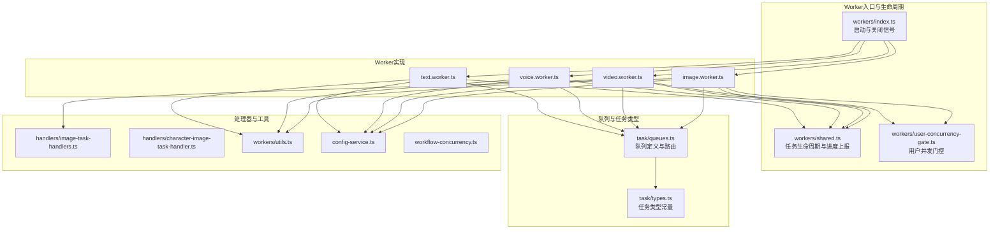
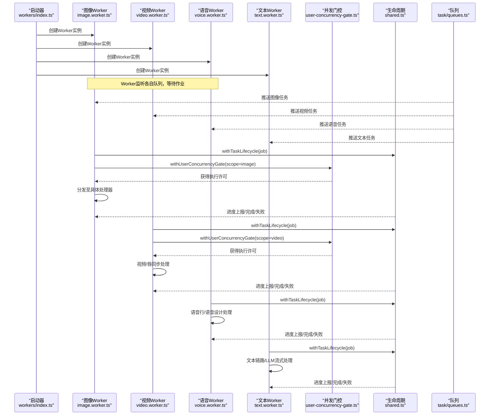
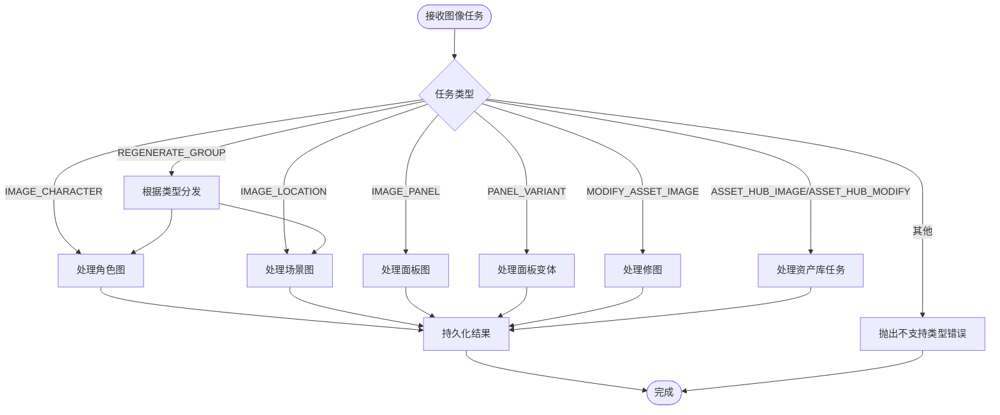
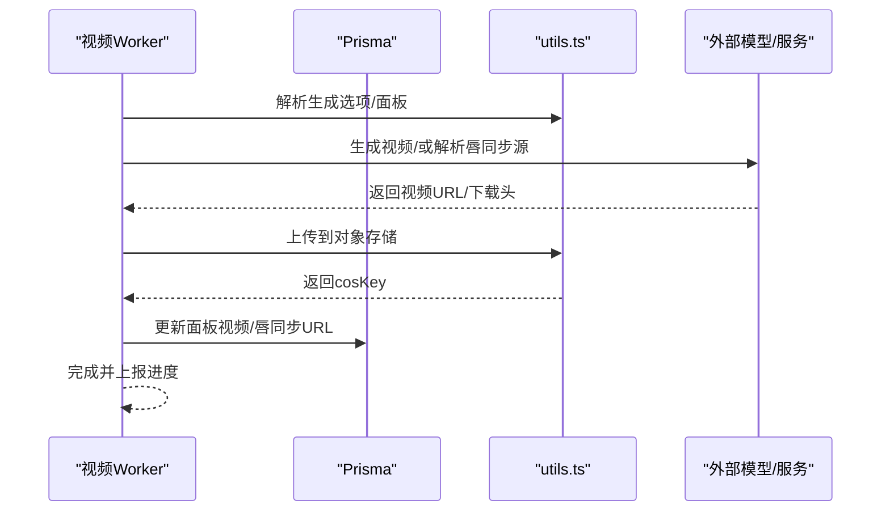
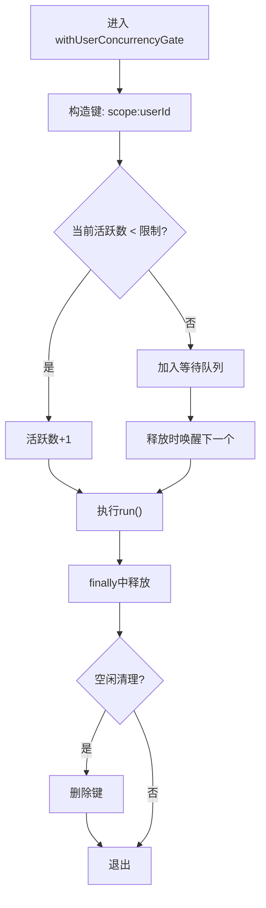
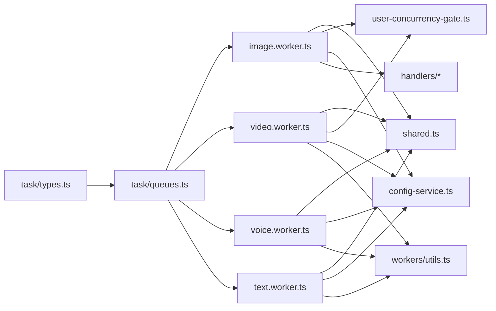

# Worker管理

<cite>
**本文引用的文件**
- [src/lib/workers/index.ts](file://src/lib/workers/index.ts)
- [src/lib/workers/image.worker.ts](file://src/lib/workers/image.worker.ts)
- [src/lib/workers/video.worker.ts](file://src/lib/workers/video.worker.ts)
- [src/lib/workers/voice.worker.ts](file://src/lib/workers/voice.worker.ts)
- [src/lib/workers/text.worker.ts](file://src/lib/workers/text.worker.ts)
- [src/lib/workers/user-concurrency-gate.ts](file://src/lib/workers/user-concurrency-gate.ts)
- [src/lib/workers/shared.ts](file://src/lib/workers/shared.ts)
- [src/lib/workers/utils.ts](file://src/lib/workers/utils.ts)
- [src/lib/workers/handlers/image-task-handlers.ts](file://src/lib/workers/handlers/image-task-handlers.ts)
- [src/lib/workers/handlers/character-image-task-handler.ts](file://src/lib/workers/handlers/character-image-task-handler.ts)
- [src/lib/task/queues.ts](file://src/lib/task/queues.ts)
- [src/lib/task/types.ts](file://src/lib/task/types.ts)
- [src/lib/config-service.ts](file://src/lib/config-service.ts)
- [src/lib/workflow-concurrency.ts](file://src/lib/workflow-concurrency.ts)
</cite>

## 目录
1. [简介](#简介)
2. [项目结构](#项目结构)
3. [核心组件](#核心组件)
4. [架构总览](#架构总览)
5. [详细组件分析](#详细组件分析)
6. [依赖关系分析](#依赖关系分析)
7. [性能考量](#性能考量)
8. [故障排查指南](#故障排查指南)
9. [结论](#结论)
10. [附录](#附录)

## 简介
本文件面向Waoowaoo的Worker管理模块，系统化阐述基于BullMQ的Worker初始化、配置与生命周期管理；详解四类Worker的职责边界与处理流程：图像生成(image.worker.ts)、视频合成(video.worker.ts)、音频处理(voice.worker.ts)、文本相关(text.worker.ts)；并深入解析并发控制、资源限制与负载均衡策略，以及用户并发门控机制，防止用户过度占用系统资源。最后提供Worker启动、停止与重启的完整流程说明，并给出配置参数详解与扩展新Worker类型的实践示例。

## 项目结构
Worker相关代码集中在src/lib/workers目录，包含四个独立Worker文件、共享工具与任务类型/队列定义、并发配置与用户门控等模块。

**图表来源**
- [src/lib/workers/index.ts:1-39](file://src/lib/workers/index.ts#L1-L39)
- [src/lib/workers/shared.ts:1-731](file://src/lib/workers/shared.ts#L1-L731)
- [src/lib/workers/user-concurrency-gate.ts:1-70](file://src/lib/workers/user-concurrency-gate.ts#L1-L70)
- [src/lib/workers/image.worker.ts:1-68](file://src/lib/workers/image.worker.ts#L1-L68)
- [src/lib/workers/video.worker.ts:1-324](file://src/lib/workers/video.worker.ts#L1-L324)
- [src/lib/workers/voice.worker.ts:1-64](file://src/lib/workers/voice.worker.ts#L1-L64)
- [src/lib/workers/text.worker.ts:1-715](file://src/lib/workers/text.worker.ts#L1-L715)
- [src/lib/workers/handlers/image-task-handlers.ts:1-8](file://src/lib/workers/handlers/image-task-handlers.ts#L1-L8)
- [src/lib/workers/handlers/character-image-task-handler.ts:1-196](file://src/lib/workers/handlers/character-image-task-handler.ts#L1-L196)
- [src/lib/workers/utils.ts](file://src/lib/workers/utils.ts)
- [src/lib/config-service.ts:1-346](file://src/lib/config-service.ts#L1-L346)
- [src/lib/workflow-concurrency.ts:1-43](file://src/lib/workflow-concurrency.ts#L1-L43)
- [src/lib/task/queues.ts:1-112](file://src/lib/task/queues.ts#L1-L112)
- [src/lib/task/types.ts:1-159](file://src/lib/task/types.ts#L1-L159)

**章节来源**
- [src/lib/workers/index.ts:1-39](file://src/lib/workers/index.ts#L1-L39)
- [src/lib/workers/image.worker.ts:1-68](file://src/lib/workers/image.worker.ts#L1-L68)
- [src/lib/workers/video.worker.ts:1-324](file://src/lib/workers/video.worker.ts#L1-L324)
- [src/lib/workers/voice.worker.ts:1-64](file://src/lib/workers/voice.worker.ts#L1-L64)
- [src/lib/workers/text.worker.ts:1-715](file://src/lib/workers/text.worker.ts#L1-L715)
- [src/lib/workers/shared.ts:1-731](file://src/lib/workers/shared.ts#L1-L731)
- [src/lib/workers/user-concurrency-gate.ts:1-70](file://src/lib/workers/user-concurrency-gate.ts#L1-L70)
- [src/lib/workers/utils.ts](file://src/lib/workers/utils.ts)
- [src/lib/workers/handlers/image-task-handlers.ts:1-8](file://src/lib/workers/handlers/image-task-handlers.ts#L1-L8)
- [src/lib/workers/handlers/character-image-task-handler.ts:1-196](file://src/lib/workers/handlers/character-image-task-handler.ts#L1-L196)
- [src/lib/task/queues.ts:1-112](file://src/lib/task/queues.ts#L1-L112)
- [src/lib/task/types.ts:1-159](file://src/lib/task/types.ts#L1-L159)
- [src/lib/config-service.ts:1-346](file://src/lib/config-service.ts#L1-L346)
- [src/lib/workflow-concurrency.ts:1-43](file://src/lib/workflow-concurrency.ts#L1-L43)

## 核心组件
- Worker入口与生命周期管理
  - workers/index.ts：统一启动四个Worker实例，监听ready/error/failed事件，捕获SIGINT/SIGTERM进行优雅关闭。
- Worker实现
  - image.worker.ts：按任务类型分发至图像相关处理器，结合用户并发门控与任务生命周期。
  - video.worker.ts：视频面板生成与唇同步，含媒体下载签名、上传、模型能力解析与持久化。
  - voice.worker.ts：语音行生成与语音设计，支持不同任务类型。
  - text.worker.ts：文本链路与多阶段AI推理，包含LLM流式回调、进度上报与事务性持久化。
- 并发与门控
  - user-concurrency-gate.ts：基于用户维度的并发门控，限定image与video作用域的并发上限。
  - workflow-concurrency.ts：默认并发值与规范化逻辑。
  - config-service.ts：从用户偏好读取并发配置。
- 任务生命周期与进度上报
  - shared.ts：封装withTaskLifecycle、reportTaskProgress、reportTaskStreamChunk，统一任务状态流转、心跳、重试策略与事件发布。
- 队列与任务类型
  - queues.ts：定义四个队列名称、默认作业选项（重试、退避）、任务类型到队列的映射与入队逻辑。
  - types.ts：定义任务类型常量、事件类型、任务数据结构等。

**章节来源**
- [src/lib/workers/index.ts:1-39](file://src/lib/workers/index.ts#L1-L39)
- [src/lib/workers/image.worker.ts:1-68](file://src/lib/workers/image.worker.ts#L1-L68)
- [src/lib/workers/video.worker.ts:1-324](file://src/lib/workers/video.worker.ts#L1-L324)
- [src/lib/workers/voice.worker.ts:1-64](file://src/lib/workers/voice.worker.ts#L1-L64)
- [src/lib/workers/text.worker.ts:1-715](file://src/lib/workers/text.worker.ts#L1-L715)
- [src/lib/workers/user-concurrency-gate.ts:1-70](file://src/lib/workers/user-concurrency-gate.ts#L1-L70)
- [src/lib/workers/shared.ts:1-731](file://src/lib/workers/shared.ts#L1-L731)
- [src/lib/task/queues.ts:1-112](file://src/lib/task/queues.ts#L1-L112)
- [src/lib/task/types.ts:1-159](file://src/lib/task/types.ts#L1-L159)
- [src/lib/config-service.ts:125-142](file://src/lib/config-service.ts#L125-L142)
- [src/lib/workflow-concurrency.ts:1-43](file://src/lib/workflow-concurrency.ts#L1-L43)

## 架构总览
下图展示了Worker启动、任务分发、并发门控与生命周期管理的整体交互。

**图表来源**
- [src/lib/workers/index.ts:1-39](file://src/lib/workers/index.ts#L1-L39)
- [src/lib/workers/image.worker.ts:50-67](file://src/lib/workers/image.worker.ts#L50-L67)
- [src/lib/workers/video.worker.ts:306-323](file://src/lib/workers/video.worker.ts#L306-L323)
- [src/lib/workers/voice.worker.ts:54-63](file://src/lib/workers/voice.worker.ts#L54-L63)
- [src/lib/workers/text.worker.ts:705-714](file://src/lib/workers/text.worker.ts#L705-L714)
- [src/lib/workers/user-concurrency-gate.ts:56-69](file://src/lib/workers/user-concurrency-gate.ts#L56-L69)
- [src/lib/workers/shared.ts:319-646](file://src/lib/workers/shared.ts#L319-L646)
- [src/lib/task/queues.ts:88-101](file://src/lib/task/queues.ts#L88-L101)

## 详细组件分析

### 图像Worker（image.worker.ts）
- 初始化与配置
  - 使用QUEUE_NAME.IMAGE作为队列名，连接queueRedis。
  - 并发数来自环境变量QUEUE_CONCURRENCY_IMAGE，默认20。
- 生命周期与并发
  - 包裹withTaskLifecycle，确保任务状态正确流转。
  - 通过getUserWorkflowConcurrencyConfig读取用户并发配置，withUserConcurrencyGate对scope='image'进行门控。
- 任务分发
  - 根据job.data.type分发至对应处理器：角色图、场景图、面板图、变体、修图、资产库等。
- 处理器示例
  - character-image-task-handler.ts：根据角色外观与风格提示词生成图像，写回数据库并返回结果。

**图表来源**
- [src/lib/workers/image.worker.ts:20-48](file://src/lib/workers/image.worker.ts#L20-L48)
- [src/lib/workers/handlers/image-task-handlers.ts:1-8](file://src/lib/workers/handlers/image-task-handlers.ts#L1-L8)
- [src/lib/workers/handlers/character-image-task-handler.ts:71-196](file://src/lib/workers/handlers/character-image-task-handler.ts#L71-L196)

**章节来源**
- [src/lib/workers/image.worker.ts:1-68](file://src/lib/workers/image.worker.ts#L1-L68)
- [src/lib/workers/handlers/image-task-handlers.ts:1-8](file://src/lib/workers/handlers/image-task-handlers.ts#L1-L8)
- [src/lib/workers/handlers/character-image-task-handler.ts:1-196](file://src/lib/workers/handlers/character-image-task-handler.ts#L1-L196)

### 视频Worker（video.worker.ts）
- 初始化与配置
  - 使用QUEUE_NAME.VIDEO，连接queueRedis，并发数来自QUEUE_CONCURRENCY_VIDEO，默认4。
- 生命周期
  - withTaskLifecycle包裹，统一状态与事件。
- 任务类型
  - VIDEO_PANEL：根据面板与模型生成视频，支持首尾帧模式与音视频生成开关。
  - LIP_SYNC：将视频与语音对齐生成唇同步视频。
- 关键流程
  - 提取生成选项与面板信息，解析模型能力，下载/签名输入媒体，调用生成接口，上传至对象存储，持久化结果。

**图表来源**
- [src/lib/workers/video.worker.ts:183-222](file://src/lib/workers/video.worker.ts#L183-L222)
- [src/lib/workers/video.worker.ts:224-291](file://src/lib/workers/video.worker.ts#L224-L291)
- [src/lib/workers/utils.ts](file://src/lib/workers/utils.ts)

**章节来源**
- [src/lib/workers/video.worker.ts:1-324](file://src/lib/workers/video.worker.ts#L1-L324)

### 语音Worker（voice.worker.ts）
- 初始化与配置
  - 使用QUEUE_NAME.VOICE，连接queueRedis，并发数来自QUEUE_CONCURRENCY_VOICE，默认10。
- 任务类型
  - VOICE_LINE：生成单条语音行。
  - VOICE_DESIGN/ASSET_HUB_VOICE_DESIGN：语音设计任务。
- 流程
  - 校验必要字段，调用generateVoiceLine，持久化结果。

**章节来源**
- [src/lib/workers/voice.worker.ts:1-64](file://src/lib/workers/voice.worker.ts#L1-L64)

### 文本Worker（text.worker.ts）
- 初始化与配置
  - 使用QUEUE_NAME.TEXT，连接queueRedis，并发数来自QUEUE_CONCURRENCY_TEXT，默认10。
- 任务类型与职责
  - 文本链路：故事转脚本、脚本转分镜、AI分析、扩写、剪辑构建、剧本文本转换、分集拆分、全局分析、资产库AI设计/修改、镜头AI、角色档案确认、参考转角色等。
- 特色能力
  - 内置LLM流式回调与分片上报，支持运行期事件直发与重放。
  - 事务性持久化，保障数据一致性。
- 流程概览
  - withTaskLifecycle -> 分发到具体处理器 -> 上报进度/流式事件 -> 完成或失败。

**章节来源**
- [src/lib/workers/text.worker.ts:1-715](file://src/lib/workers/text.worker.ts#L1-L715)

### 并发门控与资源限制（user-concurrency-gate.ts）
- 作用域
  - scope限定为'image'与'video'，分别针对图像与视频任务。
- 机制
  - 基于userId+scope构造键，统计活跃数与等待队列，达到limit则阻塞等待，释放后唤醒下一个。
- 与配置联动
  - 由config-service读取用户偏好并发配置，workflow-concurrency提供默认值与规范化。

**图表来源**
- [src/lib/workers/user-concurrency-gate.ts:26-69](file://src/lib/workers/user-concurrency-gate.ts#L26-L69)
- [src/lib/config-service.ts:125-142](file://src/lib/config-service.ts#L125-L142)
- [src/lib/workflow-concurrency.ts:19-42](file://src/lib/workflow-concurrency.ts#L19-L42)

**章节来源**
- [src/lib/workers/user-concurrency-gate.ts:1-70](file://src/lib/workers/user-concurrency-gate.ts#L1-L70)
- [src/lib/config-service.ts:125-142](file://src/lib/config-service.ts#L125-L142)
- [src/lib/workflow-concurrency.ts:1-43](file://src/lib/workflow-concurrency.ts#L1-L43)

### 任务生命周期与事件发布（shared.ts）
- 生命周期
  - tryMarkTaskProcessing -> tryUpdateTaskProgress -> tryMarkTaskCompleted/tryMarkTaskFailed -> rollback/settle账单。
- 心跳与日志
  - 定时心跳，按项目名路由日志文件。
- 重试策略
  - 基于作业attempts/backoff计算下次退避，可配置指数退避。
- 事件发布
  - 生命周期事件与流式事件通过publishTaskEvent/publishTaskStreamEvent发布，支持运行期事件直发。

**章节来源**
- [src/lib/workers/shared.ts:219-646](file://src/lib/workers/shared.ts#L219-L646)

### 队列与任务类型（queues.ts, types.ts）
- 队列定义
  - IMAGE/VIDEO/VOICE/TEXT四个队列，统一默认作业选项：移除完成/失败作业数量、重试次数、指数退避延迟。
- 任务类型到队列映射
  - 通过getQueueTypeByTaskType与getQueueByType实现任务类型到队列的路由。
- 入队与取消
  - addTaskJob根据任务类型选择队列并设置优先级与尝试次数；removeTaskJob遍历所有队列查找并移除。

**章节来源**
- [src/lib/task/queues.ts:1-112](file://src/lib/task/queues.ts#L1-L112)
- [src/lib/task/types.ts:1-159](file://src/lib/task/types.ts#L1-L159)

## 依赖关系分析
- Worker与队列
  - 四个Worker分别绑定到对应队列，任务类型通过queues.ts映射到队列。
- Worker与生命周期
  - 所有Worker均通过shared.ts的withTaskLifecycle统一管理状态与事件。
- Worker与并发门控
  - image与video Worker通过user-concurrency-gate.ts进行用户级并发门控。
- Worker与配置
  - config-service提供用户偏好并发配置，workflow-concurrency提供默认值与规范化。
- Worker与处理器
  - 图像Worker依赖handlers目录下的具体处理器；视频/语音/文本Worker各自维护内部处理逻辑。

**图表来源**
- [src/lib/task/types.ts:1-159](file://src/lib/task/types.ts#L1-L159)
- [src/lib/task/queues.ts:1-112](file://src/lib/task/queues.ts#L1-L112)
- [src/lib/workers/image.worker.ts:1-68](file://src/lib/workers/image.worker.ts#L1-L68)
- [src/lib/workers/video.worker.ts:1-324](file://src/lib/workers/video.worker.ts#L1-L324)
- [src/lib/workers/voice.worker.ts:1-64](file://src/lib/workers/voice.worker.ts#L1-L64)
- [src/lib/workers/text.worker.ts:1-715](file://src/lib/workers/text.worker.ts#L1-L715)
- [src/lib/workers/shared.ts:1-731](file://src/lib/workers/shared.ts#L1-L731)
- [src/lib/workers/user-concurrency-gate.ts:1-70](file://src/lib/workers/user-concurrency-gate.ts#L1-L70)
- [src/lib/config-service.ts:1-346](file://src/lib/config-service.ts#L1-L346)
- [src/lib/workers/handlers/image-task-handlers.ts:1-8](file://src/lib/workers/handlers/image-task-handlers.ts#L1-L8)
- [src/lib/workers/utils.ts](file://src/lib/workers/utils.ts)

**章节来源**
- [src/lib/task/queues.ts:1-112](file://src/lib/task/queues.ts#L1-L112)
- [src/lib/workers/image.worker.ts:1-68](file://src/lib/workers/image.worker.ts#L1-L68)
- [src/lib/workers/video.worker.ts:1-324](file://src/lib/workers/video.worker.ts#L1-L324)
- [src/lib/workers/voice.worker.ts:1-64](file://src/lib/workers/voice.worker.ts#L1-L64)
- [src/lib/workers/text.worker.ts:1-715](file://src/lib/workers/text.worker.ts#L1-L715)
- [src/lib/workers/shared.ts:1-731](file://src/lib/workers/shared.ts#L1-L731)
- [src/lib/workers/user-concurrency-gate.ts:1-70](file://src/lib/workers/user-concurrency-gate.ts#L1-L70)
- [src/lib/config-service.ts:1-346](file://src/lib/config-service.ts#L1-L346)
- [src/lib/workers/handlers/image-task-handlers.ts:1-8](file://src/lib/workers/handlers/image-task-handlers.ts#L1-L8)
- [src/lib/workers/utils.ts](file://src/lib/workers/utils.ts)

## 性能考量
- 并发与限流
  - 不同Worker的并发数通过环境变量配置，避免单队列过载。
  - 用户级并发门控（image/video）防止个别用户占用过多资源。
- 重试与退避
  - 默认指数退避，降低瞬时峰值压力；可按任务类型调整attempts。
- I/O与持久化
  - 视频/语音/图像生成涉及网络I/O与对象存储上传，建议合理设置超时与重试。
- 日志与监控
  - 生命周期内定时心跳与事件发布便于追踪与告警。

[本节为通用指导，无需特定文件来源]

## 故障排查指南
- Worker未启动或异常退出
  - 检查workers/index.ts的ready/error/failed事件日志，确认是否捕获到错误。
  - 确认进程信号处理（SIGINT/SIGTERM）是否正常触发关闭流程。
- 任务长时间无进展
  - 查看shared.ts中的心跳与进度上报，确认tryUpdateTaskProgress是否成功。
  - 检查重试决策（shouldRetryInQueue），确认nextBackoffMs与failedAttempt。
- 并发阻塞
  - 检查user-concurrency-gate.ts的活跃数与等待队列，确认limit是否合理。
  - 核对config-service读取的用户并发配置是否生效。
- 视频/语音生成失败
  - 检查video.worker.ts中的媒体签名、下载头与上传流程。
  - 确认模型能力解析与生成选项是否匹配。

**章节来源**
- [src/lib/workers/index.ts:1-39](file://src/lib/workers/index.ts#L1-L39)
- [src/lib/workers/shared.ts:219-646](file://src/lib/workers/shared.ts#L219-L646)
- [src/lib/workers/user-concurrency-gate.ts:1-70](file://src/lib/workers/user-concurrency-gate.ts#L1-L70)
- [src/lib/config-service.ts:125-142](file://src/lib/config-service.ts#L125-L142)
- [src/lib/workers/video.worker.ts:1-324](file://src/lib/workers/video.worker.ts#L1-L324)

## 结论
Waoowaoo的Worker管理模块以BullMQ为核心，通过明确的队列与任务类型映射、统一的任务生命周期管理、用户级并发门控与可配置的重试策略，实现了高可靠、可扩展的任务执行体系。图像、视频、语音、文本四类Worker各司其职，配合共享工具与处理器，覆盖从生成到持久化的完整链路。通过合理的并发与限流策略，系统能够在保证用户体验的同时，有效防止资源滥用。

[本节为总结，无需特定文件来源]

## 附录

### Worker启动、停止与重启流程
- 启动
  - 进程加载dotenv，创建四个Worker实例并监听事件。
  - Worker连接队列，开始消费任务。
- 停止
  - 捕获SIGINT/SIGTERM，依次调用worker.close()，确保任务状态与账单结算。
- 重启
  - 通过进程管理器（如PM2/Docker）重启进程，Worker自动重新连接队列并继续处理。

**章节来源**
- [src/lib/workers/index.ts:1-39](file://src/lib/workers/index.ts#L1-L39)

### Worker配置参数详解
- 并发数
  - 图像：QUEUE_CONCURRENCY_IMAGE，默认20
  - 视频：QUEUE_CONCURRENCY_VIDEO，默认4
  - 语音：QUEUE_CONCURRENCY_VOICE，默认10
  - 文本：QUEUE_CONCURRENCY_TEXT，默认10
- 重试与退避
  - 默认attempts=3，backoff.type='exponential'，delay=2000ms
- 用户并发配置
  - 通过getUserWorkflowConcurrencyConfig从用户偏好读取analysis/image/video并发值，无配置时采用默认值。

**章节来源**
- [src/lib/workers/image.worker.ts:62-66](file://src/lib/workers/image.worker.ts#L62-L66)
- [src/lib/workers/video.worker.ts:318-322](file://src/lib/workers/video.worker.ts#L318-L322)
- [src/lib/workers/voice.worker.ts:58-61](file://src/lib/workers/voice.worker.ts#L58-L61)
- [src/lib/workers/text.worker.ts:710-712](file://src/lib/workers/text.worker.ts#L710-L712)
- [src/lib/task/queues.ts:12-20](file://src/lib/task/queues.ts#L12-L20)
- [src/lib/config-service.ts:125-142](file://src/lib/config-service.ts#L125-L142)
- [src/lib/workflow-concurrency.ts:1-43](file://src/lib/workflow-concurrency.ts#L1-L43)

### 实际Worker注册与使用示例（步骤说明）
- 新增Worker类型步骤
  - 在task/types.ts中新增任务类型常量。
  - 在task/queues.ts中将该类型归类到对应队列集合，并在getQueueTypeByTaskType中映射到队列。
  - 在src/lib/workers/下创建新Worker文件（如new.worker.ts），定义队列名、并发数、连接与处理函数。
  - 在workers/index.ts中导出并注册该Worker。
  - 在shared.ts中完善必要的生命周期与事件发布逻辑。
  - 如需用户并发门控，参考image.worker.ts与user-concurrency-gate.ts进行集成。
- 示例路径
  - 新任务类型定义：[src/lib/task/types.ts:40-81](file://src/lib/task/types.ts#L40-L81)
  - 队列映射与入队：[src/lib/task/queues.ts:67-101](file://src/lib/task/queues.ts#L67-L101)
  - Worker模板与并发：[src/lib/workers/image.worker.ts:50-67](file://src/lib/workers/image.worker.ts#L50-L67)
  - 生命周期与事件：[src/lib/workers/shared.ts:319-646](file://src/lib/workers/shared.ts#L319-L646)
  - 并发门控集成：[src/lib/workers/user-concurrency-gate.ts:56-69](file://src/lib/workers/user-concurrency-gate.ts#L56-L69)

**章节来源**
- [src/lib/task/types.ts:40-81](file://src/lib/task/types.ts#L40-L81)
- [src/lib/task/queues.ts:67-101](file://src/lib/task/queues.ts#L67-L101)
- [src/lib/workers/image.worker.ts:50-67](file://src/lib/workers/image.worker.ts#L50-L67)
- [src/lib/workers/shared.ts:319-646](file://src/lib/workers/shared.ts#L319-L646)
- [src/lib/workers/user-concurrency-gate.ts:56-69](file://src/lib/workers/user-concurrency-gate.ts#L56-L69)