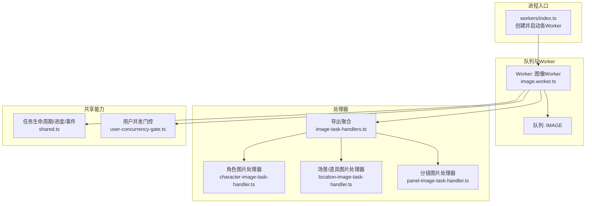
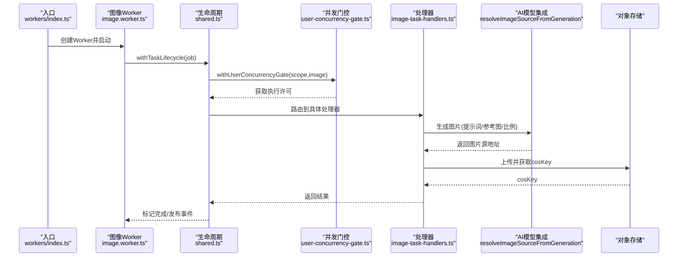
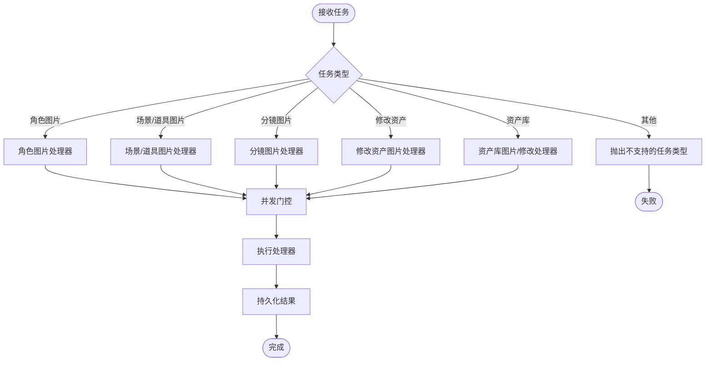
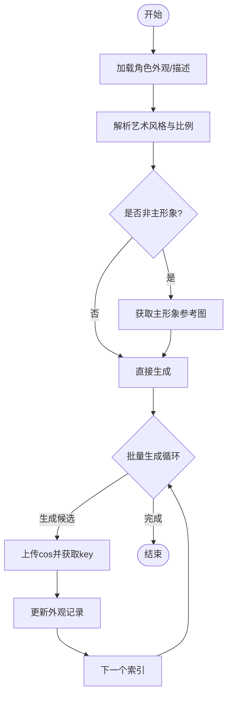
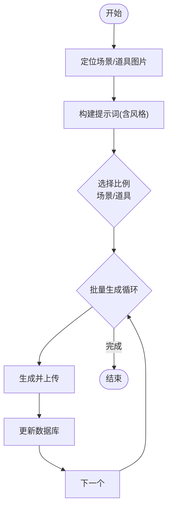
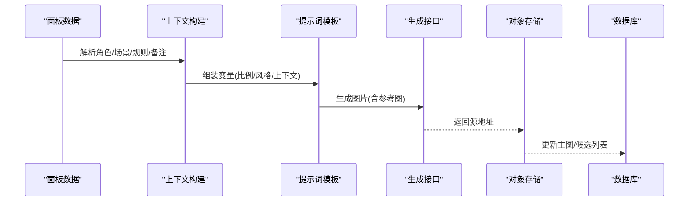
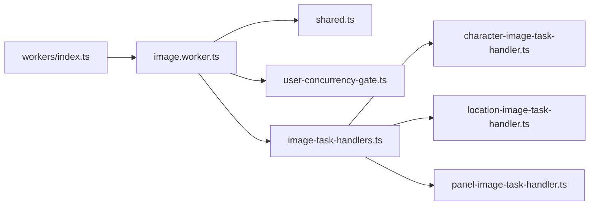

# 图像生成Worker

<cite>
**本文档引用的文件**
- [src/lib/workers/index.ts](file://src/lib/workers/index.ts)
- [src/lib/workers/image.worker.ts](file://src/lib/workers/image.worker.ts)
- [src/lib/workers/video.worker.ts](file://src/lib/workers/video.worker.ts)
- [src/lib/workers/text.worker.ts](file://src/lib/workers/text.worker.ts)
- [src/lib/workers/shared.ts](file://src/lib/workers/shared.ts)
- [src/lib/workers/user-concurrency-gate.ts](file://src/lib/workers/user-concurrency-gate.ts)
- [src/lib/workers/handlers/image-task-handlers.ts](file://src/lib/workers/handlers/image-task-handlers.ts)
- [src/lib/workers/handlers/character-image-task-handler.ts](file://src/lib/workers/handlers/character-image-task-handler.ts)
- [src/lib/workers/handlers/location-image-task-handler.ts](file://src/lib/workers/handlers/location-image-task-handler.ts)
- [src/lib/workers/handlers/panel-image-task-handler.ts](file://src/lib/workers/handlers/panel-image-task-handler.ts)
</cite>

## 目录
1. [简介](#简介)
2. [项目结构](#项目结构)
3. [核心组件](#核心组件)
4. [架构总览](#架构总览)
5. [详细组件分析](#详细组件分析)
6. [依赖关系分析](#依赖关系分析)
7. [性能考量](#性能考量)
8. [故障排查指南](#故障排查指南)
9. [结论](#结论)
10. [附录](#附录)

## 简介
本文件面向Waoowaoo的图像生成Worker，系统性阐述其核心功能、任务类型、AI模型集成方式、参数配置、处理流程、质量控制、缓存策略与性能优化，并提供具体任务示例与错误处理机制说明。该Worker基于队列系统（BullMQ）运行，负责执行多种图像生成任务，包括角色图片、场景/道具图片、分镜图片等，同时统一接入OpenAI、Gemini、Fal AI、百炼（通义千问）等多家AI服务提供商。

## 项目结构
图像生成Worker位于workers子系统中，采用“队列-工作器-处理器”的分层设计：
- 入口启动：在全局入口中创建并注册各类型Worker（图像、视频、语音、文本）。
- 图像Worker：根据任务类型路由到对应处理器，执行并发门控与生命周期管理。
- 处理器：按资产类型（角色、场景/道具、分镜）构建提示词与参数，调用底层生成接口并持久化结果。
- 共享模块：提供任务生命周期、进度上报、流式事件发布、并发门控等通用能力。

图表来源
- [src/lib/workers/index.ts:1-39](file://src/lib/workers/index.ts#L1-L39)
- [src/lib/workers/image.worker.ts:1-68](file://src/lib/workers/image.worker.ts#L1-L68)
- [src/lib/workers/handlers/image-task-handlers.ts:1-8](file://src/lib/workers/handlers/image-task-handlers.ts#L1-L8)

章节来源
- [src/lib/workers/index.ts:1-39](file://src/lib/workers/index.ts#L1-L39)
- [src/lib/workers/image.worker.ts:1-68](file://src/lib/workers/image.worker.ts#L1-L68)

## 核心组件
- 图像Worker：负责接收IMAGE队列任务，进行并发限制、任务生命周期管理与错误重试决策，并按任务类型分发到具体处理器。
- 处理器集合：
  - 角色图片处理器：基于角色外观描述与风格提示词生成角色立绘，支持主/次形象一致性与批量生成。
  - 场景/道具图片处理器：基于场景或道具描述生成图片，支持比例与风格控制。
  - 分镜图片处理器：结合故事板上下文（角色、场景、摄影规则、表演备注等）生成分镜图片候选。
- 共享模块：封装任务状态变更、进度上报、流式事件发布、并发门控与错误归一化。
- 并发门控：按用户维度限制同一scope（如image）的并发数，避免资源争用。

章节来源
- [src/lib/workers/image.worker.ts:20-67](file://src/lib/workers/image.worker.ts#L20-L67)
- [src/lib/workers/handlers/character-image-task-handler.ts:71-196](file://src/lib/workers/handlers/character-image-task-handler.ts#L71-L196)
- [src/lib/workers/handlers/location-image-task-handler.ts:59-191](file://src/lib/workers/handlers/location-image-task-handler.ts#L59-L191)
- [src/lib/workers/handlers/panel-image-task-handler.ts:160-290](file://src/lib/workers/handlers/panel-image-task-handler.ts#L160-L290)
- [src/lib/workers/shared.ts:319-646](file://src/lib/workers/shared.ts#L319-L646)
- [src/lib/workers/user-concurrency-gate.ts:56-70](file://src/lib/workers/user-concurrency-gate.ts#L56-L70)

## 架构总览
图像生成Worker的整体流程如下：
- 启动阶段：入口创建Worker并监听ready/error/failed事件。
- 执行阶段：Worker从IMAGE队列取任务，进入withTaskLifecycle包装，执行并发门控，按任务类型分发到处理器。
- 处理阶段：处理器读取项目模型配置与任务参数，构建提示词与参考图，调用底层生成接口，上传至对象存储并持久化。
- 结束阶段：标记任务完成或失败，发布生命周期事件与进度事件。

图表来源
- [src/lib/workers/index.ts:1-39](file://src/lib/workers/index.ts#L1-L39)
- [src/lib/workers/image.worker.ts:50-67](file://src/lib/workers/image.worker.ts#L50-L67)
- [src/lib/workers/shared.ts:319-466](file://src/lib/workers/shared.ts#L319-L466)
- [src/lib/workers/user-concurrency-gate.ts:56-70](file://src/lib/workers/user-concurrency-gate.ts#L56-L70)
- [src/lib/workers/handlers/image-task-handlers.ts:1-8](file://src/lib/workers/handlers/image-task-handlers.ts#L1-L8)

## 详细组件分析

### 图像Worker与任务路由
- 任务类型路由：根据任务类型（角色、场景、分镜、修改资产、资产库等）分发到对应处理器。
- 并发控制：按用户维度限制image scope并发数，确保资源合理分配。
- 生命周期：统一处理任务开始、进度、完成、失败与重试逻辑，发布事件并进行账单结算或回滚。

图表来源
- [src/lib/workers/image.worker.ts:20-48](file://src/lib/workers/image.worker.ts#L20-L48)

章节来源
- [src/lib/workers/image.worker.ts:20-67](file://src/lib/workers/image.worker.ts#L20-L67)

### 角色图片生成处理器
- 输入解析：从目标外观或角色信息中提取描述列表，选择主/次形象一致性策略。
- 风格与比例：读取项目艺术风格与角色图片比例，拼接提示词后缀。
- 参考图：当非主形象时，引用主形象图片以保证一致性。
- 批量生成：支持按索引或数量生成多张图片，更新主图与索引。
- 持久化：编码图片URL数组，更新外观记录的主图与URL列表。

图表来源
- [src/lib/workers/handlers/character-image-task-handler.ts:71-196](file://src/lib/workers/handlers/character-image-task-handler.ts#L71-L196)

章节来源
- [src/lib/workers/handlers/character-image-task-handler.ts:71-196](file://src/lib/workers/handlers/character-image-task-handler.ts#L71-L196)

### 场景/道具图片生成处理器
- 输入解析：支持按locationId或locationImageId定位，支持按imageIndex或count限定范围。
- 提示词构建：根据场景或道具描述构建核心提示词，附加风格后缀；支持比例切换（场景/道具）。
- 批量生成：遍历目标图片，逐个生成并写回URL。
- 持久化：更新locationImage记录的imageUrl字段。

图表来源
- [src/lib/workers/handlers/location-image-task-handler.ts:59-191](file://src/lib/workers/handlers/location-image-task-handler.ts#L59-L191)

章节来源
- [src/lib/workers/handlers/location-image-task-handler.ts:59-191](file://src/lib/workers/handlers/location-image-task-handler.ts#L59-L191)

### 分镜图片生成处理器
- 上下文构建：解析面板角色引用、场景引用、摄影规则与表演备注，形成结构化上下文。
- 提示词模板：使用预置提示模板，注入上下文、风格与画幅比例。
- 参考图：收集面板相关角色/场景参考图，标准化后传入生成接口。
- 候选生成：支持生成多个候选，首次生成设置主图，后续生成保存候选列表。
- 持久化：根据是否首次生成更新面板记录。

图表来源
- [src/lib/workers/handlers/panel-image-task-handler.ts:160-290](file://src/lib/workers/handlers/panel-image-task-handler.ts#L160-L290)

章节来源
- [src/lib/workers/handlers/panel-image-task-handler.ts:160-290](file://src/lib/workers/handlers/panel-image-task-handler.ts#L160-L290)

### AI模型集成与参数配置
- 模型选择：处理器从项目模型配置中读取对应模型ID（角色/场景/分镜），若未配置则报错。
- 提示词与风格：统一通过常量与配置读取艺术风格，拼接到提示词后缀。
- 参考图与比例：角色/场景/分镜处理器分别传入参考图与比例参数，确保输出符合预期。
- 生成接口：通过统一的生成接口（resolveImageSourceFromGeneration）对接不同提供商，内部处理下载头、轮询进度等细节。

章节来源
- [src/lib/workers/handlers/character-image-task-handler.ts:76-110](file://src/lib/workers/handlers/character-image-task-handler.ts#L76-L110)
- [src/lib/workers/handlers/location-image-task-handler.ts:64-71](file://src/lib/workers/handlers/location-image-task-handler.ts#L64-L71)
- [src/lib/workers/handlers/panel-image-task-handler.ts:172-206](file://src/lib/workers/handlers/panel-image-task-handler.ts#L172-L206)

### 处理流程与质量控制
- 进度上报：处理器在关键阶段调用进度上报函数，确保前端可感知生成进度。
- 质量控制：
  - 角色主/次形象一致性：非主形象时强制引用主形象作为参考图。
  - 分镜候选策略：支持生成多个候选，便于人工挑选最优。
  - 比例与风格：严格按项目配置的比例与风格生成，避免偏差。
- 缓存策略：
  - 对象存储：生成结果统一上传至对象存储并返回稳定访问键。
  - 数据库缓存：将生成结果持久化到对应实体，避免重复生成。
- 错误处理：统一通过共享模块进行错误归一化、重试决策与失败标记。

章节来源
- [src/lib/workers/handlers/character-image-task-handler.ts:114-133](file://src/lib/workers/handlers/character-image-task-handler.ts#L114-L133)
- [src/lib/workers/handlers/panel-image-task-handler.ts:238-261](file://src/lib/workers/handlers/panel-image-task-handler.ts#L238-L261)
- [src/lib/workers/shared.ts:467-646](file://src/lib/workers/shared.ts#L467-L646)

## 依赖关系分析
- 入口依赖：workers/index.ts依赖各Worker工厂函数与日志模块。
- Worker依赖：image.worker.ts依赖队列连接、任务类型、并发配置与处理器导出。
- 处理器依赖：各处理器依赖项目模型配置、提示词构建工具、媒体标准化工具与数据库。
- 共享依赖：shared.ts提供任务生命周期、事件发布、账单结算/回滚、并发门控等跨处理器能力。

图表来源
- [src/lib/workers/index.ts:1-39](file://src/lib/workers/index.ts#L1-L39)
- [src/lib/workers/image.worker.ts:1-68](file://src/lib/workers/image.worker.ts#L1-L68)
- [src/lib/workers/handlers/image-task-handlers.ts:1-8](file://src/lib/workers/handlers/image-task-handlers.ts#L1-L8)

章节来源
- [src/lib/workers/index.ts:1-39](file://src/lib/workers/index.ts#L1-L39)
- [src/lib/workers/image.worker.ts:1-68](file://src/lib/workers/image.worker.ts#L1-L68)
- [src/lib/workers/handlers/image-task-handlers.ts:1-8](file://src/lib/workers/handlers/image-task-handlers.ts#L1-L8)

## 性能考量
- 并发门控：按用户维度限制image scope并发，避免高负载导致超时或限流。
- 任务重试：共享模块对可重试错误进行指数退避重试，减少瞬时异常影响。
- 进度与事件：细粒度进度上报与流式事件发布，降低前端等待时间。
- 参考图标准化：对参考图进行统一格式与尺寸处理，提升生成稳定性与速度。

章节来源
- [src/lib/workers/user-concurrency-gate.ts:1-70](file://src/lib/workers/user-concurrency-gate.ts#L1-L70)
- [src/lib/workers/shared.ts:240-279](file://src/lib/workers/shared.ts#L240-L279)

## 故障排查指南
- 常见错误类型：
  - 模型未配置：角色/场景/分镜模型未配置时报错。
  - 资产不存在：角色外观、场景图片或面板不存在时报错。
  - 艺术风格非法：payload中artStyle不在合法枚举时报错。
  - 任务终止：任务被标记为终止时，进行账单回滚并跳过执行。
- 错误处理流程：
  - 归一化错误：统一转换为可重试/不可重试错误，附带提供商标识。
  - 重试决策：根据尝试次数与退避策略决定是否重试。
  - 失败标记：最终失败时进行账单回滚与任务失败标记，并发布失败事件。
- 日志与追踪：每个任务携带trace.requestId与任务ID，便于问题定位。

章节来源
- [src/lib/workers/handlers/character-image-task-handler.ts:22-29](file://src/lib/workers/handlers/character-image-task-handler.ts#L22-L29)
- [src/lib/workers/shared.ts:467-646](file://src/lib/workers/shared.ts#L467-L646)

## 结论
图像生成Worker通过清晰的任务路由、统一的生命周期管理与并发控制，实现了对角色、场景/道具、分镜等多类图像生成任务的高效处理。配合对象存储与数据库持久化，确保了结果的稳定性与可追溯性。通过风格、比例与参考图等参数的精细化控制，以及统一的错误处理与重试机制，整体具备良好的质量与可靠性保障。

## 附录
- 支持的任务类型概览：
  - 角色图片：IMAGE_CHARACTER
  - 场景/道具图片：IMAGE_LOCATION（含prop分支）
  - 分镜图片：IMAGE_PANEL
  - 修改资产图片：MODIFY_ASSET_IMAGE
  - 资产库图片/修改：ASSET_HUB_IMAGE、ASSET_HUB_MODIFY
  - 再生组：REGENERATE_GROUP（按类型分流）
- 参数配置要点：
  - 艺术风格：从项目配置或payload读取，拼接到提示词后缀。
  - 比例：角色图片、场景图片、道具图片、分镜图片分别有固定比例。
  - 参考图：角色次形象、分镜候选生成时可传入参考图。
- 示例任务路径（仅路径，不含代码内容）：
  - 角色图片生成：[角色图片处理器:71-196](file://src/lib/workers/handlers/character-image-task-handler.ts#L71-L196)
  - 场景/道具图片生成：[场景/道具图片处理器:59-191](file://src/lib/workers/handlers/location-image-task-handler.ts#L59-L191)
  - 分镜图片生成：[分镜图片处理器:160-290](file://src/lib/workers/handlers/panel-image-task-handler.ts#L160-L290)
  - 任务生命周期与事件：[共享模块:319-646](file://src/lib/workers/shared.ts#L319-L646)
  - 并发门控：[用户并发门控:56-70](file://src/lib/workers/user-concurrency-gate.ts#L56-L70)