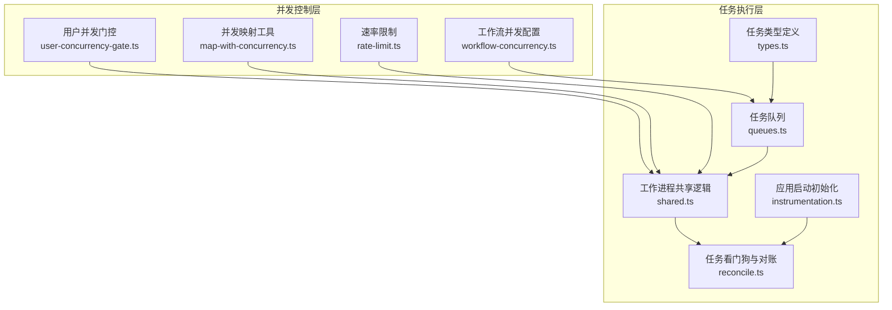
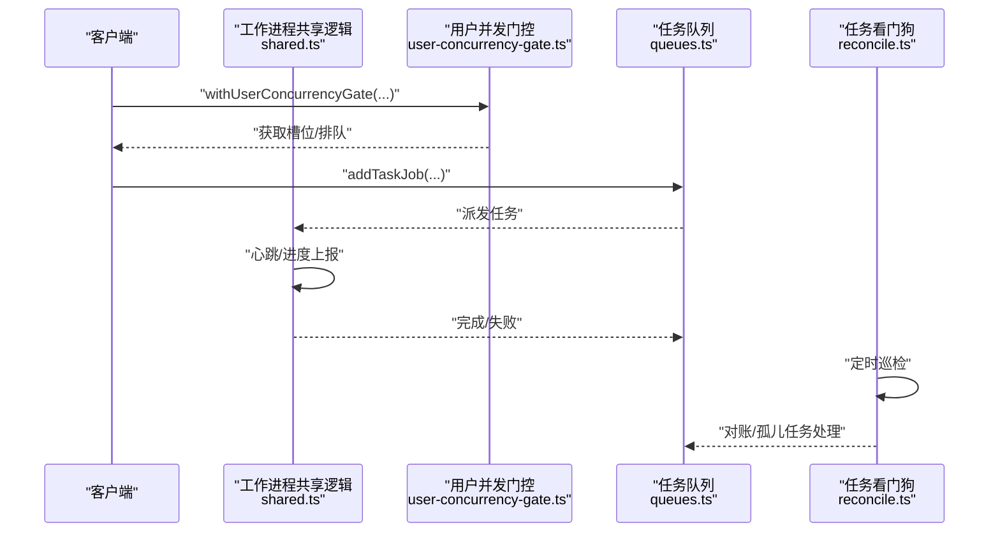
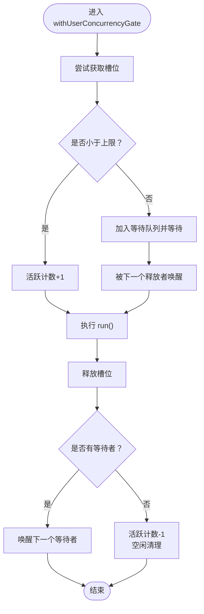
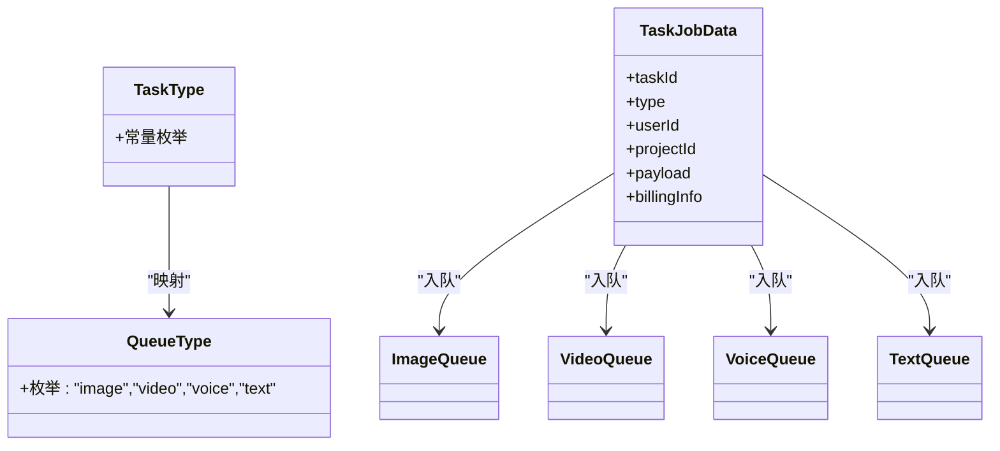
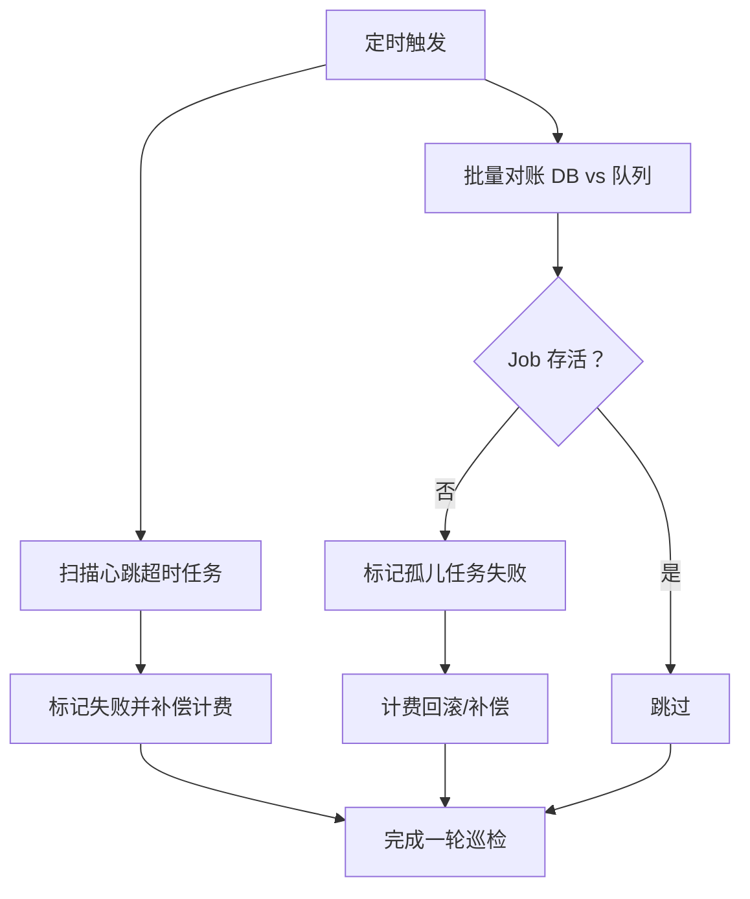
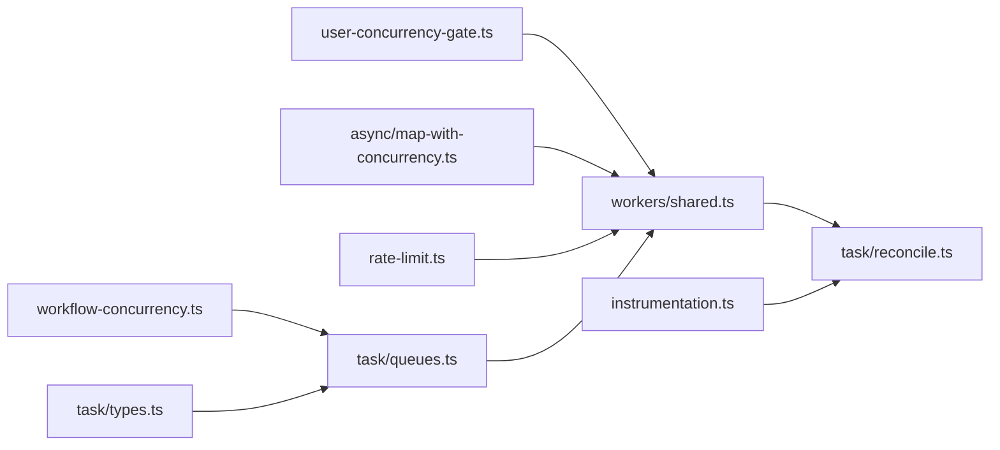

# 并发控制与资源管理

<cite>
**本文引用的文件**
- [src/lib/workers/user-concurrency-gate.ts](file://src/lib/workers/user-concurrency-gate.ts)
- [tests/unit/worker/user-concurrency-gate.test.ts](file://tests/unit/worker/user-concurrency-gate.test.ts)
- [src/lib/workflow-concurrency.ts](file://src/lib/workflow-concurrency.ts)
- [src/lib/async/map-with-concurrency.ts](file://src/lib/async/map-with-concurrency.ts)
- [src/lib/rate-limit.ts](file://src/lib/rate-limit.ts)
- [src/lib/task/queues.ts](file://src/lib/task/queues.ts)
- [src/lib/task/reconcile.ts](file://src/lib/task/reconcile.ts)
- [src/lib/task/types.ts](file://src/lib/task/types.ts)
- [src/lib/workers/shared.ts](file://src/lib/workers/shared.ts)
- [src/instrumentation.ts](file://src/instrumentation.ts)
</cite>

## 目录
1. [引言](#引言)
2. [项目结构](#项目结构)
3. [核心组件](#核心组件)
4. [架构总览](#架构总览)
5. [详细组件分析](#详细组件分析)
6. [依赖关系分析](#依赖关系分析)
7. [性能考量](#性能考量)
8. [故障排查指南](#故障排查指南)
9. [结论](#结论)
10. [附录](#附录)

## 引言
本技术文档聚焦 Waoowaoo 的并发控制与资源管理模块，系统性阐述用户并发门控机制、任务队列与执行控制、资源分配与公平调度、负载均衡与优先级策略、配置参数、监控与性能指标采集、实际应用场景与最佳实践，以及故障转移与降级策略。目标是帮助开发者与运维人员理解并正确配置系统在高并发场景下的稳定性与可扩展性。

## 项目结构
围绕并发控制与资源管理的关键目录与文件如下：
- 用户并发门控：src/lib/workers/user-concurrency-gate.ts
- 工作流并发配置：src/lib/workflow-concurrency.ts
- 并发映射工具：src/lib/async/map-with-concurrency.ts
- 速率限制（IP 级）：src/lib/rate-limit.ts
- 任务队列与类型：src/lib/task/queues.ts、src/lib/task/types.ts
- 任务看门狗与对账：src/lib/task/reconcile.ts
- 工作进程共享逻辑：src/lib/workers/shared.ts
- 应用启动初始化：src/instrumentation.ts

图表来源
- [src/lib/workers/user-concurrency-gate.ts:1-69](file://src/lib/workers/user-concurrency-gate.ts#L1-L69)
- [src/lib/workflow-concurrency.ts:1-43](file://src/lib/workflow-concurrency.ts#L1-L43)
- [src/lib/async/map-with-concurrency.ts:1-27](file://src/lib/async/map-with-concurrency.ts#L1-L27)
- [src/lib/rate-limit.ts:1-146](file://src/lib/rate-limit.ts#L1-L146)
- [src/lib/task/queues.ts:1-112](file://src/lib/task/queues.ts#L1-L112)
- [src/lib/task/types.ts:1-159](file://src/lib/task/types.ts#L1-L159)
- [src/lib/workers/shared.ts:333-675](file://src/lib/workers/shared.ts#L333-L675)
- [src/lib/task/reconcile.ts:1-226](file://src/lib/task/reconcile.ts#L1-L226)
- [src/instrumentation.ts:1-214](file://src/instrumentation.ts#L1-L214)

章节来源
- [src/lib/workers/user-concurrency-gate.ts:1-69](file://src/lib/workers/user-concurrency-gate.ts#L1-L69)
- [src/lib/workflow-concurrency.ts:1-43](file://src/lib/workflow-concurrency.ts#L1-L43)
- [src/lib/async/map-with-concurrency.ts:1-27](file://src/lib/async/map-with-concurrency.ts#L1-L27)
- [src/lib/rate-limit.ts:1-146](file://src/lib/rate-limit.ts#L1-L146)
- [src/lib/task/queues.ts:1-112](file://src/lib/task/queues.ts#L1-L112)
- [src/lib/task/types.ts:1-159](file://src/lib/task/types.ts#L1-L159)
- [src/lib/workers/shared.ts:333-675](file://src/lib/workers/shared.ts#L333-L675)
- [src/lib/task/reconcile.ts:1-226](file://src/lib/task/reconcile.ts#L1-L226)
- [src/instrumentation.ts:1-214](file://src/instrumentation.ts#L1-L214)

## 核心组件
- 用户并发门控：基于用户维度与作用域的轻量级并发门控，通过内存状态与 Promise 队列实现排队与释放，支持按用户与作用域隔离。
- 工作流并发配置：标准化工作流并发配置的解析与归一化，确保默认值与输入合法性。
- 并发映射工具：以指定并发度并行处理数组项，内部自动分配工作线程，避免一次性 fork 过多子任务。
- 速率限制：基于 Redis 的滑动窗口实现，提供 IP 级别的请求频率控制，保障敏感接口安全。
- 任务队列与类型：定义任务类型、队列类型与作业数据结构，并按任务类型路由到对应队列；统一默认作业选项与重试策略。
- 任务看门狗与对账：定时巡检与批量对账，修复 DB 与队列状态不一致导致的孤儿任务；心跳超时处理。
- 工作进程共享逻辑：统一的工作进程启动、心跳上报、进度上报与错误处理，保证任务生命周期一致性。
- 应用启动初始化：在应用启动阶段进行任务状态恢复、孤儿任务重入队与看门狗启动。

章节来源
- [src/lib/workers/user-concurrency-gate.ts:1-69](file://src/lib/workers/user-concurrency-gate.ts#L1-L69)
- [src/lib/workflow-concurrency.ts:1-43](file://src/lib/workflow-concurrency.ts#L1-L43)
- [src/lib/async/map-with-concurrency.ts:1-27](file://src/lib/async/map-with-concurrency.ts#L1-L27)
- [src/lib/rate-limit.ts:1-146](file://src/lib/rate-limit.ts#L1-L146)
- [src/lib/task/queues.ts:1-112](file://src/lib/task/queues.ts#L1-L112)
- [src/lib/task/types.ts:1-159](file://src/lib/task/types.ts#L1-L159)
- [src/lib/workers/shared.ts:333-675](file://src/lib/workers/shared.ts#L333-L675)
- [src/lib/task/reconcile.ts:1-226](file://src/lib/task/reconcile.ts#L1-L226)
- [src/instrumentation.ts:1-214](file://src/instrumentation.ts#L1-L214)

## 架构总览
下图展示了从请求进入、并发门控、任务入队、工作进程执行到看门狗对账的整体流程。

图表来源
- [src/lib/workers/user-concurrency-gate.ts:56-69](file://src/lib/workers/user-concurrency-gate.ts#L56-L69)
- [src/lib/task/queues.ts:88-101](file://src/lib/task/queues.ts#L88-L101)
- [src/lib/workers/shared.ts:333-675](file://src/lib/workers/shared.ts#L333-L675)
- [src/lib/task/reconcile.ts:219-226](file://src/lib/task/reconcile.ts#L219-L226)

## 详细组件分析

### 用户并发门控机制
- 设计目标：按用户与作用域（如图像/视频）隔离并发，防止单用户过度占用资源。
- 实现要点：
  - 使用内存 Map 记录每个“作用域:用户”键的状态，包含活跃计数与等待解析器队列。
  - 获取槽位时若未达上限则直接增加活跃计数；否则将 Promise 解析器加入等待队列并挂起。
  - 释放槽位时优先唤醒下一个等待者，否则减少活跃计数并在空闲时清理状态。
  - 输入校验：并发上限必须为正整数，否则抛出错误。
- 关键路径参考：
  - 获取/释放状态：[src/lib/workers/user-concurrency-gate.ts:10-24](file://src/lib/workers/user-concurrency-gate.ts#L10-L24)
  - 获取槽位：[src/lib/workers/user-concurrency-gate.ts:26-40](file://src/lib/workers/user-concurrency-gate.ts#L26-L40)
  - 释放槽位：[src/lib/workers/user-concurrency-gate.ts:42-54](file://src/lib/workers/user-concurrency-gate.ts#L42-L54)
  - 包装执行：[src/lib/workers/user-concurrency-gate.ts:56-69](file://src/lib/workers/user-concurrency-gate.ts#L56-L69)
- 行为验证：
  - 单元测试覆盖相同作用域与用户在 limit=1 时串行执行的行为：[tests/unit/worker/user-concurrency-gate.test.ts:1-51](file://tests/unit/worker/user-concurrency-gate.test.ts#L1-L51)

图表来源
- [src/lib/workers/user-concurrency-gate.ts:26-69](file://src/lib/workers/user-concurrency-gate.ts#L26-L69)

章节来源
- [src/lib/workers/user-concurrency-gate.ts:1-69](file://src/lib/workers/user-concurrency-gate.ts#L1-L69)
- [tests/unit/worker/user-concurrency-gate.test.ts:1-51](file://tests/unit/worker/user-concurrency-gate.test.ts#L1-L51)

### 工作流并发配置与归一化
- 功能：将传入的并发配置归一化为正整数，缺失或非法时采用默认值。
- 默认并发：分析、图像、视频均为 5。
- 归一化策略：过滤非有限数值、向下取整、确保大于 0，否则使用默认值。
- 关键路径参考：
  - 默认值与接口：[src/lib/workflow-concurrency.ts:1-9](file://src/lib/workflow-concurrency.ts#L1-L9)
  - 归一化函数：[src/lib/workflow-concurrency.ts:11-23](file://src/lib/workflow-concurrency.ts#L11-L23)
  - 配置归一化：[src/lib/workflow-concurrency.ts:25-42](file://src/lib/workflow-concurrency.ts#L25-L42)

章节来源
- [src/lib/workflow-concurrency.ts:1-43](file://src/lib/workflow-concurrency.ts#L1-L43)

### 并发映射工具
- 功能：在给定并发度下并行映射数组项，内部按工作线程数分发索引，避免一次性 fork 过多任务。
- 关键路径参考：
  - 并发映射实现：[src/lib/async/map-with-concurrency.ts:1-27](file://src/lib/async/map-with-concurrency.ts#L1-L27)

章节来源
- [src/lib/async/map-with-concurrency.ts:1-27](file://src/lib/async/map-with-concurrency.ts#L1-L27)

### 速率限制（IP 级）
- 功能：基于 Redis 的滑动窗口实现，按 (action, ip) 维度统计请求，超限返回重试等待时间。
- 配置示例：登录与注册的窗口与时长、最大请求数预设。
- 行为：Lua 原子脚本清理过期条目、计数与设置 TTL；Redis 不可用时放行，避免阻塞。
- 关键路径参考：
  - 接口与类型：[src/lib/rate-limit.ts:15-29](file://src/lib/rate-limit.ts#L15-L29)
  - 预设配置：[src/lib/rate-limit.ts:35-45](file://src/lib/rate-limit.ts#L35-L45)
  - 核心逻辑：[src/lib/rate-limit.ts:58-118](file://src/lib/rate-limit.ts#L58-L118)
  - IP 提取：[src/lib/rate-limit.ts:128-145](file://src/lib/rate-limit.ts#L128-L145)

章节来源
- [src/lib/rate-limit.ts:1-146](file://src/lib/rate-limit.ts#L1-L146)

### 任务队列与类型
- 队列命名与默认作业选项：图像、视频、语音、文本四类队列，统一设置完成/失败清理数量、重试次数与指数退避。
- 任务类型到队列的路由：根据任务类型集合映射到对应队列类型，再选择具体队列。
- 作业入队：支持优先级、单次尝试任务类型覆盖、去重 jobId。
- 关键路径参考：
  - 队列定义与默认选项：[src/lib/task/queues.ts:5-40](file://src/lib/task/queues.ts#L5-L40)
  - 类型集合与路由：[src/lib/task/queues.ts:44-86](file://src/lib/task/queues.ts#L44-L86)
  - 入队与移除：[src/lib/task/queues.ts:88-112](file://src/lib/task/queues.ts#L88-L112)
  - 任务类型与作业数据结构：[src/lib/task/types.ts:40-128](file://src/lib/task/types.ts#L40-L128)

图表来源
- [src/lib/task/queues.ts:44-86](file://src/lib/task/queues.ts#L44-L86)
- [src/lib/task/types.ts:40-128](file://src/lib/task/types.ts#L40-L128)

章节来源
- [src/lib/task/queues.ts:1-112](file://src/lib/task/queues.ts#L1-L112)
- [src/lib/task/types.ts:1-159](file://src/lib/task/types.ts#L1-L159)

### 任务看门狗与对账
- 功能：定时巡检与批量对账，修复 DB 与队列状态不一致导致的孤儿任务；处理心跳超时任务。
- 关键常量：巡检间隔、心跳超时阈值、批量扫描上限、竞态保护窗口。
- 对账流程：检查 Job 真实状态（存活/终态/缺失），对孤儿任务标记失败并补偿计费。
- 关键路径参考：
  - 常量与类型：[src/lib/task/reconcile.ts:25-46](file://src/lib/task/reconcile.ts#L25-L46)
  - Job 状态检查：[src/lib/task/reconcile.ts:54-71](file://src/lib/task/reconcile.ts#L54-L71)
  - 孤儿任务处理：[src/lib/task/reconcile.ts:87-107](file://src/lib/task/reconcile.ts#L87-L107)
  - 批量对账与巡检：[src/lib/task/reconcile.ts:160-207](file://src/lib/task/reconcile.ts#L160-L207)
  - 启动看门狗：[src/lib/task/reconcile.ts:219-226](file://src/lib/task/reconcile.ts#L219-L226)

图表来源
- [src/lib/task/reconcile.ts:219-226](file://src/lib/task/reconcile.ts#L219-L226)
- [src/lib/task/reconcile.ts:160-207](file://src/lib/task/reconcile.ts#L160-L207)
- [src/lib/task/reconcile.ts:87-107](file://src/lib/task/reconcile.ts#L87-L107)

章节来源
- [src/lib/task/reconcile.ts:1-226](file://src/lib/task/reconcile.ts#L1-L226)

### 工作进程共享逻辑
- 功能：统一的工作进程启动、心跳上报、进度上报、错误处理与生命周期管理。
- 关键点：尝试标记任务为 processing、心跳定时器、进度上报、异常转换为不可恢复错误以便记录失败。
- 关键路径参考：
  - 启动与执行：[src/lib/workers/shared.ts:333-366](file://src/lib/workers/shared.ts#L333-L366)
  - 进度上报：[src/lib/workers/shared.ts:648-675](file://src/lib/workers/shared.ts#L648-L675)

章节来源
- [src/lib/workers/shared.ts:333-675](file://src/lib/workers/shared.ts#L333-L675)

### 应用启动初始化
- 功能：应用启动时进行三阶段处理：
  1) 将 processing 任务重置为 queued；
  2) 将 queued 任务重新入队到 BullMQ；
  3) 启动任务看门狗。
- 关键路径参考：
  - 初始化流程：[src/instrumentation.ts:16-35](file://src/instrumentation.ts#L16-L35)
  - 重新入队 queued 任务：[src/instrumentation.ts:110-199](file://src/instrumentation.ts#L110-L199)
  - 启动看门狗：[src/instrumentation.ts:204-211](file://src/instrumentation.ts#L204-L211)

章节来源
- [src/instrumentation.ts:1-214](file://src/instrumentation.ts#L1-L214)

## 依赖关系分析
- 并发门控依赖工作进程共享逻辑以在任务执行前后正确更新状态。
- 任务队列与类型为工作进程提供统一的数据结构与路由。
- 看门狗依赖队列状态检查与计费回滚能力，保障系统一致性。
- 应用启动初始化负责在系统重启后恢复任务状态并启动看门狗。

图表来源
- [src/lib/workers/user-concurrency-gate.ts:56-69](file://src/lib/workers/user-concurrency-gate.ts#L56-L69)
- [src/lib/workers/shared.ts:333-366](file://src/lib/workers/shared.ts#L333-L366)
- [src/lib/workflow-concurrency.ts:25-42](file://src/lib/workflow-concurrency.ts#L25-L42)
- [src/lib/async/map-with-concurrency.ts:1-27](file://src/lib/async/map-with-concurrency.ts#L1-L27)
- [src/lib/rate-limit.ts:58-118](file://src/lib/rate-limit.ts#L58-L118)
- [src/lib/task/queues.ts:88-101](file://src/lib/task/queues.ts#L88-L101)
- [src/lib/task/types.ts:40-128](file://src/lib/task/types.ts#L40-L128)
- [src/lib/task/reconcile.ts:219-226](file://src/lib/task/reconcile.ts#L219-L226)
- [src/instrumentation.ts:204-211](file://src/instrumentation.ts#L204-L211)

章节来源
- [src/lib/workers/user-concurrency-gate.ts:1-69](file://src/lib/workers/user-concurrency-gate.ts#L1-L69)
- [src/lib/workers/shared.ts:333-675](file://src/lib/workers/shared.ts#L333-L675)
- [src/lib/workflow-concurrency.ts:1-43](file://src/lib/workflow-concurrency.ts#L1-L43)
- [src/lib/async/map-with-concurrency.ts:1-27](file://src/lib/async/map-with-concurrency.ts#L1-L27)
- [src/lib/rate-limit.ts:1-146](file://src/lib/rate-limit.ts#L1-L146)
- [src/lib/task/queues.ts:1-112](file://src/lib/task/queues.ts#L1-L112)
- [src/lib/task/types.ts:1-159](file://src/lib/task/types.ts#L1-L159)
- [src/lib/task/reconcile.ts:1-226](file://src/lib/task/reconcile.ts#L1-L226)
- [src/instrumentation.ts:1-214](file://src/instrumentation.ts#L1-L214)

## 性能考量
- 并发门控：内存状态与小规模等待队列，适合用户级串行化与作用域隔离；注意避免过低的并发上限导致排队延迟。
- 工作流并发配置：默认并发为 5，可根据 CPU/内存与外部服务能力调整；过大可能导致队列堆积与资源争用。
- 并发映射工具：合理设置并发度，避免一次性 fork 过多子任务造成上下文切换开销。
- 速率限制：Redis 滑动窗口原子脚本降低竞争；Redis 不可用时放行以避免阻塞。
- 任务队列：统一的重试与退避策略减少抖动；单次尝试任务类型避免重复执行。
- 看门狗：定时巡检与批量对账，平衡修复成本与准确性；竞态保护窗口避免误判。

## 故障排查指南
- 并发门控异常
  - 现象：任务长时间无法开始或报错。
  - 排查：确认 limit 参数为正整数；检查是否存在未释放的槽位；查看单元测试用例行为是否符合预期。
  - 参考：[src/lib/workers/user-concurrency-gate.ts:26-29](file://src/lib/workers/user-concurrency-gate.ts#L26-L29)
- 任务孤儿与状态不一致
  - 现象：任务卡在 processing 或 DB 与队列状态不一致。
  - 排查：确认看门狗已启动；检查对账日志与补偿结果；核对竞态保护窗口设置。
  - 参考：[src/lib/task/reconcile.ts:219-226](file://src/lib/task/reconcile.ts#L219-L226)
- 应用启动后任务丢失
  - 现象：Redis 重启后 queued 任务未执行。
  - 排查：确认初始化阶段重新入队逻辑执行成功；检查批量入队的错误记录。
  - 参考：[src/instrumentation.ts:110-199](file://src/instrumentation.ts#L110-L199)
- 速率限制导致频繁拒绝
  - 现象：登录/注册接口频繁返回重试等待。
  - 排查：调整窗口与最大请求数；检查客户端 IP 提取是否正确。
  - 参考：[src/lib/rate-limit.ts:35-45](file://src/lib/rate-limit.ts#L35-L45)

章节来源
- [src/lib/workers/user-concurrency-gate.ts:26-29](file://src/lib/workers/user-concurrency-gate.ts#L26-L29)
- [src/lib/task/reconcile.ts:219-226](file://src/lib/task/reconcile.ts#L219-L226)
- [src/instrumentation.ts:110-199](file://src/instrumentation.ts#L110-L199)
- [src/lib/rate-limit.ts:35-45](file://src/lib/rate-limit.ts#L35-L45)

## 结论
Waoowaoo 的并发控制与资源管理通过“用户并发门控 + 任务队列 + 看门狗对账 + 启动恢复”的组合，实现了用户级串行化、任务生命周期一致性与系统自愈能力。配合工作流并发配置与速率限制，可在高并发场景下保持系统的稳定性与可扩展性。建议结合业务负载与资源瓶颈，动态调整并发上限、队列重试与看门狗巡检策略，并完善监控与告警体系。

## 附录

### 并发控制配置参数说明
- 用户并发门控
  - scope：作用域（如图像/视频）
  - userId：用户标识
  - limit：并发上限（正整数）
  - run：异步执行体
  - 参考：[src/lib/workers/user-concurrency-gate.ts:56-69](file://src/lib/workers/user-concurrency-gate.ts#L56-L69)
- 工作流并发配置
  - analysis/image/video：并发上限（默认 5）
  - 归一化规则：正整数、向下取整、非法则用默认
  - 参考：[src/lib/workflow-concurrency.ts:1-43](file://src/lib/workflow-concurrency.ts#L1-L43)
- 并发映射工具
  - concurrency：并发度（>=1）
  - 参考：[src/lib/async/map-with-concurrency.ts:8-11](file://src/lib/async/map-with-concurrency.ts#L8-L11)
- 速率限制
  - windowSeconds：窗口时长（秒）
  - maxRequests：窗口内最大请求数
  - 参考：[src/lib/rate-limit.ts:15-29](file://src/lib/rate-limit.ts#L15-L29)
- 任务队列
  - removeOnComplete/removeOnFail：完成/失败后清理数量
  - attempts/backoff：重试次数与指数退避
  - 单次尝试任务类型：不走默认重试
  - 参考：[src/lib/task/queues.ts:12-20](file://src/lib/task/queues.ts#L12-L20)
- 任务看门狗
  - WATCHDOG_INTERVAL_MS：巡检间隔
  - PROCESSING_TIMEOUT_MS：心跳超时阈值
  - RECONCILE_BATCH_SIZE：批量扫描上限
  - 竞态保护窗口：TERMINAL_RECONCILE_GRACE_MS、MISSING_RECONCILE_GRACE_MS
  - 参考：[src/lib/task/reconcile.ts:27-40](file://src/lib/task/reconcile.ts#L27-L40)

### 资源监控与性能指标
- 建议采集
  - 并发门控等待队列长度与平均等待时延
  - 任务队列长度、作业完成/失败速率、重试次数分布
  - 工作进程心跳上报与进度更新频率
  - 看门狗巡检耗时与孤儿任务修复数量
  - 速率限制命中率与重试等待时间
- 参考实现位置
  - 并发门控状态与释放逻辑：[src/lib/workers/user-concurrency-gate.ts:42-54](file://src/lib/workers/user-concurrency-gate.ts#L42-L54)
  - 任务队列作业选项与重试：[src/lib/task/queues.ts:12-20](file://src/lib/task/queues.ts#L12-L20)
  - 工作进程心跳与进度上报：[src/lib/workers/shared.ts:648-675](file://src/lib/workers/shared.ts#L648-L675)
  - 看门狗巡检与对账：[src/lib/task/reconcile.ts:219-226](file://src/lib/task/reconcile.ts#L219-L226)

### 实际应用场景与最佳实践
- 图像/视频生成：为不同用户设置合理的 limit，避免单用户占满 GPU/CPU；对高优先级任务使用队列优先级。
- 速率限制：对登录/注册等敏感接口启用滑动窗口限流，防止暴力破解与刷量。
- 自愈与恢复：依赖看门狗与启动恢复，确保系统重启后任务不丢失且状态一致。
- 最佳实践
  - 根据硬件资源与 SLA 设置并发上限
  - 对长耗时任务启用心跳与进度上报
  - 合理配置重试与退避，避免雪崩效应
  - 定期审查看门狗巡检与对账日志