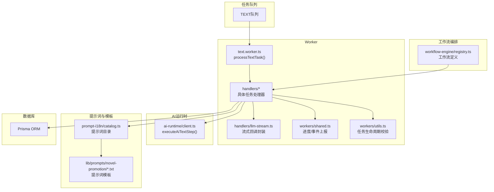
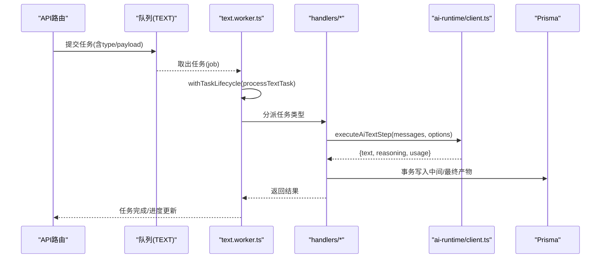
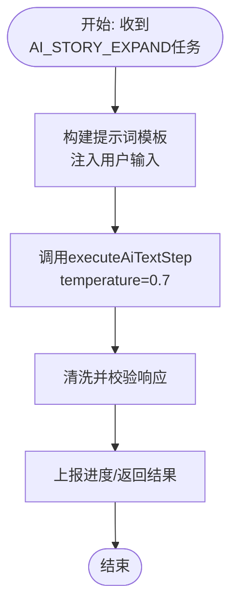
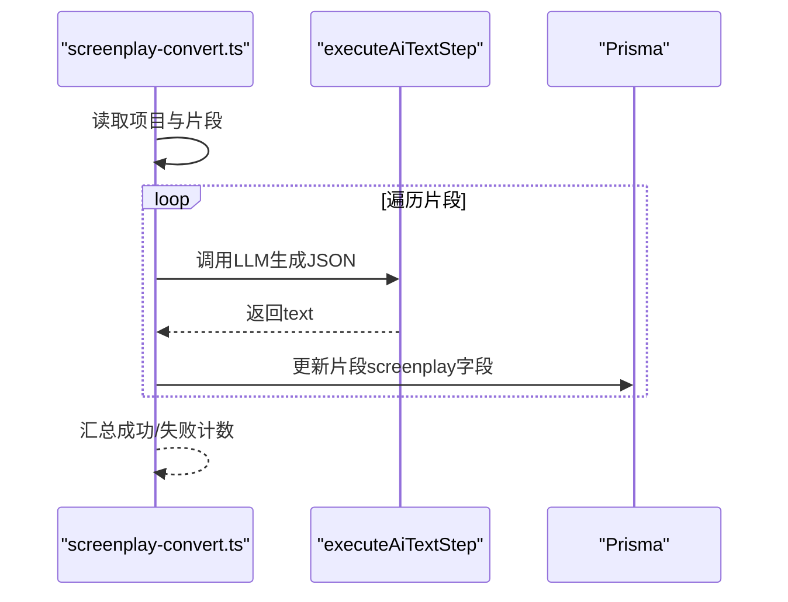
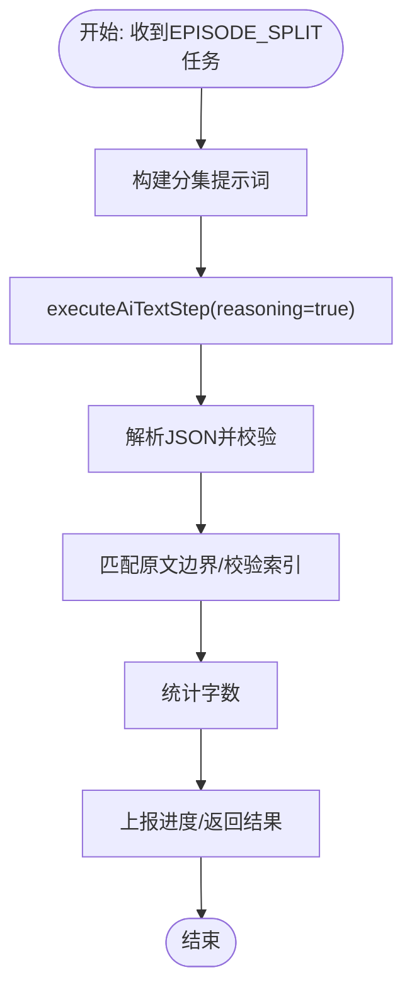
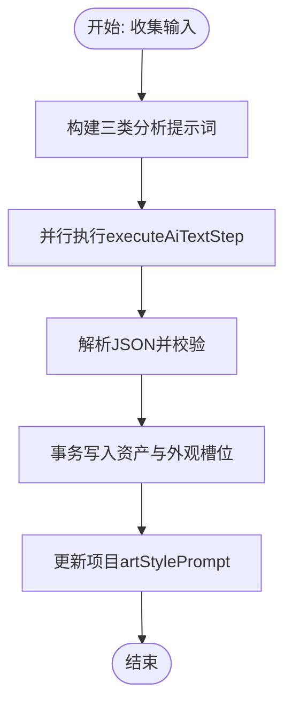
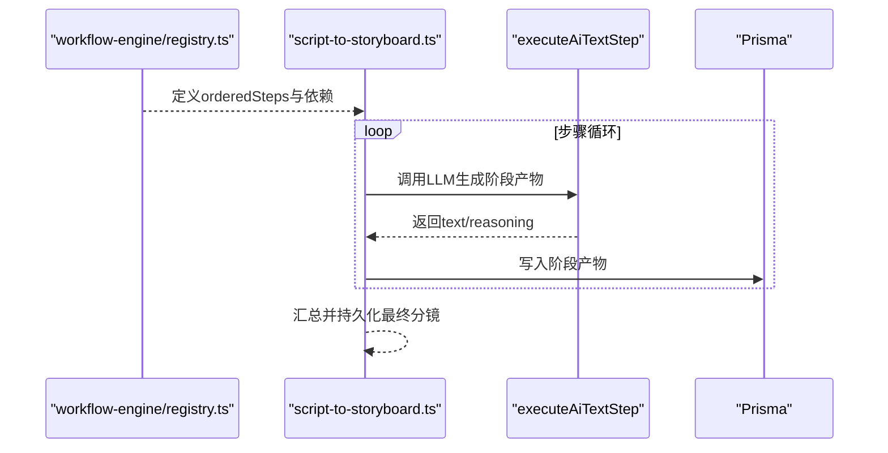
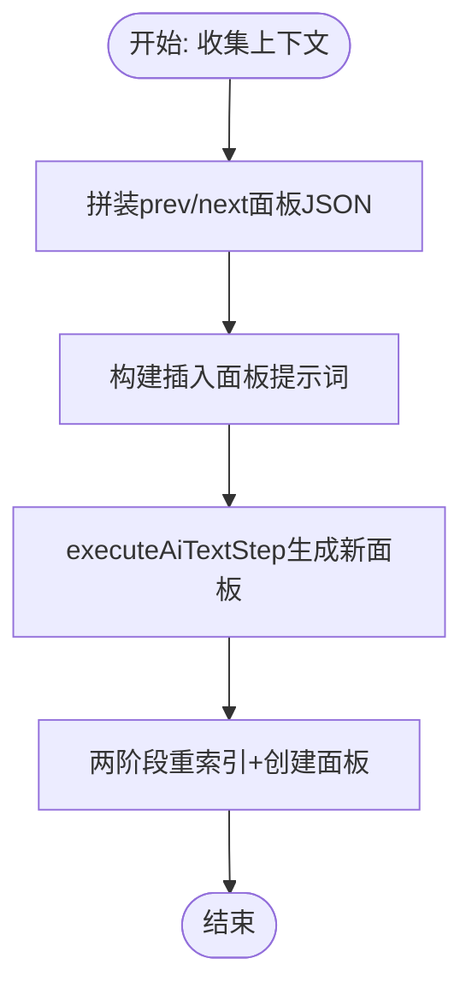
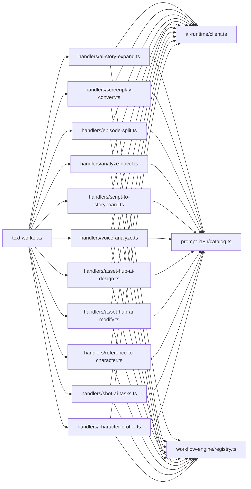

# 文本处理Worker

<cite>
**本文引用的文件**
- [src/lib/workers/text.worker.ts](file://src/lib/workers/text.worker.ts)
- [src/lib/workers/handlers/ai-story-expand.ts](file://src/lib/workers/handlers/ai-story-expand.ts)
- [src/lib/workers/handlers/screenplay-convert.ts](file://src/lib/workers/handlers/screenplay-convert.ts)
- [src/lib/workers/handlers/episode-split.ts](file://src/lib/workers/handlers/episode-split.ts)
- [src/lib/workers/handlers/analyze-novel.ts](file://src/lib/workers/handlers/analyze-novel.ts)
- [src/lib/workers/handlers/script-to-storyboard.ts](file://src/lib/workers/handlers/script-to-storyboard.ts)
- [src/lib/workers/handlers/voice-analyze.ts](file://src/lib/workers/handlers/voice-analyze.ts)
- [src/lib/workers/handlers/asset-hub-ai-design.ts](file://src/lib/workers/handlers/asset-hub-ai-design.ts)
- [src/lib/workers/handlers/asset-hub-ai-modify.ts](file://src/lib/workers/handlers/asset-hub-ai-modify.ts)
- [src/lib/workers/handlers/reference-to-character.ts](file://src/lib/workers/handlers/reference-to-character.ts)
- [src/lib/workers/handlers/shot-ai-tasks.ts](file://src/lib/workers/handlers/shot-ai-tasks.ts)
- [src/lib/workers/handlers/character-profile.ts](file://src/lib/workers/handlers/character-profile.ts)
- [src/lib/workers/handlers/llm-stream.ts](file://src/lib/workers/handlers/llm-stream.ts)
- [src/lib/workers/shared.ts](file://src/lib/workers/shared.ts)
- [src/lib/workers/utils.ts](file://src/lib/workers/utils.ts)
- [src/lib/ai-runtime/client.ts](file://src/lib/ai-runtime/client.ts)
- [src/lib/ai-runtime/index.ts](file://src/lib/ai-runtime/index.ts)
- [src/lib/workflow-engine/registry.ts](file://src/lib/workflow-engine/registry.ts)
- [src/lib/prompt-i18n/catalog.ts](file://src/lib/prompt-i18n/catalog.ts)
- [lib/prompts/novel-promotion/ai_story_expand.en.txt](file://lib/prompts/novel-promotion/ai_story_expand.en.txt)
- [lib/prompts/novel-promotion/screenplay_conversion.en.txt](file://lib/prompts/novel-promotion/screenplay_conversion.en.txt)
- [src/lib/constants.ts](file://src/lib/constants.ts)
- [messages/en/progress.json](file://messages/en/progress.json)
</cite>

## 目录
1. [简介](#简介)
2. [项目结构](#项目结构)
3. [核心组件](#核心组件)
4. [架构总览](#架构总览)
5. [详细组件分析](#详细组件分析)
6. [依赖关系分析](#依赖关系分析)
7. [性能考量](#性能考量)
8. [故障排查指南](#故障排查指南)
9. [结论](#结论)
10. [附录](#附录)

## 简介
本技术文档面向Waoowaoo平台的“文本处理Worker”，系统性阐述其核心功能、实现机制与运行流程。该Worker负责承接并执行各类文本生成与处理任务，涵盖故事扩写、剧本转换、分集拆分、资产分析、分镜规划与细化、语音行分析、资产设计与修改、参考转角色、镜头AI任务以及分镜插入等。文档将深入解释AI模型集成方式（通过统一的AI运行时）、提示词工程、参数配置、质量评估与风格控制、多轮对话管理、实际应用示例与错误处理策略，并给出性能优化建议。

## 项目结构
文本处理Worker位于后端服务的“workers”子系统中，采用任务队列驱动的异步处理模式。核心入口为文本Worker，根据任务类型分派至对应处理器；处理器内部通过统一的AI运行时调用LLM，结合提示词模板与项目上下文数据，完成文本理解与生成；同时，Worker负责进度上报、流式输出、事务持久化与错误恢复。

图表来源
- [src/lib/workers/text.worker.ts:653-703](file://src/lib/workers/text.worker.ts#L653-L703)
- [src/lib/workers/handlers/llm-stream.ts](file://src/lib/workers/handlers/llm-stream.ts)
- [src/lib/workers/shared.ts](file://src/lib/workers/shared.ts)
- [src/lib/workers/utils.ts](file://src/lib/workers/utils.ts)
- [src/lib/ai-runtime/client.ts:49-79](file://src/lib/ai-runtime/client.ts#L49-L79)
- [src/lib/prompt-i18n/catalog.ts:72-112](file://src/lib/prompt-i18n/catalog.ts#L72-L112)
- [src/lib/workflow-engine/registry.ts:98-199](file://src/lib/workflow-engine/registry.ts#L98-L199)

章节来源
- [src/lib/workers/text.worker.ts:1-715](file://src/lib/workers/text.worker.ts#L1-L715)

## 核心组件
- 文本Worker入口：负责接收任务、初始化流式回调、分派任务类型、执行生命周期钩子与进度上报。
- AI运行时：封装LLM调用、提取文本与推理内容、统计用量、错误转换。
- 提示词系统：基于任务类型与语言环境选择模板，注入变量上下文。
- 工作流引擎：定义故事到剧本、剧本到分镜的步骤拓扑与重试失效范围。
- 数据持久化：处理器内使用事务保证一致性，按阶段写入中间产物与最终结果。
- 流式输出：将LLM增量输出拆分为固定长度块，按步骤/通道顺序编号，实时上报。

章节来源
- [src/lib/workers/text.worker.ts:61-189](file://src/lib/workers/text.worker.ts#L61-L189)
- [src/lib/ai-runtime/client.ts:49-79](file://src/lib/ai-runtime/client.ts#L49-L79)
- [src/lib/workflow-engine/registry.ts:98-199](file://src/lib/workflow-engine/registry.ts#L98-L199)

## 架构总览
文本处理Worker采用“任务分发-处理器-AI运行时-提示词-持久化”的流水线架构。每个任务在进入处理器前，都会经过任务生命周期校验与进度上报；处理器通过统一的AI运行时接口调用LLM，结合提示词模板与项目/用户配置生成文本；随后将中间产物与最终结果写入数据库，并通过共享模块上报进度与流式片段。

图表来源
- [src/lib/workers/text.worker.ts:653-703](file://src/lib/workers/text.worker.ts#L653-L703)
- [src/lib/ai-runtime/client.ts:49-79](file://src/lib/ai-runtime/client.ts#L49-L79)
- [src/lib/workers/shared.ts](file://src/lib/workers/shared.ts)

## 详细组件分析

### 文本Worker与任务分发
- 入口函数创建Worker实例，连接队列与Redis，设置并发度。
- processTextTask根据任务类型分派到不同处理器，包含故事到剧本、剧本到分镜、语音分析、资产设计/修改、参考转角色、镜头AI任务、分镜插入与重生成等。
- 统一流式回调封装：创建流上下文与序列号，按步骤/通道聚合增量输出，上报进度与流式片段。

章节来源
- [src/lib/workers/text.worker.ts:653-714](file://src/lib/workers/text.worker.ts#L653-L714)
- [src/lib/workers/text.worker.ts:61-189](file://src/lib/workers/text.worker.ts#L61-L189)

### 故事扩写（AI Story Expand）
- 输入：用户指令与分析模型。
- 处理：构建提示词模板，调用AI运行时，温度参数适中以提升创造性；完成后对响应进行清洗与校验。
- 输出：扩展后的完整故事文本，供后续剧本转换使用。

图表来源
- [src/lib/workers/handlers/ai-story-expand.ts:14-79](file://src/lib/workers/handlers/ai-story-expand.ts#L14-L79)
- [src/lib/ai-runtime/client.ts:49-79](file://src/lib/ai-runtime/client.ts#L49-L79)

章节来源
- [src/lib/workers/handlers/ai-story-expand.ts:1-80](file://src/lib/workers/handlers/ai-story-expand.ts#L1-L80)

### 剧本转换（Screenplay Convert）
- 输入：剧集ID、片段列表、项目角色/场景库、分析模型。
- 处理：逐片段构造提示词，调用AI运行时生成结构化JSON；记录输入/输出日志；持久化到片段表。
- 错误处理：支持多次尝试，失败片段汇总返回。

图表来源
- [src/lib/workers/handlers/screenplay-convert.ts:23-257](file://src/lib/workers/handlers/screenplay-convert.ts#L23-L257)
- [src/lib/ai-runtime/client.ts:49-79](file://src/lib/ai-runtime/client.ts#L49-L79)

章节来源
- [src/lib/workers/handlers/screenplay-convert.ts:1-258](file://src/lib/workers/handlers/screenplay-convert.ts#L1-L258)

### 分集拆分（Episode Split）
- 输入：长文本内容。
- 处理：构建分集提示词，调用AI运行时生成分集边界与标题摘要；匹配原文边界，计算字数；多次尝试容错。
- 输出：标准化的分集列表，包含序号、标题、摘要、内容与字数。

图表来源
- [src/lib/workers/handlers/episode-split.ts:58-257](file://src/lib/workers/handlers/episode-split.ts#L58-L257)
- [src/lib/ai-runtime/client.ts:49-79](file://src/lib/ai-runtime/client.ts#L49-L79)

章节来源
- [src/lib/workers/handlers/episode-split.ts:1-257](file://src/lib/workers/handlers/episode-split.ts#L1-L257)

### 小说资产分析（Analyze Novel）
- 输入：项目全局资产文本或首个剧集内容。
- 处理：并行调用角色、场景、道具三类分析提示词；解析JSON并去重；按项目风格生成风格提示词。
- 输出：创建角色/场景/道具资产，填充外观槽位与描述，更新项目艺术风格提示。

图表来源
- [src/lib/workers/handlers/analyze-novel.ts:46-392](file://src/lib/workers/handlers/analyze-novel.ts#L46-L392)
- [src/lib/constants.ts:137-189](file://src/lib/constants.ts#L137-L189)

章节来源
- [src/lib/workers/handlers/analyze-novel.ts:1-393](file://src/lib/workers/handlers/analyze-novel.ts#L1-L393)

### 剧本到分镜（Script to Storyboard）
- 工作流定义：计划面板→细化面板（摄影规则+表演指导）→语音分析→持久化。
- 执行：按步骤构建提示词，调用AI运行时，记录输入/输出日志；多步骤并行与串行组合，受工作流定义约束。
- 输出：分镜面板集合，包含摄影计划与表演备注，以及语音行分析结果。

图表来源
- [src/lib/workflow-engine/registry.ts:98-199](file://src/lib/workflow-engine/registry.ts#L98-L199)
- [src/lib/workers/handlers/script-to-storyboard.ts:147-263](file://src/lib/workers/handlers/script-to-storyboard.ts#L147-L263)
- [src/lib/ai-runtime/client.ts:49-79](file://src/lib/ai-runtime/client.ts#L49-L79)

章节来源
- [src/lib/workers/handlers/script-to-storyboard.ts:147-347](file://src/lib/workers/handlers/script-to-storyboard.ts#L147-L347)
- [src/lib/workflow-engine/registry.ts:98-199](file://src/lib/workflow-engine/registry.ts#L98-L199)

### 语音分析（Voice Analyze）
- 输入：剧本片段与项目角色库。
- 处理：构建语音分析提示词，调用AI运行时生成语音行清单；持久化到数据库。
- 输出：语音行分析结果，用于后续配音与同步。

章节来源
- [src/lib/workers/handlers/voice-analyze.ts](file://src/lib/workers/handlers/voice-analyze.ts)

### 资产Hub AI设计/修改
- 设计：根据用户指令与分析模型生成角色/场景设计建议。
- 修改：基于现有资产与修改指令生成新的外观/描述版本。
- 流程：构建提示词→调用AI运行时→持久化变更。

章节来源
- [src/lib/workers/handlers/asset-hub-ai-design.ts](file://src/lib/workers/handlers/asset-hub-ai-design.ts)
- [src/lib/workers/handlers/asset-hub-ai-modify.ts](file://src/lib/workers/handlers/asset-hub-ai-modify.ts)

### 参考转角色（Reference to Character）
- 输入：参考图片或描述。
- 处理：构建参考转角色提示词，调用AI运行时生成角色档案；持久化到项目角色库。

章节来源
- [src/lib/workers/handlers/reference-to-character.ts](file://src/lib/workers/handlers/reference-to-character.ts)

### 镜头AI任务（Shot AI Tasks）
- 输入：场景、角色、道具、摄影规则等上下文。
- 处理：构建镜头变体分析/生成提示词，调用AI运行时生成变体方案；持久化变体结果。

章节来源
- [src/lib/workers/handlers/shot-ai-tasks.ts](file://src/lib/workers/handlers/shot-ai-tasks.ts)

### 角色档案确认（Character Profile）
- 输入：角色档案与确认指令。
- 处理：构建确认提示词，调用AI运行时进行校验与修正；标记确认状态。

章节来源
- [src/lib/workers/handlers/character-profile.ts](file://src/lib/workers/handlers/character-profile.ts)

### 分镜插入（Insert Panel）
- 输入：目标分镜板、插入位置、用户输入。
- 处理：收集前后面板上下文，构建插入提示词，调用AI运行时生成新面板；两阶段重索引避免唯一约束冲突；事务持久化。

图表来源
- [src/lib/workers/text.worker.ts:436-651](file://src/lib/workers/text.worker.ts#L436-L651)
- [src/lib/ai-runtime/client.ts:49-79](file://src/lib/ai-runtime/client.ts#L49-L79)

章节来源
- [src/lib/workers/text.worker.ts:436-651](file://src/lib/workers/text.worker.ts#L436-L651)

## 依赖关系分析
- 任务类型与处理器映射：text.worker.ts集中分派，覆盖故事/剧本/分镜/资产/语音/镜头等任务。
- AI运行时：所有文本生成均通过executeAiTextStep统一入口，便于统一错误处理与用量统计。
- 提示词系统：catalog.ts定义提示词ID与变量键，模板文件位于lib/prompts，按语言环境加载。
- 工作流引擎：registry.ts定义故事到剧本与剧本到分镜的步骤拓扑与重试失效范围，保障可重复性与一致性。
- 数据持久化：处理器内使用Prisma事务，确保阶段产物与最终产物的一致性。

图表来源
- [src/lib/workers/text.worker.ts:653-703](file://src/lib/workers/text.worker.ts#L653-L703)
- [src/lib/workers/handlers/ai-story-expand.ts:1-80](file://src/lib/workers/handlers/ai-story-expand.ts#L1-L80)
- [src/lib/workers/handlers/screenplay-convert.ts:1-258](file://src/lib/workers/handlers/screenplay-convert.ts#L1-L258)
- [src/lib/workers/handlers/episode-split.ts:1-257](file://src/lib/workers/handlers/episode-split.ts#L1-L257)
- [src/lib/workers/handlers/analyze-novel.ts:1-393](file://src/lib/workers/handlers/analyze-novel.ts#L1-L393)
- [src/lib/workers/handlers/script-to-storyboard.ts:147-347](file://src/lib/workers/handlers/script-to-storyboard.ts#L147-L347)
- [src/lib/workers/handlers/voice-analyze.ts](file://src/lib/workers/handlers/voice-analyze.ts)
- [src/lib/workers/handlers/asset-hub-ai-design.ts](file://src/lib/workers/handlers/asset-hub-ai-design.ts)
- [src/lib/workers/handlers/asset-hub-ai-modify.ts](file://src/lib/workers/handlers/asset-hub-ai-modify.ts)
- [src/lib/workers/handlers/reference-to-character.ts](file://src/lib/workers/handlers/reference-to-character.ts)
- [src/lib/workers/handlers/shot-ai-tasks.ts](file://src/lib/workers/handlers/shot-ai-tasks.ts)
- [src/lib/workers/handlers/character-profile.ts](file://src/lib/workers/handlers/character-profile.ts)
- [src/lib/ai-runtime/client.ts:49-79](file://src/lib/ai-runtime/client.ts#L49-L79)
- [src/lib/prompt-i18n/catalog.ts:72-112](file://src/lib/prompt-i18n/catalog.ts#L72-L112)
- [src/lib/workflow-engine/registry.ts:98-199](file://src/lib/workflow-engine/registry.ts#L98-L199)

章节来源
- [src/lib/workers/text.worker.ts:653-703](file://src/lib/workers/text.worker.ts#L653-L703)
- [src/lib/workflow-engine/registry.ts:98-199](file://src/lib/workflow-engine/registry.ts#L98-L199)

## 性能考量
- 并发与限流：Worker并发度由环境变量控制；工作流内步骤并发受工作流定义与项目模型能力限制。
- 流式输出：将LLM增量输出切分为固定长度块，降低单次消息体积，提升前端渲染与网络传输效率。
- 事务批处理：在批量写入场景下，尽量合并SQL操作，减少事务提交次数。
- 温度与推理：针对稳定性要求高的任务（如分集拆分）降低温度并启用高推理努力；创意型任务（如故事扩写）适度提高温度。
- 日志与可观测性：记录输入/输出与用量，便于回放与性能分析。

## 故障排查指南
- 任务终止：当任务被终止或工作流被取消时，处理器会抛出特定错误，需检查任务状态与工作流租约。
- LLM错误：统一通过AI运行时错误转换，包含错误码与消息；检查模型配置、提示词格式与上下文长度。
- JSON解析失败：剧本转换与资产分析依赖严格JSON输出，需确保提示词模板中的JSON安全规则得到遵守。
- 事务冲突：分镜插入采用两阶段重索引避免唯一约束冲突；若仍出现异常，检查面板索引与目标ID。
- 提示词缺失：确认提示词ID与语言环境匹配，变量键齐全；必要时回退到默认模板。

章节来源
- [src/lib/workers/utils.ts](file://src/lib/workers/utils.ts)
- [src/lib/workers/handlers/screenplay-convert.ts:168-186](file://src/lib/workers/handlers/screenplay-convert.ts#L168-L186)
- [src/lib/workers/text.worker.ts:600-620](file://src/lib/workers/text.worker.ts#L600-L620)

## 结论
文本处理Worker以统一的AI运行时为核心，结合提示词工程与工作流编排，实现了从故事到剧本、再到分镜与语音行的全链路文本生成与处理。通过严格的进度上报、流式输出与事务持久化，保障了任务的可靠性与可观测性。建议在生产环境中合理配置并发与温度参数，持续优化提示词模板与上下文注入，以获得更稳定与高质量的文本产出。

## 附录

### 任务类型与处理器映射
- 故事到剧本运行：story-to-script
- 剧本到分镜运行：script-to-storyboard
- 语音分析：voice-analyze
- 小说资产分析：analyze-novel
- 故事扩写：ai-story-expand
- 片段构建：clips-build
- 剧本转换：screenplay-convert
- 分集拆分：episode-split
- 全局分析：analyze-global
- 资产Hub设计/修改：asset-hub-ai-design / asset-hub-ai-modify
- 参考转角色：reference-to-character
- 镜头AI任务：shot-ai-tasks
- 角色档案确认：character-profile
- 分镜重生成：regenerate-storyboard-text
- 分镜插入：insert-panel

章节来源
- [src/lib/workers/text.worker.ts:656-702](file://src/lib/workers/text.worker.ts#L656-L702)

### 提示词模板与变量
- 故事扩写模板：包含创作要求、格式要求、长度控制与禁止项。
- 剧本转换模板：要求输出严格JSON，包含场景、动作、对白、画外音等结构化字段。

章节来源
- [lib/prompts/novel-promotion/ai_story_expand.en.txt:1-40](file://lib/prompts/novel-promotion/ai_story_expand.en.txt#L1-L40)
- [lib/prompts/novel-promotion/screenplay_conversion.en.txt:1-61](file://lib/prompts/novel-promotion/screenplay_conversion.en.txt#L1-L61)
- [src/lib/prompt-i18n/catalog.ts:72-112](file://src/lib/prompt-i18n/catalog.ts#L72-L112)

### 艺术风格控制
- 通过项目配置与常量表获取风格提示词，统一注入到资产分析与项目描述中，确保风格一致性。

章节来源
- [src/lib/constants.ts:137-189](file://src/lib/constants.ts#L137-L189)

### 进度与流式标签
- 运行控制台与流式步骤标签用于前端展示任务阶段与子步骤标题，便于用户感知执行进度。

章节来源
- [messages/en/progress.json:119-142](file://messages/en/progress.json#L119-L142)