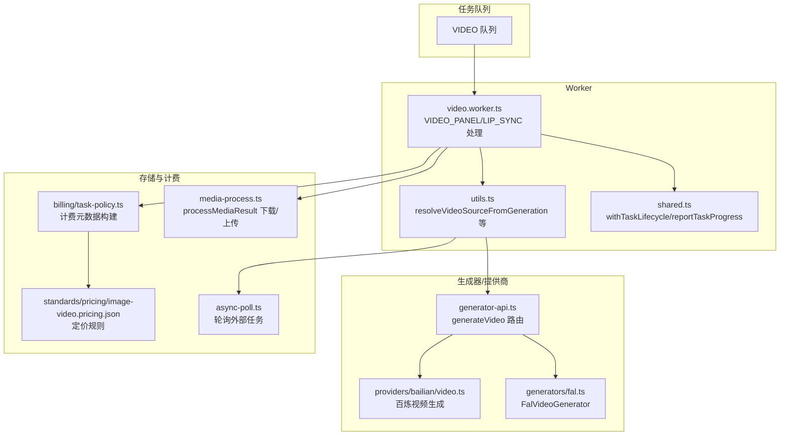
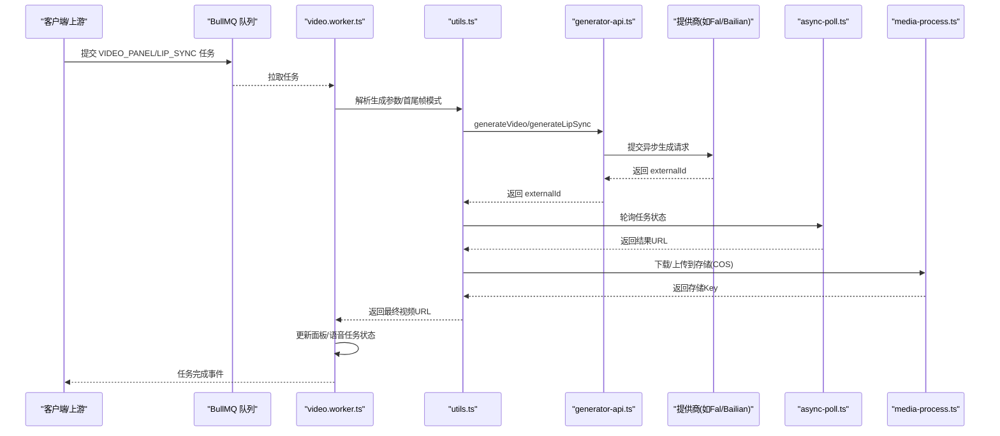
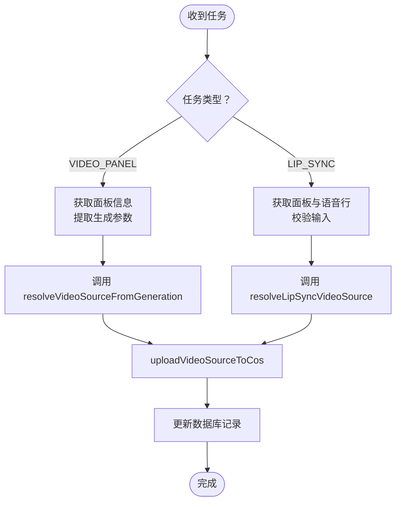
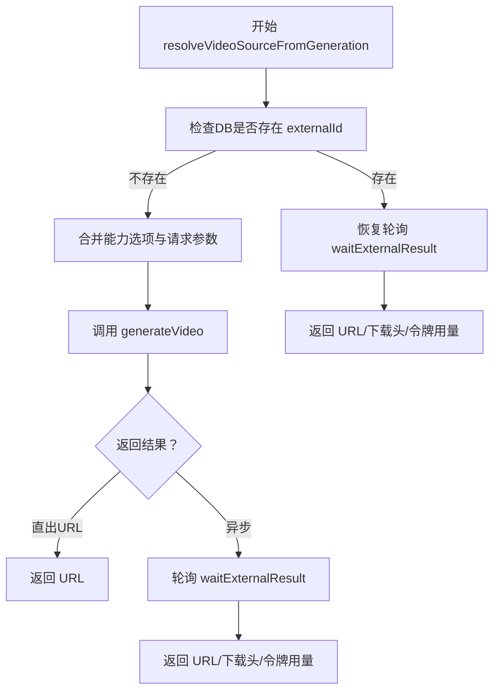
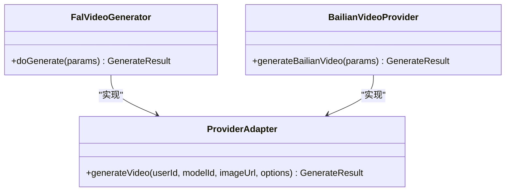
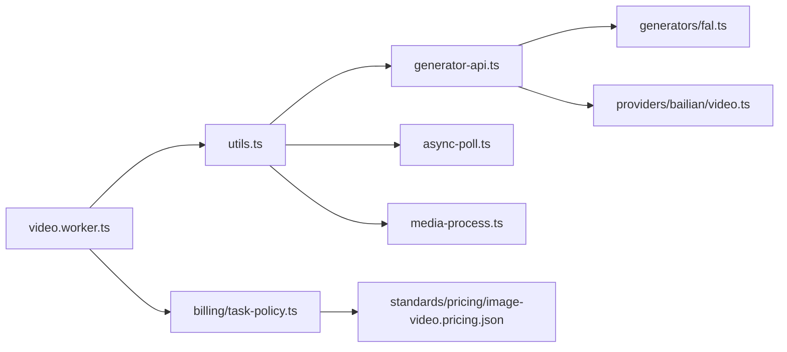

# 视频合成Worker

<cite>
**本文档引用的文件**
- [src/lib/workers/video.worker.ts](file://src/lib/workers/video.worker.ts)
- [src/lib/workers/utils.ts](file://src/lib/workers/utils.ts)
- [src/lib/workers/shared.ts](file://src/lib/workers/shared.ts)
- [src/lib/media-process.ts](file://src/lib/media-process.ts)
- [src/lib/providers/bailian/video.ts](file://src/lib/providers/bailian/video.ts)
- [src/lib/generators/fal.ts](file://src/lib/generators/fal.ts)
- [src/lib/async-poll.ts](file://src/lib/async-poll.ts)
- [src/lib/billing/task-policy.ts](file://src/lib/billing/task-policy.ts)
- [standards/pricing/image-video.pricing.json](file://standards/pricing/image-video.pricing.json)
- [tests/unit/worker/video-worker.test.ts](file://tests/unit/worker/video-worker.test.ts)
</cite>

## 目录
1. [简介](#简介)
2. [项目结构](#项目结构)
3. [核心组件](#核心组件)
4. [架构总览](#架构总览)
5. [详细组件分析](#详细组件分析)
6. [依赖关系分析](#依赖关系分析)
7. [性能考量](#性能考量)
8. [故障排查指南](#故障排查指南)
9. [结论](#结论)
10. [附录](#附录)

## 简介
本文件面向Waoowaoo平台的视频合成Worker，系统性阐述其核心功能与实现机制，覆盖从分镜到视频的完整转换流程、视频合成技术实现（图像序列、音频轨道、字幕等元素整合）、支持的视频生成模型与服务提供商（Fal AI、百炼AI等）、视频生成参数详解（分辨率、帧率、时长等）、质量控制与格式转换导出、以及实际任务示例与错误处理/重试机制。

## 项目结构
视频合成Worker位于应用的“workers”层，围绕任务队列进行异步处理，并通过工具模块与生成器/提供商适配层协作，最终将结果持久化至存储并更新任务状态。

图表来源
- [src/lib/workers/video.worker.ts:293-323](file://src/lib/workers/video.worker.ts#L293-L323)
- [src/lib/workers/utils.ts:408-534](file://src/lib/workers/utils.ts#L408-L534)
- [src/lib/workers/shared.ts:319-646](file://src/lib/workers/shared.ts#L319-L646)
- [src/lib/media-process.ts:32-57](file://src/lib/media-process.ts#L32-L57)
- [src/lib/providers/bailian/video.ts:192-227](file://src/lib/providers/bailian/video.ts#L192-L227)
- [src/lib/generators/fal.ts:196-308](file://src/lib/generators/fal.ts#L196-L308)
- [src/lib/async-poll.ts:1038-1067](file://src/lib/async-poll.ts#L1038-L1067)
- [src/lib/billing/task-policy.ts:152-181](file://src/lib/billing/task-policy.ts#L152-L181)
- [standards/pricing/image-video.pricing.json:4400-4455](file://standards/pricing/image-video.pricing.json#L4400-L4455)

章节来源
- [src/lib/workers/video.worker.ts:1-324](file://src/lib/workers/video.worker.ts#L1-L324)
- [src/lib/workers/utils.ts:1-708](file://src/lib/workers/utils.ts#L1-L708)
- [src/lib/workers/shared.ts:1-731](file://src/lib/workers/shared.ts#L1-L731)

## 核心组件
- 视频Worker：负责接收VIDEO队列任务，按类型分派到面板视频生成或唇同步处理，执行进度上报与生命周期管理。
- 工具集：封装外部任务轮询、媒体下载上传、首尾帧模式处理、签名URL转换等通用能力。
- 生成器/提供商：对Fal AI、百炼等视频生成服务进行统一封装，支持异步任务与标准外键标识。
- 计费与定价：根据模型、分辨率、时长、生成模式等构建计费元数据，并匹配定价规则。

章节来源
- [src/lib/workers/video.worker.ts:293-323](file://src/lib/workers/video.worker.ts#L293-L323)
- [src/lib/workers/utils.ts:408-534](file://src/lib/workers/utils.ts#L408-L534)
- [src/lib/providers/bailian/video.ts:192-227](file://src/lib/providers/bailian/video.ts#L192-L227)
- [src/lib/generators/fal.ts:196-308](file://src/lib/generators/fal.ts#L196-L308)
- [src/lib/billing/task-policy.ts:152-181](file://src/lib/billing/task-policy.ts#L152-L181)

## 架构总览
视频合成Worker采用“任务驱动 + 异步轮询 + 统一存储”的架构，确保跨提供商的一致体验与可扩展性。

图表来源
- [src/lib/workers/video.worker.ts:183-222](file://src/lib/workers/video.worker.ts#L183-L222)
- [src/lib/workers/utils.ts:408-534](file://src/lib/workers/utils.ts#L408-L534)
- [src/lib/async-poll.ts:1038-1067](file://src/lib/async-poll.ts#L1038-L1067)
- [src/lib/media-process.ts:32-57](file://src/lib/media-process.ts#L32-L57)

## 详细组件分析

### 视频Worker：任务分派与生命周期
- 支持的任务类型：VIDEO_PANEL（面板视频生成）、LIP_SYNC（唇同步）。
- 生命周期：withTaskLifecycle负责标记处理中、发布进度/生命周期事件、结算计费、标记完成或失败。
- 并发控制：按用户工作流并发限制执行，避免资源争用。
- 进度上报：reportTaskProgress按阶段上报百分比进度，确保可观测性。

图表来源
- [src/lib/workers/video.worker.ts:293-323](file://src/lib/workers/video.worker.ts#L293-L323)
- [src/lib/workers/shared.ts:319-646](file://src/lib/workers/shared.ts#L319-L646)

章节来源
- [src/lib/workers/video.worker.ts:183-222](file://src/lib/workers/video.worker.ts#L183-L222)
- [src/lib/workers/shared.ts:319-646](file://src/lib/workers/shared.ts#L319-L646)

### 视频生成工具：参数解析与外部轮询
- 参数提取：从任务负载中抽取generationOptions，过滤无效字段，合并项目级能力配置。
- 首尾帧模式：当启用firstlastframe时，校验模型支持情况并加载末帧图像，用于更自然的过渡。
- 外部轮询：waitExternalResult统一处理外部任务轮询，支持超时、进度映射、错误重试标记。
- 下载头透传：针对特定提供商（如Google）自动注入下载头，保证安全访问。

图表来源
- [src/lib/workers/utils.ts:408-534](file://src/lib/workers/utils.ts#L408-L534)

章节来源
- [src/lib/workers/utils.ts:408-534](file://src/lib/workers/utils.ts#L408-L534)

### 生成器与提供商适配
- Fal AI：支持Wan 2.6、Veo 3.1、Sora 2、Kling系列等视频模型；按模型差异构造请求体，统一返回标准externalId。
- 百炼AI：支持视频合成与首尾帧图像到视频两种模式；严格校验选项与模型能力，返回DashScope异步任务ID。

图表来源
- [src/lib/generators/fal.ts:196-308](file://src/lib/generators/fal.ts#L196-L308)
- [src/lib/providers/bailian/video.ts:192-227](file://src/lib/providers/bailian/video.ts#L192-L227)

章节来源
- [src/lib/generators/fal.ts:196-308](file://src/lib/generators/fal.ts#L196-L308)
- [src/lib/providers/bailian/video.ts:192-227](file://src/lib/providers/bailian/video.ts#L192-L227)

### 唇同步处理
- 输入：已生成的基础视频与对应语音音频。
- 流程：签名URL转换 -> 提交唇同步任务 -> 轮询 -> 导出到存储 -> 清理任务ID并更新面板记录。
- 时长对齐：根据面板时长与语音时长进行对齐处理，确保输出质量。

章节来源
- [src/lib/workers/video.worker.ts:224-291](file://src/lib/workers/video.worker.ts#L224-L291)
- [src/lib/workers/utils.ts:536-610](file://src/lib/workers/utils.ts#L536-L610)

### 计费与定价
- 计费元数据：从任务负载提取模型、分辨率、时长、宽高比、生成模式、是否生成音频等，构建TaskBillingInfo。
- 定价规则：基于分辨率、时长、生成模式与音频开关计算费用，支持firstlastframe与normal两种模式的差异化定价。

章节来源
- [src/lib/billing/task-policy.ts:152-181](file://src/lib/billing/task-policy.ts#L152-L181)
- [standards/pricing/image-video.pricing.json:4400-4455](file://standards/pricing/image-video.pricing.json#L4400-L4455)

## 依赖关系分析
- Worker依赖工具集完成参数解析、外部轮询与存储处理。
- 工具集依赖生成器API路由，后者再分发到具体提供商实现。
- 计费模块依赖定价标准与任务元数据，贯穿任务生命周期。

图表来源
- [src/lib/workers/video.worker.ts:1-324](file://src/lib/workers/video.worker.ts#L1-L324)
- [src/lib/workers/utils.ts:1-708](file://src/lib/workers/utils.ts#L1-L708)
- [src/lib/providers/bailian/video.ts:1-227](file://src/lib/providers/bailian/video.ts#L1-L227)
- [src/lib/generators/fal.ts:1-315](file://src/lib/generators/fal.ts#L1-L315)
- [src/lib/async-poll.ts:1038-1067](file://src/lib/async-poll.ts#L1038-L1067)
- [src/lib/billing/task-policy.ts:152-181](file://src/lib/billing/task-policy.ts#L152-L181)
- [standards/pricing/image-video.pricing.json:4400-4455](file://standards/pricing/image-video.pricing.json#L4400-L4455)
- [src/lib/media-process.ts:1-58](file://src/lib/media-process.ts#L1-L58)

## 性能考量
- 并发限制：按用户维度限制视频工作流并发，避免资源过载。
- 轮询策略：统一的轮询间隔与超时时间，结合进度映射提升用户体验。
- 存储优化：对视频采用下载-上传链路，减少中间态体积；对图片/音频采用直接上传或data URL转存。
- 错误退避：内置指数退避与最大重试次数，降低抖动影响。

## 故障排查指南
- 常见错误
  - 缺少模型或参数：如VIDEO_MODEL_REQUIRED、VIDU/BAIlian选项非法。
  - 外部任务失败：EXTERNAL_ERROR，检查提供商返回码与网络连通性。
  - 轮询超时：GENERATION_TIMEOUT，适当增加超时或调整并发。
- 重试机制
  - 任务失败时根据shouldRetryInQueue判断是否重试，支持指数退避。
  - 服务重启后可通过DB中的externalId恢复轮询，避免重复提交。
- 日志与追踪
  - 使用scoped日志与trace上下文，定位问题根因。
  - 发布生命周期事件与进度事件，便于前端与监控系统观测。

章节来源
- [src/lib/workers/shared.ts:467-646](file://src/lib/workers/shared.ts#L467-L646)
- [src/lib/workers/utils.ts:86-166](file://src/lib/workers/utils.ts#L86-L166)
- [tests/unit/worker/video-worker.test.ts:153-206](file://tests/unit/worker/video-worker.test.ts#L153-L206)

## 结论
视频合成Worker以任务为中心，通过统一的参数解析、外部轮询与存储处理，实现了对Fal AI、百炼AI等多家提供商的无缝集成。配合完善的计费与定价体系、可观测的生命周期管理与健壮的错误处理/重试机制，保障了从分镜到视频的高质量交付与稳定运行。

## 附录

### 视频生成参数说明
- 关键参数
  - 模型：videoModel/modelId，决定具体视频生成模型与能力。
  - 分辨率：resolution（如720p/1080p），影响质量与计费。
  - 时长：duration（秒），部分模型要求整数且在允许范围内。
  - 帧率：fps（部分模型支持），通常由提供商默认值或模型能力决定。
  - 宽高比：aspectRatio（如16:9），影响输出画幅。
  - 生成音频：generateAudio（布尔），部分模型支持自动生成音频轨道。
  - 首尾帧模式：firstLastFrame（对象），包含首帧/末帧图像与可选自定义提示词，仅部分模型支持。
- 项目级配置
  - 项目视频比例：projectModels.videoRatio，可作为默认宽高比来源。
- 能力与约束
  - 不同提供商/模型对分辨率、时长、音频生成的支持不同，需结合能力查询与请求选项合并。

章节来源
- [src/lib/workers/video.worker.ts:80-181](file://src/lib/workers/video.worker.ts#L80-L181)
- [src/lib/workers/utils.ts:408-534](file://src/lib/workers/utils.ts#L408-L534)
- [src/lib/providers/bailian/video.ts:107-176](file://src/lib/providers/bailian/video.ts#L107-L176)
- [src/lib/generators/fal.ts:215-289](file://src/lib/generators/fal.ts#L215-L289)

### 实际任务示例与最佳实践
- 示例场景
  - 面板视频生成：指定videoModel与generationOptions（分辨率、时长、宽高比），等待轮询完成并上传到存储。
  - 唇同步：在已有基础视频与语音音频基础上，提交唇同步任务并更新面板记录。
- 最佳实践
  - 明确首尾帧模型能力，必要时提供末帧图像以获得更自然过渡。
  - 控制并发与重试，避免外部提供商限流。
  - 使用带externalId的恢复轮询，服务重启不丢失进度。

章节来源
- [tests/unit/worker/video-worker.test.ts:165-225](file://tests/unit/worker/video-worker.test.ts#L165-L225)
- [src/lib/workers/video.worker.ts:183-222](file://src/lib/workers/video.worker.ts#L183-L222)