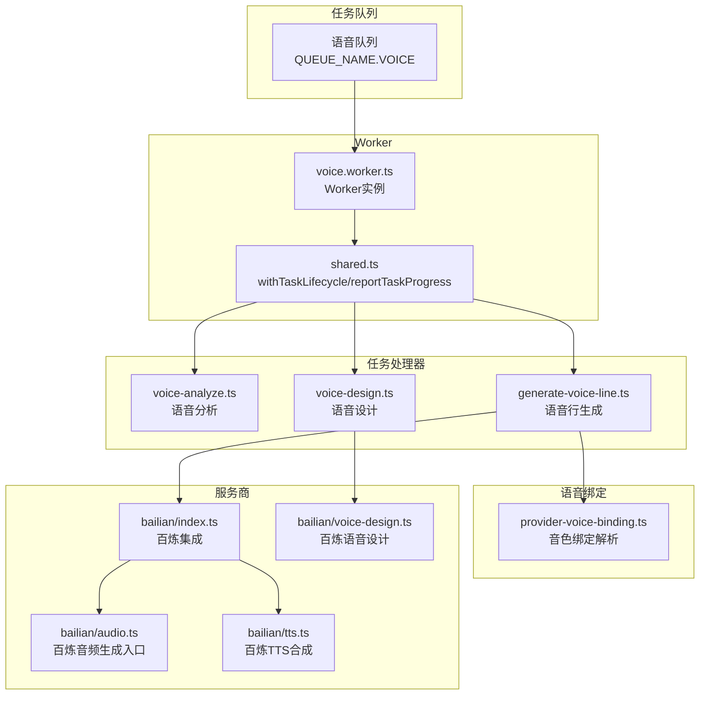
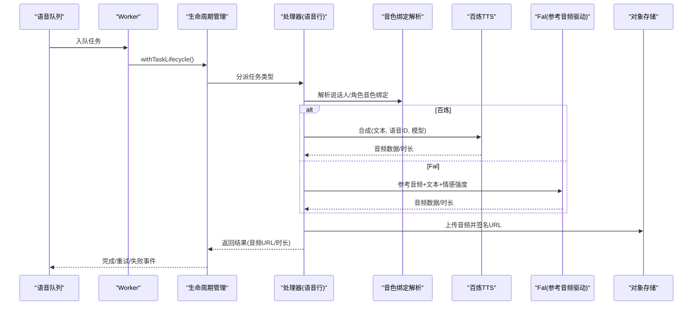
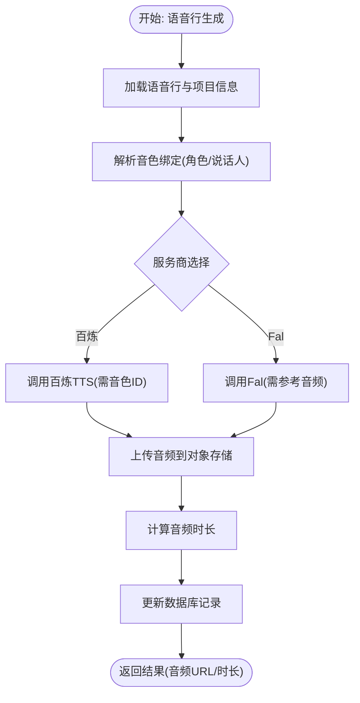
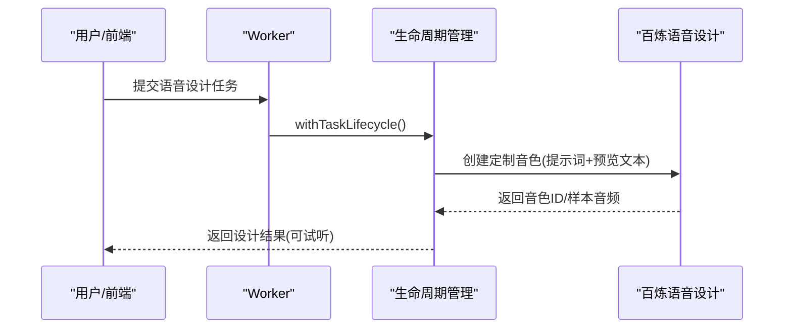
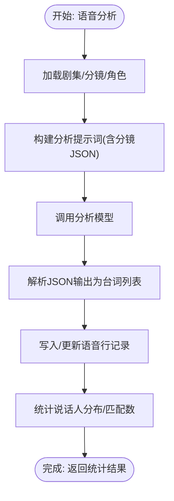
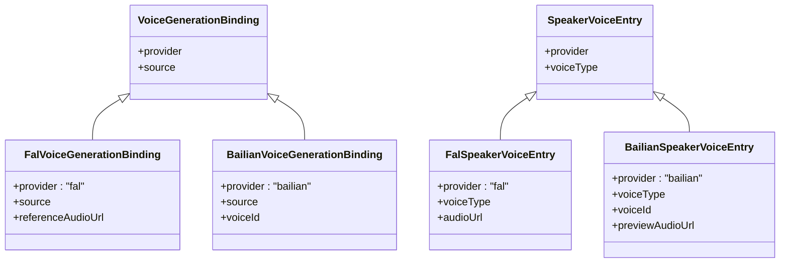
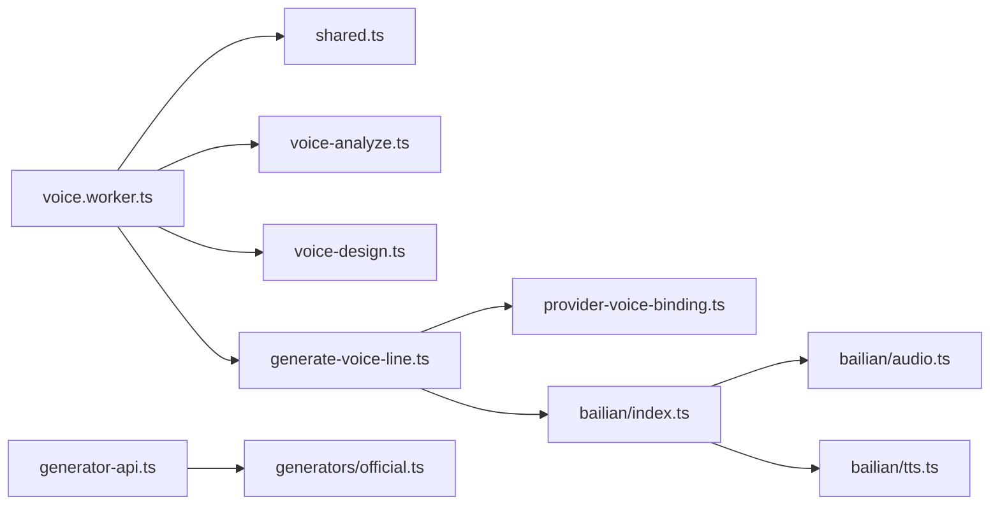

# 音频处理Worker

<cite>
**本文档引用的文件**
- [src/lib/workers/voice.worker.ts](file://src/lib/workers/voice.worker.ts)
- [src/lib/voice/generate-voice-line.ts](file://src/lib/voice/generate-voice-line.ts)
- [src/lib/workers/handlers/voice-analyze.ts](file://src/lib/workers/handlers/voice-analyze.ts)
- [src/lib/workers/handlers/voice-design.ts](file://src/lib/workers/handlers/voice-design.ts)
- [src/lib/voice/provider-voice-binding.ts](file://src/lib/voice/provider-voice-binding.ts)
- [src/lib/providers/bailian/voice-design.ts](file://src/lib/providers/bailian/voice-design.ts)
- [src/lib/workers/shared.ts](file://src/lib/workers/shared.ts)
- [src/lib/generators/official.ts](file://src/lib/generators/official.ts)
- [src/lib/generator-api.ts](file://src/lib/generator-api.ts)
- [src/lib/providers/bailian/index.ts](file://src/lib/providers/bailian/index.ts)
- [src/lib/providers/bailian/audio.ts](file://src/lib/providers/bailian/audio.ts)
- [src/lib/providers/bailian/tts.ts](file://src/lib/providers/bailian/tts.ts)
- [src/lib/api-config.ts](file://src/lib/api-config.ts)
- [src/lib/workers/handlers/voice-analyze-helpers.ts](file://src/lib/workers/handlers/voice-analyze-helpers.ts)
</cite>

## 目录
1. [简介](#简介)
2. [项目结构](#项目结构)
3. [核心组件](#核心组件)
4. [架构总览](#架构总览)
5. [详细组件分析](#详细组件分析)
6. [依赖关系分析](#依赖关系分析)
7. [性能考量](#性能考量)
8. [故障排查指南](#故障排查指南)
9. [结论](#结论)
10. [附录](#附录)

## 简介
本文件面向Waoowaoo平台的音频处理Worker，系统性阐述其在小说推广场景中的语音生成能力与实现机制。重点覆盖以下方面：
- 语音生成任务的完整处理流程，含文本转语音（TTS）与参考音频驱动的风格迁移合成
- 支持的服务商与模型：百炼（阿里云DashScope）与Fal（IndexTTS2），以及官方适配器路由
- 语音合成参数配置：音色绑定、情感强度、语速等
- 质量控制与优化策略：时长估算、错误归一化、重试与账单结算
- 语音设计、音色绑定与语音分析的实现细节
- 实际示例与多语言支持、情感表达
- 错误处理与性能监控方案

## 项目结构
音频处理Worker位于后端任务队列体系中，围绕“语音行生成”“语音设计”“语音分析”三大任务类型展开，并通过统一的生命周期管理与进度上报机制保障稳定性。

图表来源
- [src/lib/workers/voice.worker.ts:54-63](file://src/lib/workers/voice.worker.ts#L54-L63)
- [src/lib/workers/shared.ts:319-646](file://src/lib/workers/shared.ts#L319-L646)
- [src/lib/workers/handlers/voice-analyze.ts:20-52](file://src/lib/workers/handlers/voice-analyze.ts#L20-L52)
- [src/lib/workers/handlers/voice-design.ts:24-78](file://src/lib/workers/handlers/voice-design.ts#L24-L78)
- [src/lib/voice/generate-voice-line.ts:160-288](file://src/lib/voice/generate-voice-line.ts#L160-L288)
- [src/lib/voice/provider-voice-binding.ts:178-208](file://src/lib/voice/provider-voice-binding.ts#L178-L208)
- [src/lib/providers/bailian/index.ts:1-38](file://src/lib/providers/bailian/index.ts#L1-L38)
- [src/lib/providers/bailian/voice-design.ts:23-104](file://src/lib/providers/bailian/voice-design.ts#L23-L104)
- [src/lib/providers/bailian/audio.ts:32-41](file://src/lib/providers/bailian/audio.ts#L32-L41)
- [src/lib/providers/bailian/tts.ts](file://src/lib/providers/bailian/tts.ts)

章节来源
- [src/lib/workers/voice.worker.ts:1-64](file://src/lib/workers/voice.worker.ts#L1-L64)
- [src/lib/workers/shared.ts:319-646](file://src/lib/workers/shared.ts#L319-L646)

## 核心组件
- 语音Worker：负责接收语音类任务，按类型分派到对应处理器，并通过统一生命周期管理上报进度、处理重试与账单结算。
- 语音行生成：根据项目角色与说话人音色绑定，选择百炼或Fal进行TTS合成；Fal需参考音频，百炼需音色ID。
- 语音设计：基于提示词与预览文本生成定制音色，返回可试听的音频样本。
- 语音分析：对小说文本与分镜面板进行AI分析，抽取台词、说话人、情感强度并匹配画面。
- 统一API路由：根据用户配置与模型键，将音频生成请求路由至百炼或SiliconFlow等官方适配器。

章节来源
- [src/lib/workers/voice.worker.ts:11-52](file://src/lib/workers/voice.worker.ts#L11-L52)
- [src/lib/voice/generate-voice-line.ts:160-288](file://src/lib/voice/generate-voice-line.ts#L160-L288)
- [src/lib/workers/handlers/voice-design.ts:24-78](file://src/lib/workers/handlers/voice-design.ts#L24-L78)
- [src/lib/workers/handlers/voice-analyze.ts:20-52](file://src/lib/workers/handlers/voice-analyze.ts#L20-L52)
- [src/lib/generators/official.ts:89-127](file://src/lib/generators/official.ts#L89-L127)
- [src/lib/generator-api.ts:321-371](file://src/lib/generator-api.ts#L321-L371)

## 架构总览
下图展示了从任务入队到语音生成完成的关键交互链路，包括音色绑定解析、服务商调用与存储落盘。

图表来源
- [src/lib/workers/voice.worker.ts:40-52](file://src/lib/workers/voice.worker.ts#L40-L52)
- [src/lib/workers/shared.ts:319-646](file://src/lib/workers/shared.ts#L319-L646)
- [src/lib/voice/generate-voice-line.ts:215-288](file://src/lib/voice/generate-voice-line.ts#L215-L288)
- [src/lib/voice/provider-voice-binding.ts:178-208](file://src/lib/voice/provider-voice-binding.ts#L178-L208)
- [src/lib/providers/bailian/tts.ts](file://src/lib/providers/bailian/tts.ts)

## 详细组件分析

### 语音行生成（TTS流水线）
语音行生成是音频Worker的核心执行单元，负责：
- 读取语音行数据（说话人、内容、情感提示与强度）
- 解析项目与剧集的音色绑定
- 依据服务商选择不同的合成路径
- 计算音频时长、上传对象存储并生成可访问URL
- 写回数据库并返回任务结果

图表来源
- [src/lib/voice/generate-voice-line.ts:160-288](file://src/lib/voice/generate-voice-line.ts#L160-L288)
- [src/lib/voice/provider-voice-binding.ts:178-208](file://src/lib/voice/provider-voice-binding.ts#L178-L208)

章节来源
- [src/lib/voice/generate-voice-line.ts:160-288](file://src/lib/voice/generate-voice-line.ts#L160-L288)

### 语音设计（AI音色定制）
语音设计通过百炼的语音定制服务，基于提示词与预览文本生成定制音色，并返回可试听音频样本。该能力用于后续语音行生成的音色绑定。

图表来源
- [src/lib/workers/handlers/voice-design.ts:24-78](file://src/lib/workers/handlers/voice-design.ts#L24-L78)
- [src/lib/providers/bailian/voice-design.ts:23-104](file://src/lib/providers/bailian/voice-design.ts#L23-L104)

章节来源
- [src/lib/workers/handlers/voice-design.ts:24-78](file://src/lib/workers/handlers/voice-design.ts#L24-L78)
- [src/lib/providers/bailian/voice-design.ts:23-104](file://src/lib/providers/bailian/voice-design.ts#L23-L104)

### 语音分析（台词抽取与匹配）
语音分析利用AI对小说文本与分镜面板进行分析，抽取台词列表、说话人、情感强度，并尝试匹配到具体分镜面板，为后续语音行生成提供结构化输入。

图表来源
- [src/lib/workers/handlers/voice-analyze.ts:20-345](file://src/lib/workers/handlers/voice-analyze.ts#L20-L345)
- [src/lib/workers/handlers/voice-analyze-helpers.ts:49-94](file://src/lib/workers/handlers/voice-analyze-helpers.ts#L49-L94)

章节来源
- [src/lib/workers/handlers/voice-analyze.ts:20-345](file://src/lib/workers/handlers/voice-analyze.ts#L20-L345)
- [src/lib/workers/handlers/voice-analyze-helpers.ts:1-95](file://src/lib/workers/handlers/voice-analyze-helpers.ts#L1-L95)

### 音色绑定与参数配置
音色绑定模块负责将“角色自定义音色”与“说话人音色映射”解析为具体的生成参数，支持百炼与Fal两种服务商：
- 百炼：需要voiceId（由语音设计或项目维护）
- Fal：需要referenceAudioUrl（参考音频）

图表来源
- [src/lib/voice/provider-voice-binding.ts:34-46](file://src/lib/voice/provider-voice-binding.ts#L34-L46)
- [src/lib/voice/provider-voice-binding.ts:18-32](file://src/lib/voice/provider-voice-binding.ts#L18-L32)

章节来源
- [src/lib/voice/provider-voice-binding.ts:178-208](file://src/lib/voice/provider-voice-binding.ts#L178-L208)

### 服务商与模型支持
- 百炼（阿里云DashScope）
  - 语音设计：qwen-voice-design
  - TTS合成：qwen3-tts-vd-2026-01-26 等
  - 音频生成入口：generateBailianAudio
  - TTS合成：synthesizeWithBailianTTS
- Fal
  - 参考音频驱动的IndexTTS2：fal-ai/index-tts-2/text-to-speech
- SiliconFlow
  - 当前音频生成未实现，会抛出不支持错误

章节来源
- [src/lib/generators/official.ts:89-127](file://src/lib/generators/official.ts#L89-L127)
- [src/lib/generator-api.ts:321-371](file://src/lib/generator-api.ts#L321-L371)
- [src/lib/providers/bailian/audio.ts:32-41](file://src/lib/providers/bailian/audio.ts#L32-L41)
- [src/lib/providers/bailian/tts.ts](file://src/lib/providers/bailian/tts.ts)
- [src/lib/providers/siliconflow/audio.ts:25-28](file://src/lib/providers/siliconflow/audio.ts#L25-L28)

### 参数配置与质量控制
- 文本转语音参数
  - 文本：必填，不能为空
  - 语速/速率：可选，部分服务商支持
  - 音色：百炼需voiceId；Fal需referenceAudioUrl
  - 情感强度：语音行支持emotionStrength，用于Fal合成
- 质量控制
  - 时长估算：基于WAV字节率与数据块大小计算
  - 错误归一化：针对百炼TTS错误码进行中文提示映射
  - 重试策略：指数退避或固定延迟，受队列backoff配置影响
  - 账单结算：任务完成后按文本用量结算，失败时回滚

章节来源
- [src/lib/voice/generate-voice-line.ts:19-32](file://src/lib/voice/generate-voice-line.ts#L19-L32)
- [src/lib/voice/generate-voice-line.ts:34-65](file://src/lib/voice/generate-voice-line.ts#L34-L65)
- [src/lib/workers/shared.ts:240-279](file://src/lib/workers/shared.ts#L240-L279)
- [src/lib/workers/shared.ts:414-426](file://src/lib/workers/shared.ts#L414-L426)

## 依赖关系分析
- Worker与处理器
  - voice.worker.ts依赖shared.ts的生命周期管理与进度上报
  - 处理器内部通过Prisma读取项目/剧集/角色/分镜数据
- 语音行生成与音色绑定
  - generate-voice-line.ts依赖provider-voice-binding.ts解析绑定
  - 百炼路径依赖bailian/tts.ts与bailian/audio.ts
- API路由
  - generator-api.ts根据模型键与提供商路由到官方适配器
  - official.ts封装百炼与SiliconFlow的音频生成器

图表来源
- [src/lib/workers/voice.worker.ts:1-64](file://src/lib/workers/voice.worker.ts#L1-L64)
- [src/lib/workers/shared.ts:319-646](file://src/lib/workers/shared.ts#L319-L646)
- [src/lib/voice/generate-voice-line.ts:1-14](file://src/lib/voice/generate-voice-line.ts#L1-L14)
- [src/lib/voice/provider-voice-binding.ts:1-14](file://src/lib/voice/provider-voice-binding.ts#L1-L14)
- [src/lib/providers/bailian/index.ts:1-38](file://src/lib/providers/bailian/index.ts#L1-L38)
- [src/lib/providers/bailian/audio.ts:1-41](file://src/lib/providers/bailian/audio.ts#L1-L41)
- [src/lib/providers/bailian/tts.ts](file://src/lib/providers/bailian/tts.ts)
- [src/lib/generators/official.ts:1-127](file://src/lib/generators/official.ts#L1-L127)
- [src/lib/generator-api.ts:321-371](file://src/lib/generator-api.ts#L321-L371)

章节来源
- [src/lib/workers/voice.worker.ts:1-64](file://src/lib/workers/voice.worker.ts#L1-L64)
- [src/lib/generators/official.ts:89-127](file://src/lib/generators/official.ts#L89-L127)
- [src/lib/generator-api.ts:321-371](file://src/lib/generator-api.ts#L321-L371)

## 性能考量
- 并发度：Worker并发由环境变量控制，默认10，可根据资源与服务商限流调整
- 重试与退避：根据队列backoff策略进行指数或固定延迟重试，避免瞬时抖动放大
- 时长估算：WAV格式下通过字节率与数据块大小估算时长，兜底采用简单比特率估算
- 存储与签名：生成音频上传后返回短期可访问URL，降低前端直传复杂度
- 文本用量：统一收集文本用量并参与账单结算，便于成本控制

章节来源
- [src/lib/workers/voice.worker.ts:58-62](file://src/lib/workers/voice.worker.ts#L58-L62)
- [src/lib/workers/shared.ts:240-279](file://src/lib/workers/shared.ts#L240-L279)
- [src/lib/voice/generate-voice-line.ts:34-65](file://src/lib/voice/generate-voice-line.ts#L34-L65)

## 故障排查指南
- 常见错误与定位
  - 缺少lineId/episodeId：检查任务载荷字段是否正确
  - 未绑定音色：Fal需referenceAudioUrl；百炼需voiceId
  - 百炼TTS错误：根据错误码映射为中文提示，优先确认voiceId与模型可用性
  - 语音分析失败：检查LLM响应结构与分镜面板匹配
- 生命周期日志
  - 使用withTaskLifecycle捕获开始、进度、完成、失败与重试事件，结合任务ID与traceID定位问题
- 重试策略
  - 根据shouldRetryInQueue判断是否可重试，查看失败次数与下次退避时间
- 账单与回滚
  - 成功后结算，失败或终止时回滚，确保计费一致性

章节来源
- [src/lib/workers/voice.worker.ts:18-23](file://src/lib/workers/voice.worker.ts#L18-L23)
- [src/lib/voice/generate-voice-line.ts:19-32](file://src/lib/voice/generate-voice-line.ts#L19-L32)
- [src/lib/workers/handlers/voice-analyze.ts:134-230](file://src/lib/workers/handlers/voice-analyze.ts#L134-L230)
- [src/lib/workers/shared.ts:467-646](file://src/lib/workers/shared.ts#L467-L646)

## 结论
Waoowaoo的音频处理Worker以统一的任务生命周期管理为核心，围绕“语音行生成”“语音设计”“语音分析”三大能力，实现了从文本到语音的自动化流水线。通过百炼与Fal双通道支持，既能满足定制音色需求，也能实现参考音频驱动的风格迁移合成。配合完善的错误归一化、重试与账单结算机制，保障了生产环境的稳定性与可观测性。

## 附录

### 实际示例与最佳实践
- 多语言支持
  - 百炼语音设计支持中文/英文，预览文本长度限制与提示词长度限制需遵守
- 情感表达
  - 语音行支持emotionStrength与emotionPrompt，Fal路径可直接传递情感提示与强度
- 音色绑定
  - 建议优先使用“语音设计”生成的定制音色，再在项目或说话人维度绑定voiceId
- 时长估算
  - 使用estimateVoiceLineMaxSeconds进行粗略估算，实际以生成音频为准

章节来源
- [src/lib/providers/bailian/voice-design.ts:106-127](file://src/lib/providers/bailian/voice-design.ts#L106-L127)
- [src/lib/voice/generate-voice-line.ts:290-293](file://src/lib/voice/generate-voice-line.ts#L290-L293)
- [src/lib/voice/generate-voice-line.ts:234-236](file://src/lib/voice/generate-voice-line.ts#L234-L236)