# AI提示词处理器

<cite>
**本文档引用的文件**
- [shot-ai-prompt.ts](file://src/lib/workers/handlers/shot-ai-prompt.ts)
- [shot-ai-prompt-appearance.ts](file://src/lib/workers/handlers/shot-ai-prompt-appearance.ts)
- [shot-ai-prompt-location.ts](file://src/lib/workers/handlers/shot-ai-prompt-location.ts)
- [shot-ai-prompt-prop.ts](file://src/lib/workers/handlers/shot-ai-prompt-prop.ts)
- [shot-ai-prompt-shot.ts](file://src/lib/workers/handlers/shot-ai-prompt-shot.ts)
- [shot-ai-prompt-utils.ts](file://src/lib/workers/handlers/shot-ai-prompt-utils.ts)
- [resolve-analysis-model.ts](file://src/lib/workers/handlers/resolve-analysis-model.ts)
- [shot-ai-tasks.ts](file://src/lib/workers/handlers/shot-ai-tasks.ts)
- [shot-ai-variants.ts](file://src/lib/workers/handlers/shot-ai-variants.ts)
- [shot-ai-persist.ts](file://src/lib/workers/handlers/shot-ai-persist.ts)
</cite>

## 目录
1. [简介](#简介)
2. [项目结构](#项目结构)
3. [核心组件](#核心组件)
4. [架构总览](#架构总览)
5. [详细组件分析](#详细组件分析)
6. [依赖关系分析](#依赖关系分析)
7. [性能考量](#性能考量)
8. [故障排查指南](#故障排查指南)
9. [结论](#结论)
10. [附录](#附录)

## 简介
本文件面向Waoowaoo的“AI提示词处理器”，系统性梳理从任务入口到具体提示词生成与解析的完整链路，重点覆盖以下模块：
- 整体提示词生成流程：shot-ai-prompt.ts 的聚合导出与任务分发
- 角色外观提示词：shot-ai-prompt-appearance.ts
- 场景提示词：shot-ai-prompt-location.ts
- 道具提示词：shot-ai-prompt-prop.ts
- 镜头提示词：shot-ai-prompt-shot.ts
- 工具函数：shot-ai-prompt-utils.ts
- 模型解析：resolve-analysis-model.ts
- 任务调度：shot-ai-tasks.ts
- 变体生成：shot-ai-variants.ts
- 数据持久化：shot-ai-persist.ts

目标是帮助开发者与产品人员理解AI提示词生成的智能决策机制、上下文理解与创造性生成能力，并提供优化策略与最佳实践。

## 项目结构
AI提示词处理器位于workers/handlers目录下，采用按职责拆分的模块化设计：
- 入口与聚合：shot-ai-prompt.ts 聚合各子任务处理函数
- 任务调度器：shot-ai-tasks.ts 根据任务类型分发至对应处理器
- 业务处理器：角色/场景/道具/镜头提示词生成与解析
- 工具层：shot-ai-prompt-utils.ts 提供通用解析与校验
- 模型解析：resolve-analysis-model.ts 统一解析分析模型
- 变体分析：shot-ai-variants.ts 基于视觉模型进行镜头变体建议
- 持久化：shot-ai-persist.ts 提供项目级模型解析与数据写入

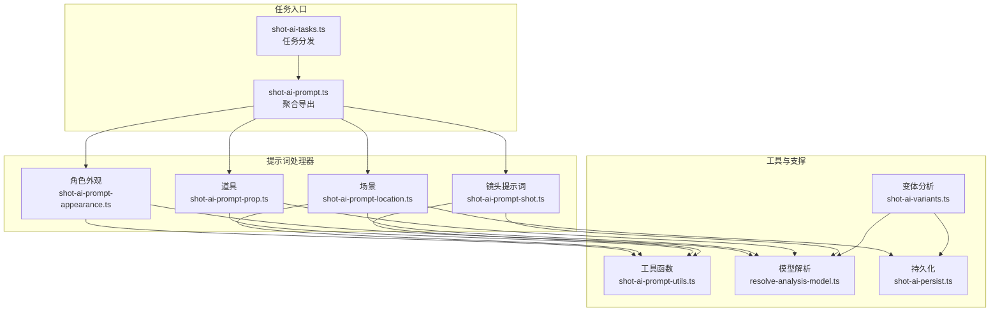

图表来源
- [shot-ai-tasks.ts:12-28](file://src/lib/workers/handlers/shot-ai-tasks.ts#L12-L28)
- [shot-ai-prompt.ts:1-6](file://src/lib/workers/handlers/shot-ai-prompt.ts#L1-L6)
- [shot-ai-prompt-appearance.ts:11-61](file://src/lib/workers/handlers/shot-ai-prompt-appearance.ts#L11-L61)
- [shot-ai-prompt-location.ts:16-80](file://src/lib/workers/handlers/shot-ai-prompt-location.ts#L16-L80)
- [shot-ai-prompt-prop.ts:11-65](file://src/lib/workers/handlers/shot-ai-prompt-prop.ts#L11-L65)
- [shot-ai-prompt-shot.ts:15-78](file://src/lib/workers/handlers/shot-ai-prompt-shot.ts#L15-L78)
- [shot-ai-prompt-utils.ts:17-43](file://src/lib/workers/handlers/shot-ai-prompt-utils.ts#L17-L43)
- [resolve-analysis-model.ts:19-34](file://src/lib/workers/handlers/resolve-analysis-model.ts#L19-L34)
- [shot-ai-variants.ts:52-145](file://src/lib/workers/handlers/shot-ai-variants.ts#L52-L145)
- [shot-ai-persist.ts:14-83](file://src/lib/workers/handlers/shot-ai-persist.ts#L14-L83)

章节来源
- [shot-ai-tasks.ts:12-28](file://src/lib/workers/handlers/shot-ai-tasks.ts#L12-L28)
- [shot-ai-prompt.ts:1-6](file://src/lib/workers/handlers/shot-ai-prompt.ts#L1-L6)

## 核心组件
- 任务分发器：根据任务类型选择对应处理器，统一错误处理与默认分支
- 提示词处理器：分别针对角色外观、场景、道具、镜头提示词进行构建、调用与解析
- 工具函数：提供字符串读取、必填字段校验、JSON安全解析、镜头提示词响应解析
- 模型解析：优先从输入参数、项目配置、用户偏好解析可用的分析模型键
- 变体分析：基于图像与多模态视觉模型生成镜头变体建议
- 持久化：解析项目内模型键、校验位置归属并更新场景描述与可用槽位

章节来源
- [shot-ai-tasks.ts:12-28](file://src/lib/workers/handlers/shot-ai-tasks.ts#L12-L28)
- [shot-ai-prompt-utils.ts:5-43](file://src/lib/workers/handlers/shot-ai-prompt-utils.ts#L5-L43)
- [resolve-analysis-model.ts:19-34](file://src/lib/workers/handlers/resolve-analysis-model.ts#L19-L34)
- [shot-ai-variants.ts:52-145](file://src/lib/workers/handlers/shot-ai-variants.ts#L52-L145)
- [shot-ai-persist.ts:14-83](file://src/lib/workers/handlers/shot-ai-persist.ts#L14-L83)

## 架构总览
整体流程遵循“任务分发 → 上下文构建 → 模型调用 → 结果解析 → 进度上报/持久化”的闭环，强调：
- 明确的阶段化进度上报，便于前端可视化与用户感知
- 统一的模型解析策略，确保不同来源的模型键一致性
- 安全的JSON解析与字段校验，降低异常响应对流程的影响

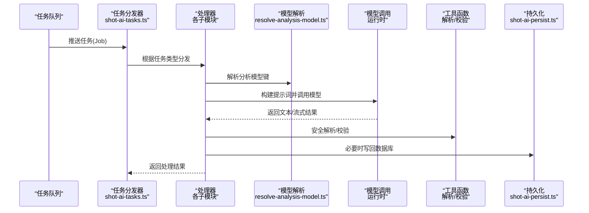

图表来源
- [shot-ai-tasks.ts:12-28](file://src/lib/workers/handlers/shot-ai-tasks.ts#L12-L28)
- [resolve-analysis-model.ts:19-34](file://src/lib/workers/handlers/resolve-analysis-model.ts#L19-L34)
- [shot-ai-prompt-utils.ts:17-43](file://src/lib/workers/handlers/shot-ai-prompt-utils.ts#L17-L43)
- [shot-ai-persist.ts:14-83](file://src/lib/workers/handlers/shot-ai-persist.ts#L14-L83)

## 详细组件分析

### 角色外观提示词（appearance）
- 输入：角色ID、外观ID、当前描述、修改指令
- 流程要点：
  - 使用i18n模板构建最终提示词
  - 去除描述后缀以提升一致性
  - 调用运行时完成提示词生成
  - 安全解析JSON，提取prompt字段作为新描述
- 关键路径
  - 模板变量：角色输入、用户指令
  - 运行时调用：动作标识、流式上下文键
  - 进度上报：准备、解析、完成三阶段
- 输出：成功标志、修改后的描述、原始提示词、原始响应

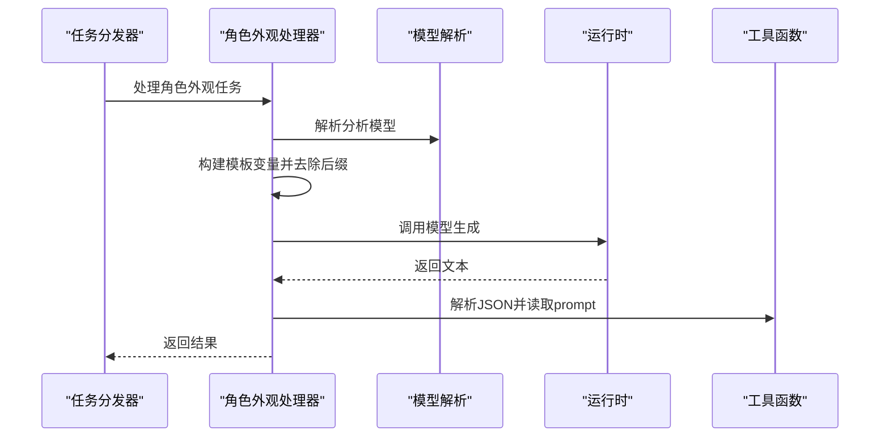

图表来源
- [shot-ai-prompt-appearance.ts:11-61](file://src/lib/workers/handlers/shot-ai-prompt-appearance.ts#L11-L61)
- [resolve-analysis-model.ts:19-34](file://src/lib/workers/handlers/resolve-analysis-model.ts#L19-L34)
- [shot-ai-prompt-utils.ts:17-19](file://src/lib/workers/handlers/shot-ai-prompt-utils.ts#L17-L19)

章节来源
- [shot-ai-prompt-appearance.ts:11-61](file://src/lib/workers/handlers/shot-ai-prompt-appearance.ts#L11-L61)

### 场景提示词（location）
- 输入：场景ID、图像索引、当前描述、修改指令
- 流程要点：
  - 校验场景归属项目
  - 构建模板变量（名称、输入、指令）
  - 调用运行时生成
  - 安全解析JSON，提取prompt与available_slots
  - 写回场景描述与可用槽位
- 关键路径
  - 模板变量：场景名、输入、指令
  - 可用槽位归一化与持久化
  - 进度上报：准备、解析、持久化、完成

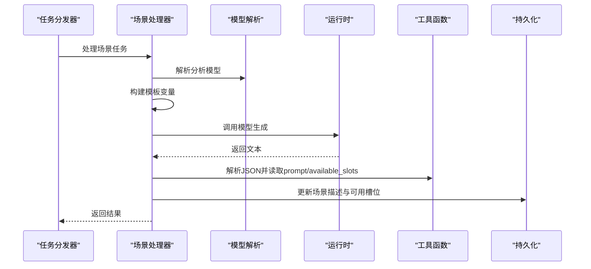

图表来源
- [shot-ai-prompt-location.ts:16-80](file://src/lib/workers/handlers/shot-ai-prompt-location.ts#L16-L80)
- [resolve-analysis-model.ts:19-34](file://src/lib/workers/handlers/resolve-analysis-model.ts#L19-L34)
- [shot-ai-persist.ts:54-83](file://src/lib/workers/handlers/shot-ai-persist.ts#L54-L83)

章节来源
- [shot-ai-prompt-location.ts:16-80](file://src/lib/workers/handlers/shot-ai-prompt-location.ts#L16-L80)

### 道具提示词（prop）
- 输入：道具ID、变体ID、道具名、当前描述、修改指令
- 流程要点：
  - 构建模板变量（名称、原始描述、指令）
  - 去除描述后缀以提升一致性
  - 调用运行时生成
  - 安全解析JSON，提取prompt并再次去后缀
- 关键路径
  - 模板变量：道具名、原始描述、指令
  - 进度上报：准备、解析、完成

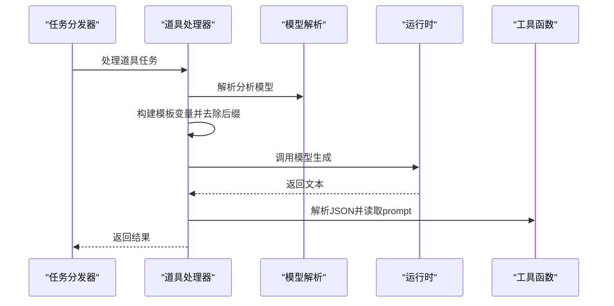

图表来源
- [shot-ai-prompt-prop.ts:11-65](file://src/lib/workers/handlers/shot-ai-prompt-prop.ts#L11-L65)
- [resolve-analysis-model.ts:19-34](file://src/lib/workers/handlers/resolve-analysis-model.ts#L19-L34)
- [shot-ai-prompt-utils.ts:17-19](file://src/lib/workers/handlers/shot-ai-prompt-utils.ts#L17-L19)

章节来源
- [shot-ai-prompt-prop.ts:11-65](file://src/lib/workers/handlers/shot-ai-prompt-prop.ts#L11-L65)

### 镜头提示词（shot）
- 输入：当前图像提示词、可选视频提示词、修改指令、引用资产列表
- 流程要点：
  - 拼接引用资产描述作为上下文增强
  - 构建模板变量（输入、视频输入、指令）
  - 调用运行时生成
  - 使用专用解析器提取image_prompt与video_prompt
- 关键路径
  - 模板变量：图像输入、视频输入、指令
  - 专用解析：兼容多种响应格式
  - 进度上报：准备、解析、完成

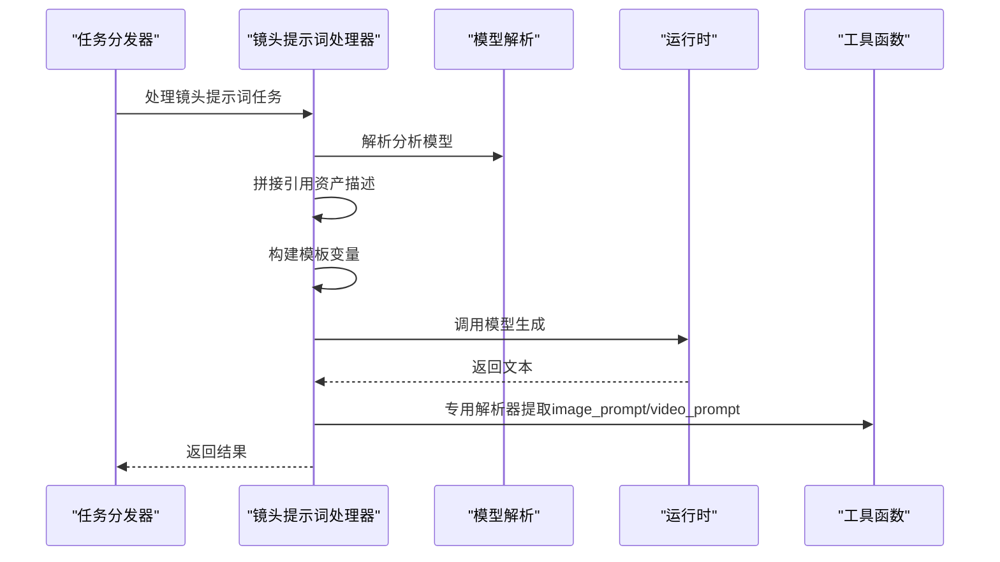

图表来源
- [shot-ai-prompt-shot.ts:15-78](file://src/lib/workers/handlers/shot-ai-prompt-shot.ts#L15-L78)
- [resolve-analysis-model.ts:19-34](file://src/lib/workers/handlers/resolve-analysis-model.ts#L19-L34)
- [shot-ai-prompt-utils.ts:21-43](file://src/lib/workers/handlers/shot-ai-prompt-utils.ts#L21-L43)

章节来源
- [shot-ai-prompt-shot.ts:15-78](file://src/lib/workers/handlers/shot-ai-prompt-shot.ts#L15-L78)

### 工具函数（utils）
- 字段读取与校验：支持空值安全读取与必填字段检查
- JSON解析：提供安全解析与镜头提示词专用解析器
- 错误语义：明确的字段缺失与无效响应错误

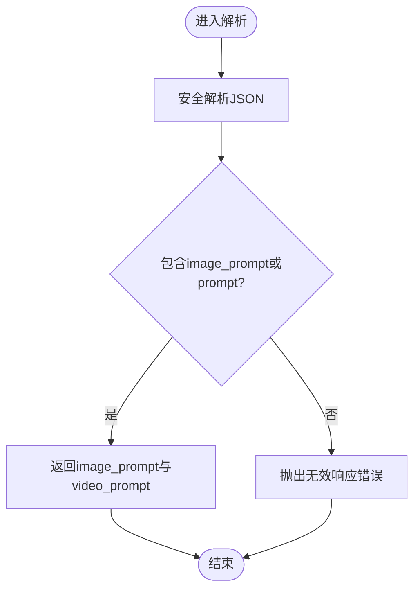

图表来源
- [shot-ai-prompt-utils.ts:17-43](file://src/lib/workers/handlers/shot-ai-prompt-utils.ts#L17-L43)

章节来源
- [shot-ai-prompt-utils.ts:5-43](file://src/lib/workers/handlers/shot-ai-prompt-utils.ts#L5-L43)

### 模型解析（resolve-analysis-model）
- 解析顺序：输入参数 > 项目配置 > 用户偏好 > 抛错
- 归一化：严格解析与组合模型键，保证一致性
- 错误处理：未配置时抛出明确错误

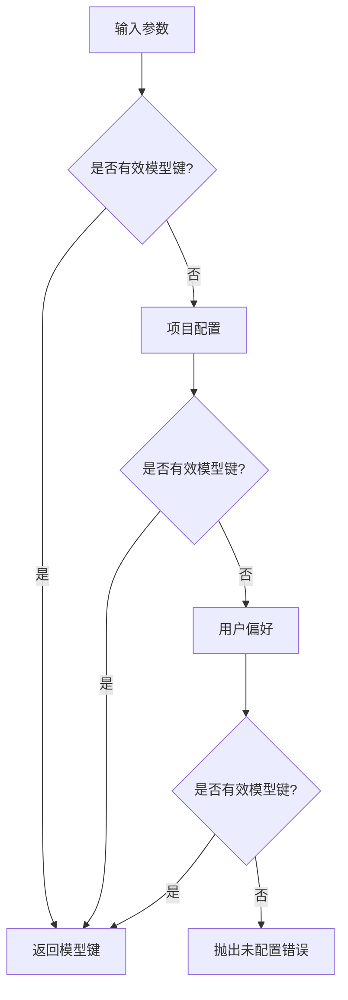

图表来源
- [resolve-analysis-model.ts:19-34](file://src/lib/workers/handlers/resolve-analysis-model.ts#L19-L34)

章节来源
- [resolve-analysis-model.ts:19-34](file://src/lib/workers/handlers/resolve-analysis-model.ts#L19-L34)

### 任务调度（shot-ai-tasks）
- 类型分发：根据任务类型路由到对应处理器
- 默认分支：不支持类型抛出错误
- 与聚合模块配合：统一导出便于上层使用

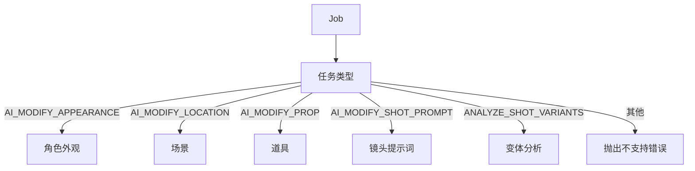

图表来源
- [shot-ai-tasks.ts:12-28](file://src/lib/workers/handlers/shot-ai-tasks.ts#L12-L28)

章节来源
- [shot-ai-tasks.ts:12-28](file://src/lib/workers/handlers/shot-ai-tasks.ts#L12-L28)

### 变体生成（shot-ai-variants）
- 输入：面板ID、项目内模型键
- 流程要点：
  - 查询面板信息与图片URL，必要时签名
  - 构建视觉分析提示词（描述、拍摄类型、摄影运动、地点、人物信息）
  - 调用多模态视觉模型执行推理
  - 安全解析JSON数组，校验建议数量
- 关键路径
  - 流式回调与内部观察上下文
  - 进度上报：准备、解析、完成

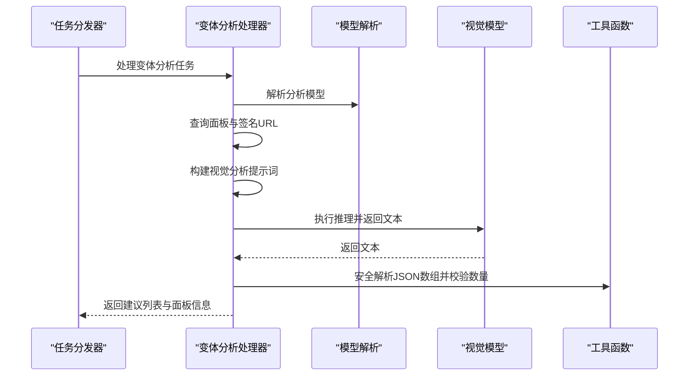

图表来源
- [shot-ai-variants.ts:52-145](file://src/lib/workers/handlers/shot-ai-variants.ts#L52-L145)
- [resolve-analysis-model.ts:19-34](file://src/lib/workers/handlers/resolve-analysis-model.ts#L19-L34)

章节来源
- [shot-ai-variants.ts:52-145](file://src/lib/workers/handlers/shot-ai-variants.ts#L52-L145)

### 数据持久化（shot-ai-persist）
- 项目级模型解析：优先项目配置，回退用户偏好
- 位置归属校验：限定在同一项目内
- 场景描述更新：支持可用槽位序列化写回

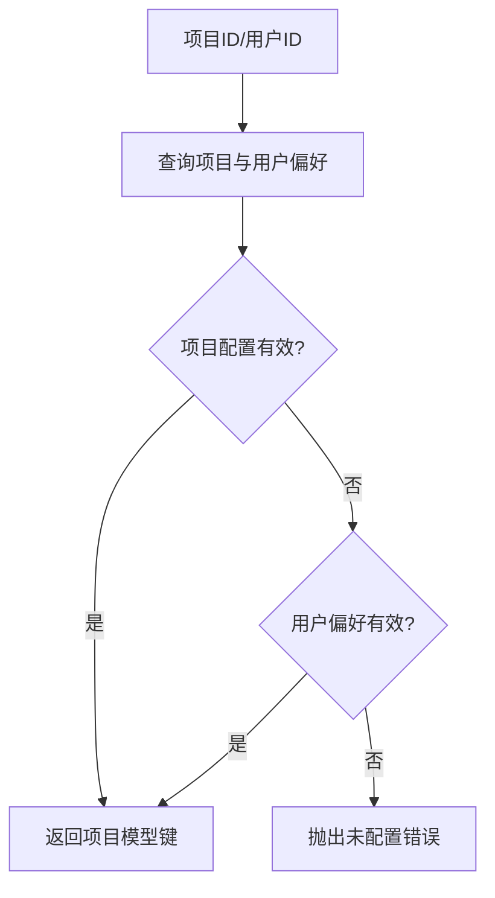

图表来源
- [shot-ai-persist.ts:14-37](file://src/lib/workers/handlers/shot-ai-persist.ts#L14-L37)

章节来源
- [shot-ai-persist.ts:14-83](file://src/lib/workers/handlers/shot-ai-persist.ts#L14-L83)

## 依赖关系分析
- 聚合与分发：shot-ai-prompt.ts导出各处理器，shot-ai-tasks.ts统一分发
- 模型解析：各处理器均依赖resolve-analysis-model.ts
- 工具函数：解析与校验由shot-ai-prompt-utils.ts提供
- 持久化：场景描述更新依赖shot-ai-persist.ts
- 变体分析：独立依赖视觉模型与存储签名

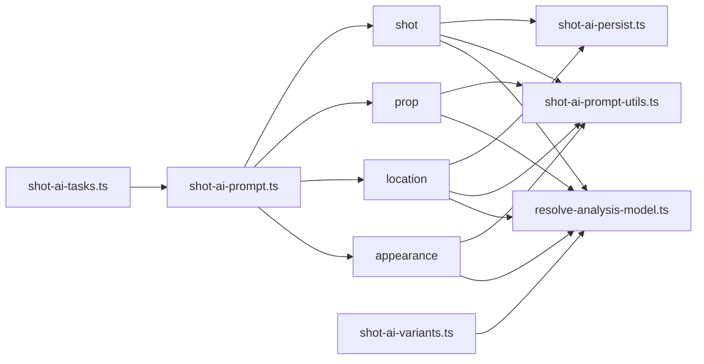

图表来源
- [shot-ai-tasks.ts:12-28](file://src/lib/workers/handlers/shot-ai-tasks.ts#L12-L28)
- [shot-ai-prompt.ts:1-6](file://src/lib/workers/handlers/shot-ai-prompt.ts#L1-L6)
- [resolve-analysis-model.ts:19-34](file://src/lib/workers/handlers/resolve-analysis-model.ts#L19-L34)
- [shot-ai-prompt-utils.ts:17-43](file://src/lib/workers/handlers/shot-ai-prompt-utils.ts#L17-L43)
- [shot-ai-persist.ts:14-83](file://src/lib/workers/handlers/shot-ai-persist.ts#L14-L83)
- [shot-ai-variants.ts:52-145](file://src/lib/workers/handlers/shot-ai-variants.ts#L52-L145)

章节来源
- [shot-ai-tasks.ts:12-28](file://src/lib/workers/handlers/shot-ai-tasks.ts#L12-L28)
- [shot-ai-prompt.ts:1-6](file://src/lib/workers/handlers/shot-ai-prompt.ts#L1-L6)

## 性能考量
- 模型解析缓存：在单次任务内复用已解析模型键，避免重复解析
- 并行查询：项目与用户偏好的查询可并行执行
- 流式回调：变体分析使用流式回调减少等待时间
- JSON解析：使用安全解析避免异常中断，提高鲁棒性
- 进度上报：阶段性上报有助于前端及时反馈，改善用户体验

## 故障排查指南
- 模型未配置
  - 现象：抛出“未配置分析模型”相关错误
  - 排查：确认输入参数、项目配置、用户偏好是否存在有效模型键
  - 参考
    - [resolve-analysis-model.ts:19-34](file://src/lib/workers/handlers/resolve-analysis-model.ts#L19-L34)
    - [shot-ai-persist.ts:14-37](file://src/lib/workers/handlers/shot-ai-persist.ts#L14-L37)
- 任务类型不支持
  - 现象：抛出“不支持的类型”错误
  - 排查：核对任务类型枚举与分发逻辑
  - 参考
    - [shot-ai-tasks.ts:25-27](file://src/lib/workers/handlers/shot-ai-tasks.ts#L25-L27)
- JSON解析失败
  - 现象：抛出“无效响应”错误
  - 排查：检查模型输出格式，确保包含image_prompt或prompt字段
  - 参考
    - [shot-ai-prompt-utils.ts:21-43](file://src/lib/workers/handlers/shot-ai-prompt-utils.ts#L21-L43)
- 场景描述更新失败
  - 现象：找不到场景或场景图片
  - 排查：确认场景ID与项目内关联、图片索引存在
  - 参考
    - [shot-ai-persist.ts:39-51](file://src/lib/workers/handlers/shot-ai-persist.ts#L39-L51)
    - [shot-ai-persist.ts:54-83](file://src/lib/workers/handlers/shot-ai-persist.ts#L54-L83)

章节来源
- [resolve-analysis-model.ts:19-34](file://src/lib/workers/handlers/resolve-analysis-model.ts#L19-L34)
- [shot-ai-tasks.ts:25-27](file://src/lib/workers/handlers/shot-ai-tasks.ts#L25-L27)
- [shot-ai-prompt-utils.ts:21-43](file://src/lib/workers/handlers/shot-ai-prompt-utils.ts#L21-L43)
- [shot-ai-persist.ts:39-51](file://src/lib/workers/handlers/shot-ai-persist.ts#L39-L51)
- [shot-ai-persist.ts:54-83](file://src/lib/workers/handlers/shot-ai-persist.ts#L54-L83)

## 结论
AI提示词处理器通过清晰的模块划分与统一的模型解析策略，实现了角色、场景、道具与镜头提示词的智能化生成与管理。其关键优势在于：
- 明确的阶段化流程与进度上报，提升可观测性
- 严格的输入校验与安全解析，增强稳定性
- 统一的模型键归一化，简化配置与迁移
- 独立的变体分析能力，结合视觉模型实现创造性建议

建议在实际使用中：
- 优先在项目层面配置分析模型，确保一致性
- 对模型输出进行格式约束与校验，避免下游解析失败
- 合理利用流式回调与阶段性进度，优化前端交互体验
- 在团队内建立提示词模板与规范，提升生成质量与复用效率

## 附录
- 最佳实践
  - 模板变量命名规范化，避免歧义
  - 对外暴露的提示词需去除后缀，保持一致性
  - 对复杂响应使用专用解析器，确保健壮性
  - 将错误信息本地化，便于用户理解
- 扩展建议
  - 引入提示词版本控制与对比
  - 增加A/B测试与效果追踪
  - 支持多语言与跨文化适配