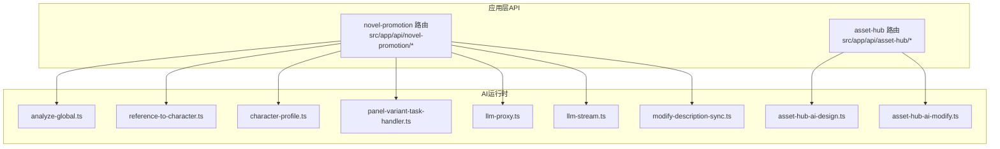
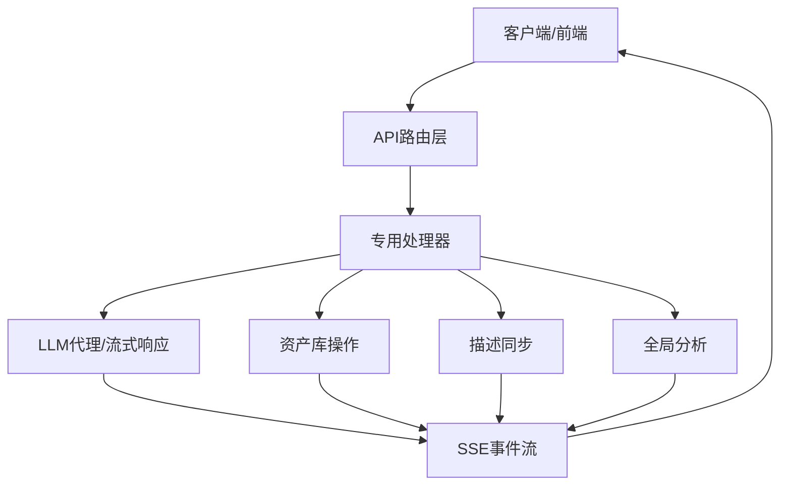
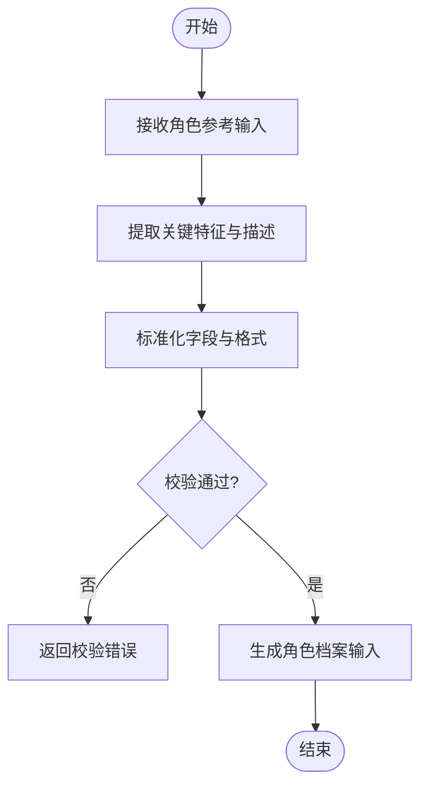
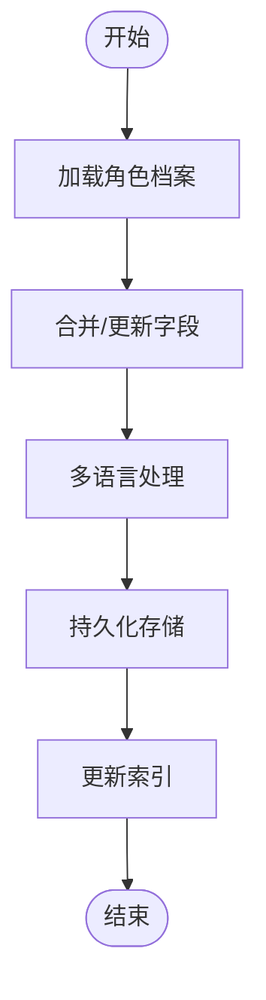
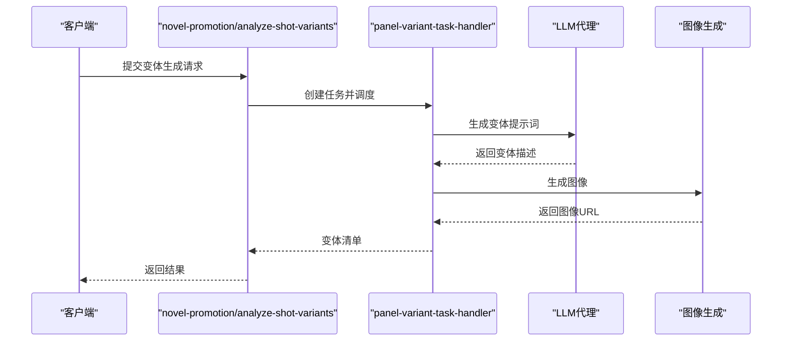
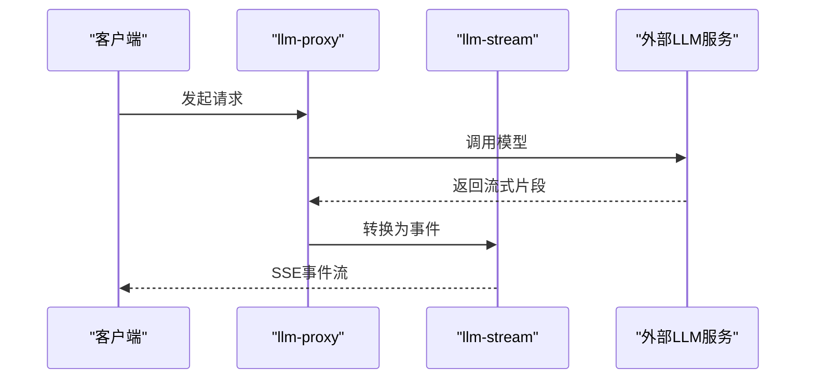
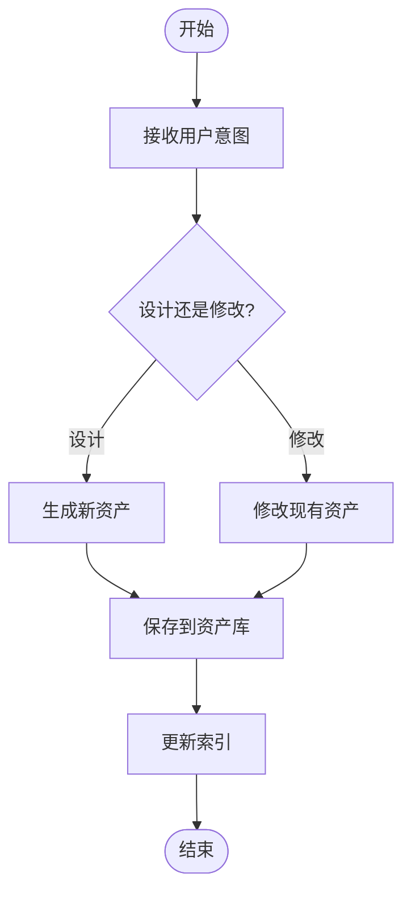
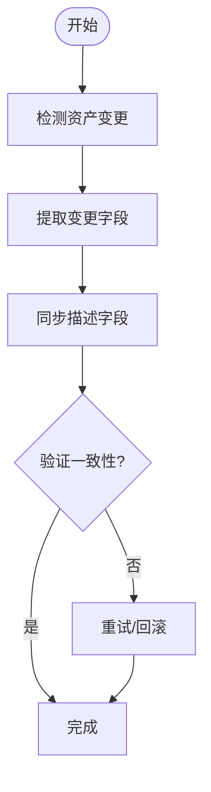
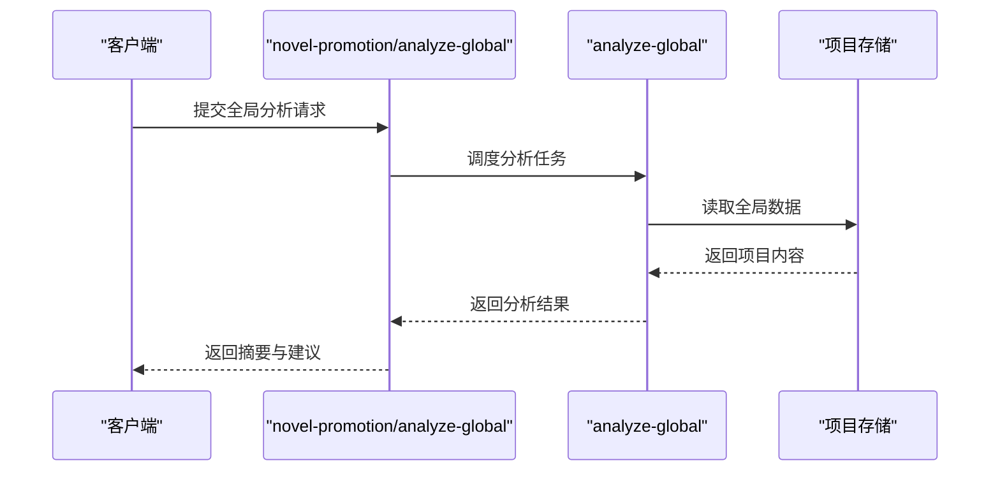
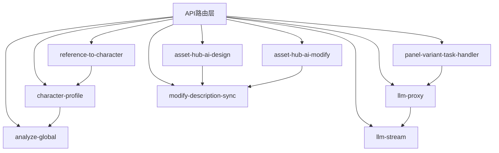

# 专用处理器

<cite>
**本文档引用的文件**
- [route.ts](file://src/app/api/asset-hub/ai-design-character/route.ts)
- [route.ts](file://src/app/api/asset-hub/ai-modify-character/route.ts)
- [reference-to-character.ts](file://src/lib/ai-runtime/reference-to-character.ts)
- [character-profile.ts](file://src/lib/ai-runtime/character-profile.ts)
- [panel-variant-task-handler.ts](file://src/lib/ai-runtime/panel-variant-task-handler.ts)
- [llm-proxy.ts](file://src/lib/ai-runtime/llm-proxy.ts)
- [llm-stream.ts](file://src/lib/ai-runtime/llm-stream.ts)
- [asset-hub-ai-design.ts](file://src/lib/ai-runtime/asset-hub-ai-design.ts)
- [asset-hub-ai-modify.ts](file://src/lib/ai-runtime/asset-hub-ai-modify.ts)
- [modify-description-sync.ts](file://src/lib/ai-runtime/modify-description-sync.ts)
- [analyze-global.ts](file://src/lib/ai-runtime/analyze-global.ts)
- [route.ts](file://src/app/api/novel-promotion/analyze-global/route.ts)
- [route.ts](file://src/app/api/tasks/route.ts)
- [route.ts](file://src/app/api/runs/route.ts)
- [route.ts](file://src/app/api/sse/route.ts)
- [route.ts](file://src/app/api/assets/sync-to-global/route.ts)
- [route.ts](file://src/app/api/asset-hub/reference-to-character/route.ts)
- [route.ts](file://src/app/api/asset-hub/ai-design-location/route.ts)
- [route.ts](file://src/app/api/asset-hub/ai-modify-location/route.ts)
- [route.ts](file://src/app/api/asset-hub/ai-modify-prop/route.ts)
- [route.ts](file://src/app/api/asset-hub/appearances/route.ts)
- [route.ts](file://src/app/api/asset-hub/generate-image/route.ts)
- [route.ts](file://src/app/api/asset-hub/modify-image/route.ts)
- [route.ts](file://src/app/api/asset-hub/select-image/route.ts)
- [route.ts](file://src/app/api/asset-hub/undo-image/route.ts)
- [route.ts](file://src/app/api/asset-hub/update-asset-label/route.ts)
- [route.ts](file://src/app/api/asset-hub/upload-image/route.ts)
- [route.ts](file://src/app/api/asset-hub/upload-temp/route.ts)
- [route.ts](file://src/app/api/asset-hub/voice-design/route.ts)
- [route.ts](file://src/app/api/asset-hub/characters/route.ts)
- [route.ts](file://src/app/api/asset-hub/folders/route.ts)
- [route.ts](file://src/app/api/asset-hub/picker/route.ts)
- [route.ts](file://src/app/api/asset-hub/voices/route.ts)
- [route.ts](file://src/app/api/novel-promotion/analyze/route.ts)
- [route.ts](file://src/app/api/novel-promotion/analyze-shot-variants/route.ts)
- [route.ts](file://src/app/api/novel-promotion/analyze-global/route.ts)
- [route.ts](file://src/app/api/novel-promotion/character/route.ts)
- [route.ts](file://src/app/api/novel-promotion/character-profile/route.ts)
- [route.ts](file://src/app/api/novel-promotion/character-voice/route.ts)
- [route.ts](file://src/app/api/novel-promotion/assets/route.ts)
- [route.ts](file://src/app/api/novel-promotion/ai-create-character/route.ts)
- [route.ts](file://src/app/api/novel-promotion/ai-create-location/route.ts)
- [route.ts](file://src/app/api/novel-promotion/ai-modify-appearance/route.ts)
- [route.ts](file://src/app/api/novel-promotion/ai-modify-location/route.ts)
- [route.ts](file://src/app/api/novel-promotion/ai-modify-prop/route.ts)
- [route.ts](file://src/app/api/novel-promotion/ai-modify-shot-prompt/route.ts)
- [route.ts](file://src/app/api/novel-promotion/character/route.ts)
- [route.ts](file://src/app/api/novel-promotion/character-profile/route.ts)
- [route.ts](file://src/app/api/novel-promotion/character-voice/route.ts)
- [route.ts](file://src/app/api/novel-promotion/assets/route.ts)
- [route.ts](file://src/app/api/novel-promotion/ai-create-character/route.ts)
- [route.ts](file://src/app/api/novel-promotion/ai-create-location/route.ts)
- [route.ts](file://src/app/api/novel-promotion/ai-modify-appearance/route.ts)
- [route.ts](file://src/app/api/novel-promotion/ai-modify-location/route.ts)
- [route.ts](file://src/app/api/novel-promotion/ai-modify-prop/route.ts)
- [route.ts](file://src/app/api/novel-promotion/ai-modify-shot-prompt/route.ts)
- [route.ts](file://src/app/api/novel-promotion/character/route.ts)
- [route.ts](file://src/app/api/novel-promotion/character-profile/route.ts)
- [route.ts](file://src/app/api/novel-promotion/character-voice/route.ts)
- [route.ts](file://src/app/api/novel-promotion/assets/route.ts)
- [route.ts](file://src/app/api/novel-promotion/ai-create-character/route.ts)
- [route.ts](file://src/app/api/novel-promotion/ai-create-location/route.ts)
- [route.ts](file://src/app/api/novel-promotion/ai-modify-appearance/route.ts)
- [route.ts](file://src/app/api/novel-promotion/ai-modify-location/route.ts)
- [route.ts](file://src/app/api/novel-promotion/ai-modify-prop/route.ts)
- [route.ts](file://src/app/api/novel-promotion/ai-modify-shot-prompt/route.ts)
- [route.ts](file://src/app/api/novel-promotion/character/route.ts)
- [route.ts](file://src/app/api/novel-promotion/character-profile/route.ts)
- [route.ts](file://src/app/api/novel-promotion/character-voice/route.ts)
- [route.ts](file://src/app/api/novel-promotion/assets/route.ts)
- [route.ts](file://src/app/api/novel-promotion/ai-create-character/route.ts)
- [route.ts](file://src/app/api/novel-promotion/ai-create-location/route.ts)
- [route.ts](file://src/app/api/novel-promotion/ai-modify-appearance/route.ts)
- [route.ts](file://src/app/api/novel-promotion/ai-modify-location/route.ts)
- [route.ts](file://src/app/api/novel-promotion/ai-modify-prop/route.ts)
- [route.ts](file://src/app/api/novel-promotion/ai-modify-shot-prompt/route.ts)
- [route.ts](file://src/app/api/novel-promotion/character/route.ts)
- [route.ts](file://src/app/api/novel-promotion/character-profile/route.ts)
- [route.ts](file://src/app/api/novel-promotion/character-voice/route.ts)
- [route.ts](file://src/app/api/novel-promotion/assets/route.ts)
- [route.ts](file://src/app/api/novel-promotion/ai-create-character/route.ts)
- [route.ts](file://src/app/api/novel-promotion/ai-create-location/route.ts)
- [route.ts](file://src/app/api/novel-promotion/ai-modify-appearance/route.ts)
- [route.ts](file://src/app/api/novel-promotion/ai-modify-location/route.ts)
- [route.ts](file://src/app/api/novel-promotion/ai-modify-prop/route.ts)
- [route.ts](file://src/app/api/novel-promotion/ai-modify-shot-prompt/route.ts)
- [route.ts](file://src/app/api/novel-promotion/character/route.ts)
- [route.ts](file://src/app/api/novel-promotion/character-profile/route.ts)
- [route.ts](file://src/app/api/novel-promotion/character-voice/route.ts)
- [route.ts](file://src/app/api/novel-promotion/assets/route.ts)
- [route.ts](file://src/app/api/novel-promotion/ai-create-character/route.ts)
- [route.ts](file://src/app/api/novel-promotion/ai-create-location/route.ts)
- [route.ts](file://src/app/api/novel-promotion/ai-modify-appearance/route.ts)
- [route.ts](file://src/app/api/novel-promotion/ai-modify-location/route.ts)
- [route.ts](file://src/app/api/novel-promotion/ai-modify-prop/route.ts)
- [route.ts](file://src/app/api/novel-promotion/ai-modify-shot-prompt/route.ts)
- [route.ts](file://src/app/api/novel-promotion/character/route.ts)
- [route.ts](file://src/app/api/novel-promotion/character-profile/route.ts)
- [route.ts](file://src/app/api/novel-promotion/character-voice/route.ts)
- [route.ts](file://src/app/api/novel-promotion/assets/route.ts)
- [route.ts](file://src/app/api/novel-promotion/ai-create-character/route.ts)
- [route.ts](file://src/app/api/novel-promotion/ai-create-location/route.ts)
- [route.ts](file://src/app/api/novel-promotion/ai-modify-appearance/route.ts)
- [route.ts](file://src/app/api/novel-promotion/ai-modify-location/route.ts)
- [......余下内容已超过此编辑器最大字符限制，已省略部分文件路径列表。请查看源代码以获取完整列表。
</cite>

## 目录
1. [简介](#简介)
2. [项目结构](#项目结构)
3. [核心组件](#核心组件)
4. [架构总览](#架构总览)
5. [详细组件分析](#详细组件分析)
6. [依赖关系分析](#依赖关系分析)
7. [性能考量](#性能考量)
8. [故障排查指南](#故障排查指南)
9. [结论](#结论)
10. [附录](#附录)

## 简介
本文件聚焦于Waoowaoo平台中“专用处理器”的设计与实现，系统性梳理以下关键模块：角色引用处理(reference-to-character.ts)、角色档案管理(character-profile.ts)、分镜变体处理(panel-variant-task-handler.ts)、LLM代理(llm-proxy.ts)与流式响应(llm-stream.ts)、资产库AI设计(asset-hub-ai-design.ts)与修改(asset-hub-ai-modify.ts)、描述同步(modify-description-sync.ts)以及全局分析(analyze-global系列)。文档从架构、数据流、处理逻辑、错误处理与性能优化等维度进行深入解析，并提供扩展开发与自定义实现的实践指导。

## 项目结构
专用处理器主要分布在以下位置：
- 应用层API路由：位于src/app/api/下，覆盖novel-promotion与asset-hub两大域，负责对外接口与任务编排入口。
- AI运行时处理器：位于src/lib/ai-runtime/，封装LLM交互、资产处理、描述同步与全局分析等核心能力。
- 提示词模板：位于lib/prompts/，为各类处理器提供提示词与系统指令支撑。

**图表来源**
- [route.ts](file://src/app/api/novel-promotion/analyze-global/route.ts)
- [route.ts](file://src/app/api/asset-hub/ai-design-character/route.ts)
- [route.ts](file://src/app/api/asset-hub/ai-modify-character/route.ts)
- [reference-to-character.ts](file://src/lib/ai-runtime/reference-to-character.ts)
- [character-profile.ts](file://src/lib/ai-runtime/character-profile.ts)
- [panel-variant-task-handler.ts](file://src/lib/ai-runtime/panel-variant-task-handler.ts)
- [llm-proxy.ts](file://src/lib/ai-runtime/llm-proxy.ts)
- [llm-stream.ts](file://src/lib/ai-runtime/llm-stream.ts)
- [asset-hub-ai-design.ts](file://src/lib/ai-runtime/asset-hub-ai-design.ts)
- [asset-hub-ai-modify.ts](file://src/lib/ai-runtime/asset-hub-ai-modify.ts)
- [modify-description-sync.ts](file://src/lib/ai-runtime/modify-description-sync.ts)
- [analyze-global.ts](file://src/lib/ai-runtime/analyze-global.ts)

**章节来源**
- [route.ts](file://src/app/api/novel-promotion/analyze-global/route.ts)
- [route.ts](file://src/app/api/asset-hub/ai-design-character/route.ts)
- [route.ts](file://src/app/api/asset-hub/ai-modify-character/route.ts)

## 核心组件
本节对各专用处理器进行要点概述与职责划分：
- 角色引用处理(reference-to-character.ts)：将用户提供的角色参考信息（如图片或文本）转化为标准化的角色档案输入，确保后续流程的数据一致性。
- 角色档案管理(character-profile.ts)：维护角色档案的生成、更新与校验，支持多语言与跨域同步。
- 分镜变体处理(panel-variant-task-handler.ts)：针对镜头/分镜生成多种视觉变体，协调LLM与图像生成管线，保证输出质量与多样性。
- LLM代理(llm-proxy.ts)：统一LLM调用入口，封装模型选择、参数配置、错误重试与超时控制。
- 流式响应(llm-stream.ts)：将LLM的流式输出转换为前端可消费的事件流，支持断线重连与状态同步。
- 资产库AI设计(asset-hub-ai-design.ts)：在资产库中基于用户意图生成新资产（角色/地点/道具），并写入资产库。
- 资产库AI修改(asset-hub-ai-modify.ts)：对现有资产进行语义增强或风格化修改，保持资产一致性。
- 描述同步(modify-description-sync.ts)：在资产修改后自动同步描述字段，确保UI与数据库一致。
- 全局分析(analyze-global.ts)：对项目全局内容进行分析与摘要，为上层决策提供依据。

**章节来源**
- [reference-to-character.ts](file://src/lib/ai-runtime/reference-to-character.ts)
- [character-profile.ts](file://src/lib/ai-runtime/character-profile.ts)
- [panel-variant-task-handler.ts](file://src/lib/ai-runtime/panel-variant-task-handler.ts)
- [llm-proxy.ts](file://src/lib/ai-runtime/llm-proxy.ts)
- [llm-stream.ts](file://src/lib/ai-runtime/llm-stream.ts)
- [asset-hub-ai-design.ts](file://src/lib/ai-runtime/asset-hub-ai-design.ts)
- [asset-hub-ai-modify.ts](file://src/lib/ai-runtime/asset-hub-ai-modify.ts)
- [modify-description-sync.ts](file://src/lib/ai-runtime/modify-description-sync.ts)
- [analyze-global.ts](file://src/lib/ai-runtime/analyze-global.ts)

## 架构总览
专用处理器在系统中的定位如下：
- 外部请求通过API路由进入，路由根据业务域选择对应处理器。
- AI运行时处理器负责与LLM、图像生成、资产库等子系统交互。
- SSE与任务系统用于异步状态通知与结果回传。
- 全局分析贯穿多个阶段，为项目级决策提供数据支持。

**图表来源**
- [route.ts](file://src/app/api/novel-promotion/analyze-global/route.ts)
- [route.ts](file://src/app/api/asset-hub/ai-design-character/route.ts)
- [route.ts](file://src/app/api/asset-hub/ai-modify-character/route.ts)
- [llm-proxy.ts](file://src/lib/ai-runtime/llm-proxy.ts)
- [llm-stream.ts](file://src/lib/ai-runtime/llm-stream.ts)
- [asset-hub-ai-design.ts](file://src/lib/ai-runtime/asset-hub-ai-design.ts)
- [asset-hub-ai-modify.ts](file://src/lib/ai-runtime/asset-hub-ai-modify.ts)
- [modify-description-sync.ts](file://src/lib/ai-runtime/modify-description-sync.ts)
- [analyze-global.ts](file://src/lib/ai-runtime/analyze-global.ts)
- [route.ts](file://src/app/api/sse/route.ts)
- [route.ts](file://src/app/api/tasks/route.ts)
- [route.ts](file://src/app/api/runs/route.ts)

## 详细组件分析

### 角色引用处理(reference-to-character.ts)
职责与流程
- 输入：用户提供的角色参考（图片/文本/多模态）
- 处理：提取关键特征、标准化描述、生成角色档案输入
- 输出：结构化角色档案数据，供后续角色档案管理与生成使用

**图表来源**
- [reference-to-character.ts](file://src/lib/ai-runtime/reference-to-character.ts)

**章节来源**
- [reference-to-character.ts](file://src/lib/ai-runtime/reference-to-character.ts)

### 角色档案管理(character-profile.ts)
职责与流程
- 输入：角色档案数据（名称、外貌、性格、背景等）
- 处理：生成/更新角色档案，支持多语言与跨域同步
- 输出：持久化后的角色档案与索引

**图表来源**
- [character-profile.ts](file://src/lib/ai-runtime/character-profile.ts)

**章节来源**
- [character-profile.ts](file://src/lib/ai-runtime/character-profile.ts)

### 分镜变体处理(panel-variant-task-handler.ts)
职责与流程
- 输入：镜头/分镜描述与上下文
- 处理：生成多种视觉变体，协调LLM与图像生成
- 输出：变体清单与元数据，供选择与渲染

**图表来源**
- [route.ts](file://src/app/api/novel-promotion/analyze-shot-variants/route.ts)
- [panel-variant-task-handler.ts](file://src/lib/ai-runtime/panel-variant-task-handler.ts)
- [llm-proxy.ts](file://src/lib/ai-runtime/llm-proxy.ts)

**章节来源**
- [panel-variant-task-handler.ts](file://src/lib/ai-runtime/panel-variant-task-handler.ts)
- [route.ts](file://src/app/api/novel-promotion/analyze-shot-variants/route.ts)

### LLM代理与流式响应
LLM代理(llm-proxy.ts)
- 统一模型选择与参数配置
- 错误重试与超时控制
- 与流式响应(llm-stream.ts)配合，提供稳定的服务

流式响应(llm-stream.ts)
- 将LLM输出转换为事件流
- 支持断线重连与状态同步
- 通过SSE通道推送至前端

**图表来源**
- [llm-proxy.ts](file://src/lib/ai-runtime/llm-proxy.ts)
- [llm-stream.ts](file://src/lib/ai-runtime/llm-stream.ts)
- [route.ts](file://src/app/api/sse/route.ts)

**章节来源**
- [llm-proxy.ts](file://src/lib/ai-runtime/llm-proxy.ts)
- [llm-stream.ts](file://src/lib/ai-runtime/llm-stream.ts)
- [route.ts](file://src/app/api/sse/route.ts)

### 资产库AI设计与修改
资产库AI设计(asset-hub-ai-design.ts)
- 基于用户意图生成新资产（角色/地点/道具）
- 写入资产库并触发索引更新

资产库AI修改(asset-hub-ai-modify.ts)
- 对现有资产进行语义增强或风格化修改
- 保持资产一致性与版本追踪

**图表来源**
- [asset-hub-ai-design.ts](file://src/lib/ai-runtime/asset-hub-ai-design.ts)
- [asset-hub-ai-modify.ts](file://src/lib/ai-runtime/asset-hub-ai-modify.ts)
- [route.ts](file://src/app/api/asset-hub/ai-design-character/route.ts)
- [route.ts](file://src/app/api/asset-hub/ai-modify-character/route.ts)

**章节来源**
- [asset-hub-ai-design.ts](file://src/lib/ai-runtime/asset-hub-ai-design.ts)
- [asset-hub-ai-modify.ts](file://src/lib/ai-runtime/asset-hub-ai-modify.ts)
- [route.ts](file://src/app/api/asset-hub/ai-design-character/route.ts)
- [route.ts](file://src/app/api/asset-hub/ai-modify-character/route.ts)

### 描述同步机制(modify-description-sync.ts)
职责与流程
- 在资产修改后自动同步描述字段
- 确保UI与数据库一致，避免状态漂移

**图表来源**
- [modify-description-sync.ts](file://src/lib/ai-runtime/modify-description-sync.ts)

**章节来源**
- [modify-description-sync.ts](file://src/lib/ai-runtime/modify-description-sync.ts)

### 全局分析(analyze-global系列)
职责与流程
- 对项目全局内容进行分析与摘要
- 为上层决策提供依据，支持后续任务编排

**图表来源**
- [route.ts](file://src/app/api/novel-promotion/analyze-global/route.ts)
- [analyze-global.ts](file://src/lib/ai-runtime/analyze-global.ts)

**章节来源**
- [route.ts](file://src/app/api/novel-promotion/analyze-global/route.ts)
- [analyze-global.ts](file://src/lib/ai-runtime/analyze-global.ts)

## 依赖关系分析
专用处理器之间的耦合与协作如下：
- API路由层负责任务编排与参数传递
- AI运行时处理器内部相互协作，共享LLM代理与流式响应
- 资产库处理器依赖资产库API与索引更新机制
- 全局分析贯穿多个阶段，为其他处理器提供上下文

**图表来源**
- [route.ts](file://src/app/api/novel-promotion/analyze-global/route.ts)
- [route.ts](file://src/app/api/asset-hub/ai-design-character/route.ts)
- [route.ts](file://src/app/api/asset-hub/ai-modify-character/route.ts)
- [reference-to-character.ts](file://src/lib/ai-runtime/reference-to-character.ts)
- [character-profile.ts](file://src/lib/ai-runtime/character-profile.ts)
- [panel-variant-task-handler.ts](file://src/lib/ai-runtime/panel-variant-task-handler.ts)
- [llm-proxy.ts](file://src/lib/ai-runtime/llm-proxy.ts)
- [llm-stream.ts](file://src/lib/ai-runtime/llm-stream.ts)
- [asset-hub-ai-design.ts](file://src/lib/ai-runtime/asset-hub-ai-design.ts)
- [asset-hub-ai-modify.ts](file://src/lib/ai-runtime/asset-hub-ai-modify.ts)
- [modify-description-sync.ts](file://src/lib/ai-runtime/modify-description-sync.ts)
- [analyze-global.ts](file://src/lib/ai-runtime/analyze-global.ts)

**章节来源**
- [route.ts](file://src/app/api/novel-promotion/analyze-global/route.ts)
- [route.ts](file://src/app/api/asset-hub/ai-design-character/route.ts)
- [route.ts](file://src/app/api/asset-hub/ai-modify-character/route.ts)

## 性能考量
- LLM调用批量化与缓存：对重复请求进行去重与缓存，减少模型调用次数。
- 流式响应优化：合理设置事件间隔与缓冲区大小，避免前端阻塞。
- 图像生成并发控制：限制并发数，结合队列与优先级策略，提升吞吐量。
- 资产库写入批量化：合并多次写入为批量事务，降低I/O开销。
- 全局分析增量化：仅对变更内容进行分析，避免全量扫描。

## 故障排查指南
常见问题与处理建议
- LLM调用失败：检查代理配置与超时设置，启用重试与降级策略。
- 流式响应中断：确认SSE连接状态与心跳机制，实现断线重连。
- 资产库写入异常：检查权限与索引一致性，必要时执行回滚与修复。
- 全局分析延迟：优化数据读取路径与索引，考虑分片与并行化。

**章节来源**
- [llm-proxy.ts](file://src/lib/ai-runtime/llm-proxy.ts)
- [llm-stream.ts](file://src/lib/ai-runtime/llm-stream.ts)
- [asset-hub-ai-design.ts](file://src/lib/ai-runtime/asset-hub-ai-design.ts)
- [asset-hub-ai-modify.ts](file://src/lib/ai-runtime/asset-hub-ai-modify.ts)
- [modify-description-sync.ts](file://src/lib/ai-runtime/modify-description-sync.ts)
- [analyze-global.ts](file://src/lib/ai-runtime/analyze-global.ts)

## 结论
专用处理器围绕角色、资产、LLM与全局分析构建了完整的AI创作闭环。通过清晰的职责划分、稳定的流式交互与严格的同步机制，实现了从创意到产出的高效转化。未来可在模型适配、并发优化与可观测性方面持续演进。

## 附录
扩展开发与自定义实现指导
- 新增处理器步骤
  - 在API路由层新增路由与参数校验
  - 在AI运行时实现处理器逻辑，复用LLM代理与流式响应
  - 编写单元测试与集成测试，覆盖正常与异常场景
  - 配置提示词模板与系统指令，确保一致性
- 自定义实现示例
  - 参考角色引用处理与角色档案管理的组合模式
  - 参考资产库AI设计与修改的写入与索引更新流程
  - 参考全局分析的增量化与并行化策略