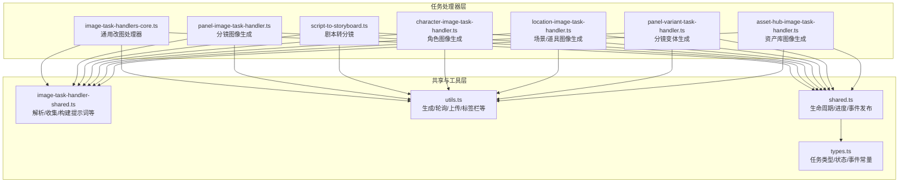
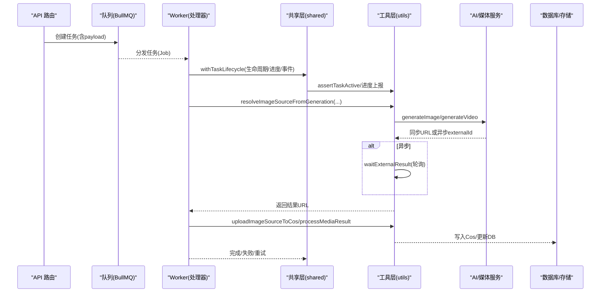
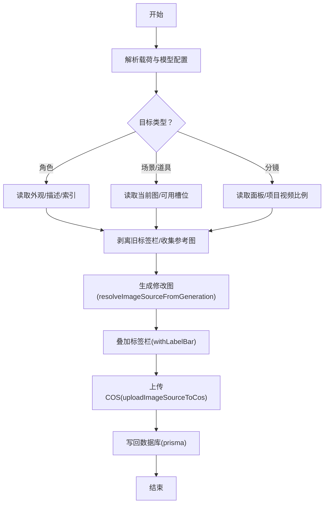
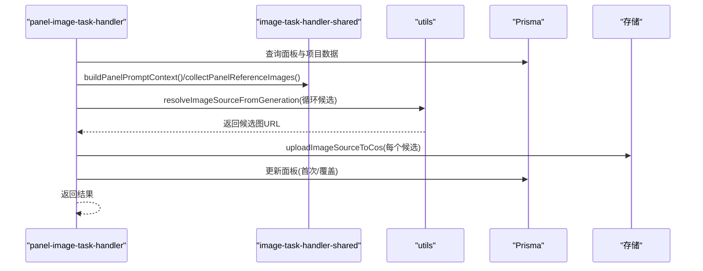
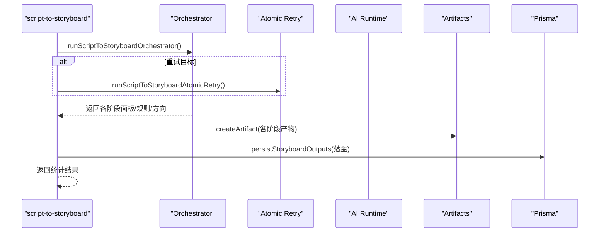
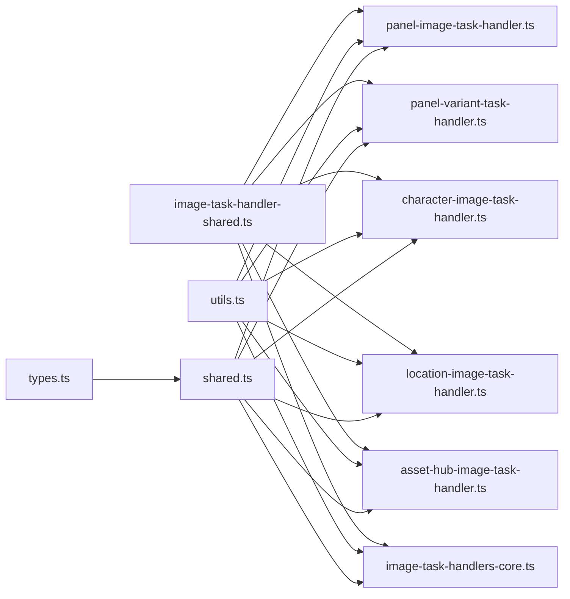

# 任务处理器

<cite>
**本文引用的文件**
- [image-task-handlers-core.ts](file://src/lib/workers/handlers/image-task-handlers-core.ts)
- [panel-image-task-handler.ts](file://src/lib/workers/handlers/panel-image-task-handler.ts)
- [script-to-storyboard.ts](file://src/lib/workers/handlers/script-to-storyboard.ts)
- [image-task-handler-shared.ts](file://src/lib/workers/handlers/image-task-handler-shared.ts)
- [character-image-task-handler.ts](file://src/lib/workers/handlers/character-image-task-handler.ts)
- [location-image-task-handler.ts](file://src/lib/workers/handlers/location-image-task-handler.ts)
- [panel-variant-task-handler.ts](file://src/lib/workers/handlers/panel-variant-task-handler.ts)
- [asset-hub-image-task-handler.ts](file://src/lib/workers/handlers/asset-hub-image-task-handler.ts)
- [utils.ts](file://src/lib/workers/utils.ts)
- [shared.ts](file://src/lib/workers/shared.ts)
- [types.ts](file://src/lib/task/types.ts)
</cite>

## 目录
1. [简介](#简介)
2. [项目结构](#项目结构)
3. [核心组件](#核心组件)
4. [架构总览](#架构总览)
5. [详细组件分析](#详细组件分析)
6. [依赖关系分析](#依赖关系分析)
7. [性能考量](#性能考量)
8. [故障排查指南](#故障排查指南)
9. [结论](#结论)
10. [附录](#附录)

## 简介
本技术文档聚焦 Waoowaoo 的“任务处理器”模块，系统性梳理图像生成、视频合成、音频处理与文本处理四类处理器的实现原理与使用方法。重点覆盖：
- 核心处理器的通用逻辑（如 image-task-handlers-core.ts 的共享能力）
- 特定处理器的业务逻辑（如 panel-image-task-handler.ts 的分镜图像生成；script-to-storyboard.ts 的剧本到分镜转换）
- 输入输出格式、参数校验与错误处理机制
- 扩展与自定义新处理器的方法
- 性能优化技巧与最佳实践
- 与 AI 服务的集成方式与 API 调用模式

## 项目结构
任务处理器位于 src/lib/workers/handlers 下，围绕“任务类型”划分处理器文件，并通过统一的工具层与共享层实现跨处理器的复用与一致性。

图表来源
- [image-task-handlers-core.ts](file://src/lib/workers/handlers/image-task-handlers-core.ts)
- [panel-image-task-handler.ts](file://src/lib/workers/handlers/panel-image-task-handler.ts)
- [script-to-storyboard.ts](file://src/lib/workers/handlers/script-to-storyboard.ts)
- [image-task-handler-shared.ts](file://src/lib/workers/handlers/image-task-handler-shared.ts)
- [utils.ts](file://src/lib/workers/utils.ts)
- [shared.ts](file://src/lib/workers/shared.ts)
- [types.ts](file://src/lib/task/types.ts)

章节来源
- [image-task-handlers-core.ts](file://src/lib/workers/handlers/image-task-handlers-core.ts)
- [panel-image-task-handler.ts](file://src/lib/workers/handlers/panel-image-task-handler.ts)
- [script-to-storyboard.ts](file://src/lib/workers/handlers/script-to-storyboard.ts)
- [image-task-handler-shared.ts](file://src/lib/workers/handlers/image-task-handler-shared.ts)
- [utils.ts](file://src/lib/workers/utils.ts)
- [shared.ts](file://src/lib/workers/shared.ts)
- [types.ts](file://src/lib/task/types.ts)

## 核心组件
- 通用改图处理器（modify-asset-image）：集中处理角色、场景、道具与分镜的“修改/再生成”，统一引用图规范化、分辨率/比例选择、标签栏叠加与 COS 上传。
- 分镜图像生成器：基于面板上下文（角色、场景、摄影规则、表演备注等）构建提示词，批量生成候选图并持久化。
- 剧本到分镜转换器：以 LLM 驱动的多阶段编排，产出分镜面板、摄影规则、表演方向与配音行，支持原子重试与工作流租约。
- 角色/场景/道具生成器：按项目模型配置与艺术风格生成资产图，支持主形象一致性约束与批量生成。
- 分镜变体生成器：在保留原分镜语义与镜头语言的前提下，按目标镜头类型/运动生成变体图。
- 资产库生成器：面向全局资产（角色/场景/道具）的独立生成流程，不绑定项目上下文。

章节来源
- [image-task-handlers-core.ts](file://src/lib/workers/handlers/image-task-handlers-core.ts)
- [panel-image-task-handler.ts](file://src/lib/workers/handlers/panel-image-task-handler.ts)
- [script-to-storyboard.ts](file://src/lib/workers/handlers/script-to-storyboard.ts)
- [character-image-task-handler.ts](file://src/lib/workers/handlers/character-image-task-handler.ts)
- [location-image-task-handler.ts](file://src/lib/workers/handlers/location-image-task-handler.ts)
- [panel-variant-task-handler.ts](file://src/lib/workers/handlers/panel-variant-task-handler.ts)
- [asset-hub-image-task-handler.ts](file://src/lib/workers/handlers/asset-hub-image-task-handler.ts)

## 架构总览
任务处理器遵循“任务类型 → 处理器 → 共享层 → 工具层 → AI/存储”的分层设计，统一通过 shared.ts 的生命周期管理与进度上报，通过 utils.ts 的生成/轮询/上传能力完成端到端交付。

图表来源
- [shared.ts](file://src/lib/workers/shared.ts)
- [utils.ts](file://src/lib/workers/utils.ts)
- [types.ts](file://src/lib/task/types.ts)

## 详细组件分析

### 通用改图处理器（modify-asset-image）
- 功能概述
  - 支持类型：角色、场景、道具、分镜
  - 核心流程：解析目标、读取当前图、剥离标签栏、收集额外参考图、构造修改提示词、调用生成、叠加标签栏、上传 COS、更新数据库
- 输入输出
  - 输入：任务载荷包含 type、modifyPrompt、targetId/appearanceId/locationImageId/panelId、extraImageUrls、generationOptions（含分辨率）
  - 输出：返回类型、目标 ID、索引（角色）、最终图片 URL
- 参数校验与错误处理
  - 必填字段校验（如 type/modifyPrompt、目标存在性）
  - 任务终止检测（assertTaskActive）
  - 外部任务轮询超时/失败处理
- 业务细节
  - 角色改图：自动同步描述字段，失败不阻断结果
  - 场景/道具改图：按比例与分辨率生成，可选分析模型同步描述
  - 分镜改图：以项目视频比例作为画幅，支持选定资产作为参考
- 性能与可靠性
  - 参考图去重与标准化
  - 服务重启续接：读取已有 externalId 并轮询

图表来源
- [image-task-handlers-core.ts](file://src/lib/workers/handlers/image-task-handlers-core.ts)
- [utils.ts](file://src/lib/workers/utils.ts)

章节来源
- [image-task-handlers-core.ts](file://src/lib/workers/handlers/image-task-handlers-core.ts)
- [utils.ts](file://src/lib/workers/utils.ts)

### 分镜图像生成器（panel-image-task）
- 功能概述
  - 基于面板元数据与项目上下文构建提示词，批量生成候选图，支持首次生成与覆盖更新
- 输入输出
  - 输入：panelId、候选数量、项目视频比例、艺术风格、参考图集合
  - 输出：面板 ID、候选数量、首张图 URL（首次生成时）
- 参数校验与错误处理
  - panelId 必填、项目视频比例必填、模型配置必填
  - 进度上报：generate_panel_candidate 阶段区间 18~76%
  - 任务终止检测
- 业务细节
  - 上下文构建：角色（名称/外观/描述/槽位）、场景（描述/可用槽位）、摄影规则、表演备注
  - 参考图收集：草图、角色外观图、场景图
  - 多候选生成：逐个生成并上传，保存候选列表

图表来源
- [panel-image-task-handler.ts](file://src/lib/workers/handlers/panel-image-task-handler.ts)
- [image-task-handler-shared.ts](file://src/lib/workers/handlers/image-task-handler-shared.ts)
- [utils.ts](file://src/lib/workers/utils.ts)

章节来源
- [panel-image-task-handler.ts](file://src/lib/workers/handlers/panel-image-task-handler.ts)
- [image-task-handler-shared.ts](file://src/lib/workers/handlers/image-task-handler-shared.ts)
- [utils.ts](file://src/lib/workers/utils.ts)

### 剧本到分镜转换器（script-to-storyboard）
- 功能概述
  - 多阶段 LLM 编排：计划/摄影/表演/细节，最终落盘为面板与配音行
  - 支持工作流租约、步骤级重试、原子重试、运行事件直传
- 输入输出
  - 输入：episodeId、模型、推理努力度、温度、重试步骤键、运行 ID、片段集合
  - 输出：剧集 ID、分镜数、面板数、配音行数（可选跳过）
- 参数校验与错误处理
  - episodeId/项目/片段必填校验
  - 步骤重试键合法性校验
  - 解析 JSON 失败的专项日志
  - 任务终止检测（工作流级别）
- 业务细节
  - 模板加载：计划/摄影/表演/细节提示词
  - 步骤执行：executeAiTextStep + 流式回调
  - 原子重试：针对单个片段步骤的局部重试
  - 结果落盘：创建分镜面板、摄影规则、表演方向、细节面板、配音行制品

图表来源
- [script-to-storyboard.ts](file://src/lib/workers/handlers/script-to-storyboard.ts)

章节来源
- [script-to-storyboard.ts](file://src/lib/workers/handlers/script-to-storyboard.ts)

### 角色图像生成器（character-image）
- 功能概述
  - 基于角色描述与艺术风格生成角色图像，支持主形象一致性约束与批量生成
- 输入输出
  - 输入：appearanceId 或 characterId、艺术风格、数量、索引
  - 输出：外观 ID、生成数量、主图 URL
- 参数校验与错误处理
  - 载荷艺术风格合法性校验
  - 主形象索引判断与参考图注入
  - 任务终止检测

章节来源
- [character-image-task-handler.ts](file://src/lib/workers/handlers/character-image-task-handler.ts)

### 场景/道具图像生成器（location-image）
- 功能概述
  - 基于场景/道具描述与可用槽位生成图像，支持批量与指定索引
- 输入输出
  - 输入：locationId/单图 locationImageId、类型（location/prop）、艺术风格、数量、索引
  - 输出：更新数量、关联 locationIds
- 参数校验与错误处理
  - 类型与计数合法性校验
  - 任务终止检测

章节来源
- [location-image-task-handler.ts](file://src/lib/workers/handlers/location-image-task-handler.ts)

### 分镜变体生成器（panel-variant）
- 功能概述
  - 在保留原分镜语义与镜头语言前提下，按目标镜头类型/运动生成变体图
- 输入输出
  - 输入：sourcePanelId/newPanelId、变体参数（标题/描述/镜头/运动/视频提示）、是否使用角色/场景参考
  - 输出：新面板 ID、所属分镜 ID、生成图 URL
- 参数校验与错误处理
  - 新旧面板存在性校验
  - 项目视频比例与模型配置校验
  - 任务终止检测

章节来源
- [panel-variant-task-handler.ts](file://src/lib/workers/handlers/panel-variant-task-handler.ts)

### 资产库图像生成器（asset-hub-image）
- 功能概述
  - 面向全局资产（角色/场景/道具）的独立生成流程，不绑定项目上下文
- 输入输出
  - 输入：用户模型配置、资产类型、数量、外观索引
  - 输出：类型、目标 ID、生成数量
- 参数校验与错误处理
  - 资产存在性与类型合法性校验
  - 用户模型配置校验

章节来源
- [asset-hub-image-task-handler.ts](file://src/lib/workers/handlers/asset-hub-image-task-handler.ts)

## 依赖关系分析
- 处理器对共享层的依赖
  - 提示词构建、上下文解析、参考图收集、项目数据解析等
- 处理器对工具层的依赖
  - 生成/轮询/上传/标签栏/签名 URL/模型配置解析
- 生命周期与事件
  - shared.ts 提供统一的生命周期钩子、进度上报、事件发布与账单结算

图表来源
- [image-task-handler-shared.ts](file://src/lib/workers/handlers/image-task-handler-shared.ts)
- [panel-image-task-handler.ts](file://src/lib/workers/handlers/panel-image-task-handler.ts)
- [panel-variant-task-handler.ts](file://src/lib/workers/handlers/panel-variant-task-handler.ts)
- [character-image-task-handler.ts](file://src/lib/workers/handlers/character-image-task-handler.ts)
- [location-image-task-handler.ts](file://src/lib/workers/handlers/location-image-task-handler.ts)
- [asset-hub-image-task-handler.ts](file://src/lib/workers/handlers/asset-hub-image-task-handler.ts)
- [image-task-handlers-core.ts](file://src/lib/workers/handlers/image-task-handlers-core.ts)
- [utils.ts](file://src/lib/workers/utils.ts)
- [shared.ts](file://src/lib/workers/shared.ts)
- [types.ts](file://src/lib/task/types.ts)

章节来源
- [image-task-handler-shared.ts](file://src/lib/workers/handlers/image-task-handler-shared.ts)
- [utils.ts](file://src/lib/workers/utils.ts)
- [shared.ts](file://src/lib/workers/shared.ts)
- [types.ts](file://src/lib/task/types.ts)

## 性能考量
- 生成策略
  - 多候选生成时，建议控制候选数上限，避免资源浪费
  - 对于面板变体与改图，优先使用参考图标准化与去重，减少无效生成
- 轮询与续接
  - 利用 utils.ts 的外部任务轮询与服务重启续接，避免重复提交与重复计费
- 账单与并发
  - shared.ts 的生命周期钩子负责账单结算与回滚，配合工作流并发配置控制吞吐
- I/O 与缓存
  - 标签栏叠加与裁剪在本地进行，注意内存与 CPU 开销；可结合存储层缓存策略

[本节为通用性能建议，无需具体文件引用]

## 故障排查指南
- 常见错误与定位
  - 目标不存在：检查 targetId/panelId/appearanceId/locationImageId 是否正确
  - 模型未配置：检查项目/用户模型配置是否可用
  - 任务被终止：确认任务状态与租约有效性
  - 外部任务超时/失败：查看轮询日志与错误码
- 日志与事件
  - 使用 shared.ts 的生命周期事件与进度事件，结合 SSE 事件定位问题
  - 任务终止错误会触发账单回滚与不可重试标记
- 重试策略
  - 根据 shouldRetryInQueue 的决策与退避策略，合理设置最大尝试次数与退避时间

章节来源
- [shared.ts](file://src/lib/workers/shared.ts)
- [utils.ts](file://src/lib/workers/utils.ts)

## 结论
该任务处理器模块通过清晰的分层设计与强大的共享/工具能力，实现了从剧本到分镜、从角色到场景/道具、从分镜到视频/音频的全流程自动化。通用改图与多类生成器在参数校验、错误处理、进度上报与账单结算方面形成闭环，既保证了稳定性，也为扩展与定制提供了坚实基础。

[本节为总结性内容，无需具体文件引用]

## 附录

### 输入输出格式与参数校验要点
- 任务类型与事件
  - 任务类型枚举与事件类型定义参见任务类型定义文件
- 任务载荷
  - 通用字段：taskId、type、locale、projectId、episodeId、targetType、targetId、payload、billingInfo、userId、trace
  - 各处理器的 payload 字段详见对应处理器文件的输入解析与校验逻辑
- 输出结构
  - 各处理器返回结构以“返回对象”形式承载结果，便于前端与运行时消费

章节来源
- [types.ts](file://src/lib/task/types.ts)
- [panel-image-task-handler.ts](file://src/lib/workers/handlers/panel-image-task-handler.ts)
- [image-task-handlers-core.ts](file://src/lib/workers/handlers/image-task-handlers-core.ts)
- [script-to-storyboard.ts](file://src/lib/workers/handlers/script-to-storyboard.ts)

### 扩展与自定义新处理器指引
- 新增处理器步骤
  - 在 handlers 目录新增处理器文件，导出 handleXxxTask(job)
  - 在 image-task-handlers.ts 中注册导出
  - 在任务类型定义中补充新类型（如需）
- 复用共享能力
  - 使用 image-task-handler-shared.ts 的解析/收集/构建函数
  - 使用 utils.ts 的生成/轮询/上传/标签栏工具
- 生命周期与事件
  - 使用 shared.ts 的 withTaskLifecycle 包裹处理器逻辑
  - 通过 reportTaskProgress 与 publishLifecycleEvent 发布进度与事件
- 参数校验与错误处理
  - 严格校验必填字段与业务前置条件
  - 使用 assertTaskActive 与 TaskTerminatedError 保障任务一致性
  - 对外部任务轮询设置合理的超时与退避

章节来源
- [image-task-handlers.ts](file://src/lib/workers/handlers/image-task-handlers.ts)
- [image-task-handler-shared.ts](file://src/lib/workers/handlers/image-task-handler-shared.ts)
- [utils.ts](file://src/lib/workers/utils.ts)
- [shared.ts](file://src/lib/workers/shared.ts)
- [types.ts](file://src/lib/task/types.ts)