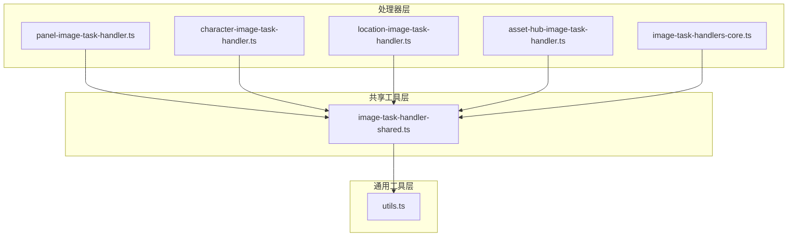
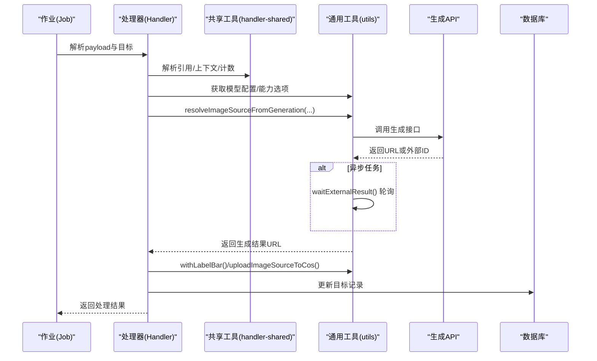
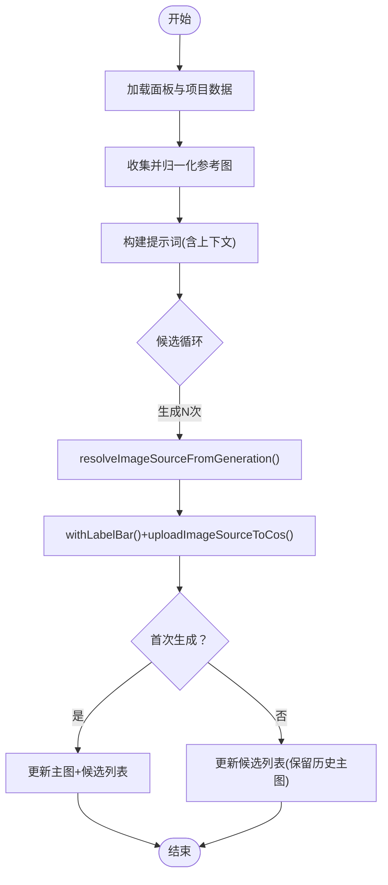

# 图像处理处理器

<cite>
**本文档引用的文件**
- [src/lib/workers/handlers/image-task-handlers-core.ts](file://src/lib/workers/handlers/image-task-handlers-core.ts)
- [src/lib/workers/handlers/panel-image-task-handler.ts](file://src/lib/workers/handlers/panel-image-task-handler.ts)
- [src/lib/workers/handlers/character-image-task-handler.ts](file://src/lib/workers/handlers/character-image-task-handler.ts)
- [src/lib/workers/handlers/location-image-task-handler.ts](file://src/lib/workers/handlers/location-image-task-handler.ts)
- [src/lib/workers/handlers/asset-hub-image-task-handler.ts](file://src/lib/workers/handlers/asset-hub-image-task-handler.ts)
- [src/lib/workers/handlers/image-task-handler-shared.ts](file://src/lib/workers/handlers/image-task-handler-shared.ts)
- [src/lib/workers/handlers/image-task-handlers.ts](file://src/lib/workers/handlers/image-task-handlers.ts)
- [src/lib/workers/utils.ts](file://src/lib/workers/utils.ts)
- [tests/unit/worker/image-task-handlers-core.test.ts](file://tests/unit/worker/image-task-handlers-core.test.ts)
- [tests/unit/worker/panel-image-task-handler.test.ts](file://tests/unit/worker/panel-image-task-handler.test.ts)
- [tests/unit/worker/character-image-task-handler.test.ts](file://tests/unit/worker/character-image-task-handler.test.ts)
- [tests/unit/worker/location-image-task-handler.test.ts](file://tests/unit/worker/location-image-task-handler.test.ts)
</cite>

## 目录
1. [简介](#简介)
2. [项目结构](#项目结构)
3. [核心组件](#核心组件)
4. [架构总览](#架构总览)
5. [详细组件分析](#详细组件分析)
6. [依赖关系分析](#依赖关系分析)
7. [性能考量](#性能考量)
8. [故障排查指南](#故障排查指南)
9. [结论](#结论)
10. [附录](#附录)

## 简介
本文件系统性梳理 Waoowaoo 的图像处理处理器，聚焦于图像任务处理器的通用架构与共享逻辑，涵盖以下方面：
- 共享功能与工具链：统一的图像生成、上传、标注、轮询与持久化流程
- 分类处理器：面板图像、角色图像、场景/道具图像、全局资产库图像
- 输入输出规范、参数校验、错误处理与重试机制
- 与 AI 图像生成服务的集成模式与 API 调用流程
- 性能优化建议：并发控制、缓存策略与内存管理

## 项目结构
图像处理相关代码主要位于 workers/handlers 与 workers/utils 下，采用“按职责分层”的组织方式：
- handlers：各类型图像任务处理器（面板、角色、场景/道具、全局资产库、修改任务等）
- handlers-shared：跨处理器共享的工具函数（解析、引用收集、生成封装等）
- utils：与外部服务交互的通用能力（生成、轮询、上传、标注、模型配置解析等）

图表来源
- [src/lib/workers/handlers/panel-image-task-handler.ts](file://src/lib/workers/handlers/panel-image-task-handler.ts)
- [src/lib/workers/handlers/character-image-task-handler.ts](file://src/lib/workers/handlers/character-image-task-handler.ts)
- [src/lib/workers/handlers/location-image-task-handler.ts](file://src/lib/workers/handlers/location-image-task-handler.ts)
- [src/lib/workers/handlers/asset-hub-image-task-handler.ts](file://src/lib/workers/handlers/asset-hub-image-task-handler.ts)
- [src/lib/workers/handlers/image-task-handlers-core.ts](file://src/lib/workers/handlers/image-task-handlers-core.ts)
- [src/lib/workers/handlers/image-task-handler-shared.ts](file://src/lib/workers/handlers/image-task-handler-shared.ts)
- [src/lib/workers/utils.ts](file://src/lib/workers/utils.ts)

章节来源
- [src/lib/workers/handlers/image-task-handlers.ts](file://src/lib/workers/handlers/image-task-handlers.ts)

## 核心组件
- 通用生成与轮询：resolveImageSourceFromGeneration、waitExternalResult、resolveImageSourcesFromGeneration
- 上传与标注：uploadImageSourceToCos、withLabelBar、stripLabelBar
- 数据解析与引用：parseImageUrls、collectPanelReferenceImages、resolveNovelData
- 任务状态与进度：assertTaskActive、reportTaskProgress
- 模型与能力：getProjectModels、getUserModels、resolveProjectModelCapabilityGenerationOptions

章节来源
- [src/lib/workers/utils.ts](file://src/lib/workers/utils.ts)
- [src/lib/workers/handlers/image-task-handler-shared.ts](file://src/lib/workers/handlers/image-task-handler-shared.ts)

## 架构总览
图像处理处理器遵循“输入解析 → 提示构建 → 生成/轮询 → 标注/上传 → 持久化”的标准流水线，并通过共享模块解耦不同业务类型的差异。

图表来源
- [src/lib/workers/handlers/panel-image-task-handler.ts](file://src/lib/workers/handlers/panel-image-task-handler.ts)
- [src/lib/workers/handlers/character-image-task-handler.ts](file://src/lib/workers/handlers/character-image-task-handler.ts)
- [src/lib/workers/handlers/location-image-task-handler.ts](file://src/lib/workers/handlers/location-image-task-handler.ts)
- [src/lib/workers/handlers/asset-hub-image-task-handler.ts](file://src/lib/workers/handlers/asset-hub-image-task-handler.ts)
- [src/lib/workers/handlers/image-task-handlers-core.ts](file://src/lib/workers/handlers/image-task-handlers-core.ts)
- [src/lib/workers/utils.ts](file://src/lib/workers/utils.ts)

## 详细组件分析

### 面板图像处理器（panel-image-task-handler）
- 业务逻辑
  - 依据项目视频比例确定画幅
  - 收集参考图（草图、角色、场景），归一化后作为参考
  - 构建提示词并生成候选图像，支持多候选
  - 首次生成写入主图与候选列表；重生成仅写入候选并保留历史主图
- 输入输出
  - 输入：panelId、候选数量、项目数据、艺术风格
  - 输出：面板ID、候选数量、主图URL（首次生成）
- 参数校验与错误处理
  - 缺失 panelId 抛错
  - 未配置模型抛错
  - 生成过程通过断点检查任务状态
- 并发与重试
  - 单任务内串行生成多个候选，避免外部任务复用
  - 通过轮询恢复外部任务续接

图表来源
- [src/lib/workers/handlers/panel-image-task-handler.ts](file://src/lib/workers/handlers/panel-image-task-handler.ts)
- [src/lib/workers/utils.ts](file://src/lib/workers/utils.ts)

章节来源
- [src/lib/workers/handlers/panel-image-task-handler.ts](file://src/lib/workers/handlers/panel-image-task-handler.ts)
- [tests/unit/worker/panel-image-task-handler.test.ts](file://tests/unit/worker/panel-image-task-handler.test.ts)

### 角色图像处理器（character-image-task-handler）
- 业务逻辑
  - 选择目标外观（支持按ID或角色主条目）
  - 主外观作为子外观生成的参考，保证一致性
  - 生成多张图像并写入 imageUrls，维护主图索引
- 输入输出
  - 输入：appearanceId 或 characterId、数量/索引、艺术风格
  - 输出：外观ID、图像数量、主图URL
- 参数校验
  - 艺术风格枚举校验
  - 未配置模型抛错
- 错误处理
  - 任务中断即刻终止，避免无效生成

章节来源
- [src/lib/workers/handlers/character-image-task-handler.ts](file://src/lib/workers/handlers/character-image-task-handler.ts)
- [tests/unit/worker/character-image-task-handler.test.ts](file://tests/unit/worker/character-image-task-handler.test.ts)

### 场景/道具图像处理器（location-image-task-handler）
- 业务逻辑
  - 支持 location/prop 两类资产
  - 基于描述与可用槽位构建提示词，附加艺术风格后生成
  - 按请求计数或全部槽位批量生成
- 输入输出
  - 输入：locationId/目标ID、类型、计数、艺术风格
  - 输出：更新数量、关联locationIds
- 参数校验
  - 艺术风格枚举校验
  - 未配置模型抛错
- 错误处理
  - 任务中断即刻终止

章节来源
- [src/lib/workers/handlers/location-image-task-handler.ts](file://src/lib/workers/handlers/location-image-task-handler.ts)
- [tests/unit/worker/location-image-task-handler.test.ts](file://tests/unit/worker/location-image-task-handler.test.ts)

### 全局资产库图像处理器（asset-hub-image-task-handler）
- 业务逻辑
  - 面向全局角色/场景/道具的独立生成
  - 生成后写入全局记录，不参与项目上下文
- 输入输出
  - 输入：类型（角色/场景/道具）、ID、外观索引、数量、艺术风格
  - 输出：类型、目标ID、生成数量
- 参数校验
  - 未配置用户模型抛错
  - 类型非法抛错

章节来源
- [src/lib/workers/handlers/asset-hub-image-task-handler.ts](file://src/lib/workers/handlers/asset-hub-image-task-handler.ts)

### 修改图像任务处理器（image-task-handlers-core）
- 业务逻辑
  - 支持三类修改：角色、场景/道具、分镜
  - 通过 stripLabelBar 去除旧黑边，normalizeReferenceImagesForGeneration 归一化参考图
  - 生成后打上标签并上传，随后持久化到对应实体
- 输入输出
  - 输入：type、目标ID、修改指令、额外参考图、分辨率等
  - 输出：类型、目标ID、新图URL/索引
- 参数校验与错误处理
  - 缺失必要字段抛错
  - 任务中断抛出终止异常
- 重试机制
  - 通过外部任务ID续接，避免重复提交

章节来源
- [src/lib/workers/handlers/image-task-handlers-core.ts](file://src/lib/workers/handlers/image-task-handlers-core.ts)
- [tests/unit/worker/image-task-handlers-core.test.ts](file://tests/unit/worker/image-task-handlers-core.test.ts)

### 共享功能与工具链（image-task-handler-shared）
- 功能清单
  - 解析与归一化：parseJsonStringArray、parseImageUrls、clampCount、pickFirstString
  - 生成封装：generateCleanImageToStorage、generateProjectLabeledImageToStorage
  - 上下文解析：resolveNovelData、parsePanelCharacterReferences、findCharacterByName
  - 参考图收集：collectPanelReferenceImages
- 设计要点
  - 统一生成入口，屏蔽具体提供商差异
  - 明确的错误边界与日志上下文

章节来源
- [src/lib/workers/handlers/image-task-handler-shared.ts](file://src/lib/workers/handlers/image-task-handler-shared.ts)

### 通用工具链（workers/utils）
- 生成与轮询
  - resolveImageSourceFromGeneration：同步/异步统一入口
  - waitExternalResult：超时与进度上报
  - resolveImageSourcesFromGeneration：多图返回封装
- 上传与标注
  - uploadImageSourceToCos：统一媒体入库
  - withLabelBar/stripLabelBar：带/去标签栏
- 任务与模型
  - assertTaskActive：任务生命周期断点
  - getProjectModels/getUserModels：模型配置解析
  - resolveProjectModelCapabilityGenerationOptions：能力选项合并

章节来源
- [src/lib/workers/utils.ts](file://src/lib/workers/utils.ts)

## 依赖关系分析
- 处理器对共享模块的依赖：所有处理器均依赖 shared 工具进行解析与生成封装
- 共享模块对通用工具的依赖：shared 通过 utils 调用生成、上传、标注与模型解析
- 测试对处理器的依赖：单元测试通过 mock 方式覆盖关键路径，验证输入输出与持久化行为

图表来源
- [src/lib/workers/handlers/panel-image-task-handler.ts](file://src/lib/workers/handlers/panel-image-task-handler.ts)
- [src/lib/workers/handlers/character-image-task-handler.ts](file://src/lib/workers/handlers/character-image-task-handler.ts)
- [src/lib/workers/handlers/location-image-task-handler.ts](file://src/lib/workers/handlers/location-image-task-handler.ts)
- [src/lib/workers/handlers/asset-hub-image-task-handler.ts](file://src/lib/workers/handlers/asset-hub-image-task-handler.ts)
- [src/lib/workers/handlers/image-task-handlers-core.ts](file://src/lib/workers/handlers/image-task-handlers-core.ts)
- [src/lib/workers/handlers/image-task-handler-shared.ts](file://src/lib/workers/handlers/image-task-handler-shared.ts)
- [src/lib/workers/utils.ts](file://src/lib/workers/utils.ts)

## 性能考量
- 并发控制
  - 面板生成：单任务内串行候选，避免外部任务复用；如需并发，应拆分为多个任务实例
  - 角色/场景/道具：按需批量生成，注意外部服务限流与令牌消耗
- 缓存策略
  - 参考图归一化与签名URL缓存可减少重复下载与网络开销
  - 生成结果URL可短期缓存于任务上下文，避免重复计算
- 内存管理
  - 标签栏合成与裁剪使用流式处理，避免一次性加载大图
  - Base64 与 Buffer 的转换需及时释放中间对象
- 轮询与超时
  - 合理设置轮询间隔与超时时间，防止长时间占用资源
  - 任务续接优先使用外部ID，避免重复提交

## 故障排查指南
- 常见错误
  - 缺少必要字段：如面板ID、角色外观、模型配置
  - 任务被终止：assertTaskActive 抛出终止异常
  - 外部任务失败/超时：轮询阶段抛出可重试错误
- 定位方法
  - 查看日志上下文（模块、动作、请求ID、任务ID）
  - 校验生成参数（分辨率、画幅、参考图数量）
  - 检查外部服务可用性与配额
- 重试策略
  - 外部任务失败自动重试
  - 服务重启后通过外部ID续接，避免重复生成

章节来源
- [src/lib/workers/utils.ts](file://src/lib/workers/utils.ts)

## 结论
该图像处理处理器体系以共享工具为核心，将提示构建、生成调用、标注上传与持久化流程标准化，同时针对不同业务类型提供差异化策略。通过严格的参数校验、任务断点与外部任务续接机制，确保了稳定性与可恢复性。配合合理的并发与缓存策略，可在保证质量的同时提升吞吐与资源利用率。

## 附录

### 输入输出与参数规范
- 通用输入
  - 任务载荷（payload）：包含目标ID、数量/索引、艺术风格、参考图等
  - 任务元数据：项目ID、用户ID、目标类型、目标ID
- 生成参数
  - 模型键、提示词、参考图数组、画幅、分辨率、提供商
- 输出
  - 处理结果对象：包含类型、目标ID、生成数量/URL等
  - 数据库更新：写入主图、候选列表、描述与可用槽位等

章节来源
- [src/lib/workers/handlers/panel-image-task-handler.ts](file://src/lib/workers/handlers/panel-image-task-handler.ts)
- [src/lib/workers/handlers/character-image-task-handler.ts](file://src/lib/workers/handlers/character-image-task-handler.ts)
- [src/lib/workers/handlers/location-image-task-handler.ts](file://src/lib/workers/handlers/location-image-task-handler.ts)
- [src/lib/workers/handlers/asset-hub-image-task-handler.ts](file://src/lib/workers/handlers/asset-hub-image-task-handler.ts)
- [src/lib/workers/handlers/image-task-handlers-core.ts](file://src/lib/workers/handlers/image-task-handlers-core.ts)