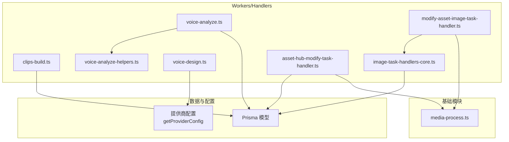
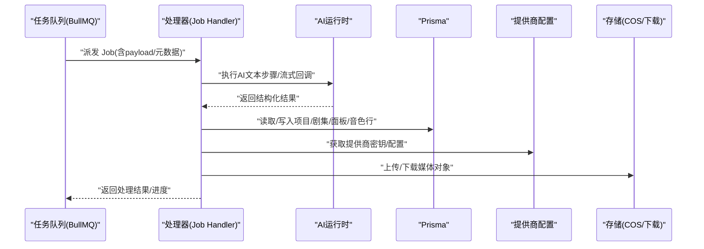
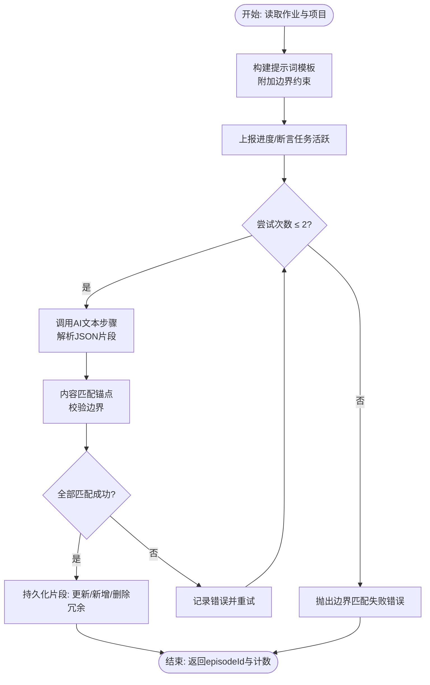
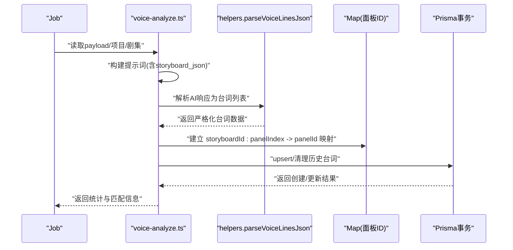
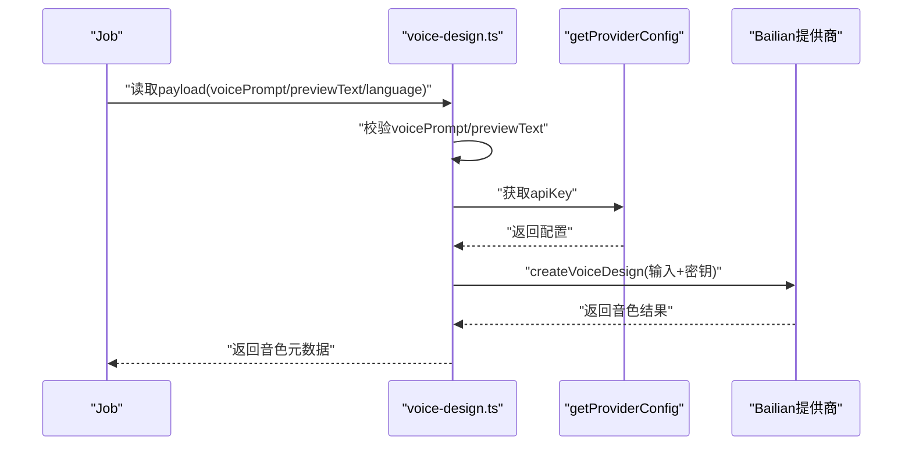
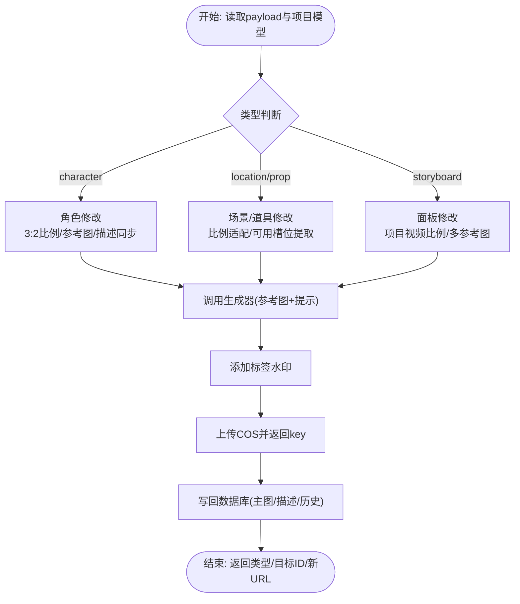
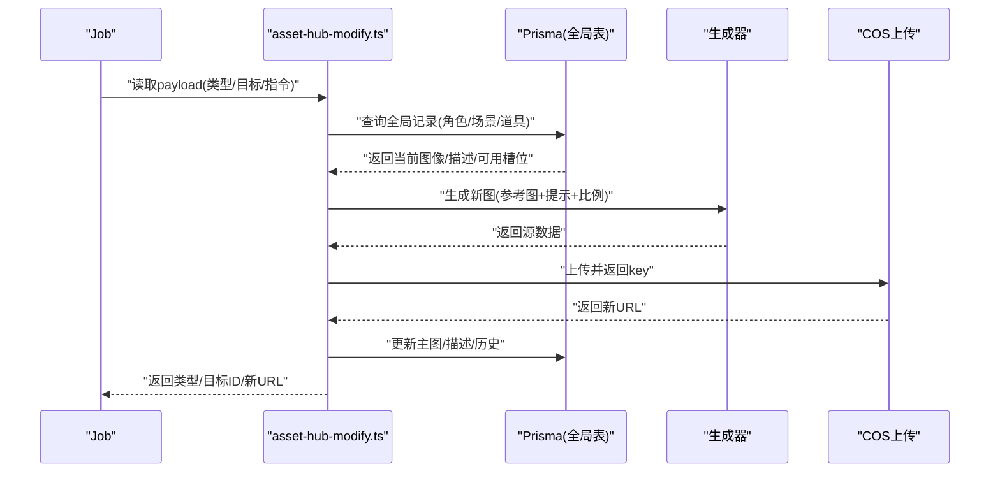
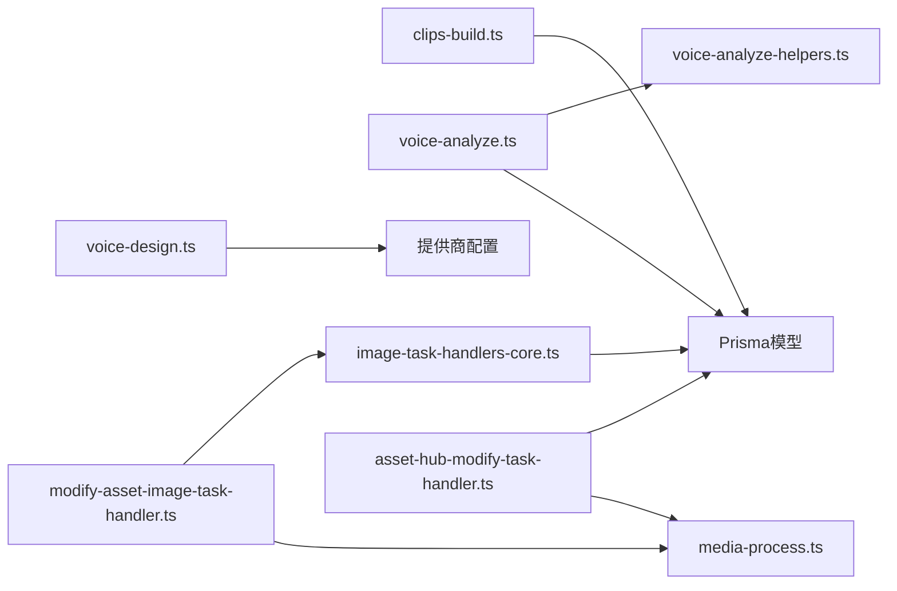

# 媒体处理处理器

<cite>
**本文引用的文件**   
- [src/lib/workers/handlers/clips-build.ts](file://src/lib/workers/handlers/clips-build.ts)
- [src/lib/workers/handlers/voice-analyze.ts](file://src/lib/workers/handlers/voice-analyze.ts)
- [src/lib/workers/handlers/voice-analyze-helpers.ts](file://src/lib/workers/handlers/voice-analyze-helpers.ts)
- [src/lib/workers/handlers/voice-design.ts](file://src/lib/workers/handlers/voice-design.ts)
- [src/lib/workers/handlers/modify-asset-image-task-handler.ts](file://src/lib/workers/handlers/modify-asset-image-task-handler.ts)
- [src/lib/workers/handlers/asset-hub-modify-task-handler.ts](file://src/lib/workers/handlers/asset-hub-modify-task-handler.ts)
- [src/lib/workers/handlers/image-task-handlers-core.ts](file://src/lib/workers/handlers/image-task-handlers-core.ts)
- [src/lib/media-process.ts](file://src/lib/media-process.ts)
</cite>

## 目录
1. [引言](#引言)
2. [项目结构](#项目结构)
3. [核心组件](#核心组件)
4. [架构总览](#架构总览)
5. [详细组件分析](#详细组件分析)
6. [依赖分析](#依赖分析)
7. [性能考虑](#性能考虑)
8. [故障排查指南](#故障排查指南)
9. [结论](#结论)
10. [附录](#附录)

## 引言
本技术文档聚焦于 Waoowaoo 的媒体处理处理器，系统性阐述其核心架构与业务逻辑，覆盖以下关键处理器：
- 片段构建：clips-build.ts，负责将小说文本切分为可执行的视频片段，并进行边界锚定校验与持久化。
- 语音分析：voice-analyze.ts，结合分镜与故事板信息，对台词进行角色归属、情感强度与面板匹配的结构化解析。
- 音色设计：voice-design.ts，基于 Bailian 提供商接口生成定制音色并返回元数据。
- 资产图像修改处理器：modify-asset-image-task-handler.ts 与 image-task-handlers-core.ts，支持角色、场景、道具与分镜面板的图像修改与描述同步。
- 资产库修改处理器：asset-hub-modify-task-handler.ts，面向全局资产库的角色外观与场景/道具图像进行修改与描述更新。

同时，文档解释媒体处理器的输入输出格式、音频/视频处理流程、与音视频服务的集成方式与 API 调用模式，并提供性能优化建议与故障排查要点，帮助读者快速理解与高效使用该能力体系。

## 项目结构
媒体处理相关代码主要位于 workers/handlers 目录下，围绕“任务作业(Job)”驱动的处理流水线展开，配合 Prisma 数据访问层、AI 运行时与提供商配置，形成端到端的媒体处理闭环。



图表来源
- [src/lib/workers/handlers/clips-build.ts:35-284](file://src/lib/workers/handlers/clips-build.ts#L35-L284)
- [src/lib/workers/handlers/voice-analyze.ts:20-346](file://src/lib/workers/handlers/voice-analyze.ts#L20-L346)
- [src/lib/workers/handlers/voice-analyze-helpers.ts:49-95](file://src/lib/workers/handlers/voice-analyze-helpers.ts#L49-L95)
- [src/lib/workers/handlers/voice-design.ts:24-79](file://src/lib/workers/handlers/voice-design.ts#L24-L79)
- [src/lib/workers/handlers/modify-asset-image-task-handler.ts:1-2](file://src/lib/workers/handlers/modify-asset-image-task-handler.ts#L1-L2)
- [src/lib/workers/handlers/image-task-handlers-core.ts:51-371](file://src/lib/workers/handlers/image-task-handlers-core.ts#L51-L371)
- [src/lib/workers/handlers/asset-hub-modify-task-handler.ts:87-278](file://src/lib/workers/handlers/asset-hub-modify-task-handler.ts#L87-L278)
- [src/lib/media-process.ts:32-58](file://src/lib/media-process.ts#L32-L58)

章节来源
- [src/lib/workers/handlers/clips-build.ts:1-284](file://src/lib/workers/handlers/clips-build.ts#L1-L284)
- [src/lib/workers/handlers/voice-analyze.ts:1-346](file://src/lib/workers/handlers/voice-analyze.ts#L1-L346)
- [src/lib/workers/handlers/voice-analyze-helpers.ts:1-95](file://src/lib/workers/handlers/voice-analyze-helpers.ts#L1-L95)
- [src/lib/workers/handlers/voice-design.ts:1-79](file://src/lib/workers/handlers/voice-design.ts#L1-L79)
- [src/lib/workers/handlers/modify-asset-image-task-handler.ts:1-2](file://src/lib/workers/handlers/modify-asset-image-task-handler.ts#L1-L2)
- [src/lib/workers/handlers/image-task-handlers-core.ts:1-371](file://src/lib/workers/handlers/image-task-handlers-core.ts#L1-L371)
- [src/lib/workers/handlers/asset-hub-modify-task-handler.ts:1-278](file://src/lib/workers/handlers/asset-hub-modify-task-handler.ts#L1-L278)
- [src/lib/media-process.ts:1-58](file://src/lib/media-process.ts#L1-L58)

## 核心组件
- 片段构建处理器：接收剧集 ID 与项目上下文，通过 AI 文本步骤生成片段数组，进行边界锚定匹配与数据库持久化，确保片段内容与原文严格对应。
- 语音分析处理器：基于故事板与面板信息，解析台词的说话人、内容与情感强度，并尝试将台词映射到具体面板，最终写回数据库并统计匹配情况。
- 音色设计处理器：校验提示词与预览文本，调用提供商接口创建音色，返回音色标识、采样率、响应格式等元数据。
- 图像修改处理器（项目内）：统一处理角色、场景、道具与分镜面板的图像修改，支持参考图归一化、比例适配、标签水印与 COS 上传，同时可选地同步更新描述字段。
- 资产库修改处理器（全局）：面向全局资产库的角色外观与场景/道具图像进行修改，支持描述同步与可用槽位提取，保证主图与描述一致性。
- 媒体结果处理：提供通用的媒体下载、上传与键生成能力，支持 image/video/audio 三类媒体的统一处理。

章节来源
- [src/lib/workers/handlers/clips-build.ts:35-284](file://src/lib/workers/handlers/clips-build.ts#L35-L284)
- [src/lib/workers/handlers/voice-analyze.ts:20-346](file://src/lib/workers/handlers/voice-analyze.ts#L20-L346)
- [src/lib/workers/handlers/voice-design.ts:24-79](file://src/lib/workers/handlers/voice-design.ts#L24-L79)
- [src/lib/workers/handlers/image-task-handlers-core.ts:51-371](file://src/lib/workers/handlers/image-task-handlers-core.ts#L51-L371)
- [src/lib/workers/handlers/asset-hub-modify-task-handler.ts:87-278](file://src/lib/workers/handlers/asset-hub-modify-task-handler.ts#L87-L278)
- [src/lib/media-process.ts:32-58](file://src/lib/media-process.ts#L32-L58)

## 架构总览
媒体处理处理器遵循“任务驱动 + 分层处理”的架构模式：
- 任务层：BullMQ 作业承载任务元数据与负载，处理器通过 Job 接口读取用户 ID、项目 ID、语言、类型与 payload。
- 执行层：各处理器按职责拆分，分别处理文本切分、语音解析、音色生成与图像修改。
- 数据层：Prisma 访问项目、剧集、故事板、面板、音色行与资产图像等实体，事务性写入与清理。
- 集成层：AI 运行时与提供商配置，如 Bailian 音色设计；存储层封装 COS 上传与视频下载。
- 工具层：进度上报、任务状态断言、参考图归一化、URL 签名与编码等工具函数。



图表来源
- [src/lib/workers/handlers/clips-build.ts:137-206](file://src/lib/workers/handlers/clips-build.ts#L137-L206)
- [src/lib/workers/handlers/voice-analyze.ts:134-226](file://src/lib/workers/handlers/voice-analyze.ts#L134-L226)
- [src/lib/workers/handlers/voice-design.ts:49-59](file://src/lib/workers/handlers/voice-design.ts#L49-L59)
- [src/lib/media-process.ts:32-58](file://src/lib/media-process.ts#L32-L58)

## 详细组件分析

### 片段构建处理器（clips-build.ts）
- 输入：作业包含项目 ID、用户 ID、语言、payload.episodeId；处理器会读取项目中的角色/地点/道具库信息与分析模型。
- 处理流程：
  - 准备阶段：构建提示词模板，附加边界约束；上报进度并断言任务活跃。
  - AI 解析：多次尝试（最多两次）调用 AI 文本步骤，解析 JSON 数组片段；若解析失败或边界不匹配则重试。
  - 边界匹配：使用内容匹配器在原文中定位每个片段的起止锚点，确保可溯源。
  - 持久化：对比现有片段，更新或新增，删除多余片段，事务性写入。
- 输出：返回剧集 ID 与片段数量，用于后续视频生成与配音调度。



图表来源
- [src/lib/workers/handlers/clips-build.ts:35-284](file://src/lib/workers/handlers/clips-build.ts#L35-L284)

章节来源
- [src/lib/workers/handlers/clips-build.ts:35-284](file://src/lib/workers/handlers/clips-build.ts#L35-L284)

### 语音分析处理器（voice-analyze.ts + voice-analyze-helpers.ts）
- 输入：剧集 ID、项目角色库、故事板与面板集合；构建包含面板文本片段、描述与角色信息的 JSON。
- 处理流程：
  - 准备阶段：构建提示词模板，上报进度并断言任务活跃。
  - AI 解析：多次尝试解析台词列表，严格校验 lineIndex、speaker、content、emotionStrength 与 matchedPanel。
  - 面板映射：将 matchedPanel 的 storyboardId 与 panelIndex 映射到实际面板 ID，确保存在性。
  - 持久化：事务性 upsert/清理，统计匹配数量与说话人分布。
- 输出：返回剧集 ID、台词总数、匹配数量与说话人统计。



图表来源
- [src/lib/workers/handlers/voice-analyze.ts:20-346](file://src/lib/workers/handlers/voice-analyze.ts#L20-L346)
- [src/lib/workers/handlers/voice-analyze-helpers.ts:49-95](file://src/lib/workers/handlers/voice-analyze-helpers.ts#L49-L95)

章节来源
- [src/lib/workers/handlers/voice-analyze.ts:20-346](file://src/lib/workers/handlers/voice-analyze.ts#L20-L346)
- [src/lib/workers/handlers/voice-analyze-helpers.ts:1-95](file://src/lib/workers/handlers/voice-analyze-helpers.ts#L1-L95)

### 音色设计处理器（voice-design.ts）
- 输入：voicePrompt、previewText、preferredName、language；进行格式与长度校验。
- 处理流程：
  - 校验提示词与预览文本有效性。
  - 获取提供商配置（Bailian），构造输入参数。
  - 调用提供商接口创建音色，返回音色标识与元数据。
- 输出：success、voiceId、targetModel、audioBase64、sampleRate、responseFormat、usageCount、requestId、taskType。



图表来源
- [src/lib/workers/handlers/voice-design.ts:24-79](file://src/lib/workers/handlers/voice-design.ts#L24-L79)

章节来源
- [src/lib/workers/handlers/voice-design.ts:1-79](file://src/lib/workers/handlers/voice-design.ts#L1-L79)

### 图像修改处理器（modify-asset-image-task-handler.ts + image-task-handlers-core.ts）
- 入口别名：modify-asset-image-task-handler.ts 导出 handleModifyAssetImageTask。
- 统一核心：image-task-handlers-core.ts 支持三类修改：
  - 角色：修改角色外观图，保持核心特征一致，支持参考图归一化、比例 3:2、标签水印与描述同步。
  - 场景/道具：修改场景或道具图，按类型选择不同比例，支持可用槽位提取与描述更新。
  - 分镜面板：修改面板图，按项目视频比例缩放，支持多参考图与候选清空。
- 流程：解析目标与索引 → 生成参考图集合 → 调用生成器 → 标签水印 → 上传 COS → 写回数据库。



图表来源
- [src/lib/workers/handlers/modify-asset-image-task-handler.ts:1-2](file://src/lib/workers/handlers/modify-asset-image-task-handler.ts#L1-L2)
- [src/lib/workers/handlers/image-task-handlers-core.ts:51-371](file://src/lib/workers/handlers/image-task-handlers-core.ts#L51-L371)

章节来源
- [src/lib/workers/handlers/modify-asset-image-task-handler.ts:1-2](file://src/lib/workers/handlers/modify-asset-image-task-handler.ts#L1-L2)
- [src/lib/workers/handlers/image-task-handlers-core.ts:51-371](file://src/lib/workers/handlers/image-task-handlers-core.ts#L51-L371)

### 资产库修改处理器（asset-hub-modify-task-handler.ts）
- 输入：全局角色/场景/道具的目标 ID、外观索引/图像索引、修改指令与额外参考图。
- 处理流程：
  - 角色：读取外观与图像列表，生成参考图集合，调用生成器生成新图，同步描述字段（若可用）。
  - 场景/道具：读取目标图像，生成参考图集合，按类型设置比例，生成新图并更新描述与可用槽位。
- 输出：返回类型、目标 ID 与新图像 URL。



图表来源
- [src/lib/workers/handlers/asset-hub-modify-task-handler.ts:87-278](file://src/lib/workers/handlers/asset-hub-modify-task-handler.ts#L87-L278)

章节来源
- [src/lib/workers/handlers/asset-hub-modify-task-handler.ts:1-278](file://src/lib/workers/handlers/asset-hub-modify-task-handler.ts#L1-L278)

### 媒体结果处理（media-process.ts）
- 功能：统一处理媒体下载、上传与键生成，自动推断扩展名与 MIME 类型，支持 data URL、远程 URL 与 Buffer 三种输入。
- 使用场景：图像修改与资产库修改后的新图上传；视频生成后的下载与上传。

```mermaid
flowchart TD
In(["输入: source/type/keyPrefix/targetId"]) --> Ext["推断扩展名与MIME"]
Ext --> Check{"source类型?"}
Check --> |data:| B64["解析base64并转Buffer"]
Check --> |string(URL)| DL["fetch/下载"]
Check --> |Buffer| Use["直接使用"]
B64 --> Upload["uploadObject(key,content-type)"]
DL --> Upload
Use --> Upload
Upload --> Out(["返回COS key"])
```

图表来源
- [src/lib/media-process.ts:32-58](file://src/lib/media-process.ts#L32-L58)

章节来源
- [src/lib/media-process.ts:1-58](file://src/lib/media-process.ts#L1-L58)

## 依赖分析
- 组件耦合：
  - clips-build.ts 与 voice-analyze.ts 均依赖 Prisma 模型与 AI 运行时，共享进度上报与任务断言工具。
  - voice-analyze.ts 依赖 voice-analyze-helpers.ts 的结构化解析与 JSON 构建。
  - image-task-handlers-core.ts 与 asset-hub-modify-task-handler.ts 共享参考图归一化、比例常量、COS 上传与描述同步逻辑。
  - voice-design.ts 依赖提供商配置与 Bailian 接口。
- 外部依赖：
  - BullMQ 作业队列与流式回调上下文。
  - 存储层：COS 上传与视频下载。
  - AI 运行时：外部模型与流式回调。
- 循环依赖：未发现循环导入；各处理器职责清晰，通过工具函数与 Prisma 模型解耦。



图表来源
- [src/lib/workers/handlers/clips-build.ts:1-284](file://src/lib/workers/handlers/clips-build.ts#L1-L284)
- [src/lib/workers/handlers/voice-analyze.ts:1-346](file://src/lib/workers/handlers/voice-analyze.ts#L1-L346)
- [src/lib/workers/handlers/voice-analyze-helpers.ts:1-95](file://src/lib/workers/handlers/voice-analyze-helpers.ts#L1-L95)
- [src/lib/workers/handlers/voice-design.ts:1-79](file://src/lib/workers/handlers/voice-design.ts#L1-L79)
- [src/lib/workers/handlers/modify-asset-image-task-handler.ts:1-2](file://src/lib/workers/handlers/modify-asset-image-task-handler.ts#L1-L2)
- [src/lib/workers/handlers/image-task-handlers-core.ts:1-371](file://src/lib/workers/handlers/image-task-handlers-core.ts#L1-L371)
- [src/lib/workers/handlers/asset-hub-modify-task-handler.ts:1-278](file://src/lib/workers/handlers/asset-hub-modify-task-handler.ts#L1-L278)
- [src/lib/media-process.ts:1-58](file://src/lib/media-process.ts#L1-L58)

章节来源
- [src/lib/workers/handlers/clips-build.ts:1-284](file://src/lib/workers/handlers/clips-build.ts#L1-L284)
- [src/lib/workers/handlers/voice-analyze.ts:1-346](file://src/lib/workers/handlers/voice-analyze.ts#L1-L346)
- [src/lib/workers/handlers/voice-analyze-helpers.ts:1-95](file://src/lib/workers/handlers/voice-analyze-helpers.ts#L1-L95)
- [src/lib/workers/handlers/voice-design.ts:1-79](file://src/lib/workers/handlers/voice-design.ts#L1-L79)
- [src/lib/workers/handlers/modify-asset-image-task-handler.ts:1-2](file://src/lib/workers/handlers/modify-asset-image-task-handler.ts#L1-L2)
- [src/lib/workers/handlers/image-task-handlers-core.ts:1-371](file://src/lib/workers/handlers/image-task-handlers-core.ts#L1-L371)
- [src/lib/workers/handlers/asset-hub-modify-task-handler.ts:1-278](file://src/lib/workers/handlers/asset-hub-modify-task-handler.ts#L1-L278)
- [src/lib/media-process.ts:1-58](file://src/lib/media-process.ts#L1-L58)

## 性能考虑
- 编码与格式优化
  - 媒体结果处理默认采用高性能容器与压缩格式：视频使用 mp4，音频使用 mp3，图像使用高质量压缩格式；可根据分辨率与带宽动态调整分辨率选项以平衡质量与传输成本。
- 并发处理
  - 任务队列采用 BullMQ，建议按处理器类型划分队列优先级；对图像修改与片段构建等 CPU/IO 密集型任务，合理设置并发度与重试策略，避免阻塞关键路径。
- 参考图归一化
  - 在图像修改前对参考图进行归一化与去重，减少生成器负担与重复计算；仅保留必要参考图，避免冗余输入导致的性能下降。
- 数据库事务
  - 对需要强一致性的操作（如片段构建与语音分析）使用事务，减少中间态写入；对批量 upsert/清理操作，尽量合并为单次事务以降低锁竞争。
- 缓存与进度
  - 利用进度上报与断言机制，避免重复计算；对边界匹配与面板映射等可缓存的中间结果，结合任务 ID 与输入指纹进行缓存复用。
- 存储与网络
  - 使用签名 URL 与 CDN 加速，缩短媒体下载时间；对大体积视频，采用分片下载与断点续传策略，提升稳定性。

## 故障排查指南
- 片段构建
  - 症状：边界匹配失败或解析为空数组。
  - 排查：检查提示词模板是否包含边界约束；确认 AI 响应可被安全解析为 JSON 数组；核对原文锚点是否存在歧义。
- 语音分析
  - 症状：面板映射失败或台词字段缺失。
  - 排查：确认 storyboards 与 panels 是否存在；检查 matchedPanel 的 storyboardId 与 panelIndex 是否有效；验证 lineIndex 与 speaker 的合法性。
- 音色设计
  - 症状：提示词或预览文本无效，或提供商调用失败。
  - 排查：校验 voicePrompt 与 previewText 的长度与格式；确认提供商配置正确且可用；查看提供商返回的错误信息。
- 图像修改
  - 症状：目标图像不存在或生成失败。
  - 排查：确认目标类型与索引有效；检查参考图归一化与 URL 签名；核对生成器模型与分辨率配置；关注描述同步异常日志。
- 资产库修改
  - 症状：全局记录未找到或主图未更新。
  - 排查：确认用户权限与目标 ID；检查可用槽位提取与描述字段拼装；核对上传 key 与数据库写入顺序。

章节来源
- [src/lib/workers/handlers/clips-build.ts:137-210](file://src/lib/workers/handlers/clips-build.ts#L137-L210)
- [src/lib/workers/handlers/voice-analyze.ts:134-230](file://src/lib/workers/handlers/voice-analyze.ts#L134-L230)
- [src/lib/workers/handlers/voice-design.ts:33-59](file://src/lib/workers/handlers/voice-design.ts#L33-L59)
- [src/lib/workers/handlers/image-task-handlers-core.ts:72-170](file://src/lib/workers/handlers/image-task-handlers-core.ts#L72-L170)
- [src/lib/workers/handlers/asset-hub-modify-task-handler.ts:101-192](file://src/lib/workers/handlers/asset-hub-modify-task-handler.ts#L101-L192)

## 结论
Waoowaoo 的媒体处理处理器以任务驱动为核心，围绕文本切分、语音解析、音色生成与图像修改四大能力，构建了从内容到画面与声音的完整处理链路。通过严格的边界校验、面板映射与描述同步，确保产出质量与一致性；借助统一的媒体处理与存储抽象，简化了跨类型媒体的处理复杂度。建议在生产环境中结合并发控制、缓存与事务优化，持续提升吞吐与稳定性。

## 附录
- 输入输出格式概览
  - 片段构建：输入剧集 ID 与项目上下文；输出剧集 ID 与片段数量。
  - 语音分析：输入剧集 ID 与故事板；输出剧集 ID、台词总数、匹配数量与说话人统计。
  - 音色设计：输入 voicePrompt/previewText/language；输出音色元数据。
  - 图像修改：输入类型/目标/指令与参考图；输出类型/目标 ID 与新 URL。
  - 资产库修改：输入全局目标与指令；输出类型/目标 ID 与新 URL。
- 集成与 API 调用模式
  - 通过提供商配置获取密钥，调用提供商接口；AI 文本步骤与流式回调贯穿多个处理器；存储层统一封装上传与下载。