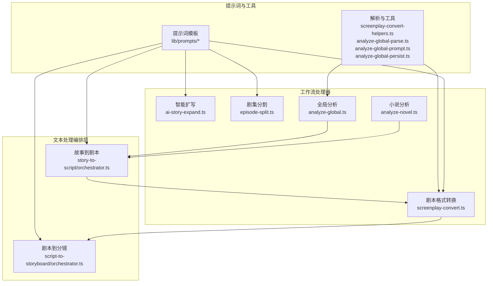
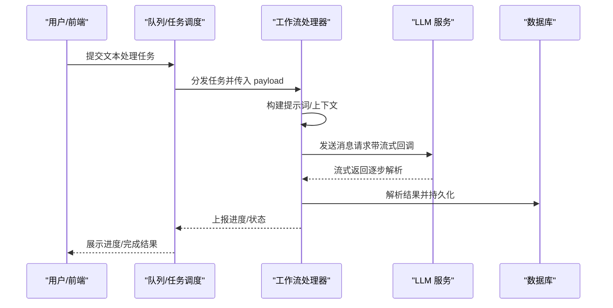
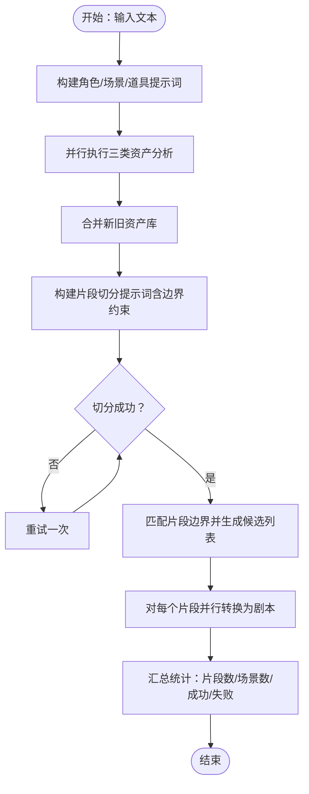
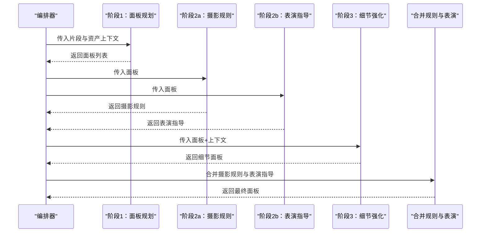
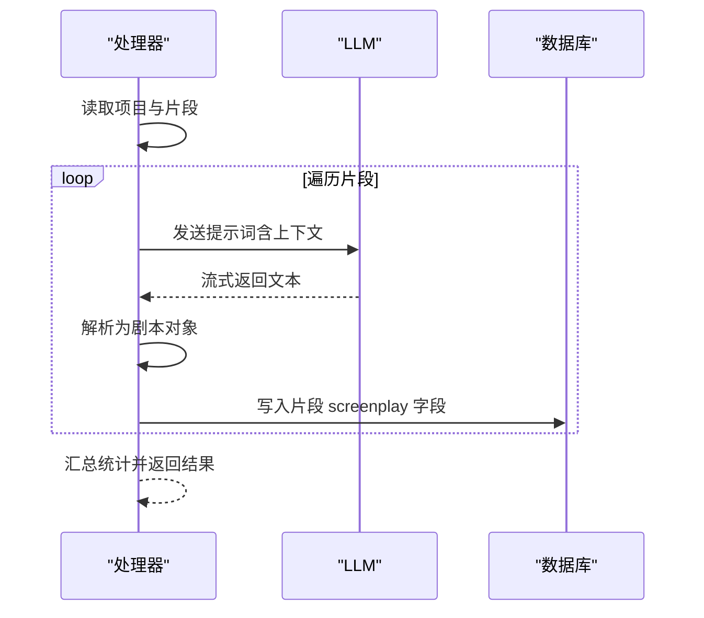
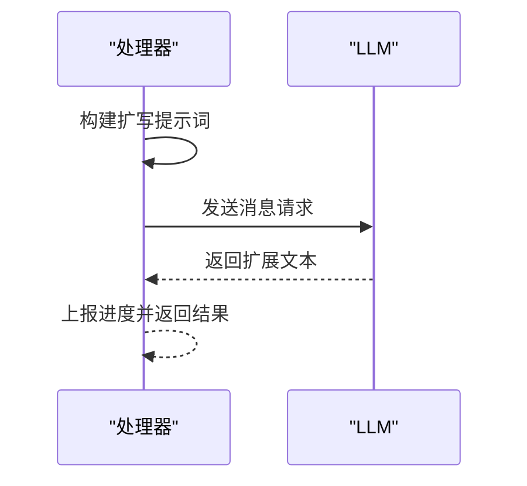
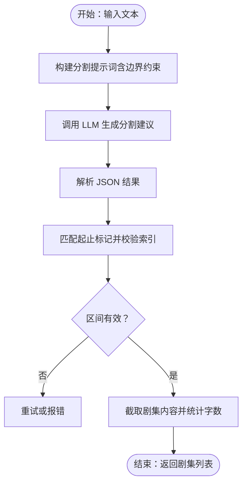
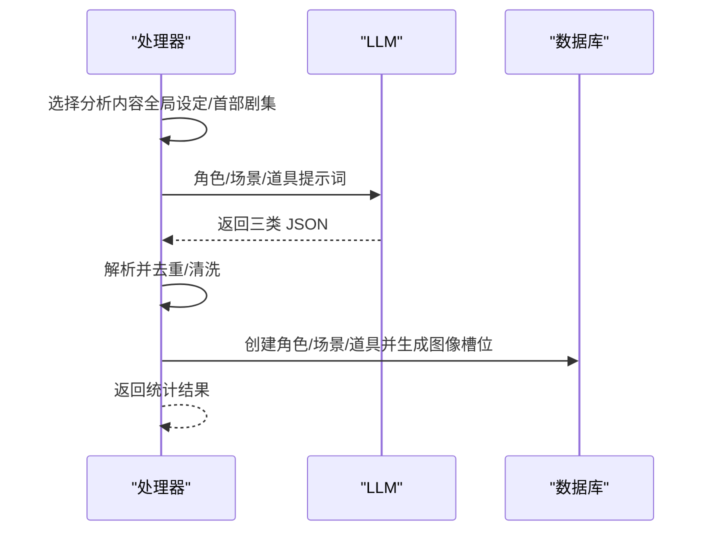
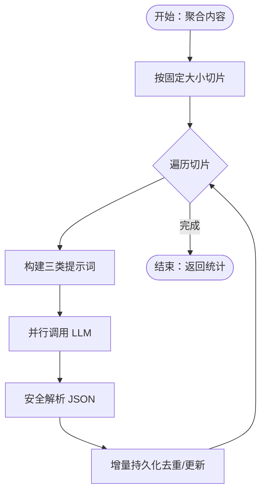
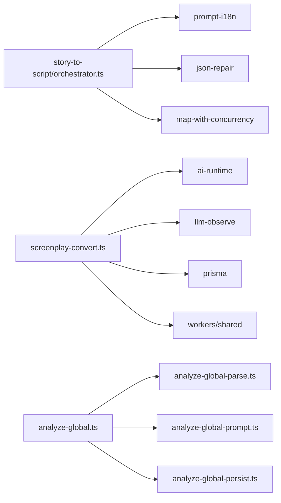

# 文本处理处理器

<cite>
**本文引用的文件**
- [story-to-script/orchestrator.ts](file://src/lib/novel-promotion/story-to-script/orchestrator.ts)
- [script-to-storyboard/orchestrator.ts](file://src/lib/novel-promotion/script-to-storyboard/orchestrator.ts)
- [screenplay-convert.ts](file://src/lib/workers/handlers/screenplay-convert.ts)
- [screenplay-convert-helpers.ts](file://src/lib/workers/handlers/screenplay-convert-helpers.ts)
- [ai-story-expand.ts](file://src/lib/workers/handlers/ai-story-expand.ts)
- [episode-split.ts](file://src/lib/workers/handlers/episode-split.ts)
- [analyze-novel.ts](file://src/lib/workers/handlers/analyze-novel.ts)
- [analyze-global.ts](file://src/lib/workers/handlers/analyze-global.ts)
- [analyze-global-parse.ts](file://src/lib/workers/handlers/analyze-global-parse.ts)
- [analyze-global-prompt.ts](file://src/lib/workers/handlers/analyze-global-prompt.ts)
- [analyze-global-persist.ts](file://src/lib/workers/handlers/analyze-global-persist.ts)
</cite>

## 目录
1. [简介](#简介)
2. [项目结构](#项目结构)
3. [核心组件](#核心组件)
4. [架构总览](#架构总览)
5. [详细组件分析](#详细组件分析)
6. [依赖关系分析](#依赖关系分析)
7. [性能考量](#性能考量)
8. [故障排查指南](#故障排查指南)
9. [结论](#结论)
10. [附录](#附录)

## 简介
本技术文档面向 Waoowaoo 的文本处理处理器，系统性阐述其核心架构与业务逻辑，重点覆盖以下能力：
- 故事到剧本：将长篇小说/文本切分为片段，并逐片段生成标准剧本格式
- 剧本到分镜：将剧本转换为可执行的分镜板计划，包含摄影规则与表演指导
- 剧本格式转换：将片段内容转换为标准化剧本对象
- 智能扩写：基于提示词模板对输入进行创意扩展
- 剧集分割：自动识别章节标记并切分剧集
- 小说分析：从单部作品中抽取角色、场景、道具等资产
- 全局分析：跨剧集聚合分析，增量更新项目资产库

文档还解释输入输出格式、NLP 流程、AI 模型集成方式、性能优化策略与错误处理机制，并给出与 LLM 服务的交互模式与提示词工程最佳实践。

## 项目结构
文本处理相关代码主要分布在如下位置：
- 核心编排器：src/lib/novel-promotion 下的故事到剧本与剧本到分镜编排器
- 工作流处理器：src/lib/workers/handlers 下的各类任务处理器
- 提示词模板：lib/prompts 下的多语言提示词资源
- 数据持久化：Prisma 模型与数据库迁移位于 prisma/schema.prisma

**图表来源**
- [story-to-script/orchestrator.ts:1-597](file://src/lib/novel-promotion/story-to-script/orchestrator.ts#L1-L597)
- [script-to-storyboard/orchestrator.ts:1-509](file://src/lib/novel-promotion/script-to-storyboard/orchestrator.ts#L1-L509)
- [screenplay-convert.ts:1-258](file://src/lib/workers/handlers/screenplay-convert.ts#L1-L258)
- [ai-story-expand.ts:1-80](file://src/lib/workers/handlers/ai-story-expand.ts#L1-L80)
- [episode-split.ts:1-257](file://src/lib/workers/handlers/episode-split.ts#L1-L257)
- [analyze-novel.ts:1-393](file://src/lib/workers/handlers/analyze-novel.ts#L1-L393)
- [analyze-global.ts:1-232](file://src/lib/workers/handlers/analyze-global.ts#L1-L232)
- [screenplay-convert-helpers.ts:1-17](file://src/lib/workers/handlers/screenplay-convert-helpers.ts#L1-L17)
- [analyze-global-parse.ts:1-109](file://src/lib/workers/handlers/analyze-global-parse.ts#L1-L109)
- [analyze-global-prompt.ts:1-41](file://src/lib/workers/handlers/analyze-global-prompt.ts#L1-L41)
- [analyze-global-persist.ts:1-240](file://src/lib/workers/handlers/analyze-global-persist.ts#L1-L240)

**章节来源**
- [story-to-script/orchestrator.ts:1-597](file://src/lib/novel-promotion/story-to-script/orchestrator.ts#L1-L597)
- [script-to-storyboard/orchestrator.ts:1-509](file://src/lib/novel-promotion/script-to-storyboard/orchestrator.ts#L1-L509)
- [screenplay-convert.ts:1-258](file://src/lib/workers/handlers/screenplay-convert.ts#L1-L258)
- [ai-story-expand.ts:1-80](file://src/lib/workers/handlers/ai-story-expand.ts#L1-L80)
- [episode-split.ts:1-257](file://src/lib/workers/handlers/episode-split.ts#L1-L257)
- [analyze-novel.ts:1-393](file://src/lib/workers/handlers/analyze-novel.ts#L1-L393)
- [analyze-global.ts:1-232](file://src/lib/workers/handlers/analyze-global.ts#L1-L232)
- [screenplay-convert-helpers.ts:1-17](file://src/lib/workers/handlers/screenplay-convert-helpers.ts#L1-L17)
- [analyze-global-parse.ts:1-109](file://src/lib/workers/handlers/analyze-global-parse.ts#L1-L109)
- [analyze-global-prompt.ts:1-41](file://src/lib/workers/handlers/analyze-global-prompt.ts#L1-L41)
- [analyze-global-persist.ts:1-240](file://src/lib/workers/handlers/analyze-global-persist.ts#L1-L240)

## 核心组件
- 故事到剧本编排器：负责并行分析角色/场景/道具、切分片段、并行转换为剧本，支持边界回退与重试
- 剧本到分镜编排器：按片段执行“规划-摄影-表演-细节”四阶段，合并摄影规则与表演指导
- 剧本格式转换处理器：将片段内容转换为标准剧本对象并持久化
- 智能扩写处理器：基于模板对输入进行创意扩写
- 剧集分割处理器：基于边界标记切分剧集并校验范围
- 小说分析处理器：从单部作品中抽取资产并入库
- 全局分析处理器：按切片聚合分析，增量更新项目资产库

**章节来源**
- [story-to-script/orchestrator.ts:244-597](file://src/lib/novel-promotion/story-to-script/orchestrator.ts#L244-L597)
- [script-to-storyboard/orchestrator.ts:285-509](file://src/lib/novel-promotion/script-to-storyboard/orchestrator.ts#L285-L509)
- [screenplay-convert.ts:23-258](file://src/lib/workers/handlers/screenplay-convert.ts#L23-L258)
- [ai-story-expand.ts:14-80](file://src/lib/workers/handlers/ai-story-expand.ts#L14-L80)
- [episode-split.ts:58-257](file://src/lib/workers/handlers/episode-split.ts#L58-L257)
- [analyze-novel.ts:46-393](file://src/lib/workers/handlers/analyze-novel.ts#L46-L393)
- [analyze-global.ts:27-232](file://src/lib/workers/handlers/analyze-global.ts#L27-L232)

## 架构总览
整体处理链路自上而下分为三层：
- 任务编排层：故事到剧本与剧本到分镜编排器，负责步骤拆分、并发控制、重试与日志
- 处理器层：各具体任务处理器，封装与 LLM 的交互、提示词构建、结果解析与持久化
- 提示词与工具层：统一的提示词模板加载、JSON 修复、资产上下文构建与切片工具

**图表来源**
- [screenplay-convert.ts:130-184](file://src/lib/workers/handlers/screenplay-convert.ts#L130-L184)
- [episode-split.ts:122-142](file://src/lib/workers/handlers/episode-split.ts#L122-L142)
- [ai-story-expand.ts:44-61](file://src/lib/workers/handlers/ai-story-expand.ts#L44-L61)
- [analyze-novel.ts:137-190](file://src/lib/workers/handlers/analyze-novel.ts#L137-L190)
- [analyze-global.ts:134-181](file://src/lib/workers/handlers/analyze-global.ts#L134-L181)

## 详细组件分析

### 故事到剧本（story-to-script）
- 并行分析：角色、场景、道具三类资产并行分析，使用并发映射与工作流并发配置
- 片段切分：基于模板生成提示词，附加边界约束，多次尝试以确保锚点可定位
- 剧本转换：对每个片段并行生成标准剧本对象，统计成功/失败与场景总数
- 错误与重试：针对 JSON 解析异常与可重试错误进行指数退避重试，记录日志

**图表来源**
- [story-to-script/orchestrator.ts:285-597](file://src/lib/novel-promotion/story-to-script/orchestrator.ts#L285-L597)

**章节来源**
- [story-to-script/orchestrator.ts:244-597](file://src/lib/novel-promotion/story-to-script/orchestrator.ts#L244-L597)

### 剧本到分镜（script-to-storyboard）
- 四阶段流水线：规划面板 → 摄影规则 → 表演指导 → 细节强化
- 并行与串行：阶段内并行，阶段间严格依赖；最终合并摄影与表演信息
- 结果过滤：仅保留描述与地点有效的面板
- 错误与重试：针对 JSON 解析与可重试错误进行重试与延迟

**图表来源**
- [script-to-storyboard/orchestrator.ts:307-484](file://src/lib/novel-promotion/script-to-storyboard/orchestrator.ts#L307-L484)

**章节来源**
- [script-to-storyboard/orchestrator.ts:285-509](file://src/lib/novel-promotion/script-to-storyboard/orchestrator.ts#L285-L509)

### 剧本格式转换（screenplay-convert）
- 输入：项目、剧集、片段集合
- 处理：逐片段构建提示词，调用 LLM 执行文本生成，解析为标准剧本对象并持久化
- 进度：分阶段上报进度，记录提示词与输出用于审计
- 完成：统计成功/失败与场景总数，部分失败时抛出汇总错误

**图表来源**
- [screenplay-convert.ts:98-226](file://src/lib/workers/handlers/screenplay-convert.ts#L98-L226)
- [screenplay-convert-helpers.ts:9-15](file://src/lib/workers/handlers/screenplay-convert-helpers.ts#L9-L15)

**章节来源**
- [screenplay-convert.ts:23-258](file://src/lib/workers/handlers/screenplay-convert.ts#L23-L258)
- [screenplay-convert-helpers.ts:1-17](file://src/lib/workers/handlers/screenplay-convert-helpers.ts#L1-L17)

### 智能扩写（ai-story-expand）
- 输入：原始提示与分析模型
- 处理：构建扩写提示词，调用 LLM 生成扩展文本
- 输出：返回扩展后的文本

**图表来源**
- [ai-story-expand.ts:26-78](file://src/lib/workers/handlers/ai-story-expand.ts#L26-L78)

**章节来源**
- [ai-story-expand.ts:14-80](file://src/lib/workers/handlers/ai-story-expand.ts#L14-L80)

### 剧集分割（episode-split）
- 输入：项目文本
- 处理：构建分割提示词，附加边界约束；解析 AI 结果，匹配标记锚点，校验索引偏差与区间有效性
- 输出：剧集列表（编号、标题、摘要、内容、字数）

**图表来源**
- [episode-split.ts:118-256](file://src/lib/workers/handlers/episode-split.ts#L118-L256)

**章节来源**
- [episode-split.ts:58-257](file://src/lib/workers/handlers/episode-split.ts#L58-L257)

### 小说分析（analyze-novel）
- 输入：项目全局资产设定或首部剧集内容
- 处理：并行分析角色、场景、道具，解析 JSON，去重与清洗，入库并生成图像槽位
- 输出：新增资产数量与最终统计

**图表来源**
- [analyze-novel.ts:137-392](file://src/lib/workers/handlers/analyze-novel.ts#L137-L392)

**章节来源**
- [analyze-novel.ts:46-393](file://src/lib/workers/handlers/analyze-novel.ts#L46-L393)

### 全局分析（analyze-global）
- 输入：项目全局设定与全部剧集文本
- 处理：内容切片、模板加载、构建三类提示词、并行分析、安全解析、增量持久化
- 输出：统计新旧资产数量与跳过数量

**图表来源**
- [analyze-global.ts:110-231](file://src/lib/workers/handlers/analyze-global.ts#L110-L231)
- [analyze-global-parse.ts:27-42](file://src/lib/workers/handlers/analyze-global-parse.ts#L27-L42)
- [analyze-global-prompt.ts:19-40](file://src/lib/workers/handlers/analyze-global-prompt.ts#L19-L40)
- [analyze-global-persist.ts:42-239](file://src/lib/workers/handlers/analyze-global-persist.ts#L42-L239)

**章节来源**
- [analyze-global.ts:27-232](file://src/lib/workers/handlers/analyze-global.ts#L27-L232)
- [analyze-global-parse.ts:1-109](file://src/lib/workers/handlers/analyze-global-parse.ts#L1-L109)
- [analyze-global-prompt.ts:1-41](file://src/lib/workers/handlers/analyze-global-prompt.ts#L1-L41)
- [analyze-global-persist.ts:1-240](file://src/lib/workers/handlers/analyze-global-persist.ts#L1-L240)

## 依赖关系分析
- 编排器依赖：
  - 提示词模板加载（prompt-i18n）
  - JSON 修复工具（json-repair）
  - 并发映射（map-with-concurrency）
  - 日志与错误归一化（logging/core、errors/normalize）
- 处理器依赖：
  - LLM 执行器（ai-runtime）、内部流回调（llm-observe）
  - 任务进度上报（workers/shared）、任务状态断言（workers/utils）
  - 数据库（prisma）、资产上下文构建（assets/services）
- 工具层：
  - 切片与别名解析（analyze-global-parse）
  - 提示词模板拼装（analyze-global-prompt）
  - 增量持久化（analyze-global-persist）

**图表来源**
- [story-to-script/orchestrator.ts:1-10](file://src/lib/novel-promotion/story-to-script/orchestrator.ts#L1-L10)
- [screenplay-convert.ts:1-19](file://src/lib/workers/handlers/screenplay-convert.ts#L1-L19)
- [analyze-global.ts:1-22](file://src/lib/workers/handlers/analyze-global.ts#L1-L22)
- [analyze-global-parse.ts:1-109](file://src/lib/workers/handlers/analyze-global-parse.ts#L1-L109)
- [analyze-global-prompt.ts:1-41](file://src/lib/workers/handlers/analyze-global-prompt.ts#L1-L41)
- [analyze-global-persist.ts:1-240](file://src/lib/workers/handlers/analyze-global-persist.ts#L1-L240)

**章节来源**
- [story-to-script/orchestrator.ts:1-10](file://src/lib/novel-promotion/story-to-script/orchestrator.ts#L1-L10)
- [screenplay-convert.ts:1-19](file://src/lib/workers/handlers/screenplay-convert.ts#L1-L19)
- [analyze-global.ts:1-22](file://src/lib/workers/handlers/analyze-global.ts#L1-L22)
- [analyze-global-parse.ts:1-109](file://src/lib/workers/handlers/analyze-global-parse.ts#L1-L109)
- [analyze-global-prompt.ts:1-41](file://src/lib/workers/handlers/analyze-global-prompt.ts#L1-L41)
- [analyze-global-persist.ts:1-240](file://src/lib/workers/handlers/analyze-global-persist.ts#L1-L240)

## 性能考量
- 并发控制
  - 使用工作流并发值规范化与映射并发，避免过度并发导致 LLM 或数据库压力
  - 剧本到分镜与故事到剧本均采用分组并行与阶段并行相结合的方式
- 重试与抖动
  - 指数退避 + 随机抖动，降低瞬时峰值
  - 针对 JSON 解析异常与特定错误类型启用可恢复重试
- I/O 与解析
  - 使用 JSON 修复工具提升鲁棒性
  - 对大文本进行切片（全局分析）与边界锚定（剧集分割），减少一次性处理开销
- 进度与可观测性
  - 分阶段上报进度，便于前端反馈与任务监控
  - 记录提示词与输出，支持审计与复现

[本节为通用性能讨论，无需列出具体文件来源]

## 故障排查指南
- 剧本转换失败
  - 检查片段内容是否为空、提示词是否正确拼接、AI 返回是否为空
  - 关注解析错误与任务终止错误，必要时查看日志中的原始输出
- 剧集分割失败
  - 校验边界标记是否可定位、索引偏差是否过大、区间是否有效
  - 查看重试次数与最后一次错误信息
- 小说/全局分析失败
  - 确认项目存在全局设定或剧集内容
  - 检查 JSON 解析是否成功、资产是否重复导致跳过
- LLM 调用异常
  - 查看内部流回调是否正常 flush
  - 核对模型配置与权限

**章节来源**
- [screenplay-convert.ts:130-226](file://src/lib/workers/handlers/screenplay-convert.ts#L130-L226)
- [episode-split.ts:118-256](file://src/lib/workers/handlers/episode-split.ts#L118-L256)
- [analyze-novel.ts:84-393](file://src/lib/workers/handlers/analyze-novel.ts#L84-L393)
- [analyze-global.ts:63-232](file://src/lib/workers/handlers/analyze-global.ts#L63-L232)

## 结论
该文本处理处理器通过“编排器 + 处理器 + 提示词与工具”的分层设计，实现了从故事到分镜的自动化生产管线。其核心优势在于：
- 明确的阶段划分与严格的依赖管理
- 强健的重试与错误处理机制
- 可观测的进度上报与审计日志
- 可扩展的提示词模板与资产上下文构建

建议在实际部署中结合业务规模调整并发与重试策略，并持续优化提示词模板以提升产出质量。

[本节为总结性内容，无需列出具体文件来源]

## 附录

### 输入输出格式与数据模型要点
- 故事到剧本
  - 输入：文本、基础角色/场景/道具库、角色介绍
  - 输出：片段候选列表、剧本转换结果（含场景数）、统计信息
- 剧本到分镜
  - 输入：片段内容、角色/场景/道具上下文、剧本 JSON
  - 输出：面板列表、摄影规则、表演指导、合并后的最终面板
- 剧本格式转换
  - 输入：片段内容、上下文
  - 输出：标准剧本对象（包含场景数组）
- 智能扩写
  - 输入：提示词、分析模型
  - 输出：扩展后的文本
- 剧集分割
  - 输入：项目文本
  - 输出：剧集列表（编号、标题、摘要、内容、字数）
- 小说分析
  - 输入：全局设定或首部剧集内容
  - 输出：新增角色/场景/道具与统计
- 全局分析
  - 输入：全局设定 + 全部剧集
  - 输出：统计新旧资产数量与跳过数量

**章节来源**
- [story-to-script/orchestrator.ts:59-103](file://src/lib/novel-promotion/story-to-script/orchestrator.ts#L59-L103)
- [script-to-storyboard/orchestrator.ts:49-100](file://src/lib/novel-promotion/script-to-storyboard/orchestrator.ts#L49-L100)
- [screenplay-convert.ts:91-106](file://src/lib/workers/handlers/screenplay-convert.ts#L91-L106)
- [ai-story-expand.ts:14-24](file://src/lib/workers/handlers/ai-story-expand.ts#L14-L24)
- [episode-split.ts:15-27](file://src/lib/workers/handlers/episode-split.ts#L15-L27)
- [analyze-novel.ts:46-74](file://src/lib/workers/handlers/analyze-novel.ts#L46-L74)
- [analyze-global.ts:27-56](file://src/lib/workers/handlers/analyze-global.ts#L27-L56)

### 自然语言处理流程与提示词工程最佳实践
- 提示词模板
  - 使用 prompt-i18n 加载多语言模板，支持角色/场景/道具/剧集/扩写等场景
  - 在模板中显式注入上下文变量（如角色库、场景库、道具库、角色介绍）
- 边界约束
  - 在片段切分与剧集分割中加入边界约束提示，要求锚点必须来自原文且允许极小差异
- JSON 输出
  - 明确要求 LLM 返回 JSON 对象/数组，配合 JSON 修复工具提升稳定性
- 温度与推理强度
  - 分析类任务使用较低温度与较高推理强度，提升一致性与准确性
- 流式回调
  - 使用内部 LLM 流回调，边生成边解析，提升用户体验与可观测性

**章节来源**
- [episode-split.ts:90-97](file://src/lib/workers/handlers/episode-split.ts#L90-L97)
- [episode-split.ts:125-141](file://src/lib/workers/handlers/episode-split.ts#L125-L141)
- [screenplay-convert.ts:123-136](file://src/lib/workers/handlers/screenplay-convert.ts#L123-L136)
- [screenplay-convert.ts:144-166](file://src/lib/workers/handlers/screenplay-convert.ts#L144-L166)
- [ai-story-expand.ts:26-61](file://src/lib/workers/handlers/ai-story-expand.ts#L26-L61)
- [analyze-novel.ts:103-126](file://src/lib/workers/handlers/analyze-novel.ts#L103-L126)
- [analyze-global.ts:126-132](file://src/lib/workers/handlers/analyze-global.ts#L126-L132)