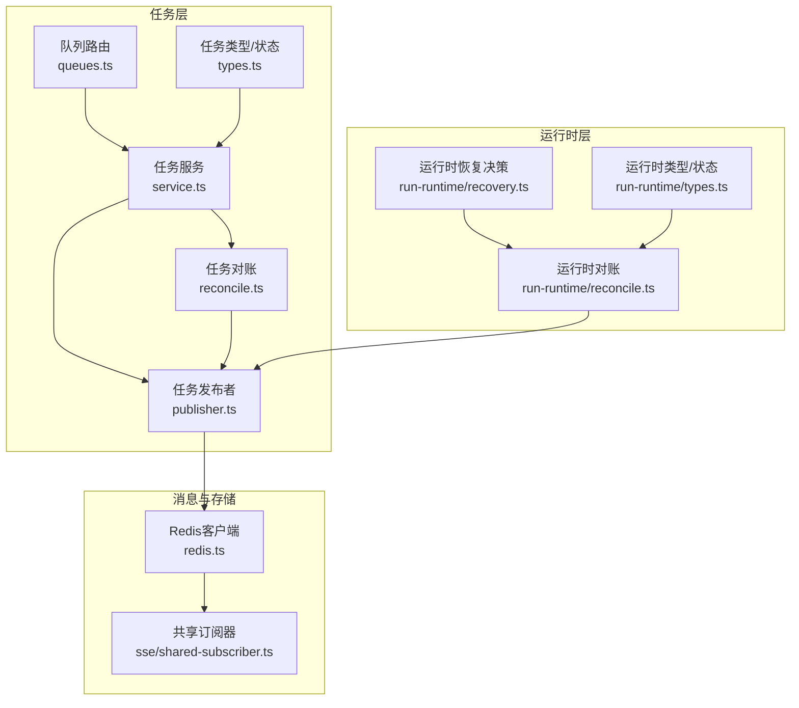
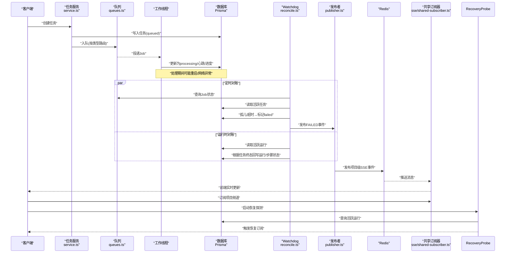
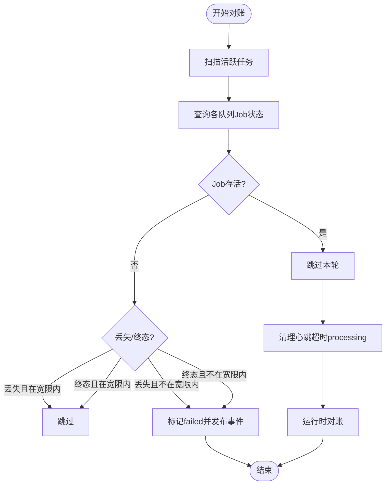
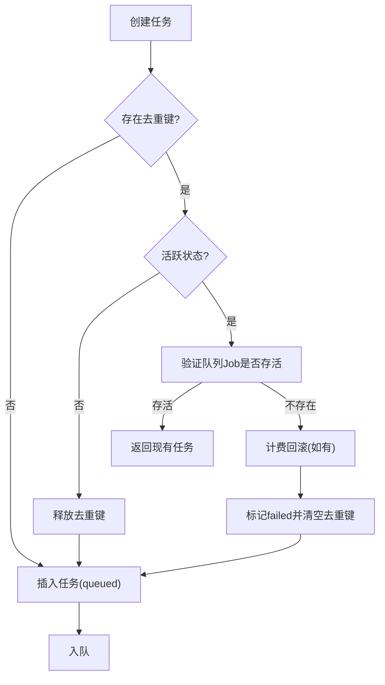
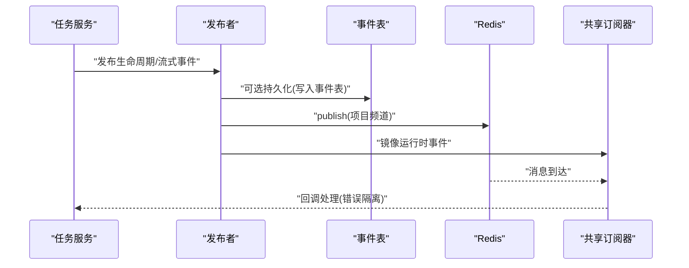
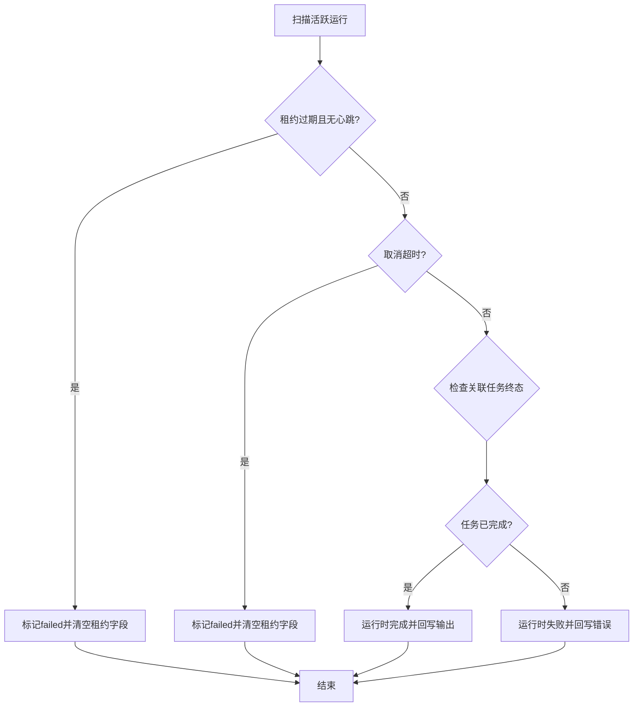
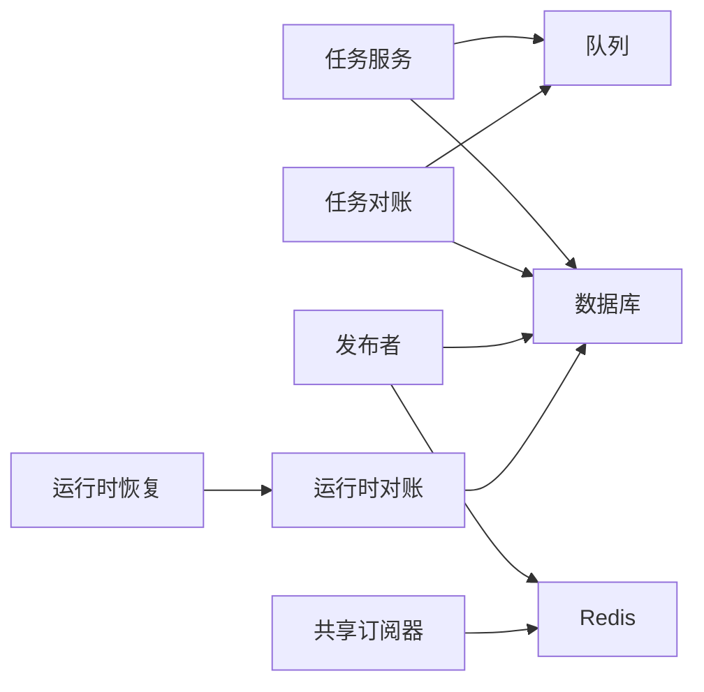

# 任务对账与恢复

<cite>
**本文引用的文件**
- [src/lib/task/reconcile.ts](file://src/lib/task/reconcile.ts)
- [src/lib/task/service.ts](file://src/lib/task/service.ts)
- [src/lib/task/publisher.ts](file://src/lib/task/publisher.ts)
- [src/lib/task/types.ts](file://src/lib/task/types.ts)
- [src/lib/task/queues.ts](file://src/lib/task/queues.ts)
- [src/lib/run-runtime/reconcile.ts](file://src/lib/run-runtime/reconcile.ts)
- [src/lib/run-runtime/recovery.ts](file://src/lib/run-runtime/recovery.ts)
- [src/lib/run-runtime/types.ts](file://src/lib/run-runtime/types.ts)
- [src/lib/sse/shared-subscriber.ts](file://src/lib/sse/shared-subscriber.ts)
- [src/lib/redis.ts](file://src/lib/redis.ts)
- [tests/unit/run-runtime/recovery.test.ts](file://tests/unit/run-runtime/recovery.test.ts)
- [tests/system/helpers/tasks.ts](file://tests/system/helpers/tasks.ts)
- [src/lib/query/hooks/run-stream/recovered-run-subscription.ts](file://src/lib/query/hooks/run-stream/recovered-run-subscription.ts)
- [src/lib/query/hooks/run-stream/recovery-probe.ts](file://src/lib/query/hooks/run-stream/recovery-probe.ts)
</cite>

## 目录
1. [引言](#引言)
2. [项目结构](#项目结构)
3. [核心组件](#核心组件)
4. [架构总览](#架构总览)
5. [详细组件分析](#详细组件分析)
6. [依赖关系分析](#依赖关系分析)
7. [性能考量](#性能考量)
8. [故障排查指南](#故障排查指南)
9. [结论](#结论)
10. [附录](#附录)

## 引言
本文件面向Waoowaoo的任务对账与恢复系统，聚焦以下目标：
- 任务状态一致性检查机制：通过定时对账与心跳检测，发现并纠正DB与队列状态脱节导致的卡死。
- 任务恢复算法：覆盖断点续传、状态回滚与数据修复策略，确保任务在异常后可被正确恢复或终止。
- 消息发布可靠性：基于Redis的SSE通道，确保任务状态变更能及时通知前端与运行时。
- 分布式状态同步：在多租户项目维度上，通过租户隔离通道与运行时对账，降低脑裂风险。
- 监控与告警：提供可观测性指标与前端恢复探测机制，辅助运维快速定位与处置。
- 配置与扩展点：暴露对账周期、心跳阈值、队列退避策略等可配置项，支持按需扩展。

## 项目结构
围绕“任务对账与恢复”，系统主要由以下模块构成：
- 任务层：任务类型、状态机、队列路由、心跳与进度更新、去重与补偿。
- 对账层：任务对账（DB↔队列）、运行时对账（DB↔运行时），以及Watchdog定时器。
- 消息层：SSE事件构建、Redis发布、共享订阅器、运行时事件镜像。
- 运行时层：运行时状态、步骤状态、租约与心跳、恢复决策与订阅恢复。

**图表来源**
- [src/lib/task/queues.ts:1-112](file://src/lib/task/queues.ts#L1-L112)
- [src/lib/task/service.ts:1-637](file://src/lib/task/service.ts#L1-L637)
- [src/lib/task/reconcile.ts:1-280](file://src/lib/task/reconcile.ts#L1-L280)
- [src/lib/task/publisher.ts:1-391](file://src/lib/task/publisher.ts#L1-L391)
- [src/lib/task/types.ts:1-159](file://src/lib/task/types.ts#L1-L159)
- [src/lib/run-runtime/reconcile.ts:1-306](file://src/lib/run-runtime/reconcile.ts#L1-L306)
- [src/lib/run-runtime/recovery.ts:1-86](file://src/lib/run-runtime/recovery.ts#L1-L86)
- [src/lib/run-runtime/types.ts:1-101](file://src/lib/run-runtime/types.ts#L1-L101)
- [src/lib/redis.ts:50-75](file://src/lib/redis.ts#L50-L75)
- [src/lib/sse/shared-subscriber.ts:1-81](file://src/lib/sse/shared-subscriber.ts#L1-L81)

**章节来源**
- [src/lib/task/queues.ts:1-112](file://src/lib/task/queues.ts#L1-L112)
- [src/lib/task/service.ts:1-637](file://src/lib/task/service.ts#L1-L637)
- [src/lib/task/reconcile.ts:1-280](file://src/lib/task/reconcile.ts#L1-L280)
- [src/lib/task/publisher.ts:1-391](file://src/lib/task/publisher.ts#L1-L391)
- [src/lib/task/types.ts:1-159](file://src/lib/task/types.ts#L1-L159)
- [src/lib/run-runtime/reconcile.ts:1-306](file://src/lib/run-runtime/reconcile.ts#L1-L306)
- [src/lib/run-runtime/recovery.ts:1-86](file://src/lib/run-runtime/recovery.ts#L1-L86)
- [src/lib/run-runtime/types.ts:1-101](file://src/lib/run-runtime/types.ts#L1-L101)
- [src/lib/redis.ts:50-75](file://src/lib/redis.ts#L50-L75)
- [src/lib/sse/shared-subscriber.ts:1-81](file://src/lib/sse/shared-subscriber.ts#L1-L81)

## 核心组件
- 任务对账与Watchdog
  - 定时扫描DB中活跃任务，核对BullMQ各队列Job状态，识别孤儿任务并标记失败，同时清理心跳超时的processing任务。
  - 对账后联动运行时对账，将已完成/失败的关联任务映射到运行时，完成运行时状态收敛。
- 任务服务与补偿
  - 去重键冲突处理：当DB存在活跃任务且队列Job已不存在时，终止孤儿任务并释放去重键，允许新任务创建。
  - 计费回滚：针对计费模式非OFF/SHADOW且未结算/回滚的任务，执行回滚并更新计费信息，失败时返回补偿失败错误码。
- 消息发布与订阅
  - 构建生命周期与流式事件，发布到项目级Redis频道；同时镜像到运行时事件，驱动运行时订阅与恢复。
  - 共享订阅器统一管理订阅生命周期，避免重复订阅与泄漏。
- 运行时对账与恢复
  - 基于租约过期与取消超时判断运行时“陈旧”状态，批量失败化并回写步骤状态。
  - 运行时恢复决策：根据租约与心跳选择最新可恢复运行，或判定过期/终态/缺失。
- 队列与退避
  - 按任务类型路由至图像/视频/语音/文本队列，设置默认退避策略与最大尝试次数，部分关键运行任务单次尝试以保证幂等。

**章节来源**
- [src/lib/task/reconcile.ts:1-280](file://src/lib/task/reconcile.ts#L1-L280)
- [src/lib/task/service.ts:110-294](file://src/lib/task/service.ts#L110-L294)
- [src/lib/task/publisher.ts:224-310](file://src/lib/task/publisher.ts#L224-L310)
- [src/lib/sse/shared-subscriber.ts:1-81](file://src/lib/sse/shared-subscriber.ts#L1-L81)
- [src/lib/run-runtime/reconcile.ts:73-305](file://src/lib/run-runtime/reconcile.ts#L73-L305)
- [src/lib/run-runtime/recovery.ts:29-85](file://src/lib/run-runtime/recovery.ts#L29-L85)
- [src/lib/task/queues.ts:88-112](file://src/lib/task/queues.ts#L88-L112)

## 架构总览
下图展示从任务创建到对账恢复的关键交互链路，包括消息发布、运行时镜像与恢复探测。

**图表来源**
- [src/lib/task/service.ts:164-294](file://src/lib/task/service.ts#L164-L294)
- [src/lib/task/queues.ts:88-112](file://src/lib/task/queues.ts#L88-L112)
- [src/lib/task/reconcile.ts:155-207](file://src/lib/task/reconcile.ts#L155-L207)
- [src/lib/task/reconcile.ts:219-279](file://src/lib/task/reconcile.ts#L219-L279)
- [src/lib/task/publisher.ts:224-310](file://src/lib/task/publisher.ts#L224-L310)
- [src/lib/sse/shared-subscriber.ts:1-81](file://src/lib/sse/shared-subscriber.ts#L1-L81)
- [src/lib/run-runtime/reconcile.ts:73-305](file://src/lib/run-runtime/reconcile.ts#L73-L305)

## 详细组件分析

### 任务对账与Watchdog
- 扫描策略
  - 限制批次大小，按创建时间升序扫描，避免一次性压力过大。
  - 对每个任务查询所有队列的Job状态，若任一队列为终态则视为“已终结”，若全部不存在则视为“丢失”。
- 处理策略
  - 终结/丢失：在宽限窗口内跳过（避免刚结束的竞态），其余标记failed并发布FAILED事件。
  - 心跳超时：清理processing超时任务，发布超时事件。
- 运行时对账联动
  - 对账完成后，进一步扫描活跃运行，依据关联任务终态回写运行与步骤状态，失败/取消原因来自任务表。

**图表来源**
- [src/lib/task/reconcile.ts:155-207](file://src/lib/task/reconcile.ts#L155-L207)
- [src/lib/task/reconcile.ts:219-279](file://src/lib/task/reconcile.ts#L219-L279)
- [src/lib/run-runtime/reconcile.ts:73-305](file://src/lib/run-runtime/reconcile.ts#L73-L305)

**章节来源**
- [src/lib/task/reconcile.ts:25-41](file://src/lib/task/reconcile.ts#L25-L41)
- [src/lib/task/reconcile.ts:155-207](file://src/lib/task/reconcile.ts#L155-L207)
- [src/lib/task/reconcile.ts:219-279](file://src/lib/task/reconcile.ts#L219-L279)

### 任务服务与补偿
- 去重键冲突处理
  - 若DB存在活跃任务且队列Job不存在，则终止孤儿任务并释放去重键，允许新任务创建；若存在计费冻结，先执行回滚。
- 计费回滚
  - 仅对billable=true且冻结存在、模式非OFF/SHADOW、状态未结算/回滚的任务执行回滚；失败时返回补偿失败错误码。
- 取消与超时
  - 取消任务时同样进行回滚并标记CANCELED；心跳超时的processing任务批量失败化。

**图表来源**
- [src/lib/task/service.ts:164-294](file://src/lib/task/service.ts#L164-L294)
- [src/lib/task/service.ts:129-162](file://src/lib/task/service.ts#L129-L162)

**章节来源**
- [src/lib/task/service.ts:110-127](file://src/lib/task/service.ts#L110-L127)
- [src/lib/task/service.ts:129-162](file://src/lib/task/service.ts#L129-L162)
- [src/lib/task/service.ts:506-541](file://src/lib/task/service.ts#L506-L541)
- [src/lib/task/service.ts:543-621](file://src/lib/task/service.ts#L543-L621)

### 消息发布与订阅
- 事件构建
  - 生命周期事件与流式事件分别构建，标准化payload并注入意图信息。
- 发布策略
  - 持久化事件写入数据库，生成有序ID；非持久化事件使用临时ID，避免写库开销。
  - 发布到项目级Redis频道，同时镜像到运行时事件，驱动运行时订阅。
- 订阅策略
  - 共享订阅器统一管理订阅，按频道聚合监听器，错误隔离与日志记录，避免重复订阅。

**图表来源**
- [src/lib/task/publisher.ts:224-310](file://src/lib/task/publisher.ts#L224-L310)
- [src/lib/sse/shared-subscriber.ts:1-81](file://src/lib/sse/shared-subscriber.ts#L1-L81)

**章节来源**
- [src/lib/task/publisher.ts:96-159](file://src/lib/task/publisher.ts#L96-L159)
- [src/lib/task/publisher.ts:224-310](file://src/lib/task/publisher.ts#L224-L310)
- [src/lib/sse/shared-subscriber.ts:1-81](file://src/lib/sse/shared-subscriber.ts#L1-L81)

### 运行时对账与恢复
- 运行时对账
  - 识别租约过期且无心跳的运行时，或取消请求超时的运行时，批量失败化并回写步骤状态。
  - 若关联任务已完成，则运行时也完成；否则根据任务状态失败化并携带原因。
- 运行时恢复
  - 通过租约与心跳判断可恢复运行，优先选择最近更新/创建的运行；若无可用则判定过期/终态/缺失。

**图表来源**
- [src/lib/run-runtime/reconcile.ts:73-305](file://src/lib/run-runtime/reconcile.ts#L73-L305)
- [src/lib/run-runtime/recovery.ts:29-85](file://src/lib/run-runtime/recovery.ts#L29-L85)

**章节来源**
- [src/lib/run-runtime/reconcile.ts:63-71](file://src/lib/run-runtime/reconcile.ts#L63-L71)
- [src/lib/run-runtime/reconcile.ts:99-168](file://src/lib/run-runtime/reconcile.ts#L99-L168)
- [src/lib/run-runtime/recovery.ts:29-85](file://src/lib/run-runtime/recovery.ts#L29-L85)

### 队列与退避策略
- 队列路由
  - 图像/视频/语音/文本四类队列，按任务类型映射；部分运行类任务单次尝试，避免重试放大。
- 默认退避
  - 指数退避+最大尝试次数，移除已完成/失败作业以控制队列规模。

**章节来源**
- [src/lib/task/queues.ts:67-101](file://src/lib/task/queues.ts#L67-L101)

## 依赖关系分析
- 组件耦合
  - 任务服务依赖队列与数据库；对账模块依赖队列与数据库；发布模块依赖Redis与数据库；运行时对账依赖任务表与运行时表。
- 外部依赖
  - BullMQ队列、Redis、Prisma ORM；前端通过SSE订阅项目频道。
- 循环依赖
  - 未见直接循环；对账模块通过动态导入避免循环引用。

**图表来源**
- [src/lib/task/service.ts:164-294](file://src/lib/task/service.ts#L164-L294)
- [src/lib/task/reconcile.ts:155-207](file://src/lib/task/reconcile.ts#L155-L207)
- [src/lib/task/publisher.ts:224-310](file://src/lib/task/publisher.ts#L224-L310)
- [src/lib/run-runtime/reconcile.ts:73-305](file://src/lib/run-runtime/reconcile.ts#L73-L305)
- [src/lib/run-runtime/recovery.ts:29-85](file://src/lib/run-runtime/recovery.ts#L29-L85)
- [src/lib/sse/shared-subscriber.ts:1-81](file://src/lib/sse/shared-subscriber.ts#L1-L81)

**章节来源**
- [src/lib/task/service.ts:164-294](file://src/lib/task/service.ts#L164-L294)
- [src/lib/task/reconcile.ts:155-207](file://src/lib/task/reconcile.ts#L155-L207)
- [src/lib/task/publisher.ts:224-310](file://src/lib/task/publisher.ts#L224-L310)
- [src/lib/run-runtime/reconcile.ts:73-305](file://src/lib/run-runtime/reconcile.ts#L73-L305)
- [src/lib/run-runtime/recovery.ts:29-85](file://src/lib/run-runtime/recovery.ts#L29-L85)
- [src/lib/sse/shared-subscriber.ts:1-81](file://src/lib/sse/shared-subscriber.ts#L1-L81)

## 性能考量
- 批量扫描与限流
  - 对账批次上限与扫描顺序控制，避免瞬时压力；竞态宽限窗口减少误判。
- 队列退避与清理
  - 指数退避降低抖动；完成/失败作业清理减少内存占用。
- 发布与订阅
  - 非持久化事件减少写库；共享订阅器集中管理，避免重复订阅成本。
- 运行时对账
  - 事务批量更新运行与步骤状态，减少多次往返。

[本节为通用性能建议，无需特定文件引用]

## 故障排查指南
- 常见症状与定位
  - 任务卡在processing：检查心跳字段与Watchdog超时阈值；查看对账日志与FAILED事件。
  - 任务消失：确认队列Job状态；若为丢失，对账会标记failed并发布事件。
  - 前端无更新：检查Redis连接与SSE订阅；确认项目频道是否正确。
- 恢复探测
  - 前端通过恢复探测器轮询活跃运行；成功后触发订阅恢复，超时则上报run.error。
- 测试与验证
  - 单元测试覆盖运行时恢复决策；系统测试包含任务生命周期等待与事件序列断言。

**章节来源**
- [tests/unit/run-runtime/recovery.test.ts:1-76](file://tests/unit/run-runtime/recovery.test.ts#L1-L76)
- [tests/system/helpers/tasks.ts:21-53](file://tests/system/helpers/tasks.ts#L21-L53)
- [src/lib/query/hooks/run-stream/recovered-run-subscription.ts:59-110](file://src/lib/query/hooks/run-stream/recovered-run-subscription.ts#L59-L110)
- [src/lib/query/hooks/run-stream/recovery-probe.ts:28-82](file://src/lib/query/hooks/run-stream/recovery-probe.ts#L28-L82)

## 结论
该系统通过“任务对账+运行时对账+消息发布+恢复探测”的组合，实现了跨队列与运行时的状态一致性保障。Watchdog与运行时对账共同解决“DB与外部系统脱节”的问题；Redis+SSE确保状态变更的实时通知；补偿机制与去重键策略提升异常场景的可恢复性。配合可观测性与测试用例，运维可在异常发生时快速定位并处置。

[本节为总结性内容，无需特定文件引用]

## 附录

### 配置与扩展点
- 对账与心跳
  - 对账周期、心跳超时阈值、孤儿任务宽限窗口、终端任务宽限窗口等参数可调。
- 队列与退避
  - 默认退避类型与延迟、最大尝试次数、完成/失败作业清理数量。
- 任务类型与队列
  - 新增任务类型时，需在路由映射中注册对应队列类型。
- 计费回滚
  - 回滚条件与失败错误码可按业务调整。

**章节来源**
- [src/lib/task/reconcile.ts:27-41](file://src/lib/task/reconcile.ts#L27-L41)
- [src/lib/task/queues.ts:12-20](file://src/lib/task/queues.ts#L12-L20)
- [src/lib/task/service.ts:71-77](file://src/lib/task/service.ts#L71-L77)