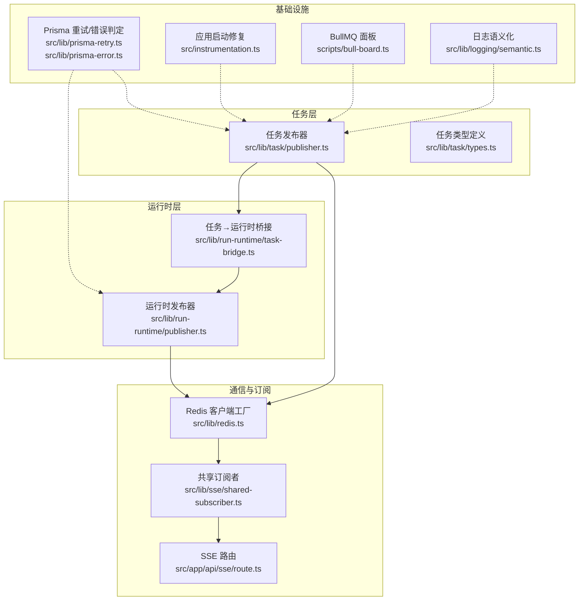
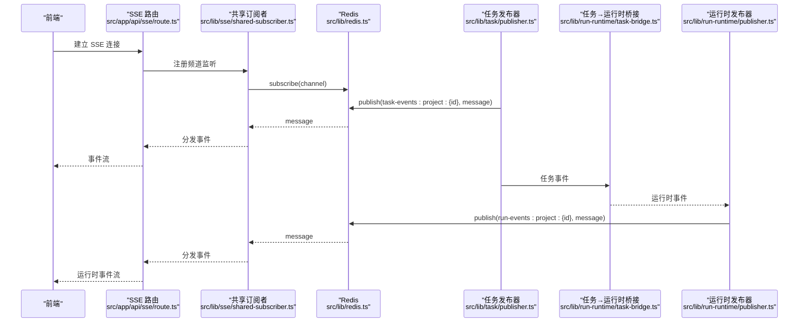
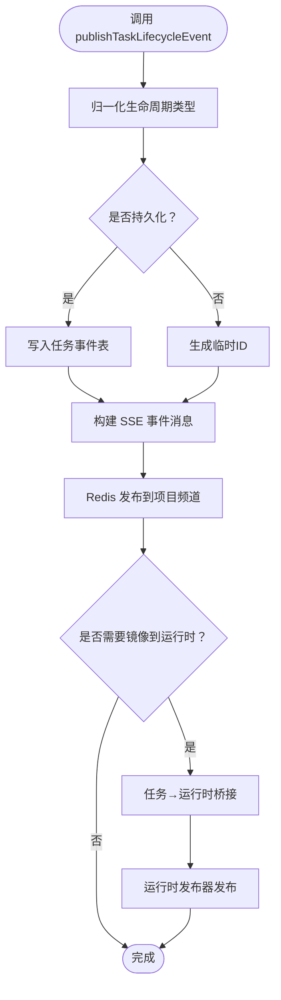
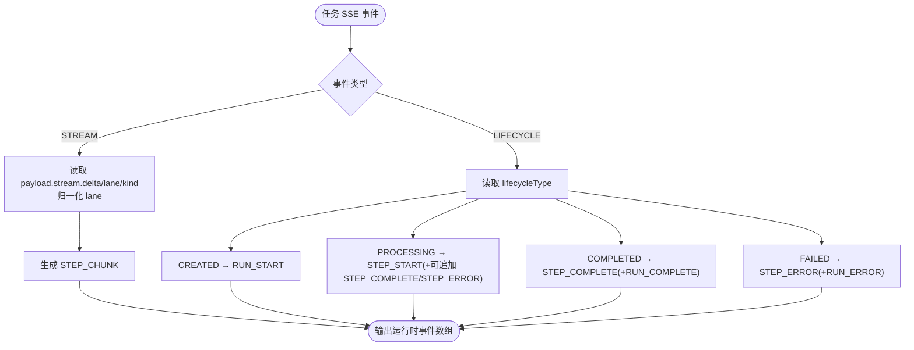
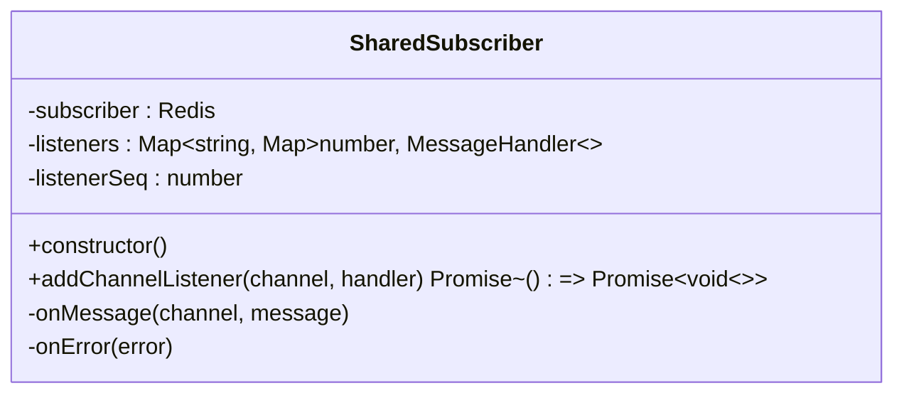
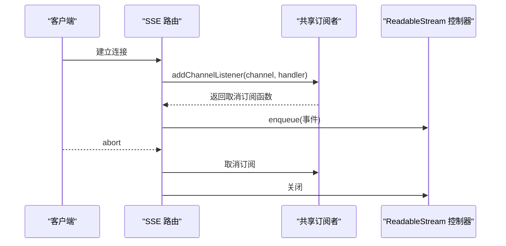
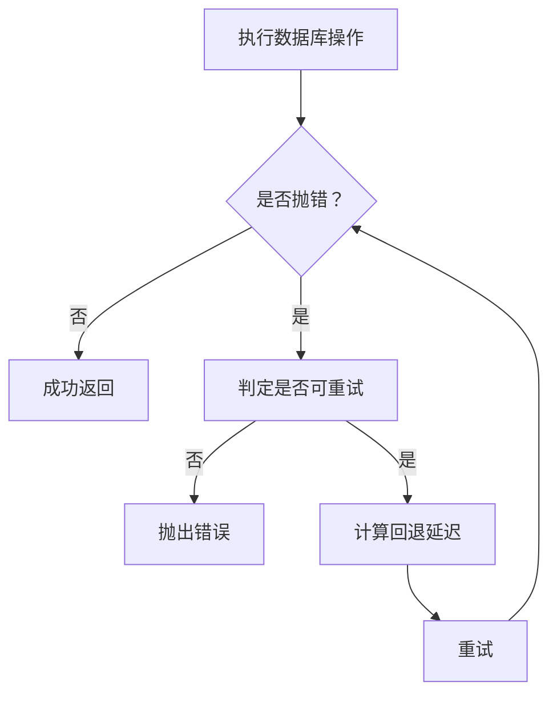
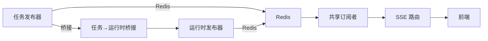

# 任务桥接与通信

<cite>
**本文引用的文件**
- [src/lib/task/publisher.ts](file://src/lib/task/publisher.ts)
- [src/lib/run-runtime/publisher.ts](file://src/lib/run-runtime/publisher.ts)
- [src/lib/run-runtime/task-bridge.ts](file://src/lib/run-runtime/task-bridge.ts)
- [src/lib/sse/shared-subscriber.ts](file://src/lib/sse/shared-subscriber.ts)
- [src/app/api/sse/route.ts](file://src/app/api/sse/route.ts)
- [src/lib/redis.ts](file://src/lib/redis.ts)
- [src/lib/task/types.ts](file://src/lib/task/types.ts)
- [src/lib/prisma-error.ts](file://src/lib/prisma-error.ts)
- [src/lib/prisma-retry.ts](file://src/lib/prisma-retry.ts)
- [src/instrumentation.ts](file://src/instrumentation.ts)
- [scripts/bull-board.ts](file://scripts/bull-board.ts)
- [src/lib/workers/user-concurrency-gate.ts](file://src/lib/workers/user-concurrency-gate.ts)
- [src/lib/config-service.ts](file://src/lib/config-service.ts)
- [src/lib/crypto-utils.ts](file://src/lib/crypto-utils.ts)
- [src/lib/logging/core.ts](file://src/lib/logging/core.ts)
- [src/lib/logging/semantic.ts](file://src/lib/logging/semantic.ts)
- [src/lib/logging/types.ts](file://src/lib/logging/types.ts)
- [scripts/check-log-semantic.ts](file://scripts/check-log-semantic.ts)
</cite>

## 目录
1. [简介](#简介)
2. [项目结构](#项目结构)
3. [核心组件](#核心组件)
4. [架构总览](#架构总览)
5. [组件详解](#组件详解)
6. [依赖关系分析](#依赖关系分析)
7. [性能考量](#性能考量)
8. [故障排查指南](#故障排查指南)
9. [结论](#结论)
10. [附录](#附录)

## 简介
本技术文档围绕 Waoowaoo 的“任务桥接与通信系统”，系统性阐述任务桥接器的设计理念、实现架构与运行机制，重点覆盖：
- 任务生命周期与流式事件的发布与订阅
- 基于 Redis 的消息路由与广播策略
- 任务到运行时事件的桥接映射
- 错误处理与重试、连接健壮性保障
- 数据传递协议、编码与传输安全
- 性能优化策略（批量、缓存、并发门控）
- 监控与诊断工具（日志语义化、BullMQ 面板）
- 配置管理与扩展接口

## 项目结构
该系统以“任务事件发布”和“运行时事件发布”两条主线为核心，通过 Redis 实现跨进程/跨模块的事件广播；前端通过 Server-Sent Events 接收实时更新；运行时事件由任务事件桥接而来，形成“任务层→运行时层”的统一可观测视图。

**图表来源**
- [src/lib/task/publisher.ts:1-391](file://src/lib/task/publisher.ts#L1-L391)
- [src/lib/run-runtime/publisher.ts:1-31](file://src/lib/run-runtime/publisher.ts#L1-L31)
- [src/lib/run-runtime/task-bridge.ts:1-185](file://src/lib/run-runtime/task-bridge.ts#L1-L185)
- [src/lib/sse/shared-subscriber.ts:1-82](file://src/lib/sse/shared-subscriber.ts#L1-L82)
- [src/app/api/sse/route.ts:113-156](file://src/app/api/sse/route.ts#L113-L156)
- [src/lib/redis.ts:50-75](file://src/lib/redis.ts#L50-L75)
- [src/lib/prisma-retry.ts:28-50](file://src/lib/prisma-retry.ts#L28-L50)
- [src/lib/prisma-error.ts:1-53](file://src/lib/prisma-error.ts#L1-L53)
- [src/instrumentation.ts:1-63](file://src/instrumentation.ts#L1-L63)
- [scripts/bull-board.ts:1-105](file://scripts/bull-board.ts#L1-L105)
- [src/lib/logging/semantic.ts:1-53](file://src/lib/logging/semantic.ts#L1-L53)

**章节来源**
- [src/lib/task/publisher.ts:1-391](file://src/lib/task/publisher.ts#L1-L391)
- [src/lib/run-runtime/publisher.ts:1-31](file://src/lib/run-runtime/publisher.ts#L1-L31)
- [src/lib/run-runtime/task-bridge.ts:1-185](file://src/lib/run-runtime/task-bridge.ts#L1-L185)
- [src/lib/sse/shared-subscriber.ts:1-82](file://src/lib/sse/shared-subscriber.ts#L1-L82)
- [src/app/api/sse/route.ts:113-156](file://src/app/api/sse/route.ts#L113-L156)
- [src/lib/redis.ts:50-75](file://src/lib/redis.ts#L50-L75)

## 核心组件
- 任务发布器：负责将任务生命周期事件与流式事件发布到 Redis 通道，支持持久化与临时事件两种路径，并在必要时镜像为运行时事件。
- 运行时发布器：将运行时事件写入数据库并发布到运行时通道，供前端或下游消费者订阅。
- 任务→运行时桥接：将任务事件转换为运行时事件，统一运行时的开始、步骤开始/完成/错误、整体完成等语义。
- 共享订阅者：封装 Redis 订阅客户端，按频道聚合监听器，自动订阅/退订，异常隔离与日志记录。
- SSE 路由：基于 ReadableStream 构建 Server-Sent Events 流，连接/断开/心跳/清理流程完备。
- Redis 工厂：集中管理应用/队列/订阅客户端，统一连接参数与日志。
- 日志与监控：统一语义化日志、关键动作审计、BullMQ 面板可视化。

**章节来源**
- [src/lib/task/publisher.ts:224-284](file://src/lib/task/publisher.ts#L224-L284)
- [src/lib/run-runtime/publisher.ts:7-29](file://src/lib/run-runtime/publisher.ts#L7-L29)
- [src/lib/run-runtime/task-bridge.ts:65-184](file://src/lib/run-runtime/task-bridge.ts#L65-L184)
- [src/lib/sse/shared-subscriber.ts:7-67](file://src/lib/sse/shared-subscriber.ts#L7-L67)
- [src/app/api/sse/route.ts:113-156](file://src/app/api/sse/route.ts#L113-L156)
- [src/lib/redis.ts:50-75](file://src/lib/redis.ts#L50-L75)

## 架构总览
下图展示了从前端到任务层、运行时层以及 Redis 广播的整体交互流程。

**图表来源**
- [src/app/api/sse/route.ts:113-156](file://src/app/api/sse/route.ts#L113-L156)
- [src/lib/sse/shared-subscriber.ts:12-31](file://src/lib/sse/shared-subscriber.ts#L12-L31)
- [src/lib/redis.ts:68-75](file://src/lib/redis.ts#L68-L75)
- [src/lib/task/publisher.ts:281-283](file://src/lib/task/publisher.ts#L281-L283)
- [src/lib/run-runtime/task-bridge.ts:228-237](file://src/lib/run-runtime/task-bridge.ts#L228-L237)
- [src/lib/run-runtime/publisher.ts:11-29](file://src/lib/run-runtime/publisher.ts#L11-L29)

## 组件详解

### 任务发布器与事件模型
- 事件通道命名：按项目维度划分，如“task-events:project:{id}”。
- 生命周期事件：created/processing/progress/completed/failed，统一归一化为生命周期事件类型。
- 流式事件：当启用时，将流式增量内容映射为流式事件，携带意图与阶段信息。
- 持久化策略：可选择持久化到数据库并返回带 ID 的事件，或生成临时 ID 的瞬时事件。
- 镜像策略：非直通运行时的任务事件会被桥接为运行时事件并发布。

**图表来源**
- [src/lib/task/publisher.ts:239-284](file://src/lib/task/publisher.ts#L239-L284)
- [src/lib/task/publisher.ts:323-357](file://src/lib/task/publisher.ts#L323-L357)
- [src/lib/run-runtime/task-bridge.ts:228-237](file://src/lib/run-runtime/task-bridge.ts#L228-L237)
- [src/lib/run-runtime/publisher.ts:11-29](file://src/lib/run-runtime/publisher.ts#L11-L29)

**章节来源**
- [src/lib/task/publisher.ts:224-284](file://src/lib/task/publisher.ts#L224-L284)
- [src/lib/task/publisher.ts:323-357](file://src/lib/task/publisher.ts#L323-L357)
- [src/lib/task/types.ts:14-38](file://src/lib/task/types.ts#L14-L38)

### 运行时发布器与桥接映射
- 运行时事件通道：按项目维度划分，如“run-events:project:{id}”。
- 桥接规则：
  - 流式事件映射为 STEP_CHUNK，携带 lane/text 或 reasoning 区分。
  - 生命周期事件映射为 RUN_START/STEP_START/STEP_COMPLETE/STEP_ERROR/RUN_COMPLETE/RUN_ERROR。
  - 支持从 payload 中解析 runId、stepKey、attempt 等关键字段。
- 直通任务类型：某些任务类型不进行桥接，直接由运行时发布器处理。

**图表来源**
- [src/lib/run-runtime/task-bridge.ts:65-184](file://src/lib/run-runtime/task-bridge.ts#L65-L184)
- [src/lib/run-runtime/publisher.ts:7-29](file://src/lib/run-runtime/publisher.ts#L7-L29)

**章节来源**
- [src/lib/run-runtime/publisher.ts:7-29](file://src/lib/run-runtime/publisher.ts#L7-L29)
- [src/lib/run-runtime/task-bridge.ts:65-184](file://src/lib/run-runtime/task-bridge.ts#L65-L184)

### SSE 通道与共享订阅者
- 共享订阅者：内部维护频道到监听器的映射，首次监听时订阅，最后一位监听移除时退订，避免资源泄漏。
- 异常隔离：监听回调异常被捕获并记录，不影响其他监听器。
- Redis 错误：订阅客户端错误统一上报，便于定位网络/认证问题。

**图表来源**
- [src/lib/sse/shared-subscriber.ts:7-67](file://src/lib/sse/shared-subscriber.ts#L7-L67)

**章节来源**
- [src/lib/sse/shared-subscriber.ts:1-82](file://src/lib/sse/shared-subscriber.ts#L1-L82)

### SSE 路由与流控制
- ReadableStream：start/controller.enqueue/关闭流程完整，支持信号中断与定时清理。
- 连接生命周期：建立连接、事件分发、断开清理、错误记录。
- 请求上下文：记录请求 ID、项目 ID、用户 ID，便于日志关联与追踪。

**图表来源**
- [src/app/api/sse/route.ts:113-156](file://src/app/api/sse/route.ts#L113-L156)
- [src/lib/sse/shared-subscriber.ts:33-67](file://src/lib/sse/shared-subscriber.ts#L33-L67)

**章节来源**
- [src/app/api/sse/route.ts:113-156](file://src/app/api/sse/route.ts#L113-L156)

### Redis 客户端与连接管理
- 应用/队列/订阅三类客户端分离，避免命令重试副作用影响队列操作。
- 连接日志：每次创建客户端都会记录连接信息，便于诊断。

**章节来源**
- [src/lib/redis.ts:50-75](file://src/lib/redis.ts#L50-L75)

### 错误处理与重试
- Prisma 错误判定：基于错误码与常见断开描述识别可重试错误。
- 重试策略：指数回退延迟，最大重试次数可配置。
- 应用启动修复：在应用启动时将“processing”任务重置为“queued”，避免孤儿任务。

**图表来源**
- [src/lib/prisma-retry.ts:28-50](file://src/lib/prisma-retry.ts#L28-L50)
- [src/lib/prisma-error.ts:49-53](file://src/lib/prisma-error.ts#L49-L53)
- [src/instrumentation.ts:15-35](file://src/instrumentation.ts#L15-L35)

**章节来源**
- [src/lib/prisma-retry.ts:28-50](file://src/lib/prisma-retry.ts#L28-L50)
- [src/lib/prisma-error.ts:1-53](file://src/lib/prisma-error.ts#L1-L53)
- [src/instrumentation.ts:1-35](file://src/instrumentation.ts#L1-L35)

### 并发控制与负载均衡
- 用户级并发门控：按用户与作用域（如 image/video）限制并发槽位，等待队列公平调度。
- 适用场景：防止单用户在高并发任务下造成资源争抢或外部服务限流。

**章节来源**
- [src/lib/workers/user-concurrency-gate.ts:26-69](file://src/lib/workers/user-concurrency-gate.ts#L26-L69)

### 配置管理与扩展接口
- 统一配置服务：提供项目级与用户级模型配置解析、能力选项合并与校验。
- 图像任务计费载荷：自动注入分辨率等能力选项，保证计费与执行一致性。
- API Key 加解密：AES-256-GCM，PBKDF2 派生密钥，支持对象批量加解密。

**章节来源**
- [src/lib/config-service.ts:147-169](file://src/lib/config-service.ts#L147-L169)
- [src/lib/config-service.ts:286-313](file://src/lib/config-service.ts#L286-L313)
- [src/lib/crypto-utils.ts:50-111](file://src/lib/crypto-utils.ts#L50-L111)
- [src/lib/crypto-utils.ts:125-146](file://src/lib/crypto-utils.ts#L125-L146)

## 依赖关系分析
- 低耦合：任务发布器与运行时发布器通过桥接器解耦，事件通道通过 Redis 解耦。
- 依赖方向：任务层→Redis→订阅层→SSE→前端；任务层→桥接器→运行时层→Redis。
- 外部依赖：BullMQ（队列）、ioredis（Redis）、Next.js（SSE 路由）。

**图表来源**
- [src/lib/task/publisher.ts:281-283](file://src/lib/task/publisher.ts#L281-L283)
- [src/lib/run-runtime/publisher.ts:27-29](file://src/lib/run-runtime/publisher.ts#L27-L29)
- [src/lib/run-runtime/task-bridge.ts:228-237](file://src/lib/run-runtime/task-bridge.ts#L228-L237)
- [src/lib/sse/shared-subscriber.ts:12-31](file://src/lib/sse/shared-subscriber.ts#L12-L31)
- [src/app/api/sse/route.ts:113-156](file://src/app/api/sse/route.ts#L113-L156)

**章节来源**
- [src/lib/task/publisher.ts:281-283](file://src/lib/task/publisher.ts#L281-L283)
- [src/lib/run-runtime/publisher.ts:27-29](file://src/lib/run-runtime/publisher.ts#L27-L29)
- [src/lib/run-runtime/task-bridge.ts:228-237](file://src/lib/run-runtime/task-bridge.ts#L228-L237)
- [src/lib/sse/shared-subscriber.ts:12-31](file://src/lib/sse/shared-subscriber.ts#L12-L31)
- [src/app/api/sse/route.ts:113-156](file://src/app/api/sse/route.ts#L113-L156)

## 性能考量
- 批量与缓存
  - 事件持久化：对高频流式事件可选择临时事件，减少数据库写入压力。
  - 事件扫描：提供按 ID 起始的增量扫描与上限控制，避免全表扫描。
- 并发与限流
  - 用户级并发门控：按用户与作用域限制并发，避免热点用户拖垮系统。
  - BullMQ 面板：可视化队列状态，辅助容量规划与异常定位。
- 传输与序列化
  - JSON 序列化：事件体采用 JSON，字段精简，避免冗余。
  - SSE 编码：使用 TextEncoder 输出，减少额外转换成本。
- 数据库健壮性
  - Prisma 可重试：对可重试错误自动重试，提升稳定性。

**章节来源**
- [src/lib/task/publisher.ts:359-390](file://src/lib/task/publisher.ts#L359-L390)
- [src/lib/workers/user-concurrency-gate.ts:26-69](file://src/lib/workers/user-concurrency-gate.ts#L26-L69)
- [scripts/bull-board.ts:63-71](file://scripts/bull-board.ts#L63-L71)
- [src/lib/prisma-retry.ts:28-50](file://src/lib/prisma-retry.ts#L28-L50)

## 故障排查指南
- 事件未到达前端
  - 检查项目频道是否正确，确认 Redis 订阅是否成功。
  - 查看共享订阅者的错误回调日志，定位网络/认证问题。
- 事件重复或丢失
  - 核对持久化策略与临时事件开关，确认事件 ID 生成逻辑。
  - 使用 SSE 路由的日志上下文（请求 ID/项目 ID/用户 ID）进行关联排查。
- 运行时事件缺失
  - 检查桥接映射规则，确认任务类型是否直通运行时。
  - 核对运行时发布器的通道命名与 Redis 发布行为。
- 数据库异常
  - 观察 Prisma 可重试错误判定与回退策略，必要时调整重试参数。
  - 应用启动修复会将 processing 任务重置为 queued，避免孤儿任务。
- 监控与审计
  - 使用日志语义化模块记录关键动作与审计事件。
  - 使用 BullMQ 面板查看队列状态与作业详情。

**章节来源**
- [src/lib/sse/shared-subscriber.ts:28-30](file://src/lib/sse/shared-subscriber.ts#L28-L30)
- [src/app/api/sse/route.ts:113-156](file://src/app/api/sse/route.ts#L113-L156)
- [src/lib/run-runtime/task-bridge.ts:228-237](file://src/lib/run-runtime/task-bridge.ts#L228-L237)
- [src/lib/run-runtime/publisher.ts:11-29](file://src/lib/run-runtime/publisher.ts#L11-L29)
- [src/lib/prisma-error.ts:49-53](file://src/lib/prisma-error.ts#L49-L53)
- [src/instrumentation.ts:15-35](file://src/instrumentation.ts#L15-L35)
- [src/lib/logging/semantic.ts:39-53](file://src/lib/logging/semantic.ts#L39-L53)
- [scripts/bull-board.ts:77-89](file://scripts/bull-board.ts#L77-L89)

## 结论
本系统通过“任务事件→运行时事件”的桥接设计，结合 Redis 广播与 SSE 实时推送，实现了跨模块、跨进程的可靠通信。配合统一配置、并发门控、日志语义化与可视化面板，既满足了高可用性要求，也为运维与开发提供了清晰的可观测性与可扩展性。

## 附录

### 事件与消息格式要点
- 任务事件字段：id、type、taskId、projectId、userId、ts、taskType、targetType、targetId、episodeId、payload。
- 运行时事件字段：id、type、runId、projectId、userId、seq、eventType、stepKey、attempt、lane、payload、ts。
- 流式事件：包含增量内容与 lane/kind，桥接时归一化 lane 为 text/reasoning。

**章节来源**
- [src/lib/task/types.ts:130-144](file://src/lib/task/types.ts#L130-L144)
- [src/lib/run-runtime/publisher.ts:13-26](file://src/lib/run-runtime/publisher.ts#L13-L26)
- [src/lib/run-runtime/task-bridge.ts:79-96](file://src/lib/run-runtime/task-bridge.ts#L79-L96)

### 传输安全与配置
- API Key 加解密：AES-256-GCM，PBKDF2 派生密钥，支持对象批量处理。
- 配置优先级：项目配置 > 用户偏好 > 默认值，能力选项可默认/覆盖合并。

**章节来源**
- [src/lib/crypto-utils.ts:50-111](file://src/lib/crypto-utils.ts#L50-L111)
- [src/lib/crypto-utils.ts:125-146](file://src/lib/crypto-utils.ts#L125-L146)
- [src/lib/config-service.ts:147-169](file://src/lib/config-service.ts#L147-L169)