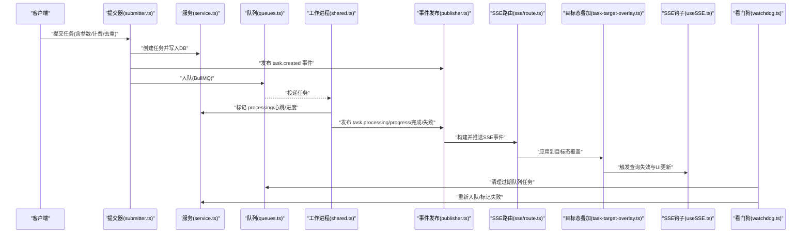
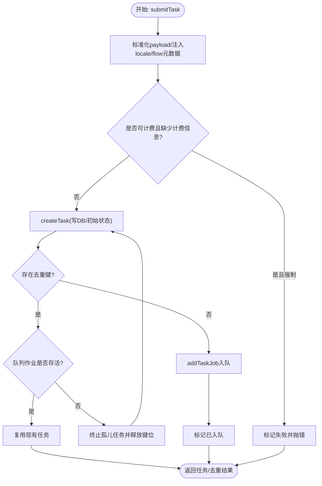
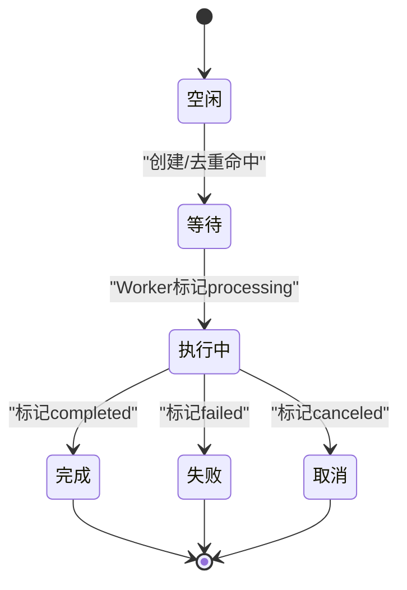
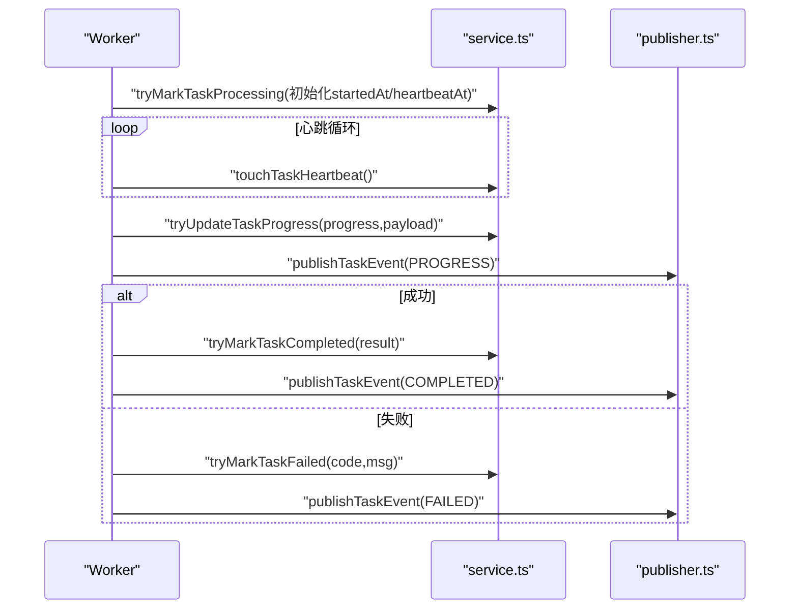
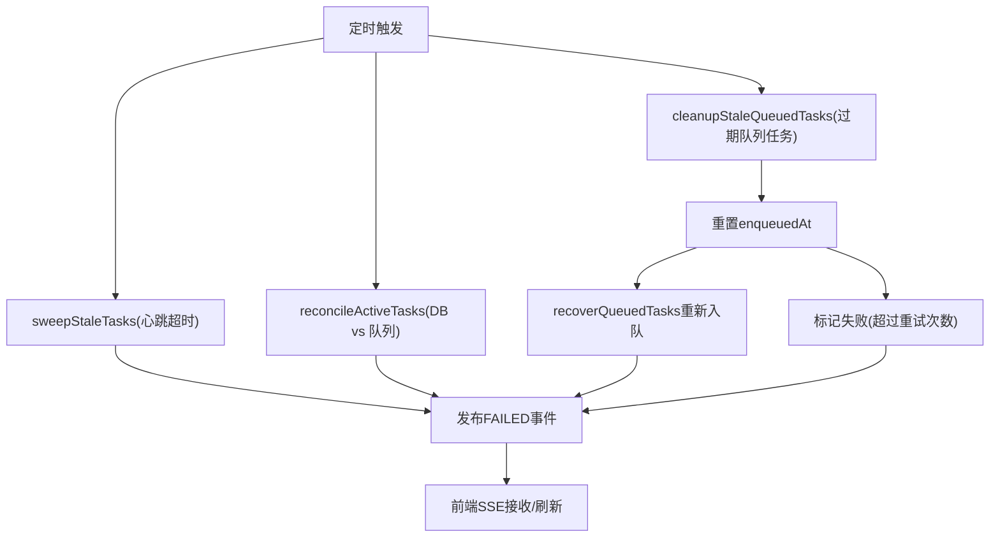
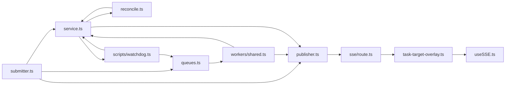

# 任务生命周期管理

<cite>
**本文引用的文件**
- [src/lib/task/types.ts](file://src/lib/task/types.ts)
- [src/lib/task/service.ts](file://src/lib/task/service.ts)
- [src/lib/task/state-service.ts](file://src/lib/task/state-service.ts)
- [src/lib/task/submitter.ts](file://src/lib/task/submitter.ts)
- [src/lib/task/publisher.ts](file://src/lib/task/publisher.ts)
- [src/lib/task/queues.ts](file://src/lib/task/queues.ts)
- [src/lib/task/reconcile.ts](file://src/lib/task/reconcile.ts)
- [src/lib/task/errors.ts](file://src/lib/task/errors.ts)
- [src/lib/task/intent.ts](file://src/lib/task/intent.ts)
- [src/lib/task/ui-payload.ts](file://src/lib/task/ui-payload.ts)
- [src/app/api/sse/route.ts](file://src/app/api/sse/route.ts)
- [src/lib/query/task-target-overlay.ts](file://src/lib/query/task-target-overlay.ts)
- [src/lib/query/hooks/useSSE.ts](file://src/lib/query/hooks/useSSE.ts)
- [scripts/watchdog.ts](file://scripts/watchdog.ts)
- [src/lib/logging/types.ts](file://src/lib/logging/types.ts)
- [tests/system/helpers/tasks.ts](file://tests/system/helpers/tasks.ts)
</cite>

## 更新摘要
**变更内容**
- 新增自动清理过期队列任务功能，包括cleanupStaleQueuedTasks函数
- 增强任务超时检测与自动清理机制
- 添加队列阻塞防护和任务重新入队策略
- 更新看门狗监控系统的功能范围

## 目录
1. [引言](#引言)
2. [项目结构](#项目结构)
3. [核心组件](#核心组件)
4. [架构总览](#架构总览)
5. [详细组件分析](#详细组件分析)
6. [依赖关系分析](#依赖关系分析)
7. [性能考量](#性能考量)
8. [故障排查指南](#故障排查指南)
9. [结论](#结论)
10. [附录](#附录)

## 引言
本文件面向Waoowaoo的任务生命周期管理，系统性阐述从任务创建、入队、执行、状态变更、事件发布、监控与审计，到超时清理与重启恢复的完整流程。文档覆盖任务状态定义与转换规则、参数验证与默认值、取消/暂停/恢复机制、超时检测与自动清理、序列化与持久化策略，并提供可视化图示帮助理解。

**更新** 新增自动清理过期队列任务功能，增强系统对队列阻塞的防护能力，确保任务队列的健康运行。

## 项目结构
围绕任务生命周期的关键模块分布如下：
- 类型与常量：定义任务状态、事件类型、任务类型、队列类型等
- 提交与创建：参数规范化、去重、计费准备、入队与事件发布
- 执行与状态：Worker启动、心跳维护、进度更新、状态变更
- 事件与订阅：SSE事件构建、发布、前端订阅与目标态聚合
- 对账与看门狗：DB与队列状态对账、僵尸任务清理、过期队列任务清理
- 监控与审计：日志上下文、错误封装、测试辅助

```mermaid
graph TB
subgraph "提交与创建"
SUB["submitter.ts<br/>提交任务"]
SVC["service.ts<br/>创建/状态变更"]
Q["queues.ts<br/>队列路由"]
end
subgraph "执行与状态"
W["Worker<br/>shared.ts"]
PUB["publisher.ts<br/>事件发布"]
INT["intent.ts<br/>意图解析"]
UI["ui-payload.ts<br/>UI载荷"]
end
subgraph "事件与订阅"
SSE["app/api/sse/route.ts<br/>SSE快照"]
OVER["query/task-target-overlay.ts<br/>目标态叠加"]
USE["query/hooks/useSSE.ts<br/>前端订阅"]
end
subgraph "对账与看门狗"
REC["reconcile.ts<br/>对账/看门狗"]
WD["scripts/watchdog.ts<br/>脚本看门狗"]
END
subgraph "监控与审计"
LOG["logging/types.ts<br/>日志类型"]
ERR["errors.ts<br/>任务终止错误"]
end
SUB --> SVC
SUB --> Q
Q --> W
W --> SVC
W --> PUB
PUB --> SSE
SSE --> OVER
OVER --> USE
SVC --> PUB
PUB --> USE
REC --> SVC
WD --> SVC
SVC --> LOG
W --> INT
W --> UI
W --> ERR
```

**图表来源**
- [src/lib/task/submitter.ts:110-410](file://src/lib/task/submitter.ts#L110-L410)
- [src/lib/task/service.ts:164-294](file://src/lib/task/service.ts#L164-L294)
- [src/lib/task/queues.ts:88-112](file://src/lib/task/queues.ts#L88-L112)
- [src/lib/task/reconcile.ts:219-279](file://src/lib/task/reconcile.ts#L219-L279)
- [src/lib/task/publisher.ts:239-310](file://src/lib/task/publisher.ts#L239-L310)
- [src/app/api/sse/route.ts:36-75](file://src/app/api/sse/route.ts#L36-L75)
- [src/lib/query/task-target-overlay.ts:121-155](file://src/lib/query/task-target-overlay.ts#L121-L155)
- [src/lib/query/hooks/useSSE.ts:141-163](file://src/lib/query/hooks/useSSE.ts#L141-L163)
- [src/lib/task/intent.ts:67-82](file://src/lib/task/intent.ts#L67-L82)
- [src/lib/task/ui-payload.ts:6-19](file://src/lib/task/ui-payload.ts#L6-L19)
- [src/lib/logging/types.ts:1-45](file://src/lib/logging/types.ts#L1-L45)
- [src/lib/task/errors.ts:1-9](file://src/lib/task/errors.ts#L1-L9)
- [scripts/watchdog.ts:196-256](file://scripts/watchdog.ts#L196-L256)

**章节来源**
- [src/lib/task/types.ts:1-159](file://src/lib/task/types.ts#L1-L159)
- [src/lib/task/submitter.ts:110-410](file://src/lib/task/submitter.ts#L110-L410)
- [src/lib/task/service.ts:164-294](file://src/lib/task/service.ts#L164-L294)
- [src/lib/task/queues.ts:1-112](file://src/lib/task/queues.ts#L1-L112)
- [src/lib/task/reconcile.ts:1-280](file://src/lib/task/reconcile.ts#L1-L280)
- [src/lib/task/publisher.ts:1-391](file://src/lib/task/publisher.ts#L1-L391)
- [src/app/api/sse/route.ts:36-75](file://src/app/api/sse/route.ts#L36-L75)
- [src/lib/query/task-target-overlay.ts:121-155](file://src/lib/query/task-target-overlay.ts#L121-L155)
- [src/lib/query/hooks/useSSE.ts:141-163](file://src/lib/query/hooks/useSSE.ts#L141-L163)
- [src/lib/task/intent.ts:1-83](file://src/lib/task/intent.ts#L1-L83)
- [src/lib/task/ui-payload.ts:1-19](file://src/lib/task/ui-payload.ts#L1-L19)
- [src/lib/logging/types.ts:1-45](file://src/lib/logging/types.ts#L1-L45)
- [src/lib/task/errors.ts:1-9](file://src/lib/task/errors.ts#L1-L9)
- [scripts/watchdog.ts:1-298](file://scripts/watchdog.ts#L1-L298)

## 核心组件
- 任务状态与事件
  - 状态集合：queued、processing、completed、failed、canceled、dismissed
  - 生命周期事件：task.created、task.processing、task.progress、task.completed、task.failed
  - SSE事件类型：task.lifecycle、task.stream
- 任务类型与队列
  - 任务类型覆盖图像、视频、语音、文本等多类生成/处理任务
  - 队列按任务类型路由至 image/video/voice/text 四类队列
- 计费与去重
  - 可选计费模式与计费信息注入
  - dedupeKey去重与孤儿任务处理
- 事件发布与订阅
  - 通过Redis通道发布SSE事件，支持回放与镜像到运行时事件
- **看门狗监控系统**
  - **心跳超时清理**：清理长时间无心跳的processing任务
  - **孤儿任务对账**：DB与队列状态不一致时的自动修复
  - **过期队列任务清理**：清理超过30分钟未被worker消费的queued任务
  - **任务重新入队**：对过期队列任务进行安全的重新入队处理

**章节来源**
- [src/lib/task/types.ts:3-38](file://src/lib/task/types.ts#L3-L38)
- [src/lib/task/types.ts:40-81](file://src/lib/task/types.ts#L40-L81)
- [src/lib/task/queues.ts:5-112](file://src/lib/task/queues.ts#L5-L112)
- [src/lib/task/publisher.ts:15-78](file://src/lib/task/publisher.ts#L15-L78)
- [scripts/watchdog.ts:12-15](file://scripts/watchdog.ts#L12-L15)

## 架构总览
下图展示从提交到执行、事件发布与前端订阅的端到端流程，包括新增的过期队列任务清理机制：



**图表来源**
- [src/lib/task/submitter.ts:110-410](file://src/lib/task/submitter.ts#L110-L410)
- [src/lib/task/service.ts:393-456](file://src/lib/task/service.ts#L393-L456)
- [src/lib/task/queues.ts:88-112](file://src/lib/task/queues.ts#L88-L112)
- [src/lib/workers/shared.ts:333-675](file://src/lib/workers/shared.ts#L333-L675)
- [src/lib/task/publisher.ts:239-310](file://src/lib/task/publisher.ts#L239-L310)
- [src/app/api/sse/route.ts:36-75](file://src/app/api/sse/route.ts#L36-L75)
- [src/lib/query/task-target-overlay.ts:121-155](file://src/lib/query/task-target-overlay.ts#L121-L155)
- [src/lib/query/hooks/useSSE.ts:141-163](file://src/lib/query/hooks/useSSE.ts#L141-L163)
- [scripts/watchdog.ts:196-256](file://scripts/watchdog.ts#L196-L256)

## 详细组件分析

### 任务创建与去重
- 参数验证与默认值
  - 用户ID、项目ID、类型、目标类型/ID、可选episodeId、优先级、最大尝试次数、计费信息
  - payload标准化：注入locale、flow元数据、runId（若存在）
  - 计费：可选强制计费模式；缺失时根据模式决定失败或忽略
- 去重策略
  - 使用dedupeKey查询最近任务；若为活跃状态则复用；否则释放键位
  - 若队列作业丢失，终止孤儿任务并允许重新创建
- 入队与事件
  - 成功入队后记录enqueued时间；失败回滚计费并发布失败事件



**图表来源**
- [src/lib/task/submitter.ts:110-410](file://src/lib/task/submitter.ts#L110-L410)
- [src/lib/task/service.ts:164-294](file://src/lib/task/service.ts#L164-L294)
- [src/lib/task/reconcile.ts:77-80](file://src/lib/task/reconcile.ts#L77-L80)

**章节来源**
- [src/lib/task/submitter.ts:110-410](file://src/lib/task/submitter.ts#L110-L410)
- [src/lib/task/service.ts:164-294](file://src/lib/task/service.ts#L164-L294)
- [src/lib/task/reconcile.ts:44-80](file://src/lib/task/reconcile.ts#L44-L80)

### 任务状态定义与转换规则
- 状态集合
  - queued：等待执行
  - processing：执行中，需维护心跳
  - completed：成功完成
  - failed：失败
  - canceled：用户取消
  - dismissed：失败后归档
- 转换规则
  - 创建→queued（初始）
  - queued→processing（Worker标记）
  - processing→completed/failed（完成/异常）
  - processing→canceled（用户取消）
  - failed/dismissed→不可逆
- 目标态聚合
  - 根据目标类型/ID与任务集合计算phase：idle/queued/processing/completed/failed
  - 提取intent、进度、阶段、错误等字段用于UI展示



**图表来源**
- [src/lib/task/types.ts:3-10](file://src/lib/task/types.ts#L3-L10)
- [src/lib/task/state-service.ts:106-185](file://src/lib/task/state-service.ts#L106-L185)

**章节来源**
- [src/lib/task/types.ts:3-10](file://src/lib/task/types.ts#L3-L10)
- [src/lib/task/state-service.ts:106-185](file://src/lib/task/state-service.ts#L106-L185)

### 任务执行与状态变更机制
- Worker启动
  - 标记processing并初始化心跳定时器
  - 更新进度与UI载荷（stage、stageLabel、displayMode、message）
  - 异常时抛出不可恢复错误，由队列记录失败
- 心跳与超时
  - processing态需定期touchTaskHeartbeat；看门狗周期性清理超时任务
- 进度与事件
  - reportTaskProgress统一处理进度与消息，发布task.progress事件
  - 完成/失败分别发布completed/failed事件



**图表来源**
- [src/lib/workers/shared.ts:333-675](file://src/lib/workers/shared.ts#L333-L675)
- [src/lib/task/service.ts:393-456](file://src/lib/task/service.ts#L393-L456)
- [src/lib/task/publisher.ts:239-310](file://src/lib/task/publisher.ts#L239-L310)

**章节来源**
- [src/lib/workers/shared.ts:333-675](file://src/lib/workers/shared.ts#L333-L675)
- [src/lib/task/service.ts:393-456](file://src/lib/task/service.ts#L393-L456)
- [src/lib/task/publisher.ts:239-310](file://src/lib/task/publisher.ts#L239-L310)

### 任务取消、暂停与恢复
- 取消
  - cancelTask仅对活跃任务执行计费回滚与状态变更
  - 发布canceled事件并返回结果
- 暂停/恢复
  - 当前实现未提供显式"暂停/恢复"接口；可通过移除队列作业或外部控制停止Worker实现间接暂停
  - 恢复通常通过重新提交任务或对账后继续执行

**章节来源**
- [src/lib/task/service.ts:506-541](file://src/lib/task/service.ts#L506-L541)
- [src/lib/task/queues.ts:103-112](file://src/lib/task/queues.ts#L103-L112)

### 任务超时检测与自动清理
- 心跳超时
  - sweepStaleTasks按阈值清理无心跳或长时间无更新的processing任务
  - 标记failed并发布事件
- 队列对账
  - reconcileActiveTasks检查DB活跃任务与队列真实状态，孤儿任务标记failed
- **过期队列任务清理** **新增**
  - **cleanupStaleQueuedTasks检测已入队但超过30分钟未被worker消费的queued任务**
  - **场景：BullMQ job丢失、worker崩溃未恢复、队列阻塞等**
  - **处理：重置enqueuedAt让recoverQueuedTasks重新入队；超过最大重试次数则标记失败**
  - **最大重试次数：3次；超时阈值：1800000ms（30分钟）**
- 看门狗
  - startTaskWatchdog定时执行清理与对账，并记录日志



**图表来源**
- [src/lib/task/service.ts:543-621](file://src/lib/task/service.ts#L543-L621)
- [src/lib/task/reconcile.ts:155-207](file://src/lib/task/reconcile.ts#L155-L207)
- [src/lib/task/reconcile.ts:219-279](file://src/lib/task/reconcile.ts#L219-L279)
- [scripts/watchdog.ts:196-256](file://scripts/watchdog.ts#L196-L256)

**章节来源**
- [src/lib/task/service.ts:543-621](file://src/lib/task/service.ts#L543-L621)
- [src/lib/task/reconcile.ts:155-207](file://src/lib/task/reconcile.ts#L155-L207)
- [src/lib/task/reconcile.ts:219-279](file://src/lib/task/reconcile.ts#L219-L279)
- [scripts/watchdog.ts:196-256](file://scripts/watchdog.ts#L196-L256)

### 任务序列化与持久化
- 数据库持久化
  - 任务状态、进度、结果、错误码/消息、计费信息、心跳时间等均持久化
- 事件持久化与回放
  - taskEvent表存储生命周期与流式事件，支持按任务回放
  - SSE事件通过Redis通道广播，支持afterId增量拉取
- UI载荷与意图
  - withTaskUiPayload统一注入UI相关字段（如intent、stage、stageLabel等）

**章节来源**
- [src/lib/task/publisher.ts:212-222](file://src/lib/task/publisher.ts#L212-L222)
- [src/lib/task/publisher.ts:359-390](file://src/lib/task/publisher.ts#L359-L390)
- [src/lib/task/ui-payload.ts:6-19](file://src/lib/task/ui-payload.ts#L6-L19)
- [src/lib/task/intent.ts:67-82](file://src/lib/task/intent.ts#L67-L82)

### 生命周期监控与审计日志
- 日志上下文
  - LogEvent包含请求ID、任务ID、项目ID、用户ID、动作、模块、错误码、重试性等
- 错误封装
  - TaskTerminatedError携带taskId，便于定位终止原因
- 测试辅助
  - waitForTaskTerminalState等待任务进入终止态，列出事件类型断言生命周期完整性

**章节来源**
- [src/lib/logging/types.ts:1-45](file://src/lib/logging/types.ts#L1-L45)
- [src/lib/task/errors.ts:1-9](file://src/lib/task/errors.ts#L1-L9)
- [tests/system/helpers/tasks.ts:21-53](file://tests/system/helpers/tasks.ts#L21-L53)

## 依赖关系分析
- 组件耦合
  - submitter依赖service、publisher、queues；service依赖prisma与计费模块；publisher依赖redis与run-runtime桥接
- 关键依赖链
  - submitter→service→queues→worker→service→publisher→SSE→前端
  - **watchdog→queues→service→publisher**
- 循环依赖
  - 未发现直接循环；reconcile通过动态导入避免循环



**图表来源**
- [src/lib/task/submitter.ts:110-410](file://src/lib/task/submitter.ts#L110-L410)
- [src/lib/task/service.ts:164-294](file://src/lib/task/service.ts#L164-L294)
- [src/lib/task/publisher.ts:239-310](file://src/lib/task/publisher.ts#L239-L310)
- [src/lib/task/queues.ts:88-112](file://src/lib/task/queues.ts#L88-L112)
- [src/lib/workers/shared.ts:333-675](file://src/lib/workers/shared.ts#L333-L675)
- [src/lib/task/reconcile.ts:219-279](file://src/lib/task/reconcile.ts#L219-L279)
- [src/app/api/sse/route.ts:36-75](file://src/app/api/sse/route.ts#L36-L75)
- [src/lib/query/task-target-overlay.ts:121-155](file://src/lib/query/task-target-overlay.ts#L121-L155)
- [src/lib/query/hooks/useSSE.ts:141-163](file://src/lib/query/hooks/useSSE.ts#L141-L163)
- [scripts/watchdog.ts:196-256](file://scripts/watchdog.ts#L196-L256)

**章节来源**
- [src/lib/task/submitter.ts:110-410](file://src/lib/task/submitter.ts#L110-L410)
- [src/lib/task/service.ts:164-294](file://src/lib/task/service.ts#L164-L294)
- [src/lib/task/publisher.ts:239-310](file://src/lib/task/publisher.ts#L239-L310)
- [src/lib/task/queues.ts:88-112](file://src/lib/task/queues.ts#L88-L112)
- [src/lib/workers/shared.ts:333-675](file://src/lib/workers/shared.ts#L333-L675)
- [src/lib/task/reconcile.ts:219-279](file://src/lib/task/reconcile.ts#L219-L279)
- [src/app/api/sse/route.ts:36-75](file://src/app/api/sse/route.ts#L36-L75)
- [src/lib/query/task-target-overlay.ts:121-155](file://src/lib/query/task-target-overlay.ts#L121-L155)
- [src/lib/query/hooks/useSSE.ts:141-163](file://src/lib/query/hooks/useSSE.ts#L141-L163)
- [scripts/watchdog.ts:196-256](file://scripts/watchdog.ts#L196-L256)

## 性能考量
- 查询分批与排序
  - state-service对目标态查询采用分批与应用层排序，避免MySQL sort buffer溢出
- 队列批量操作
  - reconcile批量扫描与限制单次处理数量，降低对队列的压力
- **看门狗定时清理**
  - **watchdog定时执行多项清理任务，包括心跳超时、孤儿任务、过期队列任务**
  - **清理阈值可配置：STALE_QUEUED_TIMEOUT_MS（默认30分钟）、MAX_REENQUEUE_ATTEMPTS（默认3次）**
- 心跳与清理
  - 合理的心跳间隔与超时阈值平衡实时性与资源消耗

**章节来源**
- [src/lib/task/state-service.ts:187-287](file://src/lib/task/state-service.ts#L187-L287)
- [src/lib/task/reconcile.ts:155-207](file://src/lib/task/reconcile.ts#L155-L207)
- [scripts/watchdog.ts:12-15](file://scripts/watchdog.ts#L12-L15)

## 故障排查指南
- 常见问题
  - 任务长时间无响应：检查Worker心跳是否持续、队列作业是否存在
  - 重复提交：确认dedupeKey是否正确、孤儿任务是否被清理
  - 计费失败：检查计费模式与余额，失败时会回滚并标记补偿失败
  - **队列阻塞：检查是否有大量queued任务超过30分钟未被消费**
- 排查步骤
  - 使用waitForTaskTerminalState等待终止态
  - 通过listTaskLifecycleEvents回放事件，核对生命周期
  - 查看日志上下文（LogEvent）定位错误码与重试性
  - **检查watchdog日志：stale queued tasks、requeue attempts、fail_stale_queued等**

**章节来源**
- [tests/system/helpers/tasks.ts:21-53](file://tests/system/helpers/tasks.ts#L21-L53)
- [src/lib/task/publisher.ts:212-222](file://src/lib/task/publisher.ts#L212-L222)
- [src/lib/logging/types.ts:1-45](file://src/lib/logging/types.ts#L1-L45)
- [scripts/watchdog.ts:196-256](file://scripts/watchdog.ts#L196-L256)

## 结论
Waoowaoo的任务生命周期管理通过严谨的状态机、完善的事件发布与订阅、严格的去重与对账机制，以及看门狗与心跳保障，实现了高可靠的任务执行与可观测性。**新增的过期队列任务清理功能进一步增强了系统的稳定性，通过30分钟超时阈值和最多3次重试机制，有效防止队列阻塞问题。** 建议在生产环境中结合日志审计与事件回放进行持续监控，并根据业务负载调整队列与清理策略。

## 附录
- 关键API与路径
  - 提交任务：/src/lib/task/submitter.ts
  - 任务状态变更：/src/lib/task/service.ts
  - 事件发布：/src/lib/task/publisher.ts
  - 队列路由：/src/lib/task/queues.ts
  - 对账与看门狗：/src/lib/task/reconcile.ts
  - **过期队列任务清理：/scripts/watchdog.ts**
  - SSE事件：/src/app/api/sse/route.ts
  - 目标态叠加：/src/lib/query/task-target-overlay.ts
  - 前端订阅：/src/lib/query/hooks/useSSE.ts
  - 类型定义：/src/lib/task/types.ts
  - 意图解析：/src/lib/task/intent.ts
  - UI载荷：/src/lib/task/ui-payload.ts
  - 错误封装：/src/lib/task/errors.ts
  - 日志类型：/src/lib/logging/types.ts
  - 系统测试辅助：/tests/system/helpers/tasks.ts