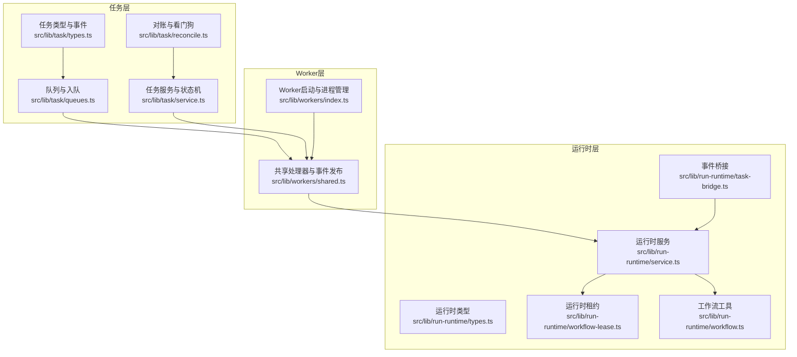
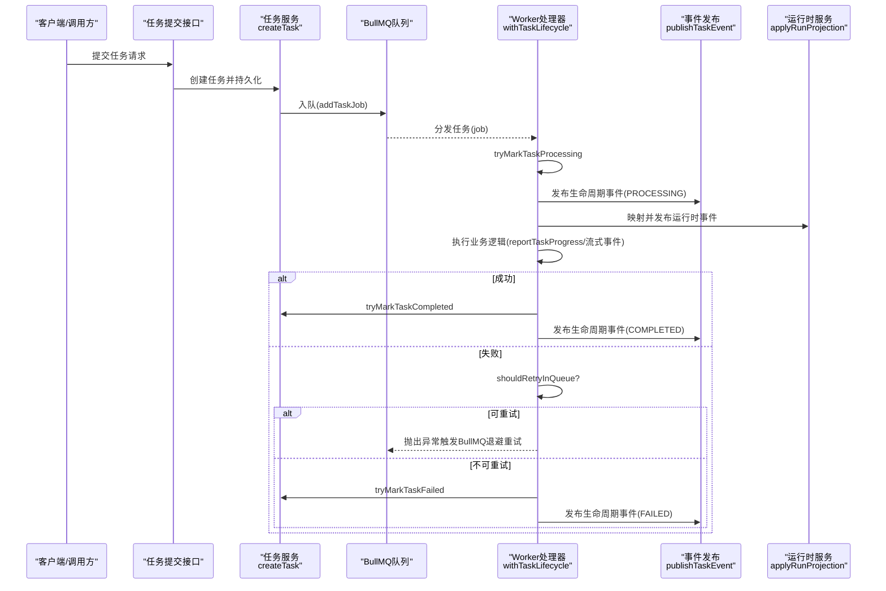
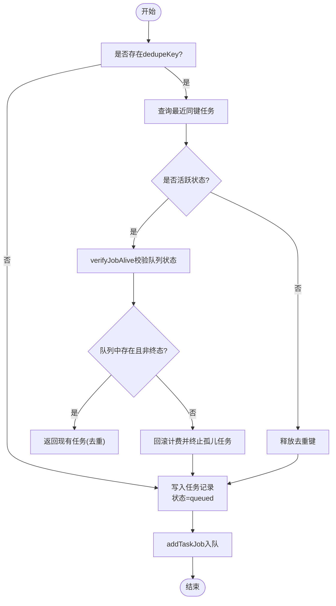
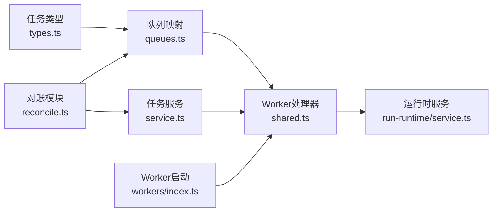

# 任务调度

<cite>
**本文引用的文件**
- [src/lib/task/types.ts](file://src/lib/task/types.ts)
- [src/lib/task/queues.ts](file://src/lib/task/queues.ts)
- [src/lib/task/service.ts](file://src/lib/task/service.ts)
- [src/lib/task/reconcile.ts](file://src/lib/task/reconcile.ts)
- [src/lib/workers/shared.ts](file://src/lib/workers/shared.ts)
- [src/lib/workers/index.ts](file://src/lib/workers/index.ts)
- [src/lib/run-runtime/types.ts](file://src/lib/run-runtime/types.ts)
- [src/lib/run-runtime/service.ts](file://src/lib/run-runtime/service.ts)
- [src/lib/run-runtime/workflow-lease.ts](file://src/lib/run-runtime/workflow-lease.ts)
- [src/lib/run-runtime/workflow.ts](file://src/lib/run-runtime/workflow.ts)
- [src/lib/run-runtime/task-bridge.ts](file://src/lib/run-runtime/task-bridge.ts)
- [src/instrumentation.ts](file://src/instrumentation.ts)
- [tests/system/helpers/tasks.ts](file://tests/system/helpers/tasks.ts)
</cite>

## 目录
1. [简介](#简介)
2. [项目结构](#项目结构)
3. [核心组件](#核心组件)
4. [架构总览](#架构总览)
5. [详细组件分析](#详细组件分析)
6. [依赖分析](#依赖分析)
7. [性能考量](#性能考量)
8. [故障排查指南](#故障排查指南)
9. [结论](#结论)
10. [附录](#附录)

## 简介
本文件面向Waoowaoo的任务调度系统，围绕基于BullMQ的任务队列与run-runtime运行时两大子系统，系统性阐述以下主题：
- 基于BullMQ的任务创建、入队、优先级与调度策略
- run-runtime如何协调多任务执行顺序与步骤依赖
- 任务状态转换机制：从created、waiting、active到completed/failed的全生命周期
- 任务依赖管理：前置条件与并行执行的实现思路
- 超时处理、重试与错误恢复策略
- 任务序列化与反序列化在分布式环境中的保障
- 监控与调试：日志、事件发布与性能指标采集

## 项目结构
任务调度相关代码主要分布在如下模块：
- 任务定义与类型：src/lib/task/types.ts
- 队列与入队：src/lib/task/queues.ts
- 任务服务与状态机：src/lib/task/service.ts
- 对账与看门狗：src/lib/task/reconcile.ts
- Worker通用逻辑与事件发布：src/lib/workers/shared.ts
- Worker启动与进程管理：src/lib/workers/index.ts
- 运行时（run-runtime）类型与服务：src/lib/run-runtime/types.ts、src/lib/run-runtime/service.ts
- 运行时租约与工作流：src/lib/run-runtime/workflow-lease.ts、src/lib/run-runtime/workflow.ts
- 任务事件到运行时事件映射：src/lib/run-runtime/task-bridge.ts
- 应用启动与队列重建：src/instrumentation.ts
- 测试辅助：tests/system/helpers/tasks.ts

图示来源
- [src/lib/task/queues.ts:1-112](file://src/lib/task/queues.ts#L1-L112)
- [src/lib/task/service.ts:1-637](file://src/lib/task/service.ts#L1-L637)
- [src/lib/task/reconcile.ts:1-226](file://src/lib/task/reconcile.ts#L1-L226)
- [src/lib/workers/shared.ts:1-731](file://src/lib/workers/shared.ts#L1-L731)
- [src/lib/workers/index.ts:1-39](file://src/lib/workers/index.ts#L1-L39)
- [src/lib/run-runtime/types.ts:1-101](file://src/lib/run-runtime/types.ts#L1-L101)
- [src/lib/run-runtime/service.ts:1-800](file://src/lib/run-runtime/service.ts#L1-L800)
- [src/lib/run-runtime/workflow-lease.ts:51-72](file://src/lib/run-runtime/workflow-lease.ts#L51-L72)
- [src/lib/run-runtime/workflow.ts:1-13](file://src/lib/run-runtime/workflow.ts#L1-L13)
- [src/lib/run-runtime/task-bridge.ts:1-33](file://src/lib/run-runtime/task-bridge.ts#L1-L33)

章节来源
- [src/lib/task/types.ts:1-159](file://src/lib/task/types.ts#L1-L159)
- [src/lib/task/queues.ts:1-112](file://src/lib/task/queues.ts#L1-L112)
- [src/lib/task/service.ts:1-637](file://src/lib/task/service.ts#L1-L637)
- [src/lib/task/reconcile.ts:1-226](file://src/lib/task/reconcile.ts#L1-L226)
- [src/lib/workers/shared.ts:1-731](file://src/lib/workers/shared.ts#L1-L731)
- [src/lib/workers/index.ts:1-39](file://src/lib/workers/index.ts#L1-L39)
- [src/lib/run-runtime/types.ts:1-101](file://src/lib/run-runtime/types.ts#L1-L101)
- [src/lib/run-runtime/service.ts:1-800](file://src/lib/run-runtime/service.ts#L1-L800)
- [src/lib/run-runtime/workflow-lease.ts:51-72](file://src/lib/run-runtime/workflow-lease.ts#L51-L72)
- [src/lib/run-runtime/workflow.ts:1-13](file://src/lib/run-runtime/workflow.ts#L1-L13)
- [src/lib/run-runtime/task-bridge.ts:1-33](file://src/lib/run-runtime/task-bridge.ts#L1-L33)
- [src/instrumentation.ts:37-63](file://src/instrumentation.ts#L37-L63)
- [tests/system/helpers/tasks.ts:1-53](file://tests/system/helpers/tasks.ts#L1-L53)

## 核心组件
- 任务类型与事件：定义任务状态、生命周期事件、SSE事件类型、任务类型枚举与作业载荷结构，确保跨模块一致的数据契约。
- 队列与入队：按任务类型路由到不同队列（图像/视频/语音/文本），统一默认重试与退避策略，并支持优先级与单次尝试任务类型。
- 任务服务：封装任务创建、去重、状态更新、心跳、进度上报、完成/失败标记、取消与批量清理等操作，保证DB与队列状态一致性。
- Worker共享逻辑：统一生命周期包装、进度上报、流式事件发布、重试决策、错误归一化与UnrecoverableError抛出，确保BullMQ与应用层状态同步。
- 运行时（run-runtime）：以“运行”为单位聚合步骤，维护步骤状态、尝试次数、输出与错误，支持租约续期与恢复，提供事件投影到运行时模型的能力。

章节来源
- [src/lib/task/types.ts:1-159](file://src/lib/task/types.ts#L1-L159)
- [src/lib/task/queues.ts:1-112](file://src/lib/task/queues.ts#L1-L112)
- [src/lib/task/service.ts:164-294](file://src/lib/task/service.ts#L164-L294)
- [src/lib/workers/shared.ts:319-646](file://src/lib/workers/shared.ts#L319-L646)
- [src/lib/run-runtime/service.ts:468-674](file://src/lib/run-runtime/service.ts#L468-L674)

## 架构总览
下图展示了从任务提交到Worker执行、事件发布与运行时投影的整体流程。

图示来源
- [src/lib/task/service.ts:164-294](file://src/lib/task/service.ts#L164-L294)
- [src/lib/task/queues.ts:88-101](file://src/lib/task/queues.ts#L88-L101)
- [src/lib/workers/shared.ts:319-646](file://src/lib/workers/shared.ts#L319-L646)
- [src/lib/run-runtime/task-bridge.ts:28-33](file://src/lib/run-runtime/task-bridge.ts#L28-L33)
- [src/lib/run-runtime/service.ts:468-674](file://src/lib/run-runtime/service.ts#L468-L674)

## 详细组件分析

### 任务创建与去重
- 去重键（dedupeKey）：若提供，先查询最近同键任务；若处于活跃状态则复用；否则根据BullMQ状态决定是否终止孤儿任务并释放键。
- 本地化要求：若任务载荷缺少语言信息，直接标记失败并回滚计费。
- 竞态处理：利用Prisma唯一约束冲突回退路径，再次校验BullMQ状态，确保一致性。

图示来源
- [src/lib/task/service.ts:164-294](file://src/lib/task/service.ts#L164-L294)
- [src/lib/task/reconcile.ts:54-71](file://src/lib/task/reconcile.ts#L54-L71)

章节来源
- [src/lib/task/service.ts:164-294](file://src/lib/task/service.ts#L164-L294)
- [src/lib/task/reconcile.ts:11-226](file://src/lib/task/reconcile.ts#L11-L226)

### 队列与调度策略
- 队列分类：按任务类型映射到图像/视频/语音/文本队列，统一默认重试次数与指数退避策略。
- 单次尝试任务：部分长流程任务设置仅一次尝试，避免无意义重试。
- 优先级：支持传入优先级参数，BullMQ按优先级与FIFO混合调度。
- 移除策略：已完成/失败任务自动清理历史记录，控制队列体积。

章节来源
- [src/lib/task/queues.ts:12-101](file://src/lib/task/queues.ts#L12-L101)
- [src/lib/task/types.ts:40-81](file://src/lib/task/types.ts#L40-L81)

### Worker生命周期与事件发布
- 生命周期包装：withTaskLifecycle负责任务进入processing、发布PROGRESS/PROCESSING事件、执行业务、发布COMPLETED或FAILED事件。
- 进度上报：reportTaskProgress标准化进度与消息，同时持久化进度与payload。
- 流式事件：LLM流式输出通过reportTaskStreamChunk发布，支持持久化重放。
- 重试决策：shouldRetryInQueue综合BullMQ退避与应用层错误归一化，决定是否由BullMQ重试。
- 计费结算：成功时结算计费并更新任务计费信息；失败或终止时回滚计费。

章节来源
- [src/lib/workers/shared.ts:319-646](file://src/lib/workers/shared.ts#L319-L646)
- [src/lib/workers/shared.ts:648-731](file://src/lib/workers/shared.ts#L648-L731)

### 任务状态转换与生命周期
- 状态枚举：queued、processing、completed、failed、canceled、dismissed。
- 生命周期事件：task.created → task.processing → task.progress（多次）→ task.completed 或 task.failed。
- 终态保护：若任务已为终态，跳过重复事件发布，避免状态倒退。
- 终止与取消：TaskTerminatedError作为“终止”信号，强制UnrecoverableError，确保BullMQ记录失败。

章节来源
- [src/lib/task/types.ts:3-10](file://src/lib/task/types.ts#L3-L10)
- [src/lib/task/types.ts:14-38](file://src/lib/task/types.ts#L14-L38)
- [src/lib/workers/shared.ts:467-482](file://src/lib/workers/shared.ts#L467-L482)

### 任务依赖管理与并行执行
- 步骤依赖：运行时通过步骤索引与层级排序，确保前置步骤完成后才进入后续步骤。
- 并行策略：同一层级内步骤可并行执行；跨层级严格按拓扑序推进。
- 阻塞与恢复：当步骤被上游阻塞时标记blocked，解除后按依赖层级重新排序。

章节来源
- [src/lib/query/hooks/run-stream/state-machine.ts:488-534](file://src/lib/query/hooks/run-stream/state-machine.ts#L488-L534)
- [src/lib/run-runtime/service.ts:468-674](file://src/lib/run-runtime/service.ts#L468-L674)

### 超时处理、重试与错误恢复
- 心跳超时：watchdog定时扫描processing且长时间无心跳的任务，回滚计费并标记失败。
- 队列重试：BullMQ指数退避；应用层再判断是否可重试，避免重复重试。
- 错误归一化：统一错误码与可重试标记，便于策略一致。
- 重启恢复：应用启动时扫描DB queued任务并重新入队，解决Redis重启导致的孤儿任务。

章节来源
- [src/lib/task/reconcile.ts:214-226](file://src/lib/task/reconcile.ts#L214-L226)
- [src/lib/workers/shared.ts:240-279](file://src/lib/workers/shared.ts#L240-L279)
- [src/instrumentation.ts:37-63](file://src/instrumentation.ts#L37-L63)

### 任务序列化与分布式一致性
- 作业载荷：TaskJobData包含任务标识、类型、目标、用户、语言、计费信息与trace等，确保跨节点可识别与追踪。
- 事件载荷：SSE事件payload包含阶段、显示模式、消息与运行时字段，便于UI与运行时消费。
- 计费信息：JSON字段存储，支持结算与回滚，确保分布式环境下计费一致性。

章节来源
- [src/lib/task/types.ts:114-144](file://src/lib/task/types.ts#L114-L144)
- [src/lib/workers/shared.ts:53-80](file://src/lib/workers/shared.ts#L53-L80)

### 监控与调试
- 日志：按模块与任务维度打点，包含队列名、任务类型、阶段、耗时与错误链路。
- SSE事件：任务生命周期与流式事件通过SSE广播，前端实时订阅。
- 运行时事件：任务事件映射为运行时事件，投影到运行时模型，支持重放与审计。
- 测试等待：提供等待任务到达终态的辅助函数，便于集成测试与回归验证。

章节来源
- [src/lib/workers/shared.ts:334-441](file://src/lib/workers/shared.ts#L334-L441)
- [src/lib/workers/shared.ts:148-226](file://src/lib/workers/shared.ts#L148-L226)
- [src/lib/run-runtime/task-bridge.ts:28-33](file://src/lib/run-runtime/task-bridge.ts#L28-L33)
- [tests/system/helpers/tasks.ts:21-37](file://tests/system/helpers/tasks.ts#L21-L37)

## 依赖分析
- 任务类型与队列：任务类型映射到队列，单次尝试任务类型独立处理。
- Worker与任务服务：Worker在执行前后调用任务服务进行状态更新与计费处理。
- 运行时与任务：任务事件经task-bridge映射为运行时事件，运行时服务投影到运行模型。
- 看门狗与对账：对账模块扫描BullMQ状态与DB状态，修复脱节问题；watchdog处理心跳超时。

图示来源
- [src/lib/task/types.ts:40-81](file://src/lib/task/types.ts#L40-L81)
- [src/lib/task/queues.ts:67-86](file://src/lib/task/queues.ts#L67-L86)
- [src/lib/workers/shared.ts:319-646](file://src/lib/workers/shared.ts#L319-L646)
- [src/lib/task/service.ts:393-484](file://src/lib/task/service.ts#L393-L484)
- [src/lib/task/reconcile.ts:44-71](file://src/lib/task/reconcile.ts#L44-L71)
- [src/lib/run-runtime/service.ts:468-674](file://src/lib/run-runtime/service.ts#L468-L674)
- [src/lib/workers/index.ts:1-39](file://src/lib/workers/index.ts#L1-L39)

章节来源
- [src/lib/task/queues.ts:67-86](file://src/lib/task/queues.ts#L67-L86)
- [src/lib/workers/shared.ts:319-646](file://src/lib/workers/shared.ts#L319-L646)
- [src/lib/task/service.ts:393-484](file://src/lib/task/service.ts#L393-L484)
- [src/lib/task/reconcile.ts:44-71](file://src/lib/task/reconcile.ts#L44-L71)
- [src/lib/run-runtime/service.ts:468-674](file://src/lib/run-runtime/service.ts#L468-L674)
- [src/lib/workers/index.ts:1-39](file://src/lib/workers/index.ts#L1-L39)

## 性能考量
- 队列退避与重试：指数退避降低瞬时压力，结合应用层可重试判定避免无效重试。
- 心跳与清理：定期清理已完成/失败任务，限制队列规模；心跳超时快速失败，缩短资源占用。
- 并行与依赖：按层级并行执行，减少整体时延；严格依赖保证正确性。
- 计费与补偿：结算与回滚在事务内完成，避免计费不一致带来的性能与成本问题。

## 故障排查指南
- 任务卡在queued/processing
  - 检查Redis连通性与队列状态；使用对账模块isJobAlive确认任务是否仍在队列。
  - 观察watchdog日志，确认是否因心跳超时被标记失败。
- 任务重复执行或未执行
  - 检查去重键是否正确设置与释放；查看createTask的竞态回退路径。
- 任务失败但计费未回滚
  - 查看Worker中的回滚逻辑与计费状态；确认错误是否被标记为不可重试。
- 运行时事件缺失
  - 检查task-bridge映射与运行时applyRunProjection；确认事件持久化与重放策略。

章节来源
- [src/lib/task/reconcile.ts:54-71](file://src/lib/task/reconcile.ts#L54-L71)
- [src/lib/task/service.ts:164-294](file://src/lib/task/service.ts#L164-L294)
- [src/lib/workers/shared.ts:467-646](file://src/lib/workers/shared.ts#L467-L646)
- [src/lib/run-runtime/task-bridge.ts:28-33](file://src/lib/run-runtime/task-bridge.ts#L28-L33)
- [src/lib/run-runtime/service.ts:468-674](file://src/lib/run-runtime/service.ts#L468-L674)

## 结论
Waoowaoo的任务调度系统以BullMQ为核心，结合run-runtime的步骤化执行模型，实现了高可靠、可观测、可恢复的任务编排。通过严格的去重、对账与看门狗机制，系统在分布式环境下保持了任务状态的一致性；通过事件驱动与租约续期，确保复杂工作流的有序执行与快速恢复。建议在生产环境中持续关注队列容量、重试策略与计费回滚的稳定性，并完善监控告警与日志检索能力。

## 附录
- 关键流程参考
  - 任务创建与入队：[src/lib/task/service.ts:164-294](file://src/lib/task/service.ts#L164-L294)、[src/lib/task/queues.ts:88-101](file://src/lib/task/queues.ts#L88-L101)
  - Worker生命周期与事件发布：[src/lib/workers/shared.ts:319-646](file://src/lib/workers/shared.ts#L319-L646)
  - 运行时事件投影：[src/lib/run-runtime/service.ts:468-674](file://src/lib/run-runtime/service.ts#L468-L674)
  - 应用启动恢复：[src/instrumentation.ts:37-63](file://src/instrumentation.ts#L37-L63)