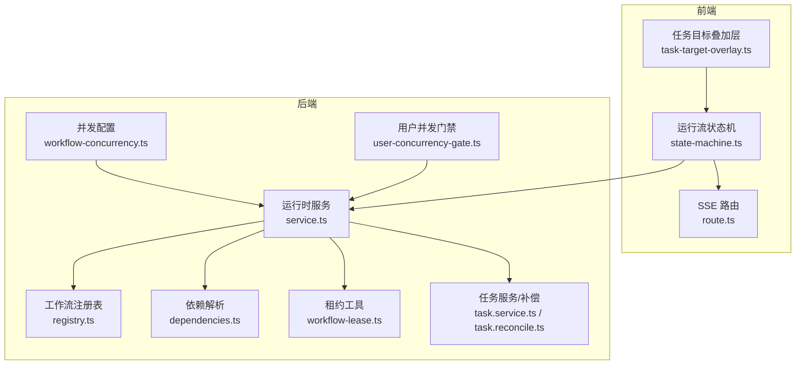
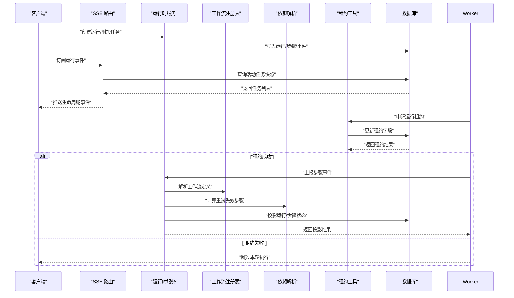
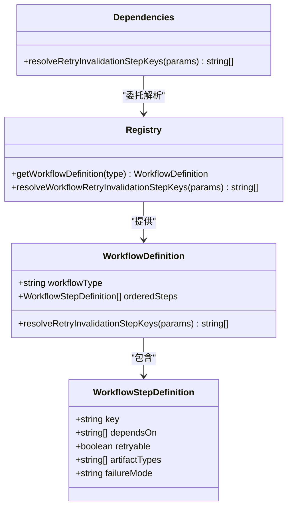
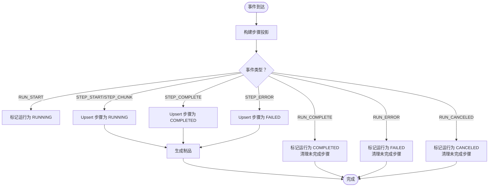
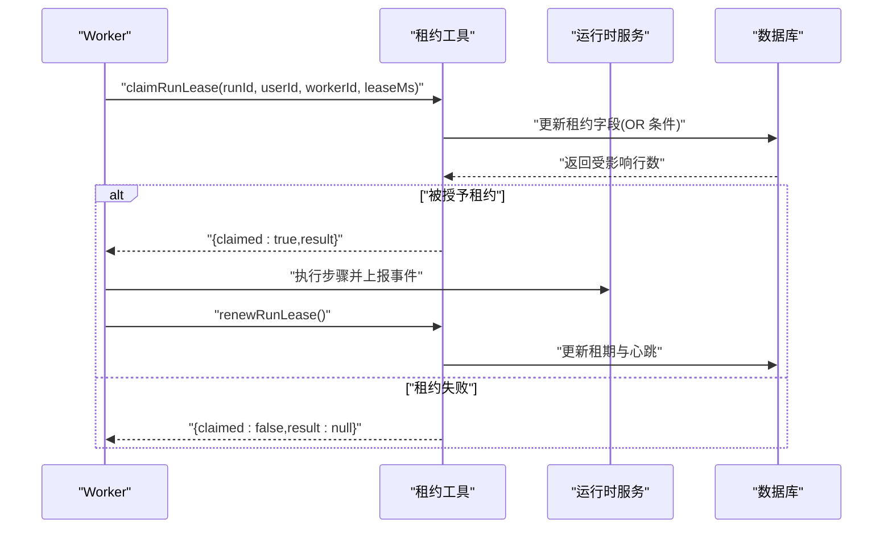
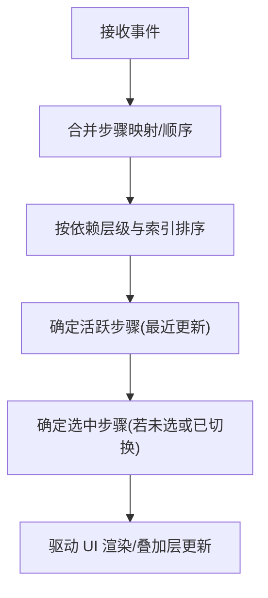
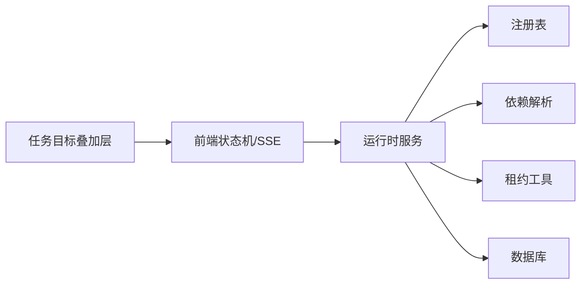

# 工作流协调

<cite>
**本文引用的文件**
- [src/lib/workflow-engine/registry.ts](file://src/lib/workflow-engine/registry.ts)
- [src/lib/workflow-engine/dependencies.ts](file://src/lib/workflow-engine/dependencies.ts)
- [src/lib/run-runtime/types.ts](file://src/lib/run-runtime/types.ts)
- [src/lib/run-runtime/service.ts](file://src/lib/run-runtime/service.ts)
- [src/lib/run-runtime/workflow-lease.ts](file://src/lib/run-runtime/workflow-lease.ts)
- [src/lib/workflow-concurrency.ts](file://src/lib/workflow-concurrency.ts)
- [src/lib/workers/user-concurrency-gate.ts](file://src/lib/workers/user-concurrency-gate.ts)
- [src/lib/query/hooks/run-stream/state-machine.ts](file://src/lib/query/hooks/run-stream/state-machine.ts)
- [src/app/api/sse/route.ts](file://src/app/api/sse/route.ts)
- [src/lib/query/task-target-overlay.ts](file://src/lib/query/task-target-overlay.ts)
- [src/lib/task/service.ts](file://src/lib/task/service.ts)
- [src/lib/task/reconcile.ts](file://src/lib/task/reconcile.ts)
- [src/app/api/user/api-config/route.ts](file://src/app/api/user/api-config/route.ts)
- [src/app/[locale]/profile/components/api-config/hooks.ts](file://src/app/[locale]/profile/components/api-config/hooks.ts)
- [tests/unit/workflow-engine/registry.test.ts](file://tests/unit/workflow-engine/registry.test.ts)
- [tests/unit/worker/user-concurrency-gate.test.ts](file://tests/unit/worker/user-concurrency-gate.test.ts)
</cite>

## 目录
1. [简介](#简介)
2. [项目结构](#项目结构)
3. [核心组件](#核心组件)
4. [架构总览](#架构总览)
5. [详细组件分析](#详细组件分析)
6. [依赖分析](#依赖分析)
7. [性能考虑](#性能考虑)
8. [故障排查指南](#故障排查指南)
9. [结论](#结论)
10. [附录](#附录)

## 简介
本技术文档面向 Waoowaoo 的工作流协调系统，围绕“多任务工作流编排”展开，重点涵盖以下方面：
- 多任务工作流的编排机制：任务间依赖关系定义与执行顺序控制
- 工作流租约机制：防止并发冲突与资源竞争
- 工作流状态管理：整体进度跟踪与局部状态同步
- 启动、暂停、恢复、终止：生命周期控制与补偿策略
- 异常处理与故障恢复：部分失败的补偿与重试
- 监控与调试：SSE 实时事件、UI 叠加层与运行快照
- 模板与配置管理：工作流并发配置与用户级并发门禁

## 项目结构
工作流协调系统由“工作流定义注册表”“运行时服务”“租约与并发控制”“状态机与事件投影”“监控与可视化”等模块组成，前后端协同完成从提交到执行、从追踪到恢复的全链路能力。

图示来源
- [src/lib/query/hooks/run-stream/state-machine.ts:488-575](file://src/lib/query/hooks/run-stream/state-machine.ts#L488-L575)
- [src/app/api/sse/route.ts:36-75](file://src/app/api/sse/route.ts#L36-L75)
- [src/lib/query/task-target-overlay.ts:121-155](file://src/lib/query/task-target-overlay.ts#L121-L155)
- [src/lib/workflow-engine/registry.ts:1-215](file://src/lib/workflow-engine/registry.ts#L1-L215)
- [src/lib/workflow-engine/dependencies.ts:1-10](file://src/lib/workflow-engine/dependencies.ts#L1-L10)
- [src/lib/run-runtime/service.ts:1-1200](file://src/lib/run-runtime/service.ts#L1-L1200)
- [src/lib/run-runtime/workflow-lease.ts:1-49](file://src/lib/run-runtime/workflow-lease.ts#L1-L49)
- [src/lib/workflow-concurrency.ts:1-43](file://src/lib/workflow-concurrency.ts#L1-L43)
- [src/lib/workers/user-concurrency-gate.ts:1-69](file://src/lib/workers/user-concurrency-gate.ts#L1-L69)
- [src/lib/task/service.ts:506-548](file://src/lib/task/service.ts#L506-L548)
- [src/lib/task/reconcile.ts:110-149](file://src/lib/task/reconcile.ts#L110-L149)

章节来源
- [src/lib/workflow-engine/registry.ts:1-215](file://src/lib/workflow-engine/registry.ts#L1-L215)
- [src/lib/run-runtime/service.ts:1-1200](file://src/lib/run-runtime/service.ts#L1-L1200)

## 核心组件
- 工作流注册表与依赖解析
  - 定义工作流步骤、依赖关系、可重试性与失效范围
  - 提供“重试失效步骤键集合”的解析能力，确保输入变更时下游一致性
- 运行时服务
  - 统一的运行事件投影、运行状态持久化、租约管理、取消与重试
  - 支持运行快照、事件序列、检查点与制品管理
- 租约与并发控制
  - 基于数据库的运行租约，保障 Worker 并发安全
  - 用户级并发门禁，按作用域与用户限流
- 状态机与事件投影
  - 前端运行流状态机根据事件计算步骤排序、活跃步骤与选中步骤
  - SSE 聚合任务生命周期事件，驱动 UI 实时更新
- 监控与可视化
  - SSE 列表快照与 UI 叠加层，直观呈现目标对象的运行态
  - 任务补偿与对账，自动恢复异常状态

章节来源
- [src/lib/workflow-engine/registry.ts:1-215](file://src/lib/workflow-engine/registry.ts#L1-L215)
- [src/lib/workflow-engine/dependencies.ts:1-10](file://src/lib/workflow-engine/dependencies.ts#L1-L10)
- [src/lib/run-runtime/types.ts:1-101](file://src/lib/run-runtime/types.ts#L1-L101)
- [src/lib/run-runtime/service.ts:1-1200](file://src/lib/run-runtime/service.ts#L1-L1200)
- [src/lib/run-runtime/workflow-lease.ts:1-49](file://src/lib/run-runtime/workflow-lease.ts#L1-L49)
- [src/lib/workflow-concurrency.ts:1-43](file://src/lib/workflow-concurrency.ts#L1-L43)
- [src/lib/workers/user-concurrency-gate.ts:1-69](file://src/lib/workers/user-concurrency-gate.ts#L1-L69)
- [src/lib/query/hooks/run-stream/state-machine.ts:488-575](file://src/lib/query/hooks/run-stream/state-machine.ts#L488-L575)
- [src/app/api/sse/route.ts:36-75](file://src/app/api/sse/route.ts#L36-L75)
- [src/lib/query/task-target-overlay.ts:121-155](file://src/lib/query/task-target-overlay.ts#L121-L155)

## 架构总览
下图展示了从前端到后端的关键交互路径：用户提交工作流 -> 后端创建运行并落库 -> Worker 通过租约抢占执行 -> 事件投影更新运行/步骤状态 -> SSE 推送实时事件 -> UI 叠加层同步状态。

图示来源
- [src/lib/run-runtime/service.ts:676-778](file://src/lib/run-runtime/service.ts#L676-L778)
- [src/lib/run-runtime/workflow-lease.ts:33-49](file://src/lib/run-runtime/workflow-lease.ts#L33-L49)
- [src/lib/workflow-engine/registry.ts:197-214](file://src/lib/workflow-engine/registry.ts#L197-L214)
- [src/lib/workflow-engine/dependencies.ts:1-10](file://src/lib/workflow-engine/dependencies.ts#L1-L10)
- [src/app/api/sse/route.ts:36-75](file://src/app/api/sse/route.ts#L36-L75)

## 详细组件分析

### 工作流注册表与依赖解析
- 注册表定义两类典型运行类型：故事到脚本、脚本到分镜
- 每个步骤包含：键名、前置依赖、是否可重试、制品类型、失败模式
- 重试失效解析：当上游步骤输入变化时，自动失效受影响的下游步骤键集合，保证一致性

图示来源
- [src/lib/workflow-engine/registry.ts:1-215](file://src/lib/workflow-engine/registry.ts#L1-L215)
- [src/lib/workflow-engine/dependencies.ts:1-10](file://src/lib/workflow-engine/dependencies.ts#L1-L10)

章节来源
- [src/lib/workflow-engine/registry.ts:98-195](file://src/lib/workflow-engine/registry.ts#L98-L195)
- [tests/unit/workflow-engine/registry.test.ts:1-37](file://tests/unit/workflow-engine/registry.test.ts#L1-L37)

### 运行时服务与事件投影
- 事件投影：统一处理运行开始/完成/错误、步骤开始/增量/完成/错误等事件，原子性更新运行与步骤状态
- 运行生命周期：QUEUED → RUNNING → COMPLETED/FAILED/CANCELED；支持取消请求与清理
- 重试与失效：基于注册表解析失效步骤键集合，删除对应制品并重置步骤状态
- 快照与事件：提供运行快照、事件序列查询、检查点管理

图示来源
- [src/lib/run-runtime/service.ts:468-674](file://src/lib/run-runtime/service.ts#L468-L674)

章节来源
- [src/lib/run-runtime/service.ts:676-1200](file://src/lib/run-runtime/service.ts#L676-L1200)
- [src/lib/run-runtime/types.ts:1-101](file://src/lib/run-runtime/types.ts#L1-L101)

### 租约机制与并发控制
- 运行租约
  - Worker 申请租约时携带运行 ID、用户 ID、Worker ID 与租期
  - 通过数据库条件更新，满足“空闲/本人/过期/相同状态”之一才允许续租
  - 租约丢失或运行非活动状态会触发终止错误
- 用户并发门禁
  - 针对同一用户在同一作用域（如图像/视频）限制并发槽位
  - 使用队列等待与释放，避免超配

图示来源
- [src/lib/run-runtime/workflow-lease.ts:33-806](file://src/lib/run-runtime/workflow-lease.ts#L33-L806)
- [src/lib/workers/user-concurrency-gate.ts:26-69](file://src/lib/workers/user-concurrency-gate.ts#L26-L69)

章节来源
- [src/lib/run-runtime/workflow-lease.ts:1-806](file://src/lib/run-runtime/workflow-lease.ts#L1-L806)
- [src/lib/workers/user-concurrency-gate.ts:1-69](file://src/lib/workers/user-concurrency-gate.ts#L1-L69)
- [tests/unit/worker/user-concurrency-gate.test.ts:1-51](file://tests/unit/worker/user-concurrency-gate.test.ts#L1-L51)

### 状态机与前端渲染
- 前端运行流状态机根据事件动态维护步骤映射、步骤顺序、活跃步骤与选中步骤
- 依据步骤依赖层级与索引进行稳定排序，确保 UI 展示一致
- SSE 路由聚合任务生命周期事件，提供实时快照

图示来源
- [src/lib/query/hooks/run-stream/state-machine.ts:488-575](file://src/lib/query/hooks/run-stream/state-machine.ts#L488-L575)
- [src/app/api/sse/route.ts:36-75](file://src/app/api/sse/route.ts#L36-L75)
- [src/lib/query/task-target-overlay.ts:121-155](file://src/lib/query/task-target-overlay.ts#L121-L155)

章节来源
- [src/lib/query/hooks/run-stream/state-machine.ts:488-575](file://src/lib/query/hooks/run-stream/state-machine.ts#L488-L575)
- [src/app/api/sse/route.ts:36-75](file://src/app/api/sse/route.ts#L36-L75)
- [src/lib/query/task-target-overlay.ts:121-155](file://src/lib/query/task-target-overlay.ts#L121-L155)

### 生命周期控制：启动/暂停/恢复/终止
- 启动：RUN_START 将运行置为 RUNNING，必要时设置开始时间
- 暂停：请求取消（CANCELING），随后步骤与运行均置为 CANCELED
- 恢复：STEP_ERROR 或 RUN_ERROR 后，可基于注册表解析失效步骤并重试
- 终止：RUN_ERROR 将运行置为 FAILED，清理未完成步骤

章节来源
- [src/lib/run-runtime/service.ts:471-562](file://src/lib/run-runtime/service.ts#L471-L562)
- [src/lib/run-runtime/service.ts:1101-1199](file://src/lib/run-runtime/service.ts#L1101-L1199)

### 异常处理与故障恢复
- 任务补偿：对活动任务进行回滚计费并标记失败，发布 FAILED 事件以刷新前端
- 对账与恢复：扫描过期/异常任务，批量标记失败并发送补偿事件
- 运行重试：仅对 FAILED 步骤进行重试，自动失效受影响下游步骤，删除对应制品

章节来源
- [src/lib/task/service.ts:506-548](file://src/lib/task/service.ts#L506-L548)
- [src/lib/task/reconcile.ts:110-149](file://src/lib/task/reconcile.ts#L110-L149)
- [src/lib/run-runtime/service.ts:1101-1199](file://src/lib/run-runtime/service.ts#L1101-L1199)

### 监控与调试
- SSE 实时事件：列出当前排队/处理中的任务，注入生命周期类型与意图信息
- UI 叠加层：在目标对象上叠加运行态，显示阶段、进度与输出状态
- 事件序列：按序号查询运行事件，便于回放与审计

章节来源
- [src/app/api/sse/route.ts:36-75](file://src/app/api/sse/route.ts#L36-L75)
- [src/lib/query/task-target-overlay.ts:121-155](file://src/lib/query/task-target-overlay.ts#L121-L155)
- [src/lib/run-runtime/service.ts:931-960](file://src/lib/run-runtime/service.ts#L931-L960)

### 模板与配置管理
- 工作流并发配置：默认值与归一化逻辑，支持按分析/图像/视频维度配置
- 用户 API 配置接口：校验与归一化用户提交的并发配置，保证参数合法
- 前端配置 Hook：提供乐观保存与归一化，提升交互体验

章节来源
- [src/lib/workflow-concurrency.ts:1-43](file://src/lib/workflow-concurrency.ts#L1-L43)
- [src/app/api/user/api-config/route.ts:1271-1308](file://src/app/api/user/api-config/route.ts#L1271-L1308)
- [src/app/[locale]/profile/components/api-config/hooks.ts](file://src/app/[locale]/profile/components/api-config/hooks.ts#L529-L537)

## 依赖分析
- 组件耦合
  - 运行时服务依赖注册表与依赖解析，确保事件投影符合工作流定义
  - 租约工具与运行时服务配合，保障 Worker 并发安全
  - 前端状态机依赖运行时服务提供的事件与快照
- 外部依赖
  - 数据库：Prisma 访问 graph_run/graph_step/graph_event/graph_artifact/graph_checkpoint
  - SSE：提供实时事件流

图示来源
- [src/lib/run-runtime/service.ts:1-1200](file://src/lib/run-runtime/service.ts#L1-L1200)
- [src/lib/workflow-engine/registry.ts:1-215](file://src/lib/workflow-engine/registry.ts#L1-L215)
- [src/lib/workflow-engine/dependencies.ts:1-10](file://src/lib/workflow-engine/dependencies.ts#L1-L10)
- [src/lib/run-runtime/workflow-lease.ts:1-806](file://src/lib/run-runtime/workflow-lease.ts#L1-L806)
- [src/lib/query/hooks/run-stream/state-machine.ts:488-575](file://src/lib/query/hooks/run-stream/state-machine.ts#L488-L575)
- [src/lib/query/task-target-overlay.ts:121-155](file://src/lib/query/task-target-overlay.ts#L121-L155)

章节来源
- [src/lib/run-runtime/service.ts:1-1200](file://src/lib/run-runtime/service.ts#L1-L1200)
- [src/lib/workflow-engine/registry.ts:1-215](file://src/lib/workflow-engine/registry.ts#L1-L215)
- [src/lib/workflow-engine/dependencies.ts:1-10](file://src/lib/workflow-engine/dependencies.ts#L1-L10)

## 性能考虑
- 事件投影原子化：事务内更新运行/步骤/事件/制品，减少不一致窗口
- 租约短周期轮询：降低锁竞争，提高吞吐
- 前端排序稳定：按依赖层级与索引排序，避免频繁重排
- SSE 限制与分页：限制返回条数与序列号，兼顾实时性与性能

## 故障排查指南
- 租约相关
  - 租约失败：确认运行状态为 QUEUED/RUNNING/CANCELING，且租约已过期或归属当前 Worker
  - 租约丢失：检查心跳与续租调用频率
- 重试与失效
  - 重试无效：核对注册表中该步骤的失效解析规则，确认下游步骤键集合是否正确
- 事件缺失
  - 检查事件序列查询参数（afterSeq/limit），确认用户权限
- UI 不更新
  - 检查 SSE 订阅是否建立，确认任务处于排队/处理中

章节来源
- [src/lib/run-runtime/workflow-lease.ts:11-806](file://src/lib/run-runtime/workflow-lease.ts#L11-L806)
- [src/lib/run-runtime/service.ts:931-960](file://src/lib/run-runtime/service.ts#L931-L960)
- [src/lib/workflow-engine/registry.ts:26-96](file://src/lib/workflow-engine/registry.ts#L26-L96)

## 结论
Waoowaoo 的工作流协调系统通过“注册表定义 + 事件投影 + 租约并发 + 前端状态机 + SSE 实时”的组合，实现了高可靠、可观测、可恢复的多任务编排。其关键优势在于：
- 明确的步骤依赖与失效范围，确保输入变更后的数据一致性
- 基于租约的并发控制，有效避免资源竞争
- 完整的生命周期与补偿机制，支持失败恢复与重试
- 丰富的监控与可视化手段，便于开发者理解与优化复杂流程

## 附录
- 关键类型与事件
  - 运行状态：queued/running/completed/failed/canceling/canceled
  - 步骤状态：pending/running/completed/failed/canceled
  - 事件类型：run.start/step.start/step.chunk/step.complete/step.error/run.complete/run.error/run.canceled
- 常用操作
  - 创建运行：提供用户、项目、目标类型/ID、工作流类型、输入
  - 申请/续租/释放租约：用于 Worker 抢占执行
  - 请求取消：将运行置为 canceling，最终清理未完成步骤
  - 重试失败步骤：自动失效受影响下游步骤并删除制品

章节来源
- [src/lib/run-runtime/types.ts:1-101](file://src/lib/run-runtime/types.ts#L1-L101)
- [src/lib/run-runtime/service.ts:676-822](file://src/lib/run-runtime/service.ts#L676-L822)
- [src/lib/run-runtime/service.ts:876-897](file://src/lib/run-runtime/service.ts#L876-L897)
- [src/lib/run-runtime/service.ts:1101-1199](file://src/lib/run-runtime/service.ts#L1101-L1199)