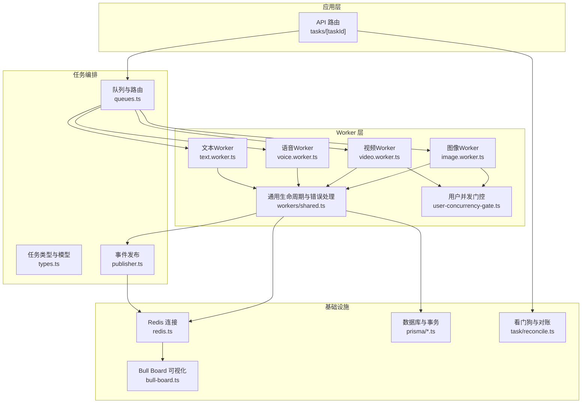
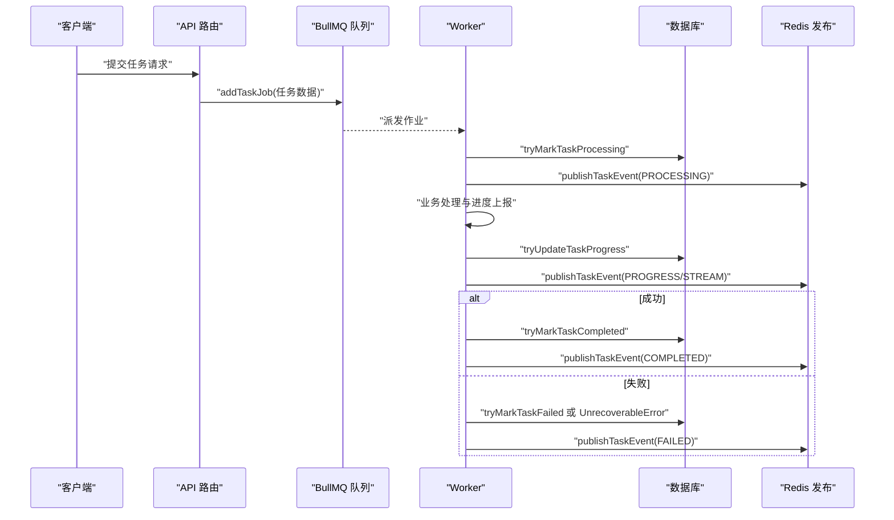
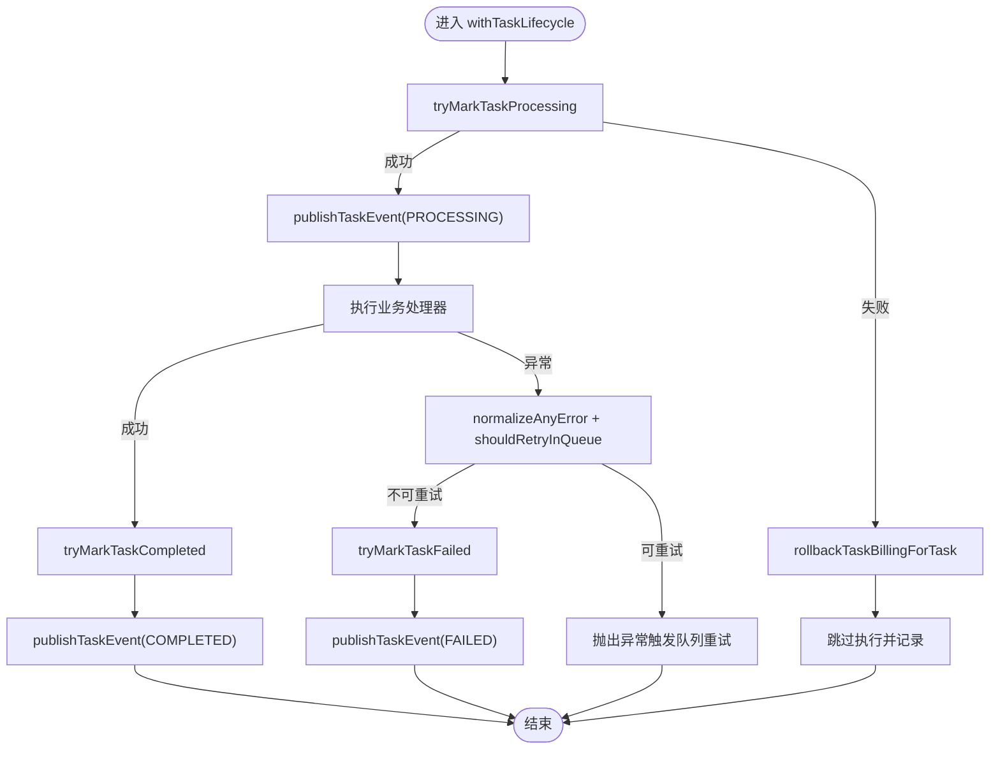
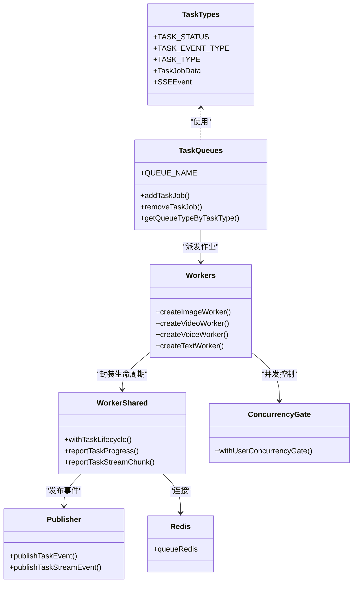

# 任务队列系统

<cite>
**本文引用的文件**
- [src/lib/task/types.ts](file://src/lib/task/types.ts)
- [src/lib/task/queues.ts](file://src/lib/task/queues.ts)
- [src/lib/task/service.ts](file://src/lib/task/service.ts)
- [src/lib/task/reconcile.ts](file://src/lib/task/reconcile.ts)
- [src/lib/task/publisher.ts](file://src/lib/task/publisher.ts)
- [src/lib/workers/shared.ts](file://src/lib/workers/shared.ts)
- [src/lib/workers/index.ts](file://src/lib/workers/index.ts)
- [src/lib/workers/image.worker.ts](file://src/lib/workers/image.worker.ts)
- [src/lib/workers/video.worker.ts](file://src/lib/workers/video.worker.ts)
- [src/lib/workers/voice.worker.ts](file://src/lib/workers/voice.worker.ts)
- [src/lib/workers/text.worker.ts](file://src/lib/workers/text.worker.ts)
- [src/lib/workers/user-concurrency-gate.ts](file://src/lib/workers/user-concurrency-gate.ts)
- [src/lib/redis.ts](file://src/lib/redis.ts)
- [scripts/bull-board.ts](file://scripts/bull-board.ts)
- [src/instrumentation.ts](file://src/instrumentation.ts)
- [src/app/api/tasks/[taskId]/route.ts](file://src/app/api/tasks/[taskId]/route.ts)
</cite>

## 目录
1. [简介](#简介)
2. [项目结构](#项目结构)
3. [核心组件](#核心组件)
4. [架构总览](#架构总览)
5. [详细组件分析](#详细组件分析)
6. [依赖关系分析](#依赖关系分析)
7. [性能考量](#性能考量)
8. [故障排查指南](#故障排查指南)
9. [结论](#结论)
10. [附录](#附录)

## 简介
本文件面向Waoowaoo的任务队列系统，基于BullMQ构建的异步任务处理架构。系统通过任务类型定义、Worker实现与任务状态管理，形成从创建、调度、执行到完成的完整生命周期；并通过错误处理、重试策略与看门狗机制保障可靠性；借助Bull Board提供可视化监控；通过Redis实现高性能队列与事件发布订阅；通过Prisma进行数据库持久化与事务处理。

## 项目结构
围绕任务队列的关键目录与文件：
- 任务类型与数据模型：src/lib/task/types.ts
- 队列与路由：src/lib/task/queues.ts
- 服务层与状态机：src/lib/task/service.ts、src/lib/task/reconcile.ts
- 事件发布：src/lib/task/publisher.ts
- Worker通用逻辑：src/lib/workers/shared.ts
- Worker实现：src/lib/workers/image.worker.ts、video.worker.ts、voice.worker.ts、text.worker.ts
- 并发控制：src/lib/workers/user-concurrency-gate.ts
- 连接与监控：src/lib/redis.ts、scripts/bull-board.ts
- 启动与恢复：src/instrumentation.ts
- API接口：src/app/api/tasks/[taskId]/route.ts

图表来源
- [src/lib/task/types.ts:1-159](file://src/lib/task/types.ts#L1-L159)
- [src/lib/task/queues.ts:1-112](file://src/lib/task/queues.ts#L1-L112)
- [src/lib/task/publisher.ts:286-310](file://src/lib/task/publisher.ts#L286-L310)
- [src/lib/workers/shared.ts:319-646](file://src/lib/workers/shared.ts#L319-L646)
- [src/lib/workers/image.worker.ts:50-67](file://src/lib/workers/image.worker.ts#L50-L67)
- [src/lib/workers/video.worker.ts:306-323](file://src/lib/workers/video.worker.ts#L306-L323)
- [src/lib/workers/voice.worker.ts:54-63](file://src/lib/workers/voice.worker.ts#L54-L63)
- [src/lib/workers/text.worker.ts:705-714](file://src/lib/workers/text.worker.ts#L705-L714)
- [src/lib/workers/user-concurrency-gate.ts:56-69](file://src/lib/workers/user-concurrency-gate.ts#L56-L69)
- [src/lib/redis.ts:50-75](file://src/lib/redis.ts#L50-L75)
- [scripts/bull-board.ts:63-71](file://scripts/bull-board.ts#L63-L71)

章节来源
- [src/lib/task/types.ts:1-159](file://src/lib/task/types.ts#L1-L159)
- [src/lib/task/queues.ts:1-112](file://src/lib/task/queues.ts#L1-L112)
- [src/lib/workers/shared.ts:319-646](file://src/lib/workers/shared.ts#L319-L646)
- [src/lib/workers/index.ts:1-39](file://src/lib/workers/index.ts#L1-L39)
- [src/lib/redis.ts:50-75](file://src/lib/redis.ts#L50-L75)
- [scripts/bull-board.ts:1-106](file://scripts/bull-board.ts#L1-L106)

## 核心组件
- 任务类型与模型：定义任务状态、事件类型、任务类型枚举、任务作业数据结构、SSE事件结构与创建输入参数。
- 队列与路由：定义四类队列名称，统一默认作业选项（去重、重试、指数退避），按任务类型映射到对应队列，并提供添加与移除作业的能力。
- Worker通用逻辑：封装任务生命周期（开始、进度、完成、失败）、心跳维护、错误归一化与重试决策、事件发布、计费结算/回滚、运行期流式事件发布。
- Worker实现：按队列类型组织具体任务处理器，负责业务逻辑执行、进度上报、结果落库或外部服务调用。
- 并发控制：基于用户维度的并发门控，限制单用户在图像/视频等高资源场景下的并发度。
- 事件发布：将任务生命周期事件与流式事件通过Redis频道广播，支持运行时事件镜像。
- 数据库与事务：通过Prisma进行任务状态更新、事务性写入与批量清理。
- 可视化监控：Bull Board提供队列状态、作业详情与管理界面。
- 看门狗与对账：定时巡检与孤儿任务处理，保证数据库与队列状态一致性。

章节来源
- [src/lib/task/types.ts:1-159](file://src/lib/task/types.ts#L1-L159)
- [src/lib/task/queues.ts:1-112](file://src/lib/task/queues.ts#L1-L112)
- [src/lib/workers/shared.ts:319-646](file://src/lib/workers/shared.ts#L319-L646)
- [src/lib/workers/user-concurrency-gate.ts:56-69](file://src/lib/workers/user-concurrency-gate.ts#L56-L69)
- [src/lib/task/publisher.ts:286-310](file://src/lib/task/publisher.ts#L286-L310)
- [src/lib/redis.ts:50-75](file://src/lib/redis.ts#L50-L75)
- [scripts/bull-board.ts:63-71](file://scripts/bull-board.ts#L63-L71)

## 架构总览
系统采用“请求-队列-Worker-数据库/存储”的解耦架构。请求侧通过API创建任务并入队；BullMQ根据队列类型与优先级调度；Worker在生命周期钩子内完成状态推进、事件发布与业务处理；数据库与Redis共同支撑状态与消息传递；Bull Board提供运维可视化。

图表来源
- [src/lib/task/queues.ts:88-101](file://src/lib/task/queues.ts#L88-L101)
- [src/lib/workers/shared.ts:319-646](file://src/lib/workers/shared.ts#L319-L646)
- [src/lib/task/publisher.ts:286-310](file://src/lib/task/publisher.ts#L286-L310)

## 详细组件分析

### 任务类型与数据模型
- 任务状态：queued、processing、completed、failed、canceled、dismissed
- 事件类型：created、processing、progress、completed、failed
- SSE事件类型：task.lifecycle、task.stream
- 任务类型：图像、视频、语音、文本相关工作流与AI生成任务
- 任务作业数据：包含taskId、type、locale、targetType/targetId、payload、billingInfo、userId、trace等
- 创建输入：支持去重键、优先级、最大尝试次数、计费信息等

章节来源
- [src/lib/task/types.ts:1-159](file://src/lib/task/types.ts#L1-L159)

### 队列与路由
- 四类队列名：waoowaoo-image、waoowaoo-video、waoowaoo-voice、waoowaoo-text
- 默认作业选项：完成/失败记录数限制、重试次数、指数退避延迟
- 任务类型到队列映射：按类型集合分配至对应队列
- 添加作业：根据任务类型选择队列，支持覆盖优先级与尝试次数
- 移除作业：遍历所有队列查找并删除指定taskId作业

章节来源
- [src/lib/task/queues.ts:1-112](file://src/lib/task/queues.ts#L1-L112)

### Worker通用生命周期与错误处理
- 生命周期钩子：开始、进度、完成、失败；自动心跳维护
- 计费集成：可选计费结算与失败回滚，失败后UnrecoverableError确保队列记录失败
- 错误归一化与重试：根据错误是否可重试与尝试次数决定是否重试，指数退避计算
- 事件发布：生命周期事件与流式事件通过Redis频道广播
- 运行期镜像：部分任务类型直接发布运行事件

图表来源
- [src/lib/workers/shared.ts:319-646](file://src/lib/workers/shared.ts#L319-L646)

章节来源
- [src/lib/workers/shared.ts:319-646](file://src/lib/workers/shared.ts#L319-L646)

### Worker实现（图像/视频/语音/文本）
- 图像Worker：根据任务类型分派到不同图像处理处理器，支持用户并发门控
- 视频Worker：面板视频生成与唇同步处理，含媒体下载签名、上传与事务落库
- 语音Worker：语音行生成与语音设计
- 文本Worker：故事到脚本、脚本到分镜、分析、扩写、插入分镜、角色确认等多类AI工作流

章节来源
- [src/lib/workers/image.worker.ts:1-68](file://src/lib/workers/image.worker.ts#L1-L68)
- [src/lib/workers/video.worker.ts:1-324](file://src/lib/workers/video.worker.ts#L1-L324)
- [src/lib/workers/voice.worker.ts:1-64](file://src/lib/workers/voice.worker.ts#L1-L64)
- [src/lib/workers/text.worker.ts:1-715](file://src/lib/workers/text.worker.ts#L1-L715)

### 并发控制与资源管理
- 用户维度并发门控：按scope（image/video）与userId聚合，限制每个用户的并发度
- Worker并发：通过环境变量设置各队列Worker并发度
- 资源访问：媒体下载签名、上传、模型能力解析与Provider配置

章节来源
- [src/lib/workers/user-concurrency-gate.ts:1-70](file://src/lib/workers/user-concurrency-gate.ts#L1-L70)
- [src/lib/workers/image.worker.ts:50-67](file://src/lib/workers/image.worker.ts#L50-L67)
- [src/lib/workers/video.worker.ts:306-323](file://src/lib/workers/video.worker.ts#L306-L323)
- [src/lib/workers/text.worker.ts:705-714](file://src/lib/workers/text.worker.ts#L705-L714)

### 事件发布与运行时镜像
- 任务生命周期事件：created、processing、progress、completed、failed
- 流式事件：用于LLM输出与推理流的增量推送
- 运行时事件镜像：部分任务类型直接发布运行事件，便于前端实时渲染

章节来源
- [src/lib/task/publisher.ts:286-310](file://src/lib/task/publisher.ts#L286-L310)
- [src/lib/workers/shared.ts:148-190](file://src/lib/workers/shared.ts#L148-L190)

### 数据库与事务处理
- 任务状态推进：tryMarkTaskProcessing/Completed/Failed
- 进度更新：tryUpdateTaskProgress
- 计费结算/回滚：settleTaskBilling/rollbackTaskBilling
- 事务性写入：如文本Worker中的面板重建与重索引
- 任务取消：API层取消后尝试移除队列作业并发布失败事件

章节来源
- [src/lib/task/service.ts:1-36](file://src/lib/task/service.ts#L1-L36)
- [src/lib/task/service.ts:598-636](file://src/lib/task/service.ts#L598-L636)
- [src/lib/workers/text.worker.ts:391-428](file://src/lib/workers/text.worker.ts#L391-L428)
- [src/app/api/tasks/[taskId]/route.ts](file://src/app/api/tasks/[taskId]/route.ts#L42-L88)

### 可视化监控与调试（Bull Board）
- 支持四类队列适配器注册
- 基础认证中间件
- 关闭时优雅关闭队列连接与HTTP服务器

章节来源
- [scripts/bull-board.ts:1-106](file://scripts/bull-board.ts#L1-L106)

### 看门狗与任务对账
- 单任务即时检查：isJobAlive
- 批量对账：扫描active任务并校验队列状态
- Watchdog定时巡检：处理超时processing任务与孤儿任务
- 孤儿任务失败：回滚计费并发布事件

章节来源
- [src/lib/task/reconcile.ts:1-226](file://src/lib/task/reconcile.ts#L1-L226)

### 启动与恢复（Redis重启后的恢复）
- 应用启动时扫描DB中queued任务，重新入队到对应队列
- 类型与载荷校验，避免脏数据影响

章节来源
- [src/instrumentation.ts:37-63](file://src/instrumentation.ts#L37-L63)

## 依赖关系分析

图表来源
- [src/lib/task/types.ts:1-159](file://src/lib/task/types.ts#L1-L159)
- [src/lib/task/queues.ts:1-112](file://src/lib/task/queues.ts#L1-L112)
- [src/lib/workers/shared.ts:319-646](file://src/lib/workers/shared.ts#L319-L646)
- [src/lib/workers/user-concurrency-gate.ts:56-69](file://src/lib/workers/user-concurrency-gate.ts#L56-L69)
- [src/lib/task/publisher.ts:286-310](file://src/lib/task/publisher.ts#L286-L310)
- [src/lib/redis.ts:50-75](file://src/lib/redis.ts#L50-L75)

## 性能考量
- 队列退避与重试：默认指数退避，避免瞬时抖动放大；对一次性任务类型禁用队列重试，交由应用层状态机管理
- 并发控制：用户级并发门控防止单用户过度占用资源；Worker并发度按队列类型独立配置
- 事件批量化：完成/失败事件仅在状态变更时发布，减少冗余
- 心跳与看门狗：10秒心跳+定时巡检，降低僵尸任务风险
- Redis连接：BullMQ要求禁用命令重试副作用，避免副作用放大

章节来源
- [src/lib/task/queues.ts:12-20](file://src/lib/task/queues.ts#L12-L20)
- [src/lib/workers/shared.ts:228-279](file://src/lib/workers/shared.ts#L228-L279)
- [src/lib/workers/user-concurrency-gate.ts:26-54](file://src/lib/workers/user-concurrency-gate.ts#L26-L54)
- [src/lib/redis.ts:50-58](file://src/lib/redis.ts#L50-L58)

## 故障排查指南
- 任务未执行或重复：检查isJobAlive与看门狗对账；确认Redis可用性
- 任务卡死或超时：查看processing超时阈值与watchdog日志；必要时手动移除孤儿任务
- 重试风暴：核对shouldRetryInQueue决策与指数退避参数；必要时调整attempts/backoff
- 计费异常：确认rollbackTaskBillingForTask与settleTaskBilling调用路径；查看billing回滚状态
- 可视化监控：通过Bull Board查看队列积压、失败作业与作业详情
- API取消：确认取消后尝试移除队列作业并发布失败事件

章节来源
- [src/lib/task/reconcile.ts:77-80](file://src/lib/task/reconcile.ts#L77-L80)
- [src/lib/workers/shared.ts:261-279](file://src/lib/workers/shared.ts#L261-L279)
- [src/app/api/tasks/[taskId]/route.ts](file://src/app/api/tasks/[taskId]/route.ts#L62-L64)
- [scripts/bull-board.ts:77-89](file://scripts/bull-board.ts#L77-L89)

## 结论
该任务队列系统以BullMQ为核心，结合统一的任务类型模型、Worker生命周期封装、事件发布与运行时镜像、看门狗对账与Redis可视化监控，形成了高可靠、可观测、可扩展的异步任务处理体系。通过严格的错误归一化与重试策略、用户级并发控制与事务性写入，满足复杂AI工作流的稳定性与一致性需求。

## 附录

### 任务生命周期管理（从创建到完成）
- 创建：API接收请求，构造CreateTaskInput，调用队列添加作业
- 调度：BullMQ按队列与优先级派发
- 执行：Worker进入withTaskLifecycle，推进状态、发布事件、执行业务
- 完成/失败：根据结果标记完成或失败，发布最终事件

章节来源
- [src/lib/task/queues.ts:88-101](file://src/lib/task/queues.ts#L88-L101)
- [src/lib/workers/shared.ts:319-646](file://src/lib/workers/shared.ts#L319-L646)

### 错误处理机制与重试策略
- 归一化错误：normalizeAnyError，提取可重试性与提供商信息
- 队列重试：shouldRetryInQueue，指数退避，超过次数则UnrecoverableError
- 应用层补偿：失败回滚计费，成功结算计费

章节来源
- [src/lib/workers/shared.ts:484-592](file://src/lib/workers/shared.ts#L484-L592)
- [src/lib/workers/shared.ts:639-642](file://src/lib/workers/shared.ts#L639-L642)

### 死信队列处理
- 通过UnrecoverableError确保失败状态被队列记录
- 应用层负责最终状态推进与事件发布，避免队列与应用状态不一致

章节来源
- [src/lib/workers/shared.ts:639-642](file://src/lib/workers/shared.ts#L639-L642)

### 任务监控与调试（Bull Board）
- 配置项：主机、端口、基础路径、基本认证
- 路由：/admin/queues，支持队列列表、作业详情与操作

章节来源
- [scripts/bull-board.ts:8-12](file://scripts/bull-board.ts#L8-L12)
- [scripts/bull-board.ts:73-76](file://scripts/bull-board.ts#L73-L76)

### 任务序列化、反序列化与数据传输
- 作业数据：TaskJobData包含字符串化payload与可选billingInfo
- 事件载荷：SSEEvent携带任务上下文与payload，支持流式chunk
- Redis传输：publish/subscribe实现跨进程通信

章节来源
- [src/lib/task/types.ts:114-144](file://src/lib/task/types.ts#L114-L144)
- [src/lib/task/publisher.ts:286-310](file://src/lib/task/publisher.ts#L286-L310)
- [src/lib/redis.ts:50-75](file://src/lib/redis.ts#L50-L75)

### 性能优化建议
- 合理设置队列并发与Worker并发
- 使用指数退避与去重完成/失败记录数限制
- 对高频任务启用用户级并发门控
- 事务写入批量合并，减少锁竞争

章节来源
- [src/lib/task/queues.ts:12-20](file://src/lib/task/queues.ts#L12-L20)
- [src/lib/workers/user-concurrency-gate.ts:56-69](file://src/lib/workers/user-concurrency-gate.ts#L56-L69)

### 并发控制与资源管理策略
- 用户级并发门控：按scope与limit限制活跃任务数
- Worker并发：按队列类型独立配置，避免互相干扰
- 资源访问：统一媒体下载签名与上传，避免泄露与超时

章节来源
- [src/lib/workers/user-concurrency-gate.ts:56-69](file://src/lib/workers/user-concurrency-gate.ts#L56-L69)
- [src/lib/workers/image.worker.ts:50-67](file://src/lib/workers/image.worker.ts#L50-L67)
- [src/lib/workers/video.worker.ts:306-323](file://src/lib/workers/video.worker.ts#L306-L323)

### 实际代码示例与配置模板（路径引用）
- 创建自定义任务类型与Worker
  - 任务类型定义参考：[src/lib/task/types.ts:40-81](file://src/lib/task/types.ts#L40-L81)
  - 队列路由与添加作业：[src/lib/task/queues.ts:67-101](file://src/lib/task/queues.ts#L67-L101)
  - Worker生命周期封装：[src/lib/workers/shared.ts:319-466](file://src/lib/workers/shared.ts#L319-L466)
  - Worker实现模板（图像/视频/语音/文本）：
    - [src/lib/workers/image.worker.ts:50-67](file://src/lib/workers/image.worker.ts#L50-L67)
    - [src/lib/workers/video.worker.ts:306-323](file://src/lib/workers/video.worker.ts#L306-L323)
    - [src/lib/workers/voice.worker.ts:54-63](file://src/lib/workers/voice.worker.ts#L54-L63)
    - [src/lib/workers/text.worker.ts:705-714](file://src/lib/workers/text.worker.ts#L705-L714)
- 配置模板
  - 队列并发：QUEUE_CONCURRENCY_IMAGE/VIDEO/VOICE/TEXT
  - Bull Board：BULL_BOARD_HOST/BULL_BOARD_PORT/BULL_BOARD_BASE_PATH/BULL_BOARD_USER/BULL_BOARD_PASSWORD

章节来源
- [src/lib/task/types.ts:40-81](file://src/lib/task/types.ts#L40-L81)
- [src/lib/task/queues.ts:67-101](file://src/lib/task/queues.ts#L67-L101)
- [src/lib/workers/shared.ts:319-466](file://src/lib/workers/shared.ts#L319-L466)
- [src/lib/workers/image.worker.ts:50-67](file://src/lib/workers/image.worker.ts#L50-L67)
- [src/lib/workers/video.worker.ts:306-323](file://src/lib/workers/video.worker.ts#L306-L323)
- [src/lib/workers/voice.worker.ts:54-63](file://src/lib/workers/voice.worker.ts#L54-L63)
- [src/lib/workers/text.worker.ts:705-714](file://src/lib/workers/text.worker.ts#L705-L714)

### 与数据库的集成与事务处理
- 任务状态推进：tryMarkTaskProcessing/Completed/Failed
- 事务写入：如文本Worker中的面板重建与重索引
- 批量清理：watchdog对孤儿任务进行失败标记与计费回滚

章节来源
- [src/lib/task/service.ts:1-36](file://src/lib/task/service.ts#L1-L36)
- [src/lib/workers/text.worker.ts:391-428](file://src/lib/workers/text.worker.ts#L391-L428)
- [src/lib/task/reconcile.ts:87-207](file://src/lib/task/reconcile.ts#L87-L207)