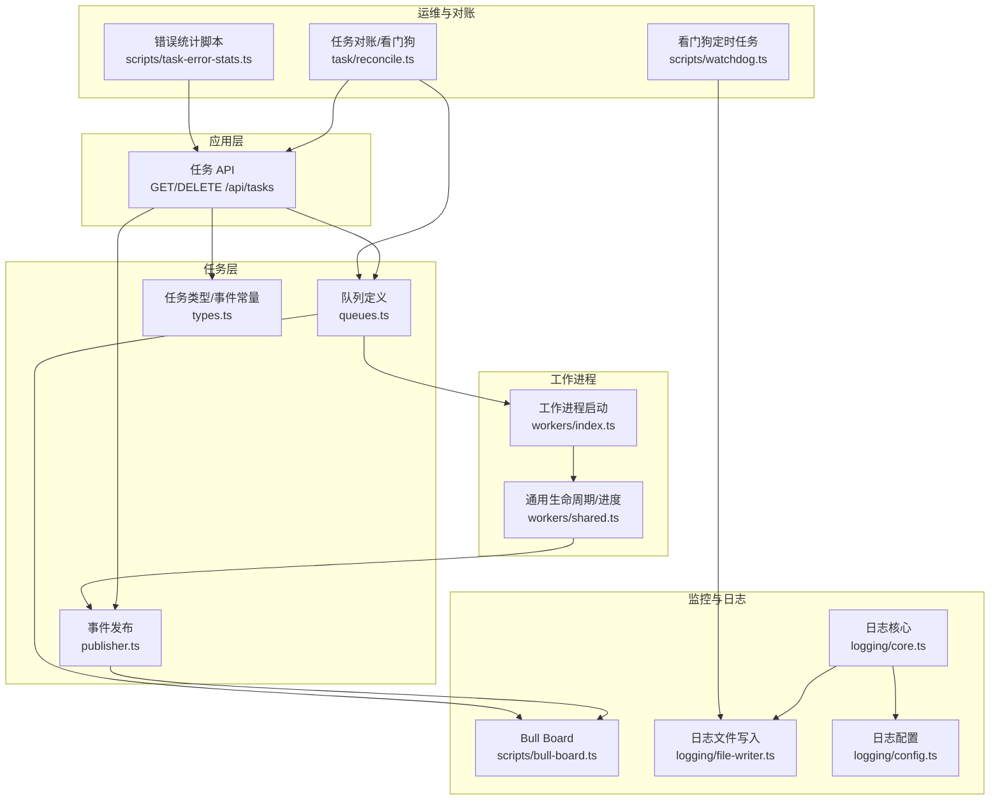
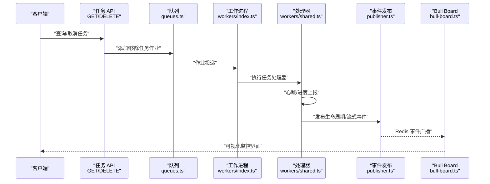
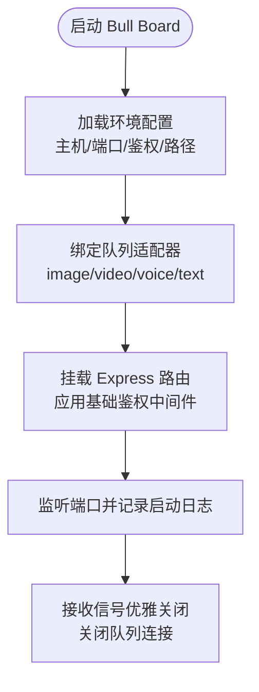
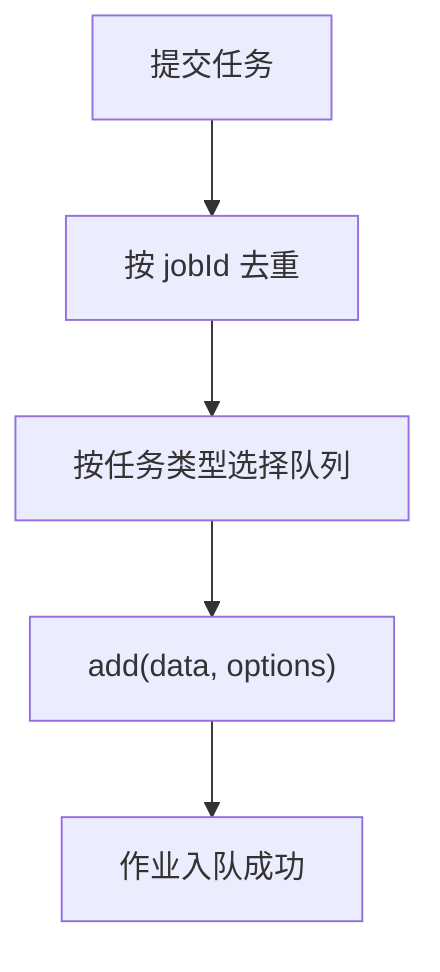
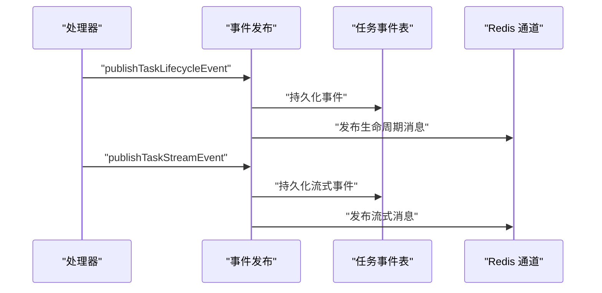
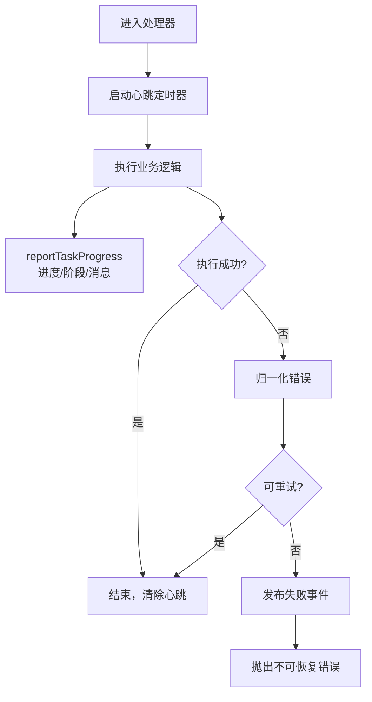
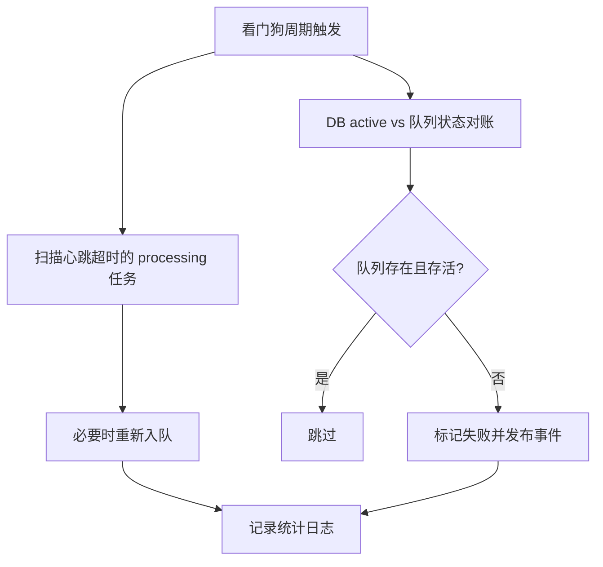
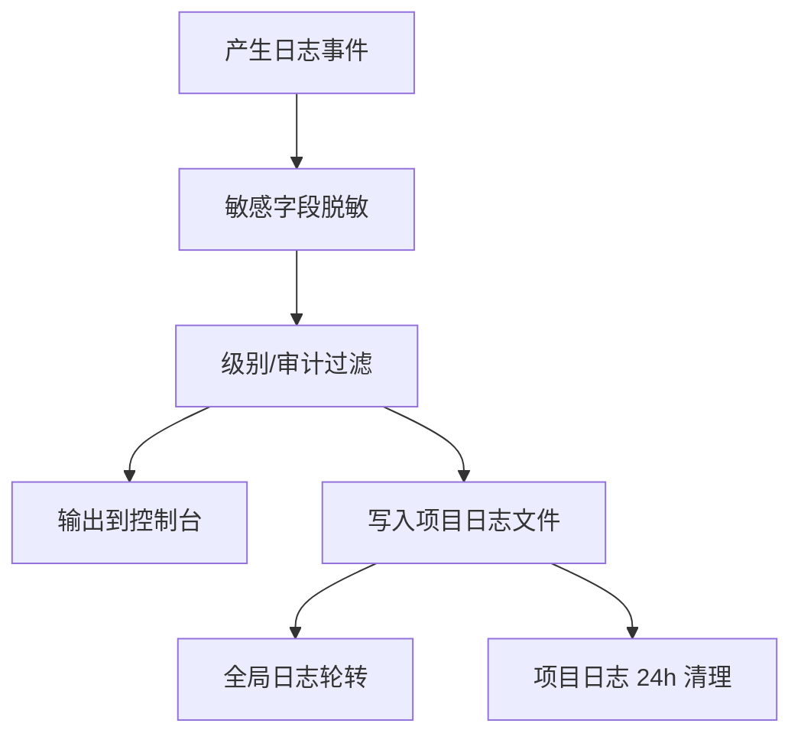
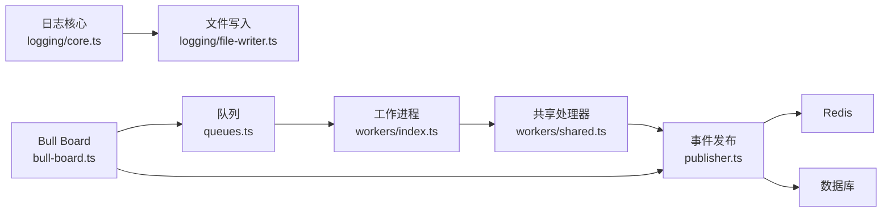

# 监控与调试

<cite>
**本文引用的文件**
- [scripts/bull-board.ts](file://scripts/bull-board.ts)
- [src/lib/task/queues.ts](file://src/lib/task/queues.ts)
- [src/lib/task/reconcile.ts](file://src/lib/task/reconcile.ts)
- [src/lib/workers/shared.ts](file://src/lib/workers/shared.ts)
- [src/lib/workers/index.ts](file://src/lib/workers/index.ts)
- [src/lib/logging/core.ts](file://src/lib/logging/core.ts)
- [src/lib/logging/file-writer.ts](file://src/lib/logging/file-writer.ts)
- [src/lib/logging/config.ts](file://src/lib/logging/config.ts)
- [src/lib/task/publisher.ts](file://src/lib/task/publisher.ts)
- [src/lib/task/types.ts](file://src/lib/task/types.ts)
- [src/app/api/tasks/route.ts](file://src/app/api/tasks/route.ts)
- [src/app/api/tasks/[taskId]/route.ts](file://src/app/api/tasks/[taskId]/route.ts)
- [scripts/task-error-stats.ts](file://scripts/task-error-stats.ts)
- [scripts/watchdog.ts](file://scripts/watchdog.ts)
</cite>

## 目录
1. [简介](#简介)
2. [项目结构](#项目结构)
3. [核心组件](#核心组件)
4. [架构总览](#架构总览)
5. [详细组件分析](#详细组件分析)
6. [依赖关系分析](#依赖关系分析)
7. [性能考量](#性能考量)
8. [故障排查指南](#故障排查指南)
9. [结论](#结论)
10. [附录](#附录)

## 简介
本文件面向运维与开发工程师，系统化介绍 Waoowaoo 的任务队列监控与调试体系，覆盖以下方面：
- Bull Board 可视化监控界面的部署、配置与使用
- 队列状态监控、作业进度跟踪与性能指标展示
- 日志系统与日志文件组织、下载与清理策略
- 错误处理机制：异常捕获、错误分类、恢复与补偿
- 调试工具：任务重放、状态检查、性能分析
- 监控指标与阈值建议、告警策略
- 故障排查流程与常见问题解决

## 项目结构
围绕任务队列与监控调试的关键目录与文件：
- 任务队列定义与调度：src/lib/task/queues.ts
- 任务生命周期事件发布：src/lib/task/publisher.ts
- 任务类型与事件常量：src/lib/task/types.ts
- 工作进程启动与错误监听：src/lib/workers/index.ts
- 工作进程通用生命周期与进度上报：src/lib/workers/shared.ts
- 任务对账与看门狗：src/lib/task/reconcile.ts
- Bull Board 可视化监控：scripts/bull-board.ts
- 日志核心与文件写入：src/lib/logging/core.ts、src/lib/logging/file-writer.ts、src/lib/logging/config.ts
- 任务 API：src/app/api/tasks/route.ts、src/app/api/tasks/[taskId]/route.ts
- 错误统计脚本：scripts/task-error-stats.ts
- 看门狗定时任务：scripts/watchdog.ts

**图表来源**
- [scripts/bull-board.ts:60-71](file://scripts/bull-board.ts#L60-L71)
- [src/lib/task/queues.ts:22-40](file://src/lib/task/queues.ts#L22-L40)
- [src/lib/task/publisher.ts:239-284](file://src/lib/task/publisher.ts#L239-L284)
- [src/lib/workers/index.ts:8-29](file://src/lib/workers/index.ts#L8-L29)
- [src/lib/workers/shared.ts:319-646](file://src/lib/workers/shared.ts#L319-L646)
- [src/lib/task/reconcile.ts:219-279](file://src/lib/task/reconcile.ts#L219-L279)
- [src/lib/logging/core.ts:97-132](file://src/lib/logging/core.ts#L97-L132)
- [src/lib/logging/file-writer.ts:226-262](file://src/lib/logging/file-writer.ts#L226-L262)
- [src/lib/logging/config.ts:24-41](file://src/lib/logging/config.ts#L24-L41)
- [src/app/api/tasks/route.ts:16-42](file://src/app/api/tasks/route.ts#L16-L42)
- [src/app/api/tasks/[taskId]/route.ts](file://src/app/api/tasks/[taskId]/route.ts#L42-L88)
- [scripts/task-error-stats.ts:10-53](file://scripts/task-error-stats.ts#L10-L53)
- [scripts/watchdog.ts:187-225](file://scripts/watchdog.ts#L187-L225)

**章节来源**
- [scripts/bull-board.ts:1-105](file://scripts/bull-board.ts#L1-L105)
- [src/lib/task/queues.ts:1-112](file://src/lib/task/queues.ts#L1-L112)
- [src/lib/task/reconcile.ts:1-279](file://src/lib/task/reconcile.ts#L1-L279)
- [src/lib/workers/shared.ts:319-675](file://src/lib/workers/shared.ts#L319-L675)
- [src/lib/logging/core.ts:1-303](file://src/lib/logging/core.ts#L1-L303)
- [src/lib/logging/file-writer.ts:1-394](file://src/lib/logging/file-writer.ts#L1-L394)
- [src/lib/logging/config.ts:1-42](file://src/lib/logging/config.ts#L1-L42)
- [src/lib/task/publisher.ts:1-391](file://src/lib/task/publisher.ts#L1-L391)
- [src/lib/task/types.ts:1-159](file://src/lib/task/types.ts#L1-L159)
- [src/app/api/tasks/route.ts:1-43](file://src/app/api/tasks/route.ts#L1-L43)
- [src/app/api/tasks/[taskId]/route.ts](file://src/app/api/tasks/[taskId]/route.ts#L34-L88)
- [scripts/task-error-stats.ts:1-53](file://scripts/task-error-stats.ts#L1-L53)
- [scripts/watchdog.ts:160-225](file://scripts/watchdog.ts#L160-L225)

## 核心组件
- 队列与任务类型
  - 队列：图像、视频、语音、文本四类队列，统一默认作业选项（完成/失败清理条数、重试次数与指数退避）。
  - 任务类型与事件：定义了任务状态、生命周期事件、SSE 事件类型及任务数据结构。
- 事件发布与回放
  - 生命周期事件与流式事件通过 Redis 通道广播，并支持按任务 ID 或项目 ID 回放。
- 工作进程生命周期
  - 统一的心跳、进度上报、错误归一化与不可恢复错误标记，确保状态一致性与可观测性。
- 对账与看门狗
  - 定时巡检处理中任务的心跳超时与队列丢失，自动修复 DB 与队列状态不一致问题。
- Bull Board 监控
  - 集成四个队列，支持基础鉴权，提供作业状态、重试、删除等操作。
- 日志系统
  - 结构化 JSON 日志，支持全局与按项目日志文件输出、自动轮转与清理。

**章节来源**
- [src/lib/task/queues.ts:12-40](file://src/lib/task/queues.ts#L12-L40)
- [src/lib/task/types.ts:3-38](file://src/lib/task/types.ts#L3-L38)
- [src/lib/task/publisher.ts:239-357](file://src/lib/task/publisher.ts#L239-L357)
- [src/lib/workers/shared.ts:319-646](file://src/lib/workers/shared.ts#L319-L646)
- [src/lib/task/reconcile.ts:27-40](file://src/lib/task/reconcile.ts#L27-L40)
- [scripts/bull-board.ts:60-89](file://scripts/bull-board.ts#L60-L89)
- [src/lib/logging/core.ts:97-132](file://src/lib/logging/core.ts#L97-L132)
- [src/lib/logging/file-writer.ts:226-307](file://src/lib/logging/file-writer.ts#L226-L307)

## 架构总览
下图展示了从 API 请求到队列入队、工作进程处理、事件发布与监控可视化的端到端流程。

**图表来源**
- [src/app/api/tasks/route.ts:16-42](file://src/app/api/tasks/route.ts#L16-L42)
- [src/app/api/tasks/[taskId]/route.ts](file://src/app/api/tasks/[taskId]/route.ts#L42-L88)
- [src/lib/task/queues.ts:88-111](file://src/lib/task/queues.ts#L88-L111)
- [src/lib/workers/index.ts:8-29](file://src/lib/workers/index.ts#L8-L29)
- [src/lib/workers/shared.ts:319-646](file://src/lib/workers/shared.ts#L319-L646)
- [src/lib/task/publisher.ts:239-357](file://src/lib/task/publisher.ts#L239-L357)
- [scripts/bull-board.ts:60-89](file://scripts/bull-board.ts#L60-L89)

## 详细组件分析

### Bull Board 可视化监控
- 配置要点
  - 主机与端口：可通过环境变量设置，默认本地回环地址与端口。
  - 基础鉴权：用户名与密码可选；未配置则关闭鉴权。
  - 路由前缀：支持自定义 basePath，便于反向代理或多实例隔离。
  - 队列适配：绑定图像、视频、语音、文本四类队列。
- 使用方法
  - 访问 basePath 查看队列概览与作业列表。
  - 支持查看作业详情、重试、删除、清空已完成/失败作业。
  - 适合用于实时观察队列积压、失败率、重试次数与作业耗时分布。
- 安全建议
  - 生产环境务必启用基础鉴权。
  - 通过反向代理限制访问来源或置于内网。

**图表来源**
- [scripts/bull-board.ts:8-89](file://scripts/bull-board.ts#L8-L89)

**章节来源**
- [scripts/bull-board.ts:1-105](file://scripts/bull-board.ts#L1-L105)

### 队列与作业管理
- 默认作业选项
  - 完成/失败作业清理数量，避免历史数据膨胀。
  - 最大重试次数与指数退避延迟，降低瞬时抖动影响。
- 任务去重与优先级
  - 通过 jobId 保证同一任务 ID 去重。
  - 支持传入优先级与单次尝试任务类型（如运行型任务）。
- 移除作业
  - 按 taskId 遍历所有队列查找并移除，便于取消后避免 worker 拉取。

**图表来源**
- [src/lib/task/queues.ts:88-111](file://src/lib/task/queues.ts#L88-L111)

**章节来源**
- [src/lib/task/queues.ts:12-40](file://src/lib/task/queues.ts#L12-L40)
- [src/lib/task/queues.ts:88-111](file://src/lib/task/queues.ts#L88-L111)

### 事件发布与回放
- 生命周期事件
  - 创建、处理中、进度、完成、失败等事件持久化并广播。
- 流式事件
  - 支持可选的流式事件通道，便于前端实时展示。
- 回放能力
  - 按任务 ID 获取最近生命周期事件，或按项目 ID 分页拉取后续事件。
- 运行事件镜像
  - 部分任务事件会映射为运行事件，便于运行时系统联动。

**图表来源**
- [src/lib/task/publisher.ts:239-357](file://src/lib/task/publisher.ts#L239-L357)

**章节来源**
- [src/lib/task/publisher.ts:1-391](file://src/lib/task/publisher.ts#L1-L391)
- [src/lib/task/types.ts:14-38](file://src/lib/task/types.ts#L14-L38)

### 工作进程生命周期与进度上报
- 心跳与进度
  - 处理器定期更新任务心跳时间戳，用于看门狗判定。
  - 进度上报包含阶段、显示模式与消息，统一格式便于前端展示。
- 错误处理
  - 归一化错误，区分可重试与不可重试；不可重试时抛出“不可恢复错误”，确保队列正确记录失败。
  - 发布失败事件，包含错误链路与堆栈摘要（非生产环境）。
- 生命周期钩子
  - 统一封装处理器，确保开始、失败、结束阶段的日志与事件一致。

**图表来源**
- [src/lib/workers/shared.ts:319-646](file://src/lib/workers/shared.ts#L319-L646)

**章节来源**
- [src/lib/workers/shared.ts:319-675](file://src/lib/workers/shared.ts#L319-L675)

### 任务对账与看门狗
- 对账范围
  - 检查 DB 中 active 任务在队列中的真实状态（存活/终态/缺失）。
  - 自动修复孤儿任务与终态不一致问题，必要时标记失败并发布事件。
- 看门狗周期
  - 定时扫描处理中超时任务，重新入队或标记失败。
  - 每小时清理项目日志文件中 24 小时前的内容，控制磁盘占用。
- 关键阈值
  - 心跳超时阈值、批量扫描上限、终态/缺失竞态保护窗口等。

**图表来源**
- [src/lib/task/reconcile.ts:219-279](file://src/lib/task/reconcile.ts#L219-L279)
- [scripts/watchdog.ts:187-225](file://scripts/watchdog.ts#L187-L225)

**章节来源**
- [src/lib/task/reconcile.ts:25-40](file://src/lib/task/reconcile.ts#L25-L40)
- [src/lib/task/reconcile.ts:219-279](file://src/lib/task/reconcile.ts#L219-L279)
- [scripts/watchdog.ts:160-225](file://scripts/watchdog.ts#L160-L225)

### 日志系统
- 结构化输出
  - JSON 格式，包含时间戳、服务名、模块、动作、请求/任务/项目/用户标识、错误码、可重试标志、耗时、详情与错误对象。
- 文件组织
  - 全局 app.log（自动轮转，保留后半部分）。
  - 按项目生成 admin_{name}.log（API/用户侧）与 Internal_{name}.log（Worker/内部侧），名称安全化处理。
- 功能特性
  - 敏感字段脱敏、按级别与审计开关控制输出、项目名解析与缓冲写入、24 小时清理策略。
- 下载接口
  - 提供下载全部日志的功能，便于离线分析。

**图表来源**
- [src/lib/logging/core.ts:97-132](file://src/lib/logging/core.ts#L97-L132)
- [src/lib/logging/file-writer.ts:226-307](file://src/lib/logging/file-writer.ts#L226-L307)
- [src/lib/logging/file-writer.ts:371-393](file://src/lib/logging/file-writer.ts#L371-L393)

**章节来源**
- [src/lib/logging/core.ts:1-303](file://src/lib/logging/core.ts#L1-L303)
- [src/lib/logging/file-writer.ts:1-394](file://src/lib/logging/file-writer.ts#L1-L394)
- [src/lib/logging/config.ts:1-42](file://src/lib/logging/config.ts#L1-L42)

### 错误处理机制
- 错误归一化
  - 统一提取错误码、消息、可重试标志、提供商信息与错误链路。
- 可重试判定
  - 基于错误类型与上下文决定是否允许队列自动重试。
- 不可恢复错误
  - 标记为不可恢复，确保队列记录失败并由应用层负责补偿。
- 失败事件发布
  - 包含错误摘要、堆栈（非生产环境）、追踪信息与 UI 展示字段。

**章节来源**
- [src/lib/workers/shared.ts:281-303](file://src/lib/workers/shared.ts#L281-L303)
- [src/lib/workers/shared.ts:484-642](file://src/lib/workers/shared.ts#L484-L642)

### 调试工具与使用指南
- 任务重放
  - 通过 publisher 提供的回放接口，按任务 ID 获取生命周期事件，或按项目 ID 分页获取后续事件，辅助复现前端状态。
- 状态检查
  - 使用 Bull Board 查看队列积压、失败作业与重试情况。
  - 使用任务 API 查询任务状态与错误详情。
- 性能分析
  - 结合日志中的耗时字段与 Redis 事件时间戳，定位慢任务与瓶颈阶段。
  - 使用错误统计脚本按分钟窗口统计失败错误码占比，识别趋势。
- 日志下载
  - 通过下载接口获取全量日志，结合项目日志文件进行离线分析。

**章节来源**
- [src/lib/task/publisher.ts:212-222](file://src/lib/task/publisher.ts#L212-L222)
- [src/lib/task/publisher.ts:359-390](file://src/lib/task/publisher.ts#L359-L390)
- [scripts/bull-board.ts:60-89](file://scripts/bull-board.ts#L60-L89)
- [src/app/api/tasks/route.ts:16-42](file://src/app/api/tasks/route.ts#L16-L42)
- [src/app/api/tasks/[taskId]/route.ts](file://src/app/api/tasks/[taskId]/route.ts#L34-L88)
- [scripts/task-error-stats.ts:10-53](file://scripts/task-error-stats.ts#L10-L53)
- [src/lib/logging/file-writer.ts:347-366](file://src/lib/logging/file-writer.ts#L347-L366)

### 监控指标与阈值建议
- 队列健康
  - 未完成作业数（waiting/delayed/active）与增长速率。
  - 失败作业数与失败率（失败数/总完成数）。
  - 平均处理时长与 P95/P99。
- 任务健康
  - 心跳超时比例（processing 无心跳）。
  - 终态不一致比例（DB completed/failed 与队列状态不符）。
  - 重试次数分布与失败原因 Top N。
- 日志与资源
  - 全局日志大小与项目日志大小，磁盘使用率。
- 建议阈值
  - 失败率 > 1% 持续 5 分钟触发告警。
  - 队列积压增长速率 > 10%/分钟 触发告警。
  - 心跳超时比例 > 5% 触发告警。
  - 日志文件超过阈值触发清理与容量预警。

**章节来源**
- [src/lib/task/reconcile.ts:27-40](file://src/lib/task/reconcile.ts#L27-L40)
- [src/lib/logging/file-writer.ts:145-146](file://src/lib/logging/file-writer.ts#L145-L146)
- [scripts/task-error-stats.ts:10-53](file://scripts/task-error-stats.ts#L10-L53)

### 告警机制配置
- 任务超时
  - 当看门狗检测到心跳超时比例超过阈值，记录告警事件并通知运维。
- 失败率过高
  - 错误统计脚本输出失败错误码占比，结合外部监控系统设置阈值告警。
- 队列积压
  - Bull Board 中持续增长的 waiting/delayed 数量作为告警信号。
- 日志容量
  - 项目日志与全局日志超过阈值时触发清理与容量告警。

**章节来源**
- [scripts/watchdog.ts:187-225](file://scripts/watchdog.ts#L187-L225)
- [scripts/task-error-stats.ts:10-53](file://scripts/task-error-stats.ts#L10-L53)
- [scripts/bull-board.ts:60-89](file://scripts/bull-board.ts#L60-L89)
- [src/lib/logging/file-writer.ts:281-307](file://src/lib/logging/file-writer.ts#L281-L307)

## 依赖关系分析
- 组件耦合
  - 队列与工作进程通过 BullMQ 队列抽象解耦。
  - 事件发布通过 Redis 与数据库实现弱耦合，支持回放与镜像。
  - 日志系统与业务逻辑通过统一接口解耦，文件写入惰性初始化。
- 外部依赖
  - Redis 用于事件通道与元数据存储。
  - 数据库用于任务与事件持久化。
  - BullMQ 用于作业队列与重试策略。

**图表来源**
- [src/lib/task/queues.ts:22-40](file://src/lib/task/queues.ts#L22-L40)
- [src/lib/workers/index.ts:8-29](file://src/lib/workers/index.ts#L8-L29)
- [src/lib/workers/shared.ts:319-646](file://src/lib/workers/shared.ts#L319-L646)
- [src/lib/task/publisher.ts:239-357](file://src/lib/task/publisher.ts#L239-L357)
- [src/lib/logging/core.ts:97-132](file://src/lib/logging/core.ts#L97-L132)
- [src/lib/logging/file-writer.ts:226-307](file://src/lib/logging/file-writer.ts#L226-L307)
- [scripts/bull-board.ts:60-89](file://scripts/bull-board.ts#L60-L89)

**章节来源**
- [src/lib/task/queues.ts:1-112](file://src/lib/task/queues.ts#L1-L112)
- [src/lib/workers/index.ts:1-39](file://src/lib/workers/index.ts#L1-L39)
- [src/lib/workers/shared.ts:319-675](file://src/lib/workers/shared.ts#L319-L675)
- [src/lib/task/publisher.ts:1-391](file://src/lib/task/publisher.ts#L1-L391)
- [src/lib/logging/core.ts:1-303](file://src/lib/logging/core.ts#L1-L303)
- [src/lib/logging/file-writer.ts:1-394](file://src/lib/logging/file-writer.ts#L1-L394)
- [scripts/bull-board.ts:1-105](file://scripts/bull-board.ts#L1-L105)

## 性能考量
- 队列吞吐
  - 控制 removeOnComplete/removeOnFail 数量，避免历史数据膨胀。
  - 合理设置重试次数与退避，平衡可靠性与延迟。
- 事件风暴
  - 流式事件可选开启，避免高频事件造成 Redis 压力。
- 日志开销
  - 结构化日志与文件写入采用惰性初始化与异步清理，减少阻塞。
- 对账与看门狗
  - 批量扫描上限与定时周期需根据集群规模调整，避免对数据库造成压力。

[本节为通用指导，无需特定文件引用]

## 故障排查指南
- 任务卡死/无响应
  - 使用 Bull Board 查看队列状态与作业详情。
  - 通过任务 API 查询任务状态与错误详情。
  - 看门狗会自动清理心跳超时任务并重新入队，关注日志中的 watchdog 记录。
- 任务丢失/状态不一致
  - 对账功能会检测 DB active 与队列状态差异，必要时标记失败并发布事件。
  - 使用回放接口核对事件序列。
- 失败率上升
  - 使用错误统计脚本按分钟窗口统计错误码占比，定位热点问题。
- 日志过大/磁盘不足
  - 全局日志自动轮转，项目日志按 24 小时清理。
  - 通过下载接口导出日志进行离线分析。

**章节来源**
- [src/lib/task/reconcile.ts:219-279](file://src/lib/task/reconcile.ts#L219-L279)
- [src/lib/task/publisher.ts:212-222](file://src/lib/task/publisher.ts#L212-L222)
- [scripts/task-error-stats.ts:10-53](file://scripts/task-error-stats.ts#L10-L53)
- [scripts/watchdog.ts:187-225](file://scripts/watchdog.ts#L187-L225)
- [src/lib/logging/file-writer.ts:281-307](file://src/lib/logging/file-writer.ts#L281-L307)

## 结论
本监控与调试体系以队列为枢纽，结合事件发布、工作进程生命周期管理、对账与看门狗、Bull Board 可视化以及完善的日志系统，形成闭环的可观测性与可维护性。通过合理的阈值与告警策略，能够及时发现并处置任务异常，保障系统稳定运行。

[本节为总结，无需特定文件引用]

## 附录
- 常用命令与接口
  - Bull Board：访问 basePath 查看队列与作业。
  - 任务 API：GET /api/tasks 查询任务；DELETE /api/tasks/[taskId] 取消任务。
  - 错误统计：执行错误统计脚本，按分钟窗口输出失败错误码统计。
  - 日志下载：通过下载接口获取全量日志文件内容。

**章节来源**
- [scripts/bull-board.ts:60-89](file://scripts/bull-board.ts#L60-L89)
- [src/app/api/tasks/route.ts:16-42](file://src/app/api/tasks/route.ts#L16-L42)
- [src/app/api/tasks/[taskId]/route.ts](file://src/app/api/tasks/[taskId]/route.ts#L42-L88)
- [scripts/task-error-stats.ts:10-53](file://scripts/task-error-stats.ts#L10-L53)
- [src/lib/logging/file-writer.ts:347-366](file://src/lib/logging/file-writer.ts#L347-L366)