# UI组件库

<cite>
**本文引用的文件**   
- [src/styles/ui-semantic-glass.css](file://src/styles/ui-semantic-glass.css)
- [src/styles/ui-tokens-glass.css](file://src/styles/ui-tokens-glass.css)
- [src/app/globals.css](file://src/app/globals.css)
- [src/components/ui/primitives/index.ts](file://src/components/ui/primitives/index.ts)
- [src/components/ui/primitives/GlassButton.tsx](file://src/components/ui/primitives/GlassButton.tsx)
- [src/components/ui/primitives/GlassInput.tsx](file://src/components/ui/primitives/GlassInput.tsx)
- [src/components/ui/primitives/GlassTextarea.tsx](file://src/components/ui/primitives/GlassTextarea.tsx)
- [src/components/ui/primitives/GlassField.tsx](file://src/components/ui/primitives/GlassField.tsx)
- [src/components/ui/primitives/GlassSurface.tsx](file://src/components/ui/primitives/GlassSurface.tsx)
- [src/components/ui/primitives/GlassChip.tsx](file://src/components/ui/primitives/GlassChip.tsx)
- [src/components/ui/primitives/GlassModalShell.tsx](file://src/components/ui/primitives/GlassModalShell.tsx)
- [src/components/ui/ImagePreviewModal.tsx](file://src/components/ui/ImagePreviewModal.tsx)
- [src/components/media/MediaImageWithLoading.tsx](file://src/components/media/MediaImageWithLoading.tsx)
- [src/components/ui/icons/AppIcon.tsx](file://src/components/ui/icons/AppIcon.tsx)
- [src/components/ui/icons/registry.ts](file://src/components/ui/icons/registry.ts)
- [src/components/ui/CapsuleNav.tsx](file://src/components/ui/CapsuleNav.tsx)
- [src/lib/media/image-url.ts](file://src/lib/media/image-url.ts)
- [src/components/ui/SharedComponents.tsx](file://src/components/ui/SharedComponents.tsx)
- [src/components/selectors/RatioStyleSelectors.tsx](file://src/components/selectors/RatioStyleSelectors.tsx)
</cite>

## 更新摘要
**所做更改**   
- 更新 EpisodeSelector 组件文档，补充使用 AppIcon 组件替代彩色状态指示器的说明
- 新增电影图标统一视觉设计的详细说明
- 补充 AppIcon 图标注册表的完整使用指南
- 更新胶囊导航组件中状态指示器的实现细节

## 目录
1. [简介](#简介)
2. [项目结构](#项目结构)
3. [核心组件](#核心组件)
4. [架构总览](#架构总览)
5. [组件详解](#组件详解)
6. [依赖关系分析](#依赖关系分析)
7. [性能考量](#性能考量)
8. [故障排查指南](#故障排查指南)
9. [结论](#结论)
10. [附录](#附录)

## 简介
本文件为 Waoowaoo 的 UI 组件库技术文档，聚焦 Glass UI 设计系统，系统性阐述玻璃拟态（Glassmorphism）风格的视觉与交互实现。内容涵盖基础组件（如 GlassButton、GlassInput、GlassModalShell 等）的设计理念、属性配置、事件处理与状态管理；新增 ImagePreviewModal 图片预览组件的详细说明；补充 EpisodeSelector 组件使用 AppIcon 组件替代彩色状态指示器的实现细节；提供组件组合模式与复用策略；说明响应式设计、主题定制与样式覆盖方法，并给出实际使用示例与最佳实践。

## 项目结构
UI 组件库位于 src/components/ui/primitives，配套样式由两部分构成：语义层样式（ui-semantic-glass.css）定义可复用的视觉类名与交互态；令牌层样式（ui-tokens-glass.css）定义变量与预设。全局样式入口（globals.css）引入上述样式并桥接至 Tailwind 与主题变量。新增的 ImagePreviewModal 作为独立组件提供图片预览功能。AppIcon 图标系统提供统一的图标管理，支持 Lucide 图标库和自定义图标。

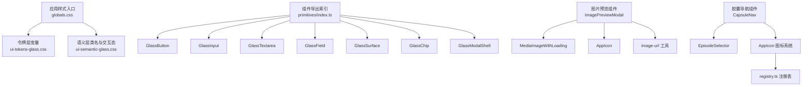

**图表来源**
- [src/app/globals.css:1-5](file://src/app/globals.css#L1-L5)
- [src/styles/ui-tokens-glass.css:1-96](file://src/styles/ui-tokens-glass.css#L1-L96)
- [src/styles/ui-semantic-glass.css:1-465](file://src/styles/ui-semantic-glass.css#L1-L465)
- [src/components/ui/primitives/index.ts:1-21](file://src/components/ui/primitives/index.ts#L1-L21)
- [src/components/ui/ImagePreviewModal.tsx:1-80](file://src/components/ui/ImagePreviewModal.tsx#L1-L80)
- [src/components/media/MediaImageWithLoading.tsx:1-92](file://src/components/media/MediaImageWithLoading.tsx#L1-L92)
- [src/components/ui/icons/AppIcon.tsx:1-15](file://src/components/ui/icons/AppIcon.tsx#L1-L15)
- [src/components/ui/icons/registry.ts:1-195](file://src/components/ui/icons/registry.ts#L1-L195)
- [src/components/ui/CapsuleNav.tsx:230-460](file://src/components/ui/CapsuleNav.tsx#L230-L460)
- [src/lib/media/image-url.ts:1-90](file://src/lib/media/image-url.ts#L1-L90)

**章节来源**
- [src/app/globals.css:1-523](file://src/app/globals.css#L1-L523)
- [src/styles/ui-tokens-glass.css:1-96](file://src/styles/ui-tokens-glass.css#L1-L96)
- [src/styles/ui-semantic-glass.css:1-465](file://src/styles/ui-semantic-glass.css#L1-L465)
- [src/components/ui/primitives/index.ts:1-21](file://src/components/ui/primitives/index.ts#L1-L21)

## 核心组件
- GlassSurface：容器型组件，支持多种变体（panel/card/elevated/modal）、密度（compact/default）、交互悬停动效与内边距控制。
- GlassField：表单字段包装器，统一标签、提示、错误与动作区布局。
- GlassInput / GlassTextarea：输入与多行文本输入，支持密度与原生属性透传。
- GlassButton：按钮组件，支持主次/幽灵/危险等变体、尺寸、加载态与图标插槽。
- GlassChip：信息展示与可选移除的标签式组件，支持五种语义色调。
- GlassModalShell：模态壳体，支持尺寸、遮罩关闭、Esc 关闭、标题/描述/页脚区域与 Portal 渲染。
- **ImagePreviewModal**：图片预览组件，提供全屏图片查看、原始图片链接、关闭功能与滚动控制。
- **CapsuleNav**：胶囊形态导航组件，支持状态指示器、计数徽章与禁用状态提示。
- **EpisodeSelector**：剧集选择器，集成胶囊导航的剧集管理功能。

**章节来源**
- [src/components/ui/primitives/GlassSurface.tsx:1-47](file://src/components/ui/primitives/GlassSurface.tsx#L1-L47)
- [src/components/ui/primitives/GlassField.tsx:1-50](file://src/components/ui/primitives/GlassField.tsx#L1-L50)
- [src/components/ui/primitives/GlassInput.tsx:1-29](file://src/components/ui/primitives/GlassInput.tsx#L1-L29)
- [src/components/ui/primitives/GlassTextarea.tsx:1-29](file://src/components/ui/primitives/GlassTextarea.tsx#L1-L29)
- [src/components/ui/primitives/GlassButton.tsx:1-67](file://src/components/ui/primitives/GlassButton.tsx#L1-L67)
- [src/components/ui/primitives/GlassChip.tsx:1-43](file://src/components/ui/primitives/GlassChip.tsx#L1-L43)
- [src/components/ui/primitives/GlassModalShell.tsx:1-102](file://src/components/ui/primitives/GlassModalShell.tsx#L1-L102)
- [src/components/ui/ImagePreviewModal.tsx:1-80](file://src/components/ui/ImagePreviewModal.tsx#L1-L80)
- [src/components/ui/CapsuleNav.tsx:138-460](file://src/components/ui/CapsuleNav.tsx#L138-L460)

## 架构总览
Glass UI 设计系统采用"令牌层 + 语义层 + 组件层"的分层架构：
- 令牌层（ui-tokens-glass.css）：集中管理颜色、阴影、圆角、模糊、间距与密度等设计令牌。
- 语义层（ui-semantic-glass.css）：以类名形式暴露可复用的视觉样式与交互态，组件通过类名组合实现一致风格。
- 组件层（primitives/*）：以最小可用接口封装语义类名与行为，保证可组合、可扩展与可测试。
- **新增**：独立功能组件层，提供特定业务场景的完整解决方案。
- **新增**：AppIcon 图标系统，统一管理图标资源与使用方式。

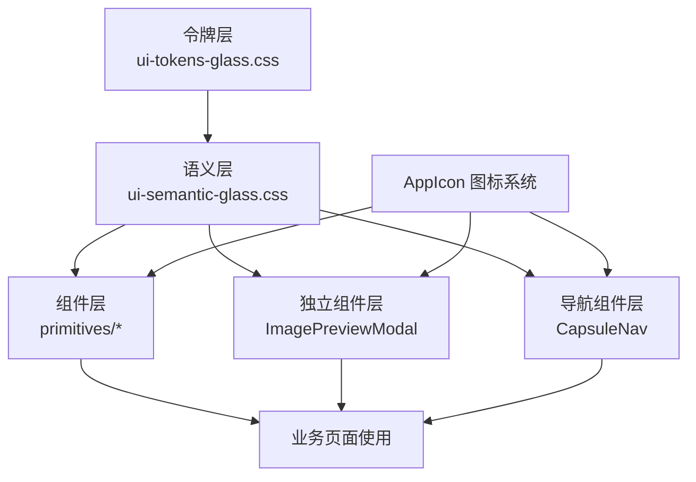

**图表来源**
- [src/styles/ui-tokens-glass.css:1-96](file://src/styles/ui-tokens-glass.css#L1-L96)
- [src/styles/ui-semantic-glass.css:1-465](file://src/styles/ui-semantic-glass.css#L1-L465)
- [src/components/ui/primitives/index.ts:1-21](file://src/components/ui/primitives/index.ts#L1-L21)
- [src/components/ui/ImagePreviewModal.tsx:1-80](file://src/components/ui/ImagePreviewModal.tsx#L1-L80)
- [src/components/ui/CapsuleNav.tsx:138-460](file://src/components/ui/CapsuleNav.tsx#L138-L460)
- [src/components/ui/icons/AppIcon.tsx:1-15](file://src/components/ui/icons/AppIcon.tsx#L1-L15)

## 组件详解

### GlassSurface 容器
- 设计理念：提供统一的玻璃表面容器，支持不同层级（panel/card/elevated/modal）与密度，可选交互悬停动效。
- 关键属性
  - variant：panel | card | elevated | modal
  - density：compact | default
  - interactive：是否启用悬停位移动画与阴影增强
  - padded：是否启用默认内边距
- 复杂度与性能：O(1) 类名拼接，无副作用，渲染开销极低。
- 最佳实践：在复杂卡片中统一使用该容器，避免重复声明圆角、阴影与模糊。

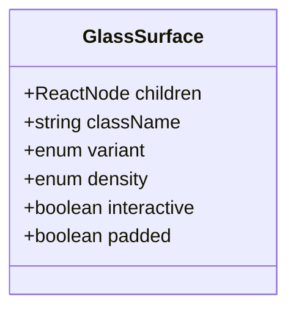

**图表来源**
- [src/components/ui/primitives/GlassSurface.tsx:5-12](file://src/components/ui/primitives/GlassSurface.tsx#L5-L12)

**章节来源**
- [src/components/ui/primitives/GlassSurface.tsx:18-46](file://src/components/ui/primitives/GlassSurface.tsx#L18-L46)

### GlassField 表单字段包装器
- 设计理念：统一 label/hint/error/actions 区域布局，简化表单一致性。
- 关键属性
  - id：关联子元素
  - label：字段标题
  - hint：辅助提示
  - error：错误文案
  - required：是否显示必填星号
  - actions：右侧操作区（如"重置"、"帮助"）
- 使用建议：与 GlassInput/GlassTextarea/GlassSelect 组合使用，确保 label 与输入控件 id 对应。

**图表来源**
- [src/components/ui/primitives/GlassField.tsx:18-48](file://src/components/ui/primitives/GlassField.tsx#L18-L48)

**章节来源**
- [src/components/ui/primitives/GlassField.tsx:1-50](file://src/components/ui/primitives/GlassField.tsx#L1-L50)

### GlassInput 与 GlassTextarea
- 设计理念：基于语义类名实现一致的输入外观与交互态，支持 compact/default 密度。
- 关键属性
  - density：compact | default
  - 其余原生 HTML 属性透传（如 placeholder、value、onChange 等）
- 交互要点：聚焦时带焦点环与内描边；禁用时半透明且不可交互；错误态带危险描边与环。

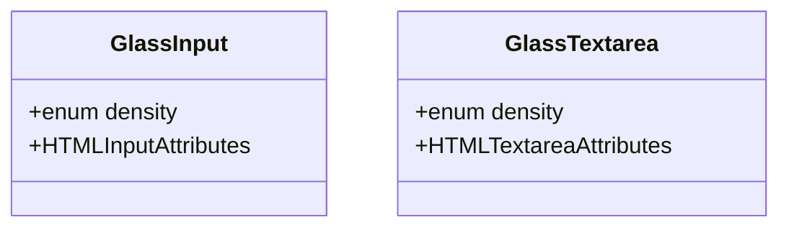

**图表来源**
- [src/components/ui/primitives/GlassInput.tsx:3-5](file://src/components/ui/primitives/GlassInput.tsx#L3-L5)
- [src/components/ui/primitives/GlassTextarea.tsx:3-5](file://src/components/ui/primitives/GlassTextarea.tsx#L3-L5)

**章节来源**
- [src/components/ui/primitives/GlassInput.tsx:11-28](file://src/components/ui/primitives/GlassInput.tsx#L11-L28)
- [src/components/ui/primitives/GlassTextarea.tsx:11-28](file://src/components/ui/primitives/GlassTextarea.tsx#L11-L28)

### GlassButton 按钮
- 设计理念：提供 primary/secondary/ghost/danger 等变体，支持 sm/md/lg 尺寸与 loading 态。
- 关键属性
  - variant：primary | secondary | ghost | danger
  - size：sm | md | lg
  - loading：布尔值，内部映射任务状态以显示进度指示
  - iconLeft/iconRight：左右图标插槽
  - disabled：禁用态合并 loading 状态
- 交互要点：hover 提升、focus 聚焦环、禁用半透明；primary 变体带渐变与阴影提升。

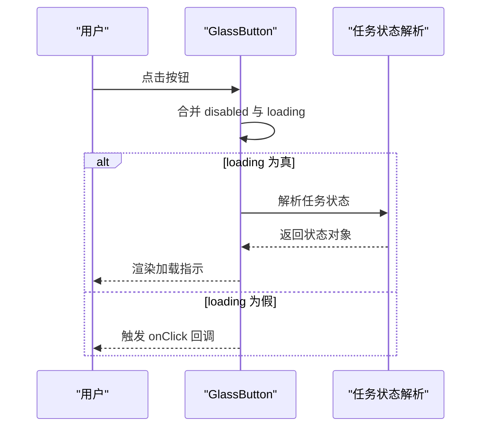

**图表来源**
- [src/components/ui/primitives/GlassButton.tsx:17-64](file://src/components/ui/primitives/GlassButton.tsx#L17-L64)

**章节来源**
- [src/components/ui/primitives/GlassButton.tsx:1-67](file://src/components/ui/primitives/GlassButton.tsx#L1-L67)

### GlassChip 标签
- 设计理念：用于展示状态或可移除的标签项，支持 neutral/info/success/warning/danger 五种语义色调。
- 关键属性
  - tone：语义色调
  - icon：左侧图标
  - onRemove：点击右侧移除按钮回调
  - children：文本内容
- 交互要点：hover 右侧按钮有浅色背景过渡。

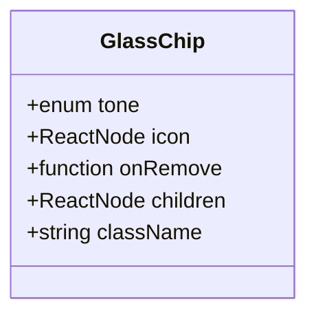

**图表来源**
- [src/components/ui/primitives/GlassChip.tsx:6-12](file://src/components/ui/primitives/GlassChip.tsx#L6-L12)

**章节来源**
- [src/components/ui/primitives/GlassChip.tsx:18-42](file://src/components/ui/primitives/GlassChip.tsx#L18-L42)

### GlassModalShell 模态壳体
- 设计理念：提供可配置的模态对话框外壳，支持尺寸、遮罩关闭、Esc 关闭、标题/描述/页脚区域与 Portal 渲染。
- 关键属性
  - open：是否打开
  - onClose：关闭回调
  - title/description/footer：内容区域
  - size：sm | md | lg | xl
  - closeOnBackdrop/closeOnEsc/showCloseButton：交互行为开关
- 交互要点：Esc 键监听；点击遮罩关闭；Portal 渲染到 document.body。

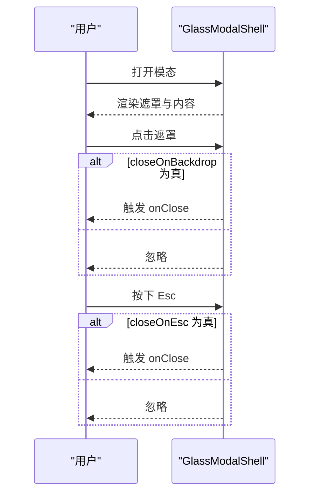

**图表来源**
- [src/components/ui/primitives/GlassModalShell.tsx:24-101](file://src/components/ui/primitives/GlassModalShell.tsx#L24-L101)

**章节来源**
- [src/components/ui/primitives/GlassModalShell.tsx:1-102](file://src/components/ui/primitives/GlassModalShell.tsx#L1-L102)

### ImagePreviewModal 图片预览组件
- **新增** 设计理念：提供全屏图片预览功能，支持图片查看、原始图片链接、关闭控制与滚动管理。
- **更新** 响应式布局实现：采用内容自适应设计，从固定屏幕尺寸改为基于视口单位的动态布局
- 关键属性
  - imageUrl：要预览的图片地址，支持 Next.js 图像服务与存储密钥
  - onClose：关闭回调函数
- 核心功能
  - 自动禁用页面滚动，防止背景滚动
  - 支持 Esc 键快速关闭
  - 提供查看原始图片的链接（当为存储密钥时）
  - 使用 MediaImageWithLoading 组件提供加载状态
  - 应用统一的玻璃拟态视觉风格
- **更新** 响应式设计优化
  - 图片容器使用 `max-w-[92vw] max-h-[88vh] w-auto h-auto` 实现内容自适应
  - 绝对定位的按钮系统通过 z-index 管理层级关系
  - 92vw 和 88vh 的比例确保在各种屏幕尺寸下的最佳显示效果
  - 支持 object-contain 缩放模式保持图片纵横比
- 交互要点：点击遮罩区域或关闭按钮关闭；支持键盘事件监听；自动清理事件监听器。

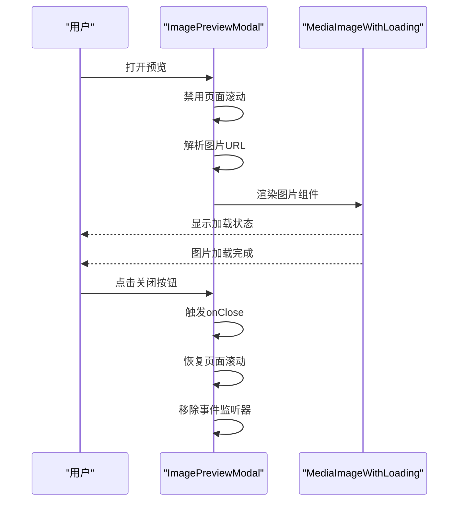

**图表来源**
- [src/components/ui/ImagePreviewModal.tsx:14-79](file://src/components/ui/ImagePreviewModal.tsx#L14-L79)
- [src/components/media/MediaImageWithLoading.tsx:18-91](file://src/components/media/MediaImageWithLoading.tsx#L18-L91)

**章节来源**
- [src/components/ui/ImagePreviewModal.tsx:1-80](file://src/components/ui/ImagePreviewModal.tsx#L1-L80)

### CapsuleNav 胶囊导航组件
- **新增** 设计理念：提供胶囊形态的悬浮导航，支持状态指示器、计数徽章与禁用状态提示。
- **更新** 状态指示器实现：使用 AppIcon 组件替代原有的彩色圆形指示器，提供统一的视觉设计
- 关键属性
  - items：导航项数组，包含 id、label、status、disabled、count 等属性
  - activeId：当前激活的导航项 id
  - onItemClick：导航项点击回调
  - projectId：项目 id，用于构建导航链接
  - episodeId：剧集 id，用于导航链接参数
  - compact：紧凑模式开关
- **更新** 状态指示器设计
  - ready 状态：使用 AppIcon "checkDot" 实现细小的确认指示点
  - processing 状态：使用脉冲动画的 AppIcon 图标
  - compact 模式：采用滑动 pill 指示器，支持中键和 Ctrl+点击在新标签页打开

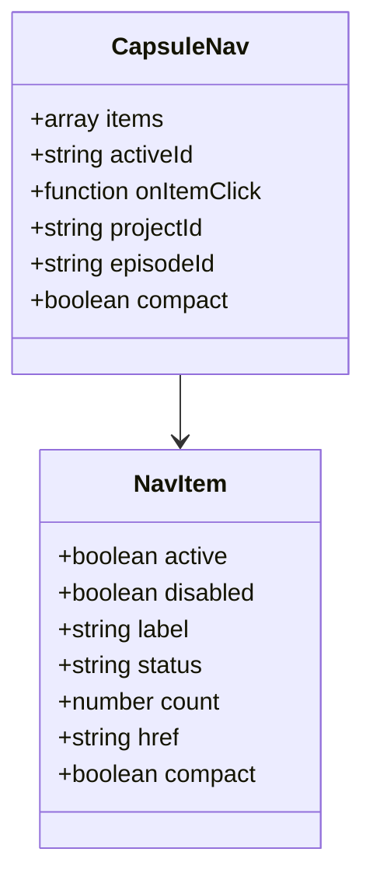

**图表来源**
- [src/components/ui/CapsuleNav.tsx:143-227](file://src/components/ui/CapsuleNav.tsx#L143-L227)
- [src/components/ui/CapsuleNav.tsx:95-135](file://src/components/ui/CapsuleNav.tsx#L95-L135)

**章节来源**
- [src/components/ui/CapsuleNav.tsx:138-460](file://src/components/ui/CapsuleNav.tsx#L138-L460)

### EpisodeSelector 剧集选择器
- **新增** 设计理念：基于 CapsuleNav 组件的剧集管理功能，提供剧集选择、编辑、删除等操作。
- **更新** 图标统一：使用 AppIcon 组件替代彩色状态指示器，确保视觉一致性
- 关键属性
  - episodes：剧集数组，包含 id、title、episodeNumber、summary、status 等属性
  - currentId：当前选中的剧集 id
  - onSelect：剧集选择回调
  - onAdd/onRename/onDelete：剧集管理操作回调
  - projectName：项目名称，显示在左上角
  - className：外部容器类名
- **更新** 状态指示器实现
  - 当前选中剧集：使用 AppIcon "checkDot" 实现确认指示
  - 编辑/删除模式：提供相应的操作界面
  - 剧集列表：支持剧集编号、标题、摘要等信息展示

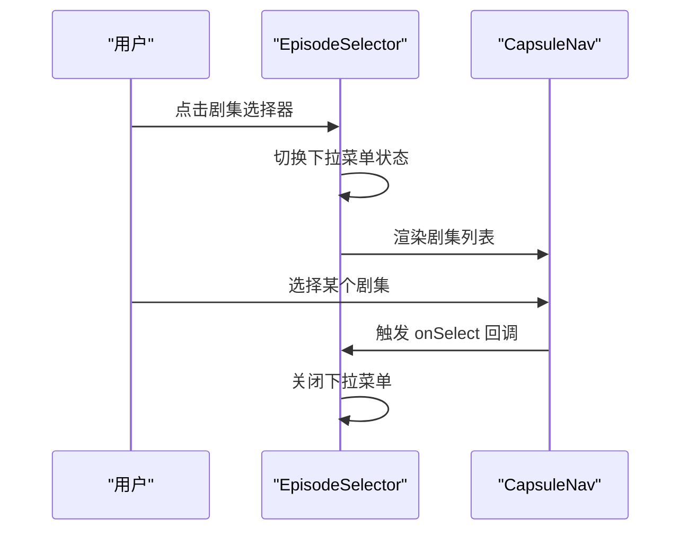

**图表来源**
- [src/components/ui/CapsuleNav.tsx:255-456](file://src/components/ui/CapsuleNav.tsx#L255-L456)

**章节来源**
- [src/components/ui/CapsuleNav.tsx:230-460](file://src/components/ui/CapsuleNav.tsx#L230-L460)

### AppIcon 图标系统
- **新增** 设计理念：提供统一的图标管理系统，基于 Lucide 图标库，支持自定义图标扩展。
- **更新** 电影图标统一：使用 Film 图标作为统一的电影相关图标，确保视觉一致性
- 关键特性
  - 类型安全：通过 TypeScript 确保图标名称的有效性
  - 可扩展性：支持自定义图标注册与扩展
  - 性能优化：懒加载图标组件，减少初始包体积
- **更新** 图标注册表
  - 支持 195+ 个图标，包括基础图标、品牌图标、自定义图标
  - 统一的命名规范，如 "film"、"checkDot"、"chevronDown" 等
  - 支持图标别名，如 "close"、"check"、"plus" 等

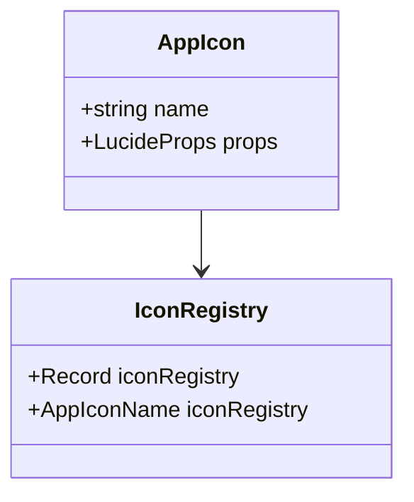

**图表来源**
- [src/components/ui/icons/AppIcon.tsx:8-14](file://src/components/ui/icons/AppIcon.tsx#L8-L14)
- [src/components/ui/icons/registry.ts:79-195](file://src/components/ui/icons/registry.ts#L79-L195)

**章节来源**
- [src/components/ui/icons/AppIcon.tsx:1-15](file://src/components/ui/icons/AppIcon.tsx#L1-L15)
- [src/components/ui/icons/registry.ts:1-195](file://src/components/ui/icons/registry.ts#L1-L195)

## 依赖关系分析
- 组件导出索引：primitives/index.ts 统一导出各组件类型与默认实现，便于按需引入与测试。
- 组件间耦合：组件均通过类名组合实现，彼此低耦合，便于替换与扩展。
- 外部依赖：GlassButton 内部使用任务状态解析工具以生成 loading 态；GlassModalShell 使用 React Portal 实现挂载；ImagePreviewModal 依赖 MediaImageWithLoading 和 image-url 工具；CapsuleNav 依赖 AppIcon 图标系统。
- **新增**：AppIcon 图标系统依赖 Lucide 图标库，提供丰富的图标资源；EpisodeSelector 依赖 CapsuleNav 组件实现剧集管理功能。

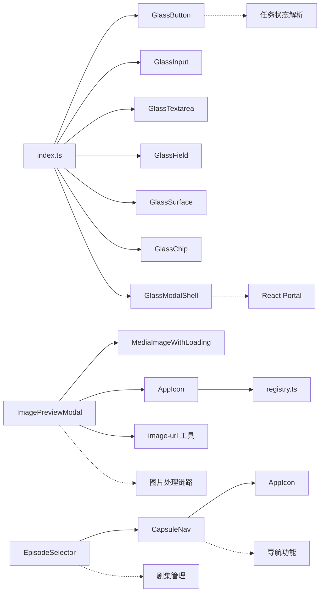

**图表来源**
- [src/components/ui/primitives/index.ts:1-21](file://src/components/ui/primitives/index.ts#L1-L21)
- [src/components/ui/primitives/GlassButton.tsx:2-4](file://src/components/ui/primitives/GlassButton.tsx#L2-L4)
- [src/components/ui/primitives/GlassModalShell.tsx:3-4](file://src/components/ui/primitives/GlassModalShell.tsx#L3-L4)
- [src/components/ui/ImagePreviewModal.tsx:3-7](file://src/components/ui/ImagePreviewModal.tsx#L3-L7)
- [src/components/ui/CapsuleNav.tsx:255-456](file://src/components/ui/CapsuleNav.tsx#L255-L456)
- [src/components/ui/icons/AppIcon.tsx:1-15](file://src/components/ui/icons/AppIcon.tsx#L1-L15)
- [src/components/ui/icons/registry.ts:1-195](file://src/components/ui/icons/registry.ts#L1-L195)

**章节来源**
- [src/components/ui/primitives/index.ts:1-21](file://src/components/ui/primitives/index.ts#L1-L21)

## 性能考量
- 令牌层与语义层：通过 CSS 变量与类名组合，避免在运行时计算样式，渲染成本低。
- 组件实现：多数组件为轻量 forwardRef + cx 组合类名，无额外状态与副作用。
- 动画与模糊：语义层对 backdrop-filter 与 blur 的使用需关注低端设备性能，可结合数据属性切换"subtle"预设降低开销。
- 加载态：GlassButton 的 loading 通过任务状态解析生成，避免重复逻辑，减少分支判断。
- **新增**：ImagePreviewModal 使用 useEffect 清理机制，确保事件监听器正确移除，防止内存泄漏。
- **新增**：MediaImageWithLoading 组件提供骨架屏与加载指示器，改善大图加载体验。
- **更新**：响应式布局优化减少了不必要的重绘，92vw 和 88vh 的比例在保证显示效果的同时降低了计算开销。
- **新增**：AppIcon 图标系统采用懒加载机制，通过 iconRegistry 实现图标组件的按需加载，减少初始包体积。
- **更新**：EpisodeSelector 组件优化了状态指示器的渲染性能，使用 AppIcon 替代彩色圆形指示器，减少样式计算开销。

**章节来源**
- [src/styles/ui-tokens-glass.css:80-96](file://src/styles/ui-tokens-glass.css#L80-L96)
- [src/components/ui/primitives/GlassButton.tsx:41-48](file://src/components/ui/primitives/GlassButton.tsx#L41-L48)
- [src/components/ui/ImagePreviewModal.tsx:17-33](file://src/components/ui/ImagePreviewModal.tsx#L17-L33)
- [src/components/media/MediaImageWithLoading.tsx:34-58](file://src/components/media/MediaImageWithLoading.tsx#L34-L58)
- [src/components/ui/icons/registry.ts:79-195](file://src/components/ui/icons/registry.ts#L79-L195)
- [src/components/ui/CapsuleNav.tsx:418-422](file://src/components/ui/CapsuleNav.tsx#L418-L422)

## 故障排查指南
- 输入框无焦点环或描边异常
  - 检查是否正确应用语义类名与交互态（聚焦、错误、禁用）。
  - 参考路径：[输入类名与交互态:66-112](file://src/styles/ui-semantic-glass.css#L66-L112)
- 按钮加载态不生效
  - 确认 loading 为 true 时已传入 onClick 等事件，组件会根据任务状态解析生成加载指示。
  - 参考路径：[按钮加载态逻辑:41-58](file://src/components/ui/primitives/GlassButton.tsx#L41-L58)
- 模态无法关闭
  - 检查 open、closeOnBackdrop、closeOnEsc 设置；确认 Portal 是否成功挂载到 document.body。
  - 参考路径：[模态交互与 Portal:36-101](file://src/components/ui/primitives/GlassModalShell.tsx#L36-L101)
- **新增**：图片预览组件无法显示图片
  - 检查 imageUrl 参数是否有效；确认 toDisplayImageUrl 函数正确解析 URL。
  - 验证 MediaImageWithLoading 组件是否正确渲染。
  - 参考路径：[图片预览组件:35-38](file://src/components/ui/ImagePreviewModal.tsx#L35-L38)
- **新增**：图片预览后页面仍可滚动
  - 检查 useEffect 清理函数是否执行；确认事件监听器是否正确移除。
  - 参考路径：[滚动控制逻辑:17-33](file://src/components/ui/ImagePreviewModal.tsx#L17-L33)
- **新增**：图片显示超出屏幕范围
  - 检查 max-w-[92vw] 和 max-h-[88vh] 样式是否正确应用。
  - 验证 object-contain 缩放模式是否生效。
  - 确认图片容器的 flex 布局设置。
- **新增**：胶囊导航状态指示器显示异常
  - 检查 AppIcon 组件是否正确渲染；确认图标名称是否在 registry 中注册。
  - 验证状态值（ready/processing）与对应的图标显示逻辑。
  - 参考路径：[状态指示器实现:113-123](file://src/components/ui/CapsuleNav.tsx#L113-L123)
- **新增**：剧集选择器图标显示问题
  - 检查 EpisodeSelector 组件中 AppIcon 的使用是否正确。
  - 确认电影图标（film）和确认图标（checkDot）的渲染。
  - 验证图标尺寸和颜色样式的应用。
  - 参考路径：[剧集选择器图标:293](file://src/components/ui/CapsuleNav.tsx#L293)
- **新增**：AppIcon 图标系统故障
  - 检查 iconRegistry 中图标名称是否正确注册。
  - 验证自定义图标的导入和注册过程。
  - 确认图标组件的类型定义是否正确。
  - 参考路径：[图标注册表:79-195](file://src/components/ui/icons/registry.ts#L79-L195)
- **新增**：按钮定位异常或层级问题
  - 检查绝对定位的按钮是否正确设置了 z-index。
  - 验证按钮容器的相对定位设置。
  - 确认按钮的点击事件是否正确阻止冒泡。
- 主题切换后样式错乱
  - 确认暗色主题类名与变量覆盖是否正确；检查全局样式中主题层与变量桥接。
  - 参考路径：[暗色主题变量覆盖:481-513](file://src/app/globals.css#L481-L513)

**章节来源**
- [src/styles/ui-semantic-glass.css:66-112](file://src/styles/ui-semantic-glass.css#L66-L112)
- [src/components/ui/primitives/GlassButton.tsx:41-58](file://src/components/ui/primitives/GlassButton.tsx#L41-L58)
- [src/components/ui/primitives/GlassModalShell.tsx:36-101](file://src/components/ui/primitives/GlassModalShell.tsx#L36-L101)
- [src/components/ui/ImagePreviewModal.tsx:35-38](file://src/components/ui/ImagePreviewModal.tsx#L35-L38)
- [src/components/ui/ImagePreviewModal.tsx:17-33](file://src/components/ui/ImagePreviewModal.tsx#L17-L33)
- [src/components/ui/CapsuleNav.tsx:113-123](file://src/components/ui/CapsuleNav.tsx#L113-L123)
- [src/components/ui/CapsuleNav.tsx:293](file://src/components/ui/CapsuleNav.tsx#L293)
- [src/components/ui/icons/registry.ts:79-195](file://src/components/ui/icons/registry.ts#L79-L195)
- [src/app/globals.css:481-513](file://src/app/globals.css#L481-L513)

## 结论
Waoowaoo 的 Glass UI 组件库以清晰的分层设计与语义化类名为核心，实现了高一致性与可维护性的玻璃拟态界面。通过统一的令牌与语义层，组件具备良好的可定制性与可扩展性；通过合理的交互与加载态设计，提升了用户体验。新增的 ImagePreviewModal 组件、CapsuleNav 导航组件和 EpisodeSelector 剧集选择器进一步完善了组件库的功能完整性，其响应式布局改进从固定屏幕尺寸转向内容自适应，提供了更灵活的图片预览和导航解决方案。AppIcon 图标系统的引入实现了图标资源的统一管理，使用 Film 图标作为电影相关功能的统一视觉标识，确保了设计的一致性和可维护性。建议在业务开发中优先使用本组件库提供的基础组件，遵循组合与复用策略，确保风格一致与性能稳定。

## 附录

### 响应式设计实现
- 组件层：通过类名组合与密度变量实现紧凑/默认两种密度，适配移动端与桌面端。
- 样式层：语义层提供密度类名，容器组件根据密度动态选择类名。
- 全局层：媒体查询与断点配合语义类名，实现自适应布局。
- **更新**：ImagePreviewModal 采用内容自适应设计，使用 `max-w-[92vw] max-h-[88vh] w-auto h-auto` 确保在各种屏幕尺寸下的最佳显示效果。这种基于视口单位的布局方案相比固定像素尺寸更加灵活，能够自动适配不同设备的屏幕大小。
- **更新**：CapsuleNav 组件支持紧凑模式和标准模式的自适应布局，通过 CSS Grid 和 Flexbox 实现响应式导航项排列。

**章节来源**
- [src/styles/ui-semantic-glass.css:265-271](file://src/styles/ui-semantic-glass.css#L265-L271)
- [src/components/ui/primitives/GlassSurface.tsx:31](file://src/components/ui/primitives/GlassSurface.tsx#L31)
- [src/components/ui/ImagePreviewModal.tsx:72-73](file://src/components/ui/ImagePreviewModal.tsx#L72-L73)
- [src/components/ui/CapsuleNav.tsx:169-196](file://src/components/ui/CapsuleNav.tsx#L169-L196)

### 主题定制与样式覆盖
- 令牌层定制：修改 ui-tokens-glass.css 中变量即可调整整体风格（颜色、阴影、圆角、模糊等）。
- 语义层覆盖：通过自定义类名叠加语义类名，实现局部覆盖。
- 全局桥接：globals.css 将令牌映射为全局 CSS 变量，便于 Tailwind 与第三方组件共享。
- **新增**：支持 data-glass-preset="subtle" 预设，在性能敏感环境中降低视觉效果强度。
- **新增**：AppIcon 图标系统支持主题颜色继承，图标颜色会自动跟随组件的主题设置。

**章节来源**
- [src/styles/ui-tokens-glass.css:1-96](file://src/styles/ui-tokens-glass.css#L1-L96)
- [src/app/globals.css:7-61](file://src/app/globals.css#L7-L61)
- [src/components/ui/icons/AppIcon.tsx:8-14](file://src/components/ui/icons/AppIcon.tsx#L8-L14)

### 组件组合模式与复用策略
- 组合模式
  - 表单：GlassField 包裹 GlassInput/GlassTextarea，统一 label/hint/error。
  - 卡片：GlassSurface 包裹内容，必要时开启 interactive 与 padded。
  - 模态：GlassModalShell 作为外壳，内部使用 GlassSurface 与表单组件。
  - **新增**：图片预览：ImagePreviewModal 作为独立组件，通过 props 控制显示与隐藏。
  - **新增**：导航组合：CapsuleNav 作为基础导航组件，EpisodeSelector 作为专用剧集管理组件。
- 复用策略
  - 通过 variants/density/icon/loading 等属性在不同场景复用同一组件。
  - 使用 Portal 的 GlassModalShell 在页面任意位置渲染，避免层级与布局问题。
  - **新增**：ImagePreviewModal 通过统一的图片处理工具链，支持多种图片格式与来源。
  - **新增**：AppIcon 图标系统提供统一的图标使用方式，支持主题颜色继承。
  - **更新**：响应式布局优化使得 ImagePreviewModal 在不同设备上都能提供一致的用户体验。
  - **更新**：EpisodeSelector 组件复用 CapsuleNav 的状态指示器实现，确保视觉一致性。

**章节来源**
- [src/components/ui/primitives/GlassField.tsx:18-48](file://src/components/ui/primitives/GlassField.tsx#L18-L48)
- [src/components/ui/primitives/GlassSurface.tsx:18-46](file://src/components/ui/primitives/GlassSurface.tsx#L18-L46)
- [src/components/ui/primitives/GlassModalShell.tsx:24-101](file://src/components/ui/primitives/GlassModalShell.tsx#L24-L101)
- [src/components/ui/ImagePreviewModal.tsx:1-80](file://src/components/ui/ImagePreviewModal.tsx#L1-L80)
- [src/components/ui/CapsuleNav.tsx:138-460](file://src/components/ui/CapsuleNav.tsx#L138-L460)
- [src/components/ui/icons/AppIcon.tsx:1-15](file://src/components/ui/icons/AppIcon.tsx#L1-L15)

### 实际使用示例与最佳实践
- 示例场景
  - 登录表单：GlassField + GlassInput + GlassButton（primary）
  - 设置面板：GlassSurface（elevated）+ GlassField + GlassInput/GlassTextarea + GlassButton（secondary/ghost）
  - 确认对话框：GlassModalShell（size=sm）+ GlassButton（danger/ghost）
  - **新增**：图片预览：在图片点击事件中调用 ImagePreviewModal，传入图片 URL 与关闭回调。
  - **新增**：导航系统：使用 CapsuleNav 作为主要导航，EpisodeSelector 作为剧集管理入口。
  - **新增**：状态指示：在导航项中使用 AppIcon 实现统一的状态指示器。
- 最佳实践
  - 保持 label 与输入控件 id 对齐，提升可访问性。
  - 使用 GlassChip 展示状态或标签，必要时提供 onRemove。
  - 在性能敏感场景使用 data-glass-preset="subtle" 降低模糊与阴影开销。
  - 通过 Portal 渲染模态，避免定位与层级问题。
  - **新增**：使用 ImagePreviewModal 时，确保正确处理图片 URL 解析与错误情况。
  - **新增**：在图片预览组件中，合理使用 MediaImageWithLoading 提供加载反馈。
  - **更新**：响应式布局优化使得 ImagePreviewModal 在移动端和桌面端都能提供良好的用户体验。
  - **新增**：使用 AppIcon 时，确保图标名称在 registry 中正确注册，避免运行时错误。
  - **更新**：EpisodeSelector 组件使用 AppIcon 替代彩色状态指示器，确保视觉设计的一致性。

**章节来源**
- [src/components/ui/primitives/GlassField.tsx:18-48](file://src/components/ui/primitives/GlassField.tsx#L18-L48)
- [src/components/ui/primitives/GlassButton.tsx:17-64](file://src/components/ui/primitives/GlassButton.tsx#L17-L64)
- [src/components/ui/primitives/GlassModalShell.tsx:24-101](file://src/components/ui/primitives/GlassModalShell.tsx#L24-L101)
- [src/components/ui/ImagePreviewModal.tsx:14-79](file://src/components/ui/ImagePreviewModal.tsx#L14-L79)
- [src/styles/ui-tokens-glass.css:80-96](file://src/styles/ui-tokens-glass.css#L80-L96)
- [src/components/ui/CapsuleNav.tsx:255-456](file://src/components/ui/CapsuleNav.tsx#L255-L456)
- [src/components/ui/icons/registry.ts:79-195](file://src/components/ui/icons/registry.ts#L79-L195)

### 图片预览功能的视觉设计优化
- **新增**：ImagePreviewModal 采用统一的玻璃拟态设计语言，与整体 UI 风格保持一致。
- **新增**：使用 backdrop-blur-sm 实现毛玻璃效果，增强视觉层次感。
- **新增**：按钮采用圆角设计与过渡动画，提供流畅的交互体验。
- **新增**：图片容器应用 rounded-2xl 圆角，shadow-2xl 阴影，营造立体视觉效果。
- **新增**：支持查看原始图片功能，通过链接按钮提供直接访问选项。
- **更新**：响应式布局优化采用 `max-w-[92vw] max-h-[88vh] w-auto h-auto` 实现内容自适应，92vw 和 88vh 的比例确保在各种屏幕尺寸下都有最佳显示效果。
- **更新**：按钮定位系统通过绝对定位和 z-index 管理，确保关闭按钮和查看原始图片按钮不会被图片内容遮挡。

**章节来源**
- [src/components/ui/ImagePreviewModal.tsx:40-79](file://src/components/ui/ImagePreviewModal.tsx#L40-L79)
- [src/components/ui/icons/AppIcon.tsx:1-15](file://src/components/ui/icons/AppIcon.tsx#L1-L15)
- [src/lib/media/image-url.ts:51-89](file://src/lib/media/image-url.ts#L51-L89)

### AppIcon 图标系统的统一视觉设计
- **新增**：AppIcon 组件提供类型安全的图标使用方式，确保图标名称的有效性。
- **新增**：支持 195+ 个图标，包括基础图标、品牌图标、自定义图标，满足各种业务场景需求。
- **新增**：电影图标统一：使用 Film 图标作为电影相关功能的统一视觉标识，确保设计一致性。
- **新增**：图标别名支持：如 "close"、"check"、"plus" 等，提供更直观的图标命名。
- **新增**：主题颜色继承：图标颜色会自动跟随组件的主题设置，无需手动配置。
- **更新**：EpisodeSelector 组件使用 AppIcon 替代彩色状态指示器，实现统一的视觉设计。
- **更新**：胶囊导航组件的状态指示器使用 AppIcon "checkDot" 实现细小的确认指示点。

**章节来源**
- [src/components/ui/icons/AppIcon.tsx:1-15](file://src/components/ui/icons/AppIcon.tsx#L1-L15)
- [src/components/ui/icons/registry.ts:79-195](file://src/components/ui/icons/registry.ts#L79-L195)
- [src/components/ui/CapsuleNav.tsx:113-123](file://src/components/ui/CapsuleNav.tsx#L113-L123)
- [src/components/ui/CapsuleNav.tsx:418-422](file://src/components/ui/CapsuleNav.tsx#L418-L422)