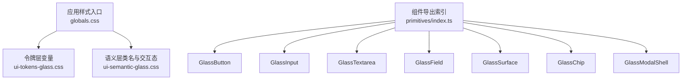
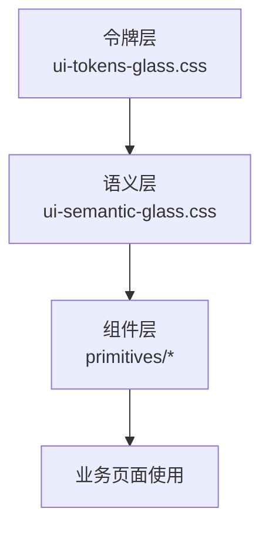
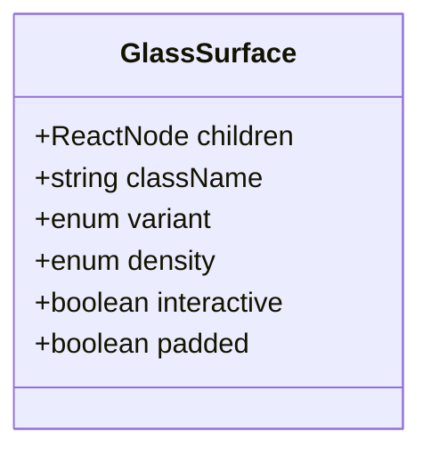
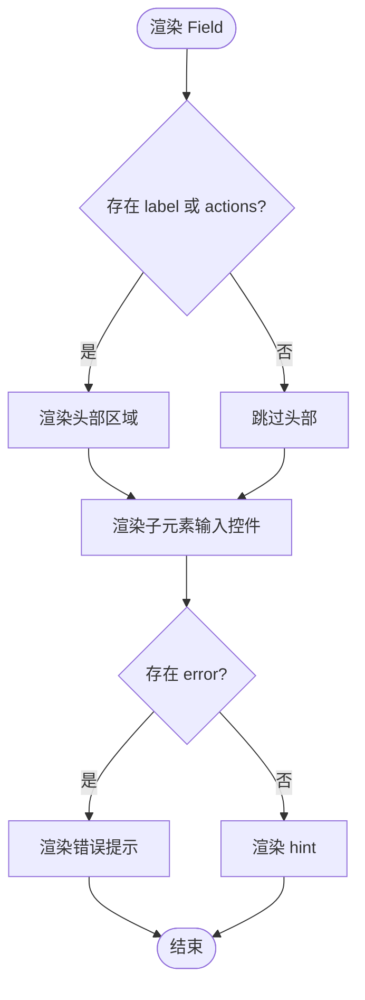
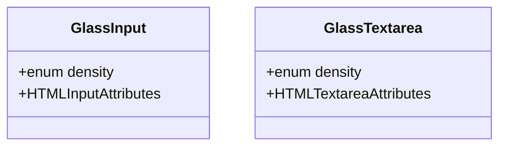
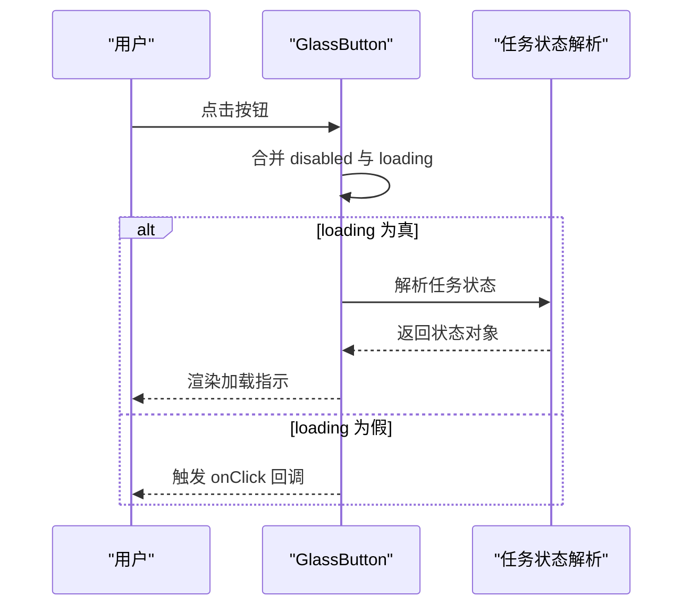
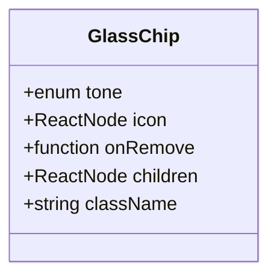
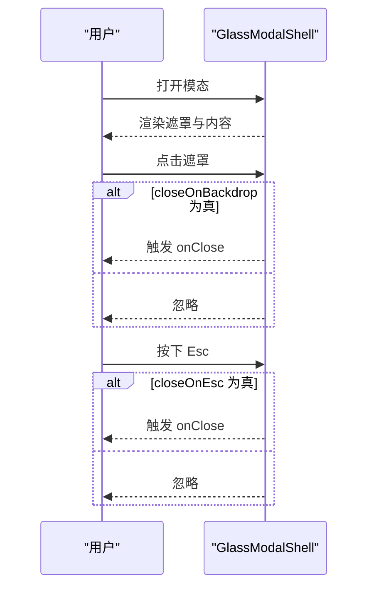
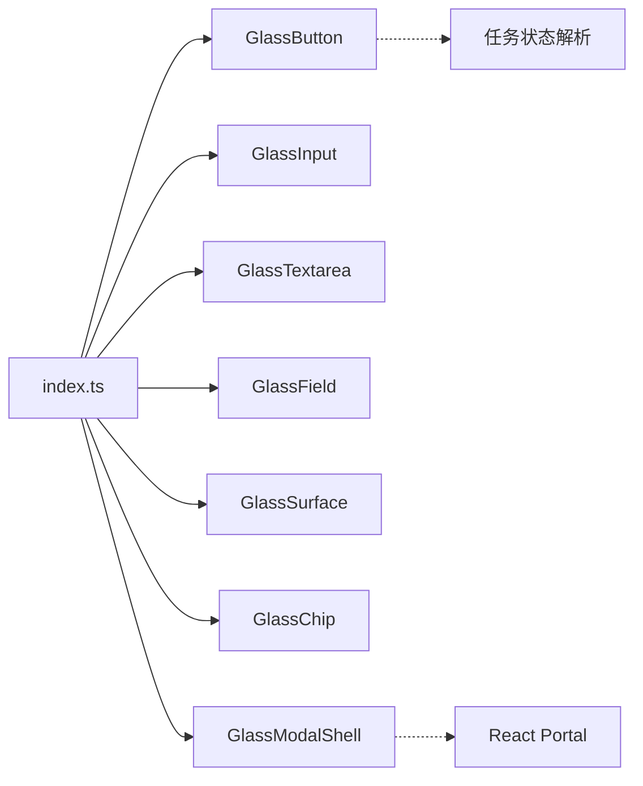

# UI组件库

<cite>
**本文引用的文件**   
- [src/styles/ui-semantic-glass.css](file://src/styles/ui-semantic-glass.css)
- [src/styles/ui-tokens-glass.css](file://src/styles/ui-tokens-glass.css)
- [src/app/globals.css](file://src/app/globals.css)
- [src/components/ui/primitives/index.ts](file://src/components/ui/primitives/index.ts)
- [src/components/ui/primitives/GlassButton.tsx](file://src/components/ui/primitives/GlassButton.tsx)
- [src/components/ui/primitives/GlassInput.tsx](file://src/components/ui/primitives/GlassInput.tsx)
- [src/components/ui/primitives/GlassTextarea.tsx](file://src/components/ui/primitives/GlassTextarea.tsx)
- [src/components/ui/primitives/GlassField.tsx](file://src/components/ui/primitives/GlassField.tsx)
- [src/components/ui/primitives/GlassSurface.tsx](file://src/components/ui/primitives/GlassSurface.tsx)
- [src/components/ui/primitives/GlassChip.tsx](file://src/components/ui/primitives/GlassChip.tsx)
- [src/components/ui/primitives/GlassModalShell.tsx](file://src/components/ui/primitives/GlassModalShell.tsx)
- [src/components/selectors/RatioStyleSelectors.tsx](file://src/components/selectors/RatioStyleSelectors.tsx)
</cite>

## 目录
1. [简介](#简介)
2. [项目结构](#项目结构)
3. [核心组件](#核心组件)
4. [架构总览](#架构总览)
5. [组件详解](#组件详解)
6. [依赖关系分析](#依赖关系分析)
7. [性能考量](#性能考量)
8. [故障排查指南](#故障排查指南)
9. [结论](#结论)
10. [附录](#附录)

## 简介
本文件为 Waoowaoo 的 UI 组件库技术文档，聚焦 Glass UI 设计系统，系统性阐述玻璃拟态（Glassmorphism）风格的视觉与交互实现。内容涵盖基础组件（如 GlassButton、GlassInput、GlassModalShell 等）的设计理念、属性配置、事件处理与状态管理；提供组件组合模式与复用策略；说明响应式设计、主题定制与样式覆盖方法，并给出实际使用示例与最佳实践。

## 项目结构
UI 组件库位于 src/components/ui/primitives，配套样式由两部分构成：语义层样式（ui-semantic-glass.css）定义可复用的视觉类名与交互态；令牌层样式（ui-tokens-glass.css）定义变量与预设。全局样式入口（globals.css）引入上述样式并桥接至 Tailwind 与主题变量。

图表来源
- [src/app/globals.css:1-5](file://src/app/globals.css#L1-L5)
- [src/styles/ui-tokens-glass.css:1-96](file://src/styles/ui-tokens-glass.css#L1-L96)
- [src/styles/ui-semantic-glass.css:1-465](file://src/styles/ui-semantic-glass.css#L1-L465)
- [src/components/ui/primitives/index.ts:1-21](file://src/components/ui/primitives/index.ts#L1-L21)

章节来源
- [src/app/globals.css:1-523](file://src/app/globals.css#L1-L523)
- [src/styles/ui-tokens-glass.css:1-96](file://src/styles/ui-tokens-glass.css#L1-L96)
- [src/styles/ui-semantic-glass.css:1-465](file://src/styles/ui-semantic-glass.css#L1-L465)
- [src/components/ui/primitives/index.ts:1-21](file://src/components/ui/primitives/index.ts#L1-L21)

## 核心组件
- GlassSurface：容器型组件，支持多种变体（panel/card/elevated/modal）、密度（compact/default）、交互悬停动效与内边距控制。
- GlassField：表单字段包装器，统一标签、提示、错误与动作区布局。
- GlassInput / GlassTextarea：输入与多行文本输入，支持密度与原生属性透传。
- GlassButton：按钮组件，支持主次/幽灵/危险等变体、尺寸、加载态与图标插槽。
- GlassChip：信息展示与可选移除的标签式组件，支持五种语义色调。
- GlassModalShell：模态壳体，支持尺寸、遮罩关闭、Esc 关闭、标题/描述/页脚区域与 Portal 渲染。

章节来源
- [src/components/ui/primitives/GlassSurface.tsx:1-47](file://src/components/ui/primitives/GlassSurface.tsx#L1-L47)
- [src/components/ui/primitives/GlassField.tsx:1-50](file://src/components/ui/primitives/GlassField.tsx#L1-L50)
- [src/components/ui/primitives/GlassInput.tsx:1-29](file://src/components/ui/primitives/GlassInput.tsx#L1-L29)
- [src/components/ui/primitives/GlassTextarea.tsx:1-29](file://src/components/ui/primitives/GlassTextarea.tsx#L1-L29)
- [src/components/ui/primitives/GlassButton.tsx:1-67](file://src/components/ui/primitives/GlassButton.tsx#L1-L67)
- [src/components/ui/primitives/GlassChip.tsx:1-43](file://src/components/ui/primitives/GlassChip.tsx#L1-L43)
- [src/components/ui/primitives/GlassModalShell.tsx:1-102](file://src/components/ui/primitives/GlassModalShell.tsx#L1-L102)

## 架构总览
Glass UI 设计系统采用“令牌层 + 语义层 + 组件层”的分层架构：
- 令牌层（ui-tokens-glass.css）：集中管理颜色、阴影、圆角、模糊、间距与密度等设计令牌。
- 语义层（ui-semantic-glass.css）：以类名形式暴露可复用的视觉样式与交互态，组件通过类名组合实现一致风格。
- 组件层（primitives/*）：以最小可用接口封装语义类名与行为，保证可组合、可扩展与可测试。

图表来源
- [src/styles/ui-tokens-glass.css:1-96](file://src/styles/ui-tokens-glass.css#L1-L96)
- [src/styles/ui-semantic-glass.css:1-465](file://src/styles/ui-semantic-glass.css#L1-L465)
- [src/components/ui/primitives/index.ts:1-21](file://src/components/ui/primitives/index.ts#L1-L21)

## 组件详解

### GlassSurface 容器
- 设计理念：提供统一的玻璃表面容器，支持不同层级（panel/card/elevated/modal）与密度，可选交互悬停动效。
- 关键属性
  - variant：panel | card | elevated | modal
  - density：compact | default
  - interactive：是否启用悬停位移动画与阴影增强
  - padded：是否启用默认内边距
- 复杂度与性能：O(1) 类名拼接，无副作用，渲染开销极低。
- 最佳实践：在复杂卡片中统一使用该容器，避免重复声明圆角、阴影与模糊。

图表来源
- [src/components/ui/primitives/GlassSurface.tsx:5-12](file://src/components/ui/primitives/GlassSurface.tsx#L5-L12)

章节来源
- [src/components/ui/primitives/GlassSurface.tsx:18-46](file://src/components/ui/primitives/GlassSurface.tsx#L18-L46)

### GlassField 表单字段包装器
- 设计理念：统一 label/hint/error/actions 区域布局，简化表单一致性。
- 关键属性
  - id：关联子元素
  - label：字段标题
  - hint：辅助提示
  - error：错误文案
  - required：是否显示必填星号
  - actions：右侧操作区（如“重置”、“帮助”）
- 使用建议：与 GlassInput/GlassTextarea/GlassSelect 组合使用，确保 label 与输入控件 id 对应。

图表来源
- [src/components/ui/primitives/GlassField.tsx:18-48](file://src/components/ui/primitives/GlassField.tsx#L18-L48)

章节来源
- [src/components/ui/primitives/GlassField.tsx:1-50](file://src/components/ui/primitives/GlassField.tsx#L1-L50)

### GlassInput 与 GlassTextarea
- 设计理念：基于语义类名实现一致的输入外观与交互态，支持 compact/default 密度。
- 关键属性
  - density：compact | default
  - 其余原生 HTML 属性透传（如 placeholder、value、onChange 等）
- 交互要点：聚焦时带焦点环与内描边；禁用时半透明且不可交互；错误态带危险描边与环。

图表来源
- [src/components/ui/primitives/GlassInput.tsx:3-5](file://src/components/ui/primitives/GlassInput.tsx#L3-L5)
- [src/components/ui/primitives/GlassTextarea.tsx:3-5](file://src/components/ui/primitives/GlassTextarea.tsx#L3-L5)

章节来源
- [src/components/ui/primitives/GlassInput.tsx:11-28](file://src/components/ui/primitives/GlassInput.tsx#L11-L28)
- [src/components/ui/primitives/GlassTextarea.tsx:11-28](file://src/components/ui/primitives/GlassTextarea.tsx#L11-L28)

### GlassButton 按钮
- 设计理念：提供 primary/secondary/ghost/danger 等变体，支持 sm/md/lg 尺寸与 loading 态。
- 关键属性
  - variant：primary | secondary | ghost | danger
  - size：sm | md | lg
  - loading：布尔值，内部映射任务状态以显示进度指示
  - iconLeft/iconRight：左右图标插槽
  - disabled：禁用态合并 loading 状态
- 交互要点：hover 提升、focus 聚焦环、禁用半透明；primary 变体带渐变与阴影提升。

图表来源
- [src/components/ui/primitives/GlassButton.tsx:17-64](file://src/components/ui/primitives/GlassButton.tsx#L17-L64)

章节来源
- [src/components/ui/primitives/GlassButton.tsx:1-67](file://src/components/ui/primitives/GlassButton.tsx#L1-L67)

### GlassChip 标签
- 设计理念：用于展示状态或可移除的标签项，支持 neutral/info/success/warning/danger 五种语义色调。
- 关键属性
  - tone：语义色调
  - icon：左侧图标
  - onRemove：点击右侧移除按钮回调
  - children：文本内容
- 交互要点：hover 右侧按钮有浅色背景过渡。

图表来源
- [src/components/ui/primitives/GlassChip.tsx:6-12](file://src/components/ui/primitives/GlassChip.tsx#L6-L12)

章节来源
- [src/components/ui/primitives/GlassChip.tsx:18-42](file://src/components/ui/primitives/GlassChip.tsx#L18-L42)

### GlassModalShell 模态壳体
- 设计理念：提供可配置的模态对话框外壳，支持尺寸、遮罩关闭、Esc 关闭、标题/描述/页脚区域与 Portal 渲染。
- 关键属性
  - open：是否打开
  - onClose：关闭回调
  - title/description/footer：内容区域
  - size：sm | md | lg | xl
  - closeOnBackdrop/closeOnEsc/showCloseButton：交互行为开关
- 交互要点：Esc 键监听；点击遮罩关闭；Portal 渲染到 document.body。

图表来源
- [src/components/ui/primitives/GlassModalShell.tsx:24-101](file://src/components/ui/primitives/GlassModalShell.tsx#L24-L101)

章节来源
- [src/components/ui/primitives/GlassModalShell.tsx:1-102](file://src/components/ui/primitives/GlassModalShell.tsx#L1-L102)

## 依赖关系分析
- 组件导出索引：primitives/index.ts 统一导出各组件类型与默认实现，便于按需引入与测试。
- 组件间耦合：组件均通过类名组合实现，彼此低耦合，便于替换与扩展。
- 外部依赖：GlassButton 内部使用任务状态解析工具以生成 loading 态；GlassModalShell 使用 React Portal 实现挂载。

图表来源
- [src/components/ui/primitives/index.ts:1-21](file://src/components/ui/primitives/index.ts#L1-L21)
- [src/components/ui/primitives/GlassButton.tsx:2-4](file://src/components/ui/primitives/GlassButton.tsx#L2-L4)
- [src/components/ui/primitives/GlassModalShell.tsx:3-4](file://src/components/ui/primitives/GlassModalShell.tsx#L3-L4)

章节来源
- [src/components/ui/primitives/index.ts:1-21](file://src/components/ui/primitives/index.ts#L1-L21)

## 性能考量
- 令牌层与语义层：通过 CSS 变量与类名组合，避免在运行时计算样式，渲染成本低。
- 组件实现：多数组件为轻量 forwardRef + cx 组合类名，无额外状态与副作用。
- 动画与模糊：语义层对 backdrop-filter 与 blur 的使用需关注低端设备性能，可结合数据属性切换“subtle”预设降低开销。
- 加载态：GlassButton 的 loading 通过任务状态解析生成，避免重复逻辑，减少分支判断。

章节来源
- [src/styles/ui-tokens-glass.css:80-96](file://src/styles/ui-tokens-glass.css#L80-L96)
- [src/components/ui/primitives/GlassButton.tsx:41-48](file://src/components/ui/primitives/GlassButton.tsx#L41-L48)

## 故障排查指南
- 输入框无焦点环或描边异常
  - 检查是否正确应用语义类名与交互态（聚焦、错误、禁用）。
  - 参考路径：[输入类名与交互态:66-112](file://src/styles/ui-semantic-glass.css#L66-L112)
- 按钮加载态不生效
  - 确认 loading 为 true 时已传入 onClick 等事件，组件会根据任务状态解析生成加载指示。
  - 参考路径：[按钮加载态逻辑:41-58](file://src/components/ui/primitives/GlassButton.tsx#L41-L58)
- 模态无法关闭
  - 检查 open、closeOnBackdrop、closeOnEsc 设置；确认 Portal 是否成功挂载到 document.body。
  - 参考路径：[模态交互与 Portal:36-101](file://src/components/ui/primitives/GlassModalShell.tsx#L36-L101)
- 主题切换后样式错乱
  - 确认暗色主题类名与变量覆盖是否正确；检查全局样式中主题层与变量桥接。
  - 参考路径：[暗色主题变量覆盖:481-513](file://src/app/globals.css#L481-L513)

章节来源
- [src/styles/ui-semantic-glass.css:66-112](file://src/styles/ui-semantic-glass.css#L66-L112)
- [src/components/ui/primitives/GlassButton.tsx:41-58](file://src/components/ui/primitives/GlassButton.tsx#L41-L58)
- [src/components/ui/primitives/GlassModalShell.tsx:36-101](file://src/components/ui/primitives/GlassModalShell.tsx#L36-L101)
- [src/app/globals.css:481-513](file://src/app/globals.css#L481-L513)

## 结论
Waoowaoo 的 Glass UI 组件库以清晰的分层设计与语义化类名为核心，实现了高一致性与可维护性的玻璃拟态界面。通过统一的令牌与语义层，组件具备良好的可定制性与可扩展性；通过合理的交互与加载态设计，提升了用户体验。建议在业务开发中优先使用本组件库提供的基础组件，遵循组合与复用策略，确保风格一致与性能稳定。

## 附录

### 响应式设计实现
- 组件层：通过类名组合与密度变量实现紧凑/默认两种密度，适配移动端与桌面端。
- 样式层：语义层提供密度类名，容器组件根据密度动态选择类名。
- 全局层：媒体查询与断点配合语义类名，实现自适应布局。

章节来源
- [src/styles/ui-semantic-glass.css:265-271](file://src/styles/ui-semantic-glass.css#L265-L271)
- [src/components/ui/primitives/GlassSurface.tsx:31](file://src/components/ui/primitives/GlassSurface.tsx#L31)

### 主题定制与样式覆盖
- 令牌层定制：修改 ui-tokens-glass.css 中变量即可调整整体风格（颜色、阴影、圆角、模糊等）。
- 语义层覆盖：通过自定义类名叠加语义类名，实现局部覆盖。
- 全局桥接：globals.css 将令牌映射为全局 CSS 变量，便于 Tailwind 与第三方组件共享。

章节来源
- [src/styles/ui-tokens-glass.css:1-96](file://src/styles/ui-tokens-glass.css#L1-L96)
- [src/app/globals.css:7-61](file://src/app/globals.css#L7-L61)

### 组件组合模式与复用策略
- 组合模式
  - 表单：GlassField 包裹 GlassInput/GlassTextarea，统一 label/hint/error。
  - 卡片：GlassSurface 包裹内容，必要时开启 interactive 与 padded。
  - 模态：GlassModalShell 作为外壳，内部使用 GlassSurface 与表单组件。
- 复用策略
  - 通过 variants/density/icon/loading 等属性在不同场景复用同一组件。
  - 使用 Portal 的 GlassModalShell 在页面任意位置渲染，避免层级与布局问题。

章节来源
- [src/components/ui/primitives/GlassField.tsx:18-48](file://src/components/ui/primitives/GlassField.tsx#L18-L48)
- [src/components/ui/primitives/GlassSurface.tsx:18-46](file://src/components/ui/primitives/GlassSurface.tsx#L18-L46)
- [src/components/ui/primitives/GlassModalShell.tsx:24-101](file://src/components/ui/primitives/GlassModalShell.tsx#L24-L101)

### 实际使用示例与最佳实践
- 示例场景
  - 登录表单：GlassField + GlassInput + GlassButton（primary）
  - 设置面板：GlassSurface（elevated）+ GlassField + GlassInput/GlassTextarea + GlassButton（secondary/ghost）
  - 确认对话框：GlassModalShell（size=sm）+ GlassButton（danger/ghost）
- 最佳实践
  - 保持 label 与输入控件 id 对齐，提升可访问性。
  - 使用 GlassChip 展示状态或标签，必要时提供 onRemove。
  - 在性能敏感场景使用 data-glass-preset="subtle" 降低模糊与阴影开销。
  - 通过 Portal 渲染模态，避免定位与层级问题。

章节来源
- [src/components/ui/primitives/GlassField.tsx:18-48](file://src/components/ui/primitives/GlassField.tsx#L18-L48)
- [src/components/ui/primitives/GlassButton.tsx:17-64](file://src/components/ui/primitives/GlassButton.tsx#L17-L64)
- [src/components/ui/primitives/GlassModalShell.tsx:24-101](file://src/components/ui/primitives/GlassModalShell.tsx#L24-L101)
- [src/styles/ui-tokens-glass.css:80-96](file://src/styles/ui-tokens-glass.css#L80-L96)