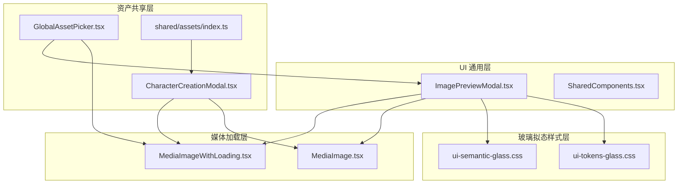
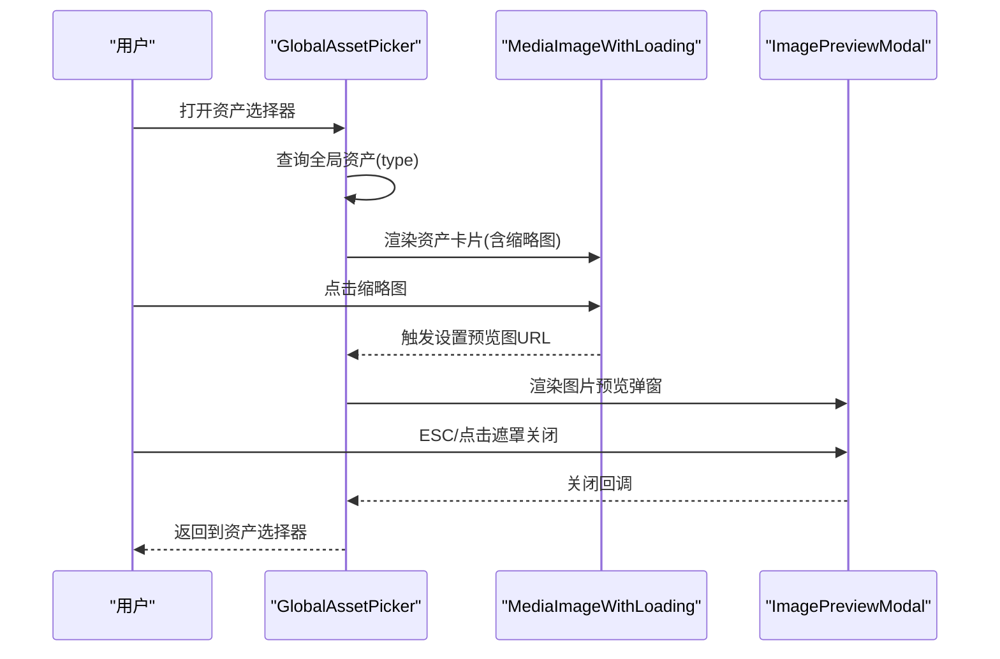
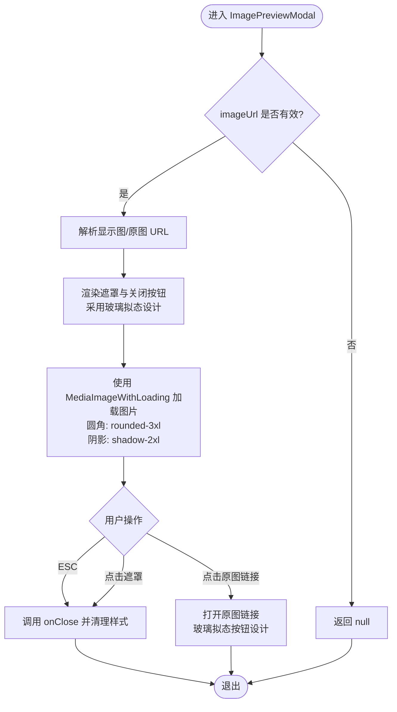
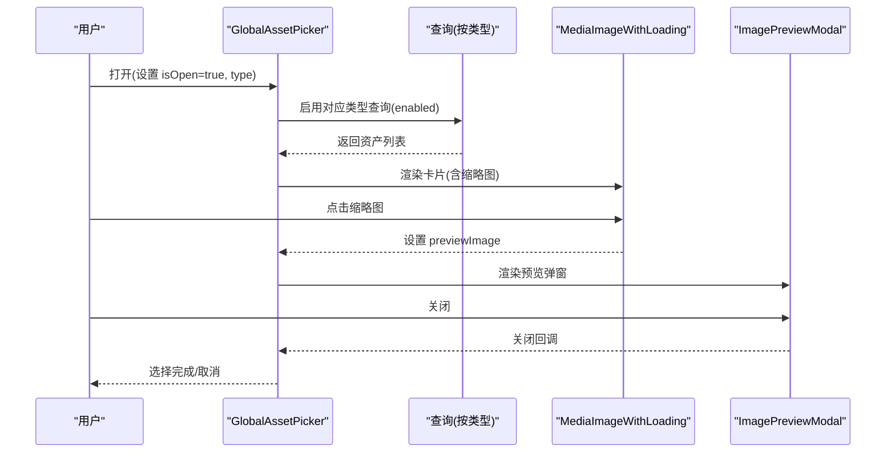
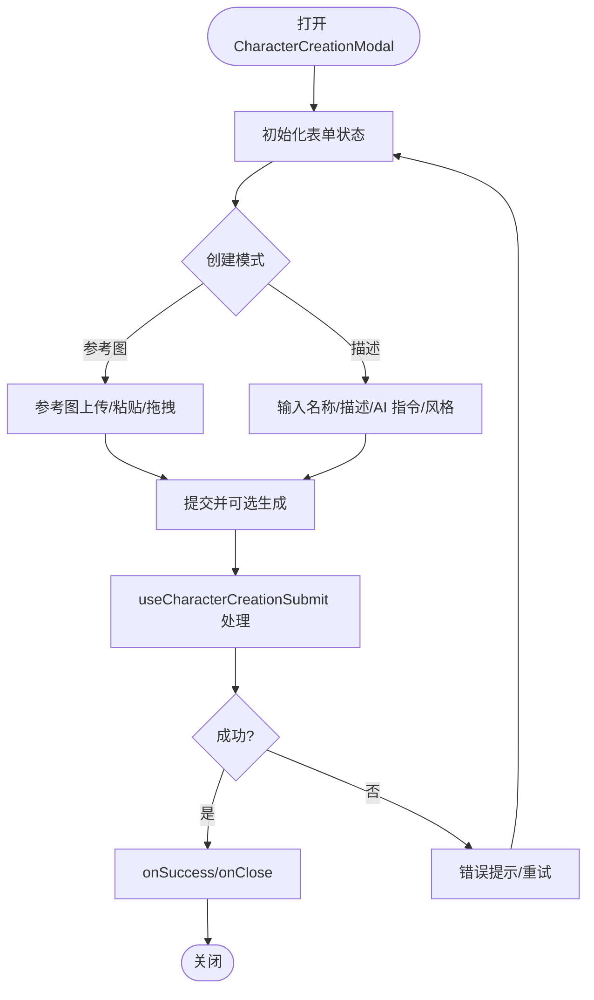
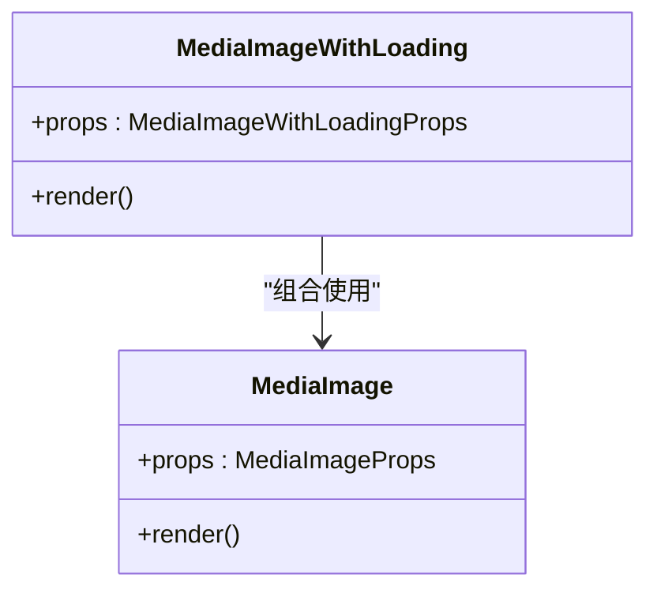
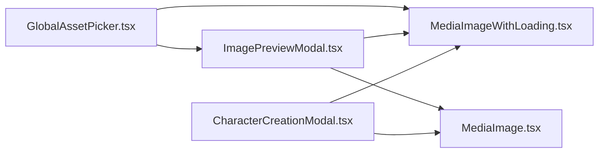

# 共享组件

<cite>
**本文引用的文件**
- [ImagePreviewModal.tsx](file://src/components/ui/ImagePreviewModal.tsx)
- [GlobalAssetPicker.tsx](file://src/components/shared/assets/GlobalAssetPicker.tsx)
- [CharacterCreationModal.tsx](file://src/components/shared/assets/CharacterCreationModal.tsx)
- [MediaImageWithLoading.tsx](file://src/components/media/MediaImageWithLoading.tsx)
- [MediaImage.tsx](file://src/components/media/MediaImage.tsx)
- [SharedComponents.tsx](file://src/components/ui/SharedComponents.tsx)
- [index.ts](file://src/components/shared/assets/index.ts)
- [ui-semantic-glass.css](file://src/styles/ui-semantic-glass.css)
- [ui-tokens-glass.css](file://src/styles/ui-tokens-glass.css)
- [image-generation-inline-count-button.test.ts](file://tests/unit/components/image-generation-inline-count-button.test.ts)
- [global-asset-picker-preview.test.ts](file://tests/unit/components/global-asset-picker-preview.test.ts)
- [segmented-control.test.ts](file://tests/unit/components/segmented-control.test.ts)
</cite>

## 更新摘要
**变更内容**
- 更新了ImagePreviewModal的UI优化部分，反映最大宽度、内边距、圆角半径和玻璃拟态按钮设计的重大改进
- 新增了玻璃拟态效果的详细说明和视觉设计分析
- 更新了组件的样式规范和设计原则

## 目录
1. [简介](#简介)
2. [项目结构](#项目结构)
3. [核心组件](#核心组件)
4. [架构总览](#架构总览)
5. [详细组件分析](#详细组件分析)
6. [依赖分析](#依赖分析)
7. [性能考量](#性能考量)
8. [故障排查指南](#故障排查指南)
9. [结论](#结论)
10. [附录](#附录)

## 简介
本文件聚焦于 Waoowaoo 的"共享组件"体系，重点覆盖跨模块复用的通用 UI 与媒体处理组件，尤其是 ImagePreviewModal、GlobalAssetPicker、CharacterCreationModal 等。文档从通用性设计原则、接口标准化、模块解耦策略出发，阐述这些组件在不同业务模块中的应用场景与集成方式，并给出扩展性、向后兼容与版本管理建议，以及测试策略与质量保障措施。

## 项目结构
共享组件主要分布在以下路径：
- UI 通用层：src/components/ui（如 ImagePreviewModal、SharedComponents）
- 媒体加载层：src/components/media（如 MediaImage、MediaImageWithLoading）
- 资产共享层：src/components/shared/assets（如 GlobalAssetPicker、CharacterCreationModal 及其导出索引）
- 玻璃拟态样式层：src/styles（如 ui-semantic-glass.css、ui-tokens-glass.css）

**图表来源**
- [ImagePreviewModal.tsx:1-78](file://src/components/ui/ImagePreviewModal.tsx#L1-L78)
- [GlobalAssetPicker.tsx:1-559](file://src/components/shared/assets/GlobalAssetPicker.tsx#L1-L559)
- [CharacterCreationModal.tsx:1-279](file://src/components/shared/assets/CharacterCreationModal.tsx#L1-L279)
- [MediaImageWithLoading.tsx:1-92](file://src/components/media/MediaImageWithLoading.tsx#L1-L92)
- [MediaImage.tsx:1-85](file://src/components/media/MediaImage.tsx#L1-L85)
- [index.ts:1-13](file://src/components/shared/assets/index.ts#L1-L13)
- [ui-semantic-glass.css:1-465](file://src/styles/ui-semantic-glass.css#L1-L465)
- [ui-tokens-glass.css:1-96](file://src/styles/ui-tokens-glass.css#L1-L96)

**章节来源**
- [ImagePreviewModal.tsx:1-78](file://src/components/ui/ImagePreviewModal.tsx#L1-L78)
- [GlobalAssetPicker.tsx:1-559](file://src/components/shared/assets/GlobalAssetPicker.tsx#L1-L559)
- [CharacterCreationModal.tsx:1-279](file://src/components/shared/assets/CharacterCreationModal.tsx#L1-L279)
- [MediaImageWithLoading.tsx:1-92](file://src/components/media/MediaImageWithLoading.tsx#L1-L92)
- [MediaImage.tsx:1-85](file://src/components/media/MediaImage.tsx#L1-L85)
- [index.ts:1-13](file://src/components/shared/assets/index.ts#L1-L13)
- [ui-semantic-glass.css:1-465](file://src/styles/ui-semantic-glass.css#L1-L465)
- [ui-tokens-glass.css:1-96](file://src/styles/ui-tokens-glass.css#L1-L96)

## 核心组件
- ImagePreviewModal：提供图片预览弹窗，支持 ESC 关闭、遮罩点击关闭、查看原图链接、毛玻璃样式与无障碍文案。**已更新**：采用新的玻璃拟态设计，最大宽度扩展至98vw，内边距优化为p-1，圆角升级为rounded-3xl。
- GlobalAssetPicker：全局资产选择器，支持按类型筛选角色/场景/道具/音色，内嵌图片预览弹窗，提供搜索、加载态、音频试听等能力。
- CharacterCreationModal：角色创建/编辑弹窗，支持参考图/描述两种模式、AI 设计、批量生成、粘贴上传、子形象变更等。
- MediaImage/MediaImageWithLoading：媒体图片渲染与加载骨架封装，统一处理稳定路由与外部 URL、懒加载与加载指示。
- SharedComponents：通用 UI 容器与按钮组件，提供毛玻璃面板、按钮等基础构件。

**章节来源**
- [ImagePreviewModal.tsx:9-38](file://src/components/ui/ImagePreviewModal.tsx#L9-L38)
- [GlobalAssetPicker.tsx:19-85](file://src/components/shared/assets/GlobalAssetPicker.tsx#L19-L85)
- [CharacterCreationModal.tsx:13-88](file://src/components/shared/assets/CharacterCreationModal.tsx#L13-L88)
- [MediaImageWithLoading.tsx:6-30](file://src/components/media/MediaImageWithLoading.tsx#L6-L30)
- [MediaImage.tsx:6-35](file://src/components/media/MediaImage.tsx#L6-L35)
- [SharedComponents.tsx:23-75](file://src/components/ui/SharedComponents.tsx#L23-L75)

## 架构总览
共享组件通过"UI 弹窗 + 媒体加载 + 查询/任务状态"的组合，形成可复用的交互与数据流闭环。以 GlobalAssetPicker 为例，它在打开时根据类型触发对应查询，渲染资产卡片，点击卡片调起 ImagePreviewModal 进行缩略图放大；同时支持音频试听与任务状态展示。

**图表来源**
- [GlobalAssetPicker.tsx:342-358](file://src/components/shared/assets/GlobalAssetPicker.tsx#L342-L358)
- [ImagePreviewModal.tsx:40-76](file://src/components/ui/ImagePreviewModal.tsx#L40-L76)
- [MediaImageWithLoading.tsx:18-91](file://src/components/media/MediaImageWithLoading.tsx#L18-L91)

## 详细组件分析

### ImagePreviewModal 分析
- 设计目标：提供统一的图片预览体验，屏蔽底层媒体细节，确保可访问性与一致性。
- **重大UI优化**：
  - 最大宽度：从 max-w-7xl 扩展到 max-w-[98vw]，提供更宽广的显示区域
  - 内边距：从 p-4 减少到 p-1，优化空间利用率和视觉密度
  - 圆角：从 rounded-lg 升级到 rounded-3xl，提供更柔和的视觉效果
  - 玻璃拟态按钮：关闭按钮和原图链接按钮均采用玻璃拟态设计，背景透明度40%，悬停时增强到60%
- 接口与行为：
  - 输入：imageUrl（可空）、onClose 回调
  - 行为：ESC 键盘事件、遮罩点击关闭、显示原图链接、使用 MediaImageWithLoading 渲染
- 通用性设计：
  - 仅依赖媒体 URL 解析工具与通用图标组件，降低业务耦合
  - 使用 CSS 变量与毛玻璃样式，便于主题适配
- 可扩展点：
  - 支持多图轮播（当前为单图）
  - 支持下载、分享等操作入口

**图表来源**
- [ImagePreviewModal.tsx:14-76](file://src/components/ui/ImagePreviewModal.tsx#L14-L76)

**章节来源**
- [ImagePreviewModal.tsx:9-38](file://src/components/ui/ImagePreviewModal.tsx#L9-L38)
- [MediaImageWithLoading.tsx:18-91](file://src/components/media/MediaImageWithLoading.tsx#L18-L91)

### GlobalAssetPicker 分析
- 设计目标：在全局范围内选择角色/场景/道具/音色，提供搜索、加载态、音频试听与预览放大能力。
- 接口与行为：
  - 输入：isOpen、onClose、onSelect、type、loading
  - 查询：按类型独立启用查询，避免不必要的网络请求
  - 预览：点击卡片触发 ImagePreviewModal
  - 音频：点击试听按钮播放/暂停音频，自动停止其他播放
- 通用性设计：
  - 通过类型参数区分渲染逻辑，减少分支复杂度
  - 使用任务状态解析工具统一加载态展示
- 可扩展点：
  - 支持更多资产类型（如纹理、材质）
  - 支持分页/懒加载与缓存策略

**图表来源**
- [GlobalAssetPicker.tsx:89-128](file://src/components/shared/assets/GlobalAssetPicker.tsx#L89-L128)
- [GlobalAssetPicker.tsx:324-367](file://src/components/shared/assets/GlobalAssetPicker.tsx#L324-L367)
- [ImagePreviewModal.tsx:40-76](file://src/components/ui/ImagePreviewModal.tsx#L40-L76)

**章节来源**
- [GlobalAssetPicker.tsx:19-85](file://src/components/shared/assets/GlobalAssetPicker.tsx#L19-L85)
- [GlobalAssetPicker.tsx:208-272](file://src/components/shared/assets/GlobalAssetPicker.tsx#L208-L272)
- [GlobalAssetPicker.tsx:226-254](file://src/components/shared/assets/GlobalAssetPicker.tsx#L226-L254)

### CharacterCreationModal 分析
- 设计目标：提供角色创建/编辑的统一弹窗，支持参考图/描述两种模式、AI 设计、批量生成与粘贴上传。
- 接口与行为：
  - 输入：mode、folderId、projectId、onClose、onSuccess
  - 状态：名称、描述、AI 指令、风格、参考图、子形象等
  - 交互：拖拽/粘贴上传、清空参考图、ESC 关闭、提交与生成
- 通用性设计：
  - 通过 hook 封装提交流程，降低组件内部复杂度
  - 与 ImageGenerationInlineCountButton 协作控制生成数量
- 可扩展点：
  - 支持更多资产类型的创建/编辑弹窗
  - 支持模板化与历史记录

**图表来源**
- [CharacterCreationModal.tsx:25-88](file://src/components/shared/assets/CharacterCreationModal.tsx#L25-L88)
- [CharacterCreationModal.tsx:90-165](file://src/components/shared/assets/CharacterCreationModal.tsx#L90-L165)

**章节来源**
- [CharacterCreationModal.tsx:13-88](file://src/components/shared/assets/CharacterCreationModal.tsx#L13-L88)
- [CharacterCreationModal.tsx:111-165](file://src/components/shared/assets/CharacterCreationModal.tsx#L111-L165)

### 媒体组件分析
- MediaImage：根据 URL 类型选择 next/image 或 img 标签，统一尺寸与优先级策略，避免远程域名限制。
- MediaImageWithLoading：在加载前显示骨架与加载指示，加载完成后渐显图片，支持错误回退与自定义类名合并。

**图表来源**
- [MediaImage.tsx:23-84](file://src/components/media/MediaImage.tsx#L23-L84)
- [MediaImageWithLoading.tsx:18-91](file://src/components/media/MediaImageWithLoading.tsx#L18-L91)

**章节来源**
- [MediaImage.tsx:6-35](file://src/components/media/MediaImage.tsx#L6-L35)
- [MediaImageWithLoading.tsx:6-30](file://src/components/media/MediaImageWithLoading.tsx#L6-L30)

### SharedComponents 与资产导出
- SharedComponents：提供通用容器与按钮，统一毛玻璃风格与交互语义。
- shared/assets/index：集中导出资产相关弹窗与类型，便于模块间按需引入与版本化管理。

**章节来源**
- [SharedComponents.tsx:23-75](file://src/components/ui/SharedComponents.tsx#L23-L75)
- [index.ts:1-13](file://src/components/shared/assets/index.ts#L1-L13)

## 依赖分析
- 组件内聚与解耦：
  - ImagePreviewModal 与 GlobalAssetPicker 通过 props 通信，避免直接依赖具体业务数据模型
  - 媒体组件与 UI 组件通过接口抽象解耦，便于替换渲染策略
- 外部依赖：
  - 媒体组件依赖 next/image 与浏览器 img 标签，统一处理稳定路由与外部 URL
  - GlobalAssetPicker 依赖 @tanstack/react-query 进行查询与缓存
- 潜在环依赖：
  - 当前结构中 UI 与媒体组件为单向依赖，未见循环

**图表来源**
- [GlobalAssetPicker.tsx:1-10](file://src/components/shared/assets/GlobalAssetPicker.tsx#L1-L10)
- [ImagePreviewModal.tsx:1-7](file://src/components/ui/ImagePreviewModal.tsx#L1-L7)
- [MediaImageWithLoading.tsx:1-4](file://src/components/media/MediaImageWithLoading.tsx#L1-L4)
- [MediaImage.tsx:1-3](file://src/components/media/MediaImage.tsx#L1-L3)
- [CharacterCreationModal.tsx:1-11](file://src/components/shared/assets/CharacterCreationModal.tsx#L1-L11)

**章节来源**
- [GlobalAssetPicker.tsx:1-10](file://src/components/shared/assets/GlobalAssetPicker.tsx#L1-L10)
- [ImagePreviewModal.tsx:1-7](file://src/components/ui/ImagePreviewModal.tsx#L1-L7)
- [MediaImageWithLoading.tsx:1-4](file://src/components/media/MediaImageWithLoading.tsx#L1-L4)
- [MediaImage.tsx:1-3](file://src/components/media/MediaImage.tsx#L1-L3)
- [CharacterCreationModal.tsx:1-11](file://src/components/shared/assets/CharacterCreationModal.tsx#L1-L11)

## 性能考量
- 媒体加载优化：
  - MediaImage 对稳定路由采用 next/image，自动处理尺寸与懒加载；对外部 URL 降级为 img，避免配置成本
  - MediaImageWithLoading 在加载前显示骨架与指示器，提升感知性能
- 查询与渲染：
  - GlobalAssetPicker 按类型启用查询，避免一次性加载所有类型造成压力
  - 预览弹窗仅在需要时渲染，减少常驻 DOM
- 交互反馈：
  - 通过任务状态解析工具统一加载态，避免重复状态判断

**章节来源**
- [MediaImage.tsx:38-83](file://src/components/media/MediaImage.tsx#L38-L83)
- [MediaImageWithLoading.tsx:41-58](file://src/components/media/MediaImageWithLoading.tsx#L41-L58)
- [GlobalAssetPicker.tsx:88-128](file://src/components/shared/assets/GlobalAssetPicker.tsx#L88-L128)

## 故障排查指南
- 图片无法显示：
  - 检查 imageUrl 是否为空或无效；确认 toDisplayImageUrl/resolveOriginalImageUrl 的解析结果
  - 若为外部 URL，确认 MediaImage 的降级渲染是否生效
- ESC/遮罩关闭无效：
  - 确认键盘事件监听与清理逻辑；检查 useEffect 依赖数组
- 预览弹窗不出现：
  - 确认 previewImage 已正确设置；检查 ImagePreviewModal 的条件渲染
- 音频试听异常：
  - 确认音频 URL 正确；检查播放/暂停逻辑与自动停止上一个实例
- 查询未刷新：
  - 确认 isOpen 变更时触发 refetch；检查 enabled 条件

**章节来源**
- [ImagePreviewModal.tsx:17-33](file://src/components/ui/ImagePreviewModal.tsx#L17-L33)
- [GlobalAssetPicker.tsx:181-199](file://src/components/shared/assets/GlobalAssetPicker.tsx#L181-L199)
- [GlobalAssetPicker.tsx:226-254](file://src/components/shared/assets/GlobalAssetPicker.tsx#L226-L254)

## 结论
Waoowaoo 的共享组件通过清晰的接口抽象、模块解耦与通用 UI/媒体封装，实现了跨模块的高复用性与一致体验。ImagePreviewModal、GlobalAssetPicker、CharacterCreationModal 等组件在保持低耦合的同时，提供了良好的扩展空间。**最新优化**：ImagePreviewModal 的玻璃拟态设计显著提升了视觉品质，最大宽度扩展和内边距优化改善了用户体验。建议后续在资产类型扩展、多图轮播、缓存策略与版本化管理方面持续演进，配合完善的测试与质量保障机制，进一步提升稳定性与可维护性。

## 附录

### 扩展性设计与版本管理
- 扩展性：
  - 新增资产类型：在 GlobalAssetPicker 中新增类型分支与查询；在 CharacterCreationModal 中扩展表单字段与提交逻辑
  - 多图轮播：在 ImagePreviewModal 中增加索引与切换逻辑
  - 缓存策略：结合 react-query 的缓存与 refetch 策略，优化查询性能
- 版本管理：
  - 通过统一的导出索引集中管理组件版本；对破坏性变更进行语义化版本标记
  - 对外暴露的 props 与事件遵循向后兼容原则，必要时提供迁移指南

**章节来源**
- [index.ts:1-13](file://src/components/shared/assets/index.ts#L1-L13)
- [GlobalAssetPicker.tsx:88-128](file://src/components/shared/assets/GlobalAssetPicker.tsx#L88-L128)
- [CharacterCreationModal.tsx:71-88](file://src/components/shared/assets/CharacterCreationModal.tsx#L71-L88)

### 测试策略与质量保证
- 单元测试：
  - ImageGenerationInlineCountButton：验证禁用态、渲染结构与可访问性属性
  - GlobalAssetPicker 预览映射：验证角色预览图与布局
  - SegmentedControl：验证紧凑布局渲染差异
- 质量保障：
  - 使用 vitest 与 react-dom/server 进行静态渲染断言
  - 对第三方依赖进行 hoisted mock，隔离外部环境影响
  - 对关键交互（ESC、遮罩、音频播放）进行行为测试

**章节来源**
- [image-generation-inline-count-button.test.ts:7-77](file://tests/unit/components/image-generation-inline-count-button.test.ts#L7-L77)
- [global-asset-picker-preview.test.ts:66-149](file://tests/unit/components/global-asset-picker-preview.test.ts#L66-L149)
- [segmented-control.test.ts:7-29](file://tests/unit/components/segmented-control.test.ts#L7-L29)

### 玻璃拟态设计规范

**更新**：ImagePreviewModal 采用了全新的玻璃拟态设计系统，提供更加现代和沉浸式的视觉体验。

#### 设计原则
- **透明度层次**：使用 40% 和 60% 透明度的黑色背景，提供适当的对比度和深度感
- **圆角统一**：采用 rounded-3xl 圆角，与整体设计语言保持一致
- **阴影系统**：添加 shadow-2xl 阴影，增强立体感和层次感
- **响应式适配**：最大宽度使用 98vw，确保在各种屏幕尺寸下的最佳显示效果

#### 样式特性
- **背景模糊**：使用 backdrop-blur-sm 实现背景虚化效果
- **过渡动画**：按钮悬停时的颜色变化提供流畅的交互反馈
- **绝对定位**：按钮采用绝对定位，确保在图片上方的正确层级关系

#### 技术实现
- **CSS 变量**：利用 --glass-overlay 变量实现主题化的玻璃效果
- **组件复用**：与全局玻璃拟态样式系统保持一致，便于维护和扩展
- **无障碍支持**：保留完整的无障碍属性和键盘导航支持

**章节来源**
- [ImagePreviewModal.tsx:40-76](file://src/components/ui/ImagePreviewModal.tsx#L40-L76)
- [ui-semantic-glass.css:273-289](file://src/styles/ui-semantic-glass.css#L273-L289)
- [ui-tokens-glass.css:1-96](file://src/styles/ui-tokens-glass.css#L1-L96)