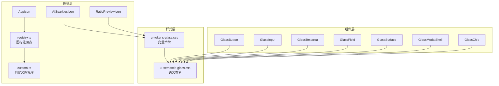
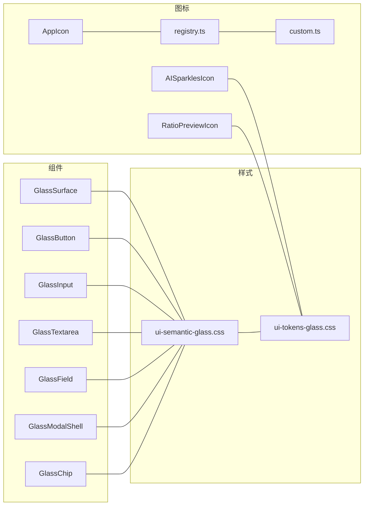
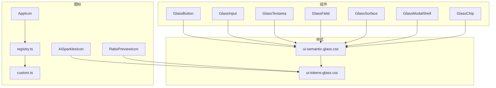

# 基础组件

<cite>
**本文引用的文件**
- [src/components/ui/primitives/index.ts](file://src/components/ui/primitives/index.ts)
- [src/components/ui/primitives/GlassButton.tsx](file://src/components/ui/primitives/GlassButton.tsx)
- [src/components/ui/primitives/GlassInput.tsx](file://src/components/ui/primitives/GlassInput.tsx)
- [src/components/ui/primitives/GlassTextarea.tsx](file://src/components/ui/primitives/GlassTextarea.tsx)
- [src/components/ui/primitives/GlassField.tsx](file://src/components/ui/primitives/GlassField.tsx)
- [src/components/ui/primitives/GlassSurface.tsx](file://src/components/ui/primitives/GlassSurface.tsx)
- [src/components/ui/primitives/GlassModalShell.tsx](file://src/components/ui/primitives/GlassModalShell.tsx)
- [src/components/ui/primitives/GlassChip.tsx](file://src/components/ui/primitives/GlassChip.tsx)
- [src/styles/ui-semantic-glass.css](file://src/styles/ui-semantic-glass.css)
- [src/styles/ui-tokens-glass.css](file://src/styles/ui-tokens-glass.css)
- [src/components/ui/icons/AppIcon.tsx](file://src/components/ui/icons/AppIcon.tsx)
- [src/components/ui/icons/registry.ts](file://src/components/ui/icons/registry.ts)
- [src/components/ui/icons/custom.tsx](file://src/components/ui/icons/custom.tsx)
- [src/components/ui/icons/AISparklesIcon.tsx](file://src/components/ui/icons/AISparklesIcon.tsx)
- [src/components/ui/icons/RatioPreviewIcon.tsx](file://src/components/ui/icons/RatioPreviewIcon.tsx)
</cite>

## 目录
1. [简介](#简介)
2. [项目结构](#项目结构)
3. [核心组件](#核心组件)
4. [架构总览](#架构总览)
5. [详细组件分析](#详细组件分析)
6. [依赖关系分析](#依赖关系分析)
7. [性能考量](#性能考量)
8. [故障排查指南](#故障排查指南)
9. [结论](#结论)
10. [附录](#附录)

## 简介
本文件面向 Waoowaoo 的基础 UI 组件，系统性梳理“玻璃拟态”设计体系下的核心组件：GlassButton、GlassInput、GlassModalShell、GlassSurface、GlassField、GlassTextarea、GlassChip，并配套图标系统与样式令牌。文档从设计理念、属性与事件、状态管理、样式定制、视觉原则到使用示例与最佳实践进行分层讲解，帮助开发者在不同场景下正确、一致地使用这些基础组件。

## 项目结构
基础组件位于 src/components/ui/primitives，样式位于 src/styles，图标系统位于 src/components/ui/icons。组件通过统一的导出入口集中暴露，样式通过 CSS 变量与语义类名实现主题化与密度控制。

图表来源
- [src/components/ui/primitives/GlassButton.tsx:1-67](file://src/components/ui/primitives/GlassButton.tsx#L1-L67)
- [src/components/ui/primitives/GlassInput.tsx:1-29](file://src/components/ui/primitives/GlassInput.tsx#L1-L29)
- [src/components/ui/primitives/GlassTextarea.tsx:1-29](file://src/components/ui/primitives/GlassTextarea.tsx#L1-L29)
- [src/components/ui/primitives/GlassField.tsx:1-50](file://src/components/ui/primitives/GlassField.tsx#L1-L50)
- [src/components/ui/primitives/GlassSurface.tsx:1-47](file://src/components/ui/primitives/GlassSurface.tsx#L1-L47)
- [src/components/ui/primitives/GlassModalShell.tsx:1-102](file://src/components/ui/primitives/GlassModalShell.tsx#L1-L102)
- [src/components/ui/primitives/GlassChip.tsx:1-43](file://src/components/ui/primitives/GlassChip.tsx#L1-L43)
- [src/styles/ui-semantic-glass.css:1-465](file://src/styles/ui-semantic-glass.css#L1-L465)
- [src/styles/ui-tokens-glass.css:1-96](file://src/styles/ui-tokens-glass.css#L1-L96)
- [src/components/ui/icons/AppIcon.tsx:1-15](file://src/components/ui/icons/AppIcon.tsx#L1-L15)
- [src/components/ui/icons/registry.ts:1-192](file://src/components/ui/icons/registry.ts#L1-L192)
- [src/components/ui/icons/custom.tsx:1-733](file://src/components/ui/icons/custom.tsx#L1-L733)
- [src/components/ui/icons/AISparklesIcon.tsx:1-23](file://src/components/ui/icons/AISparklesIcon.tsx#L1-L23)
- [src/components/ui/icons/RatioPreviewIcon.tsx:1-55](file://src/components/ui/icons/RatioPreviewIcon.tsx#L1-L55)

章节来源
- [src/components/ui/primitives/index.ts:1-21](file://src/components/ui/primitives/index.ts#L1-L21)

## 核心组件
本节概览各组件职责与通用能力：
- GlassSurface：容器型组件，负责玻璃拟态背景、边框、阴影、圆角、密度与交互动效。
- GlassButton：按钮组件，支持主次/幽灵/危险等变体、尺寸、加载态（结合任务状态呈现）、左右图标。
- GlassInput / GlassTextarea：输入与多行文本输入，支持紧凑/默认密度、占位提示、禁用态、错误态。
- GlassField：字段容器，封装标签、提示/错误文案、必填星号与右侧操作区。
- GlassModalShell：模态对话框外壳，支持标题/描述/页脚、尺寸、点击遮罩/ESC关闭、可选关闭按钮。
- GlassChip：信息展示与可选移除的标签式组件，支持多种语义色板。

章节来源
- [src/components/ui/primitives/GlassSurface.tsx:1-47](file://src/components/ui/primitives/GlassSurface.tsx#L1-L47)
- [src/components/ui/primitives/GlassButton.tsx:1-67](file://src/components/ui/primitives/GlassButton.tsx#L1-L67)
- [src/components/ui/primitives/GlassInput.tsx:1-29](file://src/components/ui/primitives/GlassInput.tsx#L1-L29)
- [src/components/ui/primitives/GlassTextarea.tsx:1-29](file://src/components/ui/primitives/GlassTextarea.tsx#L1-L29)
- [src/components/ui/primitives/GlassField.tsx:1-50](file://src/components/ui/primitives/GlassField.tsx#L1-L50)
- [src/components/ui/primitives/GlassModalShell.tsx:1-102](file://src/components/ui/primitives/GlassModalShell.tsx#L1-L102)
- [src/components/ui/primitives/GlassChip.tsx:1-43](file://src/components/ui/primitives/GlassChip.tsx#L1-L43)

## 架构总览
玻璃拟态组件的运行时架构由“组件 + 样式令牌 + 图标系统”三部分组成：
- 组件层：以函数组件形式实现，组合语义类名与 CSS 变量，保证主题一致性。
- 样式层：ui-tokens-glass.css 定义变量令牌，ui-semantic-glass.css 将令牌映射为语义类名，覆盖表面、边框、阴影、模糊、半径、密度、覆盖层、交互反馈等。
- 图标系统：AppIcon 通过 registry.ts 注册 lucide-react 与自定义图标，支持按名称动态渲染；AISparklesIcon 提供渐变色的动态渐变；RatioPreviewIcon 用于比例预览的视觉占位。

图表来源
- [src/styles/ui-tokens-glass.css:1-96](file://src/styles/ui-tokens-glass.css#L1-L96)
- [src/styles/ui-semantic-glass.css:1-465](file://src/styles/ui-semantic-glass.css#L1-L465)
- [src/components/ui/icons/AppIcon.tsx:1-15](file://src/components/ui/icons/AppIcon.tsx#L1-L15)
- [src/components/ui/icons/registry.ts:1-192](file://src/components/ui/icons/registry.ts#L1-L192)
- [src/components/ui/icons/custom.tsx:1-733](file://src/components/ui/icons/custom.tsx#L1-L733)
- [src/components/ui/icons/AISparklesIcon.tsx:1-23](file://src/components/ui/icons/AISparklesIcon.tsx#L1-L23)
- [src/components/ui/icons/RatioPreviewIcon.tsx:1-55](file://src/components/ui/icons/RatioPreviewIcon.tsx#L1-L55)

## 详细组件分析

### GlassSurface：玻璃容器
- 设计理念
  - 通过 backdrop-filter 模糊、低不透明度背景与柔和边框，营造“透光”“虚实相间”的视觉层次。
  - 支持面板、卡片、加高、模态四种变体，分别对应不同的背景、阴影与模糊强度。
  - 密度模式提供紧凑/默认两种缩放比例，适配不同信息密度场景。
  - 交互态提供轻微位移与阴影变化，增强可点击反馈。
- 关键属性
  - variant：panel | card | elevated | modal
  - density：compact | default
  - interactive：是否启用悬停动画
  - padded：是否启用内边距
  - className：扩展类名
- 样式定制
  - 通过 ui-tokens-glass.css 调整背景、边框、阴影、模糊半径、圆角与密度缩放。
  - 语义类名如 glass-surface、glass-surface-elevated、glass-surface-modal 控制外观。
- 使用建议
  - 在需要强调“轻薄”“通透”感的区域使用 panel/card；需要更强层级时使用 elevated/modal。
  - 与 GlassField/GlassInput 等组合时，优先设置 padded 以获得一致的内间距。

章节来源
- [src/components/ui/primitives/GlassSurface.tsx:1-47](file://src/components/ui/primitives/GlassSurface.tsx#L1-L47)
- [src/styles/ui-semantic-glass.css:6-31](file://src/styles/ui-semantic-glass.css#L6-L31)
- [src/styles/ui-tokens-glass.css:1-96](file://src/styles/ui-tokens-glass.css#L1-L96)

### GlassButton：玻璃按钮
- 设计理念
  - 主要提供 primary/secondary/ghost/danger 四种风格，配合渐变背景、阴影与过渡动效。
  - 支持 sm/md/lg 三种尺寸，紧凑与默认密度下的文字大小与行高。
  - loading 状态通过任务状态解析器生成，避免阻塞用户交互。
- 关键属性
  - variant：primary | secondary | ghost | danger
  - size：sm | md | lg
  - loading：布尔值，开启后禁用按钮并显示内部状态指示
  - iconLeft/iconRight：左侧/右侧图标节点
  - 其他原生 button 属性透传
- 事件与状态
  - disabled 与 loading 同时生效时按钮不可用。
  - 内部使用任务状态呈现组件显示加载态。
- 样式定制
  - 通过 glass-btn-* 类名与 ui-tokens-glass.css 中的 accent、focus-ring、danger 等变量控制外观。
- 最佳实践
  - 主要操作使用 primary；次要操作使用 secondary；危险操作使用 danger；无背景强调使用 ghost。
  - 需要强调的按钮搭配 hover 动画时，可结合 GlassSurface 的 interactive。

章节来源
- [src/components/ui/primitives/GlassButton.tsx:1-67](file://src/components/ui/primitives/GlassButton.tsx#L1-L67)
- [src/styles/ui-semantic-glass.css:114-228](file://src/styles/ui-semantic-glass.css#L114-L228)
- [src/styles/ui-tokens-glass.css:69-77](file://src/styles/ui-tokens-glass.css#L69-L77)

### GlassInput / GlassTextarea：输入与多行输入
- 设计理念
  - 采用低不透明背景、内嵌边框与聚焦环，确保在玻璃背景下具备清晰的边界与焦点反馈。
  - 支持 compact/default 密度，紧凑模式下更小的内边距与行高。
- 关键属性
  - density：compact | default
  - 其他原生 input/textarea 属性透传（如 onChange、value、placeholder、disabled、aria-invalid）
- 样式定制
  - 基类为 glass-input-base/glass-textarea-base，聚焦态、禁用态、错误态均有明确的视觉差异。
- 最佳实践
  - 表单字段建议配合 GlassField 使用，统一布局与辅助文案。
  - 错误态通过 aria-invalid 与样式联动，提升可访问性。

章节来源
- [src/components/ui/primitives/GlassInput.tsx:1-29](file://src/components/ui/primitives/GlassInput.tsx#L1-L29)
- [src/components/ui/primitives/GlassTextarea.tsx:1-29](file://src/components/ui/primitives/GlassTextarea.tsx#L1-L29)
- [src/styles/ui-semantic-glass.css:66-112](file://src/styles/ui-semantic-glass.css#L66-L112)

### GlassField：字段容器
- 设计理念
  - 将标签、必填星号、右侧操作区、输入控件与提示/错误文案统一组织，形成一致的字段布局。
- 关键属性
  - id：关联 label
  - label：字段标题
  - hint：提示文案
  - error：错误文案
  - required：是否必填
  - actions：右侧操作区（如“重试”“清空”等）
  - children：实际输入控件（如 GlassInput/GlassTextarea）
- 使用建议
  - 与 GlassInput/GlassTextarea 组合时，保持 label 与 hint/error 的一致性。
  - 必填字段自动添加红色星号，提升可读性。

章节来源
- [src/components/ui/primitives/GlassField.tsx:1-50](file://src/components/ui/primitives/GlassField.tsx#L1-L50)

### GlassModalShell：玻璃模态壳
- 设计理念
  - 以 Portal 形式挂载至 body，提供全屏遮罩与居中内容区，支持标题、描述、页脚与关闭按钮。
  - 支持点击遮罩关闭、ESC 关闭、尺寸控制与可选关闭按钮。
- 关键属性
  - open：是否显示
  - onClose：关闭回调
  - title/description/footer：标题、描述、页脚内容
  - size：sm | md | lg | xl
  - closeOnBackdrop/closeOnEsc/showCloseButton：交互行为开关
- 事件与状态
  - 打开时监听 ESC 键盘事件；点击遮罩或关闭按钮触发 onClose。
  - 仅在 open 且存在 document 时渲染。
- 样式定制
  - 遮罩使用 glass-overlay，内容区使用 glass-surface-modal。
- 最佳实践
  - 大体量内容优先使用 lg/xl；短提示使用 sm。
  - 重要确认类对话框建议保留关闭按钮与 ESC 关闭。

章节来源
- [src/components/ui/primitives/GlassModalShell.tsx:1-102](file://src/components/ui/primitives/GlassModalShell.tsx#L1-L102)
- [src/styles/ui-semantic-glass.css:24-31](file://src/styles/ui-semantic-glass.css#L24-L31)

### GlassChip：玻璃标签
- 设计理念
  - 用于展示状态、标签或简短信息，支持可选移除按钮与多种语义色板（neutral/info/success/warning/danger）。
- 关键属性
  - tone：neutral | info | success | warning | danger
  - icon：左侧图标
  - onRemove：移除回调（可选）
  - children：文本内容
- 最佳实践
  - 与 GlassButton 的 ghost 变体搭配，形成“可交互标签”体验。
  - 移除操作需提供无障碍标签（aria-label）。

章节来源
- [src/components/ui/primitives/GlassChip.tsx:1-43](file://src/components/ui/primitives/GlassChip.tsx#L1-L43)
- [src/styles/ui-semantic-glass.css:230-263](file://src/styles/ui-semantic-glass.css#L230-L263)

## 依赖关系分析
- 组件对样式的依赖
  - 所有组件均通过语义类名引用 ui-semantic-glass.css，后者依赖 ui-tokens-glass.css 中的 CSS 变量。
- 图标系统依赖
  - AppIcon 通过 registry.ts 解析名称到具体图标组件，registry.ts 合并自定义图标库 custom.ts 与 lucide-react。
  - AISparklesIcon 自带渐变定义，不依赖外部注册表。
  - RatioPreviewIcon 通过 CSS 变量与类名实现比例占位，不依赖外部图标。

图表来源
- [src/styles/ui-semantic-glass.css:1-465](file://src/styles/ui-semantic-glass.css#L1-L465)
- [src/styles/ui-tokens-glass.css:1-96](file://src/styles/ui-tokens-glass.css#L1-L96)
- [src/components/ui/icons/AppIcon.tsx:1-15](file://src/components/ui/icons/AppIcon.tsx#L1-L15)
- [src/components/ui/icons/registry.ts:1-192](file://src/components/ui/icons/registry.ts#L1-L192)
- [src/components/ui/icons/custom.tsx:1-733](file://src/components/ui/icons/custom.tsx#L1-L733)
- [src/components/ui/icons/AISparklesIcon.tsx:1-23](file://src/components/ui/icons/AISparklesIcon.tsx#L1-L23)
- [src/components/ui/icons/RatioPreviewIcon.tsx:1-55](file://src/components/ui/icons/RatioPreviewIcon.tsx#L1-L55)

## 性能考量
- 模糊与合成层
  - 模糊（backdrop-filter）在低端设备上可能带来性能压力，可通过 ui-tokens-glass.css 的 data-glass-preset="subtle" 降低模糊与阴影强度。
- 事件与渲染
  - GlassModalShell 使用 Portal 渲染，避免层级过深导致的重排；注意仅在 open 时渲染，减少无效 DOM。
  - GlassButton 的 loading 状态通过任务状态呈现组件显示，避免长耗时阻塞。
- 图标
  - AppIcon 通过注册表复用组件实例，减少重复创建；自定义图标数量较多时建议按需引入。

[本节为通用指导，无需列出章节来源]

## 故障排查指南
- 模态无法关闭
  - 检查 open 与 closeOnBackdrop/closeOnEsc 设置；确认事件绑定未被外部阻止。
  - 参考路径：[GlassModalShell:36-43](file://src/components/ui/primitives/GlassModalShell.tsx#L36-L43)
- 输入框无焦点态样式
  - 确认已应用 glass-input-base 或 glass-textarea-base；检查 aria-invalid 与禁用态类名是否冲突。
  - 参考路径：[ui-semantic-glass.css:91-112](file://src/styles/ui-semantic-glass.css#L91-L112)
- 图标不显示或报错
  - 检查 AppIcon 的 name 是否存在于 registry.ts；若不存在将抛出异常。
  - 参考路径：[AppIcon:8-14](file://src/components/ui/icons/AppIcon.tsx#L8-L14)，[registry.ts:78-192](file://src/components/ui/icons/registry.ts#L78-L192)
- 比例预览图标尺寸异常
  - 确保 ratio 字符串格式为“宽:高”，数值为正数；否则会抛出错误。
  - 参考路径：[RatioPreviewIcon:27-30](file://src/components/ui/icons/RatioPreviewIcon.tsx#L27-L30)

章节来源
- [src/components/ui/primitives/GlassModalShell.tsx:36-43](file://src/components/ui/primitives/GlassModalShell.tsx#L36-L43)
- [src/styles/ui-semantic-glass.css:91-112](file://src/styles/ui-semantic-glass.css#L91-L112)
- [src/components/ui/icons/AppIcon.tsx:8-14](file://src/components/ui/icons/AppIcon.tsx#L8-L14)
- [src/components/ui/icons/registry.ts:78-192](file://src/components/ui/icons/registry.ts#L78-L192)
- [src/components/ui/icons/RatioPreviewIcon.tsx:27-30](file://src/components/ui/icons/RatioPreviewIcon.tsx#L27-L30)

## 结论
Waoowaoo 的玻璃拟态基础组件以“语义类名 + CSS 变量”的方式实现了高度一致的主题与可定制性。通过 GlassSurface/GlassButton/GlassInput/GlassTextarea/GlassField/GlassModalShell/GlassChip 的组合，可在不同场景下快速搭建一致、美观且可访问的界面。图标系统通过注册表与自定义库实现灵活扩展，满足多样化视觉表达需求。

[本节为总结，无需列出章节来源]

## 附录

### 视觉设计原则与样式定制要点
- 透明度与模糊
  - 使用 ui-tokens-glass.css 中的背景与模糊变量控制透明度与模糊半径；在性能敏感环境可切换 subtle 预设。
- 边框与阴影
  - 通过 stroke 与 shadow 变量统一控制边框强度与阴影层级；不同变体（panel/elevated/modal）对应不同强度。
- 圆角与密度
  - radius 变量统一圆角；density 缩放影响整体尺寸与间距。
- 交互反馈
  - hover 与 focus ring 通过语义类名与变量控制，确保可访问性与一致性。

章节来源
- [src/styles/ui-tokens-glass.css:1-96](file://src/styles/ui-tokens-glass.css#L1-L96)
- [src/styles/ui-semantic-glass.css:1-465](file://src/styles/ui-semantic-glass.css#L1-L465)

### 图标系统实现与自定义注册
- 动态图标渲染
  - AppIcon 接收 name，从 registry.ts 查找对应组件并渲染；未找到时抛出错误。
- 自定义图标注册
  - 在 custom.ts 中新增自定义 SVG 节点并导出组件，随后在 registry.ts 的 iconRegistry 中合并。
- 渐变图标
  - AISparklesIcon 内置渐变定义，适合强调性场景。
- 比例预览图标
  - RatioPreviewIcon 通过 CSS 变量与类名实现比例占位，适合媒体选择场景。

章节来源
- [src/components/ui/icons/AppIcon.tsx:1-15](file://src/components/ui/icons/AppIcon.tsx#L1-L15)
- [src/components/ui/icons/registry.ts:1-192](file://src/components/ui/icons/registry.ts#L1-L192)
- [src/components/ui/icons/custom.tsx:1-733](file://src/components/ui/icons/custom.tsx#L1-L733)
- [src/components/ui/icons/AISparklesIcon.tsx:1-23](file://src/components/ui/icons/AISparklesIcon.tsx#L1-L23)
- [src/components/ui/icons/RatioPreviewIcon.tsx:1-55](file://src/components/ui/icons/RatioPreviewIcon.tsx#L1-L55)