# 模型下拉组件

<cite>
**本文档引用的文件**
- [model-dropdown-innovative.tsx](file://src/components/ui/model-dropdown-innovative.tsx)
- [model-dropdown-ios.tsx](file://src/components/ui/model-dropdown-ios.tsx)
- [model-dropdown-variants.tsx](file://src/components/ui/model-dropdown-variants.tsx)
- [select-variants.tsx](file://src/components/ui/select-variants.tsx)
- [ModelCapabilityDropdown.tsx](file://src/components/ui/config-modals/ModelCapabilityDropdown.tsx)
- [model-config-contract.ts](file://src/lib/model-config-contract.ts)
- [page.tsx](file://src/app/[locale]/dev/segmented-control-test/page.tsx)
</cite>

## 目录
1. [简介](#简介)
2. [项目结构](#项目结构)
3. [核心组件](#核心组件)
4. [架构概览](#架构概览)
5. [详细组件分析](#详细组件分析)
6. [依赖关系分析](#依赖关系分析)
7. [性能考虑](#性能考虑)
8. [故障排除指南](#故障排除指南)
9. [结论](#结论)

## 简介

Waoowaoo项目的模型下拉选择组件是一套完整的AI模型选择解决方案，提供了多种风格的UI变体来满足不同的设计需求。该组件系统包含了三种主要的组件类型：创新风格（Innovative）、iOS风格（IOS）和通用变体（Variants），每种风格都有其独特的设计理念和使用场景。

这些组件的核心功能包括：
- 动态模型数据源管理
- 实时参数过滤和选择
- 用户选择反馈机制
- AI模型的动态加载和状态更新
- 多种界面布局适配方案
- 样式定制选项和主题支持

## 项目结构

模型下拉组件位于项目的UI组件目录中，采用模块化设计，每个组件都独立封装并遵循统一的接口规范。

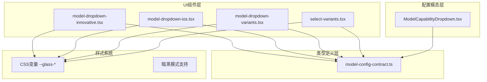

**图表来源**
- [model-dropdown-innovative.tsx:1-588](file://src/components/ui/model-dropdown-innovative.tsx#L1-L588)
- [model-dropdown-ios.tsx:1-367](file://src/components/ui/model-dropdown-ios.tsx#L1-L367)
- [model-dropdown-variants.tsx:1-543](file://src/components/ui/model-dropdown-variants.tsx#L1-L543)
- [select-variants.tsx:1-450](file://src/components/ui/select-variants.tsx#L1-L450)

**章节来源**
- [model-dropdown-innovative.tsx:1-588](file://src/components/ui/model-dropdown-innovative.tsx#L1-L588)
- [model-dropdown-ios.tsx:1-367](file://src/components/ui/model-dropdown-ios.tsx#L1-L367)
- [model-dropdown-variants.tsx:1-543](file://src/components/ui/model-dropdown-variants.tsx#L1-L543)
- [select-variants.tsx:1-450](file://src/components/ui/select-variants.tsx#L1-L450)

## 核心组件

### 组件架构设计

所有模型下拉组件都遵循统一的接口规范，确保组件间的互操作性和一致性：

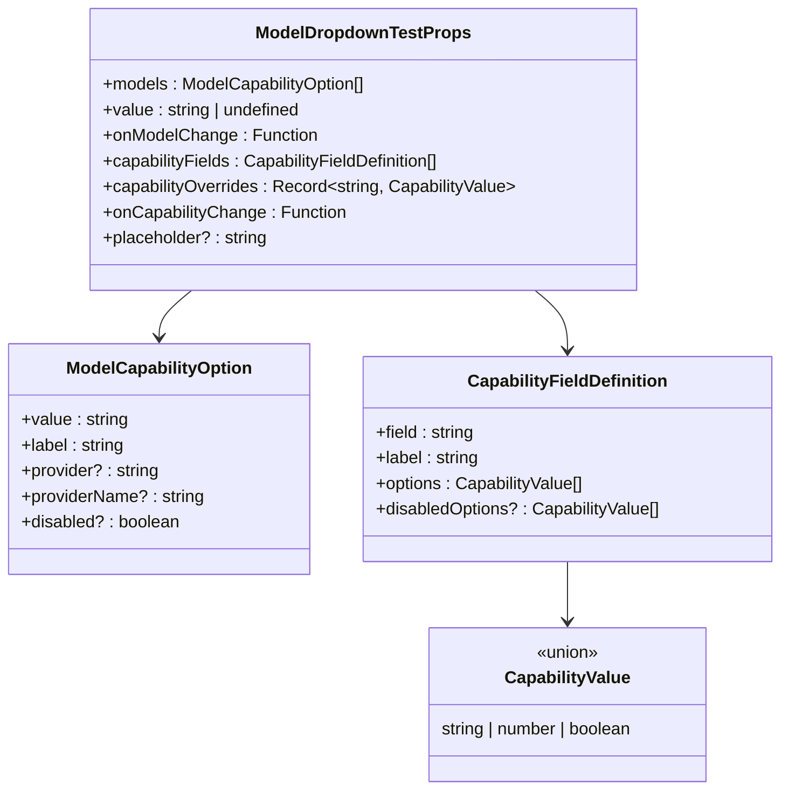

**图表来源**
- [ModelCapabilityDropdown.tsx:21-71](file://src/components/ui/config-modals/ModelCapabilityDropdown.tsx#L21-L71)
- [model-config-contract.ts:1-528](file://src/lib/model-config-contract.ts#L1-L528)

### 数据流架构

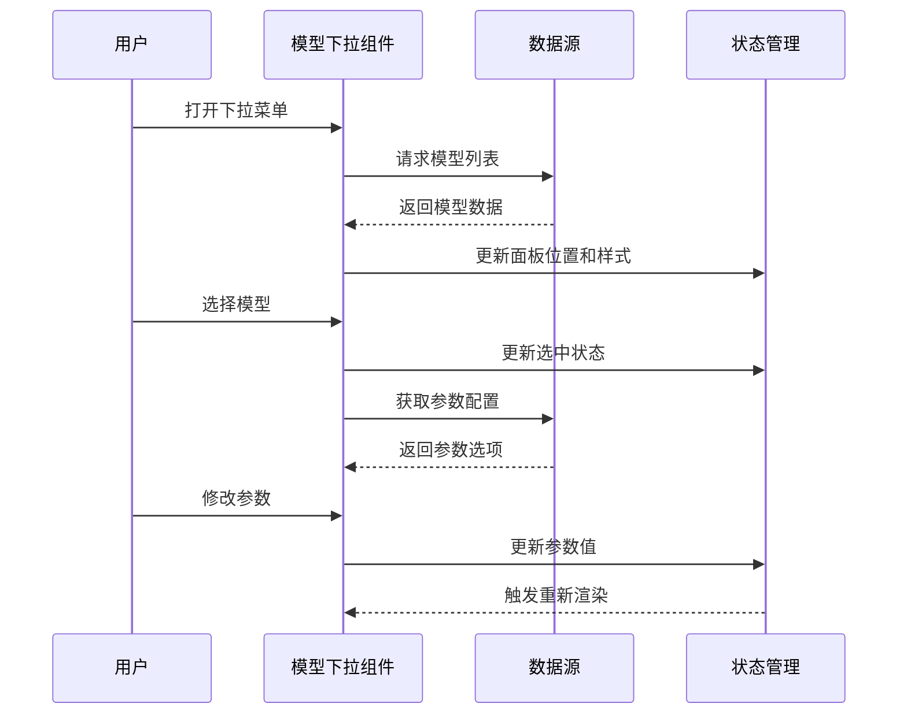

**图表来源**
- [model-dropdown-innovative.tsx:21-84](file://src/components/ui/model-dropdown-innovative.tsx#L21-L84)
- [model-dropdown-ios.tsx:22-79](file://src/components/ui/model-dropdown-ios.tsx#L22-L79)

**章节来源**
- [ModelCapabilityDropdown.tsx:1-454](file://src/components/ui/config-modals/ModelCapabilityDropdown.tsx#L1-L454)
- [model-config-contract.ts:1-528](file://src/lib/model-config-contract.ts#L1-L528)

## 架构概览

### 组件层次结构

```mermaid
graph TD
subgraph "创新风格组件"
A1[V6: 分割工具栏]
A2[V7: 内联画布展开]
A3[V8: 专业居中模态]
A4[V9: 深潜弹出层]
A5[V10: 底部抽屉]
end
subgraph "iOS风格组件"
B1[Variant1: 深玻璃辉光]
B2[Variant2: 左侧指示线]
B3[Variant3: 融合变体]
B4[Variant4: 药丸激活标记]
B5[Variant5: 下划线辉光]
end
subgraph "通用变体组件"
C1[Variant1: 苹果iOS分段控制]
C2[Variant2: 极简技术无框]
C3[Variant3: 彩虹/活泼流动]
C4[Variant4: 卡片覆盖]
C5[Variant5: 超极简内联平面]
end
subgraph "基础选择组件"
D1[SelectVariantCard: 卡片风格]
D2[SelectVariantMinimal: 极简线条]
D3[SelectVariantGhost: 幽灵轻量]
end
A1 --> A2
A2 --> A3
A3 --> A4
A4 --> A5
B1 --> B2
B2 --> B3
B3 --> B4
B4 --> B5
C1 --> C2
C2 --> C3
C3 --> C4
C4 --> C5
D1 --> D2
D2 --> D3
```

**图表来源**
- [model-dropdown-innovative.tsx:99-587](file://src/components/ui/model-dropdown-innovative.tsx#L99-L587)
- [model-dropdown-ios.tsx:137-366](file://src/components/ui/model-dropdown-ios.tsx#L137-L366)
- [model-dropdown-variants.tsx:92-542](file://src/components/ui/model-dropdown-variants.tsx#L92-L542)
- [select-variants.tsx:32-449](file://src/components/ui/select-variants.tsx#L32-L449)

### 样式系统架构

组件采用统一的CSS变量系统，支持深色模式和主题定制：

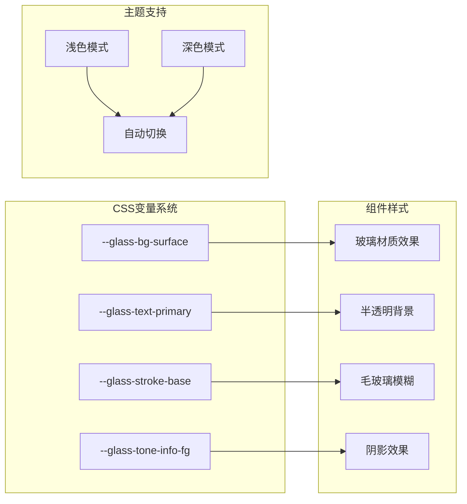

**图表来源**
- [model-dropdown-innovative.tsx:110-188](file://src/components/ui/model-dropdown-innovative.tsx#L110-L188)
- [model-dropdown-ios.tsx:144-174](file://src/components/ui/model-dropdown-ios.tsx#L144-L174)
- [model-dropdown-variants.tsx:120-171](file://src/components/ui/model-dropdown-variants.tsx#L120-L171)

**章节来源**
- [model-dropdown-innovative.tsx:1-588](file://src/components/ui/model-dropdown-innovative.tsx#L1-L588)
- [model-dropdown-ios.tsx:1-367](file://src/components/ui/model-dropdown-ios.tsx#L1-L367)
- [model-dropdown-variants.tsx:1-543](file://src/components/ui/model-dropdown-variants.tsx#L1-L543)

## 详细组件分析

### 创新风格组件 (Innovative)

创新风格组件专注于提供丰富的交互体验和视觉效果，包含五个主要版本：

#### V6: 分割工具栏风格

这种风格将传统的单一分组下拉菜单分解为两个独立的上下文操作，避免了大型弹出层的使用。

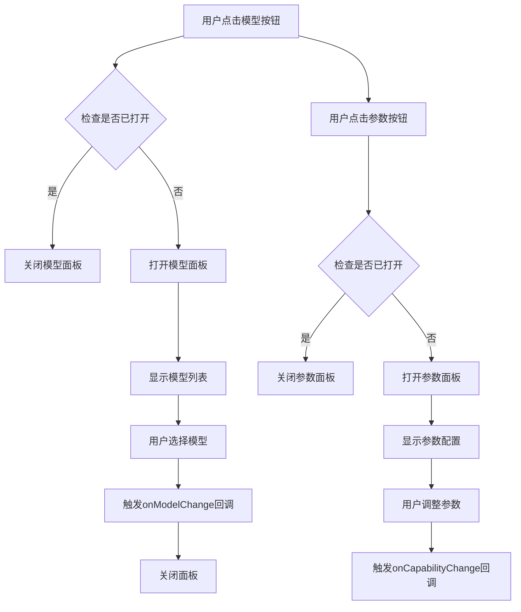

**图表来源**
- [model-dropdown-innovative.tsx:99-189](file://src/components/ui/model-dropdown-innovative.tsx#L99-L189)

#### V7: 内联画布展开风格

这种风格采用内联展开的方式，不会遮挡页面内容，非常适合表单向导等场景。

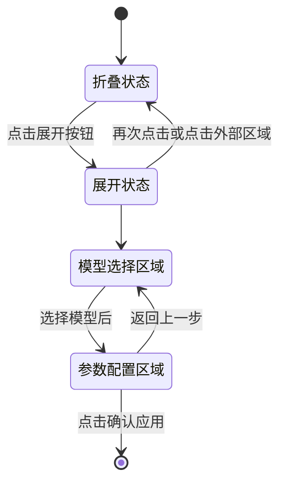

**图表来源**
- [model-dropdown-innovative.tsx:195-276](file://src/components/ui/model-dropdown-innovative.tsx#L195-L276)

#### V8: 专业居中模态风格

采用左右布局的专业模态对话框，提供宽敞、无干扰的编辑环境。

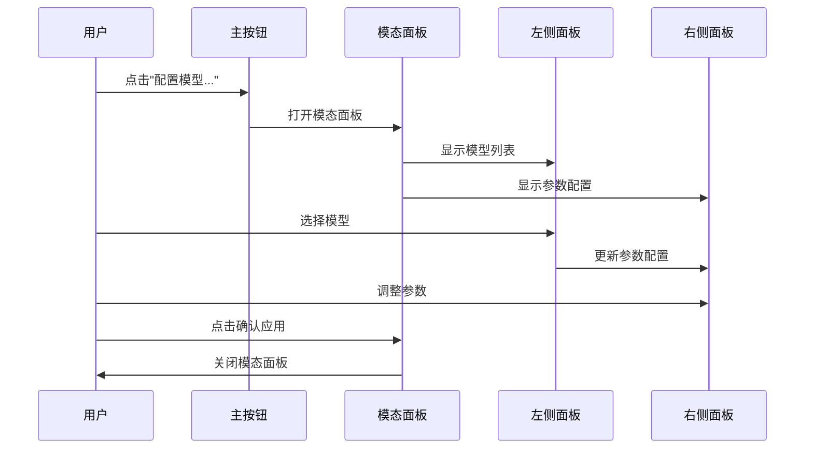

**图表来源**
- [model-dropdown-innovative.tsx:282-380](file://src/components/ui/model-dropdown-innovative.tsx#L282-L380)

**章节来源**
- [model-dropdown-innovative.tsx:99-587](file://src/components/ui/model-dropdown-innovative.tsx#L99-L587)

### iOS风格组件 (IOS)

iOS风格组件专注于简洁和优雅的设计，包含五个精心设计的变体：

#### Variant1: 深玻璃辉光风格

继承了经典的玻璃材质效果，采用去背景化的文字发光设计。

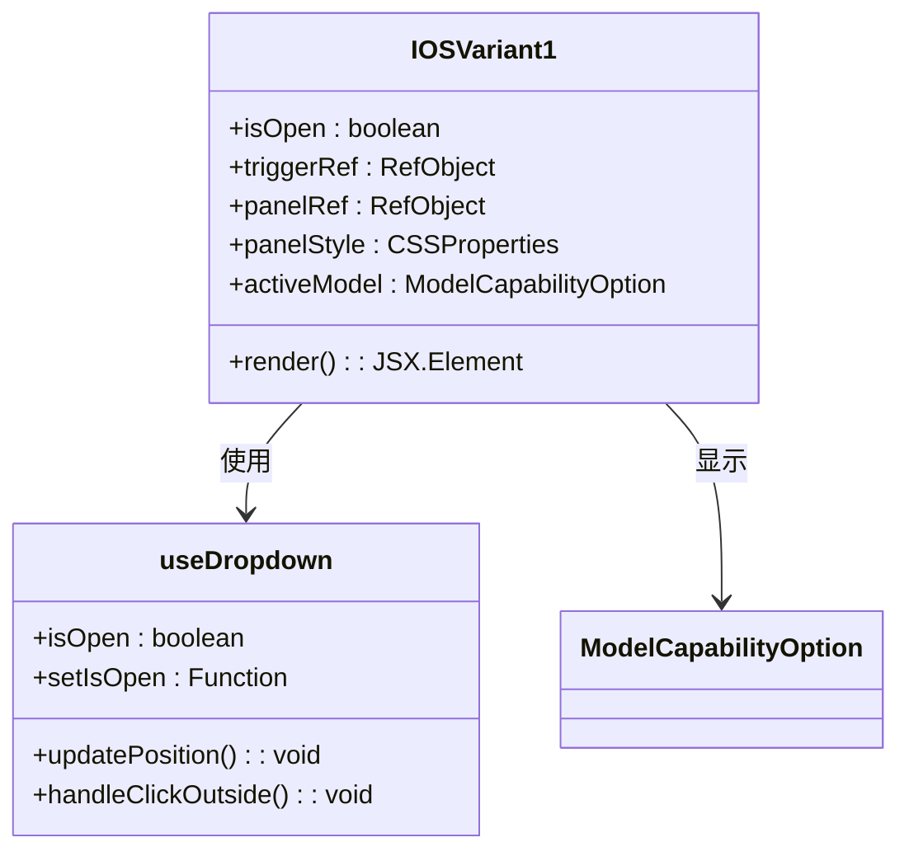

**图表来源**
- [model-dropdown-ios.tsx:137-175](file://src/components/ui/model-dropdown-ios.tsx#L137-L175)

#### Variant2: 左侧指示线风格

继承了经典的左侧工业级边框设计，提供清晰的视觉引导。

#### Variant3: 融合变体风格

结合了左侧指示线和文字发光的完美融合，创造出独特的视觉效果。

#### Variant4: 药丸激活标记风格

将左侧指示线简化为一个精致的前置小药丸胶囊标记。

#### Variant5: 下划线辉光风格

在保留辉光特性的前提下，将左侧指示器转移到内嵌胶囊底部的下划线设计。

**章节来源**
- [model-dropdown-ios.tsx:137-366](file://src/components/ui/model-dropdown-ios.tsx#L137-L366)

### 通用变体组件 (Variants)

通用变体组件提供了更广泛的样式选择，包含五个不同风格的变体：

#### Variant1: 苹果iOS分段控制风格

干净的白色/玻璃材质，分段参数设计，极其圆润的边角。

#### Variant2: 极简技术无框风格

锐利、细边框，悬停状态非常微妙，专注于排版。

#### Variant3: 彩虹/活泼流动风格

具有轻微强调颜色的高级AI感觉，提供充足的填充空间。

#### Variant4: 卡片覆盖风格

类似于原始照片，但经过精心改进的双色调顶部和底部设计。

#### Variant5: 超极简内联平面风格

参数字段没有明确的框线，无缝的文档般感觉。

**章节来源**
- [model-dropdown-variants.tsx:92-542](file://src/components/ui/model-dropdown-variants.tsx#L92-L542)

### 基础选择组件 (Select Variants)

除了专门的模型下拉组件外，还提供了通用的选择组件变体：

#### SelectVariantCard: 卡片风格

最接近"默认模型配置"卡片的经典风格，四周有饱满的边框与微弱底色。

#### SelectVariantMinimal: 极简线条风格

底部细线风格，适用于表单密集的区域，突出内容而非边框。

#### SelectVariantGhost: 幽灵轻量风格

背景透明，只有hover态有色块，适合用于工具栏、筛选器等紧凑小巧的场景。

**章节来源**
- [select-variants.tsx:32-449](file://src/components/ui/select-variants.tsx#L32-L449)

## 依赖关系分析

### 类型系统依赖

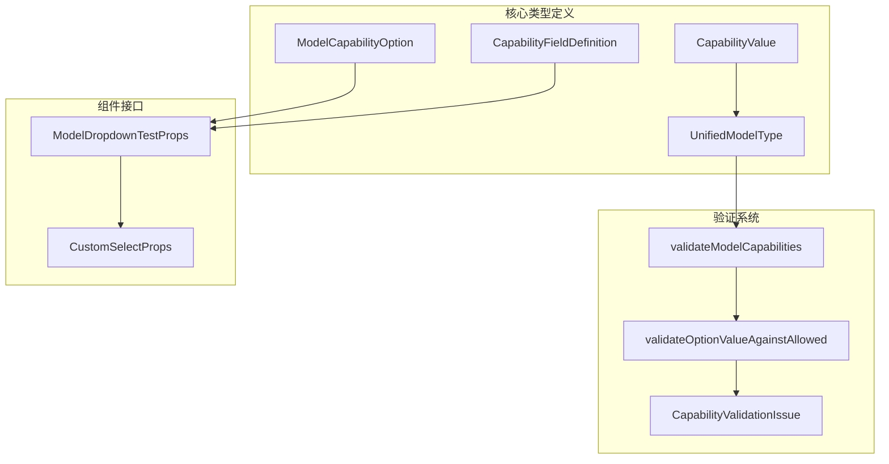

**图表来源**
- [model-config-contract.ts:1-528](file://src/lib/model-config-contract.ts#L1-L528)
- [ModelCapabilityDropdown.tsx:21-71](file://src/components/ui/config-modals/ModelCapabilityDropdown.tsx#L21-L71)

### 组件间依赖关系

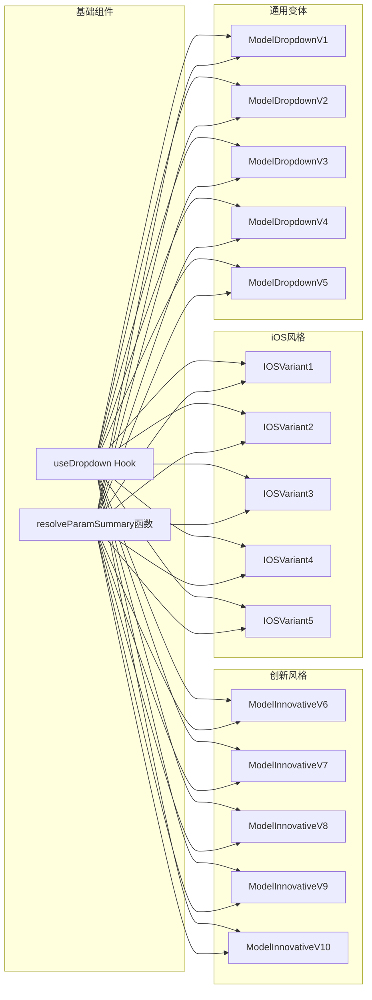

**图表来源**
- [model-dropdown-innovative.tsx:21-86](file://src/components/ui/model-dropdown-innovative.tsx#L21-L86)
- [model-dropdown-ios.tsx:22-86](file://src/components/ui/model-dropdown-ios.tsx#L22-L86)
- [model-dropdown-variants.tsx:21-86](file://src/components/ui/model-dropdown-variants.tsx#L21-L86)

**章节来源**
- [model-config-contract.ts:1-528](file://src/lib/model-config-contract.ts#L1-L528)
- [ModelCapabilityDropdown.tsx:1-454](file://src/components/ui/config-modals/ModelCapabilityDropdown.tsx#L1-L454)

## 性能考虑

### 渲染优化策略

1. **虚拟滚动**: 对于大量模型选项的情况，可以实现虚拟滚动来减少DOM节点数量
2. **防抖处理**: 参数变更时使用防抖机制，避免频繁的状态更新
3. **懒加载**: 模型数据可以按需加载，减少初始渲染时间
4. **记忆化**: 使用React.memo和useMemo优化重渲染

### 内存管理

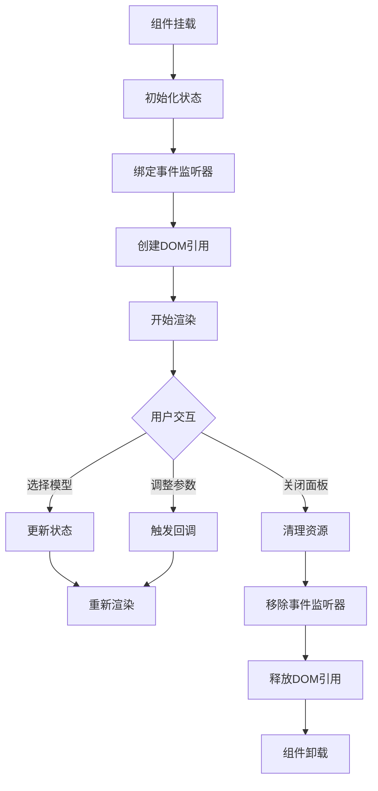

**图表来源**
- [model-dropdown-innovative.tsx:61-84](file://src/components/ui/model-dropdown-innovative.tsx#L61-L84)

### 用户体验优化

1. **加载状态**: 提供加载指示器，改善用户体验
2. **错误处理**: 实现健壮的错误处理机制
3. **键盘导航**: 支持键盘快捷键操作
4. **无障碍访问**: 确保组件符合WCAG标准

## 故障排除指南

### 常见问题及解决方案

#### 问题1: 面板位置异常
**症状**: 下拉面板出现在错误的位置或超出视口边界
**解决方案**: 检查VIEWPORT_EDGE_GAP常量设置，确保updatePosition函数正确计算位置

#### 问题2: 点击外部不关闭
**症状**: 点击组件外部区域无法关闭下拉面板
**解决方案**: 验证handleClickOutside事件监听器的实现

#### 问题3: 参数配置不生效
**症状**: 修改参数后状态没有更新
**解决方案**: 检查onCapabilityChange回调函数的实现和参数传递

#### 问题4: 样式不匹配
**症状**: 组件样式与预期不符
**解决方案**: 验证CSS变量的使用和主题切换逻辑

**章节来源**
- [model-dropdown-innovative.tsx:56-84](file://src/components/ui/model-dropdown-innovative.tsx#L56-L84)
- [model-dropdown-ios.tsx:56-79](file://src/components/ui/model-dropdown-ios.tsx#L56-L79)
- [model-dropdown-variants.tsx:55-78](file://src/components/ui/model-dropdown-variants.tsx#L55-L78)

## 结论

Waoowaoo项目的模型下拉组件系统展现了高度的模块化设计和丰富的视觉表现力。通过提供多种风格的组件变体，开发者可以根据具体的应用场景和设计需求选择最适合的组件。

### 设计优势

1. **统一接口**: 所有组件遵循相同的接口规范，便于集成和维护
2. **灵活布局**: 支持多种布局方式，适应不同的界面设计需求
3. **主题兼容**: 完善的CSS变量系统支持深色模式和主题定制
4. **性能优化**: 采用多种优化策略确保良好的用户体验
5. **扩展性强**: 模块化设计便于添加新的组件变体和功能

### 使用建议

1. **选择合适的风格**: 根据应用的整体设计风格选择最匹配的组件变体
2. **合理配置参数**: 根据AI模型的特点合理配置参数选项
3. **关注性能**: 在大量数据的情况下考虑使用虚拟滚动等优化策略
4. **测试兼容性**: 确保组件在不同设备和浏览器上的兼容性

这套组件系统为AI应用的模型选择功能提供了完整而优雅的解决方案，既保证了功能性，又兼顾了美观性和用户体验。