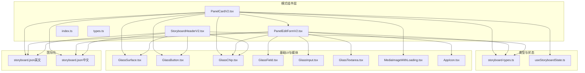
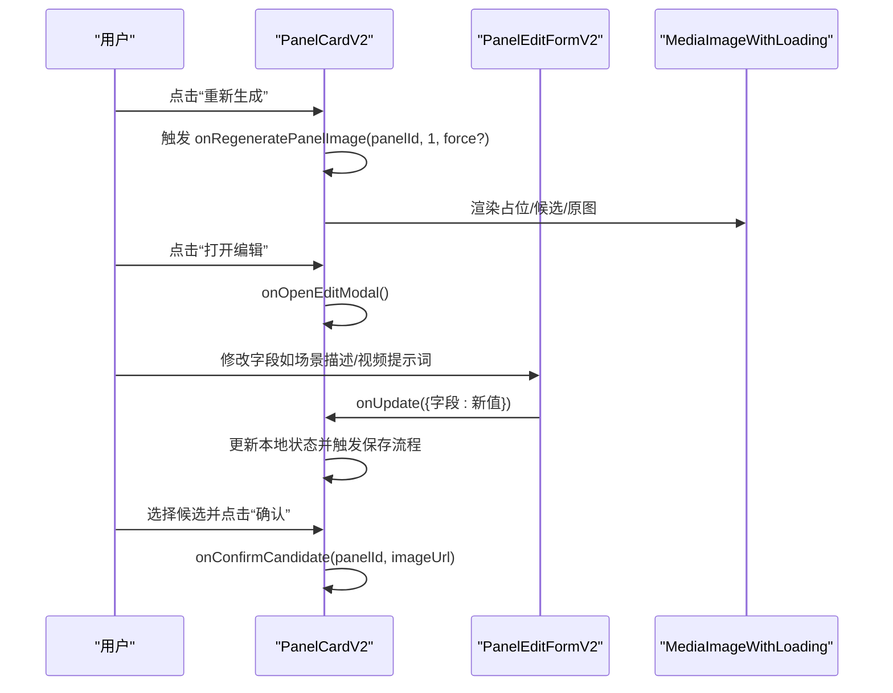
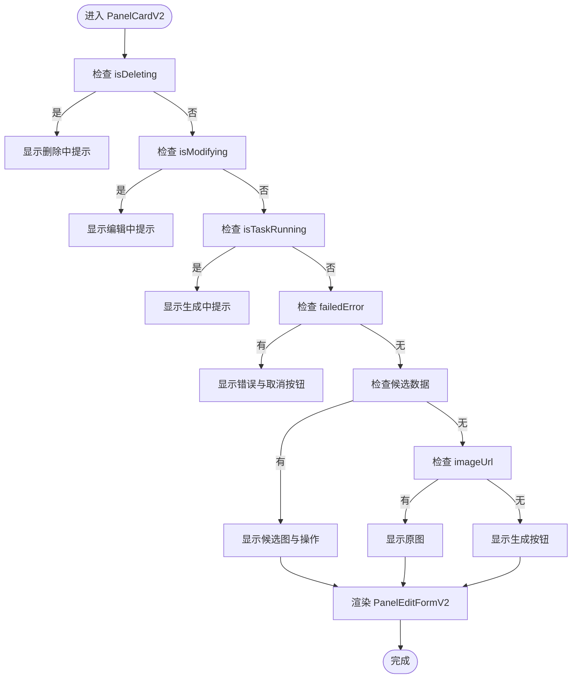
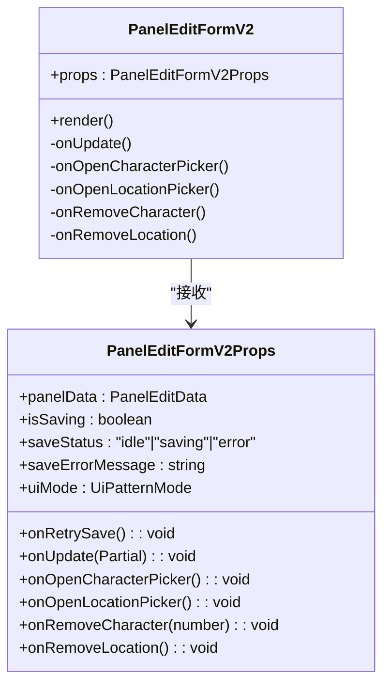
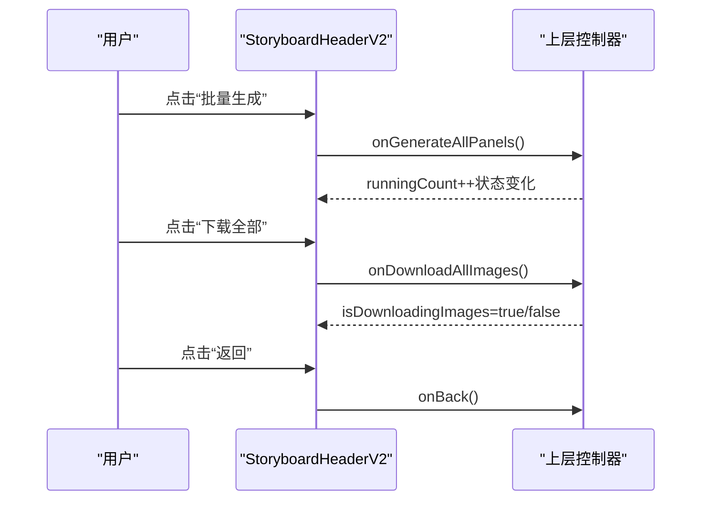
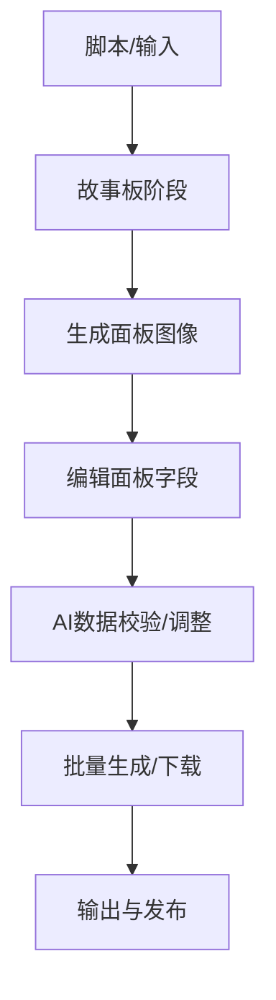
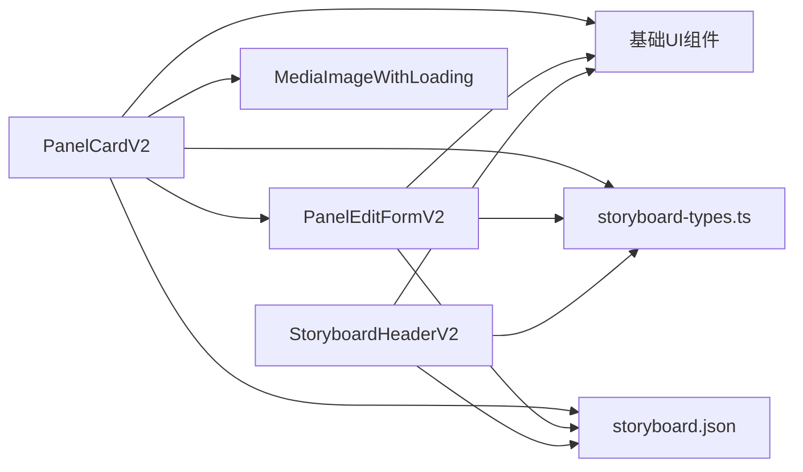

# 模式组件

<cite>
**本文引用的文件**
- [PanelCardV2.tsx](file://src/components/ui/patterns/PanelCardV2.tsx)
- [PanelEditFormV2.tsx](file://src/components/ui/patterns/PanelEditFormV2.tsx)
- [StoryboardHeaderV2.tsx](file://src/components/ui/patterns/StoryboardHeaderV2.tsx)
- [types.ts](file://src/components/ui/patterns/types.ts)
- [index.ts](file://src/components/ui/patterns/index.ts)
- [PanelEditForm.tsx](file://src/app/[locale]/workspace/[projectId]/modes/novel-promotion/components/PanelEditForm.tsx)
- [storyboard-types.ts](file://src/types/storyboard-types.ts)
- [useStoryboardState.ts](file://src/app/[locale]/workspace/[projectId]/modes/novel-promotion/components/storyboard/hooks/useStoryboardState.ts)
- [MediaImageWithLoading.tsx](file://src/components/media/MediaImageWithLoading.tsx)
- [GlassSurface.tsx](file://src/components/ui/primitives/GlassSurface.tsx)
- [GlassButton.tsx](file://src/components/ui/primitives/GlassButton.tsx)
- [GlassChip.tsx](file://src/components/ui/primitives/GlassChip.tsx)
- [GlassField.tsx](file://src/components/ui/primitives/GlassField.tsx)
- [GlassInput.tsx](file://src/components/ui/primitives/GlassInput.tsx)
- [GlassTextarea.tsx](file://src/components/ui/primitives/GlassTextarea.tsx)
- [AppIcon.tsx](file://src/components/ui/icons/AppIcon.tsx)
- [storyboard.json（英文）](file://messages/en/storyboard.json)
- [storyboard.json（中文）](file://messages/zh/storyboard.json)
</cite>

## 目录
1. [简介](#简介)
2. [项目结构](#项目结构)
3. [核心组件](#核心组件)
4. [架构总览](#架构总览)
5. [详细组件分析](#详细组件分析)
6. [依赖关系分析](#依赖关系分析)
7. [性能考量](#性能考量)
8. [故障排查指南](#故障排查指南)
9. [结论](#结论)
10. [附录](#附录)

## 简介
本文件聚焦于Waoowaoo中“模式组件”体系，围绕专门用于小说推广工作流的复合UI模式进行系统化技术说明。重点覆盖以下组件：
- PanelCardV2：面板卡片模式，负责单个分镜面板的图像展示与编辑表单封装
- PanelEditFormV2：面板编辑表单模式，承载镜头类型、场景描述、视频提示词、角色与地点等字段的输入与交互
- StoryboardHeaderV2：故事板头部导航与批量操作模式，提供统计信息与批量生成/下载能力

这些组件通过清晰的属性接口、事件回调与状态管理，将复杂业务逻辑与UI状态进行解耦，形成可配置、可复用、可扩展的模式层。

## 项目结构
模式组件位于统一的模式目录下，并通过导出索引集中暴露给上层使用；同时与故事板工作流、类型定义、媒体组件及i18n消息紧密协作。

图表来源
- [PanelCardV2.tsx:1-184](file://src/components/ui/patterns/PanelCardV2.tsx#L1-L184)
- [PanelEditFormV2.tsx:1-169](file://src/components/ui/patterns/PanelEditFormV2.tsx#L1-L169)
- [StoryboardHeaderV2.tsx:1-80](file://src/components/ui/patterns/StoryboardHeaderV2.tsx#L1-L80)
- [index.ts:1-11](file://src/components/ui/patterns/index.ts#L1-L11)
- [types.ts:1-2](file://src/components/ui/patterns/types.ts#L1-L2)
- [storyboard-types.ts](file://src/types/storyboard-types.ts)
- [useStoryboardState.ts](file://src/app/[locale]/workspace/[projectId]/modes/novel-promotion/components/storyboard/hooks/useStoryboardState.ts)
- [MediaImageWithLoading.tsx](file://src/components/media/MediaImageWithLoading.tsx)
- [GlassSurface.tsx](file://src/components/ui/primitives/GlassSurface.tsx)
- [GlassButton.tsx](file://src/components/ui/primitives/GlassButton.tsx)
- [GlassChip.tsx](file://src/components/ui/primitives/GlassChip.tsx)
- [GlassField.tsx](file://src/components/ui/primitives/GlassField.tsx)
- [GlassInput.tsx](file://src/components/ui/primitives/GlassInput.tsx)
- [GlassTextarea.tsx](file://src/components/ui/primitives/GlassTextarea.tsx)
- [AppIcon.tsx](file://src/components/ui/icons/AppIcon.tsx)
- [storyboard.json（英文）](file://messages/en/storyboard.json)
- [storyboard.json（中文）](file://messages/zh/storyboard.json)

章节来源
- [index.ts:1-11](file://src/components/ui/patterns/index.ts#L1-L11)
- [types.ts:1-2](file://src/components/ui/patterns/types.ts#L1-L2)

## 核心组件
本节对三个模式组件进行要点梳理，突出其职责边界、数据绑定与事件处理机制。

- PanelCardV2
  - 职责：聚合面板图像区与编辑表单区，统一处理加载、失败、候选选择、任务运行等状态；向下委派编辑与AI数据查看入口
  - 关键属性：面板数据、面板编辑数据、图片URL、全局序号、保存/删除/修改/任务运行状态、错误信息、候选集与选中索引、回调函数集合
  - 关键行为：根据状态渲染占位图/候选图/原图；提供批量按钮（重新生成、打开编辑、打开AI数据）；支持候选切换与确认
- PanelEditFormV2
  - 职责：以表单形式承载镜头类型、摄像机运动、场景描述、视频提示词、地点与角色等字段的输入与展示
  - 关键属性：面板编辑数据、保存状态/错误信息、回调（更新、打开拾取器、移除角色/地点、重试保存）
  - 关键行为：字段级受控输入；地点/角色以可移除标签展示；保存中/错误态反馈；编辑图标触发外部拾取器
- StoryboardHeaderV2
  - 职责：故事板头部导航与批量操作，提供段落数/面板数统计、并发限制、待生成面板计数、批量生成/下载/返回等能力
  - 关键属性：段落数、面板总数、是否正在下载/批量提交、运行中/待生成计数、回调集合
  - 关键行为：根据运行状态动态显示生成中指示；根据待生成数量决定是否启用批量生成；下载/返回按钮禁用条件控制

章节来源
- [PanelCardV2.tsx:16-41](file://src/components/ui/patterns/PanelCardV2.tsx#L16-L41)
- [PanelEditFormV2.tsx:14-26](file://src/components/ui/patterns/PanelEditFormV2.tsx#L14-L26)
- [StoryboardHeaderV2.tsx:7-18](file://src/components/ui/patterns/StoryboardHeaderV2.tsx#L7-L18)

## 架构总览
模式组件采用“容器-展示”分层与“组合模式”设计：
- 容器层：PanelCardV2作为面板卡片容器，负责状态聚合与子组件编排
- 展示层：PanelEditFormV2专注表单展示与输入；StoryboardHeaderV2专注头部导航与批量操作
- 组合模式：容器通过属性向下传递数据与回调，子组件通过回调向上触发动作，形成自上而下的数据流与自下而上的事件流

图表来源
- [PanelCardV2.tsx:33-37](file://src/components/ui/patterns/PanelCardV2.tsx#L33-L37)
- [PanelEditFormV2.tsx:20-25](file://src/components/ui/patterns/PanelEditFormV2.tsx#L20-L25)
- [MediaImageWithLoading.tsx](file://src/components/media/MediaImageWithLoading.tsx)

## 详细组件分析

### PanelCardV2 分析
- 设计要点
  - 状态驱动渲染：根据 isDeleting/isModifying/isTaskRunning/failedError/candidateData/imageUrl 决定不同视图分支
  - 候选选择：支持多候选预览与确认，提供取消与索引切换
  - 行为按钮：重新生成、打开编辑、打开AI数据、删除等
  - 表单集成：底部嵌入 PanelEditFormV2，实现“图像+表单”的一体化卡片
- 数据绑定
  - 面板数据：StoryboardPanel 类型，包含 shot_type 等元信息
  - 编辑数据：PanelEditData 类型，包含 shotType、cameraMove、description、videoPrompt、characters、location 等
  - 候选数据：PanelCandidateData，包含 candidates 与 selectedIndex
- 事件处理
  - 回调接口覆盖：保存、删除、打开拾取器、移除角色/地点、重新生成、打开编辑/AI数据、候选选择/确认/取消、清错
- 复杂度与性能
  - 渲染分支较多，建议在上层通过状态合并减少重渲染
  - 候选预览与确认涉及异步任务，需结合任务状态防抖

图表来源
- [PanelCardV2.tsx:75-182](file://src/components/ui/patterns/PanelCardV2.tsx#L75-L182)

章节来源
- [PanelCardV2.tsx:16-41](file://src/components/ui/patterns/PanelCardV2.tsx#L16-L41)
- [PanelCardV2.tsx:43-182](file://src/components/ui/patterns/PanelCardV2.tsx#L43-L182)
- [PanelEditForm.tsx](file://src/app/[locale]/workspace/[projectId]/modes/novel-promotion/components/PanelEditForm.tsx)

### PanelEditFormV2 分析
- 设计要点
  - 字段布局：两列紧凑输入，支持只读展示源文本与地点/角色标签
  - 保存态反馈：保存中/保存失败两种状态，失败时提供重试按钮
  - 拾取器集成：地点/角色编辑图标触发外部拾取器，便于资产库联动
- 数据绑定
  - 受控输入：每个字段均通过 onChange 向上回调，由父组件统一保存
  - 地点/角色：以可移除标签展示，支持一键移除
- 事件处理
  - onUpdate：部分字段更新
  - 打开拾取器：onOpenCharacterPicker/onOpenLocationPicker
  - 移除操作：onRemoveCharacter/onRemoveLocation
- 复杂度与性能
  - 表单字段数量有限，渲染成本低；建议在父组件做批量保存以降低网络请求频次

图表来源
- [PanelEditFormV2.tsx:14-40](file://src/components/ui/patterns/PanelEditFormV2.tsx#L14-L40)

章节来源
- [PanelEditFormV2.tsx:14-40](file://src/components/ui/patterns/PanelEditFormV2.tsx#L14-L40)
- [PanelEditFormV2.tsx:28-169](file://src/components/ui/patterns/PanelEditFormV2.tsx#L28-L169)

### StoryboardHeaderV2 分析
- 设计要点
  - 统计信息：段落数、面板总数、并发限制、运行中/待生成计数
  - 批量操作：批量生成待生成面板、下载全部图片、返回
  - 状态禁用：运行中禁用批量生成；无面板时禁用下载
- 数据绑定
  - 总体统计：totalSegments、totalPanels
  - 运行状态：runningCount、pendingPanelCount
  - 下载与批量：isDownloadingImages、isBatchSubmitting
- 事件处理
  - onGenerateAllPanels：批量生成待生成面板
  - onDownloadAllImages：下载全部图片
  - onBack：返回
- 复杂度与性能
  - 交互简单，性能开销极小；注意批量生成按钮的防抖与重复提交防护

图表来源
- [StoryboardHeaderV2.tsx:14-17](file://src/components/ui/patterns/StoryboardHeaderV2.tsx#L14-L17)
- [StoryboardHeaderV2.tsx:20-79](file://src/components/ui/patterns/StoryboardHeaderV2.tsx#L20-L79)

章节来源
- [StoryboardHeaderV2.tsx:7-18](file://src/components/ui/patterns/StoryboardHeaderV2.tsx#L7-L18)
- [StoryboardHeaderV2.tsx:20-79](file://src/components/ui/patterns/StoryboardHeaderV2.tsx#L20-L79)

### 概念性总览
以下为概念性流程图，展示模式组件在小说推广工作流中的典型使用路径（非特定代码映射）：

## 依赖关系分析
- 组件内聚与耦合
  - PanelCardV2 对 PanelEditFormV2 具备强依赖（组合），对候选选择与任务状态具备间接依赖（通过 props 传入）
  - StoryboardHeaderV2 与 PanelCardV2 解耦，仅通过回调与统计参数交互
- 外部依赖
  - 媒体组件：MediaImageWithLoading 提供占位与懒加载
  - 基础UI：GlassSurface/GlassButton/GlassChip/GlassField/GlassInput/GlassTextarea 提供一致的视觉与交互语义
  - 国际化：依赖 storyboard.json 的文案资源
- 类型与状态
  - storyboard-types.ts 定义 StoryboardPanel、PanelEditData 等关键类型
  - useStoryboardState.ts 提供故事板状态钩子，为模式组件提供数据来源

图表来源
- [PanelCardV2.tsx:6-8](file://src/components/ui/patterns/PanelCardV2.tsx#L6-L8)
- [PanelEditFormV2.tsx:3-12](file://src/components/ui/patterns/PanelEditFormV2.tsx#L3-L12)
- [StoryboardHeaderV2.tsx:3-5](file://src/components/ui/patterns/StoryboardHeaderV2.tsx#L3-L5)
- [storyboard-types.ts](file://src/types/storyboard-types.ts)
- [storyboard.json（英文）](file://messages/en/storyboard.json)
- [storyboard.json（中文）](file://messages/zh/storyboard.json)

章节来源
- [PanelCardV2.tsx:6-8](file://src/components/ui/patterns/PanelCardV2.tsx#L6-L8)
- [PanelEditFormV2.tsx:3-12](file://src/components/ui/patterns/PanelEditFormV2.tsx#L3-L12)
- [StoryboardHeaderV2.tsx:3-5](file://src/components/ui/patterns/StoryboardHeaderV2.tsx#L3-L5)
- [storyboard-types.ts](file://src/types/storyboard-types.ts)

## 性能考量
- 渲染优化
  - PanelCardV2 渲染分支较多，建议在上层合并状态，避免不必要的重渲染
  - 候选选择与确认涉及异步任务，应结合任务状态与防抖策略
- 网络与IO
  - 图像加载使用 MediaImageWithLoading，建议配合占位与懒加载策略
  - 批量生成/下载应限制并发，遵循 StoryboardHeaderV2 中的并发限制提示
- 交互体验
  - 保存态反馈与错误重试按钮提升用户信心
  - 禁用态控制（如运行中禁用批量生成）避免无效操作

## 故障排查指南
- 图像显示异常
  - 检查 imageUrl 是否为空；若为空，确认是否已触发重新生成
  - 若处于候选模式，确认 candidateData 与 selectedIndex 是否正确
- 保存失败
  - 查看 PanelEditFormV2 的 saveStatus 与 saveErrorMessage，必要时触发 onRetrySave
- 任务冲突
  - 当 isTaskRunning 或 runningCount > 0 时，批量生成按钮应被禁用
- 文案缺失
  - 确认 storyboard.json 的对应键是否存在，语言环境是否正确

章节来源
- [PanelCardV2.tsx:93-98](file://src/components/ui/patterns/PanelCardV2.tsx#L93-L98)
- [PanelEditFormV2.tsx:50-65](file://src/components/ui/patterns/PanelEditFormV2.tsx#L50-L65)
- [StoryboardHeaderV2.tsx:55-64](file://src/components/ui/patterns/StoryboardHeaderV2.tsx#L55-L64)

## 结论
PanelCardV2、PanelEditFormV2、StoryboardHeaderV2 三者共同构成了小说推广工作流中的核心模式组件体系。它们通过清晰的属性接口与事件回调，将复杂的UI状态与业务逻辑进行解耦，实现了高可配置性、可复用性与可扩展性。在实际使用中，建议：
- 在上层统一管理面板状态与任务状态，减少重复渲染
- 使用批量操作时遵循并发限制与禁用态控制
- 通过拾取器与资产库联动，提升编辑效率

## 附录
- 导出索引：模式组件通过 index.ts 集中导出，便于按需引入与统一管理
- 模式类型：UiPatternMode 当前为 flow，未来可扩展为更多模式变体

章节来源
- [index.ts:1-11](file://src/components/ui/patterns/index.ts#L1-L11)
- [types.ts:1-2](file://src/components/ui/patterns/types.ts#L1-L2)