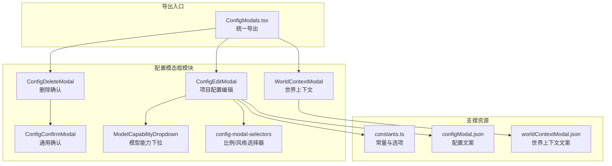
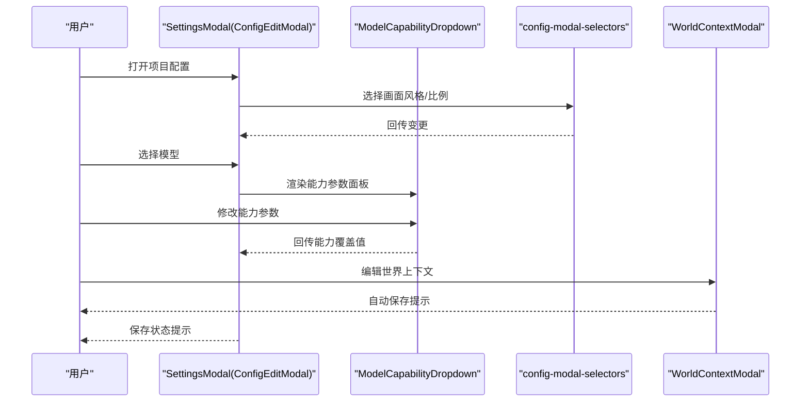
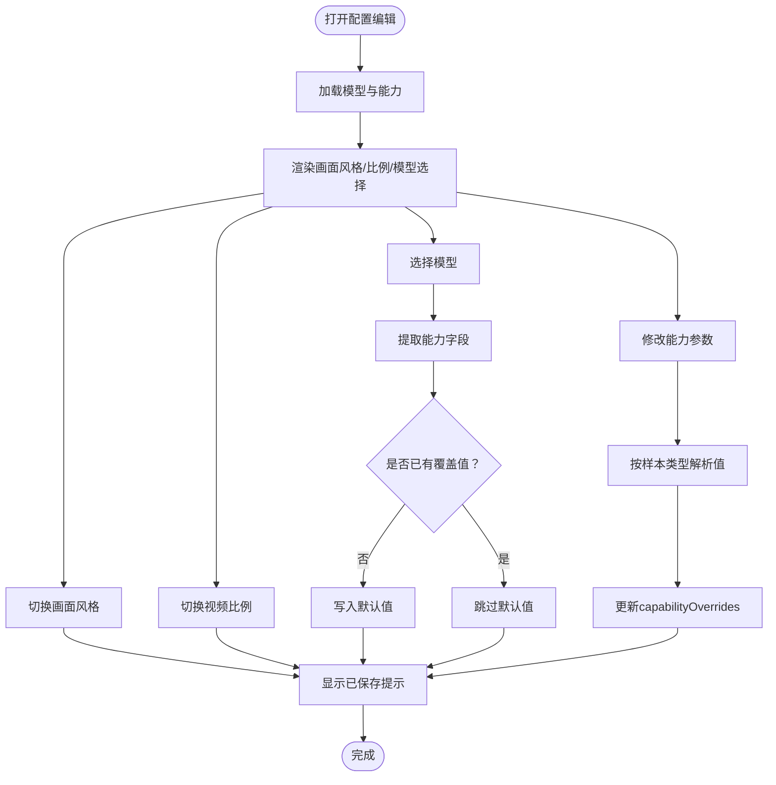
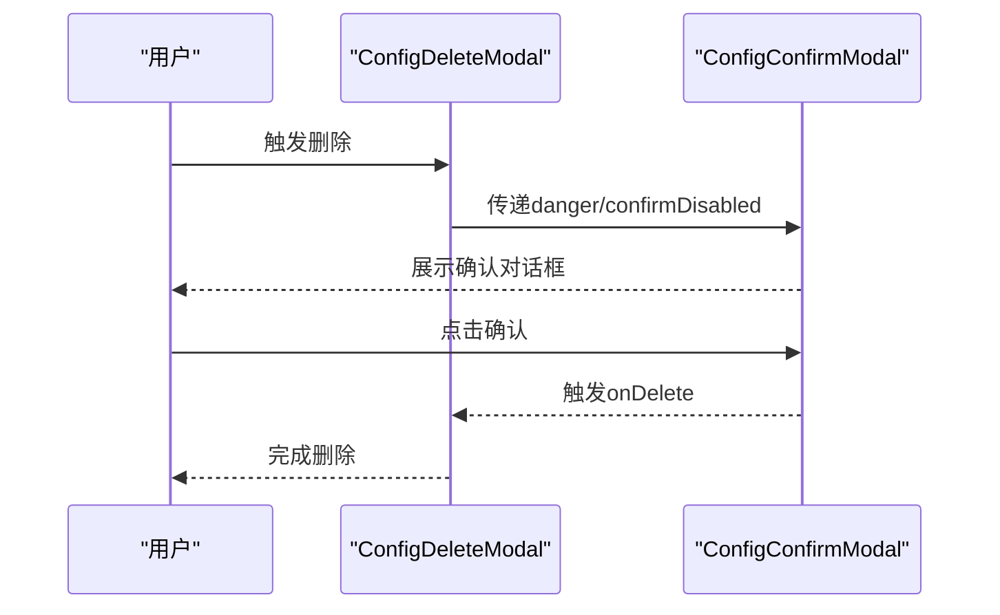
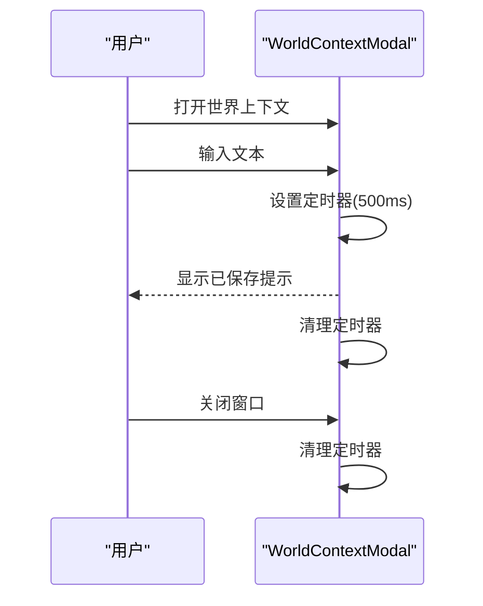
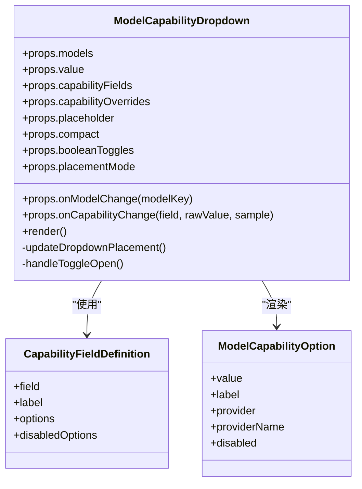
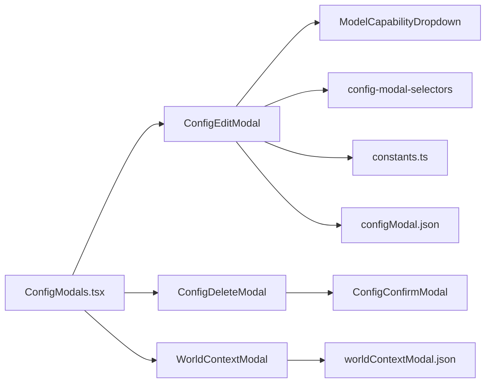

# 配置模态框

<cite>
**本文档引用的文件**
- [ConfigEditModal.tsx](file://src/components/ui/config-modals/ConfigEditModal.tsx)
- [ConfigDeleteModal.tsx](file://src/components/ui/config-modals/ConfigDeleteModal.tsx)
- [ConfigConfirmModal.tsx](file://src/components/ui/config-modals/ConfigConfirmModal.tsx)
- [WorldContextModal.tsx](file://src/components/ui/config-modals/WorldContextModal.tsx)
- [ModelCapabilityDropdown.tsx](file://src/components/ui/config-modals/ModelCapabilityDropdown.tsx)
- [config-modal-selectors.tsx](file://src/components/ui/config-modals/config-modal-selectors.tsx)
- [ConfigModals.tsx](file://src/components/ui/ConfigModals.tsx)
- [constants.ts](file://src/lib/constants.ts)
- [configModal.json](file://messages/zh/configModal.json)
- [worldContextModal.json](file://messages/zh/worldContextModal.json)
</cite>

## 目录
1. [简介](#简介)
2. [项目结构](#项目结构)
3. [核心组件](#核心组件)
4. [架构总览](#架构总览)
5. [详细组件分析](#详细组件分析)
6. [依赖关系分析](#依赖关系分析)
7. [性能考量](#性能考量)
8. [故障排查指南](#故障排查指南)
9. [结论](#结论)
10. [附录](#附录)

## 简介
本文件面向Waoowaoo的配置模态框组件，系统性梳理ConfigEditModal（项目配置编辑）、ConfigDeleteModal（删除确认）、ConfigConfirmModal（通用确认）以及WorldContextModal（世界上下文）的设计与实现。重点涵盖状态管理、表单验证与数据提交流程、在API配置、模型能力选择与世界上下文设置中的应用场景，并总结生命周期管理、用户交互与错误处理的最佳实践，以及样式定制与主题适配方法。

## 项目结构
配置模态框位于UI组件层的config-modals目录，围绕“项目配置”“删除确认”“世界上下文”三大场景构建，配合ModelCapabilityDropdown与专用选择器实现复杂参数配置体验。

**图表来源**
- [ConfigModals.tsx:1-4](file://src/components/ui/ConfigModals.tsx#L1-L4)
- [ConfigEditModal.tsx:15-17](file://src/components/ui/config-modals/ConfigEditModal.tsx#L15-L17)
- [ModelCapabilityDropdown.tsx:114-125](file://src/components/ui/config-modals/ModelCapabilityDropdown.tsx#L114-L125)
- [config-modal-selectors.tsx:39-164](file://src/components/ui/config-modals/config-modal-selectors.tsx#L39-L164)
- [constants.ts:8-26](file://src/lib/constants.ts#L8-L26)
- [configModal.json:1-37](file://messages/zh/configModal.json#L1-L37)
- [worldContextModal.json:1-6](file://messages/zh/worldContextModal.json#L1-L6)

**章节来源**
- [ConfigModals.tsx:1-4](file://src/components/ui/ConfigModals.tsx#L1-L4)
- [ConfigEditModal.tsx:15-17](file://src/components/ui/config-modals/ConfigEditModal.tsx#L15-L17)
- [ModelCapabilityDropdown.tsx:114-125](file://src/components/ui/config-modals/ModelCapabilityDropdown.tsx#L114-L125)
- [config-modal-selectors.tsx:39-164](file://src/components/ui/config-modals/config-modal-selectors.tsx#L39-L164)
- [constants.ts:8-26](file://src/lib/constants.ts#L8-L26)
- [configModal.json:1-37](file://messages/zh/configModal.json#L1-L37)
- [worldContextModal.json:1-6](file://messages/zh/worldContextModal.json#L1-L6)

## 核心组件
- ConfigEditModal（SettingsModal别名）：项目级配置编辑，支持画面风格、视频比例、各模型（LLM/图像/视频/音频）及其能力参数的动态配置与持久化。
- ConfigDeleteModal：基于ConfigConfirmModal的删除确认封装，提供危险操作的二次确认。
- ConfigConfirmModal：通用确认对话框，支持标题、描述、确认/取消文本、危险按钮样式与禁用控制。
- WorldContextModal：世界上下文编辑，支持自动保存提示与文本变更回调。
- ModelCapabilityDropdown：模型能力下拉选择器，支持模型分组、能力参数面板、布尔开关、比例预览等。
- config-modal-selectors：项目配置专用的选择器，提供比例与风格卡片式选择。

**章节来源**
- [ConfigEditModal.tsx:125-152](file://src/components/ui/config-modals/ConfigEditModal.tsx#L125-L152)
- [ConfigDeleteModal.tsx:17-26](file://src/components/ui/config-modals/ConfigDeleteModal.tsx#L17-L26)
- [ConfigConfirmModal.tsx:17-27](file://src/components/ui/config-modals/ConfigConfirmModal.tsx#L17-L27)
- [WorldContextModal.tsx:14-17](file://src/components/ui/config-modals/WorldContextModal.tsx#L14-L17)
- [ModelCapabilityDropdown.tsx:114-125](file://src/components/ui/config-modals/ModelCapabilityDropdown.tsx#L114-L125)
- [config-modal-selectors.tsx:39-164](file://src/components/ui/config-modals/config-modal-selectors.tsx#L39-L164)

## 架构总览
配置模态框采用“组合+复用”的架构设计：
- 通用确认与删除确认作为基础层，提供一致的交互与视觉风格。
- 项目配置编辑通过ModelCapabilityDropdown与专用选择器承载复杂参数配置。
- 文案与常量集中管理，便于国际化与主题适配。

**图表来源**
- [ConfigEditModal.tsx:373-501](file://src/components/ui/config-modals/ConfigEditModal.tsx#L373-L501)
- [ModelCapabilityDropdown.tsx:242-453](file://src/components/ui/config-modals/ModelCapabilityDropdown.tsx#L242-L453)
- [config-modal-selectors.tsx:39-164](file://src/components/ui/config-modals/config-modal-selectors.tsx#L39-L164)
- [WorldContextModal.tsx:14-107](file://src/components/ui/config-modals/WorldContextModal.tsx#L14-L107)

## 详细组件分析

### ConfigEditModal（项目配置编辑）
- 职责与范围
  - 提供项目级配置编辑界面，包括画面风格、视频比例、各模型选择及能力参数覆盖。
  - 自动为新选中模型的未配置字段写入默认能力值，避免requireAllFields校验问题。
  - 提供自动保存提示与键盘Esc关闭。
- 状态管理
  - 使用useState维护保存状态，useMemo缓存派生数据（如视频模型过滤、能力字段提取、当前模型选项等）。
  - 通过capabilityOverrides记录每个模型的能力覆盖值，支持按模型键聚合。
- 表单与验证
  - 能力字段解析：根据模型capabilities动态提取形如“xxxOptions”的字段集合，自动推断字段标签与类型。
  - 值解析：依据样本类型（number/boolean/string）进行parseBySample转换，保证存储一致性。
  - 默认值策略：切换模型时，对未配置字段写入首个可用选项，确保UI默认高亮与数据库一致。
- 数据流
  - 用户变更触发handleChange或handleModelChange，回调外部onChange并更新capabilityOverrides。
  - 通过onCapabilityOverridesChange回传至父层持久化。
- 交互与生命周期
  - Esc键监听与点击遮罩关闭。
  - 自动保存提示：变更后短暂显示“已保存”，2秒后恢复“自动保存”。

**图表来源**
- [ConfigEditModal.tsx:125-327](file://src/components/ui/config-modals/ConfigEditModal.tsx#L125-L327)
- [ConfigEditModal.tsx:89-123](file://src/components/ui/config-modals/ConfigEditModal.tsx#L89-L123)
- [ConfigEditModal.tsx:246-270](file://src/components/ui/config-modals/ConfigEditModal.tsx#L246-L270)
- [ConfigEditModal.tsx:276-305](file://src/components/ui/config-modals/ConfigEditModal.tsx#L276-L305)

**章节来源**
- [ConfigEditModal.tsx:125-327](file://src/components/ui/config-modals/ConfigEditModal.tsx#L125-L327)
- [ConfigEditModal.tsx:89-123](file://src/components/ui/config-modals/ConfigEditModal.tsx#L89-L123)
- [ConfigEditModal.tsx:246-270](file://src/components/ui/config-modals/ConfigEditModal.tsx#L246-L270)
- [ConfigEditModal.tsx:276-305](file://src/components/ui/config-modals/ConfigEditModal.tsx#L276-L305)

### ConfigDeleteModal（删除确认）
- 设计要点
  - 基于ConfigConfirmModal的危险模式封装，提供删除文案与禁用控制。
  - 通过danger与confirmDisabled属性控制按钮样式与交互状态。
- 使用建议
  - 在执行不可逆操作前，务必提供明确的描述与禁用条件（如正在加载）。

**图表来源**
- [ConfigDeleteModal.tsx:17-41](file://src/components/ui/config-modals/ConfigDeleteModal.tsx#L17-L41)
- [ConfigConfirmModal.tsx:17-61](file://src/components/ui/config-modals/ConfigConfirmModal.tsx#L17-L61)

**章节来源**
- [ConfigDeleteModal.tsx:17-41](file://src/components/ui/config-modals/ConfigDeleteModal.tsx#L17-L41)
- [ConfigConfirmModal.tsx:17-61](file://src/components/ui/config-modals/ConfigConfirmModal.tsx#L17-L61)

### ConfigConfirmModal（通用确认）
- 设计要点
  - 最小可用确认对话框，支持标题、描述、确认/取消文本、危险按钮样式与禁用。
  - 点击遮罩关闭，Esc键监听由上层组件负责。
- 适用场景
  - 删除、重置、危险操作确认等。

**章节来源**
- [ConfigConfirmModal.tsx:17-61](file://src/components/ui/config-modals/ConfigConfirmModal.tsx#L17-L61)

### WorldContextModal（世界上下文）
- 设计要点
  - 提供长文本编辑区域，支持自动保存提示与防抖保存。
  - Esc键监听与清理定时器，避免内存泄漏。
- 交互细节
  - 文本变更后延迟500ms触发保存提示，2秒后恢复“自动保存”。

**图表来源**
- [WorldContextModal.tsx:14-107](file://src/components/ui/config-modals/WorldContextModal.tsx#L14-L107)

**章节来源**
- [WorldContextModal.tsx:14-107](file://src/components/ui/config-modals/WorldContextModal.tsx#L14-L107)

### ModelCapabilityDropdown（模型能力下拉）
- 设计要点
  - 分区式布局：上半区模型列表，下半区能力参数面板。
  - 自适应定位：根据视口空间自动向上或向下展开，支持最小宽度与最大高度约束。
  - 能力参数控制：根据字段类型与选项数量自动选择下拉或按钮组；比例字段支持图标预览。
  - 信息摘要：触发器显示模型名、提供商与参数摘要，便于快速识别。
- 交互细节
  - 点击外部区域关闭；滚动与窗口大小变化时重新计算位置。
  - 支持布尔开关与禁用选项标注。

**图表来源**
- [ModelCapabilityDropdown.tsx:50-71](file://src/components/ui/config-modals/ModelCapabilityDropdown.tsx#L50-L71)
- [ModelCapabilityDropdown.tsx:114-125](file://src/components/ui/config-modals/ModelCapabilityDropdown.tsx#L114-L125)
- [ModelCapabilityDropdown.tsx:34-48](file://src/components/ui/config-modals/ModelCapabilityDropdown.tsx#L34-L48)
- [ModelCapabilityDropdown.tsx:21-32](file://src/components/ui/config-modals/ModelCapabilityDropdown.tsx#L21-L32)

**章节来源**
- [ModelCapabilityDropdown.tsx:114-125](file://src/components/ui/config-modals/ModelCapabilityDropdown.tsx#L114-L125)
- [ModelCapabilityDropdown.tsx:133-191](file://src/components/ui/config-modals/ModelCapabilityDropdown.tsx#L133-L191)
- [ModelCapabilityDropdown.tsx:345-447](file://src/components/ui/config-modals/ModelCapabilityDropdown.tsx#L345-L447)

### config-modal-selectors（项目配置专用选择器）
- 设计要点
  - 比例选择器：网格卡片展示比例，支持选中态高亮与比例形状预览。
  - 风格选择器：网格卡片展示风格，支持选中态高亮与标签展示。
- 交互细节
  - 外部点击关闭；按钮状态随isOpen切换。

**章节来源**
- [config-modal-selectors.tsx:39-164](file://src/components/ui/config-modals/config-modal-selectors.tsx#L39-L164)

## 依赖关系分析
- 组件耦合
  - ConfigEditModal依赖ModelCapabilityDropdown与config-modal-selectors，形成“容器-组件”关系。
  - ConfigDeleteModal依赖ConfigConfirmModal，形成“封装-基础”关系。
- 外部依赖
  - constants.ts提供比例、风格、模型列表等静态选项。
  - 国际化文件提供文案支撑。
- 导出入口
  - ConfigModals.tsx统一导出，便于上层按需引入。

**图表来源**
- [ConfigModals.tsx:1-4](file://src/components/ui/ConfigModals.tsx#L1-L4)
- [ConfigEditModal.tsx:15-17](file://src/components/ui/config-modals/ConfigEditModal.tsx#L15-L17)
- [ModelCapabilityDropdown.tsx:114-125](file://src/components/ui/config-modals/ModelCapabilityDropdown.tsx#L114-L125)
- [config-modal-selectors.tsx:39-164](file://src/components/ui/config-modals/config-modal-selectors.tsx#L39-L164)
- [constants.ts:8-26](file://src/lib/constants.ts#L8-L26)
- [configModal.json:1-37](file://messages/zh/configModal.json#L1-L37)
- [worldContextModal.json:1-6](file://messages/zh/worldContextModal.json#L1-L6)

**章节来源**
- [ConfigModals.tsx:1-4](file://src/components/ui/ConfigModals.tsx#L1-L4)
- [ConfigEditModal.tsx:15-17](file://src/components/ui/config-modals/ConfigEditModal.tsx#L15-L17)
- [ModelCapabilityDropdown.tsx:114-125](file://src/components/ui/config-modals/ModelCapabilityDropdown.tsx#L114-L125)
- [config-modal-selectors.tsx:39-164](file://src/components/ui/config-modals/config-modal-selectors.tsx#L39-L164)
- [constants.ts:8-26](file://src/lib/constants.ts#L8-L26)
- [configModal.json:1-37](file://messages/zh/configModal.json#L1-L37)
- [worldContextModal.json:1-6](file://messages/zh/worldContextModal.json#L1-L6)

## 性能考量
- 渲染优化
  - 使用useMemo缓存模型过滤、能力字段提取与当前选项，减少重复计算。
  - 下拉面板使用createPortal挂载至body，避免层级影响与重排。
- 交互体验
  - 自动保存提示采用setTimeout与清理，避免频繁重绘。
  - 比例/风格选择器采用卡片网格布局，提升可发现性与点击命中率。
- 可访问性
  - 提供Esc键关闭与点击遮罩关闭，满足键盘与鼠标双通道操作。
  - 比例字段支持图标预览，辅助理解比例含义。

## 故障排查指南
- 无法保存或提示异常
  - 检查capabilityOverrides的结构是否符合预期，确保字段类型与样本类型一致。
  - 确认onChange回调链路是否正确传递，避免状态丢失。
- 比例/风格选择无效
  - 确认传入options格式正确，value与label字段齐全。
  - 检查点击事件冒泡与外部点击关闭逻辑。
- 删除确认不生效
  - 确认danger与confirmDisabled属性设置是否正确。
  - 检查外部传入的onDelete是否绑定。
- 世界上下文保存提示闪烁
  - 检查文本变更频率与定时器清理逻辑，避免并发定时器导致的竞态。

**章节来源**
- [ConfigEditModal.tsx:246-270](file://src/components/ui/config-modals/ConfigEditModal.tsx#L246-L270)
- [ConfigEditModal.tsx:307-327](file://src/components/ui/config-modals/ConfigEditModal.tsx#L307-L327)
- [ConfigDeleteModal.tsx:27-41](file://src/components/ui/config-modals/ConfigDeleteModal.tsx#L27-L41)
- [WorldContextModal.tsx:17-46](file://src/components/ui/config-modals/WorldContextModal.tsx#L17-L46)

## 结论
配置模态框组件通过清晰的职责划分与复用机制，实现了从通用确认到复杂参数配置的一体化体验。其状态管理、自动保存与自适应布局提升了易用性与稳定性。建议在业务接入时遵循统一导出入口与国际化规范，确保跨场景一致性与可维护性。

## 附录
- 样式定制与主题适配
  - 使用CSS变量（如--glass-text-primary、--glass-bg-surface等）实现主题适配。
  - 通过类名组合（glass-surface-modal、glass-input-base、glass-btn-base等）统一视觉风格。
  - 比例与风格选择器支持卡片高亮与描边，便于在深浅主题间保持对比度。
- 国际化与文案
  - 通过configModal.json与worldContextModal.json集中管理文案，确保一致性与可翻译性。
- 常量与选项
  - constants.ts提供比例、风格、模型列表等静态选项，作为UI层的权威数据源。

**章节来源**
- [constants.ts:8-26](file://src/lib/constants.ts#L8-L26)
- [configModal.json:1-37](file://messages/zh/configModal.json#L1-L37)
- [worldContextModal.json:1-6](file://messages/zh/worldContextModal.json#L1-L6)