# 前端组件架构

<cite>
**本文引用的文件**   
- [package.json](file://package.json)
- [next.config.ts](file://next.config.ts)
- [src/middleware.ts](file://src/middleware.ts)
- [src/i18n.ts](file://src/i18n.ts)
- [src/i18n/navigation.ts](file://src/i18n/navigation.ts)
- [src/app/[locale]/layout.tsx](file://src/app/[locale]/layout.tsx)
- [src/app/[locale]/providers.tsx](file://src/app/[locale]/providers.tsx)
- [src/components/providers/QueryProvider.tsx](file://src/components/providers/QueryProvider.tsx)
- [src/components/Navbar.tsx](file://src/components/Navbar.tsx)
- [src/components/LanguageSwitcher.tsx](file://src/components/LanguageSwitcher.tsx)
- [src/components/ui/SharedComponents.tsx](file://src/components/ui/SharedComponents.tsx)
- [src/styles/ui-semantic-glass.css](file://src/styles/ui-semantic-glass.css)
- [src/styles/ui-tokens-glass.css](file://src/styles/ui-tokens-glass.css)
- [src/lib/query/client.ts](file://src/lib/query/client.ts)
- [src/lib/api/api-fetch.ts](file://src/lib/api/api-fetch.ts)
- [src/lib/api/api-config.ts](file://src/lib/api/api-config.ts)
- [src/lib/api/auth.ts](file://src/lib/api/auth.ts)
- [src/lib/workspace/index.ts](file://src/lib/workspace/index.ts)
- [src/lib/projects/index.ts](file://src/lib/projects/index.ts)
- [src/lib/assets/index.ts](file://src/lib/assets/index.ts)
- [src/lib/storyboard/index.ts](file://src/lib/storyboard/index.ts)
- [src/lib/novel-promotion/index.ts](file://src/lib/novel-promotion/index.ts)
- [src/features/video-editor/index.ts](file://src/features/video-editor/index.ts)
- [src/hooks/common/useGithubReleaseUpdate.ts](file://src/hooks/common/useGithubReleaseUpdate.ts)
- [src/hooks/common/useCandidateSystem.ts](file://src/hooks/common/useCandidateSystem.ts)
- [src/types/project.ts](file://src/types/project.ts)
- [src/types/storyboard-types.ts](file://src/types/storyboard-types.ts)
- [src/types/character-profile.ts](file://src/types/character-profile.ts)
- [src/types/next-auth.d.ts](file://src/types/next-auth.d.ts)
- [src/pages/_document.tsx](file://src/pages/_document.tsx)
- [src/instrumentation.ts](file://src/instrumentation.ts)
- [src/app/[locale]/workspace/asset-hub/components/AssetGrid.tsx](file://src/app/[locale]/workspace/asset-hub/components/AssetGrid.tsx)
- [src/app/[locale]/workspace/asset-hub/components/CharacterCard.tsx](file://src/app/[locale]/workspace/asset-hub/components/CharacterCard.tsx)
- [src/app/[locale]/workspace/asset-hub/components/LocationCard.tsx](file://src/app/[locale]/workspace/asset-hub/components/LocationCard.tsx)
- [src/app/[locale]/workspace/[projectId]/modes/novel-promotion/components/storyboard/ImageSectionCandidateMode.tsx](file://src/app/[locale]/workspace/[projectId]/modes/novel-promotion/components/storyboard/ImageSectionCandidateMode.tsx)
- [src/app/[locale]/workspace/[projectId]/modes/novel-promotion/components/assets/character-card/CharacterCardHeader.tsx](file://src/app/[locale]/workspace/[projectId]/modes/novel-promotion/components/assets/character-card/CharacterCardHeader.tsx)
- [src/app/[locale]/workspace/[projectId]/modes/novel-promotion/components/assets/location-card/LocationCardHeader.tsx](file://src/app/[locale]/workspace/[projectId]/modes/novel-promotion/components/assets/location-card/LocationCardHeader.tsx)
- [src/app/[locale]/workspace/[projectId]/modes/novel-promotion/components/storyboard/ImageSection.tsx](file://src/app/[locale]/workspace/[projectId]/modes/novel-promotion/components/storyboard/ImageSection.tsx)
- [src/app/[locale]/workspace/[projectId]/modes/novel-promotion/components/storyboard/hooks/panel-candidate-runtime.ts](file://src/app/[locale]/workspace/[projectId]/modes/novel-promotion/components/storyboard/hooks/panel-candidate-runtime.ts)
- [src/lib/image-generation/slot-state.ts](file://src/lib/image-generation/slot-state.ts)
- [src/components/shared/assets/GlobalAssetPicker.tsx](file://src/components/shared/assets/GlobalAssetPicker.tsx)
- [src/lib/constants.ts](file://src/lib/constants.ts)
- [tests/unit/components/asset-grid.test.ts](file://tests/unit/components/asset-grid.test.ts)
- [tests/unit/components/character-card-gallery-aspect-ratio.test.ts](file://tests/unit/components/character-card-gallery-aspect-ratio.test.ts)
- [tests/unit/components/location-card-ai-edit.test.ts](file://tests/unit/components/location-card-ai-edit.test.ts)
- [tests/unit/image-generation/slot-state.test.ts](file://tests/unit/image-generation/slot-state.test.ts)
</cite>

## 更新摘要
**所做更改**
- 新增导航栏路由预取功能，通过 `router.prefetch()` 提升用户体验
- **更新** AssetGrid 组件的网格列数配置从原来的7-8列优化为4-6列的响应式布局，提升了在不同屏幕尺寸下的显示效果和用户体验
- 改进 CharacterCard 和 LocationCard 组件的布局结构，优化多图选择模式的视觉呈现
- 增强资产卡片组件的艺术风格显示功能，新增漫画风格标签和预览
- 优化 ImageSectionCandidateMode 组件的候选显示界面，提升用户交互体验

## 目录
1. [简介](#简介)
2. [项目结构](#项目结构)
3. [核心组件](#核心组件)
4. [架构总览](#架构总览)
5. [组件详解](#组件详解)
6. [UI布局优化](#ui布局优化)
7. [依赖关系分析](#依赖关系分析)
8. [性能考量](#性能考量)
9. [故障排查指南](#故障排查指南)
10. [结论](#结论)
11. [附录](#附录)

## 简介
本技术文档面向 Waoowaoo 的前端组件架构，围绕基于 Next.js 15 的 App Router 应用展开，系统性阐述页面组织、组件层次、状态管理、国际化与主题系统、样式体系、UI 组件库使用、响应式与无障碍、跨浏览器兼容、性能优化策略、与后端 API 的集成与数据流管理，并提供可操作的最佳实践与示例路径。

## 项目结构
- 应用采用 App Router 结构，页面按语言域组织于 [src/app/[locale]/](file://src/app/[locale]/) 下，统一通过 [src/app/[locale]/layout.tsx](file://src/app/[locale]/layout.tsx) 提供布局与国际化上下文。
- 国际化通过 next-intl 实现，服务端配置在 [src/i18n.ts](file://src/i18n.ts)，中间件在 [src/middleware.ts](file://src/middleware.ts) 控制语言前缀与跳转策略。
- 样式体系分为语义类与变量令牌两层：语义类位于 [src/styles/ui-semantic-glass.css](file://src/styles/ui-semantic-glass.css)，变量令牌位于 [src/styles/ui-tokens-glass.css](file://src/styles/ui-tokens-glass.css)。
- 全局状态管理由 React Query 提供，通过 [src/components/providers/QueryProvider.tsx](file://src/components/providers/QueryProvider.tsx) 注入，客户端查询实例位于 [src/lib/query/client.ts](file://src/lib/query/client.ts)。
- 主题系统与毛玻璃视觉风格由 Glass UI 设计系统驱动，配套组件位于 [src/components/ui/SharedComponents.tsx](file://src/components/ui/SharedComponents.tsx)。
- 页面级入口与布局提供者在 [src/app/[locale]/providers.tsx](file://src/app/[locale]/providers.tsx) 中组合 SessionProvider、React Query 与 Toast 上下文。

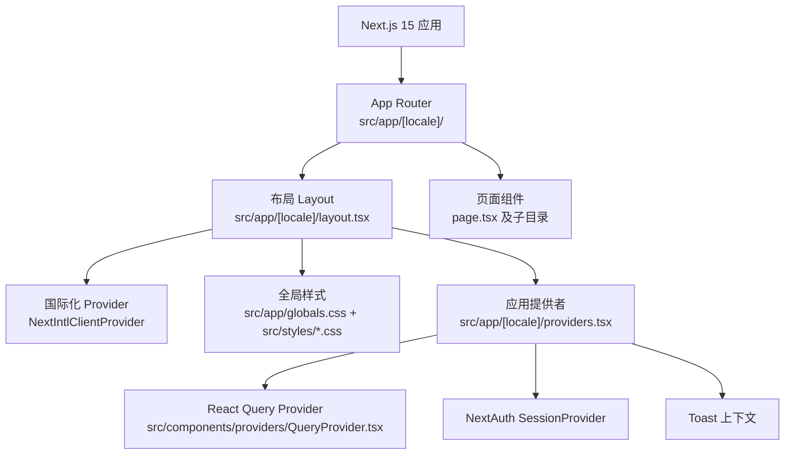

**图表来源**
- [src/app/[locale]/layout.tsx](file://src/app/[locale]/layout.tsx#L37-L78)
- [src/app/[locale]/providers.tsx](file://src/app/[locale]/providers.tsx#L7-L20)
- [src/components/providers/QueryProvider.tsx:10-16](file://src/components/providers/QueryProvider.tsx#L10-L16)

**章节来源**
- [src/app/[locale]/layout.tsx](file://src/app/[locale]/layout.tsx#L18-L78)
- [src/app/[locale]/providers.tsx](file://src/app/[locale]/providers.tsx#L1-L21)
- [src/styles/ui-semantic-glass.css:1-465](file://src/styles/ui-semantic-glass.css#L1-L465)
- [src/styles/ui-tokens-glass.css:1-96](file://src/styles/ui-tokens-glass.css#L1-L96)

## 核心组件
- 布局与国际化
  - 语言域布局：[src/app/[locale]/layout.tsx](file://src/app/[locale]/layout.tsx#L37-L78) 提供动态元数据生成、语言校验与国际化消息注入。
  - 国际化配置：[src/i18n.ts:9-124](file://src/i18n.ts#L9-L124) 服务端加载多模块翻译并合并为单一消息对象。
  - 中间件：[src/middleware.ts:4-16](file://src/middleware.ts#L4-L16) 强制语言前缀与禁用自动语言检测，确保语言一致性。
  - Next 配置：[next.config.ts:2-4](file://next.config.ts#L2-L4) 集成 next-intl 插件，保证构建期国际化处理。

- 状态管理与缓存
  - React Query Provider：[src/components/providers/QueryProvider.tsx:10-16](file://src/components/providers/QueryProvider.tsx#L10-L16) 将全局查询客户端注入应用树。
  - 查询客户端：[src/lib/query/client.ts](file://src/lib/query/client.ts) 提供默认缓存策略与重试配置（需参考源码）。
  - 会话与认证：[src/app/[locale]/providers.tsx](file://src/app/[locale]/providers.tsx#L9-L12) 使用 NextAuth SessionProvider 并关闭窗口焦点刷新，降低不必要请求。

- 导航与语言切换
  - 导航栏：[src/components/Navbar.tsx:21-181](file://src/components/Navbar.tsx#L21-L181) 展示工作区、资源库、个人资料等导航项，集成语言切换器与更新提示。
  - 语言切换器：[src/components/LanguageSwitcher.tsx:38-139](file://src/components/LanguageSwitcher.tsx#L38-L139) 提供弹出菜单与切换确认对话框，支持 end-to-end 语言变更提示同步。

- UI 组件库与样式系统
  - 共享组件：[src/components/ui/SharedComponents.tsx:7-75](file://src/components/ui/SharedComponents.tsx#L7-L75) 提供 AnimatedBackground、GlassPanel、Button 等基础组件。
  - 语义样式：[src/styles/ui-semantic-glass.css:1-465](file://src/styles/ui-semantic-glass.css#L1-L465) 定义 glass-* 类别，覆盖表面、输入、按钮、分段控件、滚动条等。
  - 变量令牌：[src/styles/ui-tokens-glass.css:1-96](file://src/styles/ui-tokens-glass.css#L1-L96) 定义颜色、阴影、圆角、模糊、密度等 CSS 变量，支持低开销预设。

**章节来源**
- [src/i18n.ts:9-124](file://src/i18n.ts#L9-L124)
- [src/middleware.ts:4-16](file://src/middleware.ts#L4-L16)
- [next.config.ts:2-4](file://next.config.ts#L2-L4)
- [src/app/[locale]/layout.tsx](file://src/app/[locale]/layout.tsx#L18-L78)
- [src/app/[locale]/providers.tsx](file://src/app/[locale]/providers.tsx#L7-L20)
- [src/components/providers/QueryProvider.tsx:10-16](file://src/components/providers/QueryProvider.tsx#L10-L16)
- [src/components/Navbar.tsx:21-181](file://src/components/Navbar.tsx#L21-L181)
- [src/components/LanguageSwitcher.tsx:38-139](file://src/components/LanguageSwitcher.tsx#L38-L139)
- [src/components/ui/SharedComponents.tsx:7-75](file://src/components/ui/SharedComponents.tsx#L7-L75)
- [src/styles/ui-semantic-glass.css:1-465](file://src/styles/ui-semantic-glass.css#L1-L465)
- [src/styles/ui-tokens-glass.css:1-96](file://src/styles/ui-tokens-glass.css#L1-L96)

## 架构总览
整体架构围绕"语言域布局 + 国际化 Provider + 应用提供者（会话/查询/通知）+ 页面组件"的分层设计，配合 Glass UI 语义样式与变量令牌，形成一致的视觉与交互体验。

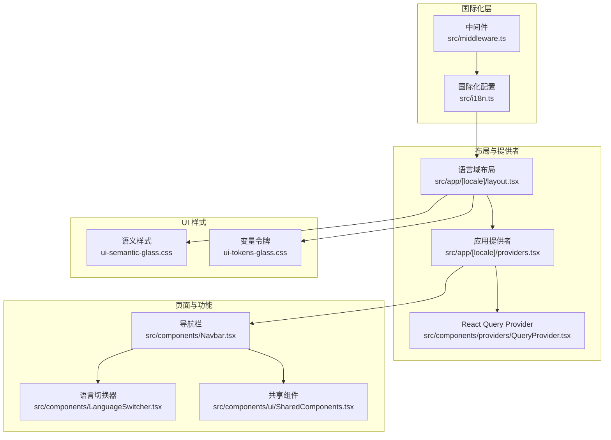

**图表来源**
- [src/middleware.ts:4-16](file://src/middleware.ts#L4-L16)
- [src/i18n.ts:9-124](file://src/i18n.ts#L9-L124)
- [src/app/[locale]/layout.tsx](file://src/app/[locale]/layout.tsx#L37-L78)
- [src/app/[locale]/providers.tsx](file://src/app/[locale]/providers.tsx#L7-L20)
- [src/components/providers/QueryProvider.tsx:10-16](file://src/components/providers/QueryProvider.tsx#L10-L16)
- [src/styles/ui-semantic-glass.css:1-465](file://src/styles/ui-semantic-glass.css#L1-L465)
- [src/styles/ui-tokens-glass.css:1-96](file://src/styles/ui-tokens-glass.css#L1-L96)
- [src/components/Navbar.tsx:21-181](file://src/components/Navbar.tsx#L21-L181)
- [src/components/LanguageSwitcher.tsx:38-139](file://src/components/LanguageSwitcher.tsx#L38-L139)
- [src/components/ui/SharedComponents.tsx:7-75](file://src/components/ui/SharedComponents.tsx#L7-L75)

## 组件详解

### 国际化与语言切换流程
- 语言前缀强制与跳转：中间件对非带前缀路径进行重定向，避免语言漂移；禁用自动语言检测，确保稳定路由。
- 服务端加载翻译：国际化配置按模块批量加载翻译文件，返回合并后的消息对象。
- 客户端语言切换：语言切换器提供弹窗与确认对话框，调用路由替换方法更新当前语言，同时提示端到端语言变更影响。

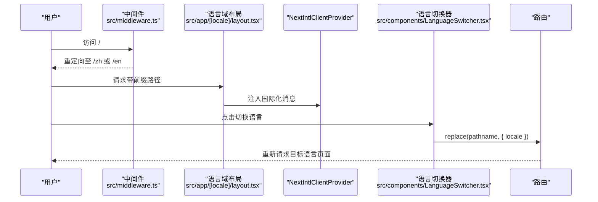

**图表来源**
- [src/middleware.ts:4-16](file://src/middleware.ts#L4-L16)
- [src/app/[locale]/layout.tsx](file://src/app/[locale]/layout.tsx#L52-L72)
- [src/components/LanguageSwitcher.tsx:70-84](file://src/components/LanguageSwitcher.tsx#L70-L84)

**章节来源**
- [src/middleware.ts:4-16](file://src/middleware.ts#L4-L16)
- [src/i18n.ts:9-124](file://src/i18n.ts#L9-L124)
- [src/app/[locale]/layout.tsx](file://src/app/[locale]/layout.tsx#L18-L78)
- [src/components/LanguageSwitcher.tsx:38-139](file://src/components/LanguageSwitcher.tsx#L38-L139)

### 状态管理与缓存策略
- React Query 提供全局缓存、请求去重、失效与重取、乐观更新等能力，通过 Provider 注入应用树。
- 查询客户端初始化与策略位于 [src/lib/query/client.ts](file://src/lib/query/client.ts)（需参考源码），建议结合业务场景设置合适的缓存时间与错误处理。
- 会话状态由 NextAuth 管理，关闭窗口焦点刷新以减少不必要的请求。

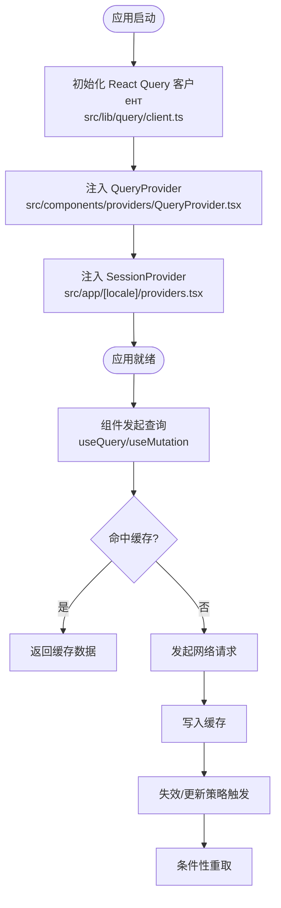

**图表来源**
- [src/components/providers/QueryProvider.tsx:10-16](file://src/components/providers/QueryProvider.tsx#L10-L16)
- [src/app/[locale]/providers.tsx](file://src/app/[locale]/providers.tsx#L9-L12)
- [src/lib/query/client.ts](file://src/lib/query/client.ts)

**章节来源**
- [src/components/providers/QueryProvider.tsx:10-16](file://src/components/providers/QueryProvider.tsx#L10-L16)
- [src/app/[locale]/providers.tsx](file://src/app/[locale]/providers.tsx#L7-L20)
- [src/lib/query/client.ts](file://src/lib/query/client.ts)

### 导航与语言切换组件
- 导航栏：根据会话状态显示不同菜单项，集成语言切换器与更新提示。
- 语言切换器：支持点击切换、外部点击关闭、确认对话框，确保用户明确语言变更影响。

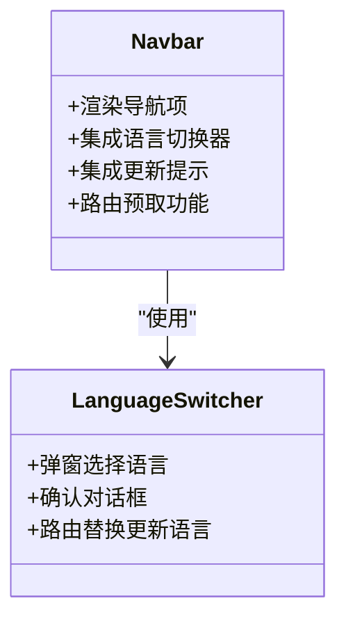

**图表来源**
- [src/components/Navbar.tsx:21-181](file://src/components/Navbar.tsx#L21-L181)
- [src/components/LanguageSwitcher.tsx:38-139](file://src/components/LanguageSwitcher.tsx#L38-L139)

**章节来源**
- [src/components/Navbar.tsx:21-181](file://src/components/Navbar.tsx#L21-L181)
- [src/components/LanguageSwitcher.tsx:38-139](file://src/components/LanguageSwitcher.tsx#L38-L139)

### Glass UI 设计系统与自定义组件
- 语义样式：覆盖表面、输入、按钮、分段控件、滚动条等，统一视觉与交互。
- 变量令牌：集中管理颜色、阴影、圆角、模糊、密度等，支持低开销预设模式。
- 共享组件：提供 AnimatedBackground、GlassPanel、Button 等基础组件，便于复用与一致性。

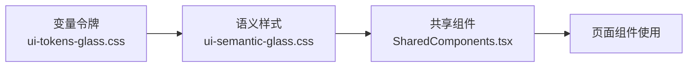

**图表来源**
- [src/styles/ui-tokens-glass.css:1-96](file://src/styles/ui-tokens-glass.css#L1-L96)
- [src/styles/ui-semantic-glass.css:1-465](file://src/styles/ui-semantic-glass.css#L1-L465)
- [src/components/ui/SharedComponents.tsx:7-75](file://src/components/ui/SharedComponents.tsx#L7-L75)

**章节来源**
- [src/styles/ui-tokens-glass.css:1-96](file://src/styles/ui-tokens-glass.css#L1-L96)
- [src/styles/ui-semantic-glass.css:1-465](file://src/styles/ui-semantic-glass.css#L1-L465)
- [src/components/ui/SharedComponents.tsx:7-75](file://src/components/ui/SharedComponents.tsx#L7-L75)

### 响应式设计、无障碍与跨浏览器兼容
- 响应式：通过 Tailwind V4 与语义类组合实现断点与间距适配（参考 [package.json](file://package.json#L180) 中 tailwind 版本）。
- 无障碍：组件使用语义标签与 aria-* 属性，如按钮禁用态、确认对话框的标题与描述。
- 跨浏览器：Geist 字体与现代 CSS 变量在主流浏览器中具备良好支持；滚动条样式通过原生与 WebKit 双通道适配。

**章节来源**
- [package.json](file://package.json#L180)
- [src/styles/ui-semantic-glass.css:407-464](file://src/styles/ui-semantic-glass.css#L407-L464)
- [src/components/LanguageSwitcher.tsx:97-103](file://src/components/LanguageSwitcher.tsx#L97-L103)

### 性能优化策略
- 代码分割与懒加载：App Router 自动按路由拆分包；页面组件与大型功能模块建议使用动态导入（参考各功能模块的懒加载实践）。
- 缓存机制：React Query 默认缓存策略与失效控制；图片与媒体资源建议结合 CDN 与缓存头策略。
- 构建与运行：Next 15 与 Turbopack 开发体验优化；生产构建严格门禁（参考 [next.config.ts:6-21](file://next.config.ts#L6-L21)）。

**章节来源**
- [next.config.ts:6-21](file://next.config.ts#L6-L21)
- [package.json:13-19](file://package.json#L13-L19)

### 与后端 API 的集成与数据流
- API 访问封装：统一的 fetch 封装与鉴权逻辑位于 [src/lib/api/api-fetch.ts](file://src/lib/api/api-fetch.ts)、[src/lib/api/auth.ts](file://src/lib/api/auth.ts)。
- API 配置：模型与提供商配置位于 [src/lib/api/api-config.ts](file://src/lib/api/api-config.ts)。
- 业务领域：工作区、项目、资产、故事板、小说推广等功能模块分别在 [src/lib/workspace/index.ts](file://src/lib/workspace/index.ts)、[src/lib/projects/index.ts](file://src/lib/projects/index.ts)、[src/lib/assets/index.ts](file://src/lib/assets/index.ts)、[src/lib/storyboard/index.ts](file://src/lib/storyboard/index.ts)、[src/lib/novel-promotion/index.ts](file://src/lib/novel-promotion/index.ts) 中组织。
- 视频编辑：视频编辑特性位于 [src/features/video-editor/index.ts](file://src/features/video-editor/index.ts)。

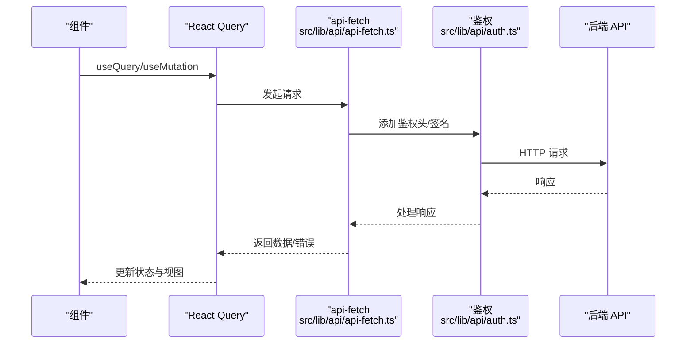

**图表来源**
- [src/lib/api/api-fetch.ts](file://src/lib/api/api-fetch.ts)
- [src/lib/api/auth.ts](file://src/lib/api/auth.ts)
- [src/components/providers/QueryProvider.tsx:10-16](file://src/components/providers/QueryProvider.tsx#L10-L16)

**章节来源**
- [src/lib/api/api-fetch.ts](file://src/lib/api/api-fetch.ts)
- [src/lib/api/auth.ts](file://src/lib/api/auth.ts)
- [src/lib/api/api-config.ts](file://src/lib/api/api-config.ts)
- [src/lib/workspace/index.ts](file://src/lib/workspace/index.ts)
- [src/lib/projects/index.ts](file://src/lib/projects/index.ts)
- [src/lib/assets/index.ts](file://src/lib/assets/index.ts)
- [src/lib/storyboard/index.ts](file://src/lib/storyboard/index.ts)
- [src/lib/novel-promotion/index.ts](file://src/lib/novel-promotion/index.ts)
- [src/features/video-editor/index.ts](file://src/features/video-editor/index.ts)

## UI布局优化

### 导航栏路由预取功能
**新增** 导航栏组件新增路由预取功能，通过 `router.prefetch()` 提升用户体验：

- **预取实现**：在鼠标悬停时预取资产库页面，减少用户点击时的等待时间
- **预取路径**：`router.prefetch({ pathname: '/workspace/asset-hub' })`
- **用户体验**：用户悬停导航项时立即开始预取，点击时直接跳转到已预取的页面

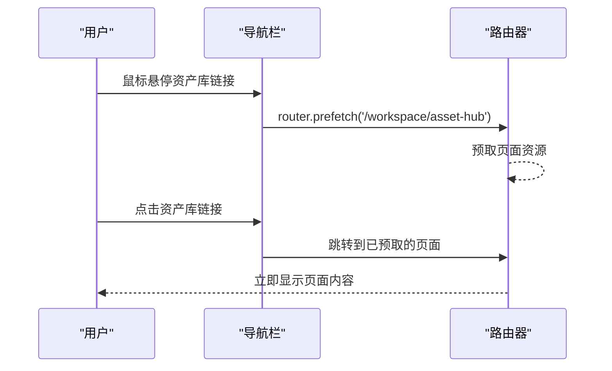

**图表来源**
- [src/components/Navbar.tsx:32-34](file://src/components/Navbar.tsx#L32-L34)

**章节来源**
- [src/components/Navbar.tsx:32-34](file://src/components/Navbar.tsx#L32-L34)

### AssetGrid 组件网格列数优化
**更新** AssetGrid 组件的网格布局从原来的7-8列优化为更合理的4-6列响应式配置，显著提升了在不同屏幕尺寸下的显示效果和用户体验。

- **角色网格**：`grid grid-cols-1 md:grid-cols-2 lg:grid-cols-3 xl:grid-cols-4 2xl:grid-cols-5 3xl:grid-cols-6`
- **场景网格**：`grid grid-cols-1 md:grid-cols-2 lg:grid-cols-3 xl:grid-cols-4 2xl:grid-cols-5 3xl:grid-cols-6`
- **道具网格**：`grid grid-cols-1 md:grid-cols-2 lg:grid-cols-3 xl:grid-cols-4 2xl:grid-cols-5 3xl:grid-cols-6`
- **音色网格**：`grid grid-cols-1 md:grid-cols-2 lg:grid-cols-3 xl:grid-cols-4 2xl:grid-cols-5 3xl:grid-cols-6`

这种优化提供了更好的视觉平衡，特别是在大屏幕设备上能够充分利用空间，同时保持小屏幕设备的可读性和可用性。相比之前的7-8列布局，新的4-6列配置在各种屏幕尺寸下都提供了更佳的用户体验。

**章节来源**
- [src/app/[locale]/workspace/asset-hub/components/AssetGrid.tsx:242](file://src/app/[locale]/workspace/asset-hub/components/AssetGrid.tsx#L242-L242)
- [src/app/[locale]/workspace/asset-hub/components/AssetGrid.tsx:264](file://src/app/[locale]/workspace/asset-hub/components/AssetGrid.tsx#L264-L264)
- [src/app/[locale]/workspace/asset-hub/components/AssetGrid.tsx:283](file://src/app/[locale]/workspace/asset-hub/components/AssetGrid.tsx#L283-L283)
- [src/app/[locale]/workspace/asset-hub/components/AssetGrid.tsx:304](file://src/app/[locale]/workspace/asset-hub/components/AssetGrid.tsx#L304-L304)

### CharacterCard 布局改进
**更新** CharacterCard 组件在多图选择模式下采用了更优化的网格布局，提升了用户选择体验：

- **多图模式网格**：`grid grid-cols-3 lg:grid-cols-4 xl:grid-cols-5 gap-3`
- **单图模式布局**：保持原有的方形比例设计，确保视觉一致性
- **选中状态指示**：改进了选中状态的视觉反馈，使用更明显的成功色调

新增了针对多图选择的优化布局，使用户能够在有限的空间内更好地浏览和选择不同的形象变体。

**章节来源**
- [src/app/[locale]/workspace/asset-hub/components/CharacterCard.tsx:367](file://src/app/[locale]/workspace/asset-hub/components/CharacterCard.tsx#L367-L367)
- [src/app/[locale]/workspace/asset-hub/components/CharacterCard.tsx:463](file://src/app/[locale]/workspace/asset-hub/components/CharacterCard.tsx#L463-L463)

### LocationCard 布局优化
**更新** LocationCard 组件在多图选择模式下采用了更合理的网格配置：

- **多图模式网格**：`grid grid-cols-3 lg:grid-cols-4 xl:grid-cols-5 gap-3`
- **单图模式比例**：根据是否有多个图像选择使用不同的宽高比
  - 多图模式：`aspect-[3/2]` 提供更宽的显示区域
  - 单图模式：`aspect-square` 保持正方形显示

这种优化确保了在不同场景下都能提供最佳的视觉体验，特别是在多图选择时能够更好地展示图像差异。

**章节来源**
- [src/app/[locale]/workspace/asset-hub/components/LocationCard.tsx:331](file://src/app/[locale]/workspace/asset-hub/components/LocationCard.tsx#L331-L331)
- [src/app/[locale]/workspace/asset-hub/components/LocationCard.tsx:453](file://src/app/[locale]/workspace/asset-hub/components/LocationCard.tsx#L453-L453)

### 资产卡片艺术风格显示功能增强
**新增** 资产卡片组件增强了艺术风格显示功能，新增了漫画风格标签和预览：

- **艺术风格标签**：在卡片顶部显示艺术风格标签，如"漫画风"、"精致国漫"等
- **风格分类**：支持 Waoo风格、3D风格、2D动画、真人风格、定格动画等多种风格分类
- **风格预览**：使用简短的中文标签（如"漫"、"国"、"日"、"实"）快速识别风格
- **风格描述**：提供详细的风格描述和中英文提示词，帮助用户理解不同风格特点

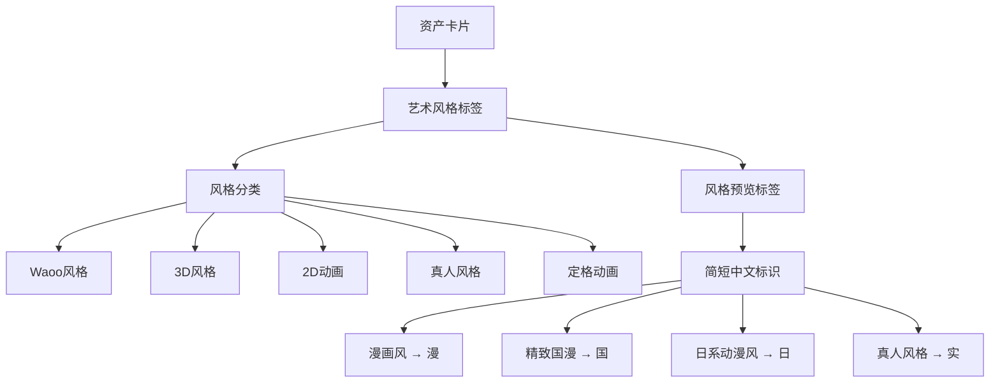

**图表来源**
- [src/lib/constants.ts:149-188](file://src/lib/constants.ts#L149-L188)

**章节来源**
- [src/lib/constants.ts:149-188](file://src/lib/constants.ts#L149-L188)
- [src/app/[locale]/workspace/asset-hub/components/CharacterCard.tsx:280-L284](file://src/app/[locale]/workspace/asset-hub/components/CharacterCard.tsx#L280-L284)
- [src/app/[locale]/workspace/asset-hub/components/LocationCard.tsx:158-L161](file://src/app/[locale]/workspace/asset-hub/components/LocationCard.tsx#L158-L161)

### ImageSectionCandidateMode 候选显示优化
**更新** ImageSectionCandidateMode 组件的候选显示界面进行了重要优化：

- **候选缩略图网格**：`gap-1` 的紧密间距设计，提升空间利用率
- **选中状态视觉**：改进了选中状态的视觉反馈，使用放大效果和强调边框
- **预览功能增强**：为每个候选添加了独立的预览按钮，支持悬停显示
- **确认流程优化**：简化了确认按钮的显示逻辑，提供更直观的操作反馈

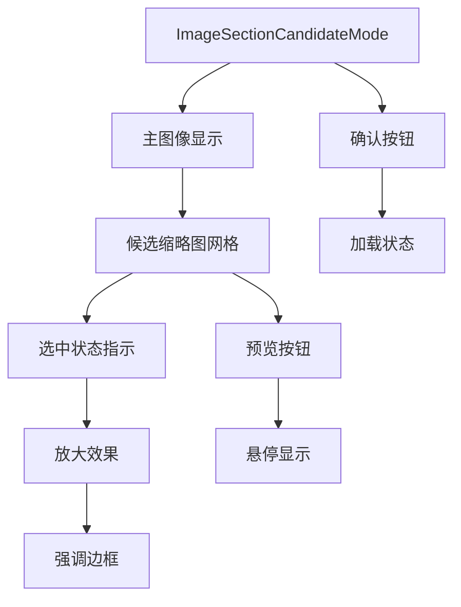

**图表来源**
- [src/app/[locale]/workspace/[projectId]/modes/novel-promotion/components/storyboard/ImageSectionCandidateMode.tsx:65-L156](file://src/app/[locale]/workspace/[projectId]/modes/novel-promotion/components/storyboard/ImageSectionCandidateMode.tsx#L65-L156)

**章节来源**
- [src/app/[locale]/workspace/[projectId]/modes/novel-promotion/components/storyboard/ImageSectionCandidateMode.tsx:65-L156](file://src/app/[locale]/workspace/[projectId]/modes/novel-promotion/components/storyboard/ImageSectionCandidateMode.tsx#L65-L156)

### 布局断点与响应式设计
**更新** 新增了完整的响应式断点配置，确保在不同设备上都能提供最佳体验：

- **移动端**：`grid-cols-1` 基础布局，适应小屏幕
- **平板端**：`md:grid-cols-2` 提升显示密度
- **桌面端**：`lg:grid-cols-3` 最大化空间利用
- **大屏端**：`xl:grid-cols-4` 及以上提供更高的显示密度

这种渐进式的响应式设计确保了从移动设备到超大显示器的完整覆盖，相比之前的7-8列布局，在各个断点上都提供了更合理的显示密度。

**章节来源**
- [src/app/[locale]/workspace/asset-hub/components/AssetGrid.tsx:242](file://src/app/[locale]/workspace/asset-hub/components/AssetGrid.tsx#L242-L242)
- [src/app/[locale]/workspace/asset-hub/components/AssetGrid.tsx:264](file://src/app/[locale]/workspace/asset-hub/components/AssetGrid.tsx#L264-L264)
- [src/app/[locale]/workspace/asset-hub/components/AssetGrid.tsx:283](file://src/app/[locale]/workspace/asset-hub/components/AssetGrid.tsx#L283-L283)
- [src/app/[locale]/workspace/asset-hub/components/AssetGrid.tsx:304](file://src/app/[locale]/workspace/asset-hub/components/AssetGrid.tsx#L304-L304)

## 依赖关系分析
- 运行时依赖：Next.js 15、Next-Intl、Next-Auth、React Query、TailwindCSS v4、Geist 字体、Remotion 等。
- 构建与工具：ESLint、TypeScript、Vitest、Concurrently、Dotenv、Prisma 等。

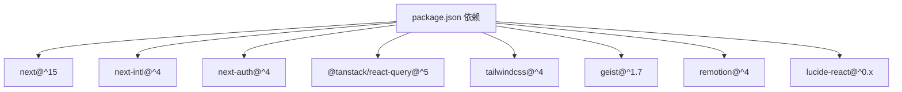

**图表来源**
- [package.json:112-162](file://package.json#L112-L162)

**章节来源**
- [package.json:112-162](file://package.json#L112-L162)

## 性能考量
- 构建期优化：启用严格门禁与 Turbopack 开发体验，减少无效构建。
- 运行时优化：合理使用 React Query 缓存与失效策略，避免过度请求；对大组件与重型库采用动态导入；利用语义样式减少重复样式计算。
- 图片与媒体：结合 CDN 与缓存头策略，减少带宽与延迟。

## 故障排查指南
- 国际化问题
  - 症状：路径无语言前缀或跳转异常。
  - 排查：检查中间件匹配规则与语言检测开关；确认 [src/middleware.ts:18-27](file://src/middleware.ts#L18-L27) 与 [src/i18n.ts:9-16](file://src/i18n.ts#L9-L16)。
- 语言切换无效
  - 症状：切换语言后页面未更新。
  - 排查：确认语言切换器路由替换逻辑与国际化 Provider 注入位置；参考 [src/components/LanguageSwitcher.tsx:70-84](file://src/components/LanguageSwitcher.tsx#L70-L84)。
- 样式不生效
  - 症状：毛玻璃效果或按钮样式异常。
  - 排查：确认语义类与变量令牌引入顺序；检查 [src/app/[locale]/layout.tsx](file://src/app/[locale]/layout.tsx#L8) 与 [src/styles/ui-semantic-glass.css:1-465](file://src/styles/ui-semantic-glass.css#L1-L465)、[src/styles/ui-tokens-glass.css:1-96](file://src/styles/ui-tokens-glass.css#L1-L96)。
- 状态与缓存问题
  - 症状：数据未更新或缓存不一致。
  - 排查：检查 React Query 客户端配置与查询键；参考 [src/lib/query/client.ts](file://src/lib/query/client.ts) 与 [src/components/providers/QueryProvider.tsx:10-16](file://src/components/providers/QueryProvider.tsx#L10-L16)。

**章节来源**
- [src/middleware.ts:18-27](file://src/middleware.ts#L18-L27)
- [src/i18n.ts:9-16](file://src/i18n.ts#L9-L16)
- [src/components/LanguageSwitcher.tsx:70-84](file://src/components/LanguageSwitcher.tsx#L70-L84)
- [src/app/[locale]/layout.tsx](file://src/app/[locale]/layout.tsx#L8)
- [src/styles/ui-semantic-glass.css:1-465](file://src/styles/ui-semantic-glass.css#L1-L465)
- [src/styles/ui-tokens-glass.css:1-96](file://src/styles/ui-tokens-glass.css#L1-L96)
- [src/lib/query/client.ts](file://src/lib/query/client.ts)
- [src/components/providers/QueryProvider.tsx:10-16](file://src/components/providers/QueryProvider.tsx#L10-L16)

## 结论
Waoowaoo 的前端架构以 Next.js 15 App Router 为核心，结合 next-intl 实现稳定的多语言体系，通过 React Query 提供高效的状态与缓存管理，并以 Glass UI 设计系统统一视觉与交互体验。本次 UI 布局优化进一步提升了组件的响应式表现和用户体验，包括新增导航栏路由预取功能、AssetGrid 组件的网格列数优化（从7-8列调整为4-6列）、CharacterCard 和 LocationCard 组件的布局改进，以及资产卡片组件增强的艺术风格显示功能。该架构在国际化、主题系统、样式管理、组件复用、性能优化与 API 集成方面均具备清晰的设计与实施路径，适合构建可维护、可扩展的现代化前端应用。

## 附录
- 类型定义：项目类型定义位于 [src/types/](file://src/types/) 目录，涵盖项目、角色、故事板等核心类型。
- 文档与仪表：文档页与可观测性入口位于 [src/pages/_document.tsx](file://src/pages/_document.tsx) 与 [src/instrumentation.ts](file://src/instrumentation.ts)。

**章节来源**
- [src/types/project.ts](file://src/types/project.ts)
- [src/types/storyboard-types.ts](file://src/types/storyboard-types.ts)
- [src/types/character-profile.ts](file://src/types/character-profile.ts)
- [src/types/next-auth.d.ts](file://src/types/next-auth.d.ts)
- [src/pages/_document.tsx](file://src/pages/_document.tsx)
- [src/instrumentation.ts](file://src/instrumentation.ts)