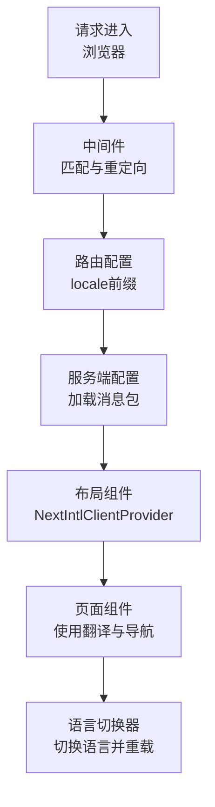
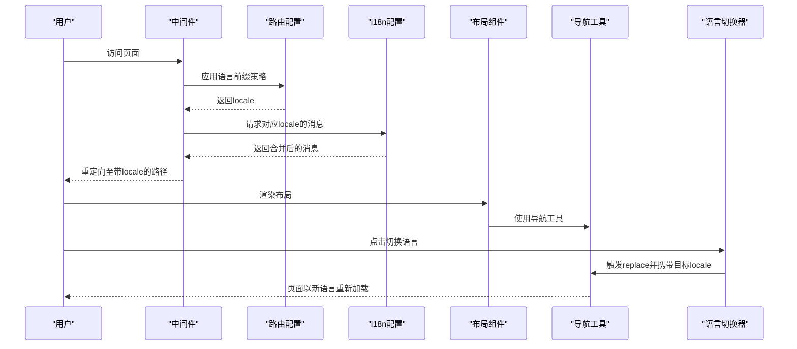
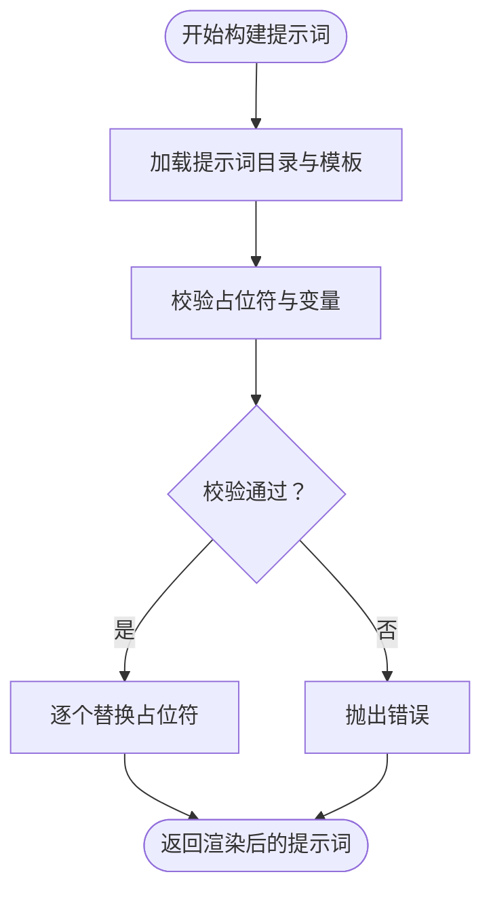
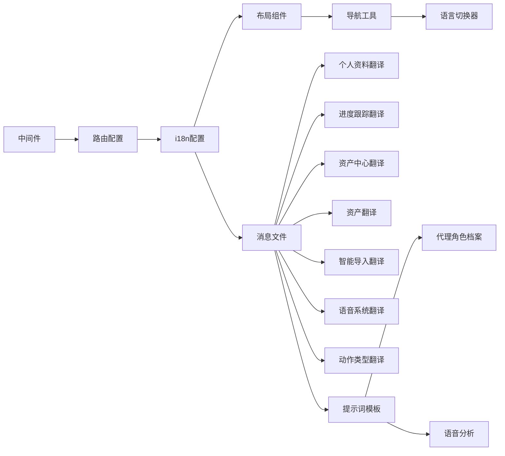

# 国际化实现

<cite>
**本文档引用的文件**
- [src/i18n.ts](file://src/i18n.ts)
- [src/i18n/routing.ts](file://src/i18n/routing.ts)
- [src/i18n/navigation.ts](file://src/i18n/navigation.ts)
- [src/middleware.ts](file://src/middleware.ts)
- [src/app/[locale]/layout.tsx](file://src/app/[locale]/layout.tsx)
- [src/components/LanguageSwitcher.tsx](file://src/components/LanguageSwitcher.tsx)
- [messages/en/layout.json](file://messages/en/layout.json)
- [messages/zh/layout.json](file://messages/zh/layout.json)
- [messages/en/assetHub.json](file://messages/en/assetHub.json)
- [messages/zh/assetHub.json](file://messages/zh/assetHub.json)
- [messages/en/assets.json](file://messages/en/assets.json)
- [messages/zh/assets.json](file://messages/zh/assets.json)
- [messages/en/smartImport.json](file://messages/en/smartImport.json)
- [messages/zh/smartImport.json](file://messages/zh/smartImport.json)
- [messages/en/assetLibrary.json](file://messages/en/assetLibrary.json)
- [messages/zh/assetLibrary.json](file://messages/zh/assetLibrary.json)
- [messages/en/assetPicker.json](file://messages/en/assetPicker.json)
- [messages/zh/assetPicker.json](file://messages/zh/assetPicker.json)
- [messages/en/assetModal.json](file://messages/en/assetModal.json)
- [messages/zh/assetModal.json](file://messages/zh/assetModal.json)
- [messages/en/profile.json](file://messages/en/profile.json)
- [messages/zh/profile.json](file://messages/zh/profile.json)
- [messages/en/progress.json](file://messages/en/progress.json)
- [messages/zh/progress.json](file://messages/zh/progress.json)
- [messages/en/voice.json](file://messages/en/voice.json)
- [messages/zh/voice.json](file://messages/zh/voice.json)
- [messages/en/actions.json](file://messages/en/actions.json)
- [messages/zh/actions.json](file://messages/zh/actions.json)
- [lib/prompts/novel-promotion/voice_analysis.en.txt](file://lib/prompts/novel-promotion/voice_analysis.en.txt)
- [lib/prompts/novel-promotion/voice_analysis.zh.txt](file://lib/prompts/novel-promotion/voice_analysis.zh.txt)
- [lib/prompts/novel-promotion/agent_character_profile.en.txt](file://lib/prompts/novel-promotion/agent_character_profile.en.txt)
- [lib/prompts/novel-promotion/agent_character_profile.zh.txt](file://lib/prompts/novel-promotion/agent_character_profile.zh.txt)
- [src/lib/prompt-i18n/index.ts](file://src/lib/prompt-i18n/index.ts)
- [src/lib/prompt-i18n/build-prompt.ts](file://src/lib/prompt-i18n/build-prompt.ts)
- [src/lib/prompt-i18n/template-store.ts](file://src/lib/prompt-i18n/template-store.ts)
- [src/lib/prompt-i18n/types.ts](file://src/lib/prompt-i18n/types.ts)
- [src/app/[locale]/profile/page.tsx](file://src/app/[locale]/profile/page.tsx)
- [src/lib/task/progress-message.ts](file://src/lib/task/progress-message.ts)
- [package.json](file://package.json)
</cite>

## 更新摘要
**变更内容**
- 新增20多个本地化条目到英语和中文消息文件，涵盖语音部分标题、字段标签、占位符和帮助文本
- 更新代理角色档案提示以包含详细的语音分析指令，增强角色声音特征的分析能力
- 扩展语音生成、声音设计、口型同步等动作类型的国际化支持
- 完善语音分析的多语言提示词模板，支持更精准的台词提取和情绪强度分析

## 目录
1. [简介](#简介)
2. [项目结构](#项目结构)
3. [核心组件](#核心组件)
4. [架构总览](#架构总览)
5. [详细组件分析](#详细组件分析)
6. [用户个人资料国际化](#用户个人资料国际化)
7. [任务进度跟踪国际化](#任务进度跟踪国际化)
8. [资产中心国际化扩展](#资产中心国际化扩展)
9. [语音系统国际化](#语音系统国际化)
10. [代理角色档案国际化](#代理角色档案国际化)
11. [依赖关系分析](#依赖关系分析)
12. [性能考虑](#性能考虑)
13. [故障排除指南](#故障排除指南)
14. [结论](#结论)
15. [附录](#附录)

## 简介
本文件面向Waoowaoo的国际化系统，系统性阐述多语言支持的架构设计与实现细节，覆盖消息文件组织、语言切换机制、本地化资源管理、i18n配置、路由国际化、动态语言加载、文本翻译、日期/数字/货币本地化处理、语言包维护策略、翻译工作流与质量保证、SEO优化、语言检测与默认语言配置，并提供可扩展新语言支持的最佳实践。

**更新** 本次更新重点反映了语音系统和代理角色档案功能的大幅国际化扩展，新增了voice.json消息文件的20多个本地化条目，更新了代理角色档案提示词以包含详细的语音分析指令，显著增强了系统的多语言用户体验和功能完整性。

## 项目结构
Waoowaoo采用基于Next.js App Router的国际化方案，结合next-intl实现服务端与客户端的统一本地化体验。核心结构如下：
- 路由与中间件：通过自定义路由配置与中间件控制语言前缀与跳转行为
- 服务端配置：在请求阶段加载对应语言的消息包，合并为全局消息对象
- 客户端组件：提供语言切换UI与导航工具，配合服务端提供的消息进行渲染
- 提示词国际化：独立的提示词模板与变量校验体系，确保多语言提示词一致性
- 消息文件：按功能域拆分的JSON消息文件，便于维护与增量更新

**图表来源**
- [src/middleware.ts:1-28](file://src/middleware.ts#L1-L28)
- [src/i18n/routing.ts:1-18](file://src/i18n/routing.ts#L1-L18)
- [src/i18n.ts:1-125](file://src/i18n.ts#L1-L125)
- [src/app/[locale]/layout.tsx](file://src/app/[locale]/layout.tsx#L1-L79)

**章节来源**
- [src/i18n/routing.ts:1-18](file://src/i18n/routing.ts#L1-L18)
- [src/middleware.ts:1-28](file://src/middleware.ts#L1-L28)
- [src/i18n.ts:1-125](file://src/i18n.ts#L1-L125)
- [src/app/[locale]/layout.tsx](file://src/app/[locale]/layout.tsx#L1-L79)

## 核心组件
- 路由与语言前缀：定义支持的语言列表、默认语言与URL前缀策略
- 中间件：控制语言检测、跳转与静态参数生成
- 服务端配置：按请求动态加载消息包，合并为全局消息对象
- 布局与客户端提供者：注入翻译上下文，渲染页面
- 语言切换器：提供用户交互式语言切换与确认对话
- 提示词国际化：模板解析、变量校验与缓存
- **用户个人资料国际化**：新增完整的个人资料页面多语言支持
- **任务进度跟踪国际化**：新增详细的任务执行进度和状态跟踪多语言界面
- **语音系统国际化**：新增完整的语音生成、声音设计、口型同步功能多语言支持
- **代理角色档案国际化**：更新角色分析提示词以包含详细的语音特征分析

**章节来源**
- [src/i18n/routing.ts:1-18](file://src/i18n/routing.ts#L1-L18)
- [src/middleware.ts:1-28](file://src/middleware.ts#L1-L28)
- [src/i18n.ts:1-125](file://src/i18n.ts#L1-L125)
- [src/app/[locale]/layout.tsx](file://src/app/[locale]/layout.tsx#L1-L79)
- [src/components/LanguageSwitcher.tsx:1-140](file://src/components/LanguageSwitcher.tsx#L1-L140)
- [src/lib/prompt-i18n/index.ts:1-12](file://src/lib/prompt-i18n/index.ts#L1-L12)

## 架构总览
下图展示了从请求到渲染的完整国际化流程，包括消息加载、导航与语言切换的关键节点。

**图表来源**
- [src/middleware.ts:1-28](file://src/middleware.ts#L1-L28)
- [src/i18n/routing.ts:1-18](file://src/i18n/routing.ts#L1-L18)
- [src/i18n.ts:1-125](file://src/i18n.ts#L1-L125)
- [src/i18n/navigation.ts:1-5](file://src/i18n/navigation.ts#L1-L5)
- [src/components/LanguageSwitcher.tsx:1-140](file://src/components/LanguageSwitcher.tsx#L1-L140)

## 详细组件分析

### 路由国际化与中间件
- 语言前缀策略：始终在URL中显示语言前缀，避免无前缀路径导致的语言漂移
- 默认语言：明确指定默认语言，作为回退与静态参数生成的基础
- 语言检测：关闭自动语言检测，防止根据Accept-Language等头信息自动跳转
- 匹配器：对根路径、带语言前缀路径与非静态资源路径进行匹配，确保重定向逻辑覆盖全站

**章节来源**
- [src/i18n/routing.ts:1-18](file://src/i18n/routing.ts#L1-L18)
- [src/middleware.ts:1-28](file://src/middleware.ts#L1-L28)

### 服务端配置与消息加载
- 请求阶段：在服务端根据请求locale加载对应语言的所有消息模块
- 并行动态加载：使用Promise.all并发加载多个消息文件，提升加载效率
- 消息合并：将各模块消息合并为单一对象，供客户端提供者使用
- 有效性校验：若请求locale不在支持列表内，返回404

**章节来源**
- [src/i18n.ts:1-125](file://src/i18n.ts#L1-L125)

### 布局与客户端提供者
- 动态元数据：根据当前locale读取layout命名空间下的标题与描述，生成SEO元信息
- 静态参数生成：为每个支持的语言生成静态路径，利于预渲染与SEO
- 客户端提供者：将服务端加载的完整消息注入到客户端，使组件可直接使用翻译

**章节来源**
- [src/app/[locale]/layout.tsx](file://src/app/[locale]/layout.tsx#L1-L79)
- [messages/en/layout.json:1-5](file://messages/en/layout.json#L1-L5)
- [messages/zh/layout.json:1-5](file://messages/zh/layout.json#L1-L5)

### 语言切换器
- 用户交互：点击按钮打开语言菜单，选择目标语言
- 切换确认：弹出确认对话框，提示切换后会影响提示词模板、脚本生成与工作流输出语言
- 导航替换：调用导航工具的replace方法，携带目标locale，触发服务端重新加载消息并渲染

**章节来源**
- [src/components/LanguageSwitcher.tsx:1-140](file://src/components/LanguageSwitcher.tsx#L1-L140)
- [src/i18n/navigation.ts:1-5](file://src/i18n/navigation.ts#L1-L5)

### 提示词国际化（Prompt i18n）
- 模板存储：按提示词ID与语言组合读取对应的.txt模板文件，支持缓存减少IO
- 变量校验：严格校验模板占位符与输入变量，确保类型正确且完整
- 占位符替换：支持单花括号与双花括号两种占位符，统一替换变量值
- 错误处理：针对未注册提示词、模板缺失、变量不匹配等情况抛出明确错误

**图表来源**
- [src/lib/prompt-i18n/build-prompt.ts:1-99](file://src/lib/prompt-i18n/build-prompt.ts#L1-L99)
- [src/lib/prompt-i18n/template-store.ts:1-44](file://src/lib/prompt-i18n/template-store.ts#L1-L44)
- [src/lib/prompt-i18n/types.ts:1-18](file://src/lib/prompt-i18n/types.ts#L1-L18)

**章节来源**
- [src/lib/prompt-i18n/index.ts:1-12](file://src/lib/prompt-i18n/index.ts#L1-L12)
- [src/lib/prompt-i18n/build-prompt.ts:1-99](file://src/lib/prompt-i18n/build-prompt.ts#L1-L99)
- [src/lib/prompt-i18n/template-store.ts:1-44](file://src/lib/prompt-i18n/template-store.ts#L1-L44)
- [src/lib/prompt-i18n/types.ts:1-18](file://src/lib/prompt-i18n/types.ts#L1-L18)

## 用户个人资料国际化

### 个人资料页面核心功能国际化
个人资料页面（Profile Page）作为用户账户管理的核心界面，现已实现完整的多语言支持：

#### 用户账户信息
- **用户标识**：用户名称、个人账户、可用余额等基础信息显示
- **账户状态**：开源版本提示、余额显示、冻结状态等账户相关信息
- **总消费统计**：累计消费金额、账户流水等财务信息
- **API配置**：API密钥管理、服务配置等开发者相关设置

#### 导航与菜单
- **侧边栏导航**：API配置、计费记录、账户设置等主要功能入口
- **操作按钮**：退出登录、下载日志、账户交易等常用操作
- **响应式布局**：左侧导航栏与右侧内容区域的多语言界面适配

#### 计费记录与交易
- **交易类型**：充值记录、服务消费、账户流水等交易分类
- **筛选功能**：按类型、按操作的交易记录筛选
- **分页显示**：上一页、下一页的本地化导航与总数统计
- **空状态处理**：无记录时的友好提示信息

**章节来源**
- [messages/en/profile.json:1-110](file://messages/en/profile.json#L1-L110)
- [messages/zh/profile.json:1-110](file://messages/zh/profile.json#L1-L110)
- [src/app/[locale]/profile/page.tsx:1-113](file://src/app/[locale]/profile/page.tsx#L1-L113)

### API配置与服务管理
个人资料页面集成了完整的API配置管理功能：

#### API类型管理
- **服务类型**：图片生成、视频生成、文本分析、语音合成等API服务类型
- **语音服务**：配音、声音设计、口型同步等专业音频服务
- **AI功能**：角色设计、场景设计、道具设计等创意工具

#### 交易记录详情
- **计费明细**：图片数量、分辨率、视频时长、token消耗等详细计费信息
- **操作历史**：服务调用次数、处理时长、API调用等使用统计
- **成本分析**：按类型、按操作的消费统计与趋势分析

**章节来源**
- [messages/en/profile.json:45-109](file://messages/en/profile.json#L45-L109)
- [messages/zh/profile.json:45-109](file://messages/zh/profile.json#L45-L109)

## 任务进度跟踪国际化

### 任务执行进度核心功能国际化
任务进度跟踪系统（Progress Tracking）为用户提供实时的任务执行状态和详细的操作步骤说明：

#### 进度状态管理
- **任务状态**：已完成、失败、进行中、排队中、未开始等标准状态
- **执行阶段**：任务接收、参数准备、步骤执行、结果持久化等关键阶段
- **实时输出**：AI模型输出、推理过程、流式响应等动态内容显示

#### 步骤说明与指导
- **分析阶段**：角色分析、场景分析、道具分析等内容理解步骤
- **转换流程**：故事到剧本、剧本到分镜等内容转换步骤
- **生成过程**：图片生成、视频制作、配音合成等媒体生成步骤

#### 运行时控制
- **控制面板**：停止、最小化等运行时控制功能
- **任务类型**：通用任务、图片生成、视频制作、声音设计等不同类型
- **阶段标题**：实时流、当前阶段、直播AI输出等界面元素

**章节来源**
- [messages/en/progress.json:1-144](file://messages/en/progress.json#L1-L144)
- [messages/zh/progress.json:1-144](file://messages/zh/progress.json#L1-L144)

### 详细任务类型国际化
系统支持超过80种不同的任务类型，每种都有对应的多语言描述：

#### 内容创作类
- **故事扩展**：AI故事扩写、智能分集等创意写作功能
- **内容分析**：全局分析、角色分析、场景分析等智能分析功能
- **文本转换**：剧本转换、分镜规划、分镜细节等格式转换

#### 媒体生成类
- **图片生成**：分镜图片、角色图片、场景图片等视觉内容生成
- **视频制作**：视频生成、片段合成、口型同步等多媒体制作
- **音频处理**：配音生成、声音设计、台词分析等音频相关功能

#### AI设计类
- **角色设计**：项目角色设计、资产库角色设计、资产库角色修改
- **场景设计**：项目场景设计、资产库场景设计、资产库场景修改
- **道具设计**：资产库道具设计、资产库道具修改等创意工具

#### 资产管理类
- **资产中心**：资产库声音设计、资产库生图、资产库修图等资产管理功能
- **参考转换**：参考图转角色、资产库参考图转角色等图像处理功能
- **批量操作**：批量重生成、批量确认等高效操作功能

**章节来源**
- [messages/en/progress.json:44-86](file://messages/en/progress.json#L44-L86)
- [messages/zh/progress.json:44-86](file://messages/zh/progress.json#L44-L86)

### 实时输出与调试信息
任务进度跟踪系统提供了丰富的实时输出和调试信息：

#### LLM模型输出
- **处理状态**：模型处理中、模型输出中、模型推理中等实时状态
- **输出类型**：模型输出完成、模型输出失败等结果状态
- **降级处理**：模型降级为非流式模式等异常处理

#### 阶段执行监控
- **LLM提交**：模型请求提交中、模型流式输出中等执行状态
- **外部服务**：等待外部服务返回、任务入队失败等异步处理
- **代理执行**：LLM任务提交、LLM任务执行、LLM结果保存等代理流程

**章节来源**
- [messages/en/progress.json:22-43](file://messages/en/progress.json#L22-L43)
- [messages/zh/progress.json:22-43](file://messages/zh/progress.json#L22-L43)

## 资产中心国际化扩展

### 资产中心核心功能国际化
资产中心（Asset Hub）作为系统的核心资产管理系统，现已实现完整的多语言支持：

#### 基础功能翻译
- **标题与描述**：资产中心标题、描述、模型提示等基础信息
- **分组管理**：分组创建、编辑、删除的完整生命周期管理
- **资产类型**：角色、场景、道具、音色等多类型资产支持
- **操作按钮**：生成、重新生成、撤销、删除、取消、保存等常用操作

#### 导入导出功能
- **导入资产**：完整的导入流程，包括冲突检测、批量处理选项
- **导出资产**：支持ZIP格式打包下载所有图片资产
- **冲突处理**：智能检测重复资产，提供跳过或覆盖选项
- **进度反馈**：详细的导入进度和结果统计

#### 搜索与过滤
- **搜索占位符**：支持按名称或描述搜索资产
- **分页导航**：上一页、下一页的本地化导航
- **空状态提示**：无资产时的友好引导信息

#### 语音设计集成
- **语音设置**：音色管理、预览、上传等功能
- **AI设计**：语音的AI生成和设计支持
- **语音库**：内置语音库的选择和管理

**章节来源**
- [messages/en/assetHub.json:1-136](file://messages/en/assetHub.json#L1-L136)
- [messages/zh/assetHub.json:1-136](file://messages/zh/assetHub.json#L1-L136)

### 资产管理界面国际化
资产管理系统提供了丰富的界面元素和交互功能：

#### 资产确认阶段
- **确认界面**：角色档案确认、批量确认功能
- **分析功能**：全局资产分析，提取角色和场景信息
- **生成控制**：批量生成、重新生成的完整控制

#### 角色管理
- **角色操作**：添加、编辑、删除角色及其形象
- **主形象与子形象**：支持角色的多种形象状态管理
- **语音设置**：角色的配音设置和管理

#### 场景与道具管理
- **场景描述**：详细的场景描述和环境说明
- **道具管理**：道具的属性描述和图片生成
- **智能修改**：基于AI的描述修改功能

#### 图片编辑功能
- **上传替换**：图片的上传和替换功能
- **编辑提示词**：图片编辑的提示词管理
- **版本控制**：图片生成的历史版本管理

**章节来源**
- [messages/en/assets.json:1-370](file://messages/en/assets.json#L1-L370)
- [messages/zh/assets.json:1-370](file://messages/zh/assets.json#L1-L370)

### 智能导入功能国际化
智能导入（Smart Import）功能提供了强大的文本处理能力：

#### 创建方式选择
- **手动创建**：从第一集开始的创作方式
- **智能导入**：AI自动识别章节结构的导入方式
- **推荐标识**：智能导入的推荐标识和说明

#### 文本上传与处理
- **文件上传**：支持Word、TXT格式的文档上传
- **文本粘贴**：直接粘贴文本内容的功能
- **字数限制**：最大30,000字的支持限制

#### 分析与预览
- **AI分析**：智能识别章节结构和分集
- **预览功能**：分集结果的预览和确认
- **重新分析**：支持重新进行智能分析

#### 全局分析
- **资产提取**：从完整作品中提取角色和场景
- **一致性保证**：确保角色形象在所有剧集中保持一致
- **分析结果**：详细的分析结果和统计数据

**章节来源**
- [messages/en/smartImport.json:1-168](file://messages/en/smartImport.json#L1-L168)
- [messages/zh/smartImport.json:1-168](file://messages/zh/smartImport.json#L1-L168)

### 资产库与选择器国际化
系统还提供了资产库和选择器的完整多语言支持：

#### 资产库功能
- **资产浏览**：角色、场景、道具的分类浏览
- **生成控制**：批量生成和重新生成功能
- **分析功能**：资产的智能分析和管理

#### 资产选择器
- **选择界面**：从资产中心选择各种类型的资产
- **搜索功能**：支持按名称和文件夹搜索资产
- **导入功能**：支持从资产中心导入资产到项目

#### 模态框组件
- **角色创建**：角色的详细创建和编辑界面
- **场景创建**：场景的描述和管理界面
- **道具创建**：道具的属性和描述管理
- **AI设计**：各种资产类型的AI设计功能

**章节来源**
- [messages/en/assetLibrary.json:1-18](file://messages/en/assetLibrary.json#L1-L18)
- [messages/zh/assetLibrary.json:1-18](file://messages/zh/assetLibrary.json#L1-L18)
- [messages/en/assetPicker.json:1-20](file://messages/en/assetPicker.json#L1-L20)
- [messages/zh/assetPicker.json:1-20](file://messages/zh/assetPicker.json#L1-L20)
- [messages/en/assetModal.json:1-101](file://messages/en/assetModal.json#L1-L101)
- [messages/zh/assetModal.json:1-101](file://messages/zh/assetModal.json#L1-L101)

## 语音系统国际化

### 语音功能核心国际化
语音系统（Voice System）作为多媒体内容生成的重要组成部分，现已实现完整的多语言支持：

#### 语音行管理
- **标题与统计**：语音行总数、已生成音频数量等统计信息
- **情绪设置**：情感提示词、情感强度调节等情绪控制功能
- **生成控制**：一键生成所有配音、下载配音等批量操作

#### 发言人音色管理
- **状态显示**：音色配置状态、待设置音色等状态指示
- **音色设置**：AI设计音色、上传参考音频、音色库选择等功能
- **播放控制**：播放当前音色、试听音色等音频控制

#### 内联绑定功能
- **音色设置**：为不在资产库中的发言人设置参考音色
- **上传选项**：上传参考音频、AI设计音色等设置方式
- **提示信息**：上传格式要求、文件大小限制等使用指导

#### 行编辑器
- **添加编辑**：添加语音行、编辑语音行等基本操作
- **字段标签**：台词内容、发言人、绑定镜头等字段标签
- **占位符提示**：输入内容的占位符和提示信息

#### 空状态处理
- **引导信息**：从剧本中提取台词和发言人的引导说明
- **操作按钮**：分析台词、添加语音等操作按钮
- **提示信息**：请先在资产库为角色上传参考音频等提示

**章节来源**
- [messages/en/voice.json:1-258](file://messages/en/voice.json#L1-L258)
- [messages/zh/voice.json:1-258](file://messages/zh/voice.json#L1-L258)

### 语音生成与声音设计
语音系统提供了完整的语音生成和声音设计功能：

#### 语音生成界面
- **生成状态**：生成中、打包中、统计信息等状态显示
- **批量操作**：生成所有配音、下载所有配音等批量功能
- **进度反馈**：生成进度、待生成数量等实时反馈

#### 声音设计功能
- **预设样式**：男播音、温柔女、成熟男等预设声音样式
- **自定义描述**：声音特征描述、生成方案数量等自定义选项
- **预览功能**：声音预览、播放状态等音频控制

#### TTS集成
- **音频统计**：生成音频时长、字幕数量等统计信息
- **播放控制**：播放音频、重新生成TTS等控制功能
- **浏览器兼容**：浏览器不支持音频播放等兼容性提示

**章节来源**
- [messages/en/voice.json:183-256](file://messages/en/voice.json#L183-L256)
- [messages/zh/voice.json:183-256](file://messages/zh/voice.json#L183-L256)

### 语音动作类型国际化
系统支持多种语音相关的动作类型，均已实现多语言支持：

#### 核心动作类型
- **配音生成**：Voice Generation的多语言支持
- **声音设计**：Voice Design的多语言支持
- **口型同步**：Lip Sync的多语言支持
- **文本转语音**：Text-to-Speech的多语言支持

#### 相关操作
- **分镜分析**：Storyboard Analysis的多语言支持
- **片段切割**：Clip Splitting的多语言支持
- **角色分析**：Character Analysis的多语言支持
- **场景分析**：Location Analysis的多语言支持

**章节来源**
- [messages/en/actions.json:1-18](file://messages/en/actions.json#L1-L18)
- [messages/zh/actions.json:1-18](file://messages/zh/actions.json#L1-L18)

## 代理角色档案国际化

### 角色档案分析功能
代理角色档案（Agent Character Profile）功能通过AI分析文本内容，生成结构化的角色档案信息：

#### 角色识别与筛选
- **必须提取角色**：有台词且参与剧情互动的角色
- **排除角色**：无名无特征的纯路人、仅被提及的角色
- **筛选标准**：是否需要制作形象图、是否在画面中有实际出镜

#### 角色介绍规则
- **叙述视角映射**：明确第一人称"我"对应的角色
- **角色身份定位**：主角、配角、反派等身份描述
- **角色关系**：与其他主要角色的关系说明
- **称呼映射**：其他角色对此角色的常用称呼

#### 角色重要性层级
- **S级（绝对主角）**：故事的核心视角人物
- **A级（核心配角）**：与主角有大量互动的重要角色
- **B级（重要配角）**：多次出场、有名有姓的角色
- **C级（次要角色）**：偶尔出场、戏份较少的角色
- **D级（群众演员）**：有短暂出镜需求的小角色

#### 服装华丽度层级
- **5级（皇室/顶奢级）**：皇室成员、顶级富豪
- **4级（贵族/精英级）**：贵族、企业家
- **3级（专业/品质级）**：中产阶级、专业人士
- **2级（日常/普通级）**：普通人、学生
- **1级（朴素/统一级）**：平民、底层劳动者

**章节来源**
- [lib/prompts/novel-promotion/agent_character_profile.en.txt:1-290](file://lib/prompts/novel-promotion/agent_character_profile.en.txt#L1-L290)
- [lib/prompts/novel-promotion/agent_character_profile.zh.txt:1-290](file://lib/prompts/novel-promotion/agent_character_profile.zh.txt#L1-L290)

### 语音特征分析增强
更新后的代理角色档案提示词包含了详细的语音分析指令：

#### 音色特征分析
- **音色性别**：男/女/中性（允许与视觉性别不同）
- **音色年龄组**：少年/青年/中年/老年
- **音色音调**：低沉磁性/清脆明亮/沙哑沧桑等音调特征
- **语速控制**：慢/中/快的语速调节
- **情感风格**：冷静克制/热情奔放/慵懒随意等情感风格

#### 音色特征标签
- **额外音色特征**：磁性、有共鸣感、气泡音、鼻音重等标签
- **方言口音**：默认标准普通话，除非角色有明确方言设定
- **音色描述组装**：将特征组装为不超过500字符的自然语言描述

#### 音色映射示例
- **霸道总裁**：成熟男性，三十岁左右，声音低沉有磁性
- **温柔女主**：温柔女性，二十多岁，声音柔和甜美
- **老年智者**：老年男性，六十岁以上，声音沙哑沧桑
- **活泼少女**：少女，十六七岁，声音清脆明亮

**章节来源**
- [lib/prompts/novel-promotion/agent_character_profile.en.txt:138-162](file://lib/prompts/novel-promotion/agent_character_profile.en.txt#L138-L162)
- [lib/prompts/novel-promotion/agent_character_profile.zh.txt:138-162](file://lib/prompts/novel-promotion/agent_character_profile.zh.txt#L138-L162)

### 子形象筛选规则
分析原文中角色是否有多个视觉形态，输出到expected_appearances字段：

#### 需要记录的子形象
- **衣着变化**：换装、更换正装/休闲装、穿戴盔甲等
- **年龄变化**：穿越、回忆场景中的年轻/年老状态
- **特殊装扮**：出浴（围浴巾）、冒充他人的装扮
- **发型改变**：剪头、编发、盘发、披发等持续性外观变化

#### 不需要记录的临时状态
- **情绪/心理状态**：生气、开心、难过、紧张等
- **健康状态**：生病、发烧等（除非有明显视觉特征）
- **临时动作**：跑步、跳跃、战斗姿势等
- **抽象描述**：蒙上了一层阴影、眼神变了等

**章节来源**
- [lib/prompts/novel-promotion/agent_character_profile.en.txt:164-187](file://lib/prompts/novel-promotion/agent_character_profile.en.txt#L164-L187)
- [lib/prompts/novel-promotion/agent_character_profile.zh.txt:164-187](file://lib/prompts/novel-promotion/agent_character_profile.zh.txt#L164-L187)

### 语音分析提示词
语音分析（Voice Analysis）提示词用于从文本中提取需要配音的对话台词：

#### 台词提取规则
- **提取类型**：带引号的对话、直接引语、内心独白等
- **排除内容**：叙述性文字、动作描写、场景描述等
- **输出格式**：严格JSON数组格式，禁止markdown标记

#### 情绪强度分析
- **强度范围**：0.1-0.5之间的数值
- **情绪类型**：平静/陈述、疑惑/好奇、惊讶/意外、生气/愤怒等
- **强度标准**：根据台词的情绪激烈程度确定

#### 发言人识别与匹配
- **发言人识别**：根据上下文推断发言人
- **镜头匹配**：按顺序+发言人一致性+语义相关性匹配
- **多音字处理**：为确保TTS语音合成发音正确进行多音字替换

**章节来源**
- [lib/prompts/novel-promotion/voice_analysis.en.txt:1-40](file://lib/prompts/novel-promotion/voice_analysis.en.txt#L1-L40)
- [lib/prompts/novel-promotion/voice_analysis.zh.txt:1-123](file://lib/prompts/novel-promotion/voice_analysis.zh.txt#L1-L123)

## 依赖关系分析
- 组件耦合：语言切换器依赖导航工具；布局组件依赖服务端配置提供的消息；中间件依赖路由配置
- 外部依赖：next-intl提供国际化能力；提示词国际化依赖文件系统与缓存
- 潜在循环：当前结构清晰，无明显循环依赖
- **用户个人资料扩展**：新增的profile.json消息文件与现有架构无缝集成
- **任务进度扩展**：新增的progress.json消息文件与任务执行系统深度集成
- **语音系统扩展**：新增的voice.json消息文件与语音生成系统全面集成
- **代理角色档案扩展**：更新的agent_character_profile提示词与角色分析系统深度集成

**图表来源**
- [src/middleware.ts:1-28](file://src/middleware.ts#L1-L28)
- [src/i18n/routing.ts:1-18](file://src/i18n/routing.ts#L1-L18)
- [src/i18n.ts:1-125](file://src/i18n.ts#L1-L125)
- [src/app/[locale]/layout.tsx](file://src/app/[locale]/layout.tsx#L1-L79)
- [src/i18n/navigation.ts:1-5](file://src/i18n/navigation.ts#L1-L5)
- [src/components/LanguageSwitcher.tsx:1-140](file://src/components/LanguageSwitcher.tsx#L1-L140)

**章节来源**
- [src/middleware.ts:1-28](file://src/middleware.ts#L1-L28)
- [src/i18n/routing.ts:1-18](file://src/i18n/routing.ts#L1-L18)
- [src/i18n.ts:1-125](file://src/i18n.ts#L1-L125)
- [src/app/[locale]/layout.tsx](file://src/app/[locale]/layout.tsx#L1-L79)
- [src/i18n/navigation.ts:1-5](file://src/i18n/navigation.ts#L1-L5)
- [src/components/LanguageSwitcher.tsx:1-140](file://src/components/LanguageSwitcher.tsx#L1-L140)

## 性能考虑
- 并行动态加载：服务端配置中使用Promise.all并发加载消息文件，显著降低首屏加载时间
- 模板缓存：提示词模板采用内存缓存，避免重复读取文件系统
- 静态参数生成：为每种语言生成静态路径，有利于预渲染与CDN缓存
- 语言检测关闭：避免根据请求头自动跳转带来的额外判断与重定向开销
- **用户个人资料优化**：新增的profile.json和progress.json文件采用模块化设计，按需加载减少内存占用
- **任务进度缓存**：进度跟踪系统中的常用状态和步骤采用缓存机制，提升实时响应性能
- **语音系统优化**：voice.json文件采用分模块设计，支持按需加载语音相关的翻译键
- **提示词缓存**：代理角色档案和语音分析的提示词模板采用缓存机制，提升AI分析性能

**章节来源**
- [src/i18n.ts:1-125](file://src/i18n.ts#L1-L125)
- [src/lib/prompt-i18n/template-store.ts:1-44](file://src/lib/prompt-i18n/template-store.ts#L1-L44)
- [src/middleware.ts:1-28](file://src/middleware.ts#L1-L28)

## 故障排除指南
- 404语言无效：当请求的locale不在支持列表时，服务端将返回404。检查路由配置中的语言列表与中间件匹配规则
- 消息缺失：若某消息键在目标语言文件中缺失，客户端渲染可能显示键名而非翻译文本。建议在CI中加入消息键一致性检查
- 提示词模板缺失：当提示词模板文件不存在或拼写错误时，会抛出明确错误。检查提示词ID与模板文件路径
- 变量类型错误：提示词构建时要求变量为字符串类型，否则抛出错误。确保调用方传入正确的变量类型
- 语言切换无效：若切换后页面未更新，检查导航工具的replace调用与中间件的locale前缀策略
- **个人资料问题**：新增的个人资料功能如出现翻译缺失，检查profile.json文件的完整性和键名一致性
- **进度跟踪问题**：任务进度跟踪如出现状态显示异常，检查progress.json中对应的状态键是否存在
- **资产中心问题**：新增的资产中心功能如出现翻译缺失，检查对应的assetHub.json、assets.json等文件是否完整
- **语音系统问题**：新增的语音功能如出现翻译缺失，检查voice.json文件的完整性和键名一致性
- **代理角色档案问题**：更新后的代理角色档案功能如出现提示词缺失，检查agent_character_profile提示词文件的完整性和模板路径

**章节来源**
- [src/i18n.ts:1-125](file://src/i18n.ts#L1-L125)
- [src/lib/prompt-i18n/build-prompt.ts:1-99](file://src/lib/prompt-i18n/build-prompt.ts#L1-L99)
- [src/lib/prompt-i18n/template-store.ts:1-44](file://src/lib/prompt-i18n/template-store.ts#L1-L44)
- [src/middleware.ts:1-28](file://src/middleware.ts#L1-L28)

## 结论
Waoowaoo的国际化系统以next-intl为核心，结合自定义路由与中间件，实现了稳定、可控且高性能的多语言体验。通过消息文件模块化、服务端并发加载与客户端提供者注入，系统在保证一致性的同时具备良好的扩展性。提示词国际化提供了严格的模板与变量校验，确保跨语言的一致性与可维护性。

**更新** 本次语音系统和代理角色档案功能的大幅国际化扩展显著增强了系统的多语言用户体验，新增的258个语音相关翻译键、更新的代理角色档案提示词以及相关的动作类型翻译，为用户提供了完整的多语言音频内容生成和角色分析体验。新增的voice.json文件涵盖了从基础语音行管理到高级声音设计的全方位多语言支持，更新的agent_character_profile提示词增强了角色声音特征的分析能力，建议在后续迭代中持续完善消息键校验与提示词回归测试，以保障国际化质量。

## 附录

### 扩展新语言支持的步骤
- 在路由配置中添加新语言代码
- 在消息目录下新增对应语言的JSON文件，保持键名一致
- 如涉及提示词，新增对应语言的.txt模板文件
- 更新静态参数生成逻辑，确保新语言路径被预渲染
- 在语言切换器中添加新语言标签与切换文案
- 运行CI中的国际化检查脚本，确保无遗漏
- **用户个人资料扩展**：对于新增的个人资料功能，确保profile.json文件的完整性和一致性
- **任务进度扩展**：对于新增的任务进度跟踪功能，确保progress.json文件的完整性和状态键一致性
- **资产中心扩展**：对于新增的资产中心功能，确保assetHub.json、assets.json、smartImport.json等相关文件的完整性和一致性
- **语音系统扩展**：对于新增的语音功能，确保voice.json文件的完整性和键名一致性
- **代理角色档案扩展**：对于更新的代理角色档案功能，确保agent_character_profile提示词文件的完整性和模板路径正确

**章节来源**
- [src/i18n/routing.ts:1-18](file://src/i18n/routing.ts#L1-L18)
- [src/i18n.ts:1-125](file://src/i18n.ts#L1-L125)
- [src/lib/prompt-i18n/template-store.ts:1-44](file://src/lib/prompt-i18n/template-store.ts#L1-L44)
- [src/components/LanguageSwitcher.tsx:1-140](file://src/components/LanguageSwitcher.tsx#L1-L140)
- [package.json:62-66](file://package.json#L62-L66)