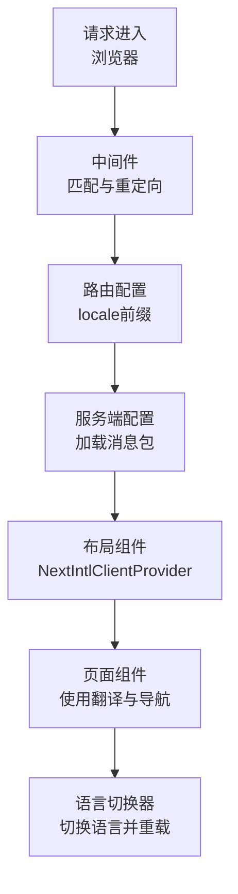
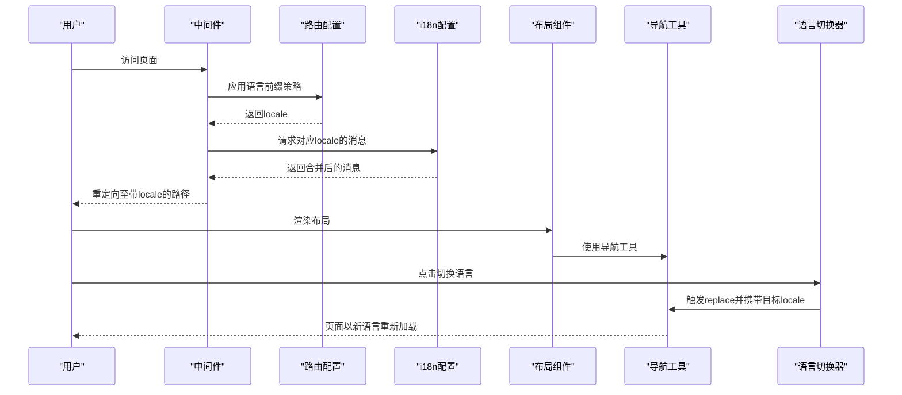
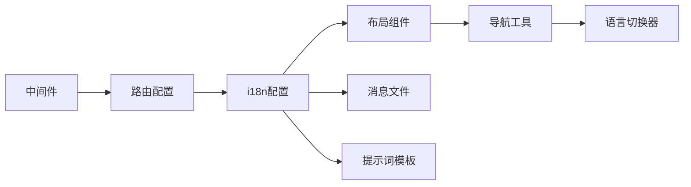

# 国际化实现

<cite>
**本文档引用的文件**
- [src/i18n.ts](file://src/i18n.ts)
- [src/i18n/routing.ts](file://src/i18n/routing.ts)
- [src/i18n/navigation.ts](file://src/i18n/navigation.ts)
- [src/middleware.ts](file://src/middleware.ts)
- [src/app/[locale]/layout.tsx](file://src/app/[locale]/layout.tsx)
- [src/components/LanguageSwitcher.tsx](file://src/components/LanguageSwitcher.tsx)
- [messages/en/layout.json](file://messages/en/layout.json)
- [messages/zh/layout.json](file://messages/zh/layout.json)
- [src/lib/prompt-i18n/index.ts](file://src/lib/prompt-i18n/index.ts)
- [src/lib/prompt-i18n/build-prompt.ts](file://src/lib/prompt-i18n/build-prompt.ts)
- [src/lib/prompt-i18n/template-store.ts](file://src/lib/prompt-i18n/template-store.ts)
- [src/lib/prompt-i18n/types.ts](file://src/lib/prompt-i18n/types.ts)
- [package.json](file://package.json)
</cite>

## 目录
1. [简介](#简介)
2. [项目结构](#项目结构)
3. [核心组件](#核心组件)
4. [架构总览](#架构总览)
5. [详细组件分析](#详细组件分析)
6. [依赖关系分析](#依赖关系分析)
7. [性能考虑](#性能考虑)
8. [故障排除指南](#故障排除指南)
9. [结论](#结论)
10. [附录](#附录)

## 简介
本文件面向Waoowaoo的国际化系统，系统性阐述多语言支持的架构设计与实现细节，覆盖消息文件组织、语言切换机制、本地化资源管理、i18n配置、路由国际化、动态语言加载、文本翻译、日期/数字/货币本地化处理、语言包维护策略、翻译工作流与质量保证、SEO优化、语言检测与默认语言配置，并提供可扩展新语言支持的最佳实践。

## 项目结构
Waoowaoo采用基于Next.js App Router的国际化方案，结合next-intl实现服务端与客户端的统一本地化体验。核心结构如下：
- 路由与中间件：通过自定义路由配置与中间件控制语言前缀与跳转行为
- 服务端配置：在请求阶段加载对应语言的消息包，合并为全局消息对象
- 客户端组件：提供语言切换UI与导航工具，配合服务端提供的消息进行渲染
- 提示词国际化：独立的提示词模板与变量校验体系，确保多语言提示词一致性
- 消息文件：按功能域拆分的JSON消息文件，便于维护与增量更新

图表来源
- [src/middleware.ts:1-28](file://src/middleware.ts#L1-L28)
- [src/i18n/routing.ts:1-18](file://src/i18n/routing.ts#L1-L18)
- [src/i18n.ts:1-125](file://src/i18n.ts#L1-L125)
- [src/app/[locale]/layout.tsx](file://src/app/[locale]/layout.tsx#L1-L79)

章节来源
- [src/i18n/routing.ts:1-18](file://src/i18n/routing.ts#L1-L18)
- [src/middleware.ts:1-28](file://src/middleware.ts#L1-L28)
- [src/i18n.ts:1-125](file://src/i18n.ts#L1-L125)
- [src/app/[locale]/layout.tsx](file://src/app/[locale]/layout.tsx#L1-L79)

## 核心组件
- 路由与语言前缀：定义支持的语言列表、默认语言与URL前缀策略
- 中间件：控制语言检测、跳转与静态参数生成
- 服务端配置：按请求动态加载消息包，合并为全局消息对象
- 布局与客户端提供者：注入翻译上下文，渲染页面
- 语言切换器：提供用户交互式语言切换与确认对话
- 提示词国际化：模板解析、变量校验与缓存

章节来源
- [src/i18n/routing.ts:1-18](file://src/i18n/routing.ts#L1-L18)
- [src/middleware.ts:1-28](file://src/middleware.ts#L1-L28)
- [src/i18n.ts:1-125](file://src/i18n.ts#L1-L125)
- [src/app/[locale]/layout.tsx](file://src/app/[locale]/layout.tsx#L1-L79)
- [src/components/LanguageSwitcher.tsx:1-140](file://src/components/LanguageSwitcher.tsx#L1-L140)
- [src/lib/prompt-i18n/index.ts:1-12](file://src/lib/prompt-i18n/index.ts#L1-L12)

## 架构总览
下图展示了从请求到渲染的完整国际化流程，包括消息加载、导航与语言切换的关键节点。

图表来源
- [src/middleware.ts:1-28](file://src/middleware.ts#L1-L28)
- [src/i18n/routing.ts:1-18](file://src/i18n/routing.ts#L1-L18)
- [src/i18n.ts:1-125](file://src/i18n.ts#L1-L125)
- [src/i18n/navigation.ts:1-5](file://src/i18n/navigation.ts#L1-L5)
- [src/components/LanguageSwitcher.tsx:1-140](file://src/components/LanguageSwitcher.tsx#L1-L140)

## 详细组件分析

### 路由国际化与中间件
- 语言前缀策略：始终在URL中显示语言前缀，避免无前缀路径导致的语言漂移
- 默认语言：明确指定默认语言，作为回退与静态参数生成的基础
- 语言检测：关闭自动语言检测，防止根据Accept-Language等头信息自动跳转
- 匹配器：对根路径、带语言前缀路径与非静态资源路径进行匹配，确保重定向逻辑覆盖全站

章节来源
- [src/i18n/routing.ts:1-18](file://src/i18n/routing.ts#L1-L18)
- [src/middleware.ts:1-28](file://src/middleware.ts#L1-L28)

### 服务端配置与消息加载
- 请求阶段：在服务端根据请求locale加载对应语言的所有消息模块
- 并行动态加载：使用Promise.all并发加载多个消息文件，提升加载效率
- 消息合并：将各模块消息合并为单一对象，供客户端提供者使用
- 有效性校验：若请求locale不在支持列表内，返回404

章节来源
- [src/i18n.ts:1-125](file://src/i18n.ts#L1-L125)

### 布局与客户端提供者
- 动态元数据：根据当前locale读取layout命名空间下的标题与描述，生成SEO元信息
- 静态参数生成：为每个支持的语言生成静态路径，利于预渲染与SEO
- 客户端提供者：将服务端加载的完整消息注入到客户端，使组件可直接使用翻译

章节来源
- [src/app/[locale]/layout.tsx](file://src/app/[locale]/layout.tsx#L1-L79)
- [messages/en/layout.json:1-5](file://messages/en/layout.json#L1-L5)
- [messages/zh/layout.json:1-5](file://messages/zh/layout.json#L1-L5)

### 语言切换器
- 用户交互：点击按钮打开语言菜单，选择目标语言
- 切换确认：弹出确认对话框，提示切换后会影响提示词模板、脚本生成与工作流输出语言
- 导航替换：调用导航工具的replace方法，携带目标locale，触发服务端重新加载消息并渲染

章节来源
- [src/components/LanguageSwitcher.tsx:1-140](file://src/components/LanguageSwitcher.tsx#L1-L140)
- [src/i18n/navigation.ts:1-5](file://src/i18n/navigation.ts#L1-L5)

### 提示词国际化（Prompt i18n）
- 模板存储：按提示词ID与语言组合读取对应的.txt模板文件，支持缓存减少IO
- 变量校验：严格校验模板占位符与输入变量，确保类型正确且完整
- 占位符替换：支持单花括号与双花括号两种占位符，统一替换变量值
- 错误处理：针对未注册提示词、模板缺失、变量不匹配等情况抛出明确错误

图表来源
- [src/lib/prompt-i18n/build-prompt.ts:1-99](file://src/lib/prompt-i18n/build-prompt.ts#L1-L99)
- [src/lib/prompt-i18n/template-store.ts:1-44](file://src/lib/prompt-i18n/template-store.ts#L1-L44)
- [src/lib/prompt-i18n/types.ts:1-18](file://src/lib/prompt-i18n/types.ts#L1-L18)

章节来源
- [src/lib/prompt-i18n/index.ts:1-12](file://src/lib/prompt-i18n/index.ts#L1-L12)
- [src/lib/prompt-i18n/build-prompt.ts:1-99](file://src/lib/prompt-i18n/build-prompt.ts#L1-L99)
- [src/lib/prompt-i18n/template-store.ts:1-44](file://src/lib/prompt-i18n/template-store.ts#L1-L44)
- [src/lib/prompt-i18n/types.ts:1-18](file://src/lib/prompt-i18n/types.ts#L1-L18)

## 依赖关系分析
- 组件耦合：语言切换器依赖导航工具；布局组件依赖服务端配置提供的消息；中间件依赖路由配置
- 外部依赖：next-intl提供国际化能力；提示词国际化依赖文件系统与缓存
- 潜在循环：当前结构清晰，无明显循环依赖

图表来源
- [src/middleware.ts:1-28](file://src/middleware.ts#L1-L28)
- [src/i18n/routing.ts:1-18](file://src/i18n/routing.ts#L1-L18)
- [src/i18n.ts:1-125](file://src/i18n.ts#L1-L125)
- [src/app/[locale]/layout.tsx](file://src/app/[locale]/layout.tsx#L1-L79)
- [src/i18n/navigation.ts:1-5](file://src/i18n/navigation.ts#L1-L5)
- [src/components/LanguageSwitcher.tsx:1-140](file://src/components/LanguageSwitcher.tsx#L1-L140)

章节来源
- [src/middleware.ts:1-28](file://src/middleware.ts#L1-L28)
- [src/i18n/routing.ts:1-18](file://src/i18n/routing.ts#L1-L18)
- [src/i18n.ts:1-125](file://src/i18n.ts#L1-L125)
- [src/app/[locale]/layout.tsx](file://src/app/[locale]/layout.tsx#L1-L79)
- [src/i18n/navigation.ts:1-5](file://src/i18n/navigation.ts#L1-L5)
- [src/components/LanguageSwitcher.tsx:1-140](file://src/components/LanguageSwitcher.tsx#L1-L140)

## 性能考虑
- 并行动态加载：服务端配置中使用Promise.all并发加载消息文件，显著降低首屏加载时间
- 模板缓存：提示词模板采用内存缓存，避免重复读取文件系统
- 静态参数生成：为每种语言生成静态路径，有利于预渲染与CDN缓存
- 语言检测关闭：避免根据请求头自动跳转带来的额外判断与重定向开销

章节来源
- [src/i18n.ts:1-125](file://src/i18n.ts#L1-L125)
- [src/lib/prompt-i18n/template-store.ts:1-44](file://src/lib/prompt-i18n/template-store.ts#L1-L44)
- [src/middleware.ts:1-28](file://src/middleware.ts#L1-L28)

## 故障排除指南
- 404语言无效：当请求的locale不在支持列表时，服务端将返回404。检查路由配置中的语言列表与中间件匹配规则
- 消息缺失：若某消息键在目标语言文件中缺失，客户端渲染可能显示键名而非翻译文本。建议在CI中加入消息键一致性检查
- 提示词模板缺失：当提示词模板文件不存在或拼写错误时，会抛出明确错误。检查提示词ID与模板文件路径
- 变量类型错误：提示词构建时要求变量为字符串类型，否则抛出错误。确保调用方传入正确的变量类型
- 语言切换无效：若切换后页面未更新，检查导航工具的replace调用与中间件的locale前缀策略

章节来源
- [src/i18n.ts:1-125](file://src/i18n.ts#L1-L125)
- [src/lib/prompt-i18n/build-prompt.ts:1-99](file://src/lib/prompt-i18n/build-prompt.ts#L1-L99)
- [src/lib/prompt-i18n/template-store.ts:1-44](file://src/lib/prompt-i18n/template-store.ts#L1-L44)
- [src/middleware.ts:1-28](file://src/middleware.ts#L1-L28)

## 结论
Waoowaoo的国际化系统以next-intl为核心，结合自定义路由与中间件，实现了稳定、可控且高性能的多语言体验。通过消息文件模块化、服务端并发加载与客户端提供者注入，系统在保证一致性的同时具备良好的扩展性。提示词国际化提供了严格的模板与变量校验，确保跨语言的一致性与可维护性。建议在后续迭代中持续完善消息键校验与提示词回归测试，以保障国际化质量。

## 附录

### 扩展新语言支持的步骤
- 在路由配置中添加新语言代码
- 在消息目录下新增对应语言的JSON文件，保持键名一致
- 如涉及提示词，新增对应语言的.txt模板文件
- 更新静态参数生成逻辑，确保新语言路径被预渲染
- 在语言切换器中添加新语言标签与切换文案
- 运行CI中的国际化检查脚本，确保无遗漏

章节来源
- [src/i18n/routing.ts:1-18](file://src/i18n/routing.ts#L1-L18)
- [src/i18n.ts:1-125](file://src/i18n.ts#L1-L125)
- [src/lib/prompt-i18n/template-store.ts:1-44](file://src/lib/prompt-i18n/template-store.ts#L1-L44)
- [src/components/LanguageSwitcher.tsx:1-140](file://src/components/LanguageSwitcher.tsx#L1-L140)
- [package.json:62-66](file://package.json#L62-L66)